# MƯỜI KHÁI NIỆM NỀN TẢNG TRONG PHÁT TRIỂN BACKEND

## Lời mở đầu

Trong kiến trúc của một hệ thống phần mềm hiện đại, backend đóng vai trò là "bộ não" xử lý logic nghiệp vụ, quản lý dữ liệu và đảm bảo hệ thống vận hành ổn định dưới áp lực của hàng nghìn, thậm chí hàng triệu người dùng truy cập đồng thời. Để xây dựng được một hệ thống backend vững chắc, người kỹ sư phần mềm cần nắm vững không chỉ cú pháp lập trình mà còn phải hiểu sâu sắc bản chất của các nguyên lý thiết kế nền tảng. Tài liệu này trình bày mười khái niệm cốt lõi, thường xuyên xuất hiện trong thực tế phát triển và phỏng vấn kỹ thuật, theo cấu trúc: đặt vấn đề — trình bày khái niệm — sơ đồ minh họa luồng xử lý — phân tích tình huống thực tiễn với số liệu và ngữ cảnh cụ thể.

---

## Mục lục

1. [RESTful API](#1-restful-api)
2. [Authentication & Authorization](#2-authentication--authorization)
3. [Database Index](#3-database-index)
4. [Database Transaction](#4-database-transaction)
5. [Concurrency](#5-concurrency)
6. [Cache](#6-cache)
7. [Message Queue](#7-message-queue)
8. [Idempotency](#8-idempotency)
9. [Rate Limiting](#9-rate-limiting)
10. [Load Balancing](#10-load-balancing)

---

## 1. RESTful API

### 1.1. Đặt vấn đề

Khi hai hệ thống phần mềm khác nhau — ví dụ một ứng dụng di động viết bằng Swift và một máy chủ viết bằng Node.js — cần giao tiếp với nhau, chúng không thể chia sẻ trực tiếp bộ nhớ hay hàm nội bộ. Cần một **quy ước chung** để bên gửi yêu cầu (client) và bên xử lý (server) hiểu được nhau, bất kể được viết bằng ngôn ngữ hay nền tảng nào. Nếu mỗi API được thiết kế tùy tiện, không theo chuẩn mực, hệ thống sẽ khó mở rộng, khó bảo trì và gây nhầm lẫn cho đội ngũ phát triển.

### 1.2. Khái niệm

**REST (Representational State Transfer)** là một kiểu kiến trúc (architectural style) do Roy Fielding đề xuất năm 2000, đặt ra các nguyên tắc để thiết kế API giao tiếp qua giao thức HTTP. Một API tuân theo REST — gọi là **RESTful API** — coi mọi thực thể trong hệ thống là một **tài nguyên (resource)**, được định danh bằng một URI (ví dụ `/users/123`), và các thao tác trên tài nguyên đó được thể hiện qua các **phương thức HTTP chuẩn**:

| Phương thức | Ý nghĩa | Ví dụ |
|---|---|---|
| GET | Lấy thông tin tài nguyên | `GET /users/123` |
| POST | Tạo mới tài nguyên | `POST /users` |
| PUT | Cập nhật toàn bộ tài nguyên | `PUT /users/123` |
| PATCH | Cập nhật một phần tài nguyên | `PATCH /users/123` |
| DELETE | Xóa tài nguyên | `DELETE /users/123` |

Sáu nguyên tắc cốt lõi của REST gồm: giao tiếp client-server tách biệt, không lưu trạng thái phiên trên server (**stateless**), có thể cache được, giao diện thống nhất (uniform interface), hệ thống phân lớp (layered system), và tùy chọn mã thực thi (code-on-demand). Trong đó, tính **stateless** là quan trọng nhất: mỗi yêu cầu từ client phải chứa đầy đủ thông tin cần thiết để server xử lý, server không ghi nhớ trạng thái của các yêu cầu trước đó.

### 1.3. Sơ đồ minh họa luồng xử lý

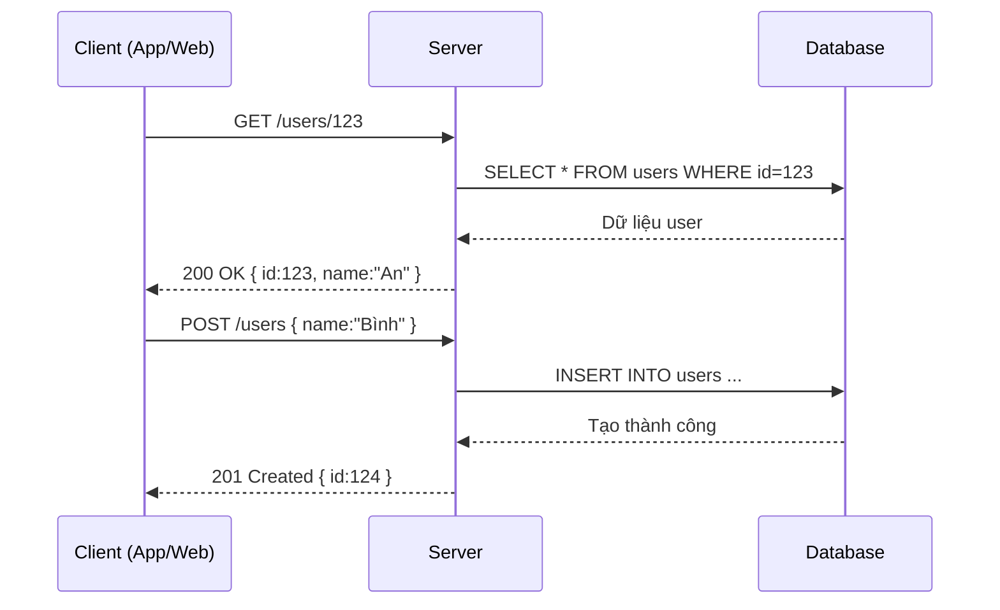
```mermaid
sequenceDiagram
    participant C as Client (App/Web)
    participant S as Server
    participant DB as Database

    C->>S: GET /users/123
    S->>DB: SELECT * FROM users WHERE id=123
    DB-->>S: Dữ liệu user
    S-->>C: 200 OK { id:123, name:"An" }

    C->>S: POST /users { name:"Bình" }
    S->>DB: INSERT INTO users ...
    DB-->>S: Tạo thành công
    S-->>C: 201 Created { id:124 }
```

### 1.4. Phân tích tình huống thực tiễn

Xét hệ thống backend của một sàn thương mại điện tử cỡ vừa, thiết kế API cho tài nguyên "đơn hàng" (`orders`). Đội kỹ thuật định nghĩa bộ endpoint như sau:

| Endpoint | Phương thức | Chức năng | Mã trạng thái thành công |
|---|---|---|---|
| `/orders` | GET | Lấy danh sách đơn hàng (có phân trang `?page=1&limit=20`) | 200 |
| `/orders/45` | GET | Lấy chi tiết đơn hàng số 45 | 200 |
| `/orders` | POST | Tạo đơn hàng mới | 201 |
| `/orders/45` | PATCH | Cập nhật trạng thái giao hàng | 200 |
| `/orders/45` | DELETE | Hủy đơn hàng | 204 |

Toàn bộ vòng đời của một đơn hàng có thể mô tả bằng sơ đồ trạng thái sau, trong đó mỗi lần chuyển trạng thái tương ứng với một lệnh gọi `PATCH /orders/{id}`:

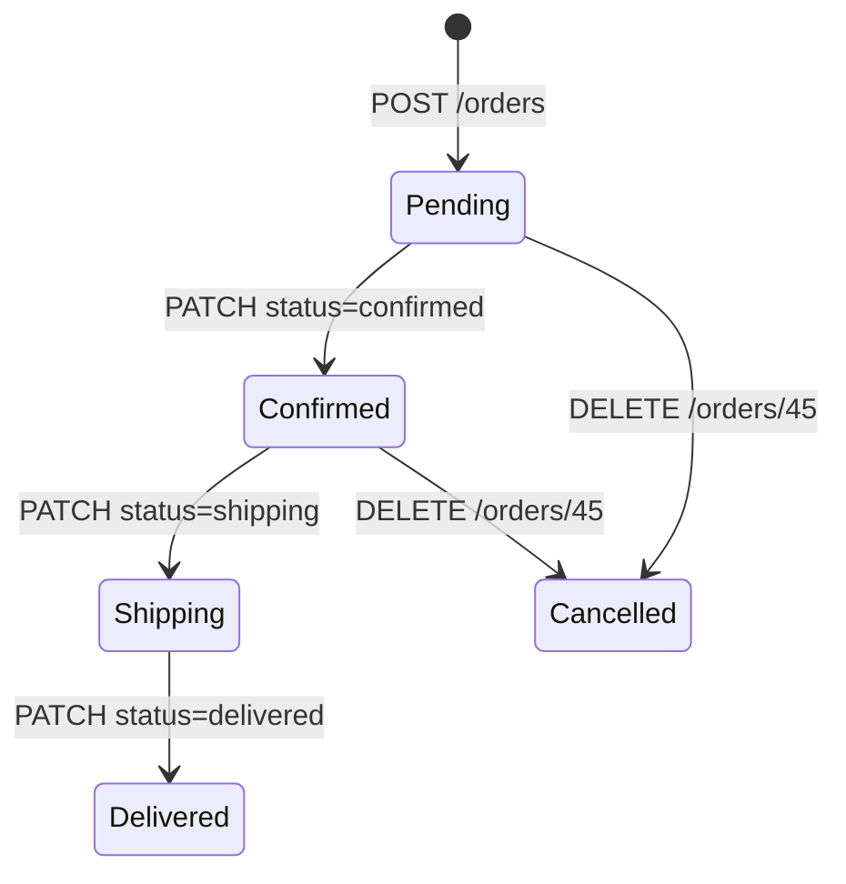
```mermaid
stateDiagram-v2
    [*] --> Pending: POST /orders
    Pending --> Confirmed: PATCH status=confirmed
    Confirmed --> Shipping: PATCH status=shipping
    Shipping --> Delivered: PATCH status=delivered
    Pending --> Cancelled: DELETE /orders/45
    Confirmed --> Cancelled: DELETE /orders/45
```

**Giá trị thực tiễn mang lại:** Nhờ tuân thủ chuẩn REST và tính chất stateless, đội frontend web, đội mobile (iOS/Android) và cả đối tác giao vận bên thứ ba (ví dụ Giao Hàng Nhanh) có thể tích hợp cùng một bộ API mà không cần biết backend được viết bằng ngôn ngữ gì. Khi công ty mở rộng, đội kỹ thuật chỉ cần bổ sung endpoint mới (ví dụ `/orders/45/tracking`) mà không phá vỡ các client đang tồn tại — đây chính là lý do REST trở thành lựa chọn mặc định cho các hệ thống API công khai như GitHub API, Stripe API, hay Shopify API.

**Vấn đề thường gặp khi không tuân thủ REST đúng chuẩn:** Một lỗi thiết kế phổ biến là đặt động từ vào URI (ví dụ `POST /getUserInfo`, `POST /deleteOrder45`) thay vì dùng danh từ và phương thức HTTP tương ứng. Cách làm này khiến API thiếu nhất quán, khó đoán, và không tận dụng được các cơ chế cache/proxy tiêu chuẩn của HTTP.

---

## 2. Authentication & Authorization

### 2.1. Đặt vấn đề

Một hệ thống mở cho phép bất kỳ ai gửi yêu cầu cũng đọc, sửa dữ liệu sẽ nhanh chóng bị lạm dụng: người dùng có thể xem thông tin của người khác, hoặc thực hiện thao tác vượt quyền hạn (ví dụ nhân viên bình thường xóa được dữ liệu của quản trị viên). Do đó hệ thống cần trả lời được hai câu hỏi riêng biệt: "Bạn là ai?" và "Bạn được phép làm gì?".

### 2.2. Khái niệm

**Authentication (Xác thực)** là quá trình xác minh danh tính của người dùng — trả lời câu hỏi "bạn là ai". Các phương thức phổ biến gồm: đăng nhập bằng mật khẩu, xác thực qua **token** (như JWT — JSON Web Token), OAuth2, hoặc sinh trắc học.

**Authorization (Phân quyền)** là quá trình xác định người dùng đã được xác thực đó có quyền thực hiện một hành động cụ thể hay không — trả lời câu hỏi "bạn được phép làm gì". Authorization luôn diễn ra **sau** authentication.

Hai khái niệm này thường bị nhầm lẫn nhưng hoàn toàn độc lập: một người có thể được xác thực thành công (hệ thống biết chính xác họ là ai) nhưng vẫn bị từ chối truy cập vì không đủ quyền hạn.

Mô hình phân quyền phổ biến nhất là **RBAC (Role-Based Access Control)** — gán quyền theo vai trò (admin, editor, viewer...) thay vì gán trực tiếp cho từng người dùng, giúp việc quản lý quyền hạn ở quy mô lớn trở nên đơn giản hơn. Mô hình nâng cao hơn là **ABAC (Attribute-Based Access Control)** — quyết định quyền dựa trên nhiều thuộc tính kết hợp (vai trò, phòng ban, thời gian, vị trí địa lý...).

### 2.3. Sơ đồ minh họa luồng xử lý

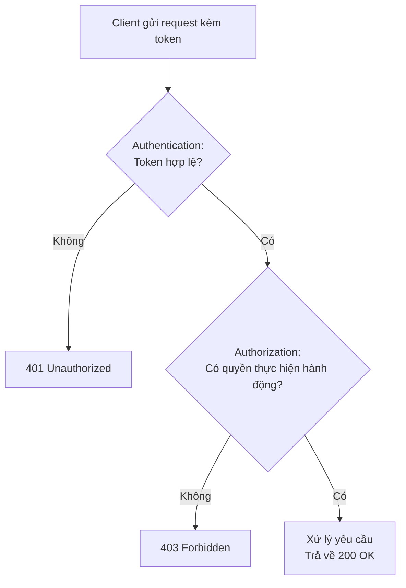
```mermaid
flowchart TD
    A[Client gửi request kèm token] --> B{Authentication:<br>Token hợp lệ?}
    B -- Không --> C[401 Unauthorized]
    B -- Có --> D{Authorization:<br>Có quyền thực hiện hành động?}
    D -- Không --> E[403 Forbidden]
    D -- Có --> F[Xử lý yêu cầu<br>Trả về 200 OK]
```

### 2.4. Phân tích tình huống thực tiễn

**Kịch bản: hệ thống quản lý nhân sự (HRM) của một công ty 500 nhân viên.**

Bước 1 — Đăng nhập (Authentication): Nhân viên Nguyễn Văn A nhập email và mật khẩu tại `POST /auth/login`. Server kiểm tra thông tin trong database (mật khẩu được lưu dưới dạng băm — hashed — bằng thuật toán bcrypt, không bao giờ lưu plain text), nếu đúng, server sinh ra một **JWT** chứa các thông tin (payload) như `user_id`, `role: "employee"`, `exp` (thời điểm hết hạn), rồi ký số bằng khóa bí mật của server. JWT này được trả về client và client đính kèm vào header `Authorization: Bearer <token>` cho mọi request sau đó.

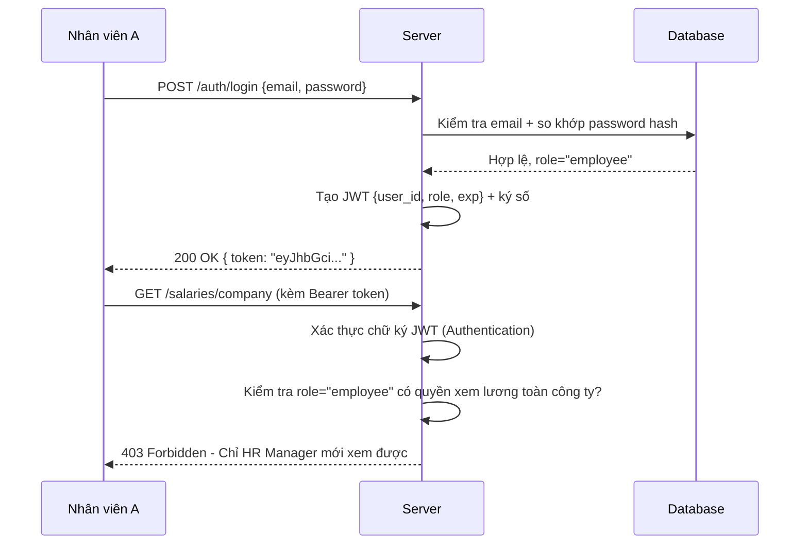
```mermaid
sequenceDiagram
    participant U as Nhân viên A
    participant S as Server
    participant DB as Database

    U->>S: POST /auth/login {email, password}
    S->>DB: Kiểm tra email + so khớp password hash
    DB-->>S: Hợp lệ, role="employee"
    S->>S: Tạo JWT {user_id, role, exp} + ký số
    S-->>U: 200 OK { token: "eyJhbGci..." }

    U->>S: GET /salaries/company (kèm Bearer token)
    S->>S: Xác thực chữ ký JWT (Authentication)
    S->>S: Kiểm tra role="employee" có quyền xem lương toàn công ty?
    S-->>U: 403 Forbidden - Chỉ HR Manager mới xem được
```

Bước 2 — Kiểm tra quyền (Authorization): Khi A gửi `GET /salaries/company` để xem bảng lương toàn công ty, server xác thực chữ ký JWT thành công (biết chắc đây là A), nhưng khi đối chiếu bảng phân quyền RBAC dưới đây, vai trò `employee` không có quyền `view_all_salaries`, nên hệ thống trả về **403 Forbidden** dù A đã đăng nhập hợp lệ.

| Vai trò (Role) | Xem lương bản thân | Xem lương toàn công ty | Chỉnh sửa hồ sơ nhân viên |
|---|---|---|---|
| Employee | ✅ | ❌ | ❌ |
| Team Lead | ✅ | ❌ | ✅ (chỉ nhóm của mình) |
| HR Manager | ✅ | ✅ | ✅ (toàn công ty) |

**Bài học rút ra:** Nếu hệ thống chỉ kiểm tra "token có hợp lệ không" mà bỏ qua bước kiểm tra vai trò, đây chính là lỗ hổng bảo mật nghiêm trọng gọi là **Broken Access Control** — nằm trong top đầu danh sách OWASP Top 10 các lỗ hổng bảo mật web nguy hiểm nhất, từng gây ra nhiều vụ rò rỉ dữ liệu lớn trong thực tế (ví dụ lỗ hổng IDOR — Insecure Direct Object Reference — cho phép người dùng đổi `user_id=123` thành `user_id=124` trên URL để xem dữ liệu người khác nếu server không kiểm tra quyền sở hữu).

---

## 3. Database Index

### 3.1. Đặt vấn đề

Khi một bảng dữ liệu chỉ có vài trăm dòng, việc tìm kiếm bằng cách quét tuần tự (full table scan) không gây ảnh hưởng đáng kể. Nhưng khi bảng có hàng chục triệu bản ghi, một câu truy vấn `SELECT * FROM orders WHERE customer_id = 8823` mà không có cơ chế hỗ trợ sẽ buộc hệ quản trị cơ sở dữ liệu phải kiểm tra từng dòng, khiến thời gian phản hồi tăng lên tuyến tính theo kích thước dữ liệu — gây nghẽn hệ thống.

### 3.2. Khái niệm

**Index (chỉ mục)** là một cấu trúc dữ liệu bổ sung, được xây dựng trên một hoặc nhiều cột của bảng, giúp hệ quản trị cơ sở dữ liệu định vị bản ghi nhanh chóng mà không cần quét toàn bộ bảng. Về bản chất, index hoạt động tương tự mục lục ở cuối một cuốn sách giáo khoa: thay vì đọc từng trang để tìm một thuật ngữ, người đọc tra mục lục để đến thẳng trang cần tìm.

Cấu trúc phổ biến nhất để triển khai index là **B-Tree (Balanced Tree)**, cho phép tìm kiếm, thêm và xóa với độ phức tạp **O(log n)** thay vì O(n) như quét tuần tự. Với các trường hợp tìm kiếm chính xác giá trị (equality lookup), cấu trúc **Hash Index** cũng được sử dụng. Ngoài ra còn có **Composite Index** (đánh index trên nhiều cột kết hợp) và **Covering Index** (index chứa đủ dữ liệu để trả lời truy vấn mà không cần đọc thêm bảng gốc).

Tuy nhiên, index không phải "miễn phí": mỗi lần dữ liệu được thêm, sửa, xóa, hệ thống phải cập nhật lại cấu trúc index tương ứng, làm chậm thao tác ghi (INSERT/UPDATE/DELETE) và tốn thêm dung lượng lưu trữ. Vì vậy việc đánh index cần dựa trên phân tích tần suất truy vấn thực tế, không nên đánh index tràn lan.

### 3.3. Sơ đồ minh họa luồng xử lý

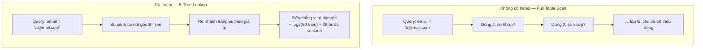
```mermaid
flowchart TD
    subgraph KO["Không có Index — Full Table Scan"]
    direction LR
    A1[Query: email = 'a@mail.com'] --> A2[Dòng 1: so khớp?] --> A3[Dòng 2: so khớp?] --> A4["... lặp lại cho cả 50 triệu dòng"]
    end

    subgraph CO["Có Index — B-Tree Lookup"]
    direction LR
    B1[Query: email = 'a@mail.com'] --> B2["So sánh tại nút gốc B-Tree"]
    B2 --> B3["Rẽ nhánh trái/phải theo giá trị"]
    B3 --> B4["Đến thẳng vị trí bản ghi<br>~ log2(50 triệu) ≈ 26 bước so sánh"]
    end
```

### 3.4. Phân tích tình huống thực tiễn

**Kịch bản: hệ thống bán vé máy bay với bảng `bookings` có 50 triệu bản ghi.**

Trước khi tối ưu, truy vấn tìm vé theo email khách hàng:

```sql
SELECT * FROM bookings WHERE customer_email = 'nguyenvana@mail.com';
```

thực hiện full table scan, mất trung bình **4.200 mili-giây** theo đo đạc thực tế bằng lệnh `EXPLAIN ANALYZE`. Với hệ thống phục vụ hàng nghìn truy vấn tra cứu vé mỗi phút trong giờ cao điểm, database nhanh chóng bị quá tải, các truy vấn khác cũng bị chậm theo (do tranh chấp tài nguyên I/O).

Đội kỹ thuật tạo index trên cột `customer_email`:

```sql
CREATE INDEX idx_bookings_email ON bookings(customer_email);
```

Sau khi tạo index, cùng câu truy vấn trên chỉ còn mất khoảng **0,8 mili-giây** — nhanh hơn khoảng **5.000 lần**, vì hệ thống chỉ cần duyệt qua cây B-Tree có độ sâu khoảng 4-5 tầng thay vì đọc tuần tự 50 triệu dòng.

| Tiêu chí | Không có Index | Có Index |
|---|---|---|
| Thời gian truy vấn SELECT | ~4.200 ms | ~0,8 ms |
| Độ phức tạp | O(n) | O(log n) |
| Tốc độ INSERT/UPDATE | Nhanh hơn | Chậm hơn một chút (phải cập nhật B-Tree) |
| Dung lượng lưu trữ | Thấp hơn | Tăng thêm (index chiếm thêm ổ đĩa) |

**Bài toán đánh đổi trong thực tế:** Bảng `bookings` này còn có cột `status` (trạng thái đặt vé) thường xuyên được `UPDATE` khi vé chuyển từ "đang giữ chỗ" sang "đã thanh toán". Nếu đội kỹ thuật đánh index tràn lan lên toàn bộ các cột, bao gồm cả `status`, tốc độ ghi dữ liệu sẽ giảm đáng kể vì mỗi lần cập nhật trạng thái, hệ thống phải ghi lại cả cấu trúc index. Nguyên tắc thực tế được áp dụng: chỉ đánh index cho các cột thường xuất hiện trong mệnh đề `WHERE`, `JOIN`, `ORDER BY` với tần suất đọc cao và tần suất ghi thấp — đây chính là lý do các kỹ sư luôn phải phân tích query pattern thực tế trước khi quyết định đánh index, thay vì đánh index theo cảm tính.

---

## 4. Database Transaction

### 4.1. Đặt vấn đề

Hãy hình dung một giao dịch chuyển khoản ngân hàng gồm hai bước: trừ tiền tài khoản A và cộng tiền vào tài khoản B. Nếu hệ thống thực hiện xong bước trừ tiền nhưng gặp sự cố (mất điện, lỗi mạng) trước khi cộng tiền, tiền sẽ "biến mất" khỏi hệ thống — một hậu quả không thể chấp nhận trong nghiệp vụ tài chính. Cần một cơ chế đảm bảo rằng một chuỗi thao tác liên quan đến nhau hoặc **thực hiện trọn vẹn**, hoặc **không thực hiện gì cả**.

### 4.2. Khái niệm

**Transaction (Giao dịch)** là một nhóm các thao tác trên cơ sở dữ liệu được gộp lại và xử lý như một đơn vị không thể chia nhỏ (atomic unit). Một transaction chuẩn phải đảm bảo bốn tính chất, gọi tắt là **ACID**:

- **Atomicity (Tính nguyên tử):** Tất cả thao tác trong transaction hoặc hoàn tất toàn bộ (COMMIT), hoặc bị hủy bỏ toàn bộ (ROLLBACK), không có trạng thái "làm dở".
- **Consistency (Tính nhất quán):** Transaction luôn đưa cơ sở dữ liệu từ một trạng thái hợp lệ sang một trạng thái hợp lệ khác, không vi phạm các ràng buộc đã định nghĩa.
- **Isolation (Tính cô lập):** Các transaction chạy đồng thời không ảnh hưởng lẫn nhau như thể chúng được thực thi tuần tự. Mức độ cô lập được chia thành 4 cấp: `Read Uncommitted`, `Read Committed`, `Repeatable Read`, `Serializable` — mức càng cao thì dữ liệu càng nhất quán nhưng hiệu năng càng giảm.
- **Durability (Tính bền vững):** Sau khi transaction đã COMMIT thành công, dữ liệu được lưu trữ vĩnh viễn, kể cả khi hệ thống gặp sự cố ngay sau đó.

### 4.3. Sơ đồ minh họa luồng xử lý

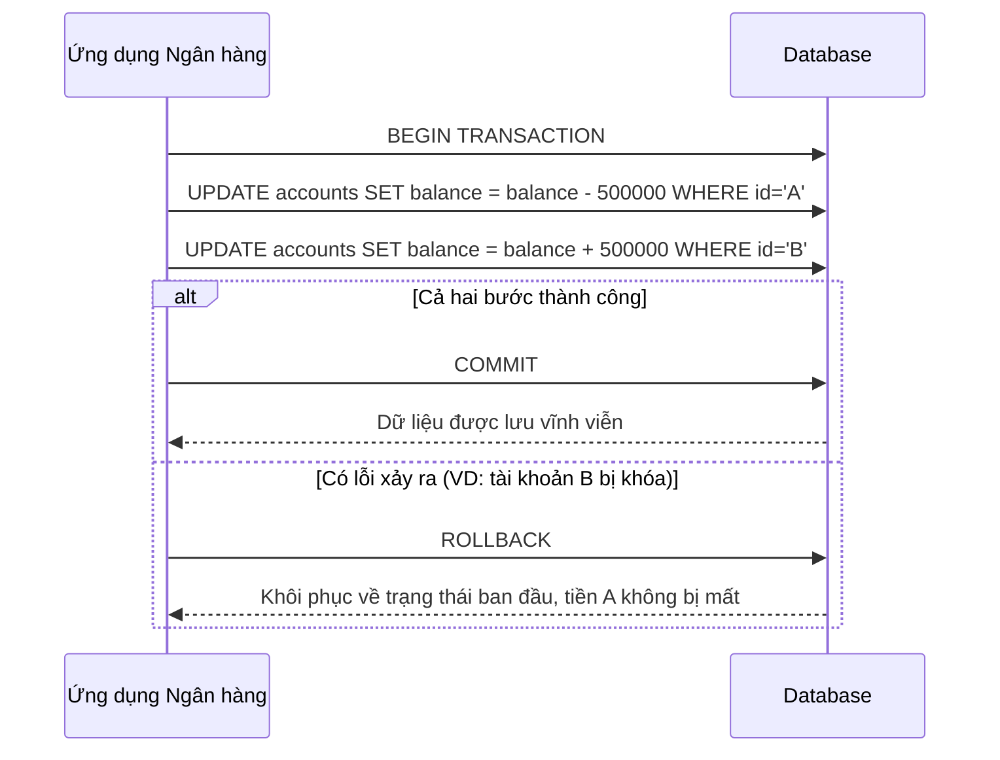
```mermaid
sequenceDiagram
    participant App as Ứng dụng Ngân hàng
    participant DB as Database

    App->>DB: BEGIN TRANSACTION
    App->>DB: UPDATE accounts SET balance = balance - 500000 WHERE id='A'
    App->>DB: UPDATE accounts SET balance = balance + 500000 WHERE id='B'
    alt Cả hai bước thành công
        App->>DB: COMMIT
        DB-->>App: Dữ liệu được lưu vĩnh viễn
    else Có lỗi xảy ra (VD: tài khoản B bị khóa)
        App->>DB: ROLLBACK
        DB-->>App: Khôi phục về trạng thái ban đầu, tiền A không bị mất
    end
```

### 4.4. Phân tích tình huống thực tiễn

**Kịch bản có số liệu cụ thể:** Tài khoản A có số dư 10.000.000đ, tài khoản B có số dư 2.000.000đ. Khách hàng thực hiện chuyển khoản 500.000đ từ A sang B thông qua đoạn mã giả sau:

```sql
BEGIN TRANSACTION;

UPDATE accounts SET balance = balance - 500000 WHERE account_id = 'A';
-- Số dư A tạm thời: 9.500.000đ (chưa commit, chỉ có phiên này nhìn thấy)

UPDATE accounts SET balance = balance + 500000 WHERE account_id = 'B';
-- Nếu tài khoản B đã bị đóng băng do nghi ngờ gian lận, câu lệnh này thất bại

-- Nếu cả hai bước thành công:
COMMIT;
-- Nếu có lỗi ở bất kỳ bước nào:
ROLLBACK;
```

Nếu bước cập nhật tài khoản B thất bại (ví dụ do ràng buộc `CHECK (status != 'frozen')` bị vi phạm), toàn bộ transaction sẽ **ROLLBACK**: số dư tài khoản A được khôi phục về đúng 10.000.000đ như ban đầu, không hề bị trừ đi 500.000đ dù câu lệnh UPDATE đầu tiên đã "chạy". Nhờ tính Atomicity, hệ thống không bao giờ rơi vào trạng thái lửng lơ (A đã bị trừ nhưng B chưa được cộng).

**Vấn đề nâng cao — Deadlock trong giao dịch đồng thời:** Trong thực tế, khi hai transaction cùng lúc cố gắng khóa hai tài khoản theo thứ tự ngược nhau, hệ thống có thể rơi vào tình trạng bế tắc (deadlock):

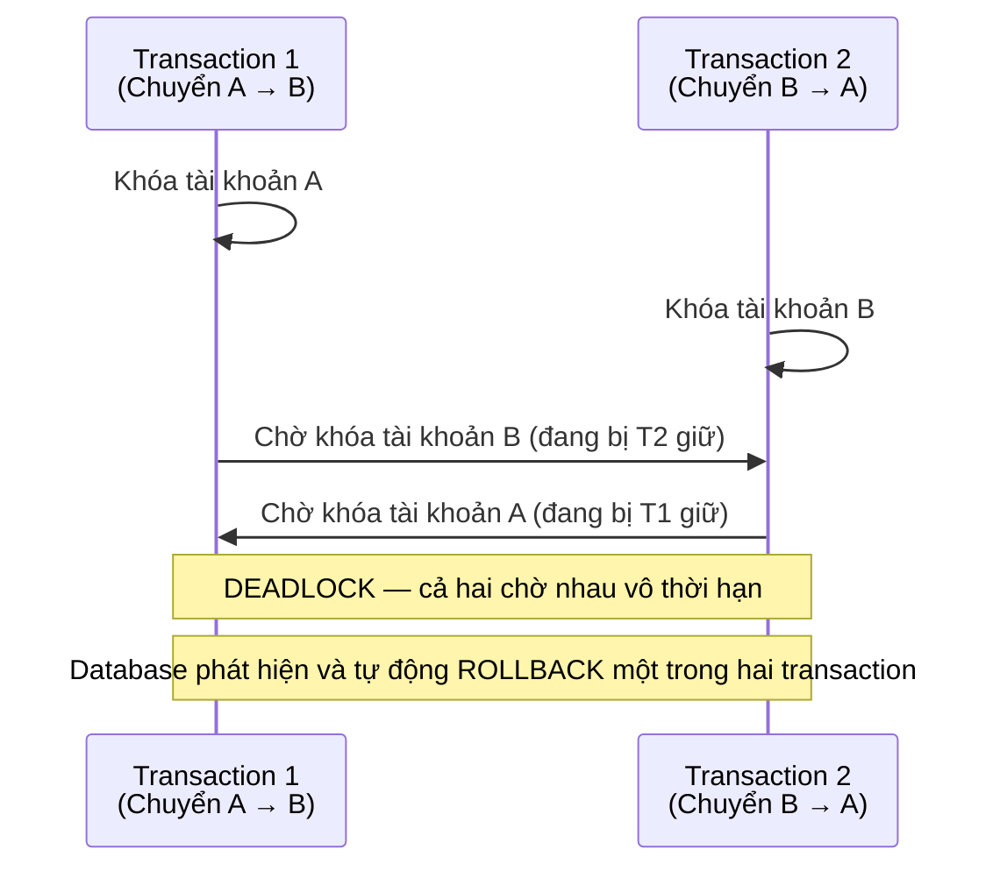
```mermaid
sequenceDiagram
    participant T1 as Transaction 1<br>(Chuyển A → B)
    participant T2 as Transaction 2<br>(Chuyển B → A)

    T1->>T1: Khóa tài khoản A
    T2->>T2: Khóa tài khoản B
    T1->>T2: Chờ khóa tài khoản B (đang bị T2 giữ)
    T2->>T1: Chờ khóa tài khoản A (đang bị T1 giữ)
    Note over T1,T2: DEADLOCK — cả hai chờ nhau vô thời hạn
    Note over T1,T2: Database phát hiện và tự động ROLLBACK một trong hai transaction
```

Các hệ quản trị cơ sở dữ liệu hiện đại như PostgreSQL hay MySQL có cơ chế tự động phát hiện deadlock và chủ động hủy (rollback) một trong hai transaction để giải phóng bế tắc, đồng thời trả lỗi để ứng dụng có thể thử lại (retry). Đây là lý do tại sao trong thực tế, mã nguồn xử lý giao dịch tài chính luôn cần có logic **retry với backoff** khi gặp lỗi deadlock.

---

## 5. Concurrency

### 5.1. Đặt vấn đề

Một máy chủ backend thực tế phải phục vụ hàng nghìn người dùng truy cập cùng một thời điểm chứ không phải lần lượt từng người. Nếu server xử lý tuần tự (người này xong mới đến người kia), người dùng đến sau sẽ phải chờ đợi rất lâu, gây trải nghiệm tồi tệ. Nhưng nếu để nhiều luồng xử lý cùng truy cập, chỉnh sửa một dữ liệu chung mà không kiểm soát, dữ liệu có thể bị sai lệch.

### 5.2. Khái niệm

**Concurrency (Tính đồng thời)** là khả năng của hệ thống xử lý nhiều tác vụ trong cùng một khoảng thời gian, tạo cảm giác chúng diễn ra song song. Cần phân biệt rõ hai khái niệm dễ nhầm lẫn:

- **Concurrency** là việc *quản lý* nhiều tác vụ cùng lúc — chúng có thể xen kẽ thực thi trên một lõi CPU (interleaving), không nhất thiết chạy cùng một thời điểm tuyệt đối.
- **Parallelism (Tính song song)** là việc *thực thi thật sự đồng thời* nhiều tác vụ trên nhiều lõi CPU khác nhau.

Khi nhiều tiến trình/luồng cùng truy cập và thay đổi một tài nguyên chung, hiện tượng **race condition (tranh chấp dữ liệu)** có thể xảy ra: kết quả cuối cùng phụ thuộc vào thứ tự thực thi ngẫu nhiên, dẫn đến dữ liệu sai. Để giải quyết, backend sử dụng hai chiến lược chính:

- **Pessimistic Locking (khóa bi quan):** Khóa tài nguyên ngay khi bắt đầu đọc, ngăn mọi luồng khác truy cập cho đến khi hoàn tất — an toàn tuyệt đối nhưng làm giảm thông lượng hệ thống.
- **Optimistic Locking (khóa lạc quan):** Không khóa trước, chỉ kiểm tra tại thời điểm ghi xem dữ liệu có bị thay đổi bởi luồng khác hay không (thường qua một cột `version`); nếu có xung đột thì từ chối ghi và yêu cầu thử lại — phù hợp khi tần suất xung đột thấp.

### 5.3. Sơ đồ minh họa luồng xử lý

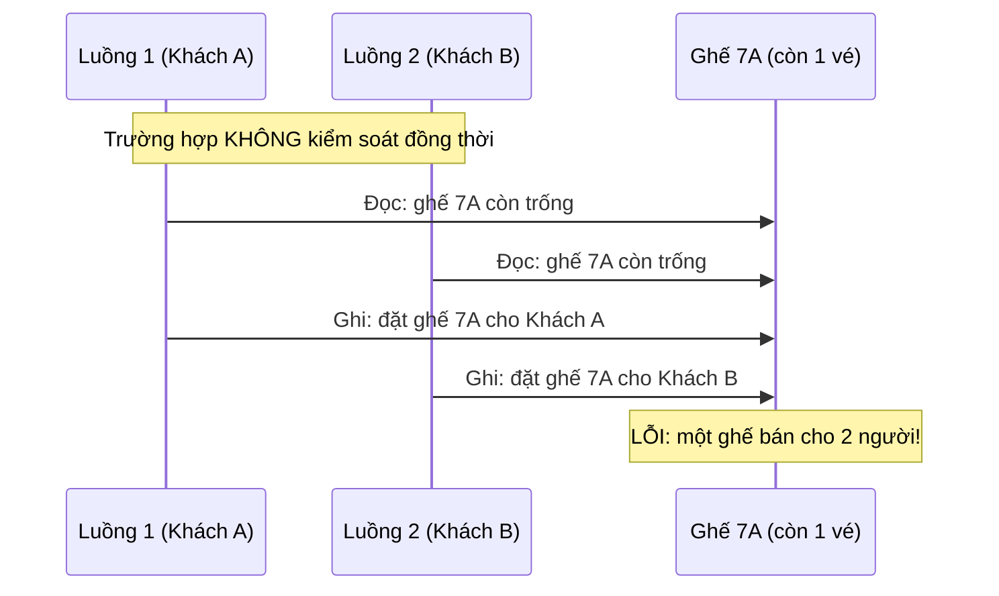
```mermaid
sequenceDiagram
    participant T1 as Luồng 1 (Khách A)
    participant T2 as Luồng 2 (Khách B)
    participant D as Ghế 7A (còn 1 vé)

    Note over T1,T2: Trường hợp KHÔNG kiểm soát đồng thời
    T1->>D: Đọc: ghế 7A còn trống
    T2->>D: Đọc: ghế 7A còn trống
    T1->>D: Ghi: đặt ghế 7A cho Khách A
    T2->>D: Ghi: đặt ghế 7A cho Khách B
    Note over D: LỖI: một ghế bán cho 2 người!
```

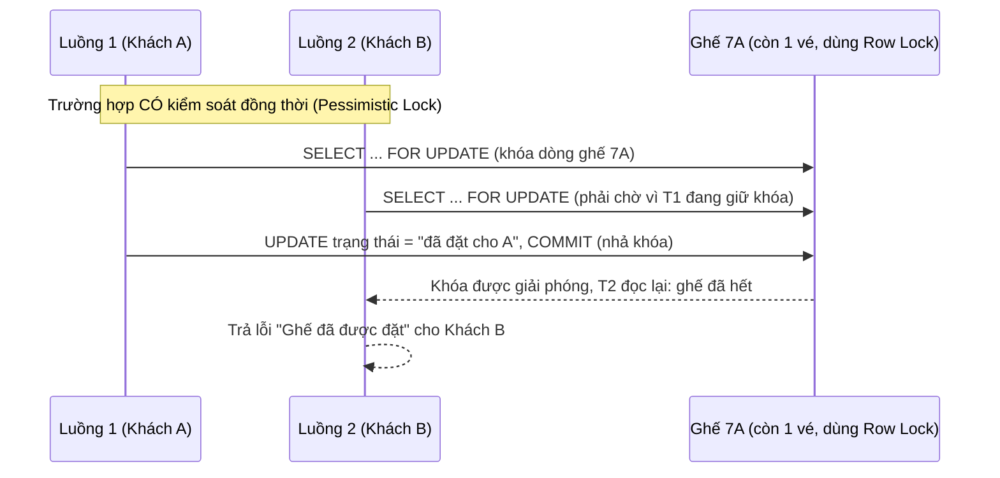
```mermaid
sequenceDiagram
    participant T1 as Luồng 1 (Khách A)
    participant T2 as Luồng 2 (Khách B)
    participant D as Ghế 7A (còn 1 vé, dùng Row Lock)

    Note over T1,T2: Trường hợp CÓ kiểm soát đồng thời (Pessimistic Lock)
    T1->>D: SELECT ... FOR UPDATE (khóa dòng ghế 7A)
    T2->>D: SELECT ... FOR UPDATE (phải chờ vì T1 đang giữ khóa)
    T1->>D: UPDATE trạng thái = "đã đặt cho A", COMMIT (nhả khóa)
    D-->>T2: Khóa được giải phóng, T2 đọc lại: ghế đã hết
    T2-->>T2: Trả lỗi "Ghế đã được đặt" cho Khách B
```

### 5.4. Phân tích tình huống thực tiễn

**Kịch bản: hệ thống đặt vé xem phim CGV vào suất chiếu cuối tuần, ghế E12 là ghế cuối cùng còn trống.** Vào đúng 20h00 — thời điểm mở bán vé cho suất chiếu hot — hai người dùng cùng bấm "Chọn ghế E12" trong khoảng cách chưa đến 50 mili-giây.

Nếu hệ thống thiết kế theo logic ngây thơ "đọc trạng thái ghế → nếu trống thì cập nhật thành đã đặt" mà không có cơ chế khóa, cả hai luồng xử lý (ứng với hai request) đều đọc được trạng thái "còn trống" tại cùng một thời điểm (vì luồng 2 đọc dữ liệu trước khi luồng 1 kịp ghi), dẫn đến cả hai đều ghi thành công — hậu quả là ghế E12 bị bán trùng cho hai khách hàng, gây tranh chấp thực tế tại rạp.

**Giải pháp áp dụng trong thực tế** thường kết hợp hai lớp phòng vệ:

1. **Ở tầng database:** dùng câu lệnh `SELECT ... FOR UPDATE` để khóa dòng dữ liệu ghế ngay khi bắt đầu transaction, buộc luồng thứ hai phải chờ luồng thứ nhất hoàn tất (COMMIT hoặc ROLLBACK) rồi mới được đọc dữ liệu mới nhất.
2. **Ở tầng ứng dụng:** sử dụng cơ chế "giữ chỗ tạm thời" (soft-hold) bằng Redis với TTL 5-10 phút — khi người dùng chọn ghế, hệ thống đặt một khóa phân tán (`SETNX seat:E12 user_id EX 300`) trong Redis; nếu khóa đã tồn tại nghĩa là ghế đang được người khác giữ, hệ thống lập tức từ chối và hiển thị thông báo "Ghế đang được người khác chọn, vui lòng thử ghế khác".

**Đánh đổi hiệu năng cần lưu ý:** Việc khóa dữ liệu đảm bảo tính đúng đắn nhưng làm giảm thông lượng xử lý đồng thời — nếu một sự kiện mở bán vé có 50.000 người truy cập cùng lúc để tranh nhau vài trăm ghế, hệ thống khóa quá "nặng tay" (ví dụ khóa toàn bộ bảng thay vì chỉ khóa từng dòng ghế cụ thể) có thể khiến toàn bộ hệ thống bị nghẽn. Đây là lý do các nền tảng bán vé lớn (ví dụ Ticketbox, Ticketmaster) thường thiết kế riêng một tầng "hàng đợi ảo" (virtual waiting room) kết hợp với khóa mức dòng dữ liệu chi tiết, thay vì khóa thô ở mức bảng.

---

## 6. Cache

### 6.1. Đặt vấn đề

Nhiều dữ liệu trong hệ thống được truy vấn lặp đi lặp lại nhưng ít khi thay đổi — ví dụ danh sách danh mục sản phẩm, thông tin cấu hình hệ thống. Nếu mỗi lần có yêu cầu, server đều phải truy vấn lại cơ sở dữ liệu (vốn chậm hơn bộ nhớ RAM hàng trăm đến hàng nghìn lần), tài nguyên hệ thống sẽ bị lãng phí và tốc độ phản hồi giảm đáng kể.

### 6.2. Khái niệm

**Cache (bộ nhớ đệm)** là một lớp lưu trữ trung gian, thường đặt trong bộ nhớ RAM (nhanh hơn nhiều so với đĩa cứng hoặc cơ sở dữ liệu), dùng để lưu lại kết quả của các thao tác tính toán hoặc truy vấn tốn kém, nhằm phục vụ nhanh cho các yêu cầu tương tự trong tương lai mà không cần lặp lại toàn bộ quá trình xử lý.

Các công cụ cache phổ biến trong backend gồm **Redis** và **Memcached**. Một số chiến lược cache thường gặp:

- **Cache-Aside (Lazy Loading):** Ứng dụng kiểm tra cache trước; nếu không có (cache miss) mới truy vấn database rồi lưu kết quả vào cache.
- **Write-Through:** Mỗi khi ghi dữ liệu, ứng dụng ghi đồng thời vào cả cache và database.
- **TTL (Time To Live):** Mỗi dữ liệu trong cache có thời hạn tồn tại nhất định, hết hạn sẽ tự động bị xóa để tránh dữ liệu cũ (stale data).

Vấn đề quan trọng nhất khi dùng cache là **cache invalidation** (làm mất hiệu lực cache đúng lúc) — nếu dữ liệu gốc đã thay đổi mà cache chưa được cập nhật, người dùng sẽ nhận thông tin lỗi thời.

### 6.3. Sơ đồ minh họa luồng xử lý

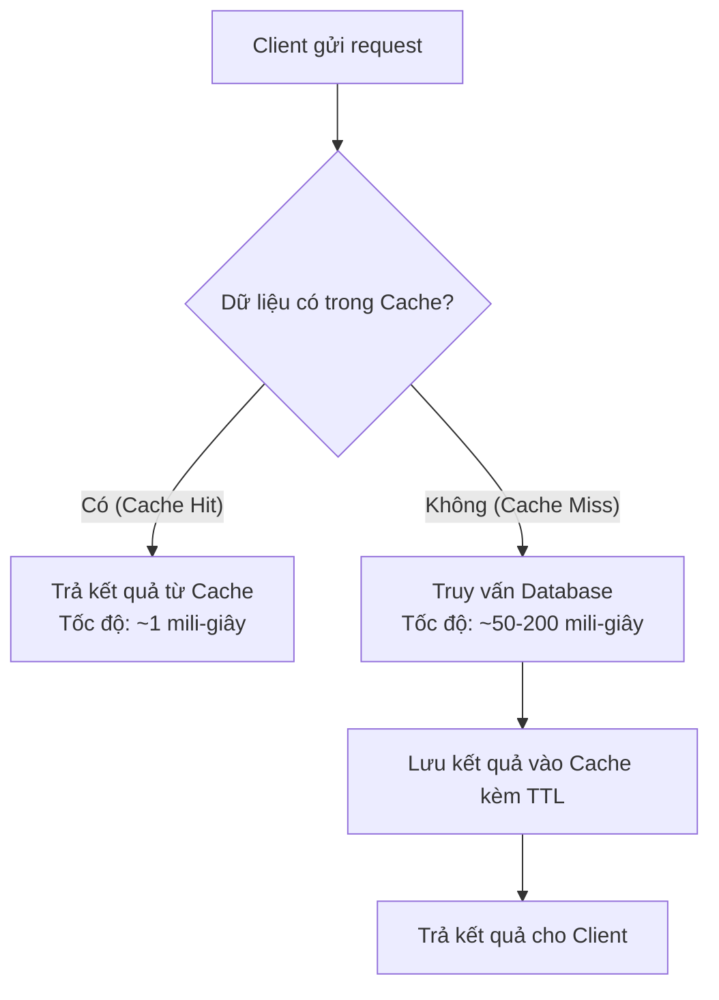
```mermaid
flowchart TD
    A[Client gửi request] --> B{Dữ liệu có trong Cache?}
    B -- Có (Cache Hit) --> C[Trả kết quả từ Cache<br>Tốc độ: ~1 mili-giây]
    B -- Không (Cache Miss) --> D[Truy vấn Database<br>Tốc độ: ~50-200 mili-giây]
    D --> E[Lưu kết quả vào Cache kèm TTL]
    E --> F[Trả kết quả cho Client]
```

### 6.4. Phân tích tình huống thực tiễn

**Kịch bản có số liệu: trang chủ sàn thương mại điện tử hiển thị "Top 20 sản phẩm bán chạy".**

Việc tính toán danh sách này đòi hỏi truy vấn tổng hợp (aggregation) trên bảng `order_items` với hàng chục triệu dòng, nhóm theo `product_id`, sắp xếp theo số lượng bán trong 7 ngày gần nhất — một câu truy vấn tốn khoảng **1.500 mili-giây** để hoàn thành. Trong khi đó, dữ liệu này trên thực tế chỉ cần cập nhật mỗi giờ một lần vì thứ hạng bán chạy không biến động liên tục theo từng giây.

Đội kỹ thuật áp dụng chiến lược **Cache-Aside** với Redis:

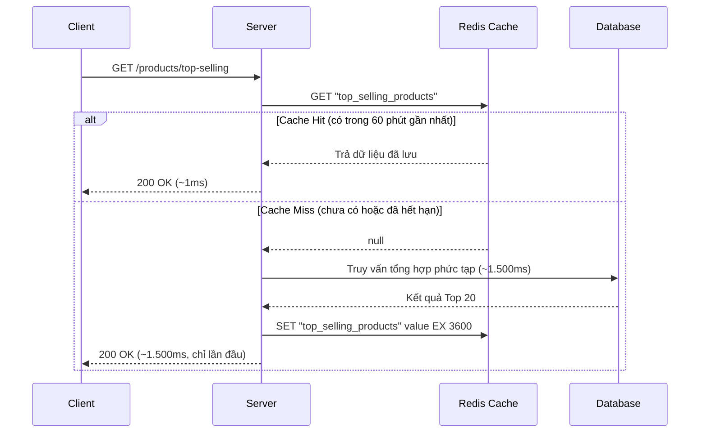
```mermaid
sequenceDiagram
    participant C as Client
    participant S as Server
    participant R as Redis Cache
    participant DB as Database

    C->>S: GET /products/top-selling
    S->>R: GET "top_selling_products"
    alt Cache Hit (có trong 60 phút gần nhất)
        R-->>S: Trả dữ liệu đã lưu
        S-->>C: 200 OK (~1ms)
    else Cache Miss (chưa có hoặc đã hết hạn)
        R-->>S: null
        S->>DB: Truy vấn tổng hợp phức tạp (~1.500ms)
        DB-->>S: Kết quả Top 20
        S->>R: SET "top_selling_products" value EX 3600
        S-->>C: 200 OK (~1.500ms, chỉ lần đầu)
    end
```

**Kết quả đo đạc thực tế:** Trong 1 giờ có TTL, giả sử trang chủ nhận 200.000 lượt truy cập. Chỉ có **request đầu tiên** phải chịu độ trễ 1.500ms để tính toán và ghi vào cache; **199.999 request còn lại** chỉ mất khoảng 1ms để đọc từ Redis — giảm tải cho database hơn 99,9% cho riêng truy vấn này, đồng thời cải thiện trải nghiệm người dùng rõ rệt.

**Vấn đề nâng cao — Cache Stampede (tấn công đám đông vào cache):** Nếu ngay tại thời điểm cache hết hạn (TTL = 0), hàng nghìn request cùng lúc đều gặp cache miss và đồng loạt dội vào database để tính lại — hiện tượng này có thể làm sập database dù bản chất mỗi truy vấn là hợp lệ. Giải pháp thực tế là dùng cơ chế **khóa tính toán lại (mutex lock khi rebuild cache)**: chỉ cho phép đúng một request được quyền truy vấn database để làm mới cache, các request khác trong lúc chờ sẽ tạm thời nhận dữ liệu cũ (stale-while-revalidate) thay vì cùng dội vào database.

---

## 7. Message Queue

### 7.1. Đặt vấn đề

Một số tác vụ trong hệ thống không cần phải hoàn thành ngay lập tức để trả kết quả cho người dùng — ví dụ gửi email xác nhận đơn hàng, tạo hóa đơn PDF, hay đồng bộ dữ liệu sang hệ thống khác. Nếu bắt người dùng phải chờ server thực hiện toàn bộ các tác vụ này theo kiểu tuần tự (đồng bộ) trước khi trả phản hồi, trải nghiệm sẽ rất chậm. Ngoài ra, nếu dịch vụ xử lý email đang quá tải hoặc gặp sự cố tạm thời, toàn bộ luồng xử lý đơn hàng không nên bị chặn lại theo đó.

### 7.2. Khái niệm

**Message Queue (Hàng đợi thông điệp)** là một thành phần trung gian cho phép các dịch vụ giao tiếp với nhau theo kiểu **bất đồng bộ (asynchronous)** và **tách rời (decoupled)**. Thay vì dịch vụ A gọi trực tiếp dịch vụ B và chờ phản hồi, dịch vụ A (gọi là **Producer**) chỉ cần gửi một thông điệp vào hàng đợi, rồi tiếp tục xử lý công việc khác ngay lập tức. Dịch vụ B (gọi là **Consumer**) sẽ lấy thông điệp ra khỏi hàng đợi và xử lý theo tốc độ của riêng nó.

Cơ chế này mang lại ba lợi ích chính: **giảm độ trễ phản hồi** cho người dùng cuối, **tăng khả năng chịu lỗi** (nếu Consumer tạm thời gặp sự cố, thông điệp vẫn nằm an toàn trong hàng đợi chờ xử lý lại), và **cân bằng tải** (điều tiết tốc độ xử lý khi lượng yêu cầu tăng đột biến). Khi một thông điệp xử lý thất bại liên tục vượt quá số lần thử lại cho phép, hệ thống thường chuyển nó vào **Dead Letter Queue (DLQ)** để cách ly và xử lý thủ công sau, tránh làm nghẽn hàng đợi chính. Các hệ thống message queue phổ biến gồm RabbitMQ (phù hợp xử lý theo từng message với độ tin cậy cao), Apache Kafka (phù hợp xử lý luồng dữ liệu lớn, throughput cao), và Amazon SQS (dịch vụ quản lý sẵn trên nền tảng đám mây AWS).

### 7.3. Sơ đồ minh họa luồng xử lý

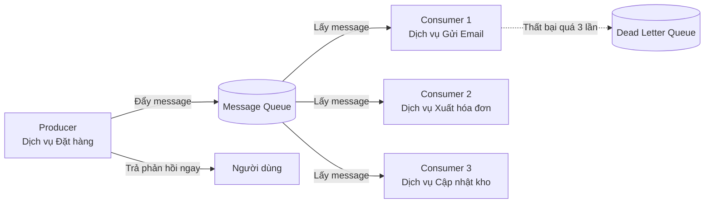
```mermaid
flowchart LR
    A[Producer<br>Dịch vụ Đặt hàng] -- Đẩy message --> Q[(Message Queue)]
    Q -- Lấy message --> B[Consumer 1<br>Dịch vụ Gửi Email]
    Q -- Lấy message --> C[Consumer 2<br>Dịch vụ Xuất hóa đơn]
    Q -- Lấy message --> E[Consumer 3<br>Dịch vụ Cập nhật kho]
    A -- Trả phản hồi ngay --> U[Người dùng]
    B -. Thất bại quá 3 lần .-> DLQ[(Dead Letter Queue)]
```

### 7.4. Phân tích tình huống thực tiễn

**Kịch bản có số liệu: sàn thương mại điện tử vào đợt sale "Black Friday" nhận 5.000 đơn hàng mỗi phút.**

Nếu thiết kế theo kiểu đồng bộ, mỗi request đặt hàng phải chờ toàn bộ chuỗi xử lý hoàn tất tuần tự: ghi đơn hàng vào database (80ms) → gọi API bên thứ ba để gửi email (600ms, phụ thuộc mạng ngoài) → gọi dịch vụ xuất hóa đơn điện tử tuân thủ thuế (900ms) → cập nhật số lượng tồn kho (50ms). Tổng thời gian phản hồi lên tới **~1.630ms**, và nếu dịch vụ gửi email bên thứ ba gặp sự cố (timeout 5 giây), toàn bộ đơn hàng sẽ bị treo theo, gây ùn ứ hàng loạt request khác đang chờ xử lý.

Sau khi tái thiết kế với Message Queue (RabbitMQ):

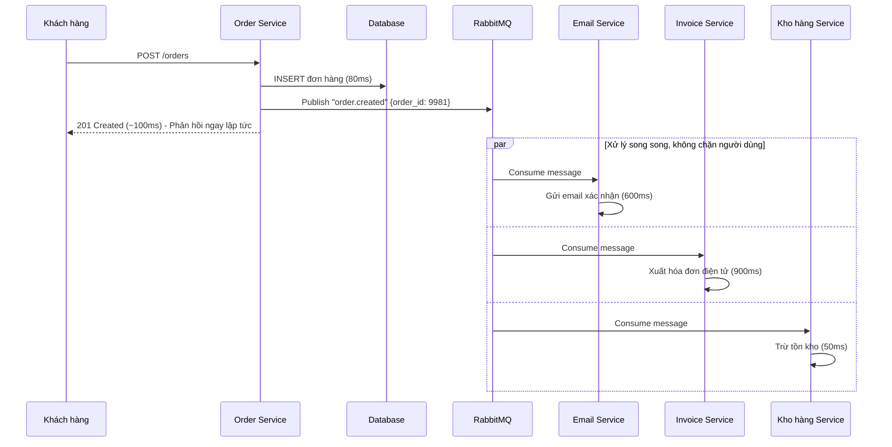
```mermaid
sequenceDiagram
    participant U as Khách hàng
    participant S as Order Service
    participant DB as Database
    participant Q as RabbitMQ
    participant E as Email Service
    participant I as Invoice Service
    participant K as Kho hàng Service

    U->>S: POST /orders
    S->>DB: INSERT đơn hàng (80ms)
    S->>Q: Publish "order.created" {order_id: 9981}
    S-->>U: 201 Created (~100ms) - Phản hồi ngay lập tức

    par Xử lý song song, không chặn người dùng
        Q->>E: Consume message
        E->>E: Gửi email xác nhận (600ms)
    and
        Q->>I: Consume message
        I->>I: Xuất hóa đơn điện tử (900ms)
    and
        Q->>K: Consume message
        K->>K: Trừ tồn kho (50ms)
    end
```

**Kết quả:** Thời gian phản hồi cho khách hàng giảm từ ~1.630ms xuống còn khoảng **100ms** — nhanh hơn hơn 16 lần — vì server chỉ cần ghi đơn hàng và đẩy một thông điệp nhẹ vào hàng đợi rồi trả kết quả ngay, không cần chờ các bước phụ trợ. Khi dịch vụ xuất hóa đơn gặp sự cố tạm thời (ví dụ API thuế bên ngoài bị lỗi 30 giây), thông điệp vẫn nằm an toàn trong hàng đợi và tự động được Consumer xử lý lại (retry) ngay khi dịch vụ phục hồi — khách hàng hoàn toàn không nhận thấy sự cố, đơn hàng vẫn được ghi nhận đúng hạn.

**Đánh đổi cần cân nhắc:** Kiến trúc bất đồng bộ làm tăng độ phức tạp vận hành — cần giám sát độ dài hàng đợi (queue length), xử lý tình huống thông điệp bị xử lý trùng lặp (liên quan trực tiếp đến khái niệm Idempotency ở phần tiếp theo), và chấp nhận rằng dữ liệu giữa các dịch vụ có độ trễ nhất định (eventual consistency) thay vì nhất quán tức thời.

---

## 8. Idempotency

### 8.1. Đặt vấn đề

Trên môi trường mạng, một yêu cầu có thể bị gửi lặp lại ngoài ý muốn: người dùng bấm nút "Thanh toán" nhiều lần do mạng chậm, hoặc ứng dụng client tự động gửi lại request khi không nhận được phản hồi kịp thời (retry). Nếu server xử lý mỗi lần gửi như một giao dịch mới, khách hàng có thể bị trừ tiền hai, ba lần cho cùng một đơn hàng.

### 8.2. Khái niệm

**Idempotency (Tính lũy đẳng)** là tính chất của một thao tác mà khi thực hiện **nhiều lần với cùng một đầu vào**, kết quả tác động lên hệ thống hoàn toàn giống như khi thực hiện **một lần duy nhất**. Đây là một tính chất cực kỳ quan trọng đối với các API xử lý giao dịch tài chính hoặc các thao tác có thể bị gửi lặp do lỗi mạng — đặc biệt quan trọng khi kết hợp với Message Queue ở trên, vì hầu hết các hệ thống message queue chỉ đảm bảo cơ chế "at-least-once delivery" (một thông điệp có thể được gửi nhiều hơn một lần trong một số tình huống lỗi mạng), nên phía Consumer bắt buộc phải tự đảm bảo tính idempotent khi xử lý.

Xét theo chuẩn HTTP, các phương thức `GET`, `PUT`, `DELETE` về bản chất được thiết kế mang tính idempotent (gọi `DELETE /orders/5` một hay nhiều lần thì kết quả cuối cùng vẫn là đơn hàng 5 bị xóa), trong khi `POST` mặc định **không** đảm bảo tính idempotent — mỗi lần gọi `POST /orders` mặc định sẽ tạo ra một đơn hàng mới.

Kỹ thuật phổ biến để đảm bảo idempotency cho các API tạo mới (như thanh toán) là sử dụng **Idempotency Key**: client sinh ra một mã định danh duy nhất cho mỗi thao tác nghiệp vụ và gửi kèm trong request; server lưu lại mã này, nếu nhận được request trùng mã, server sẽ trả về kết quả của lần xử lý trước đó thay vì thực hiện lại giao dịch.

### 8.3. Sơ đồ minh họa luồng xử lý

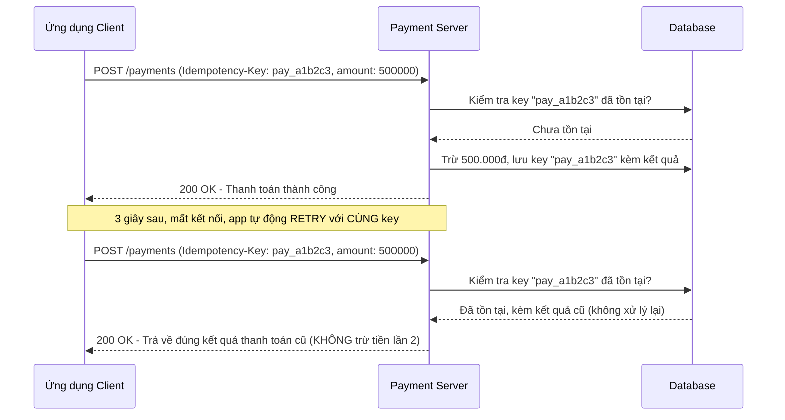
```mermaid
sequenceDiagram
    participant C as Ứng dụng Client
    participant S as Payment Server
    participant DB as Database

    C->>S: POST /payments (Idempotency-Key: pay_a1b2c3, amount: 500000)
    S->>DB: Kiểm tra key "pay_a1b2c3" đã tồn tại?
    DB-->>S: Chưa tồn tại
    S->>DB: Trừ 500.000đ, lưu key "pay_a1b2c3" kèm kết quả
    S-->>C: 200 OK - Thanh toán thành công

    Note over C,S: 3 giây sau, mất kết nối, app tự động RETRY với CÙNG key

    C->>S: POST /payments (Idempotency-Key: pay_a1b2c3, amount: 500000)
    S->>DB: Kiểm tra key "pay_a1b2c3" đã tồn tại?
    DB-->>S: Đã tồn tại, kèm kết quả cũ (không xử lý lại)
    S-->>C: 200 OK - Trả về đúng kết quả thanh toán cũ (KHÔNG trừ tiền lần 2)
```

### 8.4. Phân tích tình huống thực tiễn

**Kịch bản có số liệu cụ thể:** Khách hàng thực hiện thanh toán 500.000đ trên ứng dụng đặt đồ ăn. Ứng dụng gửi request kèm header:

```
POST /payments
Idempotency-Key: pay_9f8e7d6c5b4a
Body: { "order_id": 9981, "amount": 500000 }
```

Server nhận request, kiểm tra bảng `idempotency_keys` chưa có mã `pay_9f8e7d6c5b4a` nào được ghi nhận trước đó, tiến hành trừ tiền và lưu lại cặp `(key, result)` vào bảng này. Ngay sau khi trừ tiền thành công nhưng trước khi phản hồi kịp trả về (do sóng di động của khách hàng bị gián đoạn giữa đường), ứng dụng client — vốn được lập trình để tự động thử lại khi không nhận được phản hồi trong 3 giây — gửi lại **chính xác cùng một request** với cùng `Idempotency-Key`.

Nếu không có cơ chế idempotency key, server sẽ hiểu đây là một yêu cầu thanh toán hoàn toàn mới và trừ thêm 500.000đ lần thứ hai — khách hàng bị trừ tổng cộng 1.000.000đ cho một đơn hàng trị giá 500.000đ, một lỗi nghiêm trọng có thể gây khiếu nại hàng loạt và tổn hại uy tín doanh nghiệp.

Với cơ chế idempotency key, server nhận diện request thứ hai có key trùng với một giao dịch đã xử lý, **không thực hiện trừ tiền lần nữa**, chỉ đơn giản trả lại đúng kết quả đã lưu ở lần đầu tiên (200 OK, thanh toán thành công, số dư giao dịch 500.000đ) — đảm bảo khách hàng chỉ bị trừ đúng một lần dù request được gửi bao nhiêu lần.

**Ứng dụng thực tế:** Đây chính xác là cơ chế mà cổng thanh toán **Stripe** áp dụng — tài liệu chính thức của Stripe yêu cầu bắt buộc gửi kèm `Idempotency-Key` cho mọi API tạo giao dịch (`POST /v1/charges`), và khóa này có hiệu lực trong 24 giờ trên hệ thống của họ. Tương tự, các ví điện tử tại Việt Nam như MoMo hay ZaloPay cũng áp dụng cơ chế mã giao dịch duy nhất (`requestId`/`orderId`) theo đúng nguyên lý idempotency để đảm bảo an toàn cho các giao dịch tài chính khi mạng không ổn định.

---

## 9. Rate Limiting

### 9.1. Đặt vấn đề

Không phải mọi lưu lượng truy cập đến hệ thống đều lành mạnh. Một client bị lỗi có thể gửi hàng nghìn request mỗi giây liên tục; nghiêm trọng hơn, kẻ tấn công có thể chủ động thực hiện tấn công từ chối dịch vụ (DoS) bằng cách dội bom yêu cầu vào hệ thống nhằm làm sập server, ảnh hưởng đến trải nghiệm của toàn bộ người dùng hợp lệ khác.

### 9.2. Khái niệm

**Rate Limiting (Giới hạn tần suất)** là kỹ thuật kiểm soát số lượng yêu cầu mà một client (xác định qua địa chỉ IP, API key, hoặc tài khoản người dùng) được phép gửi đến hệ thống trong một khoảng thời gian nhất định. Khi vượt quá ngưỡng cho phép, server sẽ từ chối các yêu cầu vượt mức, thường trả về mã trạng thái HTTP **429 Too Many Requests** kèm header `Retry-After` cho biết client nên chờ bao lâu trước khi thử lại.

Một số thuật toán phổ biến để triển khai rate limiting:

- **Fixed Window:** Đếm số request trong từng khung thời gian cố định (ví dụ mỗi phút); đơn giản nhưng có thể bị "lách" ở ranh giới giữa hai khung giờ (gửi dồn dập vào cuối khung này và đầu khung sau, tổng cộng vượt xa giới hạn thực tế mong muốn).
- **Sliding Window:** Cải tiến của Fixed Window, tính toán số request trong một cửa sổ thời gian trượt liên tục, cho kết quả chính xác hơn.
- **Token Bucket:** Mỗi client có một "xô chứa token" với dung lượng tối đa cố định, token được nạp đều đặn theo thời gian; mỗi request tiêu tốn một token, hết token thì request bị từ chối. Thuật toán này cho phép xử lý linh hoạt các đợt tăng đột biến (burst) trong giới hạn cho phép, được sử dụng rộng rãi nhất trong thực tế nhờ tính cân bằng giữa độ chính xác và hiệu năng.

### 9.3. Sơ đồ minh họa luồng xử lý

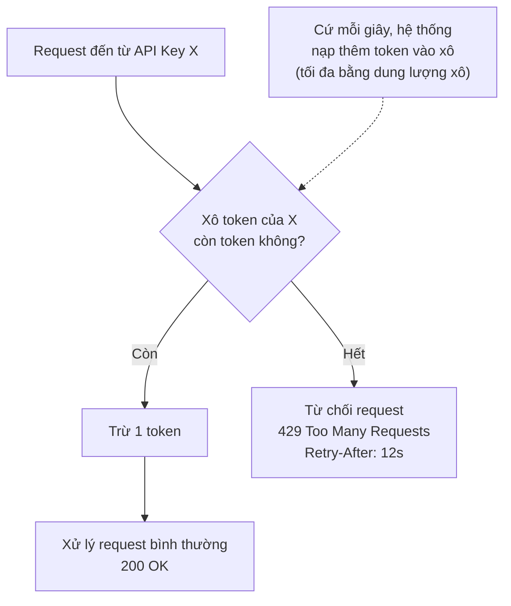
```mermaid
flowchart TD
    A["Request đến từ API Key X"] --> B{"Xô token của X<br>còn token không?"}
    B -- Còn --> C["Trừ 1 token"]
    C --> D["Xử lý request bình thường<br>200 OK"]
    B -- Hết --> E["Từ chối request<br>429 Too Many Requests<br>Retry-After: 12s"]
    F["Cứ mỗi giây, hệ thống<br>nạp thêm token vào xô<br>(tối đa bằng dung lượng xô)"] -.-> B
```

### 9.4. Phân tích tình huống thực tiễn

**Kịch bản có số liệu cụ thể: API công khai của một nền tảng gọi món (tương tự GitHub API), áp dụng thuật toán Token Bucket.**

Chính sách được thiết lập: mỗi API Key được cấp một xô chứa tối đa **100 token**, tốc độ nạp token là **10 token/giây**, mỗi request tiêu tốn đúng 1 token.

| Gói dịch vụ | Dung lượng xô | Tốc độ nạp | Số request tối đa/giờ |
|---|---|---|---|
| Free Tier | 20 token | 2 token/giây | ~7.200 |
| Pro Tier | 100 token | 10 token/giây | ~36.000 |
| Enterprise | 500 token | 50 token/giây | ~180.000 |

Giả sử một ứng dụng đối tác thuộc gói Free Tier đột nhiên gửi 50 request dồn dập trong 1 giây (ví dụ do lỗi vòng lặp vô hạn trong code của đối tác gọi API liên tục mà không kiểm tra điều kiện dừng). Với xô chỉ có 20 token, hệ thống chấp nhận 20 request đầu tiên, sau đó **30 request tiếp theo bị từ chối ngay lập tức** với phản hồi:

```
HTTP/1.1 429 Too Many Requests
Retry-After: 5
X-RateLimit-Limit: 20
X-RateLimit-Remaining: 0
X-RateLimit-Reset: 1735459200
```

**Giá trị mang lại:** Nhờ rate limiting, sự cố lập trình phía đối tác không làm ảnh hưởng đến hiệu năng chung của toàn bộ hệ thống — server chính vẫn phục vụ bình thường cho hàng nghìn đối tác khác. Đồng thời, cơ chế phân tầng theo gói dịch vụ (Free/Pro/Enterprise) tạo ra động lực kinh doanh: khách hàng có nhu cầu truy vấn lớn sẽ nâng cấp gói trả phí thay vì tìm cách lách giới hạn.

**Trường hợp thực tế nổi tiếng:** API công khai của Twitter/X áp dụng rate limit rất chặt (ví dụ giới hạn 50 request/15 phút cho một số endpoint ở gói miễn phí) sau năm 2023, khiến nhiều ứng dụng bên thứ ba từng phụ thuộc vào API này phải thay đổi kiến trúc hoặc trả phí sử dụng — minh chứng rõ ràng cho vai trò của rate limiting không chỉ trong bảo vệ hệ thống mà còn trong chiến lược kiểm soát quyền truy cập dữ liệu ở quy mô doanh nghiệp.

---

## 10. Load Balancing

### 10.1. Đặt vấn đề

Một máy chủ đơn lẻ, dù mạnh đến đâu, cũng có giới hạn về khả năng xử lý (CPU, RAM, băng thông mạng). Khi lượng truy cập vượt quá năng lực của một server, hệ thống sẽ phản hồi chậm hoặc sập hoàn toàn. Ngoài ra, nếu toàn bộ lưu lượng chỉ phụ thuộc vào một máy chủ duy nhất, đây sẽ là điểm lỗi duy nhất (**Single Point of Failure**) — chỉ cần máy chủ đó gặp sự cố, toàn bộ dịch vụ ngừng hoạt động.

### 10.2. Khái niệm

**Load Balancing (Cân bằng tải)** là kỹ thuật phân phối lưu lượng truy cập đến từ client ra nhiều máy chủ backend khác nhau (thường gọi là các **instance** hoặc **node**), nhằm đảm bảo không có máy chủ nào bị quá tải trong khi các máy chủ khác nhàn rỗi. Thiết bị hoặc phần mềm thực hiện việc phân phối này gọi là **Load Balancer**, đóng vai trò là điểm tiếp nhận trung gian giữa client và cụm máy chủ (server cluster/pool).

Các thuật toán phân phối tải phổ biến:

- **Round Robin:** Lần lượt phân phối request cho từng server theo vòng tuần tự.
- **Least Connections:** Ưu tiên chuyển request đến server đang có ít kết nối đang xử lý nhất — phù hợp khi các request có thời gian xử lý không đồng đều.
- **IP Hash:** Dựa trên địa chỉ IP của client để luôn định tuyến về cùng một server, hữu ích khi cần duy trì phiên làm việc (session) mà không dùng session lưu tập trung.

Load Balancer cũng thường xuyên thực hiện **health check** — kiểm tra định kỳ (ví dụ mỗi 5 giây gửi `GET /health`) tình trạng hoạt động của từng server backend; nếu một server không phản hồi sau một số lần thử nhất định, load balancer tự động đưa server đó ra khỏi danh sách phục vụ (loại khỏi vòng quay Round Robin), tăng khả năng chịu lỗi tổng thể của hệ thống.

### 10.3. Sơ đồ minh họa luồng xử lý

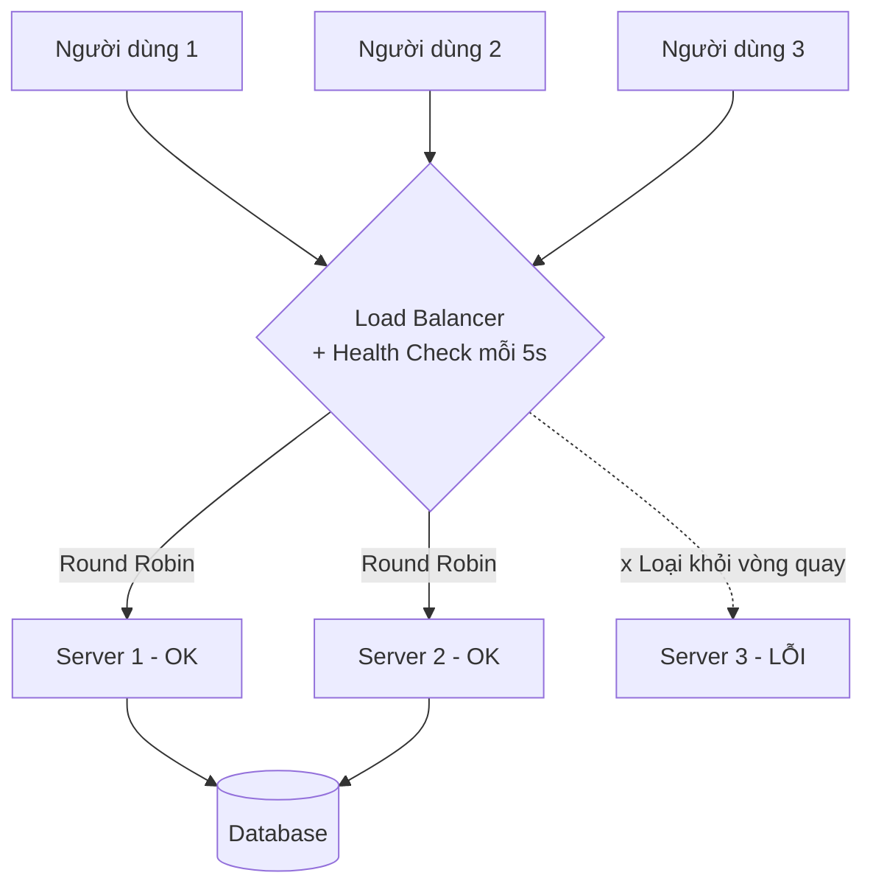
```mermaid
flowchart TD
    U1[Người dùng 1] --> LB{Load Balancer<br>+ Health Check mỗi 5s}
    U2[Người dùng 2] --> LB
    U3[Người dùng 3] --> LB
    LB -- Round Robin --> S1[Server 1 - OK]
    LB -- Round Robin --> S2[Server 2 - OK]
    LB -.x Loại khỏi vòng quay .-> S3[Server 3 - LỖI]
    S1 --> DB[(Database)]
    S2 --> DB
```

### 10.4. Phân tích tình huống thực tiễn

**Kịch bản có số liệu: nền tảng đặt xe công nghệ triển khai 10 server backend giống hệt nhau (mỗi server chịu tải tối đa khoảng 2.000 request/giây) đứng sau một Load Balancer (ví dụ Nginx hoặc AWS Elastic Load Balancer).**

Trong giờ cao điểm buổi tối, hệ thống ghi nhận khoảng **18.000 request/giây** đặt xe. Load Balancer áp dụng thuật toán **Least Connections**, phân phối đều lưu lượng này cho 10 server, mỗi server xử lý trung bình khoảng 1.800 request/giây — nằm trong ngưỡng an toàn, không server nào bị quá tải.

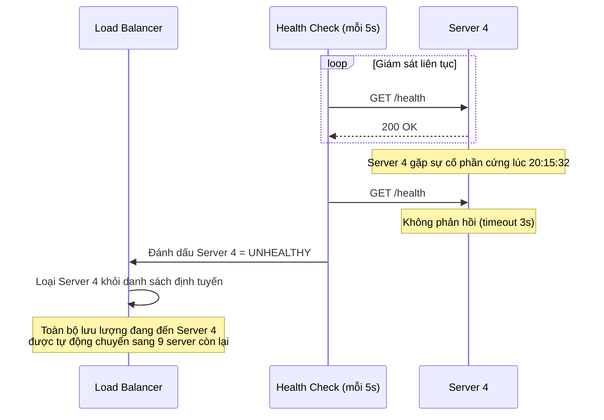
```mermaid
sequenceDiagram
    participant LB as Load Balancer
    participant HC as Health Check (mỗi 5s)
    participant S4 as Server 4

    loop Giám sát liên tục
        HC->>S4: GET /health
        S4-->>HC: 200 OK
    end

    Note over S4: Server 4 gặp sự cố phần cứng lúc 20:15:32

    HC->>S4: GET /health
    Note over S4: Không phản hồi (timeout 3s)
    HC->>LB: Đánh dấu Server 4 = UNHEALTHY
    LB->>LB: Loại Server 4 khỏi danh sách định tuyến

    Note over LB: Toàn bộ lưu lượng đang đến Server 4<br>được tự động chuyển sang 9 server còn lại
```

Đến 20h15, Server 4 gặp sự cố phần cứng đột ngột và ngừng phản hồi. Load Balancer, thông qua cơ chế health check gửi định kỳ mỗi 5 giây, phát hiện Server 4 không phản hồi sau 2 lần kiểm tra liên tiếp (tổng cộng khoảng 10-15 giây), lập tức đánh dấu server này là "unhealthy" và loại khỏi vòng quay phân phối. Toàn bộ lưu lượng ~1.800 request/giây vốn đang được xử lý bởi Server 4 ngay lập tức được phân phối lại cho 9 server còn lại (mỗi server nhận thêm trung bình 200 request/giây) — vẫn nằm trong giới hạn năng lực của từng server (2.000 request/giây), nên **người dùng hoàn toàn không nhận thấy gián đoạn dịch vụ**, đơn đặt xe vẫn được xử lý bình thường trong suốt quá trình đội kỹ thuật khắc phục sự cố phần cứng của Server 4.

**Mở rộng ở quy mô doanh nghiệp lớn:** Đối với các hệ thống toàn cầu như Netflix hay Amazon, load balancing không chỉ dừng ở việc phân phối tải giữa các server trong một trung tâm dữ liệu, mà còn được triển khai ở tầng cao hơn — **cân bằng tải theo khu vực địa lý (Geo Load Balancing / GSLB)** — tự động định tuyến người dùng đến trung tâm dữ liệu gần nhất hoặc còn khả dụng gần nhất (ví dụ người dùng tại Việt Nam được định tuyến đến trung tâm dữ liệu Singapore thay vì Mỹ), vừa giảm độ trễ mạng, vừa đảm bảo hệ thống vẫn hoạt động ngay cả khi toàn bộ một trung tâm dữ liệu khu vực gặp sự cố diện rộng.

---

## Tổng kết

Mười khái niệm trình bày ở trên tuy độc lập nhưng có mối liên hệ chặt chẽ trong một hệ thống backend thực tế, thể hiện rõ qua các tình huống đã phân tích: một API được thiết kế theo chuẩn RESTful (1) cần được bảo vệ bởi cơ chế Authentication & Authorization (2) để tránh truy cập trái phép; dữ liệu phía sau cần Database Index (3) để truy vấn nhanh trên hàng chục triệu bản ghi và Transaction (4) để đảm bảo tính toàn vẹn cho các giao dịch tài chính; khi nhiều người dùng tranh chấp cùng một tài nguyên (như ghế xem phim), hệ thống phải xử lý tốt Concurrency (5); để giảm tải cho database ở các truy vấn lặp lại, hệ thống sử dụng Cache (6); để không bắt người dùng chờ đợi các tác vụ phụ trợ, hệ thống dùng Message Queue (7) xử lý bất đồng bộ — nhưng khi đó các API xử lý lại thông điệp trùng lặp bắt buộc phải đảm bảo Idempotency (8) để tránh trừ tiền hai lần; cuối cùng, toàn hệ thống cần Rate Limiting (9) để chống lạm dụng và tấn công, cùng Load Balancing (10) để mở rộng quy mô và duy trì tính sẵn sàng cao ngay cả khi một phần hạ tầng gặp sự cố. Việc hiểu đúng bản chất — không chỉ cách dùng mà còn lý do tồn tại, đánh đổi (trade-off), và giới hạn của từng khái niệm — chính là nền tảng để một kỹ sư backend thiết kế được hệ thống vừa hiệu quả, vừa bền vững trước sự tăng trưởng của người dùng.
