# MƯỜI HAI KHÁI NIỆM NỀN TẢNG TRONG PHÁT TRIỂN BACKEND

## Lời mở đầu

Trong kiến trúc của một hệ thống phần mềm hiện đại, backend đóng vai trò là "bộ não" xử lý logic nghiệp vụ, quản lý dữ liệu và đảm bảo hệ thống vận hành ổn định dưới áp lực của hàng nghìn, thậm chí hàng triệu người dùng truy cập đồng thời. Để xây dựng được một hệ thống backend vững chắc, người kỹ sư phần mềm cần nắm vững không chỉ cú pháp lập trình mà còn phải hiểu sâu sắc bản chất của các nguyên lý thiết kế nền tảng. Tài liệu này trình bày mười hai khái niệm cốt lõi, thường xuyên xuất hiện trong thực tế phát triển và phỏng vấn kỹ thuật, theo cấu trúc: đặt vấn đề — trình bày khái niệm — sơ đồ minh họa luồng xử lý — phân tích tình huống thực tiễn với số liệu và ngữ cảnh cụ thể.

---

## Mục lục

1. [RESTful API](#1-restful-api)
2. [Authentication & Authorization](#2-authentication--authorization)
3. [Database Index](#3-database-index)
4. [Database Transaction](#4-database-transaction)
5. [Concurrency](#5-concurrency)
6. [Cache](#6-cache)
7. [Message Queue](#7-message-queue)
8. [Idempotency](#8-idempotency)
9. [Rate Limiting](#9-rate-limiting)
10. [Load Balancing](#10-load-balancing)
11. [Horizontal & Vertical Scaling](#11-horizontal--vertical-scaling)
12. [Reverse Proxy](#12-reverse-proxy)

---

## 1. RESTful API

### 1.1. Đặt vấn đề

Khi hai hệ thống phần mềm khác nhau — ví dụ một ứng dụng di động viết bằng Swift và một máy chủ viết bằng Node.js — cần giao tiếp với nhau, chúng không thể chia sẻ trực tiếp bộ nhớ hay hàm nội bộ. Cần một **quy ước chung** để bên gửi yêu cầu (client) và bên xử lý (server) hiểu được nhau, bất kể được viết bằng ngôn ngữ hay nền tảng nào. Nếu mỗi API được thiết kế tùy tiện, không theo chuẩn mực, hệ thống sẽ khó mở rộng, khó bảo trì và gây nhầm lẫn cho đội ngũ phát triển.

### 1.2. Khái niệm

**REST (Representational State Transfer)** là một kiểu kiến trúc (architectural style) do Roy Fielding đề xuất năm 2000, đặt ra các nguyên tắc để thiết kế API giao tiếp qua giao thức HTTP. Một API tuân theo REST — gọi là **RESTful API** — coi mọi thực thể trong hệ thống là một **tài nguyên (resource)**, được định danh bằng một URI (ví dụ `/users/123`), và các thao tác trên tài nguyên đó được thể hiện qua các **phương thức HTTP chuẩn**:

| Phương thức | Ý nghĩa | Ví dụ |
|---|---|---|
| GET | Lấy thông tin tài nguyên | `GET /users/123` |
| POST | Tạo mới tài nguyên | `POST /users` |
| PUT | Cập nhật toàn bộ tài nguyên | `PUT /users/123` |
| PATCH | Cập nhật một phần tài nguyên | `PATCH /users/123` |
| DELETE | Xóa tài nguyên | `DELETE /users/123` |

Sáu nguyên tắc cốt lõi của REST gồm: giao tiếp client-server tách biệt, không lưu trạng thái phiên trên server (**stateless**), có thể cache được, giao diện thống nhất (uniform interface), hệ thống phân lớp (layered system), và tùy chọn mã thực thi (code-on-demand). Trong đó, tính **stateless** là quan trọng nhất: mỗi yêu cầu từ client phải chứa đầy đủ thông tin cần thiết để server xử lý, server không ghi nhớ trạng thái của các yêu cầu trước đó.

### 1.3. Sơ đồ minh họa luồng xử lý

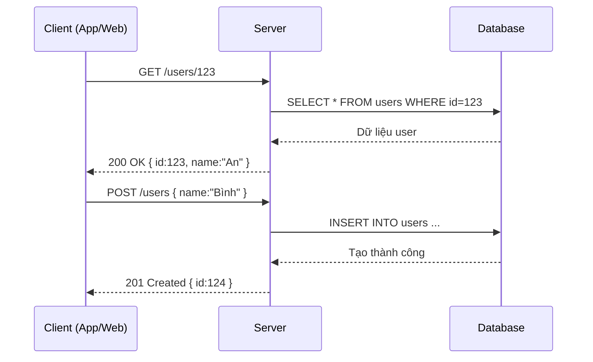
```mermaid
sequenceDiagram
    participant C as Client (App/Web)
    participant S as Server
    participant DB as Database

    C->>S: GET /users/123
    S->>DB: SELECT * FROM users WHERE id=123
    DB-->>S: Dữ liệu user
    S-->>C: 200 OK { id:123, name:"An" }

    C->>S: POST /users { name:"Bình" }
    S->>DB: INSERT INTO users ...
    DB-->>S: Tạo thành công
    S-->>C: 201 Created { id:124 }
```

### 1.4. Phân tích tình huống thực tiễn

Xét hệ thống backend của một sàn thương mại điện tử cỡ vừa, thiết kế API cho tài nguyên "đơn hàng" (`orders`). Đội kỹ thuật định nghĩa bộ endpoint như sau:

| Endpoint | Phương thức | Chức năng | Mã trạng thái thành công |
|---|---|---|---|
| `/orders` | GET | Lấy danh sách đơn hàng (có phân trang `?page=1&limit=20`) | 200 |
| `/orders/45` | GET | Lấy chi tiết đơn hàng số 45 | 200 |
| `/orders` | POST | Tạo đơn hàng mới | 201 |
| `/orders/45` | PATCH | Cập nhật trạng thái giao hàng | 200 |
| `/orders/45` | DELETE | Hủy đơn hàng | 204 |

Toàn bộ vòng đời của một đơn hàng có thể mô tả bằng sơ đồ trạng thái sau, trong đó mỗi lần chuyển trạng thái tương ứng với một lệnh gọi `PATCH /orders/{id}`:

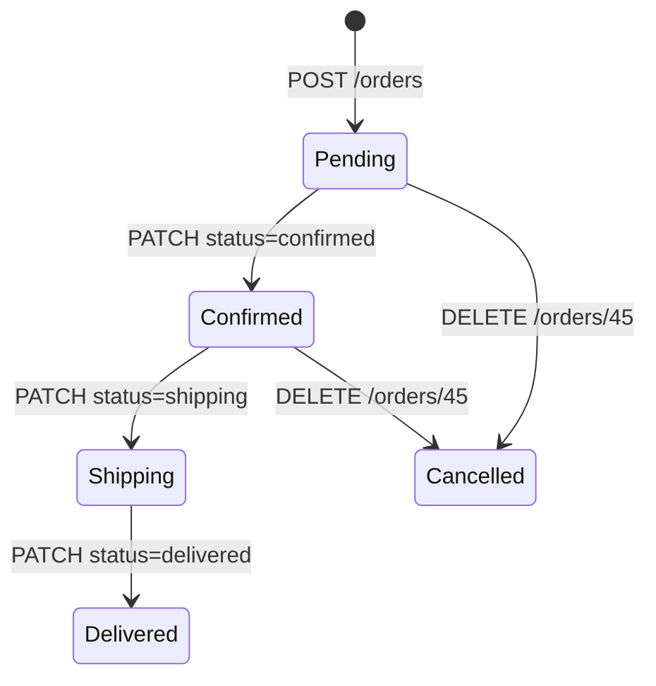
```mermaid
stateDiagram-v2
    [*] --> Pending: POST /orders
    Pending --> Confirmed: PATCH status=confirmed
    Confirmed --> Shipping: PATCH status=shipping
    Shipping --> Delivered: PATCH status=delivered
    Pending --> Cancelled: DELETE /orders/45
    Confirmed --> Cancelled: DELETE /orders/45
```

**Giá trị thực tiễn mang lại:** Nhờ tuân thủ chuẩn REST và tính chất stateless, đội frontend web, đội mobile (iOS/Android) và cả đối tác giao vận bên thứ ba (ví dụ Giao Hàng Nhanh) có thể tích hợp cùng một bộ API mà không cần biết backend được viết bằng ngôn ngữ gì. Khi công ty mở rộng, đội kỹ thuật chỉ cần bổ sung endpoint mới (ví dụ `/orders/45/tracking`) mà không phá vỡ các client đang tồn tại — đây chính là lý do REST trở thành lựa chọn mặc định cho các hệ thống API công khai như GitHub API, Stripe API, hay Shopify API.

**Vấn đề thường gặp khi không tuân thủ REST đúng chuẩn:** Một lỗi thiết kế phổ biến là đặt động từ vào URI (ví dụ `POST /getUserInfo`, `POST /deleteOrder45`) thay vì dùng danh từ và phương thức HTTP tương ứng. Cách làm này khiến API thiếu nhất quán, khó đoán, và không tận dụng được các cơ chế cache/proxy tiêu chuẩn của HTTP.

---

## 2. Authentication & Authorization

### 2.1. Đặt vấn đề

Một hệ thống mở cho phép bất kỳ ai gửi yêu cầu cũng đọc, sửa dữ liệu sẽ nhanh chóng bị lạm dụng: người dùng có thể xem thông tin của người khác, hoặc thực hiện thao tác vượt quyền hạn (ví dụ nhân viên bình thường xóa được dữ liệu của quản trị viên). Do đó hệ thống cần trả lời được hai câu hỏi riêng biệt: "Bạn là ai?" và "Bạn được phép làm gì?".

### 2.2. Khái niệm

**Authentication (Xác thực)** là quá trình xác minh danh tính của người dùng — trả lời câu hỏi "bạn là ai". Các phương thức phổ biến gồm: đăng nhập bằng mật khẩu, xác thực qua **token** (như JWT — JSON Web Token), OAuth2, hoặc sinh trắc học.

**Authorization (Phân quyền)** là quá trình xác định người dùng đã được xác thực đó có quyền thực hiện một hành động cụ thể hay không — trả lời câu hỏi "bạn được phép làm gì". Authorization luôn diễn ra **sau** authentication.

Hai khái niệm này thường bị nhầm lẫn nhưng hoàn toàn độc lập: một người có thể được xác thực thành công (hệ thống biết chính xác họ là ai) nhưng vẫn bị từ chối truy cập vì không đủ quyền hạn.

Mô hình phân quyền phổ biến nhất là **RBAC (Role-Based Access Control)** — gán quyền theo vai trò (admin, editor, viewer...) thay vì gán trực tiếp cho từng người dùng, giúp việc quản lý quyền hạn ở quy mô lớn trở nên đơn giản hơn. Mô hình nâng cao hơn là **ABAC (Attribute-Based Access Control)** — quyết định quyền dựa trên nhiều thuộc tính kết hợp (vai trò, phòng ban, thời gian, vị trí địa lý...).

### 2.3. Sơ đồ minh họa luồng xử lý

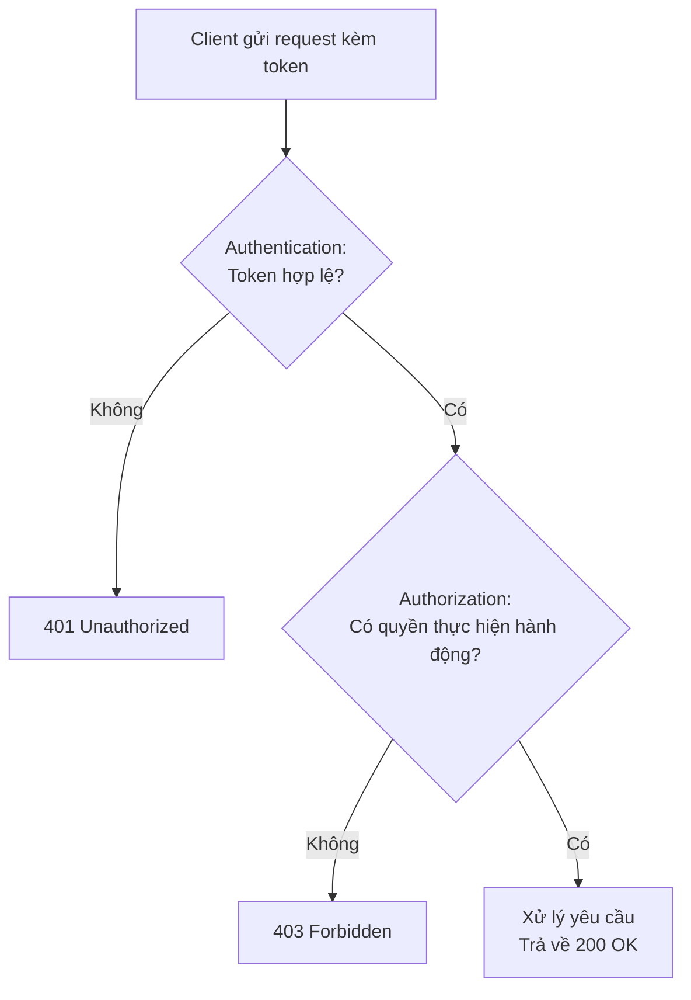
```mermaid
flowchart TD
    A[Client gửi request kèm token] --> B{Authentication:<br>Token hợp lệ?}
    B -- Không --> C[401 Unauthorized]
    B -- Có --> D{Authorization:<br>Có quyền thực hiện hành động?}
    D -- Không --> E[403 Forbidden]
    D -- Có --> F[Xử lý yêu cầu<br>Trả về 200 OK]
```

### 2.4. Phân tích tình huống thực tiễn

**Kịch bản: hệ thống quản lý nhân sự (HRM) của một công ty 500 nhân viên.**

Bước 1 — Đăng nhập (Authentication): Nhân viên Nguyễn Văn A nhập email và mật khẩu tại `POST /auth/login`. Server kiểm tra thông tin trong database (mật khẩu được lưu dưới dạng băm — hashed — bằng thuật toán bcrypt, không bao giờ lưu plain text), nếu đúng, server sinh ra một **JWT** chứa các thông tin (payload) như `user_id`, `role: "employee"`, `exp` (thời điểm hết hạn), rồi ký số bằng khóa bí mật của server. JWT này được trả về client và client đính kèm vào header `Authorization: Bearer <token>` cho mọi request sau đó.

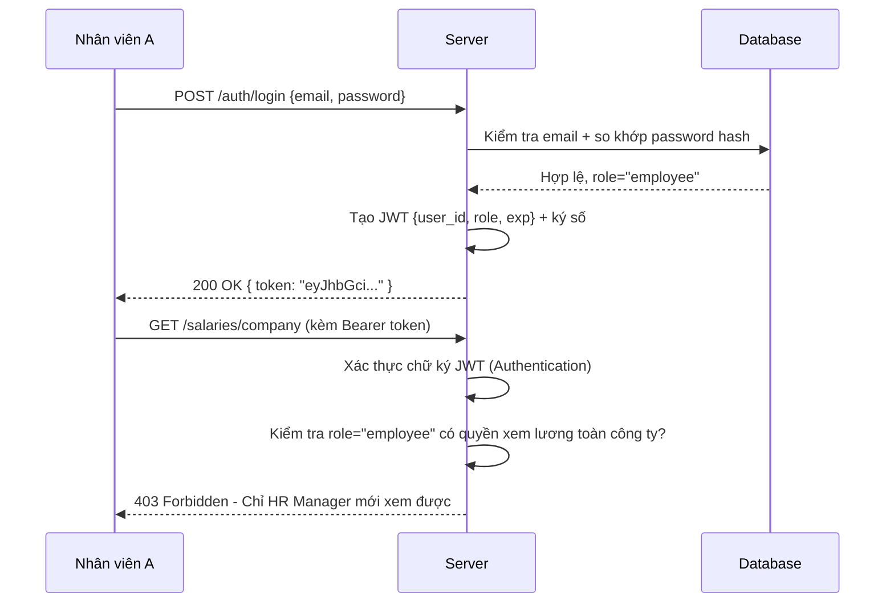
```mermaid
sequenceDiagram
    participant U as Nhân viên A
    participant S as Server
    participant DB as Database

    U->>S: POST /auth/login {email, password}
    S->>DB: Kiểm tra email + so khớp password hash
    DB-->>S: Hợp lệ, role="employee"
    S->>S: Tạo JWT {user_id, role, exp} + ký số
    S-->>U: 200 OK { token: "eyJhbGci..." }

    U->>S: GET /salaries/company (kèm Bearer token)
    S->>S: Xác thực chữ ký JWT (Authentication)
    S->>S: Kiểm tra role="employee" có quyền xem lương toàn công ty?
    S-->>U: 403 Forbidden - Chỉ HR Manager mới xem được
```

Bước 2 — Kiểm tra quyền (Authorization): Khi A gửi `GET /salaries/company` để xem bảng lương toàn công ty, server xác thực chữ ký JWT thành công (biết chắc đây là A), nhưng khi đối chiếu bảng phân quyền RBAC dưới đây, vai trò `employee` không có quyền `view_all_salaries`, nên hệ thống trả về **403 Forbidden** dù A đã đăng nhập hợp lệ.

| Vai trò (Role) | Xem lương bản thân | Xem lương toàn công ty | Chỉnh sửa hồ sơ nhân viên |
|---|---|---|---|
| Employee | ✅ | ❌ | ❌ |
| Team Lead | ✅ | ❌ | ✅ (chỉ nhóm của mình) |
| HR Manager | ✅ | ✅ | ✅ (toàn công ty) |

**Bài học rút ra:** Nếu hệ thống chỉ kiểm tra "token có hợp lệ không" mà bỏ qua bước kiểm tra vai trò, đây chính là lỗ hổng bảo mật nghiêm trọng gọi là **Broken Access Control** — nằm trong top đầu danh sách OWASP Top 10 các lỗ hổng bảo mật web nguy hiểm nhất, từng gây ra nhiều vụ rò rỉ dữ liệu lớn trong thực tế (ví dụ lỗ hổng IDOR — Insecure Direct Object Reference — cho phép người dùng đổi `user_id=123` thành `user_id=124` trên URL để xem dữ liệu người khác nếu server không kiểm tra quyền sở hữu).

---

## 3. Database Index

### 3.1. Đặt vấn đề

Khi một bảng dữ liệu chỉ có vài trăm dòng, việc tìm kiếm bằng cách quét tuần tự (full table scan) không gây ảnh hưởng đáng kể. Nhưng khi bảng có hàng chục triệu bản ghi, một câu truy vấn `SELECT * FROM orders WHERE customer_id = 8823` mà không có cơ chế hỗ trợ sẽ buộc hệ quản trị cơ sở dữ liệu phải kiểm tra từng dòng, khiến thời gian phản hồi tăng lên tuyến tính theo kích thước dữ liệu — gây nghẽn hệ thống.

### 3.2. Khái niệm

**Index (chỉ mục)** là một cấu trúc dữ liệu bổ sung, được xây dựng trên một hoặc nhiều cột của bảng, giúp hệ quản trị cơ sở dữ liệu định vị bản ghi nhanh chóng mà không cần quét toàn bộ bảng. Về bản chất, index hoạt động tương tự mục lục ở cuối một cuốn sách giáo khoa: thay vì đọc từng trang để tìm một thuật ngữ, người đọc tra mục lục để đến thẳng trang cần tìm.

Cấu trúc phổ biến nhất để triển khai index là **B-Tree (Balanced Tree)**, cho phép tìm kiếm, thêm và xóa với độ phức tạp **O(log n)** thay vì O(n) như quét tuần tự. Với các trường hợp tìm kiếm chính xác giá trị (equality lookup), cấu trúc **Hash Index** cũng được sử dụng. Ngoài ra còn có **Composite Index** (đánh index trên nhiều cột kết hợp) và **Covering Index** (index chứa đủ dữ liệu để trả lời truy vấn mà không cần đọc thêm bảng gốc).

Tuy nhiên, index không phải "miễn phí": mỗi lần dữ liệu được thêm, sửa, xóa, hệ thống phải cập nhật lại cấu trúc index tương ứng, làm chậm thao tác ghi (INSERT/UPDATE/DELETE) và tốn thêm dung lượng lưu trữ. Vì vậy việc đánh index cần dựa trên phân tích tần suất truy vấn thực tế, không nên đánh index tràn lan.

### 3.3. Sơ đồ minh họa luồng xử lý

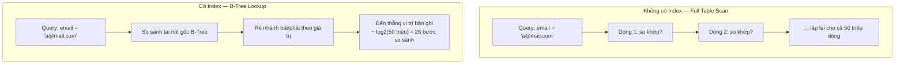
```mermaid
flowchart TD
    subgraph KO["Không có Index — Full Table Scan"]
    direction LR
    A1[Query: email = 'a@mail.com'] --> A2[Dòng 1: so khớp?] --> A3[Dòng 2: so khớp?] --> A4["... lặp lại cho cả 50 triệu dòng"]
    end

    subgraph CO["Có Index — B-Tree Lookup"]
    direction LR
    B1[Query: email = 'a@mail.com'] --> B2["So sánh tại nút gốc B-Tree"]
    B2 --> B3["Rẽ nhánh trái/phải theo giá trị"]
    B3 --> B4["Đến thẳng vị trí bản ghi<br>~ log2(50 triệu) ≈ 26 bước so sánh"]
    end
```

### 3.4. Phân tích tình huống thực tiễn

**Kịch bản: hệ thống bán vé máy bay với bảng `bookings` có 50 triệu bản ghi.**

Trước khi tối ưu, truy vấn tìm vé theo email khách hàng:

```sql
SELECT * FROM bookings WHERE customer_email = 'nguyenvana@mail.com';
```

thực hiện full table scan, mất trung bình **4.200 mili-giây** theo đo đạc thực tế bằng lệnh `EXPLAIN ANALYZE`. Với hệ thống phục vụ hàng nghìn truy vấn tra cứu vé mỗi phút trong giờ cao điểm, database nhanh chóng bị quá tải, các truy vấn khác cũng bị chậm theo (do tranh chấp tài nguyên I/O).

Đội kỹ thuật tạo index trên cột `customer_email`:

```sql
CREATE INDEX idx_bookings_email ON bookings(customer_email);
```

Sau khi tạo index, cùng câu truy vấn trên chỉ còn mất khoảng **0,8 mili-giây** — nhanh hơn khoảng **5.000 lần**, vì hệ thống chỉ cần duyệt qua cây B-Tree có độ sâu khoảng 4-5 tầng thay vì đọc tuần tự 50 triệu dòng.

| Tiêu chí | Không có Index | Có Index |
|---|---|---|
| Thời gian truy vấn SELECT | ~4.200 ms | ~0,8 ms |
| Độ phức tạp | O(n) | O(log n) |
| Tốc độ INSERT/UPDATE | Nhanh hơn | Chậm hơn một chút (phải cập nhật B-Tree) |
| Dung lượng lưu trữ | Thấp hơn | Tăng thêm (index chiếm thêm ổ đĩa) |

**Bài toán đánh đổi trong thực tế:** Bảng `bookings` này còn có cột `status` (trạng thái đặt vé) thường xuyên được `UPDATE` khi vé chuyển từ "đang giữ chỗ" sang "đã thanh toán". Nếu đội kỹ thuật đánh index tràn lan lên toàn bộ các cột, bao gồm cả `status`, tốc độ ghi dữ liệu sẽ giảm đáng kể vì mỗi lần cập nhật trạng thái, hệ thống phải ghi lại cả cấu trúc index. Nguyên tắc thực tế được áp dụng: chỉ đánh index cho các cột thường xuất hiện trong mệnh đề `WHERE`, `JOIN`, `ORDER BY` với tần suất đọc cao và tần suất ghi thấp — đây chính là lý do các kỹ sư luôn phải phân tích query pattern thực tế trước khi quyết định đánh index, thay vì đánh index theo cảm tính.

---

## 4. Database Transaction

### 4.1. Đặt vấn đề

Hãy hình dung một giao dịch chuyển khoản ngân hàng gồm hai bước: trừ tiền tài khoản A và cộng tiền vào tài khoản B. Nếu hệ thống thực hiện xong bước trừ tiền nhưng gặp sự cố (mất điện, lỗi mạng) trước khi cộng tiền, tiền sẽ "biến mất" khỏi hệ thống — một hậu quả không thể chấp nhận trong nghiệp vụ tài chính. Cần một cơ chế đảm bảo rằng một chuỗi thao tác liên quan đến nhau hoặc **thực hiện trọn vẹn**, hoặc **không thực hiện gì cả**.

### 4.2. Khái niệm

**Transaction (Giao dịch)** là một nhóm các thao tác trên cơ sở dữ liệu được gộp lại và xử lý như một đơn vị không thể chia nhỏ (atomic unit). Một transaction chuẩn phải đảm bảo bốn tính chất, gọi tắt là **ACID**:

- **Atomicity (Tính nguyên tử):** Tất cả thao tác trong transaction hoặc hoàn tất toàn bộ (COMMIT), hoặc bị hủy bỏ toàn bộ (ROLLBACK), không có trạng thái "làm dở".
- **Consistency (Tính nhất quán):** Transaction luôn đưa cơ sở dữ liệu từ một trạng thái hợp lệ sang một trạng thái hợp lệ khác, không vi phạm các ràng buộc đã định nghĩa.
- **Isolation (Tính cô lập):** Các transaction chạy đồng thời không ảnh hưởng lẫn nhau như thể chúng được thực thi tuần tự. Mức độ cô lập được chia thành 4 cấp: `Read Uncommitted`, `Read Committed`, `Repeatable Read`, `Serializable` — mức càng cao thì dữ liệu càng nhất quán nhưng hiệu năng càng giảm.
- **Durability (Tính bền vững):** Sau khi transaction đã COMMIT thành công, dữ liệu được lưu trữ vĩnh viễn, kể cả khi hệ thống gặp sự cố ngay sau đó.

### 4.3. Sơ đồ minh họa luồng xử lý

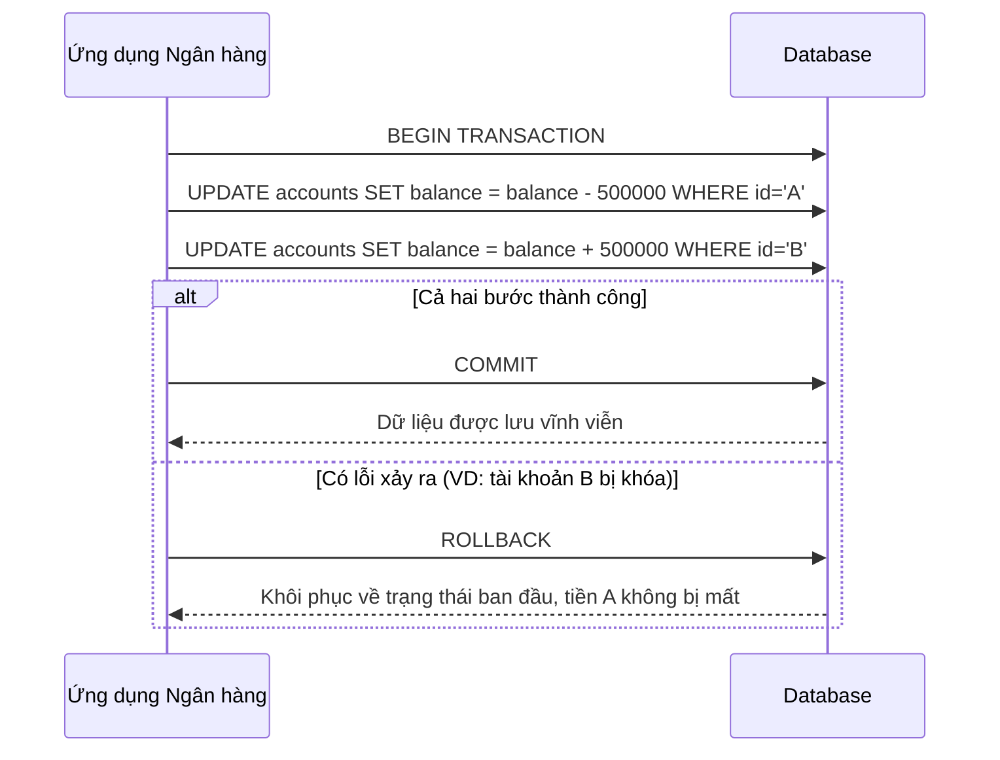
```mermaid
sequenceDiagram
    participant App as Ứng dụng Ngân hàng
    participant DB as Database

    App->>DB: BEGIN TRANSACTION
    App->>DB: UPDATE accounts SET balance = balance - 500000 WHERE id='A'
    App->>DB: UPDATE accounts SET balance = balance + 500000 WHERE id='B'
    alt Cả hai bước thành công
        App->>DB: COMMIT
        DB-->>App: Dữ liệu được lưu vĩnh viễn
    else Có lỗi xảy ra (VD: tài khoản B bị khóa)
        App->>DB: ROLLBACK
        DB-->>App: Khôi phục về trạng thái ban đầu, tiền A không bị mất
    end
```

### 4.4. Phân tích tình huống thực tiễn

**Kịch bản có số liệu cụ thể:** Tài khoản A có số dư 10.000.000đ, tài khoản B có số dư 2.000.000đ. Khách hàng thực hiện chuyển khoản 500.000đ từ A sang B thông qua đoạn mã giả sau:

```sql
BEGIN TRANSACTION;

UPDATE accounts SET balance = balance - 500000 WHERE account_id = 'A';
-- Số dư A tạm thời: 9.500.000đ (chưa commit, chỉ có phiên này nhìn thấy)

UPDATE accounts SET balance = balance + 500000 WHERE account_id = 'B';
-- Nếu tài khoản B đã bị đóng băng do nghi ngờ gian lận, câu lệnh này thất bại

-- Nếu cả hai bước thành công:
COMMIT;
-- Nếu có lỗi ở bất kỳ bước nào:
ROLLBACK;
```

Nếu bước cập nhật tài khoản B thất bại (ví dụ do ràng buộc `CHECK (status != 'frozen')` bị vi phạm), toàn bộ transaction sẽ **ROLLBACK**: số dư tài khoản A được khôi phục về đúng 10.000.000đ như ban đầu, không hề bị trừ đi 500.000đ dù câu lệnh UPDATE đầu tiên đã "chạy". Nhờ tính Atomicity, hệ thống không bao giờ rơi vào trạng thái lửng lơ (A đã bị trừ nhưng B chưa được cộng).

**Vấn đề nâng cao — Deadlock trong giao dịch đồng thời:** Trong thực tế, khi hai transaction cùng lúc cố gắng khóa hai tài khoản theo thứ tự ngược nhau, hệ thống có thể rơi vào tình trạng bế tắc (deadlock):

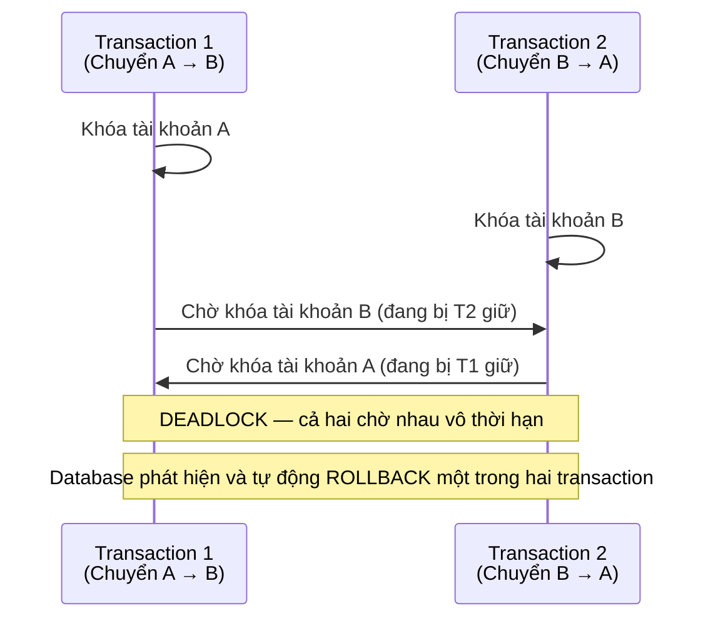
```mermaid
sequenceDiagram
    participant T1 as Transaction 1<br>(Chuyển A → B)
    participant T2 as Transaction 2<br>(Chuyển B → A)

    T1->>T1: Khóa tài khoản A
    T2->>T2: Khóa tài khoản B
    T1->>T2: Chờ khóa tài khoản B (đang bị T2 giữ)
    T2->>T1: Chờ khóa tài khoản A (đang bị T1 giữ)
    Note over T1,T2: DEADLOCK — cả hai chờ nhau vô thời hạn
    Note over T1,T2: Database phát hiện và tự động ROLLBACK một trong hai transaction
```

Các hệ quản trị cơ sở dữ liệu hiện đại như PostgreSQL hay MySQL có cơ chế tự động phát hiện deadlock và chủ động hủy (rollback) một trong hai transaction để giải phóng bế tắc, đồng thời trả lỗi để ứng dụng có thể thử lại (retry). Đây là lý do tại sao trong thực tế, mã nguồn xử lý giao dịch tài chính luôn cần có logic **retry với backoff** khi gặp lỗi deadlock.

---

## 5. Concurrency

### 5.1. Đặt vấn đề

Một máy chủ backend thực tế phải phục vụ hàng nghìn người dùng truy cập cùng một thời điểm chứ không phải lần lượt từng người. Nếu server xử lý tuần tự (người này xong mới đến người kia), người dùng đến sau sẽ phải chờ đợi rất lâu, gây trải nghiệm tồi tệ. Nhưng nếu để nhiều luồng xử lý cùng truy cập, chỉnh sửa một dữ liệu chung mà không kiểm soát, dữ liệu sẽ bị sai lệch nghiêm trọng — mất tiền, bán vượt số lượng tồn kho, hoặc ghi đè dữ liệu của nhau.

Gốc rễ của mọi sự cố đồng thời nằm ở việc: thao tác cập nhật dữ liệu trong ứng dụng thường trải qua chu kỳ 3 bước **Đọc dữ liệu (Read) $\rightarrow$ Tính toán tại bộ nhớ (Modify) $\rightarrow$ Ghi lại database (Write)**. Khi nhiều luồng cùng thực hiện chu kỳ này trên cùng một bản ghi tại cùng một thời điểm, các bước sẽ bị xen kẽ và gây ra lỗi sai logic.

### 5.2. Khái niệm

**Concurrency (Tính đồng thời)** là khả năng của hệ thống quản lý và xử lý nhiều tác vụ trong cùng một khoảng thời gian:
- **Concurrency** là việc *quản lý* nhiều tác vụ cùng lúc thông qua việc xen kẽ thực thi (interleaving/time-slicing trên 1 hoặc nhiều Core CPU).
- **Parallelism (Tính song song)** là việc *thực thi vật lý đồng thời* nhiều tác vụ tại cùng một tích tắc trên các lõi CPU độc lập (Multi-Core).

#### 1. Các dạng lỗi đồng thời kinh điển

- **Race Condition (Tranh chấp điều kiện):** Hiện tượng kết quả cuối cùng của hệ thống phụ thuộc vào **thứ tự và tốc độ thực thi ngẫu nhiên** của các luồng xử lý, thay vì tuân theo logic nghiệp vụ định sẵn.
- **Lost Update (Cập nhật bị mất):** Một biểu hiện nguy hiểm bậc nhất của Race Condition. Xảy ra khi hai transaction cùng đọc một giá trị ban đầu, sau đó lần lượt tính toán và ghi đè lên nhau. Thao tác ghi của transaction đến sau sẽ **ghi đè và xóa sổ hoàn toàn** kết quả của transaction trước đó mà không có bất kỳ thông báo lỗi nào.

#### 2. Ba giải pháp xử lý tranh chấp dữ liệu cốt lõi

| Phương pháp | Cơ chế hoạt động | Ưu điểm | Nhược điểm / Rủi ro | Trường hợp áp dụng |
|---|---|---|---|---|
| **Pessimistic Locking (Khóa bi quan)** | Khóa dòng dữ liệu ngay khi đọc bằng `SELECT ... FOR UPDATE`. Các transaction khác muốn đọc/ghi phải chờ (block). | An toàn tuyệt đối, không bao giờ bị xung đột ghi. | Giảm thông lượng (throughput), dễ gây nghẽn hàng đợi hoặc Deadlock nếu giữ khóa lâu. | Giao dịch tài chính nhạy cảm, đặt chỗ ghế ngồi/phòng khách sạn giới hạn số lượng ít. |
| **Optimistic Locking (Khóa lạc quan)** | Không khóa khi đọc. Bổ sung một cột `version` (hoặc `updated_at`). Khi ghi, kiểm tra xem version có còn khớp không (`WHERE id = 1 AND version = 5`). | Hiệu năng đọc cao, không giữ lock gây nghẽn kết nối. | Nếu tỉ lệ tranh chấp cao, nhiều request sẽ bị rollback và phải retry liên tục gây lãng phí CPU. | Ứng dụng đọc nhiều ghi ít (chỉnh sửa hồ sơ cá nhân, bài viết blog, quản lý sản phẩm). |
| **Atomic Update (Cập nhật nguyên tử)** | Đẩy toàn bộ phép toán tính toán xuống trực tiếp database thực thi trong một lệnh SQL duy nhất (`SET stock = stock - 1`). | Cực nhanh, không cần quản lý lock hay version ở tầng ứng dụng, tận dụng Row Lock nội bộ siêu ngắn của DBMS. | Chỉ áp dụng được cho các phép toán số học đơn giản (cộng/trừ), khó áp dụng cho logic phân nhánh phức tạp. | Trừ kho Flash Sale, tăng lượt xem (view count), cộng/trừ số dư ví tiền đơn giản. |

### 5.3. Sơ đồ minh họa luồng xử lý

#### Sơ đồ 1: Hiện tượng Lost Update khi không có kiểm soát đồng thời

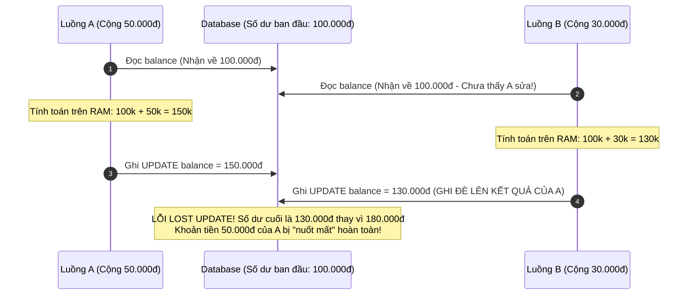
```mermaid
sequenceDiagram
    autonumber
    participant A as Luồng A (Cộng 50.000đ)
    participant DB as Database (Số dư ban đầu: 100.000đ)
    participant B as Luồng B (Cộng 30.000đ)

    A->>DB: Đọc balance (Nhận về 100.000đ)
    B->>DB: Đọc balance (Nhận về 100.000đ - Chưa thấy A sửa!)
    Note over A: Tính toán trên RAM: 100k + 50k = 150k
    Note over B: Tính toán trên RAM: 100k + 30k = 130k
    A->>DB: Ghi UPDATE balance = 150.000đ
    B->>DB: Ghi UPDATE balance = 130.000đ (GHI ĐÈ LÊN KẾT QUẢ CỦA A)
    Note over DB: LỖI LOST UPDATE! Số dư cuối là 130.000đ thay vì 180.000đ<br/>Khoản tiền 50.000đ của A bị "nuốt mất" hoàn toàn!
```

#### Sơ đồ 2: Kiểm soát bằng Pessimistic Lock (`FOR UPDATE`)

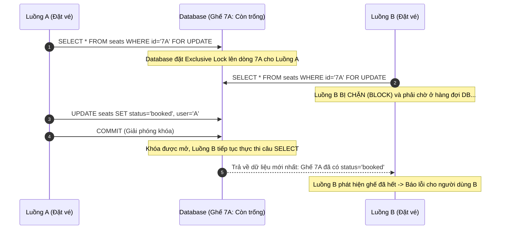
```mermaid
sequenceDiagram
    autonumber
    participant A as Luồng A (Đặt vé)
    participant DB as Database (Ghế 7A: Còn trống)
    participant B as Luồng B (Đặt vé)

    A->>DB: SELECT * FROM seats WHERE id='7A' FOR UPDATE
    Note over DB: Database đặt Exclusive Lock lên dòng 7A cho Luồng A
    B->>DB: SELECT * FROM seats WHERE id='7A' FOR UPDATE
    Note over B: Luồng B BỊ CHẶN (BLOCK) và phải chờ ở hàng đợi DB...
    A->>DB: UPDATE seats SET status='booked', user='A'
    A->>DB: COMMIT (Giải phóng khóa)
    Note over DB: Khóa được mở, Luồng B tiếp tục thực thi câu SELECT
    DB-->>B: Trả về dữ liệu mới nhất: Ghế 7A đã có status='booked'
    Note over B: Luồng B phát hiện ghế đã hết -> Báo lỗi cho người dùng B
```

#### Sơ đồ 3: Giải quyết tranh chấp tồn kho bằng Atomic Update

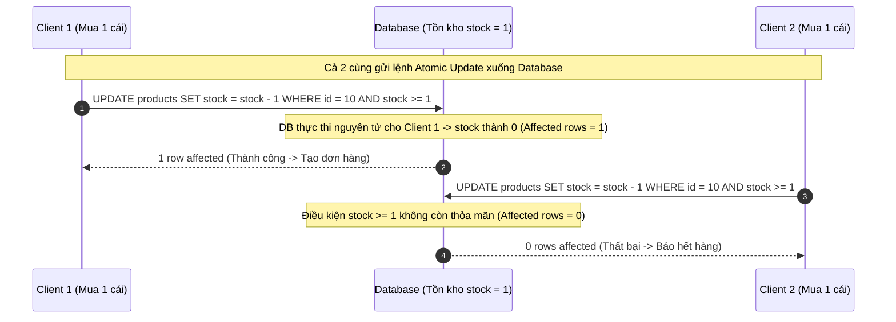
```mermaid
sequenceDiagram
    autonumber
    participant Client1 as Client 1 (Mua 1 cái)
    participant DB as Database (Tồn kho stock = 1)
    participant Client2 as Client 2 (Mua 1 cái)

    Note over Client1,Client2: Cả 2 cùng gửi lệnh Atomic Update xuống Database
    Client1->>DB: UPDATE products SET stock = stock - 1 WHERE id = 10 AND stock >= 1;
    Note over DB: DB thực thi nguyên tử cho Client 1 -> stock thành 0 (Affected rows = 1)
    DB-->>Client1: 1 row affected (Thành công -> Tạo đơn hàng)

    Client2->>DB: UPDATE products SET stock = stock - 1 WHERE id = 10 AND stock >= 1;
    Note over DB: Điều kiện stock >= 1 không còn thỏa mãn (Affected rows = 0)
    DB-->>Client2: 0 rows affected (Thất bại -> Báo hết hàng)
```

### 5.4. Phân tích tình huống thực tiễn

**Kịch bản có số liệu: Flash Sale mở bán 100 chiếc iPhone giá sốc vào lúc 12:00 trưa trên sàn thương mại điện tử (10.000 người dùng bấm nút "Mua ngay" đồng thời trong 1 giây).**

#### Phân tích sai lầm kinh điển (Read-Modify-Write ngây thơ):
```typescript
// MÃ NGUỒN DỄ GÂY SẬP VÀ BÁN VƯỢT TỒN KHO:
async function buyProduct(productId: number, quantity: number) {
  const product = await db.product.findUnique({ where: { id: productId } }); // Bước 1: Đọc
  
  if (product.stock >= quantity) { // Bước 2: Kiểm tra
    const newStock = product.stock - quantity;
    await db.product.update({ // Bước 3: Ghi
      where: { id: productId },
      data: { stock: newStock }
    });
    return "Đặt hàng thành công";
  }
  throw new Error("Hết hàng");
}
```
Khi 10.000 request cùng chạy Bước 1 trong 50ms đầu tiên, tất cả đều đọc được `stock = 100`. Cả 10.000 request đều vượt qua Bước 2 và ghi đè `stock = 99` vào database. Kết quả: 10.000 đơn hàng được tạo thành công trong khi kho chỉ có 100 sản phẩm (Bán vượt kho 9.900 sản phẩm — gây tổn thất hàng tỷ đồng).

#### Ba cách giải quyết thực tế:

**Cách 1 — Dùng Atomic Update (Khuyến nghị số 1 cho bài toán trừ kho):**
```sql
-- Câu lệnh SQL nguyên tử trực tiếp:
UPDATE products 
SET stock = stock - 1 
WHERE id = 101 AND stock >= 1;
```
- Nếu `Rows Affected == 1`: Trừ kho thành công $\rightarrow$ Tiến hành tạo đơn hàng.
- Nếu `Rows Affected == 0`: Kho đã hết $\rightarrow$ Trả lỗi "Sản phẩm đã hết hàng".
- **Hiệu năng:** Tốc độ xử lý cực cao (có thể đạt hơn 8.000 RPS trên 1 database instance tiêu chuẩn) vì thời gian giữ Row Lock chỉ tính bằng micro-giây.

**Cách 2 — Dùng Optimistic Lock (Kiểm tra version):**
```sql
-- Bước 1: Đọc sản phẩm kèm version
SELECT id, stock, version FROM products WHERE id = 101; -- Giả sử stock=100, version=1

-- Bước 2: Cập nhật có đối chiếu version
UPDATE products 
SET stock = stock - 1, version = version + 1 
WHERE id = 101 AND version = 1;
```
Nếu 100 request cùng gửi câu lệnh này, chỉ có đúng 1 request thành công đầu tiên tăng version lên 2; 99 request còn lại nhận `Rows Affected == 0` và phải đọc lại version mới để thử lại.

**Cách 3 — Dùng Distributed Lock với Redis (Khi nghiệp vụ giữ chỗ phức tạp):**
Khi nghiệp vụ đặt hàng kéo dài nhiều bước (giữ chỗ vé xem phim, gọi cổng thanh toán thẻ, kiểm tra voucher):
- Sử dụng Redis lock phân tán (`SET lock:product:101 user_id NX PX 5000`) để đảm bảo tại một thời điểm chỉ duy nhất 1 worker được quyền giữ tài nguyên sản phẩm trong 5 giây.

**Đúc kết nguyên tắc thiết kế:** Luôn ưu tiên **Atomic Update** cho các tác vụ biến đổi số lượng đơn giản; sử dụng **Optimistic Lock** cho các luồng cập nhật cấu trúc dữ liệu ít xung đột; và chỉ sử dụng **Pessimistic / Distributed Lock** khi các bước xử lý nghiệp vụ bắt buộc phải tuần tự hóa chặt chẽ.

---

## 6. Cache

### 6.1. Đặt vấn đề

Nhiều dữ liệu trong hệ thống được truy vấn lặp đi lặp lại nhưng ít khi thay đổi — ví dụ danh sách danh mục sản phẩm, thông tin cấu hình hệ thống. Nếu mỗi lần có yêu cầu, server đều phải truy vấn lại cơ sở dữ liệu (vốn chậm hơn bộ nhớ RAM hàng trăm đến hàng nghìn lần), tài nguyên hệ thống sẽ bị lãng phí và tốc độ phản hồi giảm đáng kể.

### 6.2. Khái niệm

**Cache (bộ nhớ đệm)** là một lớp lưu trữ trung gian, thường đặt trong bộ nhớ RAM (nhanh hơn nhiều so với đĩa cứng hoặc cơ sở dữ liệu), dùng để lưu lại kết quả của các thao tác tính toán hoặc truy vấn tốn kém, nhằm phục vụ nhanh cho các yêu cầu tương tự trong tương lai mà không cần lặp lại toàn bộ quá trình xử lý.

Các công cụ cache phổ biến trong backend gồm **Redis** và **Memcached**. Một số chiến lược cache thường gặp:

- **Cache-Aside (Lazy Loading):** Ứng dụng kiểm tra cache trước; nếu không có (cache miss) mới truy vấn database rồi lưu kết quả vào cache.
- **Write-Through:** Mỗi khi ghi dữ liệu, ứng dụng ghi đồng thời vào cả cache và database.
- **TTL (Time To Live):** Mỗi dữ liệu trong cache có thời hạn tồn tại nhất định, hết hạn sẽ tự động bị xóa để tránh dữ liệu cũ (stale data).

Vấn đề quan trọng nhất khi dùng cache là **cache invalidation** (làm mất hiệu lực cache đúng lúc) — nếu dữ liệu gốc đã thay đổi mà cache chưa được cập nhật, người dùng sẽ nhận thông tin lỗi thời.

### 6.3. Sơ đồ minh họa luồng xử lý

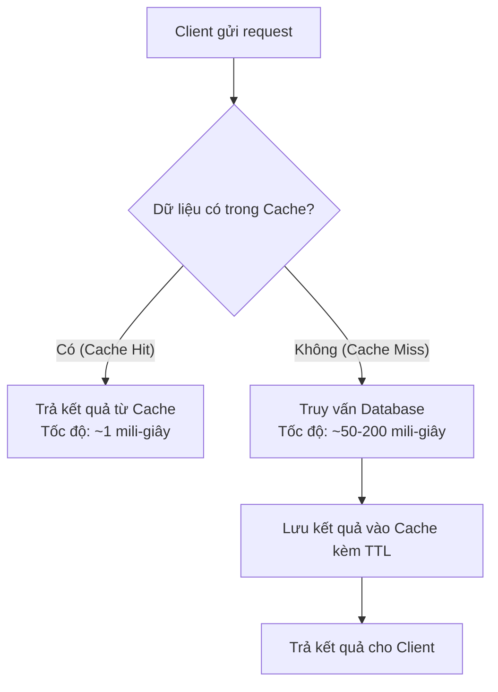
```mermaid
flowchart TD
    A[Client gửi request] --> B{Dữ liệu có trong Cache?}
    B -- Có (Cache Hit) --> C[Trả kết quả từ Cache<br>Tốc độ: ~1 mili-giây]
    B -- Không (Cache Miss) --> D[Truy vấn Database<br>Tốc độ: ~50-200 mili-giây]
    D --> E[Lưu kết quả vào Cache kèm TTL]
    E --> F[Trả kết quả cho Client]
```

### 6.4. Phân tích tình huống thực tiễn

**Kịch bản có số liệu: trang chủ sàn thương mại điện tử hiển thị "Top 20 sản phẩm bán chạy".**

Việc tính toán danh sách này đòi hỏi truy vấn tổng hợp (aggregation) trên bảng `order_items` với hàng chục triệu dòng, nhóm theo `product_id`, sắp xếp theo số lượng bán trong 7 ngày gần nhất — một câu truy vấn tốn khoảng **1.500 mili-giây** để hoàn thành. Trong khi đó, dữ liệu này trên thực tế chỉ cần cập nhật mỗi giờ một lần vì thứ hạng bán chạy không biến động liên tục theo từng giây.

Đội kỹ thuật áp dụng chiến lược **Cache-Aside** với Redis:

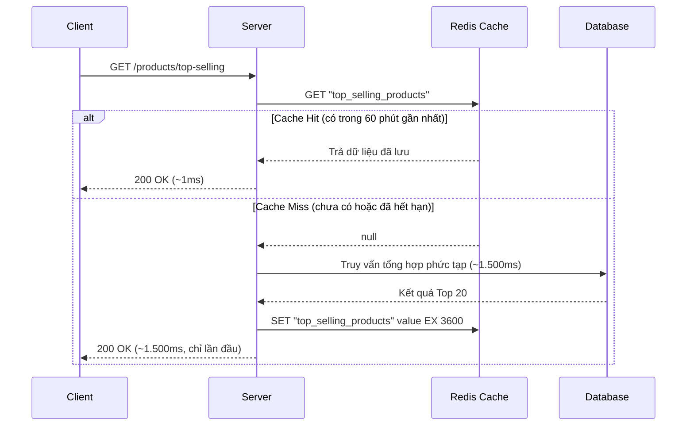
```mermaid
sequenceDiagram
    participant C as Client
    participant S as Server
    participant R as Redis Cache
    participant DB as Database

    C->>S: GET /products/top-selling
    S->>R: GET "top_selling_products"
    alt Cache Hit (có trong 60 phút gần nhất)
        R-->>S: Trả dữ liệu đã lưu
        S-->>C: 200 OK (~1ms)
    else Cache Miss (chưa có hoặc đã hết hạn)
        R-->>S: null
        S->>DB: Truy vấn tổng hợp phức tạp (~1.500ms)
        DB-->>S: Kết quả Top 20
        S->>R: SET "top_selling_products" value EX 3600
        S-->>C: 200 OK (~1.500ms, chỉ lần đầu)
    end
```

**Kết quả đo đạc thực tế:** Trong 1 giờ có TTL, giả sử trang chủ nhận 200.000 lượt truy cập. Chỉ có **request đầu tiên** phải chịu độ trễ 1.500ms để tính toán và ghi vào cache; **199.999 request còn lại** chỉ mất khoảng 1ms để đọc từ Redis — giảm tải cho database hơn 99,9% cho riêng truy vấn này, đồng thời cải thiện trải nghiệm người dùng rõ rệt.

**Vấn đề nâng cao — Cache Stampede (tấn công đám đông vào cache):** Nếu ngay tại thời điểm cache hết hạn (TTL = 0), hàng nghìn request cùng lúc đều gặp cache miss và đồng loạt dội vào database để tính lại — hiện tượng này có thể làm sập database dù bản chất mỗi truy vấn là hợp lệ. Giải pháp thực tế là dùng cơ chế **khóa tính toán lại (mutex lock khi rebuild cache)**: chỉ cho phép đúng một request được quyền truy vấn database để làm mới cache, các request khác trong lúc chờ sẽ tạm thời nhận dữ liệu cũ (stale-while-revalidate) thay vì cùng dội vào database.

---

## 7. Message Queue

### 7.1. Đặt vấn đề

Một số tác vụ trong hệ thống không cần phải hoàn thành ngay lập tức để trả kết quả cho người dùng — ví dụ gửi email xác nhận đơn hàng, tạo hóa đơn PDF, hay đồng bộ dữ liệu sang hệ thống khác. Nếu bắt người dùng phải chờ server thực hiện toàn bộ các tác vụ này theo kiểu tuần tự (đồng bộ) trước khi trả phản hồi, trải nghiệm sẽ rất chậm. Ngoài ra, nếu dịch vụ xử lý email đang quá tải hoặc gặp sự cố tạm thời, toàn bộ luồng xử lý đơn hàng không nên bị chặn lại theo đó.

### 7.2. Khái niệm

**Message Queue (Hàng đợi thông điệp)** là một thành phần trung gian cho phép các dịch vụ giao tiếp với nhau theo kiểu **bất đồng bộ (asynchronous)** và **tách rời (decoupled)**. Thay vì dịch vụ A gọi trực tiếp dịch vụ B và chờ phản hồi, dịch vụ A (gọi là **Producer**) chỉ cần gửi một thông điệp vào hàng đợi, rồi tiếp tục xử lý công việc khác ngay lập tức. Dịch vụ B (gọi là **Consumer**) sẽ lấy thông điệp ra khỏi hàng đợi và xử lý theo tốc độ của riêng nó.

Cơ chế này mang lại ba lợi ích chính: **giảm độ trễ phản hồi** cho người dùng cuối, **tăng khả năng chịu lỗi** (nếu Consumer tạm thời gặp sự cố, thông điệp vẫn nằm an toàn trong hàng đợi chờ xử lý lại), và **cân bằng tải** (điều tiết tốc độ xử lý khi lượng yêu cầu tăng đột biến). Khi một thông điệp xử lý thất bại liên tục vượt quá số lần thử lại cho phép, hệ thống thường chuyển nó vào **Dead Letter Queue (DLQ)** để cách ly và xử lý thủ công sau, tránh làm nghẽn hàng đợi chính. Các hệ thống message queue phổ biến gồm RabbitMQ (phù hợp xử lý theo từng message với độ tin cậy cao), Apache Kafka (phù hợp xử lý luồng dữ liệu lớn, throughput cao), và Amazon SQS (dịch vụ quản lý sẵn trên nền tảng đám mây AWS).

### 7.3. Sơ đồ minh họa luồng xử lý

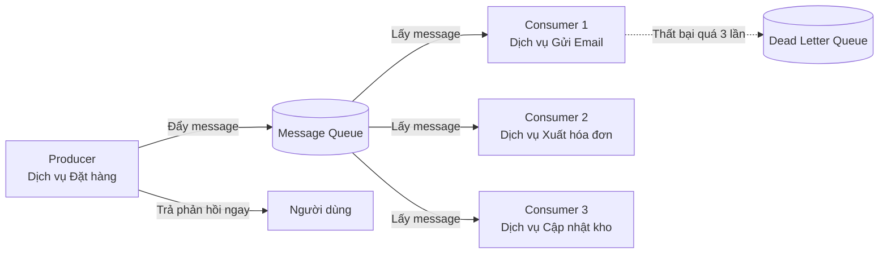
```mermaid
flowchart LR
    A[Producer<br>Dịch vụ Đặt hàng] -- Đẩy message --> Q[(Message Queue)]
    Q -- Lấy message --> B[Consumer 1<br>Dịch vụ Gửi Email]
    Q -- Lấy message --> C[Consumer 2<br>Dịch vụ Xuất hóa đơn]
    Q -- Lấy message --> E[Consumer 3<br>Dịch vụ Cập nhật kho]
    A -- Trả phản hồi ngay --> U[Người dùng]
    B -. Thất bại quá 3 lần .-> DLQ[(Dead Letter Queue)]
```

### 7.4. Phân tích tình huống thực tiễn

**Kịch bản có số liệu: sàn thương mại điện tử vào đợt sale "Black Friday" nhận 5.000 đơn hàng mỗi phút.**

Nếu thiết kế theo kiểu đồng bộ, mỗi request đặt hàng phải chờ toàn bộ chuỗi xử lý hoàn tất tuần tự: ghi đơn hàng vào database (80ms) → gọi API bên thứ ba để gửi email (600ms, phụ thuộc mạng ngoài) → gọi dịch vụ xuất hóa đơn điện tử tuân thủ thuế (900ms) → cập nhật số lượng tồn kho (50ms). Tổng thời gian phản hồi lên tới **~1.630ms**, và nếu dịch vụ gửi email bên thứ ba gặp sự cố (timeout 5 giây), toàn bộ đơn hàng sẽ bị treo theo, gây ùn ứ hàng loạt request khác đang chờ xử lý.

Sau khi tái thiết kế với Message Queue (RabbitMQ):

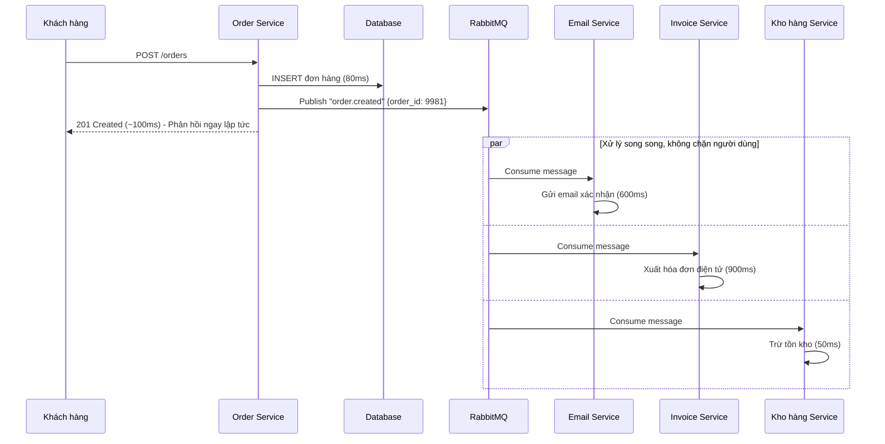
```mermaid
sequenceDiagram
    participant U as Khách hàng
    participant S as Order Service
    participant DB as Database
    participant Q as RabbitMQ
    participant E as Email Service
    participant I as Invoice Service
    participant K as Kho hàng Service

    U->>S: POST /orders
    S->>DB: INSERT đơn hàng (80ms)
    S->>Q: Publish "order.created" {order_id: 9981}
    S-->>U: 201 Created (~100ms) - Phản hồi ngay lập tức

    par Xử lý song song, không chặn người dùng
        Q->>E: Consume message
        E->>E: Gửi email xác nhận (600ms)
    and
        Q->>I: Consume message
        I->>I: Xuất hóa đơn điện tử (900ms)
    and
        Q->>K: Consume message
        K->>K: Trừ tồn kho (50ms)
    end
```

**Kết quả:** Thời gian phản hồi cho khách hàng giảm từ ~1.630ms xuống còn khoảng **100ms** — nhanh hơn hơn 16 lần — vì server chỉ cần ghi đơn hàng và đẩy một thông điệp nhẹ vào hàng đợi rồi trả kết quả ngay, không cần chờ các bước phụ trợ. Khi dịch vụ xuất hóa đơn gặp sự cố tạm thời (ví dụ API thuế bên ngoài bị lỗi 30 giây), thông điệp vẫn nằm an toàn trong hàng đợi và tự động được Consumer xử lý lại (retry) ngay khi dịch vụ phục hồi — khách hàng hoàn toàn không nhận thấy sự cố, đơn hàng vẫn được ghi nhận đúng hạn.

**Đánh đổi cần cân nhắc:** Kiến trúc bất đồng bộ làm tăng độ phức tạp vận hành — cần giám sát độ dài hàng đợi (queue length), xử lý tình huống thông điệp bị xử lý trùng lặp (liên quan trực tiếp đến khái niệm Idempotency ở phần tiếp theo), và chấp nhận rằng dữ liệu giữa các dịch vụ có độ trễ nhất định (eventual consistency) thay vì nhất quán tức thời.

---

## 8. Idempotency

### 8.1. Đặt vấn đề

Trên môi trường mạng, một yêu cầu có thể bị gửi lặp lại ngoài ý muốn: người dùng bấm nút "Thanh toán" nhiều lần do mạng chậm, hoặc ứng dụng client tự động gửi lại request khi không nhận được phản hồi kịp thời (retry). Nếu server xử lý mỗi lần gửi như một giao dịch mới, khách hàng có thể bị trừ tiền hai, ba lần cho cùng một đơn hàng.

### 8.2. Khái niệm

**Idempotency (Tính lũy đẳng)** là tính chất của một thao tác mà khi thực hiện **nhiều lần với cùng một đầu vào**, kết quả tác động lên hệ thống hoàn toàn giống như khi thực hiện **một lần duy nhất**. Đây là một tính chất cực kỳ quan trọng đối với các API xử lý giao dịch tài chính hoặc các thao tác có thể bị gửi lặp do lỗi mạng — đặc biệt quan trọng khi kết hợp với Message Queue ở trên, vì hầu hết các hệ thống message queue chỉ đảm bảo cơ chế "at-least-once delivery" (một thông điệp có thể được gửi nhiều hơn một lần trong một số tình huống lỗi mạng), nên phía Consumer bắt buộc phải tự đảm bảo tính idempotent khi xử lý.

Xét theo chuẩn HTTP, các phương thức `GET`, `PUT`, `DELETE` về bản chất được thiết kế mang tính idempotent (gọi `DELETE /orders/5` một hay nhiều lần thì kết quả cuối cùng vẫn là đơn hàng 5 bị xóa), trong khi `POST` mặc định **không** đảm bảo tính idempotent — mỗi lần gọi `POST /orders` mặc định sẽ tạo ra một đơn hàng mới.

Kỹ thuật phổ biến để đảm bảo idempotency cho các API tạo mới (như thanh toán) là sử dụng **Idempotency Key**: client sinh ra một mã định danh duy nhất cho mỗi thao tác nghiệp vụ và gửi kèm trong request; server lưu lại mã này, nếu nhận được request trùng mã, server sẽ trả về kết quả của lần xử lý trước đó thay vì thực hiện lại giao dịch.

### 8.3. Sơ đồ minh họa luồng xử lý

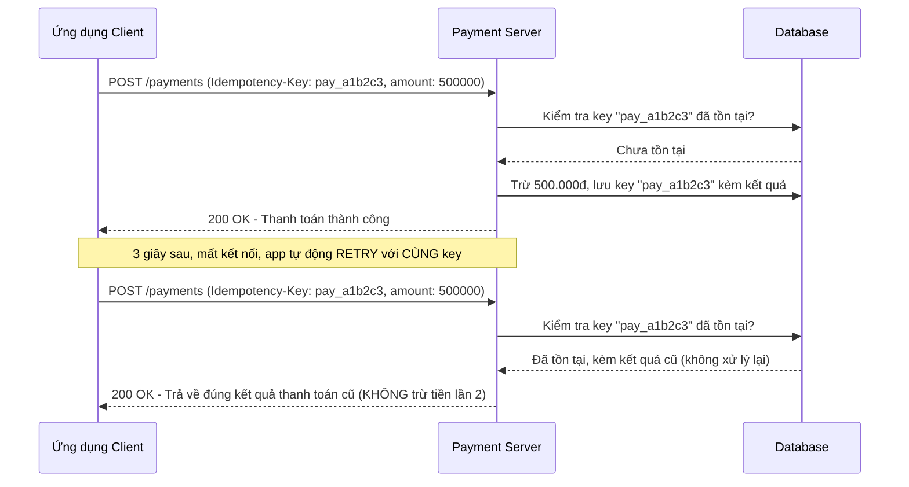
```mermaid
sequenceDiagram
    participant C as Ứng dụng Client
    participant S as Payment Server
    participant DB as Database

    C->>S: POST /payments (Idempotency-Key: pay_a1b2c3, amount: 500000)
    S->>DB: Kiểm tra key "pay_a1b2c3" đã tồn tại?
    DB-->>S: Chưa tồn tại
    S->>DB: Trừ 500.000đ, lưu key "pay_a1b2c3" kèm kết quả
    S-->>C: 200 OK - Thanh toán thành công

    Note over C,S: 3 giây sau, mất kết nối, app tự động RETRY với CÙNG key

    C->>S: POST /payments (Idempotency-Key: pay_a1b2c3, amount: 500000)
    S->>DB: Kiểm tra key "pay_a1b2c3" đã tồn tại?
    DB-->>S: Đã tồn tại, kèm kết quả cũ (không xử lý lại)
    S-->>C: 200 OK - Trả về đúng kết quả thanh toán cũ (KHÔNG trừ tiền lần 2)
```

### 8.4. Phân tích tình huống thực tiễn

**Kịch bản có số liệu cụ thể:** Khách hàng thực hiện thanh toán 500.000đ trên ứng dụng đặt đồ ăn. Ứng dụng gửi request kèm header:

```
POST /payments
Idempotency-Key: pay_9f8e7d6c5b4a
Body: { "order_id": 9981, "amount": 500000 }
```

Server nhận request, kiểm tra bảng `idempotency_keys` chưa có mã `pay_9f8e7d6c5b4a` nào được ghi nhận trước đó, tiến hành trừ tiền và lưu lại cặp `(key, result)` vào bảng này. Ngay sau khi trừ tiền thành công nhưng trước khi phản hồi kịp trả về (do sóng di động của khách hàng bị gián đoạn giữa đường), ứng dụng client — vốn được lập trình để tự động thử lại khi không nhận được phản hồi trong 3 giây — gửi lại **chính xác cùng một request** với cùng `Idempotency-Key`.

Nếu không có cơ chế idempotency key, server sẽ hiểu đây là một yêu cầu thanh toán hoàn toàn mới và trừ thêm 500.000đ lần thứ hai — khách hàng bị trừ tổng cộng 1.000.000đ cho một đơn hàng trị giá 500.000đ, một lỗi nghiêm trọng có thể gây khiếu nại hàng loạt và tổn hại uy tín doanh nghiệp.

Với cơ chế idempotency key, server nhận diện request thứ hai có key trùng với một giao dịch đã xử lý, **không thực hiện trừ tiền lần nữa**, chỉ đơn giản trả lại đúng kết quả đã lưu ở lần đầu tiên (200 OK, thanh toán thành công, số dư giao dịch 500.000đ) — đảm bảo khách hàng chỉ bị trừ đúng một lần dù request được gửi bao nhiêu lần.

**Ứng dụng thực tế:** Đây chính xác là cơ chế mà cổng thanh toán **Stripe** áp dụng — tài liệu chính thức của Stripe yêu cầu bắt buộc gửi kèm `Idempotency-Key` cho mọi API tạo giao dịch (`POST /v1/charges`), và khóa này có hiệu lực trong 24 giờ trên hệ thống của họ. Tương tự, các ví điện tử tại Việt Nam như MoMo hay ZaloPay cũng áp dụng cơ chế mã giao dịch duy nhất (`requestId`/`orderId`) theo đúng nguyên lý idempotency để đảm bảo an toàn cho các giao dịch tài chính khi mạng không ổn định.

---

## 9. Rate Limiting

### 9.1. Đặt vấn đề

Không phải mọi lưu lượng truy cập đến hệ thống đều lành mạnh. Một client bị lỗi có thể gửi hàng nghìn request mỗi giây liên tục; nghiêm trọng hơn, kẻ tấn công có thể chủ động thực hiện tấn công từ chối dịch vụ (DoS) bằng cách dội bom yêu cầu vào hệ thống nhằm làm sập server, ảnh hưởng đến trải nghiệm của toàn bộ người dùng hợp lệ khác.

### 9.2. Khái niệm

**Rate Limiting (Giới hạn tần suất)** là kỹ thuật kiểm soát số lượng yêu cầu mà một client (xác định qua địa chỉ IP, API key, hoặc tài khoản người dùng) được phép gửi đến hệ thống trong một khoảng thời gian nhất định. Khi vượt quá ngưỡng cho phép, server sẽ từ chối các yêu cầu vượt mức, thường trả về mã trạng thái HTTP **429 Too Many Requests** kèm header `Retry-After` cho biết client nên chờ bao lâu trước khi thử lại.

Một số thuật toán phổ biến để triển khai rate limiting:

- **Fixed Window:** Đếm số request trong từng khung thời gian cố định (ví dụ mỗi phút); đơn giản nhưng có thể bị "lách" ở ranh giới giữa hai khung giờ (gửi dồn dập vào cuối khung này và đầu khung sau, tổng cộng vượt xa giới hạn thực tế mong muốn).
- **Sliding Window:** Cải tiến của Fixed Window, tính toán số request trong một cửa sổ thời gian trượt liên tục, cho kết quả chính xác hơn.
- **Token Bucket:** Mỗi client có một "xô chứa token" với dung lượng tối đa cố định, token được nạp đều đặn theo thời gian; mỗi request tiêu tốn một token, hết token thì request bị từ chối. Thuật toán này cho phép xử lý linh hoạt các đợt tăng đột biến (burst) trong giới hạn cho phép, được sử dụng rộng rãi nhất trong thực tế nhờ tính cân bằng giữa độ chính xác và hiệu năng.

### 9.3. Sơ đồ minh họa luồng xử lý

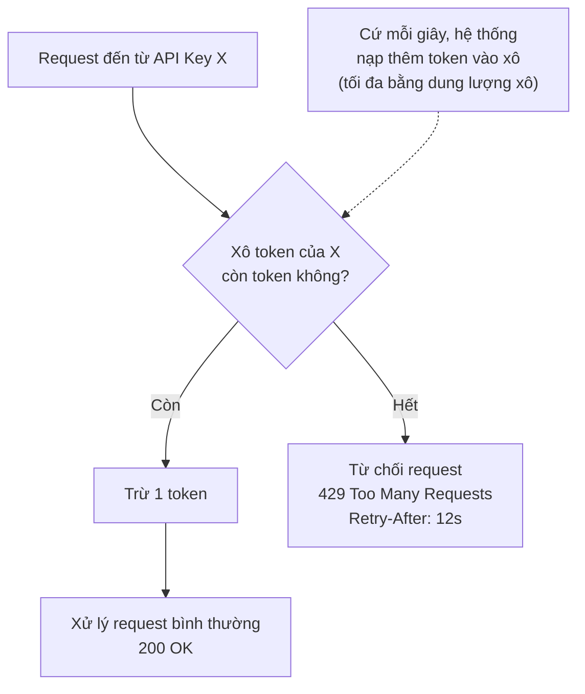
```mermaid
flowchart TD
    A["Request đến từ API Key X"] --> B{"Xô token của X<br>còn token không?"}
    B -- Còn --> C["Trừ 1 token"]
    C --> D["Xử lý request bình thường<br>200 OK"]
    B -- Hết --> E["Từ chối request<br>429 Too Many Requests<br>Retry-After: 12s"]
    F["Cứ mỗi giây, hệ thống<br>nạp thêm token vào xô<br>(tối đa bằng dung lượng xô)"] -.-> B
```

### 9.4. Phân tích tình huống thực tiễn

**Kịch bản có số liệu cụ thể: API công khai của một nền tảng gọi món (tương tự GitHub API), áp dụng thuật toán Token Bucket.**

Chính sách được thiết lập: mỗi API Key được cấp một xô chứa tối đa **100 token**, tốc độ nạp token là **10 token/giây**, mỗi request tiêu tốn đúng 1 token.

| Gói dịch vụ | Dung lượng xô | Tốc độ nạp | Số request tối đa/giờ |
|---|---|---|---|
| Free Tier | 20 token | 2 token/giây | ~7.200 |
| Pro Tier | 100 token | 10 token/giây | ~36.000 |
| Enterprise | 500 token | 50 token/giây | ~180.000 |

Giả sử một ứng dụng đối tác thuộc gói Free Tier đột nhiên gửi 50 request dồn dập trong 1 giây (ví dụ do lỗi vòng lặp vô hạn trong code của đối tác gọi API liên tục mà không kiểm tra điều kiện dừng). Với xô chỉ có 20 token, hệ thống chấp nhận 20 request đầu tiên, sau đó **30 request tiếp theo bị từ chối ngay lập tức** với phản hồi:

```
HTTP/1.1 429 Too Many Requests
Retry-After: 5
X-RateLimit-Limit: 20
X-RateLimit-Remaining: 0
X-RateLimit-Reset: 1735459200
```

**Giá trị mang lại:** Nhờ rate limiting, sự cố lập trình phía đối tác không làm ảnh hưởng đến hiệu năng chung của toàn bộ hệ thống — server chính vẫn phục vụ bình thường cho hàng nghìn đối tác khác. Đồng thời, cơ chế phân tầng theo gói dịch vụ (Free/Pro/Enterprise) tạo ra động lực kinh doanh: khách hàng có nhu cầu truy vấn lớn sẽ nâng cấp gói trả phí thay vì tìm cách lách giới hạn.

**Trường hợp thực tế nổi tiếng:** API công khai của Twitter/X áp dụng rate limit rất chặt (ví dụ giới hạn 50 request/15 phút cho một số endpoint ở gói miễn phí) sau năm 2023, khiến nhiều ứng dụng bên thứ ba từng phụ thuộc vào API này phải thay đổi kiến trúc hoặc trả phí sử dụng — minh chứng rõ ràng cho vai trò của rate limiting không chỉ trong bảo vệ hệ thống mà còn trong chiến lược kiểm soát quyền truy cập dữ liệu ở quy mô doanh nghiệp.

---

## 10. Load Balancing

### 10.1. Đặt vấn đề

Một máy chủ đơn lẻ, dù mạnh đến đâu, cũng có giới hạn về khả năng xử lý (CPU, RAM, băng thông mạng). Khi lượng truy cập vượt quá năng lực của một server, hệ thống sẽ phản hồi chậm hoặc sập hoàn toàn. Ngoài ra, nếu toàn bộ lưu lượng chỉ phụ thuộc vào một máy chủ duy nhất, đây sẽ là điểm lỗi duy nhất (**Single Point of Failure**) — chỉ cần máy chủ đó gặp sự cố, toàn bộ dịch vụ ngừng hoạt động.

### 10.2. Khái niệm

**Load Balancing (Cân bằng tải)** là kỹ thuật phân phối lưu lượng truy cập đến từ client ra nhiều máy chủ backend khác nhau (thường gọi là các **instance** hoặc **node**), nhằm đảm bảo không có máy chủ nào bị quá tải trong khi các máy chủ khác nhàn rỗi. Thiết bị hoặc phần mềm thực hiện việc phân phối này gọi là **Load Balancer**, đóng vai trò là điểm tiếp nhận trung gian giữa client và cụm máy chủ (server cluster/pool).

Các thuật toán phân phối tải phổ biến:

- **Round Robin:** Lần lượt phân phối request cho từng server theo vòng tuần tự.
- **Least Connections:** Ưu tiên chuyển request đến server đang có ít kết nối đang xử lý nhất — phù hợp khi các request có thời gian xử lý không đồng đều.
- **IP Hash:** Dựa trên địa chỉ IP của client để luôn định tuyến về cùng một server, hữu ích khi cần duy trì phiên làm việc (session) mà không dùng session lưu tập trung.

Load Balancer cũng thường xuyên thực hiện **health check** — kiểm tra định kỳ (ví dụ mỗi 5 giây gửi `GET /health`) tình trạng hoạt động của từng server backend; nếu một server không phản hồi sau một số lần thử nhất định, load balancer tự động đưa server đó ra khỏi danh sách phục vụ (loại khỏi vòng quay Round Robin), tăng khả năng chịu lỗi tổng thể của hệ thống.

### 10.3. Sơ đồ minh họa luồng xử lý

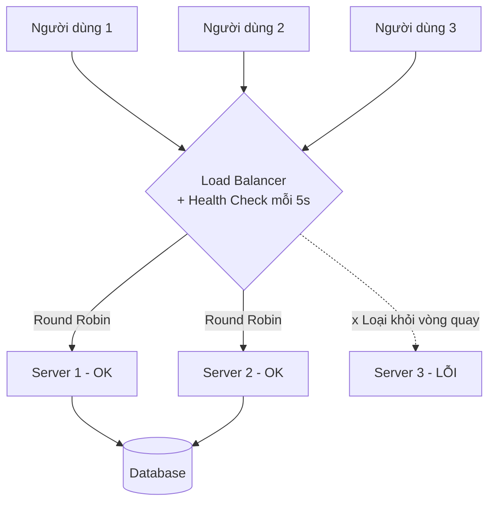
```mermaid
flowchart TD
    U1[Người dùng 1] --> LB{Load Balancer<br>+ Health Check mỗi 5s}
    U2[Người dùng 2] --> LB
    U3[Người dùng 3] --> LB
    LB -- Round Robin --> S1[Server 1 - OK]
    LB -- Round Robin --> S2[Server 2 - OK]
    LB -.x Loại khỏi vòng quay .-> S3[Server 3 - LỖI]
    S1 --> DB[(Database)]
    S2 --> DB
```

### 10.4. Phân tích tình huống thực tiễn

**Kịch bản có số liệu: nền tảng đặt xe công nghệ triển khai 10 server backend giống hệt nhau (mỗi server chịu tải tối đa khoảng 2.000 request/giây) đứng sau một Load Balancer (ví dụ Nginx hoặc AWS Elastic Load Balancer).**

Trong giờ cao điểm buổi tối, hệ thống ghi nhận khoảng **18.000 request/giây** đặt xe. Load Balancer áp dụng thuật toán **Least Connections**, phân phối đều lưu lượng này cho 10 server, mỗi server xử lý trung bình khoảng 1.800 request/giây — nằm trong ngưỡng an toàn, không server nào bị quá tải.

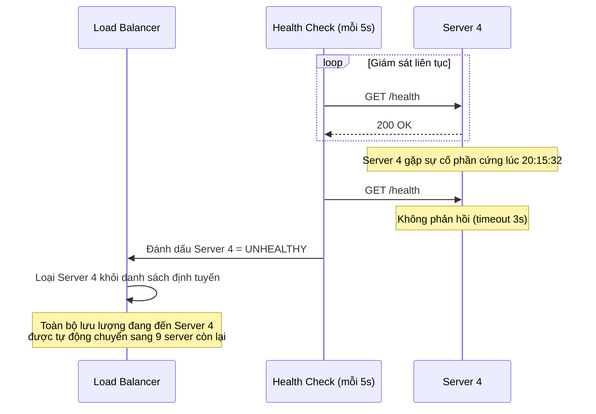
```mermaid
sequenceDiagram
    participant LB as Load Balancer
    participant HC as Health Check (mỗi 5s)
    participant S4 as Server 4

    loop Giám sát liên tục
        HC->>S4: GET /health
        S4-->>HC: 200 OK
    end

    Note over S4: Server 4 gặp sự cố phần cứng lúc 20:15:32

    HC->>S4: GET /health
    Note over S4: Không phản hồi (timeout 3s)
    HC->>LB: Đánh dấu Server 4 = UNHEALTHY
    LB->>LB: Loại Server 4 khỏi danh sách định tuyến

    Note over LB: Toàn bộ lưu lượng đang đến Server 4<br>được tự động chuyển sang 9 server còn lại
```

Đến 20h15, Server 4 gặp sự cố phần cứng đột ngột và ngừng phản hồi. Load Balancer, thông qua cơ chế health check gửi định kỳ mỗi 5 giây, phát hiện Server 4 không phản hồi sau 2 lần kiểm tra liên tiếp (tổng cộng khoảng 10-15 giây), lập tức đánh dấu server này là "unhealthy" và loại khỏi vòng quay phân phối. Toàn bộ lưu lượng ~1.800 request/giây vốn đang được xử lý bởi Server 4 ngay lập tức được phân phối lại cho 9 server còn lại (mỗi server nhận thêm trung bình 200 request/giây) — vẫn nằm trong giới hạn năng lực của từng server (2.000 request/giây), nên **người dùng hoàn toàn không nhận thấy gián đoạn dịch vụ**, đơn đặt xe vẫn được xử lý bình thường trong suốt quá trình đội kỹ thuật khắc phục sự cố phần cứng của Server 4.

**Mở rộng ở quy mô doanh nghiệp lớn:** Đối với các hệ thống toàn cầu như Netflix hay Amazon, load balancing không chỉ dừng ở việc phân phối tải giữa các server trong một trung tâm dữ liệu, mà còn được triển khai ở tầng cao hơn — **cân bằng tải theo khu vực địa lý (Geo Load Balancing / GSLB)** — tự động định tuyến người dùng đến trung tâm dữ liệu gần nhất hoặc còn khả dụng gần nhất (ví dụ người dùng tại Việt Nam được định tuyến đến trung tâm dữ liệu Singapore thay vì Mỹ), vừa giảm độ trễ mạng, vừa đảm bảo hệ thống vẫn hoạt động ngay cả khi toàn bộ một trung tâm dữ liệu khu vực gặp sự cố diện rộng.

---

## 11. Horizontal & Vertical Scaling (Bổ sung)

### 11.1. Đặt vấn đề

Khi một ứng dụng backend ngày càng phát triển, lượng người dùng hoạt động đồng thời (CCU), số lượng request mỗi giây (RPS) và dung lượng dữ liệu lưu trữ sẽ vượt qua năng lực xử lý của hạ tầng hiện tại. Khi CPU và RAM liên tục đạt ngưỡng 90-100%, hàng đợi kết nối (connection queue) bị đầy, độ trễ phản hồi (latency) tăng vọt từ vài chục mili-giây lên hàng chục giây, và hệ thống bắt đầu trả về lỗi `504 Gateway Timeout` hoặc sập hoàn toàn (crash).

Để đáp ứng lưu lượng tăng trưởng đó, đội ngũ kỹ thuật buộc phải áp dụng chiến lược **Scaling (Mở rộng quy mô)**. Bài toán đặt ra là: Liệu ta nên "nâng cấp máy chủ hiện tại mạnh hơn" hay "bổ sung thêm nhiều máy chủ mới chạy song song"? Đây là hai trường phái mở rộng cơ bản trong thiết kế hệ thống phân tán: **Vertical Scaling (Scale Up)** và **Horizontal Scaling (Scale Out)**.

### 11.2. Khái niệm

**Scaling (Mở rộng quy mô)** là khả năng duy trì hiệu năng và tính sẵn sàng của hệ thống khi khối lượng công việc tăng lên bằng cách bổ sung thêm tài nguyên tính toán.

#### Vertical Scaling (Scale Up / Scale Down — Mở rộng theo chiều dọc)
Là kỹ thuật tăng cường sức mạnh phần cứng cho chính máy chủ hiện có — nâng cấp CPU nhiều nhân hơn, tăng dung lượng RAM (ví dụ từ 8GB lên 64GB, 256GB), chuyển sang ổ cứng SSD NVMe tốc độ cao hơn, hoặc mở rộng băng thông mạng.
- **Ưu điểm:** Cực kỳ đơn giản về mặt kiến trúc; không đòi hỏi phải tái cấu trúc mã nguồn ứng dụng; giữ nguyên mô hình một node duy nhất nên không phát sinh các vấn đề phức tạp về mạng phân tán, đồng bộ dữ liệu, hay quản lý phiên làm việc (session state).
- **Nhược điểm:** 
  - *Giới hạn vật lý (Hardware limits):* Một máy chủ vật lý hay máy ảo đám mây đều có trần giới hạn tối đa (ví dụ 128 vCPU, 512GB RAM) mà phần cứng hiện tại có thể cung cấp.
  - *Chi phí phi tuyến tính:* Càng lên các cấu hình siêu cao cấp (high-end / bare-metal), chi phí thuê hoặc mua phần cứng tăng theo hàm mũ so với hiệu năng nhận được.
  - *Điểm lỗi duy nhất (Single Point of Failure - SPOF):* Toàn bộ hệ thống vẫn chỉ nằm trên một máy chủ duy nhất; nếu máy chủ gặp sự cố phần cứng, toàn bộ dịch vụ sẽ ngừng hoạt động.
  - *Yêu cầu thời gian gián đoạn (Downtime):* Việc nâng cấp phần cứng vật lý hoặc đổi loại máy ảo (instance type) trên đám mây thường yêu cầu tắt máy và khởi động lại.

#### Horizontal Scaling (Scale Out / Scale In — Mở rộng theo chiều ngang)
Là kỹ thuật bổ sung thêm nhiều máy chủ (nodes/instances) có cấu hình vừa phải vào hệ thống, kết hợp chúng hoạt động đồng thời dưới sự điều phối của **Load Balancer** (khái niệm 10).
- **Ưu điểm:**
  - *Khả năng mở rộng gần như không giới hạn (Elasticity):* Có thể bổ sung từ vài máy lên hàng trăm, hàng nghìn máy chủ phân tán.
  - *Tính sẵn sàng cao (High Availability) & Chịu lỗi (Fault Tolerance):* Không còn điểm lỗi duy nhất; nếu một máy chủ bị sập, Load Balancer tự động cô lập máy đó và chuyển lưu lượng sang các máy còn lại mà người dùng không hề hay biết.
  - *Tối ưu chi phí & Auto-Scaling:* Có thể sử dụng các phần cứng phổ thông (commodity hardware) rẻ tiền hơn; dễ dàng tự động tăng số lượng máy vào giờ cao điểm và giảm bớt vào ban đêm (Auto-Scaling Group / Kubernetes HPA) để tiết kiệm chi phí.
- **Nhược điểm:**
  - *Độ phức tạp kiến trúc cao:* Đòi hỏi ứng dụng phải được thiết kế theo dạng **Stateless (Phi trạng thái)** — máy chủ không được lưu session trong bộ nhớ RAM cục bộ hay lưu file upload trên ổ đĩa nội bộ, mà phải đẩy session ra Redis và lưu file lên Object Storage (như Amazon S3).
  - *Độ phức tạp ở tầng Database:* Mở rộng tầng ứng dụng (stateless API) rất dễ, nhưng mở rộng tầng lưu trữ (Stateful Database) theo chiều ngang đòi hỏi các kỹ thuật phức tạp như Read/Write Replication, Sharding (phân mảnh dữ liệu) hoặc Database phân tán.

| Tiêu chí | Vertical Scaling (Scale Up) | Horizontal Scaling (Scale Out) |
|---|---|---|
| **Cách tiếp cận** | Nâng cấp cấu hình máy hiện có (CPU, RAM, Disk) | Thêm nhiều máy chủ mới vào cụm |
| **Giới hạn mở rộng** | Bị giới hạn bởi công nghệ phần cứng tối đa | Gần như vô hạn (co giãn linh hoạt) |
| **Độ phức tạp kiến trúc** | Thấp, giữ nguyên mã nguồn và cấu trúc | Cao, cần Load Balancer, stateless app, cache tập trung |
| **Điểm lỗi duy nhất (SPOF)** | Vẫn tồn tại (1 máy chủ hỏng = toàn bộ dịch vụ sập) | Loại bỏ (khả năng chịu lỗi cao, High Availability) |
| **Downtime khi mở rộng** | Thường cần dừng dịch vụ để đổi cấu hình | Không downtime (Zero Downtime / Rolling update) |
| **Mô hình chi phí** | Chi phí tăng theo cấp số nhân ở cấu hình cao | Chi phí tăng tuyến tính theo số lượng máy |
| **Tự động co giãn (Auto-scale)** | Khó thực hiện theo thời gian thực | Rất linh hoạt theo tải thực tế (Auto-scaling) |

### 11.3. Sơ đồ minh họa luồng xử lý

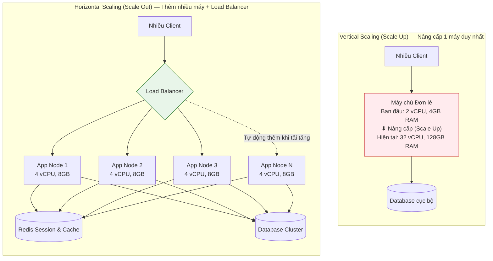
```mermaid
flowchart TD
    subgraph VS["Vertical Scaling (Scale Up) — Nâng cấp 1 máy duy nhất"]
        direction TB
        V_Client[Nhiều Client] --> V_Server["Máy chủ Đơn lẻ<br>Ban đầu: 2 vCPU, 4GB RAM<br>⬇ Nâng cấp (Scale Up)<br>Hiện tại: 32 vCPU, 128GB RAM"]
        V_Server --> V_DB[(Database cục bộ)]
        style V_Server fill:#ffebee,stroke:#c62828
    end

    subgraph HS["Horizontal Scaling (Scale Out) — Thêm nhiều máy + Load Balancer"]
        direction TB
        H_Client[Nhiều Client] --> H_LB{Load Balancer}
        H_LB --> H_S1[App Node 1<br>4 vCPU, 8GB]
        H_LB --> H_S2[App Node 2<br>4 vCPU, 8GB]
        H_LB --> H_S3[App Node 3<br>4 vCPU, 8GB]
        H_LB -. Tự động thêm khi tải tăng .-> H_SN[App Node N<br>4 vCPU, 8GB]
        
        H_S1 --> H_Redis[(Redis Session & Cache)]
        H_S2 --> H_Redis
        H_S3 --> H_Redis
        H_SN --> H_Redis
        
        H_S1 --> H_DB[(Database Cluster)]
        H_S2 --> H_DB
        H_S3 --> H_DB
        H_SN --> H_DB
        style H_LB fill:#e8f5e9,stroke:#2e7d32
    end
```

### 11.4. Phân tích tình huống thực tiễn

**Kịch bản có số liệu cụ thể: Hành trình mở rộng của một nền tảng thương mại điện tử SaaS (tương tự Haravan / Shopify) qua 3 giai đoạn.**

**Giai đoạn 1 — Khởi đầu (MVP) & Áp dụng Vertical Scaling:**
- Ứng dụng ban đầu chạy toàn bộ trên 1 máy ảo VPS duy nhất (2 vCPU, 4GB RAM, chi phí ~$15/tháng), chịu tải được khoảng **150 request/giây (RPS)**.
- Khi nền tảng thu hút thêm 100 cửa hàng đăng ký, lưu lượng tăng lên 1.200 RPS. CPU và RAM máy chủ bắt đầu báo động đỏ (95%).
- **Quyết định kỹ thuật:** Đội ngũ chọn **Vertical Scaling** — nâng cấp máy chủ lên loại 16 vCPU, 64GB RAM ($180/tháng). Quá trình mất 10 phút bảo trì ngoài giờ. Hệ thống hoạt động trơn tru trở lại, đáp ứng tốt 1.200 RPS mà không cần sửa đổi bất kỳ dòng code nào.

**Giai đoạn 2 — Chạm trần giới hạn phần cứng và rủi ro SPOF:**
- Đến mùa mua sắm cuối năm (Flash Sale 11/11), lượng truy cập dự kiến tăng đột biến lên **20.000 RPS**.
- Nếu tiếp tục Scale Up, đội ngũ cần một siêu máy chủ (ví dụ loại bare-metal 128 vCPU, 512GB RAM với chi phí hơn $2.500/tháng). Tuy nhiên, phân tích rủi ro chỉ ra:
  1. *Nguy cơ sập toàn diện:* Nếu hệ thống duy nhất này gặp sự cố phần cứng hoặc nghẽn I/O tại đúng thời điểm 00:00 ngày 11/11, doanh nghiệp sẽ mất toàn bộ doanh thu và uy tín.
  2. *Lãng phí tài nguyên ngoài giờ cao điểm:* Flash Sale chỉ diễn ra trong vài giờ; sau ngày 11/11, duy trì máy chủ $2.500/tháng cho lượng truy cập bình thường là cực kỳ lãng phí.

**Giai đoạn 3 — Chuyển đổi toàn diện sang Horizontal Scaling kết hợp Auto-Scaling:**

Đội ngũ thực hiện tái cấu trúc hệ thống:
1. **Tách trạng thái (Stateless API):** Chuyển toàn bộ dữ liệu session của người dùng từ bộ nhớ local sang cụm Redis tập trung (sử dụng JWT hoặc Redis Session Store). Các file hình ảnh sản phẩm được đẩy trực tiếp lên Cloud Object Storage (S3 / CDN) thay vì lưu trên ổ cứng cục bộ.
2. **Triển khai Auto Scaling Group:** Đặt các node ứng dụng backend (mỗi node có cấu hình chuẩn 4 vCPU, 8GB RAM, chi phí $40/tháng/node) đứng sau một Application Load Balancer (ALB).
3. **Cấu hình chính sách tự động co giãn (Auto-Scaling Policy):**
   - *Bình thường:* Duy trì tối thiểu **4 nodes** (xử lý ổn định ~3.000 RPS, chi phí $160/tháng).
   - *Khi CPU trung bình toàn cụm > 65%:* Tự động kích hoạt thêm các node mới trong vòng 60-90 giây, mở rộng tối đa lên tới **30 nodes** (chịu tải an toàn hơn 22.000 RPS) trong các đợt Flash Sale.
   - *Khi lưu lượng giảm (CPU < 30%):* Tự động giảm dần (Scale In) về lại 4 nodes ban đầu.

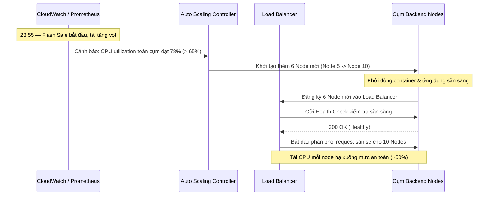
```mermaid
sequenceDiagram
    participant CloudWatch as CloudWatch / Prometheus
    participant ASG as Auto Scaling Controller
    participant LB as Load Balancer
    participant TargetGroup as Cụm Backend Nodes

    Note over CloudWatch: 23:55 — Flash Sale bắt đầu, tải tăng vọt
    CloudWatch->>ASG: Cảnh báo: CPU utilization toàn cụm đạt 78% (> 65%)
    ASG->>TargetGroup: Khởi tạo thêm 6 Node mới (Node 5 -> Node 10)
    Note over TargetGroup: Khởi động container & ứng dụng sẵn sàng
    TargetGroup->>LB: Đăng ký 6 Node mới vào Load Balancer
    LB->>TargetGroup: Gửi Health Check kiểm tra sẵn sàng
    TargetGroup-->>LB: 200 OK (Healthy)
    LB->>TargetGroup: Bắt đầu phân phối request san sẻ cho 10 Nodes
    Note over LB,TargetGroup: Tải CPU mỗi node hạ xuống mức an toàn (~50%)
```

**Bài học kiến trúc và nguyên tắc kết hợp thực tế:**
- Trong thực tế, không có sự đối đầu tuyệt đối giữa hai phương pháp. Chiến lược tối ưu nhất là **kết hợp hài hòa cả hai**:
  1. *Giai đoạn đầu (Early stage / MVP):* Tận dụng Vertical Scaling để tối ưu tốc độ phát triển và giảm độ phức tạp vận hành.
  2. *Giai đoạn trưởng thành:* Thiết kế mã nguồn ứng dụng theo nguyên tắc **Stateless ngay từ đầu** để có thể chuyển đổi sang Horizontal Scaling khi lưu lượng đạt ngưỡng tăng trưởng.
  3. *Tầng cơ sở dữ liệu:* Kết hợp Vertical Scaling cho Primary Database (máy mạnh nhất có thể) cùng với Horizontal Scaling cho Read Replicas (chia nhỏ tải đọc) để tối đa hóa hiệu quả chi phí.

---

## 12. Reverse Proxy

### 12.1. Đặt vấn đề

Trong môi trường phát triển cục bộ (localhost), lập trình viên thường để client kết nối trực tiếp đến cổng của máy chủ ứng dụng (ví dụ `http://localhost:3000`). Tuy nhiên, khi triển khai lên môi trường thực tế (production), việc để các máy chủ ứng dụng (Node.js, Java Spring, Go, Python...) kết nối trực tiếp với Internet là một **sai lầm nghiêm trọng về cả bảo mật lẫn hiệu năng**:
- **Nguy cơ bảo mật và lộ hạ tầng:** Để lộ địa chỉ IP thật và cấu trúc mạng nội bộ khiến hệ thống dễ bị tấn công DDoS trực tiếp, khai thác lỗ hổng tầng mạng hoặc quét cổng (port scanning).
- **Gánh nặng giải mã SSL/TLS:** Quá trình bắt tay (TLS handshake) và mã hóa/giải mã HTTPS tiêu tốn rất nhiều chu kỳ xử lý của CPU. Nếu mỗi application server đều phải tự xử lý SSL/TLS, năng lực xử lý logic nghiệp vụ cốt lõi sẽ bị suy giảm rõ rệt.
- **Kém hiệu quả khi phục vụ tài nguyên tĩnh:** Các framework backend được tối ưu hóa cho logic nghiệp vụ động, không được tối ưu để đọc và truyền tải các file tĩnh (ảnh, video, CSS, JavaScript) với dung lượng lớn và tần suất cao.
- **Khó khăn trong việc định tuyến và quản lý chứng chỉ:** Khi hệ thống gồm nhiều dịch vụ backend phân tán, client sẽ phải ghi nhớ nhiều domain/cổng khác nhau, và việc cập nhật chứng chỉ SSL cho từng server đơn lẻ trở thành cơn ác mộng vận hành.

### 12.2. Khái niệm

**Reverse Proxy** là một máy chủ trung gian đứng trước một hoặc nhiều máy chủ ứng dụng (backend servers), tiếp nhận tất cả các yêu cầu gửi đến từ client qua Internet, xử lý các tác vụ tiền xử lý, rồi chuyển tiếp (forward) yêu cầu đó đến đúng máy chủ backend thích hợp ở mạng nội bộ, sau đó nhận phản hồi từ backend và gửi ngược lại cho client.

Từ góc nhìn của client, **Reverse Proxy chính là máy chủ web duy nhất mà họ giao tiếp** — client hoàn toàn không biết và không cần biết danh tính, địa chỉ IP hay số lượng máy chủ backend thực sự đang hoạt động phía sau.

```mermaid
flowchart LR
    subgraph Internet["Public Internet"]
        C1[Client 1]
        C2[Client 2]
    end

    subgraph DMZ["Tầng Biên (Perimeter)"]
        RP["<b>Reverse Proxy</b><br/>(Nginx / Envoy / Caddy)<br/>- SSL Termination<br/>- Gzip / Brotli Compression<br/>- Static File Cache<br/>- Rate Limiting / WAF"]
    end

    subgraph PrivateNetwork["Private Network (Mạng nội bộ an toàn)"]
        S1["App Server 1<br/>(Auth Service :3001)"]
        S2["App Server 2<br/>(Order Service :3002)"]
        S3["App Server 3<br/>(Payment Service :3003)"]
        Storage["Static Storage / S3"]
    end

    C1 & C2 -->|"HTTPS (Port 443)<br/>Domain công khai"| RP
    RP -->|"HTTP nội bộ (/auth)"| S1
    RP -->|"HTTP nội bộ (/orders)"| S2
    RP -->|"HTTP nội bộ (/payment)"| S3
    RP -->|"Static files (/assets)"| Storage
```

#### Phân biệt Forward Proxy và Reverse Proxy

| Tiêu chí | Forward Proxy (Proxy xuôi) | Reverse Proxy (Proxy ngược) |
|---|---|---|
| **Đại diện cho ai?** | Đại diện cho **Client** (Người dùng). | Đại diện cho **Server** (Hệ thống Backend). |
| **Vị trí đứng** | Đứng cùng phía với Client (trong mạng LAN của công ty/trường học). | Đứng trước cụm Server của nhà cung cấp dịch vụ. |
| **Mục đích chính** | Ẩn danh tính Client, vượt tường lửa, kiểm soát/chặn truy cập web của nhân viên. | Bảo vệ Server, cân bằng tải, giải mã SSL, tăng tốc độ phản hồi. |
| **Phía đối diện nhìn thấy gì?** | Web Server bên ngoài chỉ thấy địa chỉ của Forward Proxy, không biết Client thật. | Client bên ngoài chỉ thấy Reverse Proxy, không biết Server backend thật phía sau. |
| **Ví dụ phổ biến** | Squid, Shadowsocks, Corporate VPN Proxy. | Nginx, HAProxy, Envoy, Traefik, Caddy, Cloudflare. |

#### Các chức năng cốt lõi của Reverse Proxy trong hệ thống Backend:
1. **SSL/TLS Termination (Chấm dứt SSL tập trung):** Reverse Proxy thực hiện toàn bộ quá trình bắt tay SSL và giải mã dữ liệu HTTPS từ client, sau đó chuyển tiếp request dưới dạng HTTP thuần qua mạng nội bộ tốc độ cao đến các server backend. Điều này giải phóng tài nguyên CPU cho backend và giúp việc cài đặt, tự động gia hạn chứng chỉ SSL (Let's Encrypt) chỉ cần thực hiện tại một nơi duy nhất.
2. **Ẩn giấu hạ tầng và Tăng cường bảo mật (Security & Anonymity):** Ẩn hoàn toàn địa chỉ IP riêng của các backend server. Reverse Proxy đóng vai trò là "khiên chắn" tích hợp Web Application Firewall (WAF), ngăn chặn các cuộc tấn công SQL Injection, XSS và lọc bỏ lưu lượng độc hại trước khi chạm tới code nghiệp vụ.
3. **Phục vụ và Cache tài nguyên tĩnh (Static Content Acceleration):** Các file tĩnh (`.js`, `.css`, `.png`, `.pdf`) được Reverse Proxy phục vụ trực tiếp từ bộ nhớ RAM hoặc ổ cứng NVMe với hiệu suất I/O cực cao (sử dụng Linux `sendfile` system call), không cần đánh thức tiến trình Node.js/Java.
4. **Nén dữ liệu thông minh (Gzip / Brotli Compression):** Tự động nén response trước khi truyền qua mạng Internet, giúp giảm từ $60\% - 80\%$ băng thông truyền tải, rút ngắn thời gian tải trang cho người dùng.
5. **Định tuyến theo đường dẫn (Path-based Routing):** Đóng vai trò là API Gateway đơn giản, chuyển tiếp các request như `/api/v1/auth` sang Auth Service và `/api/v1/orders` sang Order Service.

### 12.3. Sơ đồ minh họa luồng xử lý

```mermaid
sequenceDiagram
    autonumber
    participant Client as Client (Trình duyệt / Mobile App)
    participant RP as Nginx Reverse Proxy (Edge)
    participant Cache as Proxy Cache (RAM/Disk)
    participant Backend as Node.js Backend Server (Port 3000)

    Client->>RP: 1. HTTPS GET /api/v1/products (Mã hóa SSL)
    Note over RP: Bắt tay TLS, Giải mã HTTPS<br/>Kiểm tra WAF & Rate Limit
    
    RP->>Cache: 2. Kiểm tra Cache response?
    alt Cache Hit (Đã có trong Cache)
        Cache-->>RP: Trả dữ liệu cache sẵn
        Note over RP: Nén dữ liệu bằng Brotli/Gzip
        RP-->>Client: 3a. 200 OK (Phản hồi ngay trong 2ms)
    else Cache Miss (Chưa có trong Cache)
        Cache-->>RP: Không có
        RP->>Backend: 3b. HTTP GET /api/v1/products (Forward qua mạng nội bộ)
        Note over Backend: Xử lý logic nghiệp vụ & Query Database
        Backend-->>RP: 4. HTTP 200 OK (JSON Data)
        RP->>Cache: Lưu bản sao vào Cache (TTL = 60s)
        Note over RP: Nén JSON data bằng Gzip
        RP-->>Client: 5. HTTPS 200 OK (Gzip Compressed)
    end
```

### 12.4. Phân tích tình huống thực tiễn

**Kịch bản có số liệu: Nền tảng tin tức trực tuyến với 5.000.000 lượt xem trang mỗi ngày (Peak traffic: 8.000 RPS vào khung giờ 08:00 sáng).**

**Tình trạng ban đầu (Chạy trực tiếp Node.js ra Internet):**
- Hệ thống gồm 4 máy chủ Node.js (mỗi máy 8 vCPU, 16GB RAM) lắng nghe trực tiếp trên cổng HTTPS 443.
- Khi lưu lượng đạt **3.500 RPS**, các máy chủ bắt đầu quá tải:
  - **CPU sử dụng:** Đạt $92\%$, trong đó hơn $45\%$ CPU bị tiêu tốn riêng cho việc mã hóa/giải mã SSL/TLS và phục vụ các file ảnh bài viết, CSS, JavaScript.
  - **Event Loop Lag của Node.js:** Tăng từ $5\text{ms}$ lên $180\text{ms}$ do luồng chính bị nghẽn bởi các tác vụ I/O phục vụ file tĩnh.
  - **Độ trễ trung bình API (Latency p95):** Tăng vọt lên $850\text{ms}$, nhiều kết nối bị timeout.

**Giải pháp triển khai Reverse Proxy với Nginx:**
Đội ngũ quyết định đặt 2 máy chủ **Nginx Reverse Proxy** (mỗi máy 4 vCPU, 8GB RAM, cấu hình High Availability qua Keepalived) đứng trước 4 máy chủ Node.js:
1. **Chuyển giao SSL:** Toàn bộ chứng chỉ SSL được cài đặt trên Nginx. Nginx xử lý toàn bộ TLS termination với giao thức HTTP/2 đa luồng (Multiplexing).
2. **Cấu hình Nginx Static Cache & Linux Kernel Optimization:**
   - Cấu hình Nginx phục vụ trực tiếp thư mục `public/assets` với `open_file_cache` và `sendfile on`.
   - Bật nén `gzip_comp_level 6` cho các định dạng JSON, HTML, CSS, JS.
   - Cache các API danh sách bài viết trang chủ với TTL 30 giây (`proxy_cache_valid 200 30s`).
3. **Chuyển giao tiếp nội bộ sang HTTP/1.1 Keep-Alive:** Nginx duy trì một connection pool kết nối sẵn với Node.js backend, loại bỏ chi phí bắt tay TCP lặp lại cho mỗi request.

```nginx
# Trích đoạn cấu hình Nginx Reverse Proxy tiêu chuẩn production
upstream backend_nodes {
    server 10.0.1.10:3000 max_fails=3 fail_timeout=10s;
    server 10.0.1.11:3000 max_fails=3 fail_timeout=10s;
    keepalive 64; # Duy trì 64 kết nối keepalive sẵn sàng
}

server {
    listen 443 ssl http2;
    server_name news.example.com;

    ssl_certificate /etc/ssl/certs/fullchain.pem;
    ssl_certificate_key /etc/ssl/private/privkey.pem;

    # Phục vụ file tĩnh trực tiếp, không gọi vào backend
    location /static/ {
        root /var/www/assets;
        expires 7d;
        add_header Cache-Control "public, no-transform";
        access_log off;
    }

    # Forward API vào cụm Backend
    location /api/ {
        proxy_pass http://backend_nodes;
        proxy_http_version 1.1;
        proxy_set_header Connection "";
        proxy_set_header Host $host;
        proxy_set_header X-Real-IP $remote_addr;
        proxy_set_header X-Forwarded-For $proxy_add_x_forwarded_for;
        proxy_set_header X-Forwarded-Proto $scheme;

        # Bật Micro-caching 10s cho các truy vấn GET công khai
        proxy_cache my_cache;
        proxy_cache_valid 200 10s;
        proxy_cache_use_stale error timeout updating;
    }
}
```

**Kết quả đo lường sau khi triển khai Reverse Proxy:**
- **Năng lực chịu tải của hệ thống:** Tăng từ 3.500 RPS lên **14.000 RPS** (gấp 4 lần) mà không cần mua thêm bất kỳ máy chủ Node.js backend nào.
- **Mức sử dụng CPU của cụm Node.js:** Giảm mạnh từ $92\%$ xuống chỉ còn **$38\%$**, vì Node.js giờ đây chỉ tập trung xử lý dữ liệu động và logic nghiệp vụ.
- **Độ trễ trung bình (p95):** Giảm từ $850\text{ms}$ xuống còn **$28\text{ms}$** (đối với API cache) và **$65\text{ms}$** (đối với request động).
- **Tiết kiệm băng thông:** Nén Gzip/Brotli tại proxy giúp giảm lưu lượng đường truyền mạng từ $120\text{ Mbps}$ xuống còn $34\text{ Mbps}$, tiết kiệm đáng kể chi phí băng thông Cloud hàng tháng.

---

## Tổng kết

Mười hai khái niệm trình bày ở trên tuy độc lập nhưng có mối liên hệ chặt chẽ trong một hệ thống backend thực tế, thể hiện rõ qua các tình huống đã phân tích: một API được thiết kế theo chuẩn RESTful (1) cần được bảo vệ bởi cơ chế Authentication & Authorization (2) để tránh truy cập trái phép; dữ liệu phía sau cần Database Index (3) để truy vấn nhanh trên hàng chục triệu bản ghi và Transaction (4) để đảm bảo tính toàn vẹn cho các giao dịch tài chính; khi nhiều người dùng tranh chấp cùng một tài nguyên (như ghế xem phim), hệ thống phải xử lý tốt Concurrency (5); để giảm tải cho database ở các truy vấn lặp lại, hệ thống sử dụng Cache (6); để không bắt người dùng chờ đợi các tác vụ phụ trợ, hệ thống dùng Message Queue (7) xử lý bất đồng bộ — nhưng khi đó các API xử lý lại thông điệp trùng lặp bắt buộc phải đảm bảo Idempotency (8) để tránh trừ tiền hai lần; toàn hệ thống cần Rate Limiting (9) để chống lạm dụng và tấn công; Load Balancing (10) để phân phối lưu lượng và duy trì tính sẵn sàng cao; chiến lược Horizontal & Vertical Scaling (11) để co giãn hạ tầng linh hoạt; và cuối cùng là lớp Reverse Proxy (12) đứng ở cửa ngõ biên (perimeter) để bảo vệ toàn bộ hạ tầng bên trong, gánh vác việc giải mã SSL, nén dữ liệu và tối ưu hóa phản hồi trước khi request chạm tới các máy chủ ứng dụng. Việc hiểu đúng bản chất — không chỉ cách dùng mà còn lý do tồn tại, đánh đổi (trade-off), và giới hạn của từng khái niệm — chính là nền tảng để một kỹ sư backend thiết kế được hệ thống vừa hiệu quả, vừa bền vững trước mọi áp lực tải.

