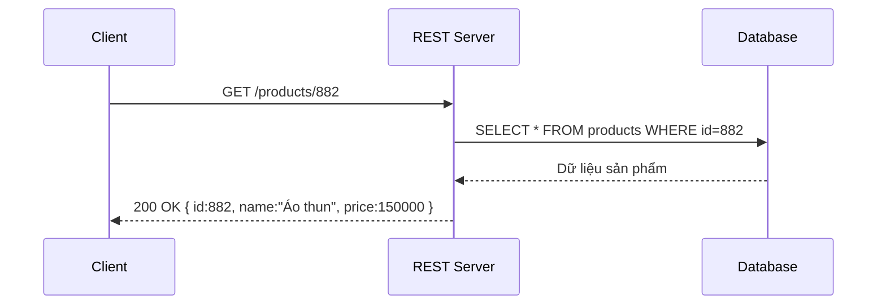
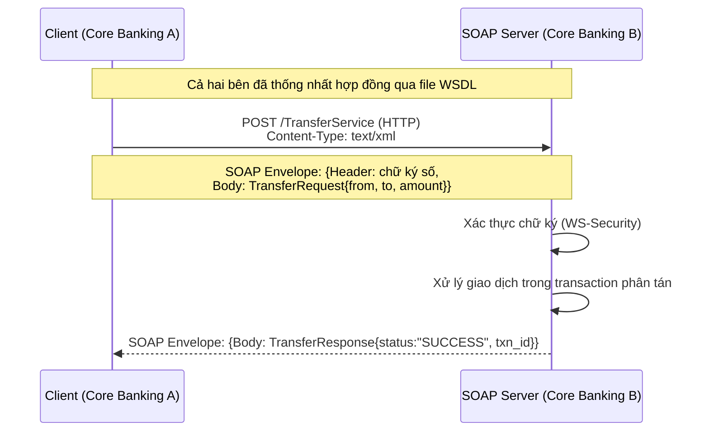
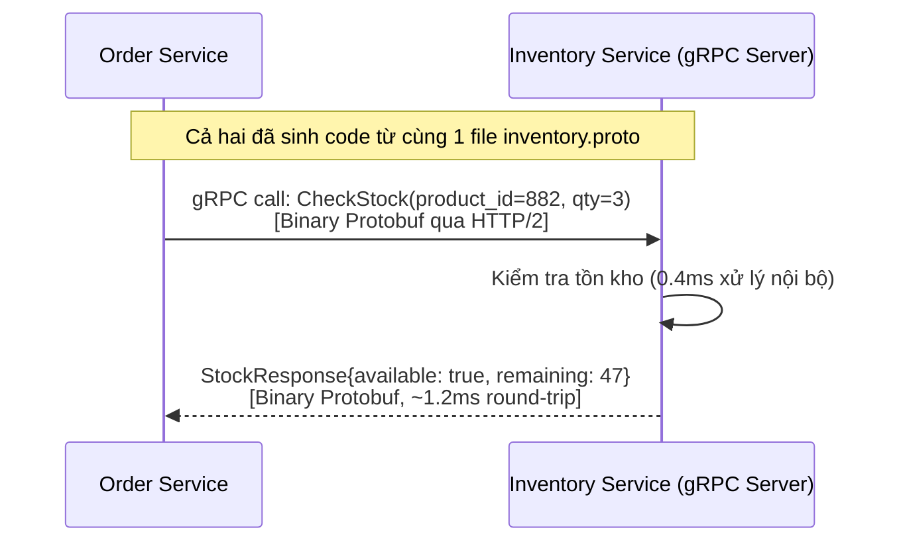
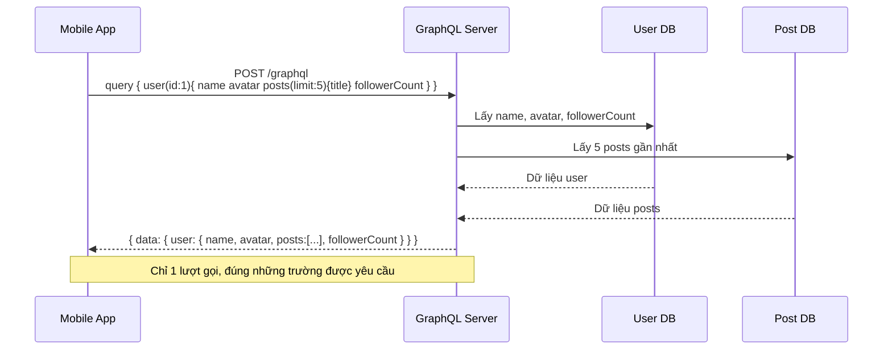
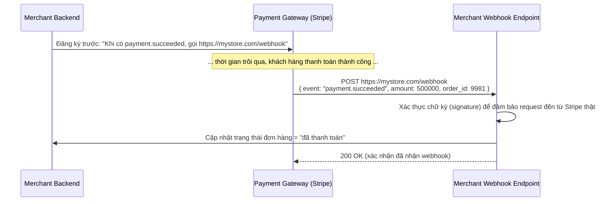
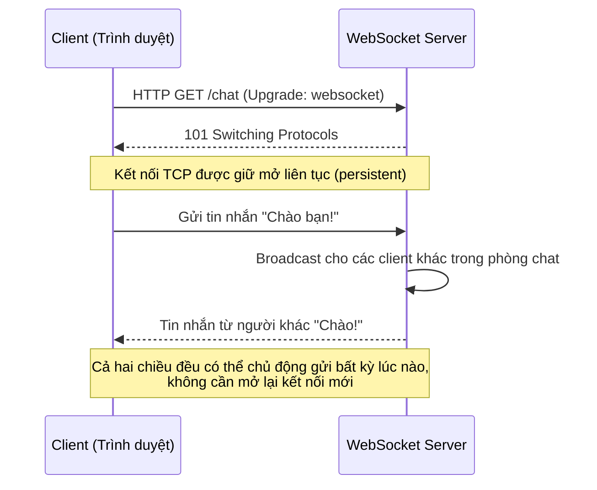
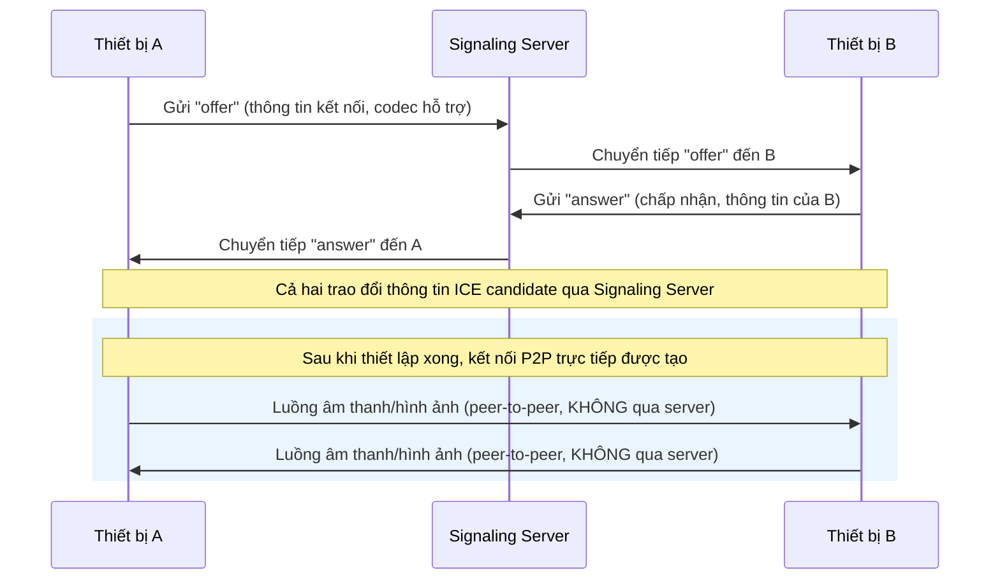

# BẢY LOẠI API PHỔ BIẾN TRONG PHÁT TRIỂN PHẦN MỀM

## Lời mở đầu

API (Application Programming Interface) là cầu nối cho phép các hệ thống phần mềm giao tiếp với nhau. Tuy nhiên, không có một kiểu API duy nhất phù hợp cho mọi bài toán: một hệ thống ngân hàng lõi cần tính an toàn và hợp đồng nghiêm ngặt, một ứng dụng di động cần tránh gọi quá nhiều request, một ứng dụng chat cần độ trễ gần như tức thời, còn một cuộc gọi video lại cần truyền dữ liệu trực tiếp giữa hai thiết bị mà không qua máy chủ trung gian. Chính vì vậy, qua nhiều thập kỷ phát triển, ngành công nghiệp phần mềm đã hình thành nhiều kiểu kiến trúc và giao thức API khác nhau, mỗi loại được sinh ra để giải quyết một lớp bài toán cụ thể. Tài liệu này trình bày bảy loại API phổ biến nhất theo cấu trúc: đặt vấn đề — khái niệm — sơ đồ minh họa luồng xử lý — phân tích tình huống thực tiễn.

---

## Mục lục

1. [REST](#1-rest)
2. [SOAP](#2-soap)
3. [gRPC](#3-grpc)
4. [GraphQL](#4-graphql)
5. [WebHook](#5-webhook)
6. [WebSocket](#6-websocket)
7. [WebRTC](#7-webrtc)
8. [Bảng so sánh tổng hợp](#8-bảng-so-sánh-tổng-hợp)

---

## 1. REST

### 1.1. Đặt vấn đề

Vào cuối thập niên 1990, các hệ thống phân tán bắt đầu bùng nổ, nhưng phần lớn giao thức giao tiếp thời điểm đó (như CORBA, DCOM) quá phức tạp, gắn chặt vào một nền tảng công nghệ cụ thể, khó mở rộng và khó gỡ lỗi. Cần một kiểu kiến trúc đơn giản, tận dụng những gì web đã có sẵn (HTTP, URI), dễ hiểu cho cả người mới, và hoạt động tốt ở quy mô lớn như chính bản thân World Wide Web.

### 1.2. Khái niệm

**REST (Representational State Transfer)** là một kiểu kiến trúc (không phải giao thức) do Roy Fielding đề xuất năm 2000, coi mọi thực thể trong hệ thống là một **tài nguyên (resource)** được định danh bằng URI, và thao tác trên tài nguyên đó thông qua các phương thức HTTP chuẩn (`GET`, `POST`, `PUT`, `PATCH`, `DELETE`). Dữ liệu trao đổi thường ở định dạng **JSON** (nhẹ, dễ đọc) hoặc XML.

Các nguyên tắc cốt lõi: giao tiếp client-server tách biệt, **stateless** (server không lưu trạng thái phiên của client giữa các request), có thể cache được, giao diện thống nhất (uniform interface), và hệ thống phân lớp (layered system).

### 1.3. Sơ đồ minh họa luồng xử lý



### 1.4. Phân tích tình huống thực tiễn

Ứng dụng di động của một sàn thương mại điện tử gọi `GET /products/882` để lấy thông tin một sản phẩm khi người dùng mở trang chi tiết. Vì tính chất **stateless**, request này có thể được xử lý bởi bất kỳ server nào trong cụm 20 server đứng sau load balancer mà không cần server đó "nhớ" phiên làm việc trước đó của người dùng — giúp hệ thống dễ dàng mở rộng theo chiều ngang (horizontal scaling). REST hiện là lựa chọn mặc định cho hầu hết API công khai (Public API) như Shopify API, GitHub API, Twitter API, vì tính đơn giản, dễ tích hợp và được hỗ trợ bởi mọi ngôn ngữ lập trình, mọi trình duyệt.

**Hạn chế:** Với các màn hình cần hiển thị nhiều loại dữ liệu lồng nhau (ví dụ trang chủ cần cả thông tin người dùng, giỏ hàng, gợi ý sản phẩm), REST thường buộc client phải gọi nhiều endpoint riêng biệt (`GET /users/1`, `GET /cart/1`, `GET /recommendations/1`) — gây ra vấn đề gọi thừa dữ liệu (**over-fetching**) hoặc phải gọi nhiều lần (**multiple round-trips**), là động lực ra đời của GraphQL sau này (mục 4).

---

## 2. SOAP

### 2.1. Đặt vấn đề

Trong các ngành đòi hỏi độ tin cậy và tính hình thức cực cao như ngân hàng, bảo hiểm, hay hệ thống chính phủ, một bản hợp đồng giao tiếp API mơ hồ có thể gây hậu quả nghiêm trọng: sai lệch kiểu dữ liệu trong giao dịch chuyển tiền liên ngân hàng, thiếu chuẩn bảo mật khi truyền dữ liệu y tế nhạy cảm, hoặc không có cơ chế xác nhận giao dịch đã được xử lý đúng một lần. REST — vốn linh hoạt và không ép buộc cấu trúc chặt chẽ — không đáp ứng tốt các yêu cầu khắt khe này. Ngành công nghiệp cần một giao thức có **hợp đồng (contract)** được định nghĩa hình thức, kiểm tra được tự động, và tích hợp sẵn các chuẩn bảo mật, giao dịch cấp doanh nghiệp.

### 2.2. Khái niệm

**SOAP (Simple Object Access Protocol)** là một **giao thức** (không chỉ là kiến trúc như REST) truyền thông điệp dựa trên **XML**, được chuẩn hóa bởi W3C. Mọi thông điệp SOAP đều được đóng gói trong một cấu trúc gọi là **SOAP Envelope**, gồm phần `Header` (chứa thông tin bổ trợ như xác thực, mã hóa) và phần `Body` (chứa nội dung thực sự của yêu cầu/phản hồi).

Điểm đặc trưng quan trọng nhất của SOAP là **WSDL (Web Services Description Language)** — một tài liệu XML mô tả chính xác API cung cấp những hàm gì, tham số đầu vào/đầu ra là kiểu dữ liệu gì, giống như một "hợp đồng" bắt buộc giữa client và server, cho phép sinh code tự động (code generation) ở cả hai phía. SOAP cũng hỗ trợ bộ chuẩn mở rộng **WS-* (WS-Security, WS-ReliableMessaging, WS-AtomicTransaction)** giúp đảm bảo mã hóa đầu cuối, đảm bảo thông điệp không bị mất hoặc trùng lặp, và hỗ trợ giao dịch phân tán (distributed transaction) — những tính năng mà REST không có sẵn.

### 2.3. Sơ đồ minh họa luồng xử lý



### 2.4. Phân tích tình huống thực tiễn

**Kịch bản: hệ thống chuyển tiền liên ngân hàng qua cổng thanh toán quốc gia (tương tự NAPAS tại Việt Nam).** Khi Ngân hàng A gửi yêu cầu chuyển 20.000.000đ sang Ngân hàng B, thông điệp SOAP gửi đi có cấu trúc XML nghiêm ngặt như sau (rút gọn):

```xml
<soap:Envelope xmlns:soap="http://www.w3.org/2003/05/soap-envelope">
  <soap:Header>
    <wsse:Security>...chữ ký số xác thực Ngân hàng A...</wsse:Security>
  </soap:Header>
  <soap:Body>
    <TransferRequest>
      <FromAccount>1903xxxxxx</FromAccount>
      <ToAccount>0071xxxxxx</ToAccount>
      <Amount>20000000</Amount>
      <Currency>VND</Currency>
    </TransferRequest>
  </soap:Body>
</soap:Envelope>
```

Vì hợp đồng WSDL đã quy định chính xác `Amount` phải là kiểu số nguyên dương, `Currency` phải thuộc danh sách mã ISO 4217 hợp lệ, mọi sai lệch kiểu dữ liệu sẽ bị từ chối **ngay tại tầng validate tự động**, trước khi chạm vào logic nghiệp vụ — giảm thiểu rủi ro sai sót trong giao dịch tài chính giá trị lớn. Cơ chế WS-ReliableMessaging cũng đảm bảo nếu đường truyền giữa hai ngân hàng bị gián đoạn giữa chừng, hệ thống có cơ chế xác nhận và truyền lại thông điệp mà không tạo ra giao dịch trùng lặp.

**Đánh đổi trong thực tế:** Một thông điệp SOAP cho cùng một nội dung thường nặng gấp 3-5 lần so với JSON tương đương do cấu trúc XML dài dòng, làm chậm tốc độ xử lý và tốn băng thông hơn. Vì lý do này, SOAP ngày nay gần như chỉ còn được dùng trong các hệ thống lõi ngân hàng, bảo hiểm, hệ thống chính phủ (ví dụ Cổng Dịch vụ công Quốc gia, hệ thống thuế điện tử) — những nơi tính hình thức, bảo mật và khả năng kiểm toán quan trọng hơn tốc độ phát triển nhanh — trong khi các API hướng người dùng cuối, ứng dụng web/mobile hiện đại gần như đã chuyển hoàn toàn sang REST hoặc GraphQL.

---

## 3. gRPC

### 3.1. Đặt vấn đề

Trong một hệ thống microservices quy mô lớn (ví dụ Netflix có hàng trăm service nội bộ gọi lẫn nhau hàng tỷ lần mỗi ngày), việc dùng REST với JSON qua HTTP/1.1 giữa các service nội bộ bắt đầu bộc lộ hạn chế: mỗi request cần một kết nối TCP riêng (với HTTP/1.1), payload JSON dạng văn bản chiếm nhiều băng thông hơn cần thiết, và không có cơ chế chuẩn để định nghĩa hợp đồng API chặt chẽ giữa hàng trăm đội phát triển khác nhau. Khi độ trễ giữa các service cộng dồn (một request người dùng có thể kéo theo hàng chục lệnh gọi nội bộ), vài mili-giây tiết kiệm được ở mỗi lệnh gọi sẽ tạo ra khác biệt lớn ở quy mô toàn hệ thống.

### 3.2. Khái niệm

**gRPC (gRPC Remote Procedure Call)** là một framework RPC (Remote Procedure Call) mã nguồn mở do Google phát triển, cho phép một chương trình gọi trực tiếp một hàm nằm trên một máy chủ khác giống như gọi hàm nội bộ. gRPC có ba đặc trưng kỹ thuật quan trọng:

- **Protocol Buffers (Protobuf):** định dạng serialize dữ liệu nhị phân (binary), nhỏ gọn và nhanh hơn đáng kể so với JSON dạng văn bản. Hợp đồng API được định nghĩa trong file `.proto`, từ đó sinh code tự động cho nhiều ngôn ngữ (Go, Java, Python, C++...).
- **HTTP/2:** cho phép **multiplexing** — gửi nhiều request/response đồng thời trên cùng một kết nối TCP duy nhất, giảm độ trễ thiết lập kết nối.
- **Hỗ trợ Streaming:** ngoài mô hình request-response một-một truyền thống, gRPC hỗ trợ cả **Server Streaming** (server gửi liên tục nhiều phản hồi cho một request), **Client Streaming**, và **Bidirectional Streaming** (cả hai bên gửi dữ liệu liên tục qua lại).

### 3.3. Sơ đồ minh họa luồng xử lý



### 3.4. Phân tích tình huống thực tiễn

**Kịch bản có số liệu: giao tiếp nội bộ giữa Order Service và Inventory Service trong hệ thống thương mại điện tử xử lý 3.000 đơn hàng/giây.**

File hợp đồng `inventory.proto` được định nghĩa và chia sẻ giữa hai đội phát triển:

```protobuf
service InventoryService {
  rpc CheckStock (StockRequest) returns (StockResponse);
}
message StockRequest {
  int32 product_id = 1;
  int32 quantity = 2;
}
message StockResponse {
  bool available = 1;
  int32 remaining = 2;
}
```

Đội kỹ thuật đo đạc và so sánh hai phương án triển khai cho cùng lệnh gọi kiểm tra tồn kho:

| Tiêu chí | REST + JSON (HTTP/1.1) | gRPC + Protobuf (HTTP/2) |
|---|---|---|
| Kích thước payload trung bình | ~340 bytes | ~48 bytes |
| Độ trễ round-trip trung bình | ~8,5 ms | ~1,2 ms |
| Số kết nối TCP cho 100 request đồng thời | Nhiều kết nối (hoặc phải chờ hàng đợi) | 1 kết nối (multiplexing) |
| Kiểm tra kiểu dữ liệu | Thủ công / validate runtime | Tự động tại tầng biên dịch (compile-time) |

Với 3.000 đơn hàng/giây, mỗi đơn hàng cần gọi trung bình 4 lệnh kiểm tra tồn kho nội bộ (tổng 12.000 lệnh gọi/giây), việc giảm độ trễ từ 8,5ms xuống 1,2ms giúp tổng thời gian xử lý một đơn hàng giảm đáng kể, đồng thời giảm tải hạ tầng mạng nội bộ nhờ payload nhỏ gọn hơn khoảng 7 lần.

**Ứng dụng thực tế:** gRPC được sử dụng rộng rãi trong giao tiếp **nội bộ giữa các microservices** tại các công ty công nghệ lớn như Google, Netflix, Square — nơi cả client và server đều nằm trong tầm kiểm soát của cùng một tổ chức, dễ dàng đồng bộ file `.proto`. gRPC ít phù hợp cho API công khai hướng đến trình duyệt web, vì trình duyệt không hỗ trợ gọi gRPC thuần túy (cần một lớp chuyển đổi gọi là gRPC-Web) và định dạng binary khó debug trực quan hơn JSON.

---

## 4. GraphQL

### 4.1. Đặt vấn đề

Một ứng dụng di động hiển thị trang hồ sơ người dùng cần đồng thời: tên, ảnh đại diện, 5 bài viết gần nhất, và số lượng người theo dõi. Với REST truyền thống, client thường phải gọi tới 3-4 endpoint khác nhau (`GET /users/1`, `GET /users/1/posts`, `GET /users/1/followers`) — gây **nhiều lượt gọi mạng (round-trip)**, đặc biệt tốn kém trên mạng di động độ trễ cao. Ngược lại, nếu server gộp sẵn tất cả dữ liệu liên quan vào một endpoint duy nhất để giảm số lượt gọi, client lại nhận về nhiều trường dữ liệu không cần dùng đến (**over-fetching**), lãng phí băng thông — đặc biệt nghiêm trọng khi các client khác nhau (web, mobile, smartwatch) có nhu cầu hiển thị dữ liệu khác nhau nhưng phải dùng chung một response cố định.

### 4.2. Khái niệm

**GraphQL** là một **ngôn ngữ truy vấn (query language)** cho API, do Facebook phát triển năm 2012 và công bố mã nguồn mở năm 2015. Khác với REST có nhiều endpoint ứng với nhiều tài nguyên, GraphQL chỉ có **một endpoint duy nhất** (thường là `/graphql`), và client tự định nghĩa chính xác cấu trúc dữ liệu mình cần trong nội dung truy vấn gửi lên, server sẽ trả về **đúng và chỉ đúng** những trường dữ liệu đó — không thừa, không thiếu.

Ba thành phần cốt lõi của GraphQL:

- **Schema:** định nghĩa hình thức toàn bộ kiểu dữ liệu và các trường có thể truy vấn được, đóng vai trò hợp đồng giữa client và server (tương tự WSDL của SOAP nhưng linh hoạt hơn).
- **Query:** thao tác đọc dữ liệu (tương đương `GET` trong REST).
- **Mutation:** thao tác ghi/thay đổi dữ liệu (tương đương `POST`/`PUT`/`DELETE`).
- **Resolver:** hàm phía server chịu trách nhiệm lấy dữ liệu thực tế cho từng trường được yêu cầu trong query.

### 4.3. Sơ đồ minh họa luồng xử lý



### 4.4. Phân tích tình huống thực tiễn

**Kịch bản so sánh cụ thể: trang hồ sơ người dùng trên ứng dụng mạng xã hội.**

Với REST, client cần thực hiện tuần tự (hoặc song song nhưng vẫn tốn 3 kết nối) ba lệnh gọi:

```
GET /users/1          → trả về TOÀN BỘ 22 trường của user (bao gồm cả email, địa chỉ, ngày sinh — không cần dùng)
GET /users/1/posts    → trả về TOÀN BỘ bài viết, không giới hạn
GET /users/1/followers/count
```

Với GraphQL, chỉ cần một lệnh gọi duy nhất, chỉ định chính xác trường cần thiết:

```graphql
query {
  user(id: 1) {
    name
    avatarUrl
    posts(limit: 5) {
      title
    }
    followerCount
  }
}
```

| Tiêu chí | REST (3 lượt gọi) | GraphQL (1 lượt gọi) |
|---|---|---|
| Số round-trip mạng | 3 | 1 |
| Tổng dung lượng phản hồi | ~18 KB (nhiều trường thừa) | ~2,1 KB (đúng trường cần) |
| Độ trễ trên mạng 4G (ước tính) | ~450 ms (3 lượt x ~150ms) | ~160 ms |

Trên mạng di động độ trễ cao hoặc không ổn định (phổ biến tại các khu vực nông thôn hoặc khi di chuyển), việc giảm từ 3 round-trip xuống 1 giúp cải thiện đáng kể trải nghiệm người dùng, đồng thời giảm dung lượng dữ liệu tiêu thụ — yếu tố quan trọng khi người dùng dùng gói cước 4G giới hạn dung lượng. Đây là lý do Facebook phát triển GraphQL ban đầu chính cho ứng dụng di động của họ.

**Đánh đổi trong thực tế:** Vì GraphQL cho phép client tự do lồng ghép truy vấn phức tạp (nested query), một truy vấn được thiết kế thiếu kiểm soát (ví dụ client truy vấn user → posts → comments → author → posts → comments... lồng nhau vô hạn) có thể gây quá tải nghiêm trọng cho server nếu không có cơ chế giới hạn độ sâu truy vấn (**query depth limiting**) và giới hạn độ phức tạp (**query complexity analysis**). Ngoài ra, GraphQL khó tận dụng cơ chế cache HTTP tiêu chuẩn (vốn hoạt động tốt với REST nhờ URL cố định) vì mọi request đều gửi đến cùng một endpoint `/graphql` bằng phương thức POST.

---

## 5. WebHook

### 5.1. Đặt vấn đề

Giả sử một ứng dụng kế toán cần biết ngay khi có một giao dịch thanh toán mới hoàn tất trên cổng thanh toán. Cách tiếp cận ngây thơ là **polling** — ứng dụng kế toán liên tục gọi API `GET /payments/status` mỗi vài giây để kiểm tra xem có giao dịch mới hay không. Cách làm này cực kỳ lãng phí: phần lớn các lượt gọi sẽ nhận về kết quả "không có gì mới", tiêu tốn tài nguyên server một cách không cần thiết, đồng thời độ trễ phát hiện sự kiện phụ thuộc vào tần suất polling (nếu polling mỗi 30 giây thì có thể mất tới 30 giây mới biết được sự kiện đã xảy ra).

### 5.2. Khái niệm

**WebHook** — đôi khi được gọi là "reverse API" — là cơ chế trong đó, thay vì client chủ động hỏi server liên tục, **server chủ động gửi (push) một thông báo HTTP POST đến một URL do client đăng ký trước**, ngay tại thời điểm một sự kiện cụ thể xảy ra. Client (bên nhận webhook) cần triển khai sẵn một endpoint để lắng nghe các thông báo này, gọi là **webhook receiver** hoặc **webhook endpoint**.

Về bản chất kỹ thuật, WebHook không phải một giao thức mới mà chỉ là một **cách sử dụng HTTP POST theo hướng sự kiện (event-driven)** — bên gửi đóng vai trò client, bên nhận đóng vai trò server trong chính lượt gọi đó, ngược lại hoàn toàn so với mô hình client-server truyền thống của REST.

### 5.3. Sơ đồ minh họa luồng xử lý



### 5.4. Phân tích tình huống thực tiễn

**Kịch bản: tích hợp cổng thanh toán Stripe cho một cửa hàng trực tuyến.** Khi khách hàng hoàn tất thanh toán trên trang của Stripe (nằm ngoài hệ thống của cửa hàng), Stripe sẽ gửi một request `POST` đến URL webhook mà cửa hàng đã cấu hình sẵn trong dashboard, ví dụ `https://mystore.com/api/webhooks/stripe`, với nội dung:

```json
{
  "event": "payment_intent.succeeded",
  "data": {
    "amount": 500000,
    "currency": "vnd",
    "order_id": "ORD-9981"
  }
}
```

So với phương án polling mỗi 10 giây (yêu cầu server cửa hàng gọi API Stripe 8.640 lần/ngày cho mỗi đơn hàng đang chờ, phần lớn vô ích), WebHook giúp cửa hàng **chỉ nhận đúng một request tại đúng thời điểm sự kiện xảy ra** — giảm tải gần như tuyệt đối cho cả hai phía, đồng thời độ trễ phát hiện sự kiện gần như tức thời (thường dưới 1 giây) thay vì phụ thuộc vào chu kỳ polling.

**Vấn đề bảo mật quan trọng cần lưu ý:** Vì webhook endpoint là một URL công khai trên internet, bất kỳ ai biết URL này đều có thể giả mạo gửi request giống hệt để đánh lừa hệ thống (ví dụ giả lập một giao dịch thanh toán chưa từng xảy ra). Do đó, các nhà cung cấp webhook uy tín như Stripe hay GitHub luôn đính kèm một **chữ ký số (signature)** trong header (ví dụ `Stripe-Signature`), được tính từ nội dung request và một khóa bí mật chia sẻ trước — bên nhận webhook **bắt buộc phải xác thực chữ ký này** trước khi tin tưởng xử lý nội dung, nếu không hệ thống sẽ có lỗ hổng nghiêm trọng cho phép giả mạo giao dịch.

**Ứng dụng phổ biến khác:** GitHub Webhook kích hoạt pipeline CI/CD tự động mỗi khi có commit mới được đẩy lên (`push` event) hoặc Pull Request được tạo; các nền tảng giao hàng gửi webhook cập nhật trạng thái vận đơn (đang giao, đã giao) về hệ thống của sàn thương mại điện tử.

---

## 6. WebSocket

### 6.1. Đặt vấn đề

Một ứng dụng trò chuyện trực tuyến (chat) cần hiển thị tin nhắn mới gần như ngay lập tức khi người khác gửi đến, theo cả hai chiều liên tục. Nếu dùng HTTP request-response truyền thống, client phải liên tục polling (gửi request hỏi "có tin nhắn mới không?") — vừa tốn tài nguyên vừa có độ trễ. Kỹ thuật cải tiến hơn là **long-polling** (server giữ request mở cho đến khi có dữ liệu mới mới trả lời), nhưng vẫn phải mở lại kết nối HTTP mới sau mỗi lần phản hồi, gây overhead không cần thiết cho các ứng dụng cần trao đổi dữ liệu hai chiều liên tục với tần suất cao (chat, game trực tuyến, bảng giá chứng khoán thời gian thực).

### 6.2. Khái niệm

**WebSocket** là một giao thức truyền thông cung cấp kênh giao tiếp **hai chiều toàn song công (full-duplex)** trên một **kết nối TCP duy nhất, được giữ mở liên tục (persistent connection)** giữa client và server, thay vì mở-đóng kết nối riêng cho từng lượt trao đổi như HTTP truyền thống. Kết nối WebSocket bắt đầu bằng một quá trình gọi là **handshake**: client gửi một HTTP request đặc biệt với header `Upgrade: websocket`, nếu server đồng ý, kết nối được "nâng cấp" (upgrade) từ HTTP sang giao thức WebSocket (`ws://` hoặc `wss://` khi có mã hóa TLS), và từ thời điểm đó cả client lẫn server đều có thể chủ động gửi dữ liệu cho nhau bất kỳ lúc nào mà không cần mở lại kết nối.

### 6.3. Sơ đồ minh họa luồng xử lý



### 6.4. Phân tích tình huống thực tiễn

**Kịch bản có số liệu: ứng dụng chat nhóm với 10.000 người dùng online đồng thời.**

Nếu dùng polling mỗi 3 giây để kiểm tra tin nhắn mới, hệ thống phải xử lý:

```
10.000 người dùng × (60/3) lượt/phút = 200.000 request/phút chỉ để hỏi "có gì mới không"
```

phần lớn trong số đó trả về kết quả rỗng — lãng phí tài nguyên server và băng thông đáng kể, đồng thời tin nhắn mới nhất vẫn có thể trễ tới 3 giây mới hiển thị.

Khi chuyển sang WebSocket, mỗi trong 10.000 người dùng chỉ mở **đúng một kết nối duy nhất** và giữ nguyên trong suốt phiên chat. Khi có tin nhắn mới, server chỉ cần **đẩy (push)** trực tiếp dữ liệu qua kết nối đã mở sẵn đến những người dùng liên quan — độ trễ hiển thị tin nhắn giảm xuống còn khoảng vài chục mili-giây (gần như tức thời), đồng thời tổng số request HTTP giảm gần như hoàn toàn so với phương án polling.

| Tiêu chí | Polling mỗi 3 giây | WebSocket |
|---|---|---|
| Số request/phút (10.000 người dùng) | ~200.000 | ~0 (chỉ 1 lần handshake ban đầu) |
| Độ trễ hiển thị tin nhắn mới | Tối đa ~3.000 ms | ~30-50 ms |
| Tài nguyên server tiêu tốn | Cao (CPU xử lý request rỗng liên tục) | Thấp hơn nhiều (chỉ xử lý khi có dữ liệu thật) |

**Ứng dụng thực tế khác:** Bên cạnh ứng dụng chat (Messenger, Zalo, Discord), WebSocket còn được dùng rộng rãi trong bảng giá chứng khoán/tiền điện tử thời gian thực (Binance, các sàn giao dịch cập nhật giá liên tục mỗi vài trăm mili-giây), game trực tuyến nhiều người chơi (đồng bộ vị trí nhân vật giữa những người chơi), và các bảng điều khiển giám sát hệ thống thời gian thực (dashboard hiển thị số liệu server đang cập nhật liên tục).

---

## 7. WebRTC

### 7.1. Đặt vấn đề

Một cuộc gọi video giữa hai người dùng đòi hỏi độ trễ cực thấp để tránh hiện tượng giật, trễ tiếng — nếu toàn bộ luồng âm thanh, hình ảnh phải đi vòng qua một máy chủ trung tâm rồi mới đến người nhận (như kiến trúc client-server truyền thống của WebSocket hay REST), độ trễ tổng cộng (gửi lên server + server xử lý + gửi xuống người nhận) sẽ tăng gấp đôi so với việc truyền trực tiếp, đồng thời máy chủ trung tâm phải gánh chi phí băng thông khổng lồ khi phục vụ hàng triệu cuộc gọi đồng thời (vì toàn bộ dữ liệu video của mọi cuộc gọi đều phải đi qua máy chủ này).

### 7.2. Khái niệm

**WebRTC (Web Real-Time Communication)** là một tập hợp giao thức và API mã nguồn mở (được hỗ trợ sẵn trên hầu hết trình duyệt hiện đại) cho phép hai thiết bị (trình duyệt, ứng dụng di động) truyền trực tiếp dữ liệu âm thanh, hình ảnh, hoặc dữ liệu tùy ý cho nhau theo mô hình **peer-to-peer (P2P)** — nghĩa là sau khi kết nối được thiết lập, dữ liệu media đi **thẳng** từ thiết bị này sang thiết bị kia mà không cần qua máy chủ trung gian, giúp giảm độ trễ tối đa và giảm tải cho hạ tầng server.

Vì hai thiết bị thường nằm sau các lớp mạng NAT/firewall khác nhau (không thể biết địa chỉ IP thực của nhau), WebRTC cần một quá trình gọi là **signaling** — thông qua một máy chủ trung gian nhẹ (không truyền media, chỉ truyền thông tin thiết lập kết nối) để hai bên trao đổi thông tin kỹ thuật (địa chỉ IP, codec hỗ trợ) trước khi thiết lập kết nối trực tiếp. Ba thành phần kỹ thuật cốt lõi hỗ trợ việc "xuyên thủng" NAT:

- **STUN (Session Traversal Utilities for NAT):** giúp thiết bị phát hiện địa chỉ IP công khai (public IP) của chính mình khi đứng sau NAT.
- **TURN (Traversal Using Relays around NAT):** trong trường hợp không thể kết nối trực tiếp (mạng quá hạn chế), dữ liệu sẽ được chuyển tiếp (relay) qua một máy chủ TURN trung gian — như phương án dự phòng cuối cùng.
- **ICE (Interactive Connectivity Establishment):** framework kết hợp cả STUN và TURN để tìm ra đường truyền tối ưu nhất giữa hai thiết bị.

### 7.3. Sơ đồ minh họa luồng xử lý



### 7.4. Phân tích tình huống thực tiễn

**Kịch bản có số liệu: ứng dụng gọi video 1-1 (tương tự Google Meet, Zalo Call).**

Khi người dùng A gọi video cho người dùng B, quá trình diễn ra theo hai giai đoạn:

**Giai đoạn 1 — Signaling (qua server, dữ liệu nhẹ):** Server signaling (thường xây dựng trên WebSocket) chỉ làm nhiệm vụ "làm mối" — chuyển tiếp thông tin kỹ thuật giữa A và B (offer/answer theo chuẩn SDP — Session Description Protocol, cùng danh sách ICE candidate). Lượng dữ liệu trao đổi ở giai đoạn này rất nhỏ, thường dưới 5 KB.

**Giai đoạn 2 — Truyền media (peer-to-peer, dữ liệu nặng):** Sau khi thiết lập xong, luồng video (thường 500 Kbps – 2 Mbps tùy chất lượng) đi **trực tiếp** giữa thiết bị của A và B. Giả sử độ trễ mạng từ A đến server trung tâm là 40ms, và từ server đến B cũng là 40ms — nếu phải đi vòng qua server theo kiến trúc truyền thống, tổng độ trễ tối thiểu đã là 80ms (chưa tính thời gian server xử lý/relay). Với WebRTC, nếu A và B kết nối trực tiếp thành công (P2P), độ trễ mạng thực tế có thể chỉ khoảng 25-35ms — thấp hơn đáng kể, mang lại trải nghiệm cuộc gọi mượt mà hơn rõ rệt, đặc biệt quan trọng để tránh hiện tượng trễ tiếng gây khó chịu khi hai người nói chuyện.

| Tiêu chí | Kiến trúc qua Server trung tâm (Relay) | WebRTC Peer-to-Peer |
|---|---|---|
| Đường đi dữ liệu media | A → Server → B | A → B (trực tiếp) |
| Độ trễ ước tính (ví dụ trên) | ~80ms+ | ~25-35ms |
| Chi phí băng thông server | Rất cao (server gánh toàn bộ luồng video của mọi cuộc gọi) | Rất thấp (server chỉ xử lý tín hiệu signaling nhẹ) |
| Khả năng hoạt động khi mạng bị hạn chế nghiêm ngặt (NAT đối xứng, firewall doanh nghiệp) | Luôn hoạt động | Cần fallback qua TURN relay (không còn P2P thuần túy) |

**Trường hợp cần TURN relay:** Trong thực tế, không phải lúc nào kết nối P2P trực tiếp cũng thành công — theo thống kê phổ biến trong ngành, khoảng 15-20% số cuộc gọi WebRTC thực tế phải rơi về phương án dự phòng TURN relay do một hoặc cả hai bên nằm sau NAT đối xứng (symmetric NAT) hoặc tường lửa doanh nghiệp chặn kết nối P2P trực tiếp — lúc này dữ liệu vẫn phải đi qua máy chủ TURN trung gian, mất đi lợi thế độ trễ thấp, nhưng vẫn đảm bảo cuộc gọi diễn ra được thay vì thất bại hoàn toàn.

**Ứng dụng thực tế khác:** Ngoài gọi video, WebRTC còn là nền tảng cho tính năng chia sẻ màn hình trực tiếp, truyền file peer-to-peer không qua server trung gian (giảm chi phí lưu trữ), và các ứng dụng học trực tuyến tương tác thời gian thực (Zoom, Google Meet, Microsoft Teams đều sử dụng WebRTC làm nền tảng lõi cho việc truyền media).

---

## 8. Bảng so sánh tổng hợp

| Loại API | Mô hình giao tiếp | Định dạng dữ liệu | Độ trễ điển hình | Trường hợp sử dụng chính |
|---|---|---|---|---|
| **REST** | Request - Response (một chiều, theo yêu cầu) | JSON / XML | Trung bình | API công khai, ứng dụng web/mobile phổ thông |
| **SOAP** | Request - Response, có hợp đồng WSDL nghiêm ngặt | XML | Trung bình - Chậm (payload nặng) | Ngân hàng, bảo hiểm, hệ thống chính phủ |
| **gRPC** | Request - Response hoặc Streaming, nội bộ | Binary (Protobuf) | Rất thấp | Giao tiếp giữa các microservices nội bộ |
| **GraphQL** | Request - Response, client tự chọn trường dữ liệu | JSON | Trung bình (ít round-trip hơn REST) | Ứng dụng mobile/web cần tổng hợp dữ liệu phức tạp |
| **WebHook** | Server chủ động đẩy (push) khi có sự kiện | JSON (thường qua HTTP POST) | Gần tức thời (theo sự kiện) | Thông báo sự kiện: thanh toán, CI/CD, đơn hàng |
| **WebSocket** | Hai chiều, kết nối liên tục (persistent) | Text / Binary tùy chỉnh | Rất thấp, liên tục | Chat, game trực tuyến, bảng giá thời gian thực |
| **WebRTC** | Peer-to-peer trực tiếp (có signaling hỗ trợ) | Media stream (âm thanh/hình ảnh/dữ liệu) | Thấp nhất (đường truyền trực tiếp) | Gọi video, gọi thoại, chia sẻ màn hình |

---

## Tổng kết

Không tồn tại một loại API "tốt nhất" cho mọi tình huống — việc lựa chọn đúng loại API phụ thuộc vào bản chất bài toán cần giải quyết. REST phù hợp làm lựa chọn mặc định cho phần lớn API công khai nhờ tính đơn giản, phổ biến; SOAP vẫn giữ vai trò không thể thay thế trong các hệ thống đòi hỏi tính hình thức và bảo mật cấp doanh nghiệp như ngân hàng; gRPC tối ưu cho giao tiếp nội bộ tốc độ cao giữa các microservices; GraphQL giải quyết triệt để vấn đề over-fetching/under-fetching cho các ứng dụng client phức tạp; WebHook thay thế polling lãng phí bằng cơ chế thông báo sự kiện chủ động; WebSocket là nền tảng bắt buộc cho mọi ứng dụng cần giao tiếp hai chiều thời gian thực; và WebRTC là lựa chọn duy nhất khi cần truyền media trực tiếp với độ trễ thấp nhất có thể. Trong thực tế, một hệ thống lớn hiện đại thường không chỉ dùng một loại API duy nhất, mà **kết hợp nhiều loại** — ví dụ một sàn thương mại điện tử có thể dùng REST cho API công khai, gRPC cho giao tiếp nội bộ giữa các service, WebHook để nhận thông báo thanh toán, và WebSocket để cập nhật trạng thái đơn hàng thời gian thực cho người dùng — đòi hỏi kỹ sư backend phải hiểu rõ bản chất, điểm mạnh và giới hạn của từng loại để đưa ra lựa chọn kiến trúc phù hợp cho từng thành phần cụ thể của hệ thống.
