# CẨM NANG NỀN TẢNG KHOA HỌC MÁY TÍNH: LẬP TRÌNH, DSA & CONCURRENCY

## Lời mở đầu

Dù bạn đang xây dựng các hệ thống Backend phân tán quy mô lớn hay phát triển ứng dụng di động, các công nghệ và framework (như NestJS, Spring Boot, Go Fiber, Next.js) đều được xây dựng dựa trên những **nguyên lý nền tảng bất biến của Khoa học máy tính**.

Một kỹ sư phần mềm xuất sắc không chỉ biết sử dụng cú pháp thư viện, mà còn phải thấu hiểu:
- Dữ liệu được cấp phát trên bộ nhớ (Stack/Heap) như thế nào?
- Thuật toán đang dùng có độ phức tạp Big O là bao nhiêu và có nguy cơ nghẽn CPU/RAM không?
- Chương trình được biên dịch và thực thi dưới tầng máy tính (Hardware/OS) ra sao?
- Làm thế nào để điều phối hàng triệu tác vụ đồng thời mà không bị Race Condition hay Deadlock?

Tài liệu này cung cấp toàn bộ kiến thức cốt lõi và chuyên sâu về **Nền tảng lập trình**, **Cấu trúc dữ liệu & Giải thuật (DSA)**, **Cơ chế thực thi chương trình (Program Execution)**, và **Xử lý Đồng thời & Song song (Concurrency & Parallelism)**.

---

## Mục lục

- [Chương 1: Nền Tảng Lập Trình (Programming Fundamentals)](#chương-1-nền-tảng-lập-trình-programming-fundamentals)
  - [1.1. Pass by Value vs Pass by Reference](#11-pass-by-value-vs-pass-by-reference)
  - [1.2. Mutable vs Immutable](#12-mutable-vs-immutable)
- [Chương 2: Cấu Trúc Dữ Liệu & Giải Thuật (DSA)](#chương-2-cấu-trúc-dữ-liệu--giải-thuật-dsa)
  - [2.1. Big O Notation & Độ phức tạp (Complexity Analysis)](#21-big-o-notation--độ-phức-tạp-complexity-analysis)
  - [2.2. Array vs Linked List](#22-array-vs-linked-list)
  - [2.3. Hash Table (Bảng băm)](#23-hash-table-bảng-băm)
  - [2.4. Stack & Queue](#24-stack--queue)
  - [2.5. Recursion (Đệ quy)](#25-recursion-đệ-quy)
  - [2.6. Searching Algorithms (Tìm kiếm)](#26-searching-algorithms-tìm-kiếm)
  - [2.7. Sorting Algorithms (Sắp xếp)](#27-sorting-algorithms-sắp-xếp)
  - [2.8. Dynamic Programming (Quy hoạch động)](#28-dynamic-programming-quy-hoạch-động)
- [Chương 3: Cơ Chế Thực Thi Chương Trình (Program Execution)](#chương-3-cơ-chế-thực-thi-chương-trình-program-execution)
  - [3.1. Compile vs Interpret](#31-compile-vs-interpret)
  - [3.2. Mô hình lai JIT (Just-In-Time) Compilation](#32-mô-hình-lai-jit-just-in-time-compilation)
- [Chương 4: Concurrency & Parallelism (Xử Lý Đồng Thời & Song Song)](#chương-4-concurrency--parallelism-xử-lý-đồng-thời--song-song)
  - [4.1. Process (Tiến trình) vs Thread (Luồng)](#41-process-tiến-trình-vs-thread-luồng)
  - [4.2. Multithreading vs Multiprocessing](#42-multithreading-vs-multiprocessing)
  - [4.3. Concurrency vs Parallelism](#43-concurrency-vs-parallelism)
- [Chương 5: Thiết Kế API (API Design)](#chương-5-thiết-kế-api-api-design)
  - [5.1. API là gì?](#51-api-là-gì)
  - [5.2. RESTful API](#52-restful-api)
  - [5.3. Resource Naming](#53-resource-naming)
  - [5.4. API Versioning](#54-api-versioning)
  - [5.5. Idempotent Method](#55-idempotent-method)
  - [5.6. Stateless](#56-stateless)
- [Chương 6: Kiến Trúc Tổ Chức Mã Nguồn Backend (Backend Architecture)](#chương-6-kiến-trúc-tổ-chức-mã-nguồn-backend-backend-architecture)
  - [6.1. Bản chất chung](#61-bản-chất-chung)
  - [6.2. MVC (Model - View - Controller)](#62-mvc-model---view---controller)
  - [6.3. Thin Controller - Fat Service](#63-thin-controller---fat-service)
  - [6.4. Repository Pattern](#64-repository-pattern)
  - [6.5. Layered Architecture](#65-layered-architecture)
  - [6.6. Clean Architecture](#66-clean-architecture)
  - [6.7. So sánh các mô hình kiến trúc](#67-so-sánh-các-mô-hình-kiến-trúc)
- [Bảng Tổng Kết Trọng Tâm](#bảng-tổng-kết-trọng-tâm)

---

# Chương 1: Nền Tảng Lập Trình (Programming Fundamentals)

## 1.1. Pass by Value vs Pass by Reference

Khi bạn truyền một biến vào một hàm (Function Argument), ngôn ngữ lập trình xử lý việc cấp phát bộ nhớ theo một trong hai cơ chế:

```mermaid
flowchart TD
    subgraph PBV["1. Pass by Value (Truyền giá trị)"]
        direction TB
        Val1["Biến gốc (x = 10)"] -->|"Sao chép ra bản copy độc lập"| Copy1["Biến hàm (a = 10)"]
        Copy1 -->|"a = 20 (Sửa đổi)"| Mut1["a thành 20"]
        Mut1 -. "Biến gốc x VẪN LÀ 10" .-> Val1
    end

    subgraph PBR["2. Pass by Reference (Truyền tham chiếu)"]
        direction TB
        Obj1["Object gốc trên Heap { name: 'An' }"]
        Ref1["Biến user1 (Lưu địa chỉ 0x1A)"] --> Obj1
        Ref2["Tham số user2 (Nhận địa chỉ 0x1A)"] --> Obj1
        Ref2 -->|"user2.name = 'Binh'"| Obj1
        Note over Obj1: Cả hai biến cùng trỏ vào 1 ô nhớ -> Object gốc BỊ ĐỔI!
    end
```

### Chi tiết kỹ thuật:
1. **Pass by Value (Truyền giá trị):**
   - Giá trị thực tế của biến được **sao chép (copy)** sang một vùng nhớ mới trên Stack dành cho hàm.
   - Mọi thao tác thay đổi giá trị bên trong hàm hoàn toàn **không ảnh hưởng** đến biến gốc ở ngoài.
   - Áp dụng cho các kiểu dữ liệu nguyên thủy (Primitive types: `number`, `boolean`, `string` trong JS/TS, `int`, `float`, `char` trong C/C++).
2. **Pass by Reference (Truyền tham chiếu):**
   - Hàm nhận vào **địa chỉ ô nhớ (Memory Address / Pointer)** của biến gốc.
   - Thao tác thay đổi thuộc tính bên trong hàm sẽ làm **thay đổi trực tiếp đối tượng gốc trên vùng nhớ Heap**.
   - Áp dụng cho các kiểu dữ liệu phức hợp (Objects, Arrays, Maps, Class Instances).

```typescript
// 1. Primitive Type -> Pass by Value
function modifyNumber(x: number) {
  x = 99; // Chỉ sửa bản sao cục bộ
}
let num = 10;
modifyNumber(num);
console.log(num); // Kết quả: 10 (Không đổi)

// 2. Reference Type -> Pass by Reference (Pass by Sharing)
function modifyUser(user: { name: string }) {
  user.name = 'Bob'; // Sửa đổi trực tiếp dữ liệu trên Heap
}
const myUser = { name: 'Alice' };
modifyUser(myUser);
console.log(myUser.name); // Kết quả: 'Bob' (ĐÃ BỊ THAY ĐỔI!)
```

---

## 1.2. Mutable vs Immutable

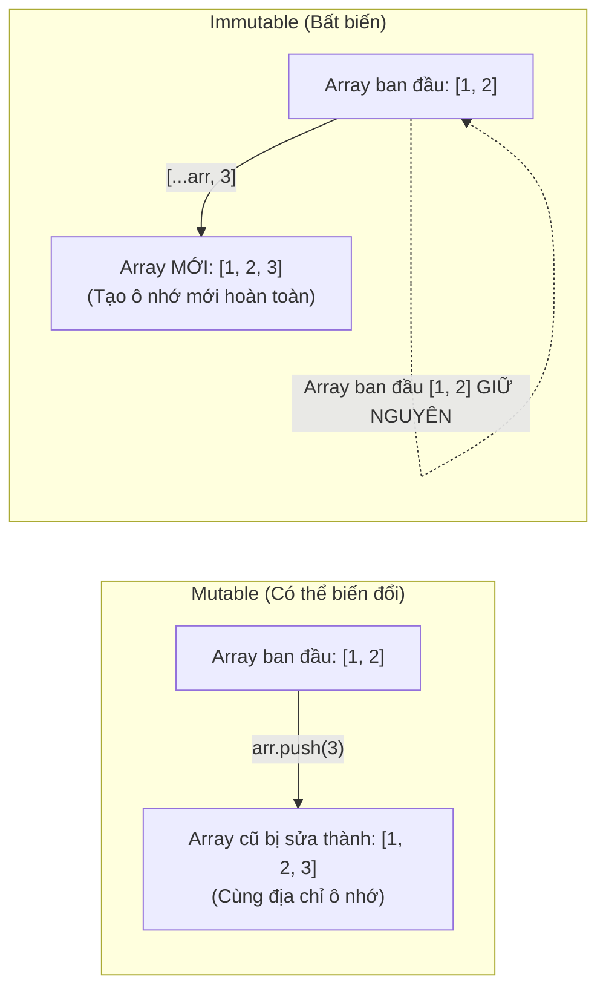

### So sánh bản chất:
- **Mutable (Biến đổi được):** Đối tượng cho phép thay đổi trạng thái hoặc thuộc tính nội bộ sau khi đã được tạo ra mà không làm đổi địa chỉ ô nhớ (`array.push()`, `obj.age = 30`).
  - *Ưu điểm:* Tiết kiệm bộ nhớ RAM vì không phải tạo mới đối tượng liên tục.
  - *Nhược điểm:* Dễ gây ra **Side Effects (Tác dụng phụ ngoài ý muốn)** khi nhiều module cùng dùng chung một đối tượng.
- **Immutable (Bất biến):** Đối tượng một khi đã khởi tạo thì **không bao giờ có thể bị sửa đổi**. Mọi thao tác cập nhật đều sinh ra một đối tượng mới chứa giá trị mới.
  - *Ưu điểm:* Đảm bảo tính an toàn trong lập trình đa luồng (Thread-safe, không bao giờ bị Race Condition), giúp code dự đoán được (Predictable), là nền tảng của Functional Programming, React State, và Redux.
  - *Nhược điểm:* Tốn thêm chi phí bộ nhớ CPU/RAM nếu tạo đối tượng mới quá nhiều (giải quyết bằng cấu trúc dữ liệu Structural Sharing như Immutable.js).

### Kỹ thuật Clone dữ liệu trong TypeScript/JavaScript:
```typescript
const original = { id: 1, info: { role: 'admin' } };

// 1. Shallow Clone (Chỉ copy tầng 1, tầng lồng nhau vẫn bị tham chiếu!)
const shallowCopy = { ...original };
shallowCopy.info.role = 'user'; 
console.log(original.info.role); // 'user' -> BỊ ẢNH HƯỞNG!

// 2. Deep Clone chuẩn mực (Node.js 17+ / Browser hiện đại)
const deepCopy = structuredClone(original);
deepCopy.info.role = 'guest';
console.log(original.info.role); // 'user' -> AN TOÀN TUYỆT ĐỐI!
```

---

# Chương 2: Cấu Trúc Dữ Liệu & Giải Thuật (DSA)

## 2.1. Big O Notation & Độ phức tạp (Complexity Analysis)

Big O Notation biểu thị **giới hạn trên (Upper Bound)** của thời gian chạy (Time Complexity) hoặc dung lượng bộ nhớ tiêu thụ (Space Complexity) khi kích thước đầu vào $N$ tiến tới vô cực.

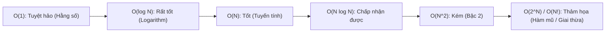

### Bảng đối chiếu các độ phức tạp kinh điển:

| Độ phức tạp | Tên gọi | Số phép tính khi $N = 1000$ | Ví dụ thuật toán thực tế |
|---|---|---|---|
| **$O(1)$** | Constant (Hằng số) | $1$ | Lấy phần tử mảng qua Index `arr[i]`, tra cứu Key trong Hash Map. |
| **$O(\log N)$** | Logarithmic | $\approx 10$ | **Binary Search (Tìm kiếm nhị phân)**, tìm kiếm trên cây AVL / Red-Black Tree. |
| **$O(N)$** | Linear (Tuyến tính) | $1,000$ | Duyệt qua 1 vòng lặp `for`, Linear Search, tìm Max/Min trong mảng chưa sort. |
| **$O(N \log N)$** | Linearithmic | $\approx 10,000$ | Các thuật toán sắp xếp tối ưu: **Merge Sort, Quick Sort (avg), TimSort**. |
| **$O(N^2)$** | Quadratic (Bậc 2) | $1,000,000$ | 2 vòng lặp lồng nhau: **Bubble Sort, Selection Sort, Insertion Sort**. |
| **$O(2^N)$** | Exponential (Hàm mũ) | $1.07 \times 10^{301}$ | Tính Fibonacci đệ quy ngây thơ, duyệt tổ hợp vét cạn (Brute-force subsets). |
| **$O(N!)$** | Factorial (Giai thừa) | Vô cùng lớn | Bài toán Người du lịch (Traveling Salesperson) duyệt hoán vị. |

---

## 2.2. Array vs Linked List

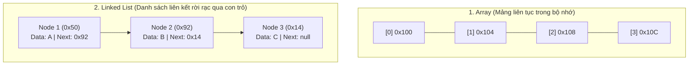

### Bảng so sánh 6 tiêu chí:

| Tiêu chí | Array (Mảng tĩnh / động) | Linked List (Singly / Doubly) |
|---|---|---|
| **Cấu trúc bộ nhớ** | Các phần tử nằm **liên tục liền kề nhau** trong RAM. | Các Node nằm **phân tán rải rác**, liên kết qua con trỏ (`next`, `prev`). |
| **Truy cập theo Index (`arr[i]`)** | **$O(1)$ (Random Access):** Tính trực tiếp `address = base + i * size`. | **$O(N)$ (Sequential Access):** Phải duyệt tuần tự từ phần tử đầu (Head). |
| **Chèn / Xóa ở đầu (Prepend / Shift)** | **$O(N)$:** Phải dịch chuyển toàn bộ $N$ phần tử còn lại sang phải 1 ô. | **$O(1)$:** Chỉ cần đổi con trỏ Head trỏ vào Node mới. |
| **Chèn / Xóa ở cuối (Append / Pop)** | **$O(1)$** (nếu mảng còn chỗ trống). | **$O(1)$** (nếu có con trỏ Tail). |
| **Tận dụng CPU Cache Locality** | **Cực tốt:** Bộ nhớ liên tục giúp CPU Prefetch nạp sẵn vào L1/L2 Cache. | **Kém:** Do các Node nằm rải rác nên thường xuyên bị CPU Cache Miss. |
| **Chi phí bộ nhớ Overhead** | Thấp (chỉ lưu dữ liệu thuần). | Cao hơn (mỗi Node phải tốn thêm $4-8\text{ bytes}$ để lưu địa chỉ con trỏ). |

---

## 2.3. Hash Table (Bảng băm)

### Bản chất hoạt động
Hash Table là cấu trúc dữ liệu ánh xạ một **Key (chuỗi/số)** sang một **Value** với tốc độ truy xuất trung bình là **$O(1)$**.
- **Hash Function (Hàm băm):** Biến đổi Key đầu vào thành một chỉ số index nguyên: $\text{Index} = \text{HashFunction}(\text{Key}) \pmod{\text{BucketSize}}$.

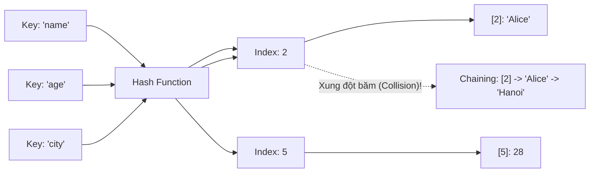

### Xử lý xung đột băm (Hash Collision):
Khi hai Key khác nhau qua hàm băm lại cho ra cùng một chỉ số Index:
1. **Separate Chaining (Tạo danh sách liên kết tại mỗi ô):** Mỗi ô của mảng chứa một Linked List (hoặc Red-Black Tree như Java 8+). Khi xung đột, gắn phần tử mới vào đuôi danh sách.
2. **Open Addressing (Linear Probing):** Nếu ô bị trùng đã có dữ liệu, tự động nhảy sang ô tiếp theo liền kề $\text{Index} + 1, \text{Index} + 2...$ cho đến khi tìm thấy ô trống.
3. **Load Factor & Rehashing:** Khi tỷ lệ $\alpha = \frac{\text{Số phần tử}}{\text{Kích thước mảng}} > 0.75$, Hash Table sẽ tự động cấp phát mảng mới gấp đôi kích thước ($2\times$) và băm lại toàn bộ dữ liệu (Rehash).

---

## 2.4. Stack & Queue

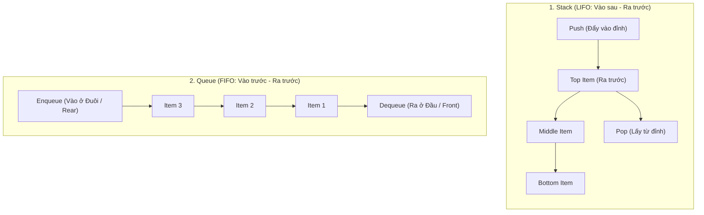

- **Stack (LIFO — Last-In, First-Out):**
  - Thao tác: `push()` ($O(1)$), `pop()` ($O(1)$), `peek()` ($O(1)$).
  - *Ứng dụng thực tế:* Call Stack trong JavaScript/V8 Engine, tính năng Undo/Redo (Ctrl+Z), kiểm tra dấu ngoặc hợp lệ `{[()]}`, thuật toán DFS (Depth-First Search).
- **Queue (FIFO — First-In, First-Out):**
  - Thao tác: `enqueue()` ($O(1)$), `dequeue()` ($O(1)$), `front()` ($O(1)$).
  - *Ứng dụng thực tế:* Message Queue (RabbitMQ, BullMQ), Printer Spooler, Event Loop Task Queue, thuật toán BFS (Breadth-First Search).

---

## 2.5. Recursion (Đệ quy)

Đệ quy là kỹ thuật một hàm **tự gọi lại chính nó** để giải quyết các bài toán con nhỏ hơn có cùng cấu trúc.

### 2 Thành phần bắt buộc của Đệ quy:
1. **Base Case (Điều kiện dừng):** Ngăn chặn đệ quy vô hạn dẫn đến tràn bộ nhớ `RangeError: Maximum call stack size exceeded` (Stack Overflow).
2. **Recursive Step (Bước đệ quy):** Thu hẹp bài toán về phía điều kiện dừng.

```typescript
// Tính giai thừa n! = n * (n - 1)!
function factorial(n: number): number {
  if (n <= 1) return 1; // Base Case
  return n * factorial(n - 1); // Recursive Step
}
```

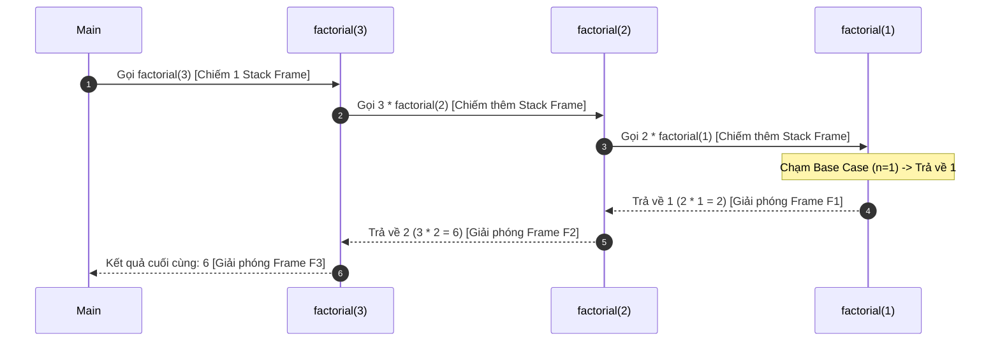

---

## 2.6. Searching Algorithms (Tìm kiếm)

### 1. Linear Search (Tìm kiếm tuyến tính)
- Duyệt qua từng phần tử từ đầu đến cuối mảng.
- **Độ phức tạp:** $O(N)$ thời gian, $O(1)$ không gian. Áp dụng cho mảng chưa sắp xếp.

### 2. Binary Search (Tìm kiếm nhị phân)
- **Điều kiện tiên quyết:** Dữ liệu **bắt buộc phải được sắp xếp trước**.
- **Ý tưởng:** So sánh phần tử cần tìm với phần tử chính giữa (Mid). Mỗi bước loại bỏ đi $50\%$ (một nửa) không gian tìm kiếm.
- **Độ phức tạp:** $O(\log N)$ thời gian (Tìm trong $1,000,000$ phần tử chỉ mất tối đa $20$ phép so sánh!).

```typescript
function binarySearch(arr: number[], target: number): number {
  let left = 0;
  let right = arr.length - 1;

  while (left <= right) {
    const mid = Math.floor(left + (right - left) / 2);

    if (arr[mid] === target) return mid; // Tìm thấy, trả về Index
    if (arr[mid] < target) {
      left = mid + 1; // Thu hẹp sang nửa bên phải
    } else {
      right = mid - 1; // Thu hẹp sang nửa bên trái
    }
  }

  return -1; // Không tìm thấy
}
```

---

## 2.7. Sorting Algorithms (Sắp xếp)

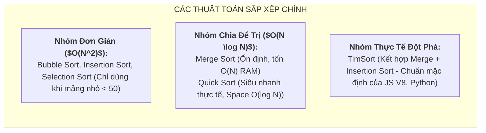

### Bảng so sánh toàn diện các thuật toán sắp xếp:

| Thuật toán | Time (Best) | Time (Average) | Time (Worst) | Space Complexity | Tính ổn định (Stable) |
|---|---|---|---|---|---|
| **Bubble Sort** | $O(N)$ | $O(N^2)$ | $O(N^2)$ | $O(1)$ | ✅ Có |
| **Insertion Sort** | $O(N)$ | $O(N^2)$ | $O(N^2)$ | $O(1)$ | ✅ Có |
| **Merge Sort** | $O(N \log N)$ | $O(N \log N)$ | $O(N \log N)$ | $O(N)$ | ✅ Có |
| **Quick Sort** | $O(N \log N)$ | $O(N \log N)$ | $O(N^2)$ | $O(\log N)$ | ❌ Không |
| **TimSort** | $O(N)$ | $O(N \log N)$ | $O(N \log N)$ | $O(N)$ | ✅ Có |

> [!NOTE]
> **Tính ổn định (Stability) trong Sorting là gì?**  
> Một thuật toán sắp xếp được gọi là **Stable (Ổn định)** nếu nó giữ nguyên thứ tự tương đối ban đầu của các phần tử có giá trị bằng nhau. (Rất quan trọng khi bạn muốn sắp xếp danh sách học sinh theo Điểm số, nhưng những học sinh bằng điểm nhau vẫn giữ nguyên thứ tự sắp xếp theo Tên trước đó).

---

## 2.8. Dynamic Programming (Quy hoạch động)

### 2 Dấu hiệu nhận biết bài toán Quy hoạch động:
1. **Overlapping Subproblems (Bài toán con trùng lặp):** Khi giải quyết bài toán lớn, bạn phải tính đi tính lại cùng một bài toán con nhiều lần (ví dụ tính $F(5)$ cần $F(4) + F(3)$, tính $F(4)$ lại cần $F(3) + F(2) \rightarrow F(3)$ bị tính lặp).
2. **Optimal Substructure (Cấu trúc con tối ưu):** Lời giải tối ưu của bài toán lớn được xây dựng trực tiếp từ lời giải tối ưu của các bài toán con.

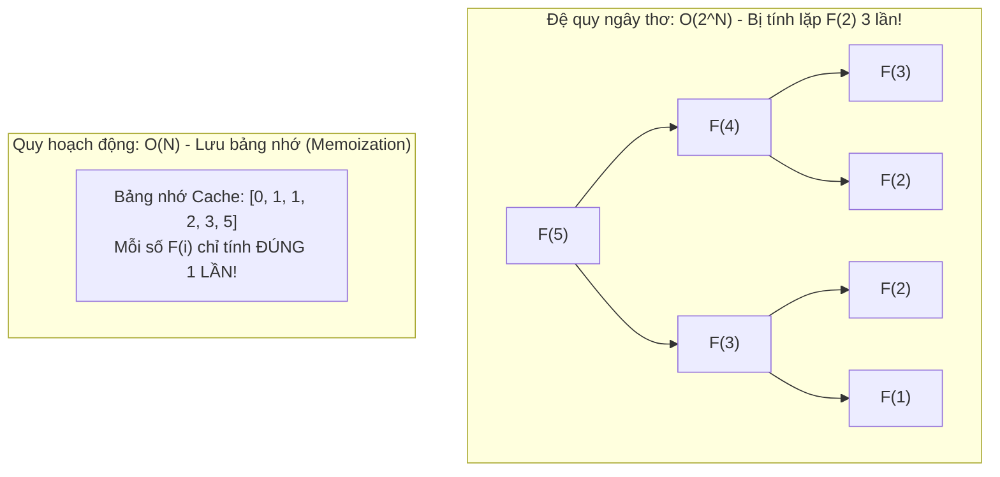

### 2 Phương pháp tiếp cận DP:
- **Top-Down (Memoization - Đệ quy có nhớ):** Đi từ bài toán lớn $F(N)$ xuống, kết hợp hàm đệ quy với một bảng Cache (Object/Map) để lưu lại kết quả đã tính.
- **Bottom-Up (Tabulation - Khử đệ quy bằng bảng lặp):** Bắt đầu tính từ các bài toán cơ sở nhỏ nhất ($F(0), F(1)$), dùng vòng lặp `for` điền dần kết quả lên đến $F(N)$ $\rightarrow$ Tiết kiệm Call Stack.

```typescript
// Bottom-Up DP giải Fibonacci với O(N) Time và O(1) Space
function fibonacciDP(n: number): number {
  if (n <= 1) return n;
  let prev2 = 0; // F(i - 2)
  let prev1 = 1; // F(i - 1)

  for (let i = 2; i <= n; i++) {
    const current = prev1 + prev2;
    prev2 = prev1;
    prev1 = current;
  }

  return prev1;
}
```

---

# Chương 3: Cơ Chế Thực Thi Chương Trình (Program Execution)

## 3.1. Compile vs Interpret

Mọi mã nguồn cấp cao (C++, Java, TypeScript, Python) đều phải được chuyển đổi thành **Mã máy nhị phân (Machine Code: 0 và 1)** để CPU có thể hiểu và thực thi.

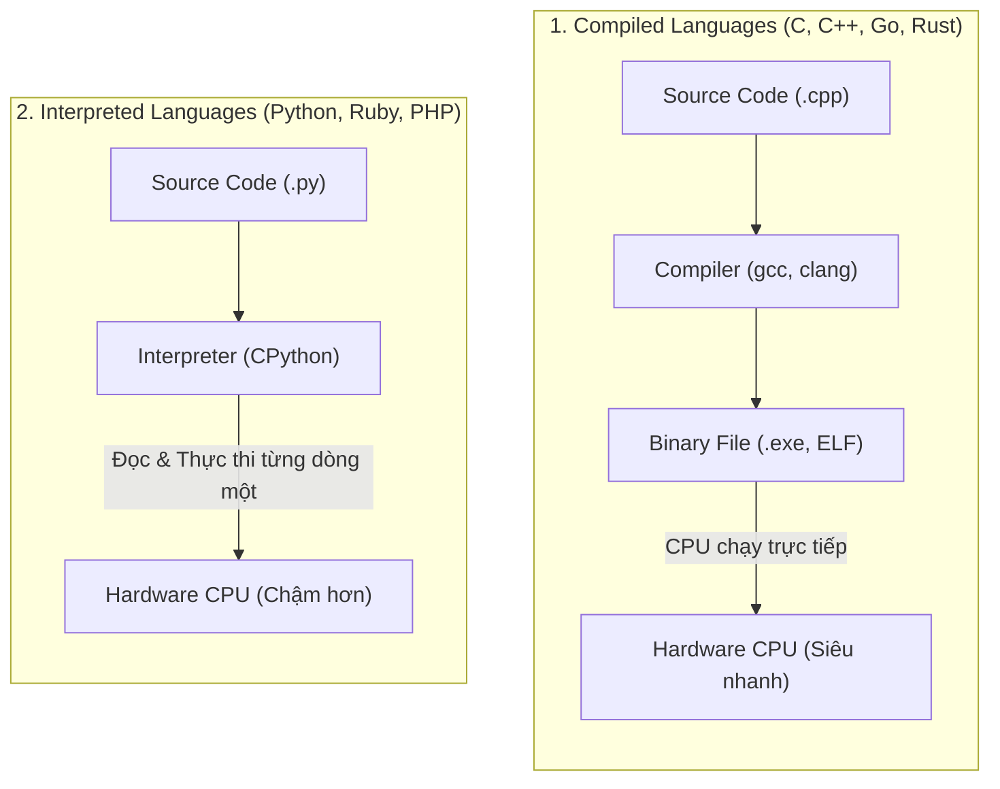

### Bảng so sánh 6 tiêu chí:

| Tiêu chí | Ngôn ngữ Biên dịch (Compiled) | Ngôn ngữ Thông dịch (Interpreted) |
|---|---|---|
| **Thời điểm dịch** | Biên dịch **toàn bộ 1 lần duy nhất** trước khi chạy (Build time). | Dịch và thực thi **từng dòng mã tại thời điểm chạy (Runtime)**. |
| **Tốc độ thực thi** | **Cực nhanh** (gần sát giới hạn phần cứng máy tính). | **Chậm hơn** từ 5 đến 20 lần do phải thông qua tầng trung gian Interpreter. |
| **Phát hiện lỗi (Error Detection)** | Phát hiện lỗi cú pháp, kiểu dữ liệu ngay lúc Compile. | Chỉ phát hiện lỗi khi luồng code chạy tới dòng bị lỗi. |
| **Tính độc lập nền tảng (Portability)** | File binary chỉ chạy được trên đúng hệ điều hành/kiến trúc CPU đã build (Windows x64 $\neq$ Linux ARM). | **Rất cao**: Cùng 1 file script `.py` có thể chạy trên mọi OS có cài Interpreter. |
| **Ví dụ ngôn ngữ** | C, C++, Rust, Go, Swift, Assembly. | Python, Ruby, PHP, Bash. |

---

## 3.2. Mô hình lai JIT (Just-In-Time) Compilation

Các ngôn ngữ hiện đại như **JavaScript (V8 Engine trong Chrome/Node.js)** và **Java (JVM)** sử dụng cơ chế lai kết hợp cả hai:

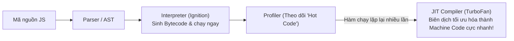

1. Ban đầu, **Interpreter (Ignition)** chuyển mã nguồn thành Bytecode để ứng dụng khởi động ngay lập tức (không phải chờ compile lâu).
2. Khi chương trình chạy, **Profiler** quan sát các đoạn code được gọi nhiều lần (**"Hot Functions"**).
3. **JIT Compiler (TurboFan)** sẽ lấy đoạn code nóng đó biên dịch trực tiếp sang Machine Code tối ưu hóa $\rightarrow$ Mang lại tốc độ gần ngang ngửa ngôn ngữ Compiled thuần túy.

---

# Chương 4: Concurrency & Parallelism (Xử Lý Đồng Thời & Song Song)

## 4.1. Process (Tiến trình) vs Thread (Luồng)

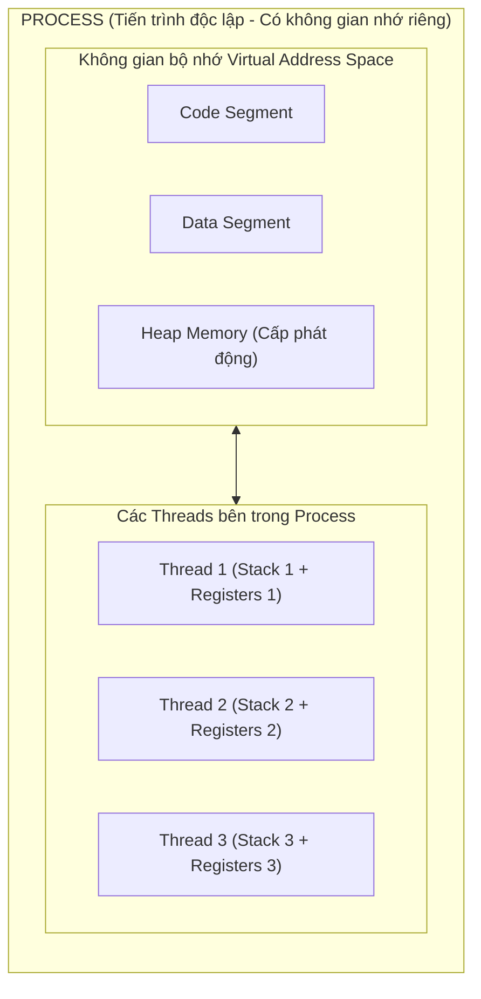

### So sánh chi tiết:
- **Process (Tiến trình):** Là một chương trình đang được hệ điều hành (OS) cấp phát tài nguyên và thực thi. Mỗi Process có một **không gian bộ nhớ ảo (Virtual Address Space) độc lập hoàn toàn** (Bao gồm Code, Data, Heap, Stack). Nếu một Process bị crash, các Process khác không bị ảnh hưởng.
- **Thread (Luồng):** Là đơn vị thực thi nhỏ nhất bên trong một Process. Tất cả các Thread trong cùng một Process **dùng chung không gian bộ nhớ Heap và Data**, nhưng mỗi Thread sở hữu một **Call Stack và thanh ghi CPU (Registers) riêng biệt**.

---

## 4.2. Multithreading vs Multiprocessing

| Tiêu chí | Multithreading (Đa luồng) | Multiprocessing (Đa tiến trình) |
|---|---|---|
| **Bộ nhớ (Memory)** | Các luồng **chia sẻ chung bộ nhớ Heap** của tiến trình mẹ. | Mỗi tiến trình có **vùng nhớ riêng biệt hoàn toàn**. |
| **Giao tiếp dữ liệu (IPC)** | Rất nhanh và dễ dàng (đọc/ghi chung biến toàn cục). | Phức tạp hơn (Phải dùng IPC: Sockets, Pipes, Message Queue, Shared Memory). |
| **Chi phí tạo mới & Chuyển ngữ cảnh (Context Switching)** | **Nhẹ và nhanh** (Lightweight). | **Nặng và tốn kém tài nguyên** (Heavyweight). |
| **Tính an toàn & Cô lập lỗi** | Kém: Một luồng bị lỗi (Segfault / Panic) có thể **làm sập toàn bộ Process**. | Tốt: Một tiến trình chết **không ảnh hưởng** đến các tiến trình khác. |
| **Nguy cơ lỗi đồng bộ** | Dễ dính **Race Condition, Deadlock** (Cần dùng Mutex/Semaphore). | Không bị tranh chấp bộ nhớ trực tiếp. |
| **Phù hợp nhất cho** | Các tác vụ **I/O-bound** (Đọc ghi file, gọi mạng API, Web server). | Các tác vụ **CPU-bound** (Xử lý ảnh/video, tính toán AI, Machine Learning, mã hóa dữ liệu). |

---

## 4.3. Concurrency vs Parallelism

> *"Concurrency is about dealing with lots of things at once. Parallelism is about doing lots of things at once."* — Rob Pike (Tác giả ngôn ngữ Go)

```mermaid
flowchart TD
    subgraph CONCURRENCY["1. Concurrency (Đồng thời - 1 Nhân CPU / 1 Core)"]
        direction LR
        CPU1["1 CPU Core"]
        CPU1 -->|"0-10ms: Làm việc A"| A1["Task A"]
        CPU1 -->|"10-20ms: Chuyển sang việc B"| B1["Task B"]
        CPU1 -->|"20-30ms: Quay lại làm tiếp A"| A2["Task A"]
        Note over CPU1,A2: Chuyển đổi ngữ cảnh cực nhanh (Time-slicing / Event Loop) tạo cảm giác làm cùng lúc!
    end

    subgraph PARALLELISM["2. Parallelism (Song song - Đa nhân CPU / Multi-Core)"]
        direction LR
        Core1["CPU Core 1"] ==>|"Cùng một thời điểm chính xác"| T_A["Task A đang chạy"]
        Core2["CPU Core 2"] ==>|"Cùng một thời điểm chính xác"| T_B["Task B đang chạy"]
        Note over Core1,T_B: Hai tác vụ thực sự được thực thi vật lý song song tại cùng 1 tích tắc!
    end
```

### Ví dụ minh họa thực tế dễ hiểu:
- **Concurrency (Đồng thời):** Bạn đang vừa ăn cơm vừa nhắn tin cho bạn bè. Bạn cắn một miếng cơm (Task 1), trong lúc nhai bạn dừng tay gõ một dòng tin nhắn (Task 2), sau đó lại ăn tiếp. Bạn chỉ có 1 cái miệng và 1 bộ não (1 Core), nhưng bạn chuyển đổi giữa 2 việc khéo léo.
- **Parallelism (Song song):** Bạn và bạn của bạn ngồi cạnh nhau. Bạn ăn phần cơm của bạn, bạn kia gõ tin nhắn của bạn kia. Hai hành động diễn ra **hoàn toàn đồng thời tại cùng một tích tắc đồng hồ** trên 2 cơ thể độc lập (2 Cores).

### Mô hình Concurrency của Node.js:
Node.js sử dụng mô hình **Single-threaded Event Loop kết hợp Non-blocking I/O**:
- Mã JavaScript nghiệp vụ chạy trên **1 luồng duy nhất (Single Thread - Concurrency)**.
- Các tác vụ I/O nặng (Đọc file, mã hóa Crypto, Query DB) được đẩy xuống tầng **Libuv Thread Pool (gồm 4-128 worker threads chạy Parallelism thực sự)** bên dưới $\rightarrow$ Giúp Node.js chịu tải hàng chục nghìn kết nối đồng thời với mức tiêu tốn RAM cực thấp.

---

# Chương 5: Thiết Kế API (API Design)

## 5.1. API là gì?

**API (Application Programming Interface)** là một tập hợp các quy tắc cho phép hai phần mềm giao tiếp với nhau. Bản chất của API là một **hợp đồng (contract)**: nó định nghĩa rõ ràng "gửi gì thì sẽ nhận lại gì", để bên gọi (client) không cần biết bất kỳ chi tiết nào về cách bên cung cấp (server) triển khai bên trong.

## 5.2. RESTful API

**Bản chất**: REST (Representational State Transfer) không phải là một giao thức hay một chuẩn kỹ thuật bắt buộc, mà là một **tập hợp các nguyên tắc thiết kế** giúp API trở nên nhất quán, dễ đoán và dễ mở rộng. Nguyên tắc cốt lõi của REST là xem mọi thứ trong hệ thống như một **tài nguyên (resource)** — một người dùng, một đơn hàng, một sản phẩm — và dùng các HTTP Method để thể hiện **hành động** muốn thực hiện trên tài nguyên đó.

| Hành động | HTTP Method + Endpoint |
|---|---|
| Lấy danh sách đơn hàng | `GET /orders` |
| Lấy một đơn hàng cụ thể | `GET /orders/123` |
| Tạo đơn hàng mới | `POST /orders` |
| Cập nhật toàn bộ đơn hàng | `PUT /orders/123` |
| Cập nhật một phần đơn hàng | `PATCH /orders/123` |
| Xóa đơn hàng | `DELETE /orders/123` |

**Điểm cốt lõi dễ bị hiểu sai**: REST không quy định "phải dùng đúng 5 method này cho mọi trường hợp" — nó quy định rằng **URL nên đại diện cho một tài nguyên (danh từ)**, còn **HTTP Method mới là nơi thể hiện hành động (động từ)**. Đây là lý do thiết kế `POST /orders/123/cancel` được xem là kém RESTful hơn so với việc coi "trạng thái hủy" như một thuộc tính có thể cập nhật qua `PATCH /orders/123`.

## 5.3. Resource Naming

**Bản chất**: cách đặt tên endpoint không chỉ là vấn đề thẩm mỹ — nó phản ánh **mô hình dữ liệu** mà API đang phơi bày ra bên ngoài. Một số quy ước phổ biến:

- Dùng **danh từ số nhiều**: `/users` thay vì `/user` hay `/getUsers`.
- Thể hiện quan hệ phân cấp qua URL: `/users/123/orders` (đơn hàng thuộc về người dùng 123).
- Không nhúng động từ vào URL (`/getUsers`, `/deleteUser`) — vì hành động đã được thể hiện qua HTTP Method rồi, nhúng thêm động từ vào URL là dư thừa và mâu thuẫn với chính nguyên tắc REST.

## 5.4. API Versioning

**Bản chất**: một khi API đã được các client (frontend, đối tác bên ngoài, ứng dụng di động đã phát hành) sử dụng, **bất kỳ thay đổi nào phá vỡ cấu trúc cũ (breaking change)** đều có thể làm sập các hệ thống đang phụ thuộc vào nó mà backend không hề hay biết. API Versioning là cơ chế cho phép **giới thiệu thay đổi mới song song với việc vẫn duy trì phiên bản cũ** cho đến khi mọi client đã chuyển sang phiên bản mới.

```
GET /v1/users     ← phiên bản cũ, vẫn hoạt động cho client chưa nâng cấp
GET /v2/users     ← phiên bản mới, có thay đổi cấu trúc dữ liệu
```

Ngoài versioning qua URL (phổ biến nhất vì dễ nhìn thấy, dễ debug), một số hệ thống dùng versioning qua HTTP Header — về bản chất mục tiêu vẫn giống nhau: tách biệt rõ ràng giữa các phiên bản hợp đồng API.

## 5.5. Idempotent Method

Ở góc độ thiết kế API, cần nhấn mạnh: việc một HTTP Method có idempotent theo đúng chuẩn hay không **là một cam kết thiết kế**, không phải điều tự động đúng chỉ vì chọn đúng method. Ví dụ `PUT` được xem là idempotent theo chuẩn REST, nhưng nếu lập trình viên triển khai sai (ví dụ để `PUT` vô tình tạo thêm bản ghi mới mỗi lần gọi), API đó vi phạm chính hợp đồng mà bản thân HTTP Method đã ngầm cam kết với người dùng API.

## 5.6. Stateless

**Bản chất**: mỗi request gửi đến API RESTful phải chứa **đầy đủ mọi thông tin cần thiết** để server xử lý nó, mà không phụ thuộc vào bất kỳ thông tin nào được lưu lại từ các request trước đó của cùng client. Server không "nhớ" trạng thái hội thoại giữa các request.

**Vì sao Stateless lại là một nguyên tắc thiết kế quan trọng, không chỉ là đặc điểm kỹ thuật của HTTP?** Vì nó là điều kiện tiên quyết cho khả năng **mở rộng theo chiều ngang (Horizontal Scaling)**: nếu server không lưu trạng thái riêng theo từng client, thì **bất kỳ instance nào trong cụm server cũng có thể xử lý bất kỳ request nào**, không cần điều hướng client luôn đến đúng một server cố định. Đây chính là lý do JWT — cơ chế xác thực không lưu trạng thái ở server — phù hợp tự nhiên với các hệ thống backend hiện đại cần mở rộng quy mô.

---

# Chương 6: Kiến Trúc Tổ Chức Mã Nguồn Backend (Backend Architecture)

## 6.1. Bản chất chung

Khi một ứng dụng backend còn nhỏ, việc tổ chức code như thế nào dường như không quan trọng — mọi cách viết đều "chạy được". Nhưng khi ứng dụng lớn dần, số lượng tính năng và số người tham gia phát triển tăng lên, **thiếu một kiến trúc rõ ràng sẽ khiến code trở thành một khối logic đan xen chằng chịt**, mọi thay đổi nhỏ đều có nguy cơ ảnh hưởng đến những phần không liên quan. Các mô hình kiến trúc dưới đây đều nhằm giải quyết cùng một vấn đề gốc: **phân chia trách nhiệm rõ ràng giữa các phần của hệ thống**.

## 6.2. MVC (Model - View - Controller)

**Bản chất**: MVC tách ứng dụng thành ba mối quan tâm độc lập:

- **Model**: đại diện cho dữ liệu và logic nghiệp vụ liên quan đến dữ liệu đó.
- **View**: phần hiển thị dữ liệu cho người dùng (trong bối cảnh API backend thuần túy, "View" thường chính là cấu trúc JSON được trả về).
- **Controller**: tiếp nhận yêu cầu, điều phối giữa Model và View.

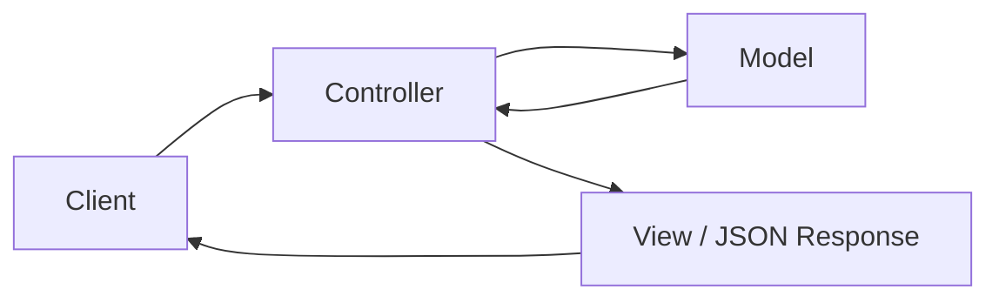

MVC là kiến trúc nền tảng lâu đời nhất, và là gốc rễ tư duy cho các mô hình phức tạp hơn bên dưới — Controller trong các framework backend hiện đại chính là sự kế thừa trực tiếp khái niệm này.

## 6.3. Thin Controller - Fat Service

**Bản chất**: đây không phải một kiến trúc riêng biệt, mà là một **nguyên tắc thực hành** khắc phục một sai lầm phổ biến khi áp dụng MVC vào backend hiện đại: nhét toàn bộ logic nghiệp vụ trực tiếp vào Controller.

Vấn đề khi Controller "béo" (Fat Controller): logic nghiệp vụ bị **trộn lẫn** với logic xử lý HTTP (đọc request, trả response), khiến logic đó **không thể tái sử dụng** ở nơi khác (ví dụ khi cần gọi cùng logic đó từ một Cron Job thay vì từ một HTTP request) và **khó viết Unit Test** (vì phải giả lập toàn bộ request/response chỉ để test một đoạn logic thuần túy).

Nguyên tắc **Thin Controller - Fat Service**: Controller chỉ nên làm ba việc — nhận dữ liệu đầu vào, gọi đến Service tương ứng, trả kết quả về. Toàn bộ logic nghiệp vụ thực sự được đặt trong Service — nơi hoàn toàn độc lập với khái niệm HTTP, có thể được gọi từ bất kỳ đâu (Controller, Cron Job, Queue Worker) và dễ dàng test độc lập.

```ts
// Controller "béo" — sai
@Post()
async create(@Body() dto: CreateOrderDto) {
  const product = await this.productRepo.findOne(dto.productId);
  if (product.stock < dto.quantity) throw new BadRequestException('...');
  // ... hàng chục dòng logic nghiệp vụ khác ngay trong Controller
}

// Thin Controller - Fat Service — đúng
@Post()
create(@Body() dto: CreateOrderDto) {
  return this.orderService.create(dto); // Controller chỉ điều phối
}
```

## 6.4. Repository Pattern

Trong bối cảnh kiến trúc tổng thể, Repository Pattern là **tầng nằm giữa Service và Database**, hoàn thiện mô hình phân lớp: Controller → Service → Repository → Database. Tách biệt hoàn toàn việc truy cập dữ liệu ra khỏi logic nghiệp vụ của Service.

## 6.5. Layered Architecture

**Bản chất**: Layered Architecture (kiến trúc phân tầng) là sự khái quát hóa của những gì đã trình bày ở trên thành một nguyên tắc tổng quát: chia hệ thống thành các **tầng xếp chồng lên nhau theo thứ tự phụ thuộc một chiều** — mỗi tầng chỉ được phép gọi xuống tầng ngay bên dưới nó, không được phép "nhảy cóc" hay gọi ngược lên tầng trên.

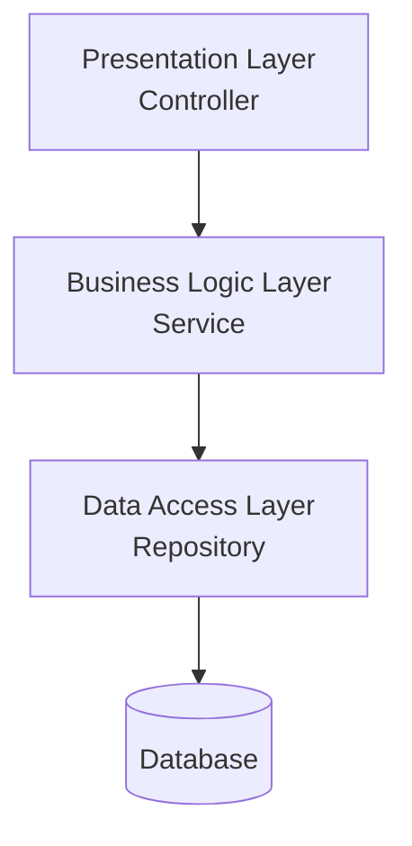

**Lợi ích cốt lõi**: mỗi tầng chỉ cần quan tâm đến tầng liền kề, không cần biết chi tiết của các tầng xa hơn — Controller không cần biết Repository dùng Prisma hay TypeORM, chỉ cần biết Service cung cấp những gì. Đây chính là ứng dụng trực tiếp của nguyên tắc **Dependency Inversion** ở cấp độ toàn hệ thống.

## 6.6. Clean Architecture

**Bản chất**: Layered Architecture giải quyết vấn đề tổ chức, nhưng vẫn tồn tại một điểm yếu: theo mô hình trên, tầng Business Logic (Service) **vẫn phụ thuộc trực tiếp** vào tầng Data Access bên dưới nó — nếu công nghệ database thay đổi hoàn toàn, logic nghiệp vụ cốt lõi vẫn có nguy cơ bị ảnh hưởng.

**Clean Architecture** đẩy nguyên tắc Dependency Inversion đi xa hơn: đặt **logic nghiệp vụ (domain) làm trung tâm**, hoàn toàn không phụ thuộc vào bất kỳ chi tiết kỹ thuật nào (database, framework, giao thức HTTP). Mọi thành phần kỹ thuật cụ thể (database, web framework) đều nằm ở **vòng ngoài**, và phụ thuộc *vào trong* — hướng vào domain — chứ không phải chiều ngược lại.

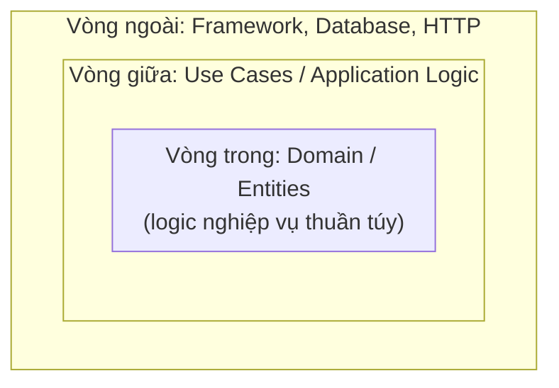

**Điểm khác biệt bản chất so với Layered Architecture thông thường**: ở Layered Architecture, mũi tên phụ thuộc đi từ trên xuống dưới (Controller → Service → Repository → Database) — nghĩa là Service vẫn "biết" đến khái niệm Repository/Database. Ở Clean Architecture, phần domain (logic nghiệp vụ) hoàn toàn **không biết gì** về database hay framework đang được sử dụng; thay vào đó, tầng ngoài phải tuân theo interface do tầng trong định nghĩa (Dependency Inversion Principle được áp dụng triệt để).

**Đánh đổi**: Clean Architecture mang lại khả năng thay đổi công nghệ (database, framework) mà gần như không ảnh hưởng đến logic nghiệp vụ cốt lõi, nhưng đòi hỏi nhiều lớp trừu tượng hơn — phù hợp với hệ thống lớn, phức tạp, có vòng đời dài; với dự án nhỏ hoặc giai đoạn đầu (MVP), mức độ trừu tượng này có thể là sự phức tạp không cần thiết.

## 6.7. So sánh các mô hình kiến trúc

| Kiến trúc | Mức độ tách biệt logic nghiệp vụ khỏi chi tiết kỹ thuật | Độ phức tạp | Phù hợp với |
|---|---|---|---|
| **MVC thuần** | Thấp | Thấp | Ứng dụng nhỏ, đơn giản |
| **Thin Controller - Fat Service** | Trung bình | Thấp - Trung bình | Hầu hết ứng dụng backend thực tế |
| **Layered Architecture** | Trung bình - Cao | Trung bình | Hệ thống có quy mô vừa và lớn |
| **Clean Architecture** | Rất cao | Cao | Hệ thống lớn, phức tạp, cần khả năng thay đổi công nghệ lâu dài |

---

# Bảng Tổng Kết Trọng Tâm

| Khái niệm | Định nghĩa 1 câu | Ứng dụng / Tác động thực tế |
|---|---|---|
| **Pass by Value / Ref** | Kiểu nguyên thủy copy giá trị (Value); Kiểu phức hợp truyền địa chỉ ô nhớ (Reference). | Tránh lỗi vô tình sửa đổi dữ liệu gốc khi truyền Object vào hàm. |
| **Mutable vs Immutable** | Mutable cho phép sửa trạng thái cũ; Immutable bắt buộc tạo đối tượng mới. | Nền tảng an toàn cho đa luồng, Redux/React State và Clean Architecture. |
| **Big O Notation** | Thước đo giới hạn thời gian/bộ nhớ thuật toán khi $N$ tăng lên vô cực. | Phân tích và ngăn chặn các thuật toán $O(N^2), O(2^N)$ gây sập server khi dữ liệu lớn. |
| **Hash Table** | Ánh xạ Key $\rightarrow$ Index mảng qua hàm băm để tra cứu trung bình $O(1)$. | Cấu trúc dữ liệu nền tảng của Redis, Database Indexing, Cache lookup. |
| **Binary Search** | Chia đôi không gian tìm kiếm trên mảng đã sort để đạt độ phức tạp $O(\log N)$. | Nền tảng của thuật toán tìm kiếm trên B-Tree trong PostgreSQL/MySQL. |
| **Compiled vs Interpreted** | Compiled dịch 1 lần ra mã máy (nhanh); Interpreted dịch từng dòng lúc chạy (linh hoạt). | Hiểu vì sao Go/Rust chạy nhanh hơn Python/Ruby và cách JIT Engine tối ưu Node.js. |
| **Process vs Thread** | Process có vùng nhớ riêng biệt; Thread chia sẻ chung vùng nhớ Heap của Process. | Lựa chọn kiến trúc Worker Thread vs Cluster Module khi tối ưu Backend. |
| **Concurrency vs Parallelism** | Concurrency là cấu trúc xử lý nhiều việc; Parallelism là thực thi vật lý nhiều việc cùng lúc. | Tận dụng tối đa sức mạnh phần cứng Multi-core CPU và mô hình Event Loop. |
| **RESTful API** | Nguyên tắc thiết kế coi dữ liệu là tài nguyên (Resource), dùng HTTP Method làm hành động. | Xây dựng API nhất quán, dễ mở rộng, tách biệt rõ giữa client và server. |
| **Clean Architecture** | Đặt logic nghiệp vụ ở trung tâm, đảo ngược phụ thuộc để độc lập framework/database. | Giúp hệ thống lớn dễ bảo trì, thay đổi công nghệ không phá vỡ nghiệp vụ. |

