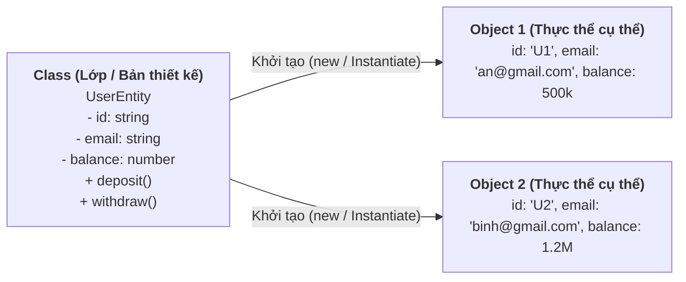
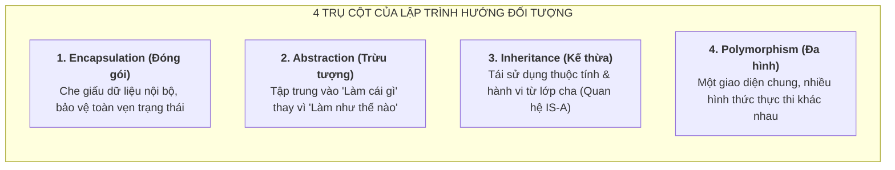
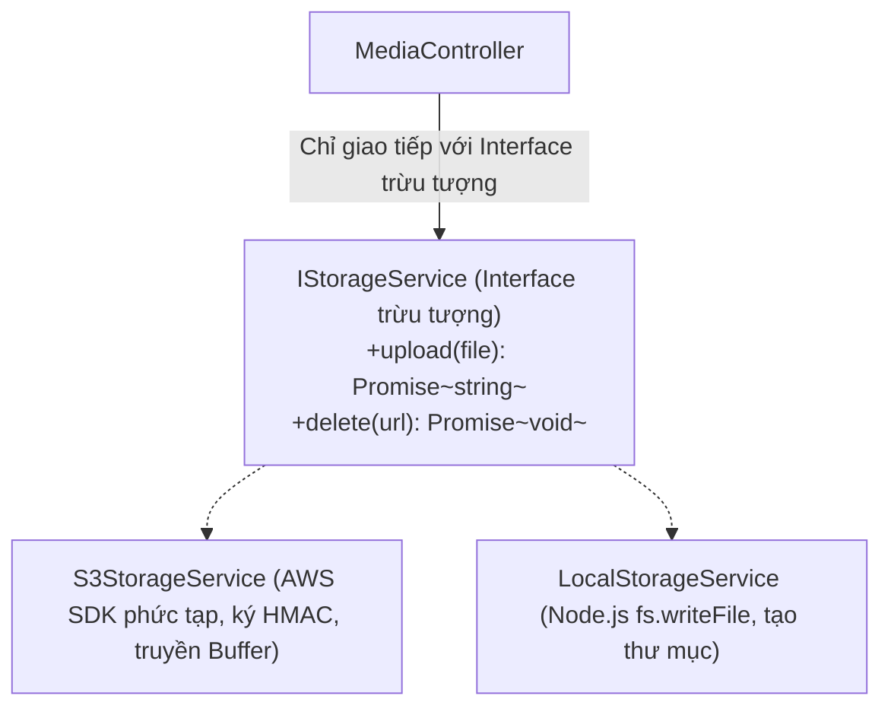
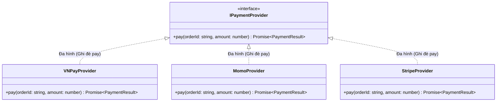
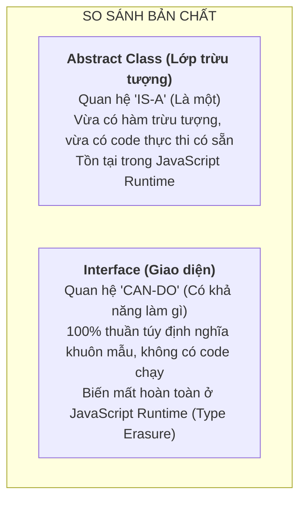
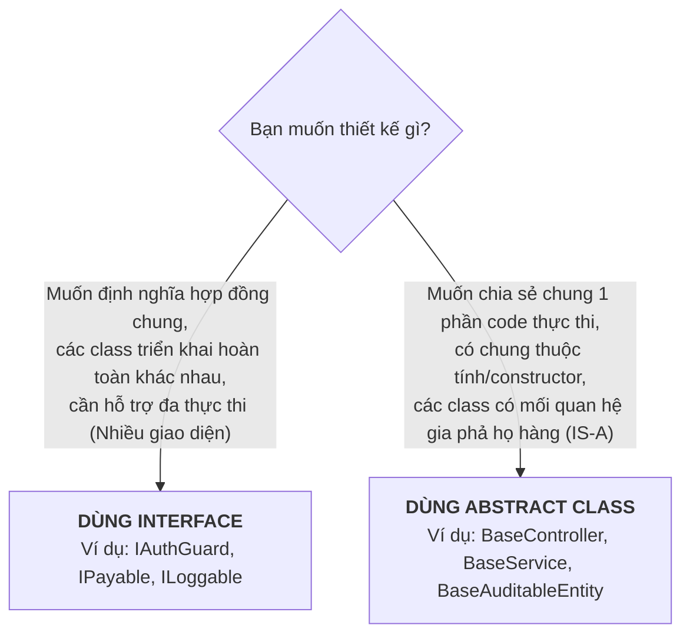
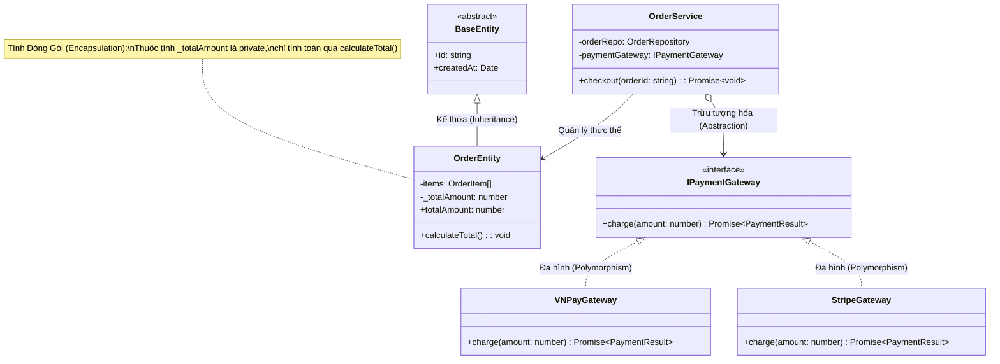

# HƯỚNG DẪN CHUYÊN SÂU VỀ OOP VÀ 4 TÍNH CHẤT TRONG PHÁT TRIỂN BACKEND

## Lời mở đầu

**Lập trình hướng đối tượng (Object-Oriented Programming — OOP)** là phương pháp lập trình lấy **đối tượng (Object)** làm trung tâm để mô hình hóa các thực thể và quy trình nghiệp vụ trong thế giới thực. Một hệ thống backend hiện đại (viết bằng TypeScript/NestJS, Java/Spring Boot hay C#/.NET) không chỉ đơn thuần là tập hợp các hàm xử lý dữ liệu (Procedural Programming), mà là sự phối hợp nhịp nhàng giữa các đối tượng có trạng thái (State/Properties) và hành vi (Behavior/Methods) rõ ràng.

Tài liệu này cung cấp phân tích chuyên sâu về **4 tính chất cốt lõi của OOP**, đi kèm **mã nguồn thực tế trong framework NestJS**, cùng phần so sánh chi tiết và bài toán đánh đổi giữa **Abstract Class** và **Interface**.

---

## Mục lục

- [Tổng quan về OOP: Class và Object](#tổng-quan-về-oop-class-và-object)
- [Phần I: 4 Tính Chất Cốt Lõi Của OOP](#phần-i-4-tính-chất-cốt-lõi-của-oop)
  - [1. Encapsulation (Tính đóng gói)](#1-encapsulation-tính-đóng-gói)
  - [2. Abstraction (Tính trừu tượng)](#2-abstraction-tính-trừu-tượng)
  - [3. Inheritance (Tính kế thừa)](#3-inheritance-tính-kế-thừa)
  - [4. Polymorphism (Tính đa hình)](#4-polymorphism-tính-đa-hình)
- [Phần II: So Sánh Chi Tiết: Abstract Class vs Interface](#phần-ii-so-sánh-chi-tiết-abstract-class-vs-interface)
  - [1. Bảng so sánh 10 tiêu chí kỹ thuật](#1-bảng-so-sánh-10-tiêu-chí-kỹ-thuật)
  - [2. Vấn đề Type Erasure trong TypeScript & Dependency Injection của NestJS](#2-vấn-đề-type-erasure-trong-typescript--dependency-injection-của-nestjs)
  - [3. Khi nào nên dùng Abstract Class vs Interface?](#3-khi-nào-nên-dùng-abstract-class-vs-interface)
- [Phần III: Sơ Đồ Tổng Hợp Kiến Trúc OOP Thực Chiến](#phần-iii-sơ-đồ-tổng-hợp-kiến-trúc-oop-thực-chiến)

---

# Tổng quan về OOP: Class và Object



- **Class (Lớp):** Là bản thiết kế (blueprint) định nghĩa tập hợp các thuộc tính (dữ liệu) và phương thức (hành vi) mà các đối tượng thuộc lớp đó sẽ sở hữu.
- **Object (Đối tượng / Instance):** Là một thực thể cụ thể được sinh ra trong bộ nhớ từ bản thiết kế Class, có dữ liệu trạng thái riêng biệt.

---

# Phần I: 4 Tính Chất Cốt Lõi Của OOP



---

## 1. Encapsulation (Tính đóng gói)

### 1.1. Bản chất
**Tính đóng gói** là cơ chế gộp chung dữ liệu (thuộc tính) và các phương thức thao tác trên dữ liệu đó vào trong một đơn vị duy nhất (Class), đồng thời **ngăn chặn việc truy cập hoặc chỉnh sửa trực tiếp dữ liệu từ bên ngoài**.

Mục tiêu cốt lõi của đóng gói là bảo vệ **Tính toàn vẹn của dữ liệu (Invariants)**: Không cho phép client gán bừa bãi dữ liệu không hợp lệ vào đối tượng. Việc truy cập và sửa đổi bắt buộc phải thông qua các phương thức công khai (`public methods`) có chứa logic kiểm tra nghiệp vụ.

Trong TypeScript/NestJS, tính đóng gói được kiểm soát qua các **Access Modifiers (Từ khóa chỉ định phạm vi truy cập)**:
- `private`: Chỉ có thể truy cập bên trong chính class đó.
- `protected`: Có thể truy cập bên trong class đó và các class con kế thừa nó.
- `public` *(mặc định)*: Có thể truy cập ở bất kỳ đâu.
- `readonly`: Chỉ được gán giá trị khi khai báo hoặc trong hàm khởi tạo (`constructor`), sau đó không thể thay đổi.

### 1.2. Ví dụ NestJS thực tế: Quản lý Số dư Tài khoản Ngân hàng

#### ❌ KHÔNG CÓ ĐÓNG GÓI (Anti-pattern: Public State)
```typescript
// KHÔNG AN TOÀN: Bất kỳ ai cũng có thể sửa số dư trực tiếp!
export class BadBankAccount {
  public accountNumber: string;
  public balance: number; // Mọi service bên ngoài có thể tự do gán account.balance = -99999999
}

// Tại một Service nào đó:
const account = new BadBankAccount();
account.balance = -500000; // Dữ liệu bị hỏng hoàn toàn mà không có ai kiểm tra!
```

#### ✅ ÁP DỤNG ĐÓNG GÓI CHUẨN MỰC (Domain Entity trong NestJS)
```typescript
export class BankAccount {
  private readonly _accountNumber: string;
  private _balance: number; // Thuộc tính được bảo vệ (private)

  constructor(accountNumber: string, initialBalance: number = 0) {
    if (initialBalance < 0) {
      throw new BadRequestException('Số dư ban đầu không được âm');
    }
    this._accountNumber = accountNumber;
    this._balance = initialBalance;
  }

  // Getter: Chỉ cho phép đọc số dư, không cho phép gán trực tiếp
  public get balance(): number {
    return this._balance;
  }

  public get accountNumber(): string {
    return this._accountNumber;
  }

  // Nghiệp vụ Nạp tiền: Có kiểm tra hợp lệ
  public deposit(amount: number): void {
    if (amount <= 0) {
      throw new BadRequestException('Số tiền nạp phải lớn hơn 0');
    }
    this._balance += amount;
  }

  // Nghiệp vụ Rút tiền: Kiểm tra số dư khả dụng
  public withdraw(amount: number): void {
    if (amount <= 0) {
      throw new BadRequestException('Số tiền rút phải lớn hơn 0');
    }
    if (this._balance < amount) {
      throw new BadRequestException('Số dư tài khoản không đủ để thực hiện giao dịch');
    }
    this._balance -= amount;
  }
}
```

---

## 2. Abstraction (Tính trừu tượng)

### 2.1. Bản chất
**Tính trừu tượng** là việc ẩn đi các chi tiết cài đặt kỹ thuật phức tạp bên dưới và chỉ hiển thị ra ngoài những giao diện tính năng thiết yếu cho người sử dụng. Nó trả lời câu hỏi **"Đối tượng này làm được gì?" (What it does)** thay vì "Nó làm điều đó bằng cách nào?" (How it works).

*Ví dụ thực tế:* Khi bạn lái xe ô tô, bạn chỉ cần tương tác với vô lăng, bàn đạp ga và phanh (Giao diện trừu tượng). Bạn không cần phải hiểu chi tiết piston đánh lửa thế nào, van xả áp hoạt động ra sao (Chi tiết cài đặt bị ẩn đi).

### 2.2. Ví dụ NestJS thực tế: Tầng Lưu Trữ File (Storage Service)

Người dùng chỉ cần biết hành động "Lưu file" và "Xóa file", không cần quan tâm file đang được lưu trên ổ đĩa máy chủ nội bộ (Local Disk) hay trên đám mây (AWS S3, Google Cloud Storage).



```typescript
// 1. Interface trừu tượng: Định nghĩa các hành vi cốt lõi
export interface IStorageService {
  uploadFile(fileBuffer: Buffer, fileName: string): Promise<string>;
  deleteFile(fileUrl: string): Promise<void>;
}

// 2. Hiện thực chi tiết trên AWS S3
@Injectable()
export class S3StorageService implements IStorageService {
  async uploadFile(fileBuffer: Buffer, fileName: string): Promise<string> {
    // Chi tiết phức tạp: Kết nối AWS SDK, mã hóa checksum, gửi multipart stream...
    console.log(`[AWS S3] Đang tải file ${fileName} lên bucket S3...`);
    return `https://s3.amazonaws.com/my-bucket/${fileName}`;
  }

  async deleteFile(fileUrl: string): Promise<void> {
    console.log(`[AWS S3] Đang xóa file ${fileUrl}`);
  }
}

// 3. Controller sử dụng giao diện trừu tượng mà không bị dính chặt vào AWS S3
@Controller('media')
export class MediaController {
  constructor(
    @Inject('IStorageService') private readonly storageService: IStorageService,
  ) {}

  @Post('upload')
  async upload(@UploadedFile() file: Express.Multer.File) {
    // Controller chỉ biết gọi uploadFile, hoàn toàn không cần biết AWS S3 hoạt động thế nào
    const fileUrl = await this.storageService.uploadFile(file.buffer, file.originalname);
    return { url: fileUrl };
  }
}
```

---

## 3. Inheritance (Tính kế thừa)

### 3.1. Bản chất
**Tính kế thừa** cho phép một Class con (Subclass / Derived class) tái sử dụng các thuộc tính và phương thức từ một Class cha (Superclass / Base class) thông qua từ khóa `extends`. Kế thừa thể hiện mối quan hệ **"IS-A" (Là một)** trong thế giới thực (ví dụ: `AdminUser` *là một* `User`).

Lợi ích:
- Tránh trùng lặp mã nguồn (DRY — Don't Repeat Yourself).
- Dễ dàng mở rộng và tạo cấu trúc phân cấp dữ liệu logic.

### 3.2. Ví dụ NestJS thực tế: Base Audit Entity & Base Service CRUD

#### Ví dụ 1: Kế thừa thuộc tính trong Database Entity
Hầu hết các bảng trong database (User, Product, Order) đều cần các trường kiểm toán (Audit Fields): `id`, `createdAt`, `updatedAt`, `deletedAt`. Thay vì khai báo lặp lại ở mọi Entity, ta tạo một `BaseEntity`:

```typescript
// Base Class: Chứa các thuộc tính dùng chung
export abstract class BaseAuditableEntity {
  @PrimaryGeneratedColumn('uuid')
  id: string;

  @CreateDateColumn({ name: 'created_at' })
  createdAt: Date;

  @UpdateDateColumn({ name: 'updated_at' })
  updatedAt: Date;

  @DeleteDateColumn({ name: 'deleted_at', nullable: true })
  deletedAt?: Date;
}

// Subclasses kế thừa BaseAuditableEntity
@Entity('users')
export class UserEntity extends BaseAuditableEntity {
  @Column({ unique: true })
  email: string;

  @Column()
  fullName: string;
}

@Entity('products')
export class ProductEntity extends BaseAuditableEntity {
  @Column()
  name: string;

  @Column('decimal')
  price: number;
}
```

#### Ví dụ 2: Kế thừa logic CRUD cơ bản với BaseService
```typescript
// Generic Base Service xử lý các thao tác CRUD lặp đi lặp lại
export abstract class BaseCrudService<T extends { id: string }> {
  constructor(protected readonly repository: Repository<T>) {}

  async findAll(): Promise<T[]> {
    return this.repository.find();
  }

  async findById(id: string): Promise<T> {
    const item = await this.repository.findOne({ where: { id } as any });
    if (!item) throw new NotFoundException(`Không tìm thấy bản ghi có ID: ${id}`);
    return item;
  }

  async delete(id: string): Promise<void> {
    await this.findById(id); // Kiểm tra tồn tại
    await this.repository.delete(id);
  }
}

// ProductService kế thừa toàn bộ findAll, findById, delete và chỉ bổ sung logic riêng
@Injectable()
export class ProductService extends BaseCrudService<ProductEntity> {
  constructor(
    @InjectRepository(ProductEntity)
    private readonly productRepo: Repository<ProductEntity>,
  ) {
    super(productRepo); // Gọi constructor của Base class
  }

  // Bổ sung logic nghiệp vụ riêng biệt của Product
  async findOnSaleProducts(): Promise<ProductEntity[]> {
    return this.productRepo.find({ where: { isSale: true } as any });
  }
}
```

> [!WARNING]
> **Nguyên tắc vàng: "Composition over Inheritance" (Ưu tiên kết hợp hơn kế thừa)**  
> Kế thừa tạo ra mối liên kết rất chặt (tight coupling) giữa class con và class cha. Nếu chỉ cần chia sẻ một vài hành vi độc lập, hãy ưu tiên dùng **Dependency Injection / Composition** thay vì lạm dụng cấu trúc kế thừa sâu 4-5 tầng.

---

## 4. Polymorphism (Tính đa hình)

### 4.1. Bản chất
**Tính đa hình (Poly = nhiều, Morph = hình thái)** là khả năng các đối tượng khác nhau có thể phản hồi cùng một lời gọi phương thức theo các cách khác nhau. Nó cho phép ta đối xử với các đối tượng thuộc nhiều class khác nhau như thể chúng thuộc cùng một kiểu chung (thông qua Interface hoặc Base Class).

Có hai dạng đa hình chính:
1. **Compile-time Polymorphism (Đa hình lúc biên dịch / Overloading):** Cùng một tên hàm nhưng khác danh sách tham số (Trong TypeScript, method overloading được thể hiện qua các overload signatures).
2. **Runtime Polymorphism (Đa hình lúc chạy / Overriding):** Class con ghi đè (override) lại phương thức đã được định nghĩa ở Interface hoặc Class cha.

### 4.2. Ví dụ NestJS thực tế: Xử lý Đa Cổng Thanh Toán (Multi-Gateway Payment)

Một sàn thương mại điện tử hỗ trợ nhiều cổng thanh toán: `VNPay`, `MoMo`, `ZaloPay`, `Stripe`. Khi khách hàng bấm thanh toán, `CheckoutService` chỉ gọi phương thức `.processPayment()` chung mà không cần biết chi tiết cổng thanh toán cụ thể nào đang xử lý.



```typescript
// 1. Interface định nghĩa hợp đồng chung
export interface IPaymentProvider {
  readonly code: string;
  pay(orderId: string, amount: number): Promise<{ transactionId: string; success: boolean }>;
}

// 2. Triển khai đa hình cho VNPAY
@Injectable()
export class VNPayProvider implements IPaymentProvider {
  readonly code = 'VNPAY';
  async pay(orderId: string, amount: number) {
    console.log(`[VNPay] Tạo URL thanh toán VNPAY-QR cho đơn ${orderId}, số tiền: ${amount}`);
    return { transactionId: `VNPAY_${Date.now()}`, success: true };
  }
}

// 3. Triển khai đa hình cho MoMo
@Injectable()
export class MomoProvider implements IPaymentProvider {
  readonly code = 'MOMO';
  async pay(orderId: string, amount: number) {
    console.log(`[MoMo] Gửi yêu cầu trừ ví MoMo cho đơn ${orderId}, số tiền: ${amount}`);
    return { transactionId: `MOMO_${Date.now()}`, success: true };
  }
}

// 4. Service điều phối tận dụng tính Đa hình
@Injectable()
export class CheckoutService {
  private providers: Map<string, IPaymentProvider> = new Map();

  constructor(
    vnpay: VNPayProvider,
    momo: MomoProvider,
  ) {
    // Đăng ký các provider đa hình vào Map
    this.providers.set(vnpay.code, vnpay);
    this.providers.set(momo.code, momo);
  }

  async checkout(orderId: string, amount: number, method: 'VNPAY' | 'MOMO') {
    const provider = this.providers.get(method);
    if (!provider) {
      throw new BadRequestException(`Phương thức thanh toán ${method} không được hỗ trợ`);
    }

    // TÍNH ĐA HÌNH THỂ HIỆN Ở ĐÂY:
    // Gọi phương thức pay() trên interface chung, kết quả thực thi sẽ tự động
    // chuyển tới class cụ thể (VNPayProvider hoặc MomoProvider) tương ứng!
    const result = await provider.pay(orderId, amount);
    return result;
  }
}
```

---

# Phần II: So Sánh Chi Tiết: Abstract Class vs Interface

Cả **Abstract Class** và **Interface** đều được dùng để thiết lập **hợp đồng (Contract)** cho các class khác tuân theo. Tuy nhiên, chúng có bản chất kỹ thuật, mục đích kiến trúc và vòng đời rất khác nhau.



---

## 1. Bảng so sánh 10 tiêu chí kỹ thuật

| Tiêu chí | Interface | Abstract Class |
|---|---|---|
| **1. Mối quan hệ kiến trúc** | **CAN-DO** (Có khả năng làm gì — ví dụ `IPrintable`, `IExportable`, `IPaymentProvider`). | **IS-A** (Là một thực thể cụ thể — ví dụ `BaseUser`, `BaseNotificationService`). |
| **2. Triển khai phương thức (Method Implementation)** | **Không chứa code thực thi** (Chỉ chứa khai báo tên hàm, tham số, kiểu trả về). | **Có thể chứa cả hai**: Vừa có phương thức trừu tượng (`abstract method`), vừa có phương thức chứa sẵn code thực thi (`concrete method`). |
| **3. Khởi tạo đối tượng (`new`)** | Không thể `new`. | Không thể `new` trực tiếp (bắt buộc phải có class con kế thừa). |
| **4. Số lượng kế thừa / Thực thi** | Một class có thể thực thi (`implements`) **nhiều Interface cùng lúc** (Đa thực thi). | Một class chỉ có thể kế thừa (`extends`) **duy nhất 1 Abstract Class** (Đơn kế thừa). |
| **5. Thuộc tính & Trạng thái (State)** | Không thể khởi tạo giá trị cho thuộc tính; không chứa trường `private` hay `protected`. | Có thể khai báo đầy đủ thuộc tính với các Access Modifiers (`private`, `protected`, `public`, `constructor`). |
| **6. Constructor (Hàm khởi tạo)** | **Không có** Constructor. | **Có thể có** Constructor (gọi qua `super()` từ class con). |
| **7. Tồn tại ở Runtime (JavaScript Output)** | **Biến mất hoàn toàn** sau khi TypeScript compile sang JavaScript (*Type Erasure*). | **Vẫn tồn tại** dưới dạng một class JavaScript thông thường. |
| **8. Tương thích Dependency Injection (NestJS)** | Không thể dùng trực tiếp làm Injection Token type (phải dùng string token `@Inject('TOKEN')`). | Có thể dùng trực tiếp tên Abstract Class làm Type và Injection Token cho NestJS IoC Container. |
| **9. Tốc độ biên dịch & Overhead** | Rất nhẹ, 0% overhead trên bundle size JS. | Sinh ra mã Class JS thật trong bundle output. |
| **10. Mục đích chính** | Thiết kế hợp đồng giao tiếp giữa các module độc lập, lỏng lẻo (Decoupling). | Tái sử dụng logic dùng chung giữa các class có mối liên hệ họ hàng chặt chẽ. |

---

## 2. Vấn đề Type Erasure trong TypeScript & Dependency Injection của NestJS

Đây là một chi tiết kỹ thuật cực kỳ quan trọng trong NestJS mà nhiều lập trình viên thường mắc lỗi:

### Vì sao không thể Inject trực tiếp TypeScript Interface trong NestJS?
TypeScript là ngôn ngữ kiểm tra kiểu tĩnh (Static Type Checking). Khi chạy lệnh `nest build` hoặc `tsc`, **toàn bộ Interface bị xóa sạch khỏi file `.js` output** (Type Erasure). NestJS sử dụng TypeScript Reflection Metadata ở runtime để tự động inject dependencies qua constructor type. Vì Interface không còn tồn tại ở runtime, NestJS sẽ không biết phải inject instance nào và ném ra lỗi: `Nest can't resolve dependencies of the Service (?)`.

### 2 Cách giải quyết chuẩn trong NestJS:

#### Cách 1: Dùng Interface kết hợp String Token và `@Inject()`
```typescript
// 1. Khai báo Interface
export interface IMailService {
  sendMail(to: string, content: string): Promise<void>;
}

// 2. Đăng ký trong Module bằng Custom Provider
@Module({
  providers: [
    {
      provide: 'IMailService', // String Token tồn tại ở runtime
      useClass: SendGridMailService,
    },
  ],
})
export class AppModule {}

// 3. Inject vào Service bằng @Inject()
@Injectable()
export class UserService {
  constructor(
    @Inject('IMailService') private readonly mailService: IMailService,
  ) {}
}
```

#### Cách 2: Dùng Abstract Class làm Contract (Khuyên dùng trong NestJS)
Vì Abstract Class vẫn tồn tại ở runtime dưới dạng Class JS, bạn có thể inject trực tiếp mà không cần dùng chuỗi string token:

```typescript
// 1. Khai báo Abstract Class
export abstract class MailServiceBase {
  abstract sendMail(to: string, content: string): Promise<void>;
}

// 2. Class thực thi
@Injectable()
export class SendGridMailService extends MailServiceBase {
  async sendMail(to: string, content: string) {
    console.log(`Gửi mail tới ${to}`);
  }
}

// 3. Đăng ký trong Module
@Module({
  providers: [
    {
      provide: MailServiceBase, // Dùng chính Abstract Class làm Token
      useClass: SendGridMailService,
    },
  ],
})
export class AppModule {}

// 4. Inject tự động không cần @Inject('STRING')
@Injectable()
export class UserService {
  constructor(private readonly mailService: MailServiceBase) {}
}
```

---

## 3. Khi nào nên dùng Abstract Class vs Interface?



- **Hãy chọn Interface khi:**
  1. Bạn muốn định nghĩa một **hành vi/khả năng (Capability)** mà nhiều class không liên quan gì đến nhau đều có thể sở hữu (Ví dụ: `UserEntity`, `InvoiceEntity`, và `AuditLog` đều có thể implements `IJsonExportable`).
  2. Bạn cần tận dụng **đa thực thi** (Một class có thể implements `IReadable`, `IWritable`, `IClonable`).
  3. Bạn đang xây dựng thư viện công khai (Public SDK) và muốn cung cấp contract thuần túy cho người dùng tự cài đặt.

- **Hãy chọn Abstract Class khi:**
  1. Bạn muốn cung cấp **Template Method Pattern**: Định nghĩa khung quy trình tổng thể ở lớp cha, và chỉ để ngỏ một vài bước chi tiết cho lớp con tự viết đè.
  2. Bạn có các đoạn code logic dùng chung (như hàm `validateInput()`, kết nối DB, biến `createdAt`) mà không muốn copy-paste ở tất cả class con.
  3. Bạn làm việc với NestJS và muốn tận dụng Abstract Class làm **Clean Dependency Injection Token** mà không cần viết chuỗi String token.

---

# Phần III: Sơ Đồ Tổng Hợp Kiến Trúc OOP Thực Chiến

Dưới đây là sơ đồ tổng hòa cả 4 tính chất OOP (Encapsulation, Abstraction, Inheritance, Polymorphism) kết hợp nhuần nhuyễn trong một luồng xử lý Backend hoàn chỉnh:



---

# Tổng kết

| Khái niệm | Định nghĩa 1 câu | Lợi ích thiết kế lớn nhất mang lại |
|---|---|---|
| **1. Encapsulation** | Gom dữ liệu và hành vi lại một chỗ, bảo vệ dữ liệu nội bộ qua access modifiers. | Bảo vệ tính toàn vẹn dữ liệu, chống bug do gán giá trị bừa bãi. |
| **2. Abstraction** | Ẩn chi tiết kỹ thuật phức tạp, chỉ đưa ra giao diện đơn giản thiết yếu. | Giảm tải nhận thức cho lập trình viên, dễ dàng thay thế công nghệ bên dưới. |
| **3. Inheritance** | Tái sử dụng mã nguồn và thuộc tính từ lớp cha theo quan hệ "IS-A". | Tối ưu tái sử dụng code (DRY), thiết lập cấu trúc phân cấp dữ liệu. |
| **4. Polymorphism** | Cùng một giao diện gọi hàm nhưng các đối tượng thực thi khác nhau. | Tối ưu khả năng mở rộng hệ thống (OCP), dễ dàng cắm rút module mới. |
| **Interface vs Abstract Class** | Interface = Hợp đồng thuần túy (CAN-DO). Abstract Class = Bản thiết kế có sẵn một phần code (IS-A). | Lựa chọn đúng công cụ giúp kiến trúc vừa linh hoạt vừa không bị trùng lặp mã nguồn. |
