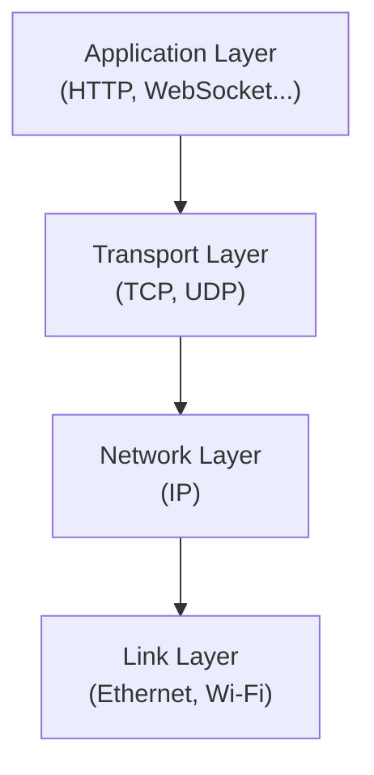
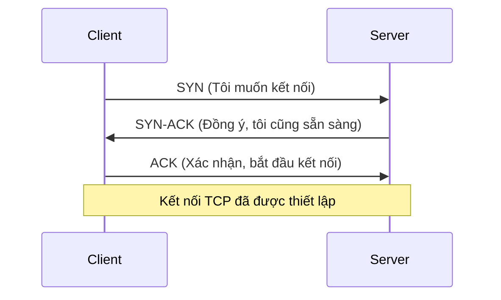
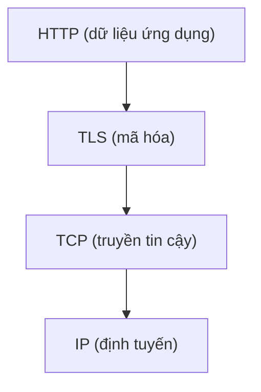
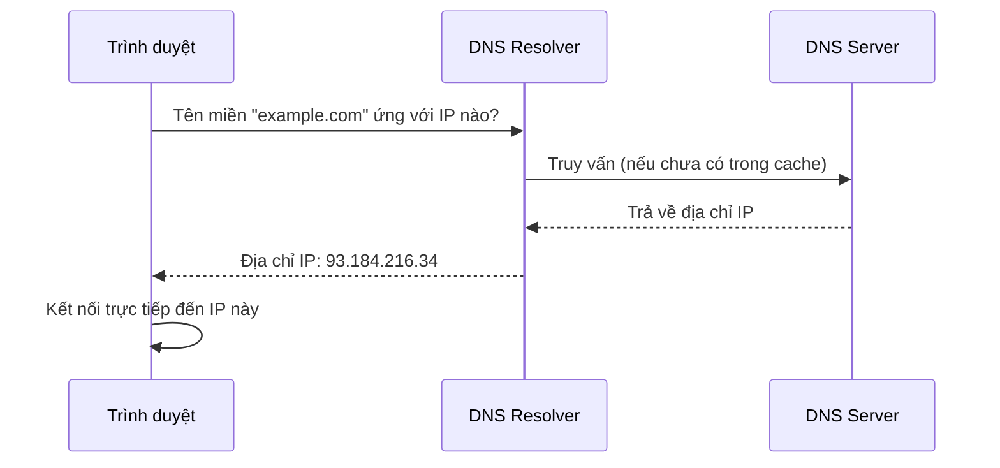
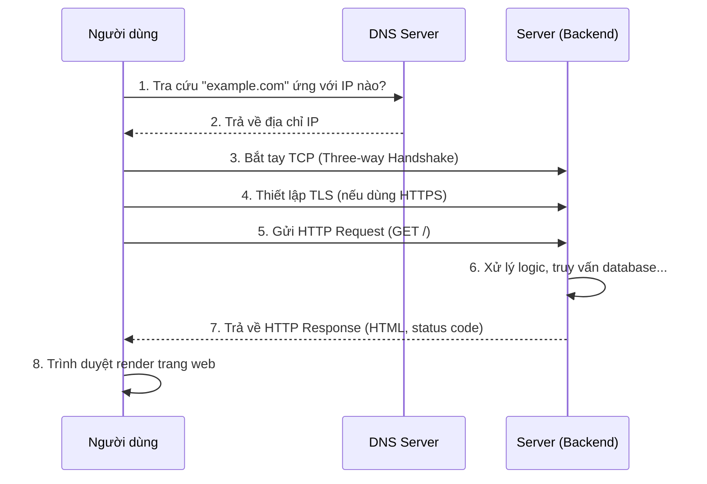

# Chương 1: Networking

## 1.1. Giới thiệu

Trước khi có thể viết một dòng code backend nào, lập trình viên cần hiểu **con đường mà dữ liệu đi qua** giữa client (trình duyệt, ứng dụng di động) và server. Backend không tồn tại độc lập — nó chỉ là một điểm đến trong một chuỗi giao thức mạng nhiều tầng, mỗi tầng đảm nhiệm một trách nhiệm riêng biệt. Hiểu rõ các tầng này giúp lập trình viên không chỉ viết được API hoạt động đúng, mà còn hiểu **vì sao** một số vấn đề thực tế xảy ra (mất kết nối, độ trễ, dữ liệu không toàn vẹn) và cách xử lý chúng ở đúng tầng trách nhiệm của mình.

Chương này trình bày các giao thức nền tảng làm nên Internet: TCP/IP, HTTP, HTTPS và DNS — tất cả đều là kiến thức mà một backend developer cần nắm để hiểu bản chất của mọi request đi đến hệ thống của mình.

---

## 1.2. Giao thức TCP/IP

### 1.2.1. Bản chất

Không có một giao thức nào đơn lẻ chịu trách nhiệm đưa dữ liệu từ máy này sang máy khác trên Internet. Thay vào đó, việc truyền dữ liệu được **chia thành nhiều tầng trách nhiệm**, mỗi tầng chỉ quan tâm đến một vấn đề cụ thể, không cần biết chi tiết bên trong của tầng khác. Đây là nguyên tắc thiết kế cốt lõi giúp Internet có thể mở rộng và vận hành ổn định suốt hàng chục năm dù công nghệ phần cứng bên dưới thay đổi liên tục.

**IP (Internet Protocol)** chịu trách nhiệm **định tuyến** — xác định dữ liệu cần đi từ máy nào đến máy nào, dựa trên địa chỉ IP (giống như địa chỉ nhà trên một lá thư). Tuy nhiên, IP **không đảm bảo** dữ liệu đến nơi đầy đủ, đúng thứ tự, hay thậm chí đến nơi cả gói dữ liệu (packet) đó không bị mất.

**TCP (Transmission Control Protocol)** giải quyết chính xác vấn đề IP còn bỏ ngỏ: đảm bảo dữ liệu được truyền **đáng tin cậy** — đến đủ, đúng thứ tự, và nếu có gói tin bị mất trên đường đi, TCP sẽ tự động yêu cầu gửi lại.



**Bản chất then chốt**: TCP và IP luôn đi cùng nhau vì chúng bù đắp cho nhau — IP biết đường đi nhưng không quan tâm độ tin cậy, TCP đảm bảo độ tin cậy nhưng cần IP để biết đường đi. Đây là lý do bộ giao thức luôn được gọi chung là "TCP/IP".

---

## 1.3. TCP Three-way Handshake

### 1.3.1. Bản chất

Trước khi hai máy có thể trao đổi dữ liệu qua TCP, chúng cần **thiết lập một kết nối đáng tin cậy** — cả hai bên phải xác nhận rằng đối phương đang sẵn sàng nhận và gửi dữ liệu. **Three-way Handshake** là quy trình bắt tay ba bước để thiết lập sự đồng thuận này trước khi bất kỳ dữ liệu thực sự nào được gửi đi.



**Vì sao cần đến ba bước (không phải một hoặc hai)?** Bản chất là để **cả hai bên đều xác nhận được khả năng gửi và nhận của đối phương**:

1. **SYN**: Client gửi tín hiệu muốn kết nối, kèm một số thứ tự khởi tạo.
2. **SYN-ACK**: Server xác nhận đã nhận được yêu cầu (ACK) và đồng thời gửi tín hiệu của chính mình (SYN) để yêu cầu client xác nhận ngược lại.
3. **ACK**: Client xác nhận đã nhận được phản hồi của server.

Sau ba bước này, cả client và server đều chắc chắn: "tôi gửi được cho bạn, và bạn cũng gửi được cho tôi" — nền tảng cho một kênh truyền dữ liệu hai chiều đáng tin cậy.

---

## 1.4. UDP

### 1.4.1. Bản chất

**UDP (User Datagram Protocol)** là một giao thức tầng Transport khác, đối lập hoàn toàn với triết lý của TCP: UDP **gửi dữ liệu ngay lập tức, không cần bắt tay trước, không đảm bảo dữ liệu đến nơi, không đảm bảo đúng thứ tự**. Nghe có vẻ là một điểm yếu, nhưng đây chính xác là điều làm nên giá trị của UDP: **tốc độ và độ trễ thấp**, vì không phải tốn thời gian cho việc thiết lập kết nối hay chờ xác nhận từng gói tin.

UDP phù hợp cho các trường hợp mà **dữ liệu mới luôn quan trọng hơn dữ liệu cũ bị mất** — ví dụ: truyền video call, nếu một khung hình bị mất giữa chừng, việc chờ gửi lại khung hình cũ sẽ vô nghĩa vì lúc đó đã có khung hình mới hơn cần hiển thị.

---

## 1.5. So sánh TCP và UDP

| Tiêu chí | TCP | UDP |
|---|---|---|
| Thiết lập kết nối | Có (Three-way Handshake) | Không |
| Đảm bảo dữ liệu đến nơi | Có — tự động gửi lại nếu mất gói tin | Không đảm bảo |
| Đảm bảo đúng thứ tự | Có | Không |
| Tốc độ / độ trễ | Chậm hơn (do overhead đảm bảo tin cậy) | Nhanh hơn |
| Use case điển hình | Web (HTTP), truyền file, email — nơi tính toàn vẹn dữ liệu quan trọng hơn tốc độ | Video call, game online, streaming — nơi độ trễ thấp quan trọng hơn tính toàn vẹn tuyệt đối |

**Nguyên tắc lựa chọn cốt lõi**: câu hỏi cần đặt ra không phải "giao thức nào tốt hơn", mà là "**dữ liệu bị mất hay bị trễ, cái nào gây hậu quả nghiêm trọng hơn cho nghiệp vụ này**?". Với một API xử lý đơn hàng, mất dữ liệu là không thể chấp nhận được — chọn TCP. Với một cuộc gọi video, một khung hình bị trễ 2 giây còn tệ hơn cả việc mất khung hình đó — chọn UDP.

---

## 1.6. HTTP

### 1.6.1. Bản chất

**HTTP (HyperText Transfer Protocol)** là giao thức tầng Application, xây dựng **trên nền TCP** — tận dụng tính tin cậy mà TCP đã cung cấp, HTTP chỉ cần tập trung định nghĩa **cấu trúc và ý nghĩa** của dữ liệu trao đổi: request gồm những gì, response trả về ra sao. Đây chính là giao thức mà mọi API backend hiện đại đều xây dựng dựa trên.

Bản chất mô hình của HTTP là **request-response**: client luôn là bên khởi tạo, server chỉ phản hồi lại — đây là lý do vì sao trong Chương 9, WebSocket cần được giới thiệu như một giải pháp thay thế khi cần giao tiếp hai chiều chủ động.

### 1.6.1.1. HTTP Methods

Mỗi HTTP Method thể hiện **ý định (intent)** của request, không chỉ là quy ước đặt tên tùy ý:

| Method | Ý nghĩa | Idempotent? (Chương 6) |
|---|---|---|
| `GET` | Lấy dữ liệu, không thay đổi trạng thái server | Có |
| `POST` | Tạo mới một tài nguyên | Không |
| `PUT` | Ghi đè toàn bộ tài nguyên bằng dữ liệu mới | Có |
| `PATCH` | Cập nhật một phần tài nguyên | Không đảm bảo (tùy cách triển khai) |
| `DELETE` | Xóa tài nguyên | Có |

### 1.6.1.2. HTTP Status Code

Status Code là con số ba chữ số cho biết **kết quả của request** — bản chất của việc phân nhóm theo chữ số đầu tiên là để client có thể xử lý phản hồi ở mức tổng quát mà không cần biết chính xác từng mã cụ thể.

| Nhóm | Ý nghĩa | Ví dụ |
|---|---|---|
| `1xx` | Thông tin, đang xử lý | `100 Continue` |
| `2xx` | Thành công | `200 OK`, `201 Created` |
| `3xx` | Chuyển hướng | `301 Moved Permanently` |
| `4xx` | Lỗi do phía client | `400 Bad Request`, `401 Unauthorized`, `404 Not Found` |
| `5xx` | Lỗi do phía server | `500 Internal Server Error`, `503 Service Unavailable` |

**Bản chất phân định trách nhiệm**: nhóm `4xx` và `5xx` không chỉ khác nhau về con số, mà khác nhau về **ai chịu trách nhiệm sửa lỗi** — `4xx` nghĩa là client cần sửa request của mình, `5xx` nghĩa là lỗi nằm ở phía server. Sự phân định này quan trọng khi thiết kế Retry (Chương 6): lỗi `4xx` thường không nên retry (vì gọi lại vẫn sẽ sai), còn một số lỗi `5xx` có thể retry được.

---

## 1.7. HTTPS

### 1.7.1. Bản chất

HTTP truyền dữ liệu ở dạng **văn bản thuần (plain text)** — bất kỳ ai có khả năng "nghe lén" trên đường truyền (ví dụ: cùng một mạng Wi-Fi công cộng) đều có thể đọc được toàn bộ nội dung, bao gồm mật khẩu, token đăng nhập. **HTTPS (HTTP Secure)** giải quyết vấn đề này bằng cách **mã hóa toàn bộ dữ liệu truyền đi**, sử dụng giao thức **TLS (Transport Layer Security)** làm lớp bảo vệ nằm giữa HTTP và TCP.



HTTPS đảm bảo ba tính chất cốt lõi:

- **Bảo mật (Confidentiality)**: dữ liệu bị mã hóa, kẻ nghe lén không đọc được nội dung.
- **Toàn vẹn (Integrity)**: dữ liệu không thể bị chỉnh sửa trên đường truyền mà không bị phát hiện.
- **Xác thực (Authentication)**: xác nhận rằng client đang thực sự kết nối đến đúng server mong muốn (thông qua chứng chỉ số - certificate), không phải một server giả mạo đứng giữa (tấn công Man-in-the-Middle).

---

## 1.8. DNS

### 1.8.1. Bản chất

Máy tính giao tiếp với nhau bằng địa chỉ IP (ví dụ `142.250.183.78`), nhưng con người ghi nhớ và sử dụng tên miền dễ đọc hơn nhiều (ví dụ `google.com`). **DNS (Domain Name System)** là hệ thống dịch tên miền thành địa chỉ IP tương ứng — về bản chất hoạt động như một "danh bạ điện thoại" khổng lồ, phân tán trên toàn cầu.



**Vì sao DNS cần thiết kế phân tán, không phải một máy chủ trung tâm duy nhất**: nếu chỉ có một máy chủ DNS cho toàn bộ Internet, nó sẽ trở thành điểm nghẽn (bottleneck) và điểm lỗi duy nhất (single point of failure) cho hàng tỷ truy vấn mỗi giây trên toàn cầu. DNS được thiết kế theo cấu trúc phân cấp, kết hợp với **caching rộng rãi** ở nhiều tầng (trình duyệt, hệ điều hành, ISP), giúp phần lớn truy vấn được trả lời nhanh mà không cần đi đến tận máy chủ gốc.

---

## 1.9. Domain

### 1.9.1. Bản chất

**Domain (tên miền)** là một chuỗi ký tự đại diện cho một địa chỉ trên Internet, được tổ chức theo cấu trúc phân cấp từ phải sang trái:

```
        blog  .  example  .  com
         │         │         │
   Subdomain   Domain gốc   TLD
                          (Top-Level Domain)
```

- **TLD (Top-Level Domain)**: phần cao nhất trong cấu trúc (`.com`, `.org`, `.vn`), do các tổ chức quản lý tên miền cấp phép.
- **Domain gốc**: phần tên miền mà tổ chức/cá nhân đăng ký sở hữu (`example`).
- **Subdomain**: phần mở rộng thêm để phân chia các dịch vụ khác nhau trong cùng một domain gốc (`blog`, `api`, `www`) — đây là lý do một hệ thống thường có `api.example.com` tách biệt với `example.com`, dù cùng thuộc một tổ chức.

---

## Tổng kết chương: Điều gì xảy ra khi người dùng truy cập một website?

Toàn bộ kiến thức của chương này hội tụ lại khi ta lần theo hành trình đầy đủ của một request, từ lúc người dùng gõ địa chỉ vào trình duyệt cho đến khi trang web hiển thị:



1. **Phân giải DNS**: trình duyệt tra cứu địa chỉ IP tương ứng với tên miền.
2. **Thiết lập kết nối TCP**: client và server bắt tay ba bước để mở kết nối tin cậy.
3. **Thiết lập TLS** (nếu HTTPS): mã hóa kênh truyền trước khi trao đổi dữ liệu thực sự.
4. **Gửi HTTP Request**: trình duyệt gửi yêu cầu cụ thể (method, path, header...).
5. **Server xử lý**: chạy logic nghiệp vụ, truy vấn database — đây là điểm bắt đầu của mọi nội dung được trình bày từ Chương 2 trở đi trong tài liệu này.
6. **Trả về HTTP Response**: kèm status code và dữ liệu.
7. **Trình duyệt render**: hiển thị kết quả cho người dùng.

Nắm được toàn bộ hành trình này giúp lập trình viên backend hiểu rõ **ranh giới trách nhiệm của mình bắt đầu từ đâu** (bước 5) — và cũng hiểu vì sao các vấn đề về độ trễ hay lỗi kết nối đôi khi không nằm ở logic code, mà nằm ở những tầng phía trước đã trình bày trong chương này.