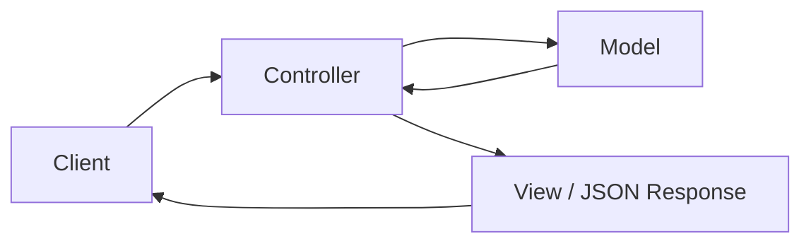
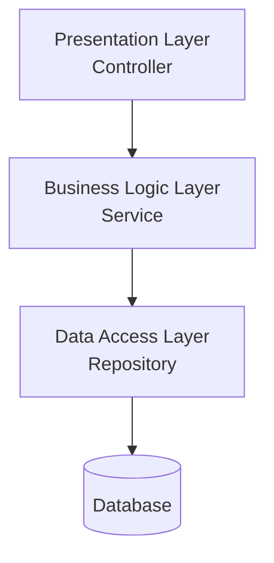
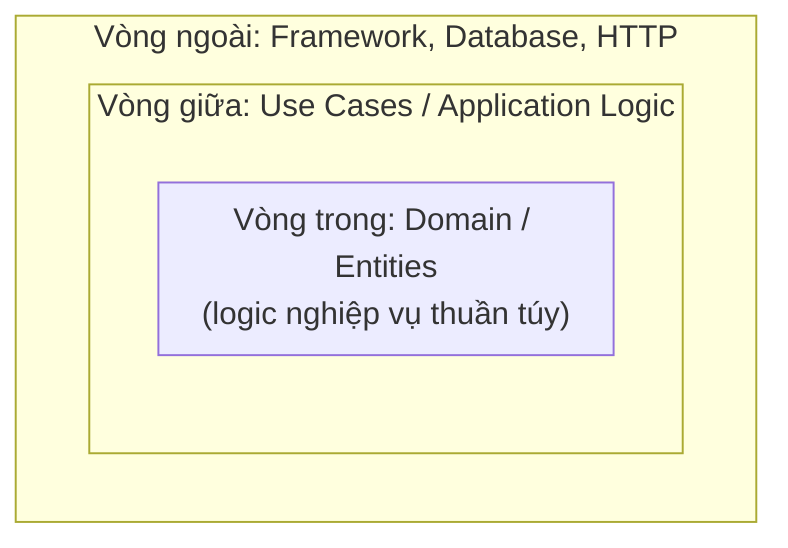
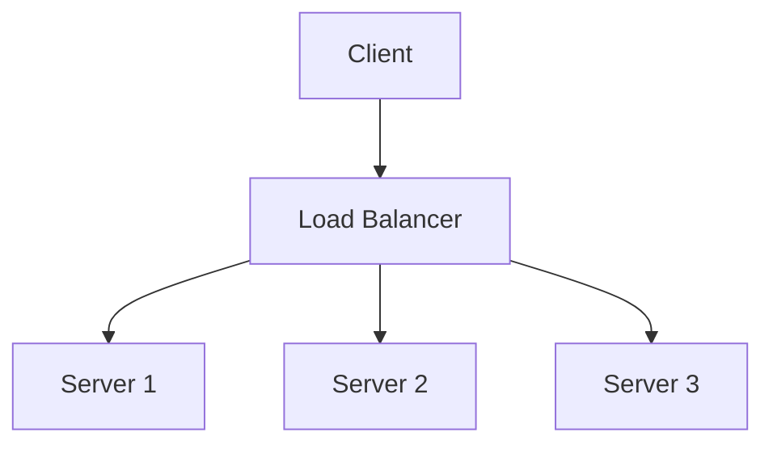

# Chương 3: Backend Architecture

## Giới thiệu

Chương này nâng lên một tầm nhìn rộng hơn: **thiết kế API sao cho dễ hiểu và dễ dùng (API Design)**, **tổ chức toàn bộ ứng dụng thành các tầng trách nhiệm rõ ràng (Backend Architecture)**, và **thiết kế hệ thống để chịu tải lớn (Scalability)**. Đây là những quyết định có ảnh hưởng lâu dài nhất đến một hệ thống — sai lầm ở tầng kiến trúc thường khó và tốn kém để sửa hơn nhiều so với sai lầm trong logic của một hàm cụ thể.

---

## 3.1. API Design

### 3.1.1. API là gì?

**API (Application Programming Interface)** là một tập hợp các quy tắc cho phép hai phần mềm giao tiếp với nhau. Bản chất của API là một **hợp đồng (contract)**: nó định nghĩa rõ ràng "gửi gì thì sẽ nhận lại gì", để bên gọi (client) không cần biết bất kỳ chi tiết nào về cách bên cung cấp (server) triển khai bên trong.

### 3.1.2. RESTful API

**Bản chất**: REST (Representational State Transfer) không phải là một giao thức hay một chuẩn kỹ thuật bắt buộc, mà là một **tập hợp các nguyên tắc thiết kế** giúp API trở nên nhất quán, dễ đoán và dễ mở rộng. Nguyên tắc cốt lõi của REST là xem mọi thứ trong hệ thống như một **tài nguyên (resource)** — một người dùng, một đơn hàng, một sản phẩm — và dùng các HTTP Method (Chương 1) để thể hiện **hành động** muốn thực hiện trên tài nguyên đó.

| Hành động | HTTP Method + Endpoint |
|---|---|
| Lấy danh sách đơn hàng | `GET /orders` |
| Lấy một đơn hàng cụ thể | `GET /orders/123` |
| Tạo đơn hàng mới | `POST /orders` |
| Cập nhật toàn bộ đơn hàng | `PUT /orders/123` |
| Cập nhật một phần đơn hàng | `PATCH /orders/123` |
| Xóa đơn hàng | `DELETE /orders/123` |

**Điểm cốt lõi dễ bị hiểu sai**: REST không quy định "phải dùng đúng 5 method này cho mọi trường hợp" — nó quy định rằng **URL nên đại diện cho một tài nguyên (danh từ)**, còn **HTTP Method mới là nơi thể hiện hành động (động từ)**. Đây là lý do thiết kế `POST /orders/123/cancel` được xem là kém RESTful hơn so với việc coi "trạng thái hủy" như một thuộc tính có thể cập nhật qua `PATCH /orders/123`.

### 3.1.3. Resource Naming

**Bản chất**: cách đặt tên endpoint không chỉ là vấn đề thẩm mỹ — nó phản ánh **mô hình dữ liệu** mà API đang phơi bày ra bên ngoài. Một số quy ước phổ biến:

- Dùng **danh từ số nhiều**: `/users` thay vì `/user` hay `/getUsers`.
- Thể hiện quan hệ phân cấp qua URL: `/users/123/orders` (đơn hàng thuộc về người dùng 123).
- Không nhúng động từ vào URL (`/getUsers`, `/deleteUser`) — vì hành động đã được thể hiện qua HTTP Method rồi, nhúng thêm động từ vào URL là dư thừa và mâu thuẫn với chính nguyên tắc REST.

### 3.1.4. API Versioning

**Bản chất**: một khi API đã được các client (frontend, đối tác bên ngoài, ứng dụng di động đã phát hành) sử dụng, **bất kỳ thay đổi nào phá vỡ cấu trúc cũ (breaking change)** đều có thể làm sập các hệ thống đang phụ thuộc vào nó mà backend không hề hay biết. API Versioning là cơ chế cho phép **giới thiệu thay đổi mới song song với việc vẫn duy trì phiên bản cũ** cho đến khi mọi client đã chuyển sang phiên bản mới.

```
GET /v1/users     ← phiên bản cũ, vẫn hoạt động cho client chưa nâng cấp
GET /v2/users     ← phiên bản mới, có thay đổi cấu trúc dữ liệu
```

Ngoài versioning qua URL (phổ biến nhất vì dễ nhìn thấy, dễ debug), một số hệ thống dùng versioning qua HTTP Header — về bản chất mục tiêu vẫn giống nhau: tách biệt rõ ràng giữa các phiên bản hợp đồng API.

### 3.1.5. Idempotent Method

Khái niệm này đã được trình bày sâu ở Chương 6 (mục 6.4) khi bàn về Idempotency trong xử lý dữ liệu. Ở góc độ thiết kế API, cần nhấn mạnh: việc một HTTP Method có idempotent theo đúng chuẩn hay không **là một cam kết thiết kế**, không phải điều tự động đúng chỉ vì chọn đúng method. Ví dụ `PUT` được xem là idempotent theo chuẩn REST, nhưng nếu lập trình viên triển khai sai (ví dụ để `PUT` vô tình tạo thêm bản ghi mới mỗi lần gọi), API đó vi phạm chính hợp đồng mà bản thân HTTP Method đã ngầm cam kết với người dùng API.

### 3.1.6. Stateless

**Bản chất**: mỗi request gửi đến API RESTful phải chứa **đầy đủ mọi thông tin cần thiết** để server xử lý nó, mà không phụ thuộc vào bất kỳ thông tin nào được lưu lại từ các request trước đó của cùng client. Server không "nhớ" trạng thái hội thoại giữa các request.

**Vì sao Stateless lại là một nguyên tắc thiết kế quan trọng, không chỉ là đặc điểm kỹ thuật của HTTP?** Vì nó là điều kiện tiên quyết cho khả năng **mở rộng theo chiều ngang (Horizontal Scaling)**, sẽ trình bày ở mục 3.3: nếu server không lưu trạng thái riêng theo từng client, thì **bất kỳ instance nào trong cụm server cũng có thể xử lý bất kỳ request nào**, không cần điều hướng client luôn đến đúng một server cố định. Đây chính là lý do JWT (Chương 8) — cơ chế xác thực không lưu trạng thái ở server — phù hợp tự nhiên với các hệ thống backend hiện đại cần mở rộng quy mô.

---

## 3.2. Backend Architecture (Kiến trúc tổ chức code)

### 3.2.1. Bản chất chung

Khi một ứng dụng backend còn nhỏ, việc tổ chức code như thế nào dường như không quan trọng — mọi cách viết đều "chạy được". Nhưng khi ứng dụng lớn dần, số lượng tính năng và số người tham gia phát triển tăng lên, **thiếu một kiến trúc rõ ràng sẽ khiến code trở thành một khối logic đan xen chằng chịt**, mọi thay đổi nhỏ đều có nguy cơ ảnh hưởng đến những phần không liên quan. Các mô hình kiến trúc dưới đây đều nhằm giải quyết cùng một vấn đề gốc: **phân chia trách nhiệm rõ ràng giữa các phần của hệ thống**.

### 3.2.2. MVC (Model - View - Controller)

**Bản chất**: MVC tách ứng dụng thành ba mối quan tâm độc lập:

- **Model**: đại diện cho dữ liệu và logic nghiệp vụ liên quan đến dữ liệu đó.
- **View**: phần hiển thị dữ liệu cho người dùng (trong bối cảnh API backend thuần túy, "View" thường chính là cấu trúc JSON được trả về).
- **Controller**: tiếp nhận yêu cầu, điều phối giữa Model và View.



MVC là kiến trúc nền tảng lâu đời nhất, và là gốc rễ tư duy cho các mô hình phức tạp hơn bên dưới — Controller trong NestJS (Chương 5) chính là sự kế thừa trực tiếp khái niệm này.

### 3.2.3. Thin Controller - Fat Service

**Bản chất**: đây không phải một kiến trúc riêng biệt, mà là một **nguyên tắc thực hành** khắc phục một sai lầm phổ biến khi áp dụng MVC vào backend hiện đại: nhét toàn bộ logic nghiệp vụ trực tiếp vào Controller.

Vấn đề khi Controller "béo" (Fat Controller): logic nghiệp vụ bị **trộn lẫn** với logic xử lý HTTP (đọc request, trả response), khiến logic đó **không thể tái sử dụng** ở nơi khác (ví dụ khi cần gọi cùng logic đó từ một Cron Job thay vì từ một HTTP request) và **khó viết Unit Test** (vì phải giả lập toàn bộ request/response chỉ để test một đoạn logic thuần túy).

Nguyên tắc **Thin Controller - Fat Service**: Controller chỉ nên làm ba việc — nhận dữ liệu đầu vào, gọi đến Service tương ứng, trả kết quả về. Toàn bộ logic nghiệp vụ thực sự được đặt trong Service — nơi hoàn toàn độc lập với khái niệm HTTP, có thể được gọi từ bất kỳ đâu (Controller, Cron Job, Queue Worker) và dễ dàng test độc lập.

```ts
// Controller "béo" — sai
@Post()
async create(@Body() dto: CreateOrderDto) {
  const product = await this.productRepo.findOne(dto.productId);
  if (product.stock < dto.quantity) throw new BadRequestException('...');
  // ... hàng chục dòng logic nghiệp vụ khác ngay trong Controller
}

// Thin Controller - Fat Service — đúng
@Post()
create(@Body() dto: CreateOrderDto) {
  return this.orderService.create(dto); // Controller chỉ điều phối
}
```

### 3.2.4. Repository Pattern

Đã trình bày chi tiết bản chất ở Chương 2 (mục 2.2.3). Trong bối cảnh kiến trúc tổng thể, Repository Pattern là **tầng nằm giữa Service và Database**, hoàn thiện mô hình phân lớp: Controller → Service → Repository → Database.

### 3.2.5. Layered Architecture

**Bản chất**: Layered Architecture (kiến trúc phân tầng) là sự khái quát hóa của những gì đã trình bày ở trên thành một nguyên tắc tổng quát: chia hệ thống thành các **tầng xếp chồng lên nhau theo thứ tự phụ thuộc một chiều** — mỗi tầng chỉ được phép gọi xuống tầng ngay bên dưới nó, không được phép "nhảy cóc" hay gọi ngược lên tầng trên.



**Lợi ích cốt lõi**: mỗi tầng chỉ cần quan tâm đến tầng liền kề, không cần biết chi tiết của các tầng xa hơn — Controller không cần biết Repository dùng Prisma hay TypeORM, chỉ cần biết Service cung cấp những gì. Đây chính là ứng dụng trực tiếp của nguyên tắc **Dependency Inversion** (Chương 2) ở cấp độ toàn hệ thống.

### 3.2.6. Clean Architecture

**Bản chất**: Layered Architecture giải quyết vấn đề tổ chức, nhưng vẫn tồn tại một điểm yếu: theo mô hình trên, tầng Business Logic (Service) **vẫn phụ thuộc trực tiếp** vào tầng Data Access bên dưới nó — nếu công nghệ database thay đổi hoàn toàn, logic nghiệp vụ cốt lõi vẫn có nguy cơ bị ảnh hưởng.

**Clean Architecture** đẩy nguyên tắc Dependency Inversion đi xa hơn: đặt **logic nghiệp vụ (domain) làm trung tâm**, hoàn toàn không phụ thuộc vào bất kỳ chi tiết kỹ thuật nào (database, framework, giao thức HTTP). Mọi thành phần kỹ thuật cụ thể (database, web framework) đều nằm ở **vòng ngoài**, và phụ thuộc *vào trong* — hướng vào domain — chứ không phải chiều ngược lại.



**Điểm khác biệt bản chất so với Layered Architecture thông thường**: ở Layered Architecture, mũi tên phụ thuộc đi từ trên xuống dưới (Controller → Service → Repository → Database) — nghĩa là Service vẫn "biết" đến khái niệm Repository/Database. Ở Clean Architecture, phần domain (logic nghiệp vụ) hoàn toàn **không biết gì** về database hay framework đang được sử dụng; thay vào đó, tầng ngoài phải tuân theo interface do tầng trong định nghĩa (Dependency Inversion Principle được áp dụng triệt để).

**Đánh đổi**: Clean Architecture mang lại khả năng thay đổi công nghệ (database, framework) mà gần như không ảnh hưởng đến logic nghiệp vụ cốt lõi, nhưng đòi hỏi nhiều lớp trừu tượng hơn — phù hợp với hệ thống lớn, phức tạp, có vòng đời dài; với dự án nhỏ hoặc giai đoạn đầu (MVP), mức độ trừu tượng này có thể là sự phức tạp không cần thiết.

### 3.2.7. So sánh các mô hình kiến trúc

| Kiến trúc | Mức độ tách biệt logic nghiệp vụ khỏi chi tiết kỹ thuật | Độ phức tạp | Phù hợp với |
|---|---|---|---|
| MVC thuần | Thấp | Thấp | Ứng dụng nhỏ, đơn giản |
| Thin Controller - Fat Service | Trung bình | Thấp - Trung bình | Hầu hết ứng dụng NestJS thực tế |
| Layered Architecture | Trung bình - Cao | Trung bình | Hệ thống có quy mô vừa và lớn |
| Clean Architecture | Rất cao | Cao | Hệ thống lớn, phức tạp, cần khả năng thay đổi công nghệ lâu dài |

---

## 3.3. Scalability

### 3.3.1. Bản chất

Một hệ thống được thiết kế tốt cho 100 người dùng có thể hoàn toàn sụp đổ khi có 1 triệu người dùng — không phải vì logic sai, mà vì **kiến trúc không được thiết kế để mở rộng**. Scalability (khả năng mở rộng) là năng lực của hệ thống trong việc **duy trì hiệu năng ổn định khi tải trọng tăng lên**, bằng cách bổ sung thêm tài nguyên.

### 3.3.2. Vertical Scaling

**Bản chất**: nâng cấp **chính máy chủ hiện có** — thêm CPU, thêm RAM, ổ cứng nhanh hơn. Đây là cách mở rộng đơn giản nhất về mặt triển khai (không cần thay đổi kiến trúc ứng dụng), nhưng có **giới hạn vật lý**: một máy chủ dù mạnh đến đâu cũng có trần công suất tối đa, và chi phí nâng cấp thường tăng nhanh hơn nhiều so với mức tăng hiệu năng nhận được (hiệu suất đầu tư giảm dần).

### 3.3.3. Horizontal Scaling

**Bản chất**: thay vì nâng cấp một máy chủ, bổ sung **thêm nhiều máy chủ chạy song song**, cùng chia sẻ tải công việc. Về lý thuyết, Horizontal Scaling không có giới hạn trên — cần xử lý nhiều hơn, chỉ cần thêm máy chủ mới.

**Điều kiện tiên quyết**: Horizontal Scaling chỉ khả thi khi ứng dụng tuân thủ nguyên tắc **Stateless** (mục 3.1.6) — nếu server lưu trạng thái riêng (ví dụ session lưu trong bộ nhớ của chính nó), việc thêm server mới sẽ tạo ra sự không nhất quán (client có thể bị định tuyến đến một server không hề "biết" về phiên đăng nhập của họ).

| Tiêu chí | Vertical Scaling | Horizontal Scaling |
|---|---|---|
| Cách thực hiện | Nâng cấp phần cứng của máy hiện có | Thêm nhiều máy chủ chạy song song |
| Giới hạn mở rộng | Có trần vật lý | Gần như không giới hạn |
| Độ phức tạp triển khai | Thấp, không cần sửa kiến trúc ứng dụng | Cao hơn, yêu cầu ứng dụng stateless, cần Load Balancer |
| Khả năng chịu lỗi | Thấp — một máy chủ duy nhất là điểm lỗi duy nhất | Cao — một máy chủ gặp sự cố, các máy khác vẫn hoạt động |
| Chi phí theo quy mô | Tăng nhanh khi gần đến giới hạn phần cứng | Tăng tuyến tính, dễ dự đoán hơn |

### 3.3.4. Load Balancer

**Bản chất**: khi có nhiều server chạy song song (Horizontal Scaling), cần một thành phần đứng trước để **quyết định mỗi request nên được chuyển đến server nào** — đây chính là vai trò của Load Balancer. Nó vừa phân phối tải đồng đều, vừa đóng vai trò kiểm tra sức khỏe (dựa trên Health Check, đã trình bày ở Chương 7) để tự động ngừng gửi request đến các server đang gặp sự cố.



### 3.3.5. Reverse Proxy

**Bản chất**: Reverse Proxy là một máy chủ trung gian đứng **trước** các server ứng dụng thực sự, tiếp nhận request từ client và chuyển tiếp đến server phía sau — nhưng từ góc nhìn của client, họ chỉ thấy Reverse Proxy, không hề biết (và không cần biết) có bao nhiêu server thực sự đứng phía sau nó.

**Phân biệt với Load Balancer**: Load Balancer là một **trường hợp ứng dụng cụ thể** của Reverse Proxy, tập trung vào việc phân phối tải. Reverse Proxy nói chung có phạm vi rộng hơn, còn đảm nhiệm thêm các vai trò khác: xử lý SSL/TLS tập trung (giải mã HTTPS ở proxy, không cần mỗi server phía sau tự xử lý), nén dữ liệu, cache response tĩnh, và **ẩn cấu trúc hạ tầng bên trong** khỏi bên ngoài — góp phần tăng bảo mật.

### 3.3.6. Caching

Đã được trình bày chi tiết ở Chương 7 (mục 7.3) trong bối cảnh giảm tải cho database. Ở góc độ Scalability tổng thể, cần nhấn mạnh thêm: Caching là kỹ thuật mở rộng **duy nhất trong nhóm này không đòi hỏi thêm phần cứng theo tỷ lệ với tải** — bằng cách giảm số lượng công việc thực sự cần xử lý (nhờ phục vụ lại kết quả đã tính trước), cùng một hạ tầng có thể phục vụ được nhiều request hơn đáng kể so với khi không có cache.

### 3.3.7. Tổng hợp chiến lược mở rộng

Trong thực tế, các kỹ thuật này thường được áp dụng theo thứ tự tăng dần độ phức tạp: bắt đầu bằng Caching (chi phí thấp, hiệu quả cao) và Vertical Scaling (đơn giản) khi tải còn nhỏ; khi đạt đến giới hạn, chuyển sang Horizontal Scaling kết hợp Load Balancer/Reverse Proxy; và khi database trở thành điểm nghẽn, áp dụng các kỹ thuật mở rộng database đã trình bày ở Chương 4 (Read Replica, Sharding).

---

## Tổng kết chương

Chương này trình bày ba lớp quyết định kiến trúc có ảnh hưởng sâu rộng nhất đến một hệ thống backend. API Design đảm bảo hợp đồng giao tiếp giữa client và server rõ ràng, nhất quán và có khả năng tiến hóa theo thời gian mà không phá vỡ các bên đang phụ thuộc vào nó. Backend Architecture (từ MVC đơn giản đến Clean Architecture phức tạp) đều xoay quanh cùng một mục tiêu cốt lõi: **phân tách rõ ràng logic nghiệp vụ khỏi chi tiết kỹ thuật**, chỉ khác nhau ở mức độ triệt để. Scalability đảm bảo những quyết định thiết kế đúng đắn đó vẫn được giữ vững khi hệ thống phải phục vụ hàng triệu người dùng, chứ không chỉ đúng trên máy phát triển cục bộ. Ba mảng kiến thức này, cùng với nền tảng OOP và SOLID ở Chương 2, tạo thành bộ khung tư duy hoàn chỉnh trước khi bước vào chi tiết kỹ thuật của Database (Chương 4) và NestJS (Chương 5).