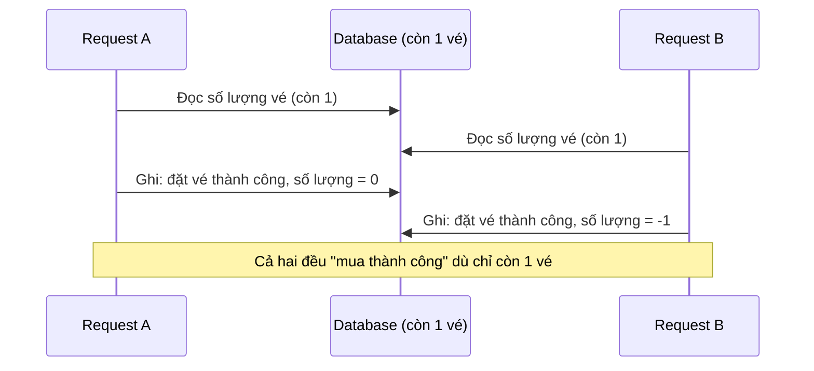
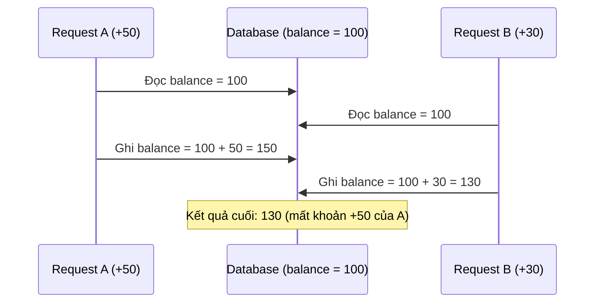
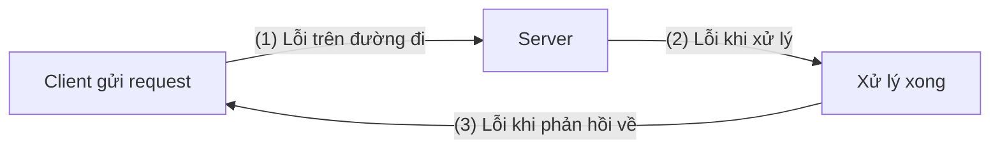
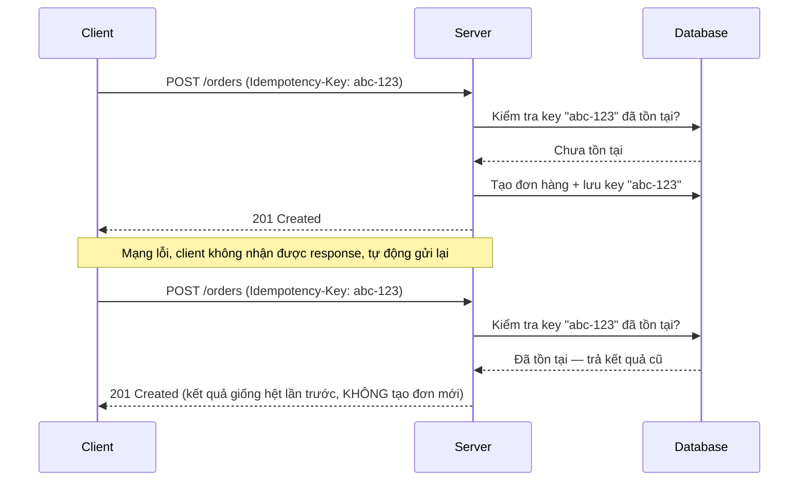
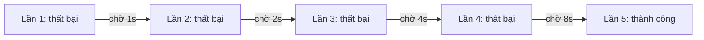

# Chương 6: Backend Processing Techniques — Data & Consistency

## Giới thiệu

Nếu Chương 4 và 5 tập trung vào công cụ (database, ORM, NestJS), thì chương này tập trung vào **tư duy xử lý dữ liệu** — thứ phân biệt một backend "chạy được" với một backend "chạy đúng trong mọi tình huống". Phần lớn lỗi nghiêm trọng trong hệ thống thực tế (mất tiền, trùng đơn hàng, sai số dư) không đến từ việc viết sai cú pháp, mà đến từ việc **không lường trước được điều gì xảy ra khi nhiều thứ diễn ra cùng lúc, hoặc khi một thao tác bị gián đoạn giữa chừng**. Đây chính là chủ đề xuyên suốt chương này: Validation, Concurrency, Atomic Update, Idempotency và Retry.

---

## 6.1. Validation

### 6.1.1. Bản chất của Validation

Validation không đơn thuần là "kiểm tra dữ liệu có đúng định dạng không". Bản chất của validation là **thiết lập một hàng rào ranh giới (boundary)** giữa thế giới bên ngoài — nơi dữ liệu không đáng tin cậy — và hệ thống bên trong — nơi mọi logic đều giả định dữ liệu đã hợp lệ.

Nếu không có ranh giới rõ ràng này, mọi lớp trong hệ thống (Service, Repository...) đều phải tự kiểm tra lại dữ liệu, dẫn đến logic kiểm tra bị lặp lại rải rác khắp nơi, khó bảo trì và dễ bỏ sót. Vì vậy, validation nên được thực hiện **càng sớm càng tốt**, ngay tại điểm dữ liệu đi vào hệ thống.

Có hai loại validation với bản chất khác nhau, dễ bị nhầm lẫn:

### 6.1.2. DTO Validation (Validation cấu trúc)

Kiểm tra dữ liệu đầu vào có đúng **hình dạng (shape)** hay không: đúng kiểu dữ liệu, đúng định dạng, nằm trong khoảng cho phép. Đây là loại validation **không cần biết gì về nghiệp vụ** — email phải đúng định dạng email dù trong bất kỳ hệ thống nào.

```ts
// create-order.dto.ts
export class CreateOrderDto {
  @IsString()
  @IsNotEmpty()
  productId: string;

  @IsInt()
  @Min(1)
  quantity: number;

  @IsEmail()
  customerEmail: string;
}
```

```ts
app.useGlobalPipes(new ValidationPipe({ whitelist: true, forbidNonWhitelisted: true }));
```

Trong NestJS, DTO Validation được xử lý ở tầng **Pipe** — tức là dữ liệu sai sẽ bị chặn lại **trước khi** chạm vào Controller, đúng với nguyên tắc "chặn sớm nhất có thể".

### 6.1.3. Business Validation (Validation nghiệp vụ)

Kiểm tra dữ liệu có **hợp lý trong bối cảnh nghiệp vụ hiện tại** hay không — điều mà DTO Validation không thể biết vì nó phụ thuộc vào trạng thái dữ liệu tại thời điểm xử lý (thường phải truy vấn database).

Ví dụ: `quantity: 5` là hợp lệ về mặt cấu trúc (số nguyên dương), nhưng nếu kho chỉ còn 3 sản phẩm thì đây là lỗi nghiệp vụ.

```ts
// order.service.ts
async createOrder(dto: CreateOrderDto) {
  const product = await this.productRepo.findOne(dto.productId);
  if (product.stock < dto.quantity) {
    throw new BadRequestException('Số lượng tồn kho không đủ');
  }
  // tiếp tục xử lý...
}
```

### 6.1.4. So sánh hai loại Validation

| Tiêu chí | DTO Validation | Business Validation |
|---|---|---|
| Kiểm tra | Cấu trúc, kiểu dữ liệu, định dạng | Tính hợp lý theo trạng thái nghiệp vụ hiện tại |
| Cần truy vấn dữ liệu? | Không | Thường có (database, service khác) |
| Vị trí xử lý (NestJS) | Pipe | Service |
| Ví dụ | `email` đúng định dạng, `quantity > 0` | Tồn kho đủ, tài khoản chưa bị khóa, đơn hàng chưa được thanh toán trước đó |

**Bản chất then chốt**: DTO Validation trả lời câu hỏi "*dữ liệu này có đúng hình dạng không?*", còn Business Validation trả lời câu hỏi "*dữ liệu này có ý nghĩa trong bối cảnh hiện tại không?*". Nhầm lẫn hai loại này thường dẫn đến việc nhét logic nghiệp vụ vào DTO (sai vị trí, khó test) hoặc bỏ sót kiểm tra cấu trúc (dữ liệu rác lọt vào tận tầng Service).

---

## 6.2. Concurrency (Xử lý đồng thời)

### 6.2.1. Bản chất của vấn đề Concurrency

Một hệ thống backend thực tế phục vụ **hàng trăm, hàng nghìn request cùng lúc**, không phải tuần tự từng cái một. Vấn đề concurrency xuất hiện khi hai hay nhiều request **cùng đọc và cùng ghi lên một dữ liệu chung** trong khoảng thời gian gối lên nhau. Đây không phải là lỗi hiếm gặp — nó là hệ quả tất yếu của việc phục vụ nhiều người dùng đồng thời, và **sẽ luôn xảy ra** nếu hệ thống có đủ lưu lượng truy cập.

Gốc rễ của mọi lỗi concurrency nằm ở việc: một thao tác cập nhật dữ liệu thường không diễn ra trong "một bước", mà gồm nhiều bước nhỏ — **đọc dữ liệu → tính toán → ghi lại**. Nếu một request khác chen vào giữa các bước này, dữ liệu sẽ sai lệch.

### 6.2.2. Race Condition

**Race Condition** là hiện tượng kết quả cuối cùng của hệ thống phụ thuộc vào **thứ tự thực thi ngẫu nhiên** của các thao tác đồng thời, thay vì phụ thuộc vào logic nghiệp vụ đã định.

Ví dụ kinh điển: hệ thống bán vé, chỉ còn **1 vé cuối cùng**, hai người dùng A và B cùng bấm "Mua" trong cùng một khoảnh khắc.



Cả A và B đều đọc thấy "còn 1 vé" **trước khi** bên kia kịp ghi lại kết quả, nên cả hai đều cho rằng mình mua được — hệ thống bán vượt số lượng thực có.

### 6.2.3. Lost Update

**Lost Update** là một biểu hiện cụ thể của Race Condition, trong đó **một trong hai lần cập nhật bị ghi đè và biến mất hoàn toàn**, như thể nó chưa từng xảy ra.

Ví dụ: số dư tài khoản đang là 100. Hai giao dịch cộng tiền cùng lúc: A cộng thêm 50, B cộng thêm 30.



Kết quả đúng phải là 180, nhưng vì B đọc dữ liệu **trước khi** A kịp ghi, thao tác cộng 50 của A bị "nuốt mất" khi B ghi đè lên. Đây là lỗi cực kỳ nguy hiểm vì hệ thống **không hề báo lỗi** — request vẫn trả về thành công, dữ liệu chỉ âm thầm sai.

### 6.2.4. Cách khắc phục

| Kỹ thuật | Bản chất | Khi dùng |
|---|---|---|
| **Pessimistic Locking** | Khóa dòng dữ liệu ngay khi đọc, các request khác phải chờ (dùng `SELECT ... FOR UPDATE`) | Xung đột xảy ra thường xuyên, dữ liệu quan trọng (tài chính) |
| **Optimistic Locking** | Không khóa trước, nhưng kiểm tra version/timestamp khi ghi — nếu dữ liệu đã bị người khác thay đổi thì từ chối ghi và yêu cầu thử lại | Xung đột hiếm xảy ra, cần hiệu năng cao |
| **Atomic Update** (mục 6.3) | Gộp đọc-tính toán-ghi thành một lệnh duy nhất ở tầng database | Các phép toán đơn giản như cộng/trừ số lượng |

---

## 6.3. Atomic Update

### 6.3.1. Bản chất

Nguyên nhân gốc rễ của Race Condition ở trên là việc tách thao tác "đọc rồi ghi" thành **hai bước riêng biệt ở tầng ứng dụng**. **Atomic Update** giải quyết tận gốc bằng cách đẩy toàn bộ phép toán xuống **một lệnh duy nhất tại tầng database**, để chính database — nơi vốn được thiết kế đảm bảo tính nguyên tử — thực hiện cả đọc và ghi trong một bước không thể chia cắt.

**Sai cách (đọc-tính toán-ghi ở tầng ứng dụng):**

```ts
// KHÔNG AN TOÀN với concurrency
const product = await this.productRepo.findOne(id);
product.stock = product.stock - quantity;
await this.productRepo.save(product);
```

**Đúng cách (Atomic Update tại database):**

```ts
// Prisma — phép trừ thực hiện ngay trong câu lệnh SQL, không qua bước đọc trung gian
await this.prisma.product.update({
  where: { id },
  data: { stock: { decrement: quantity } },
});
```

Câu lệnh trên tương đương với SQL:

```sql
UPDATE products SET stock = stock - :quantity WHERE id = :id;
```

Vì phép trừ diễn ra ngay trong một câu lệnh SQL duy nhất, database sẽ tự động khóa dòng dữ liệu trong suốt quá trình thực thi lệnh — không có "khoảng hở" nào để một request khác chen vào giữa bước đọc và bước ghi.

### 6.3.2. Kết hợp kiểm tra điều kiện

Atomic Update có thể kết hợp thêm điều kiện để tránh giá trị âm (ví dụ: không cho trừ kho khi không đủ hàng):

```sql
UPDATE products SET stock = stock - 5 WHERE id = 'p1' AND stock >= 5;
```

Nếu điều kiện `stock >= 5` không thỏa mãn, câu lệnh không cập nhật dòng nào — ứng dụng kiểm tra số dòng bị ảnh hưởng (`affected rows`) để biết thao tác có thành công hay không, thay vì phải khóa hoặc đọc lại dữ liệu trước đó.

---

## 6.4. Idempotency

### 6.4.1. Bản chất

**Idempotency (tính lũy đẳng)** là tính chất của một thao tác: **dù được gọi một lần hay nhiều lần với cùng đầu vào, kết quả cuối cùng trên hệ thống vẫn giống hệt nhau như khi chỉ gọi một lần**.

Tại sao thao tác lại bị gọi lặp lại? Trong hệ thống phân tán, **client không bao giờ có thể chắc chắn 100% một request đã được server xử lý hay chưa** khi gặp lỗi mạng hoặc timeout — vì lỗi có thể xảy ra ở một trong ba điểm:



Ở cả ba trường hợp, client chỉ thấy **một hiện tượng duy nhất: không nhận được response** — nhưng thực tế có thể server **đã xử lý xong** (trường hợp 3). Phản ứng tự nhiên của client (hoặc cơ chế Retry ở mục 6.5) là **gửi lại request** — và nếu thao tác đó không idempotent (ví dụ: "trừ tiền", "tạo đơn hàng"), việc gửi lại sẽ khiến thao tác bị thực hiện hai lần, gây hậu quả nghiêm trọng (trừ tiền hai lần, tạo đơn hàng trùng).

Đây chính là lý do idempotency là yêu cầu **bắt buộc** đối với mọi API có thể bị retry — tức gần như mọi API ghi dữ liệu quan trọng.

### 6.4.2. Các phương thức HTTP và tính idempotent

| Phương thức | Idempotent? | Giải thích |
|---|---|---|
| `GET` | Có | Chỉ đọc, gọi bao nhiêu lần cũng không thay đổi dữ liệu |
| `PUT` | Có | Ghi đè toàn bộ tài nguyên bằng một giá trị xác định — gọi lại nhiều lần cho cùng kết quả |
| `DELETE` | Có (theo lý thuyết) | Xóa một tài nguyên — gọi lại lần nữa tài nguyên vẫn ở trạng thái "đã xóa" |
| `POST` | **Không** | Theo mặc định, mỗi lần gọi thường tạo ra một bản ghi mới → đây là phương thức nguy hiểm nhất khi bị retry |

Đây chính là lý do các API `POST` quan trọng (tạo đơn hàng, thanh toán, chuyển tiền) cần được chủ động bổ sung cơ chế idempotency, vì bản chất của `POST` vốn không đảm bảo tính chất này.

### 6.4.3. Cách hoạt động — Idempotency Key

Cơ chế phổ biến nhất là **Idempotency Key**: client tự sinh ra một mã định danh duy nhất (thường là UUID) cho **mỗi ý định thao tác nghiệp vụ** (không phải cho mỗi lần gửi request), và gửi kèm mã này trong mọi lần gọi — kể cả các lần gọi lại do retry.



Server lưu lại cặp `(idempotency key → kết quả xử lý)`. Khi nhận được request với key đã tồn tại, server **không xử lý lại logic nghiệp vụ**, mà trả về ngay kết quả đã lưu từ lần xử lý đầu tiên.

```ts
// idempotency.interceptor.ts (minh họa ý tưởng)
@Injectable()
export class IdempotencyInterceptor implements NestInterceptor {
  constructor(private cacheService: CacheService) {}

  async intercept(context: ExecutionContext, next: CallHandler) {
    const request = context.switchToHttp().getRequest();
    const key = request.headers['idempotency-key'];
    if (!key) return next.handle();

    const cached = await this.cacheService.get(key);
    if (cached) return of(cached); // trả kết quả cũ, không xử lý lại

    return next.handle().pipe(
      tap((result) => this.cacheService.set(key, result, 24 * 60 * 60)),
    );
  }
}
```

### 6.4.4. Lưu ý khi thiết kế Idempotency Key

- Key nên do **client sinh ra** (thường là UUID) vì chỉ client mới biết chắc đây là lần thử lại của cùng một ý định thao tác, hay là một thao tác mới hoàn toàn.
- Key cần có thời gian sống hợp lý (ví dụ 24 giờ) — không cần lưu vĩnh viễn.
- Kết quả trả về cho các lần gọi lặp phải **giống hệt** lần gọi đầu tiên (cùng status code, cùng dữ liệu), để client không phân biệt được đây là request mới hay request lặp.

---

## 6.5. Retry

### 6.5.1. Bản chất

Nếu Idempotency đảm bảo *an toàn khi gọi lại*, thì **Retry** là cơ chế *chủ động gọi lại* khi một thao tác thất bại — dựa trên một quan sát thực tế: phần lớn lỗi trong hệ thống phân tán là **lỗi tạm thời (transient)**, tự khỏi sau một khoảng thời gian ngắn (mạng nghẽn tạm thời, server đang quá tải, database đang restart...). Retry giúp hệ thống tự phục hồi trước những lỗi tạm thời này mà không cần can thiệp thủ công.

Tuy nhiên, Retry **chỉ an toàn khi thao tác đó là idempotent** — đây là lý do mục 6.4 và 6.5 luôn đi liền với nhau: Retry là nguyên nhân khiến một request có thể bị gọi nhiều lần, còn Idempotency là điều kiện để việc gọi nhiều lần đó không gây hậu quả.

### 6.5.2. Retryable Error — Không phải lỗi nào cũng nên Retry

Việc retry một cách mù quáng với mọi loại lỗi không những vô ích mà còn có thể làm tình hình tệ hơn (ví dụ: retry liên tục vào một server đang quá tải sẽ khiến nó quá tải nặng hơn). Cần phân biệt rõ hai nhóm lỗi:

| Loại lỗi | Ví dụ | Có nên Retry? | Lý do |
|---|---|---|---|
| **Lỗi tạm thời (Retryable)** | Timeout, `503 Service Unavailable`, mất kết nối mạng | Có | Nguyên nhân thường tự hết sau một khoảng thời gian |
| **Lỗi cố định (Non-retryable)** | `400 Bad Request`, `401 Unauthorized`, `404 Not Found` | Không | Dữ liệu hoặc yêu cầu bản thân nó sai — gọi lại bao nhiêu lần cũng nhận cùng một lỗi |

### 6.5.3. Exponential Backoff

Nếu retry ngay lập tức và liên tục, hàng loạt client cùng retry cùng lúc có thể tạo ra một đợt tấn công request dồn dập vào hệ thống đang gặp sự cố — hiện tượng gọi là **retry storm**, khiến hệ thống vốn đã yếu càng khó phục hồi hơn.

**Exponential Backoff** giải quyết vấn đề này bằng cách **tăng dần thời gian chờ theo cấp số nhân** giữa các lần retry, giúp giảm áp lực dồn dập lên hệ thống đang gặp sự cố và cho nó thời gian phục hồi.



Công thức phổ biến: `delay = base_delay × 2^(số lần đã thử)`, thường kết hợp thêm **jitter** (thêm một khoảng ngẫu nhiên nhỏ vào delay) để tránh việc nhiều client cùng đồng loạt retry tại chính xác cùng một thời điểm.

### 6.5.4. Max Retry

Retry không thể lặp lại vô hạn — cần giới hạn **số lần thử tối đa**. Nếu vượt quá giới hạn này mà vẫn thất bại, hệ thống cần dừng lại và xử lý theo hướng khác (báo lỗi cho người dùng, đẩy vào hàng đợi lỗi để xử lý thủ công — xem Dead Letter Queue ở Chương 7).

### 6.5.5. Ví dụ minh họa trong NestJS

```ts
async function retryWithBackoff<T>(
  fn: () => Promise<T>,
  maxRetries = 5,
  baseDelayMs = 1000,
): Promise<T> {
  for (let attempt = 0; attempt <= maxRetries; attempt++) {
    try {
      return await fn();
    } catch (error) {
      if (!isRetryableError(error) || attempt === maxRetries) {
        throw error; // lỗi không thể retry, hoặc đã hết số lần thử
      }
      const delay = baseDelayMs * 2 ** attempt;
      await new Promise((resolve) => setTimeout(resolve, delay));
    }
  }
  throw new Error('Không thể hoàn thành sau nhiều lần thử lại');
}

function isRetryableError(error: any): boolean {
  const retryableStatus = [408, 429, 500, 502, 503, 504];
  return retryableStatus.includes(error?.status);
}
```

### 6.5.6. Lưu ý khi sử dụng Retry

- Chỉ áp dụng cho thao tác **idempotent** hoặc thao tác đọc.
- Luôn kết hợp với **Max Retry** để tránh lặp vô hạn.
- Luôn dùng **Exponential Backoff** (kèm jitter) thay vì retry ngay lập tức, để tránh gây quá tải thêm cho hệ thống đang gặp sự cố.
- Với các lỗi do **quá tải hệ thống** (không phải lỗi mạng đơn thuần), Retry cần được cân nhắc kết hợp cùng **Circuit Breaker** (trình bày ở Chương 7) để tránh làm tình hình tệ hơn.

---

## Tổng kết chương

Chương này xoay quanh một chủ đề cốt lõi: **dữ liệu chỉ đúng khi hệ thống lường trước được sự đồng thời và sự gián đoạn**. Validation thiết lập ranh giới dữ liệu tin cậy ngay từ đầu vào. Concurrency cho thấy vì sao các thao tác "đọc rồi ghi" tưởng chừng vô hại lại có thể gây sai lệch dữ liệu khi có nhiều request cùng lúc, và Atomic Update là cách xử lý tận gốc bằng cách đẩy logic xuống database. Idempotency đảm bảo một thao tác có thể được gọi lại an toàn, còn Retry tận dụng chính sự an toàn đó để hệ thống tự phục hồi trước các lỗi tạm thời. Bốn khái niệm này không tách rời nhau — chúng là bốn góc nhìn của cùng một nguyên tắc thiết kế: **luôn giả định điều bất ngờ sẽ xảy ra, và thiết kế hệ thống để vẫn đúng trong tình huống đó**.
