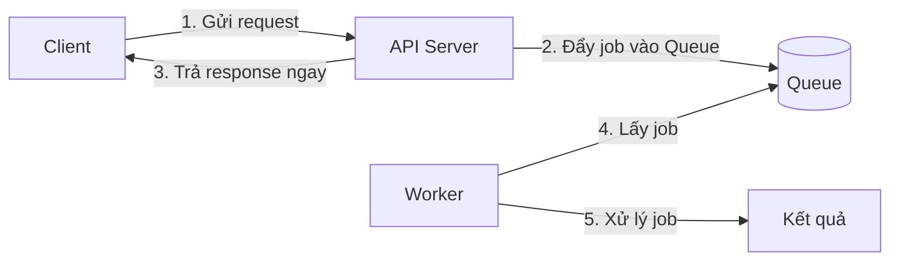
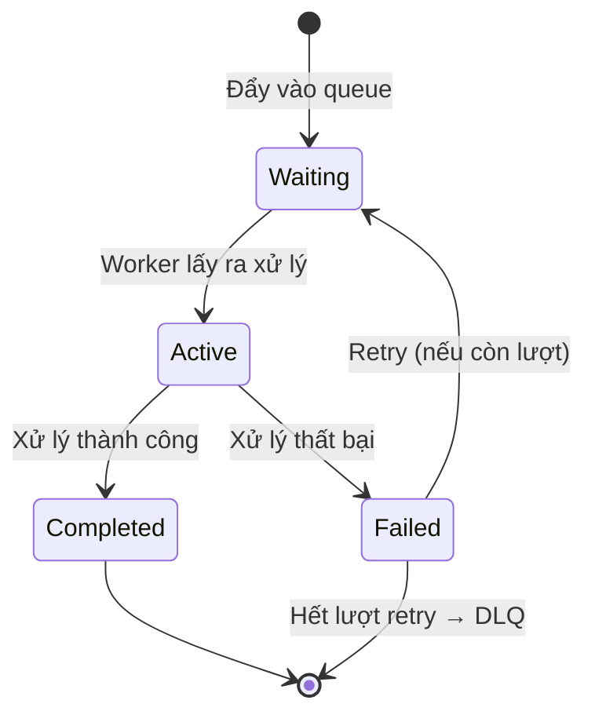
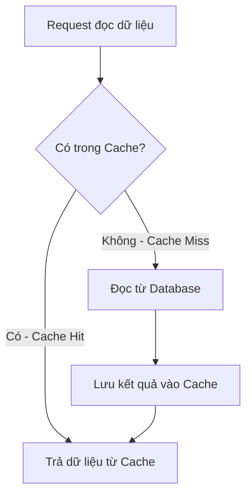
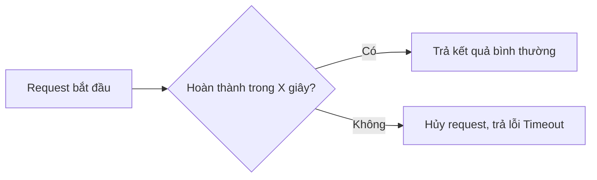
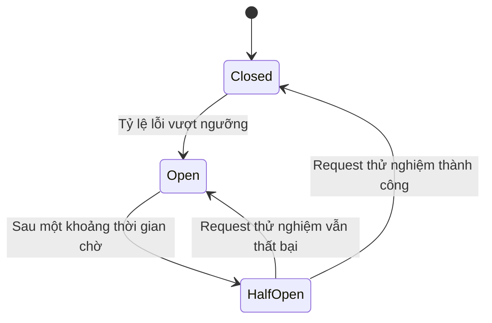

# Chương 7: Backend Operations — Runtime & Reliability

## Giới thiệu

Chương 6 tập trung vào việc **xử lý dữ liệu đúng**. Chương này chuyển sang một câu hỏi khác, không kém phần quan trọng: **làm sao để hệ thống tiếp tục hoạt động ổn định khi chạy thật, trong thời gian dài, dưới tải thực tế và trước những thành phần phụ thuộc không đáng tin cậy** (database chậm, API bên thứ ba sập, lượng truy cập tăng đột biến)? Đây là nhóm kỹ thuật thuộc phạm trù **reliability engineering** — không làm hệ thống "làm được nhiều việc hơn", mà làm hệ thống "không sụp đổ khi có sự cố". Đây là hai trong số các chương quan trọng nhất của tài liệu vì phần lớn sự cố production không đến từ logic sai, mà đến từ việc thiếu các cơ chế phòng vệ được trình bày dưới đây.

---

## 7.1. Queue (Hàng đợi)

### 7.1.1. Bản chất

Trong mô hình xử lý thông thường, khi client gửi request, server phải xử lý xong toàn bộ công việc **rồi mới trả response**. Vấn đề nảy sinh khi công việc đó tốn nhiều thời gian (gửi email, xử lý video, gọi API bên thứ ba chậm): client phải chờ lâu, và nếu nhiều request cùng lúc yêu cầu công việc nặng, server dễ bị quá tải.

**Queue** giải quyết vấn đề này bằng một ý tưởng cốt lõi: **tách rời thời điểm một công việc được yêu cầu khỏi thời điểm nó thực sự được xử lý**. Thay vì xử lý ngay, server chỉ ghi nhận "công việc cần làm" vào một hàng đợi và trả response ngay lập tức; một tiến trình riêng biệt (worker) sẽ lấy công việc ra khỏi hàng đợi và xử lý dần, độc lập với luồng xử lý request ban đầu. Đây gọi là xử lý **bất đồng bộ (asynchronous)**, đối lập với xử lý đồng bộ.



**Lợi ích cốt lõi:**

- **Giảm độ trễ cảm nhận được** của client (không phải chờ công việc nặng hoàn tất).
- **San bằng tải (load leveling)**: khi lượng request tăng đột biến, các job chỉ xếp hàng chờ thay vì làm sập worker; worker xử lý theo tốc độ ổn định của chính nó.
- **Tách rời (decoupling)**: producer (nơi tạo job) và consumer (nơi xử lý job) không cần biết về nhau, có thể mở rộng độc lập.

### 7.1.2. BullMQ trong NestJS

BullMQ là thư viện quản lý Queue phổ biến cho Node.js, sử dụng Redis làm nơi lưu trữ hàng đợi, được NestJS hỗ trợ chính thức qua `@nestjs/bullmq`.

```ts
// mail.module.ts
@Module({
  imports: [
    BullModule.registerQueue({
      name: 'mail-queue',
    }),
  ],
})
export class MailModule {}
```

```ts
// mail.service.ts — nơi đẩy job vào queue (Producer)
@Injectable()
export class MailService {
  constructor(@InjectQueue('mail-queue') private mailQueue: Queue) {}

  async sendWelcomeEmail(userId: string) {
    await this.mailQueue.add('welcome-email', { userId });
    // trả về ngay, không chờ email gửi xong
  }
}
```

```ts
// mail.processor.ts — nơi xử lý job (Consumer/Worker)
@Processor('mail-queue')
export class MailProcessor extends WorkerHost {
  async process(job: Job): Promise<void> {
    const { userId } = job.data;
    // thực hiện gửi email — có thể mất vài giây
  }
}
```

### 7.1.3. Job

**Job** là đơn vị công việc được đưa vào Queue, gồm dữ liệu cần thiết để worker biết cần làm gì (ví dụ: `userId` để biết gửi email cho ai). Mỗi Job có trạng thái vòng đời riêng:



### 7.1.4. Retry trong Queue

Đây là ứng dụng trực tiếp của khái niệm Retry đã học ở Chương 6, nhưng được quản lý sẵn bởi cơ chế Queue thay vì tự viết thủ công:

```ts
await this.mailQueue.add(
  'welcome-email',
  { userId },
  {
    attempts: 5, // Max Retry
    backoff: { type: 'exponential', delay: 1000 }, // Exponential Backoff
  },
);
```

### 7.1.5. Dead Letter Queue (DLQ)

Khi một Job đã thất bại **vượt quá số lần retry cho phép**, việc để nó biến mất là rất rủi ro vì có thể liên quan đến nghiệp vụ quan trọng (ví dụ: job trừ tiền thất bại liên tục). **Dead Letter Queue** là một hàng đợi riêng biệt, nơi các job "chết" (không thể xử lý thành công) được chuyển đến để **lưu giữ lại**, thay vì bị xóa bỏ.

Bản chất của DLQ là biến một lỗi tự động thất bại thành một tín hiệu cần **con người can thiệp**: đội vận hành có thể xem lại các job trong DLQ, tìm nguyên nhân gốc, sửa lỗi rồi đẩy job trở lại hàng đợi chính để xử lý lại, thay vì để dữ liệu quan trọng "mất tích" trong im lặng.

---

## 7.2. Cron Job

### 7.2.1. Bản chất

Không phải mọi công việc đều được kích hoạt bởi request của người dùng. Nhiều tác vụ cần chạy **theo một lịch trình cố định, độc lập với hành vi người dùng** — dọn dẹp dữ liệu tạm mỗi đêm, gửi báo cáo tổng hợp hàng tuần, kiểm tra và hủy các đơn hàng chưa thanh toán sau một khoảng thời gian... **Cron Job** là cơ chế thực thi tác vụ tự động theo lịch trình định trước, đặt tên theo cú pháp lịch biểu Unix Cron truyền thống.

### 7.2.2. Cron Job trong NestJS

```ts
@Injectable()
export class CleanupService {
  @Cron('0 0 * * *') // chạy vào 00:00 mỗi ngày
  async cleanupExpiredSessions() {
    await this.sessionRepository.deleteExpired();
  }
}
```

**Lưu ý quan trọng khi triển khai thực tế**: nếu ứng dụng chạy nhiều instance (scale ngang, đã đề cập ở Chương 3), Cron Job mặc định sẽ chạy **trên từng instance riêng biệt** — dẫn đến tác vụ bị thực thi trùng lặp nhiều lần cùng lúc. Cần có cơ chế khóa phân tán (distributed lock) hoặc chỉ định một instance duy nhất chịu trách nhiệm chạy cron để tránh trùng lặp.

---

## 7.3. Cache

### 7.3.1. Bản chất

Cache dựa trên một quan sát thực tế: phần lớn hệ thống có tính chất **đọc nhiều hơn ghi rất nhiều lần**, và cùng một dữ liệu thường được nhiều người truy vấn lặp đi lặp lại trong khoảng thời gian ngắn. Nếu mỗi lần đọc đều phải truy vấn database (vốn chậm hơn nhiều so với việc đọc từ bộ nhớ), hệ thống sẽ lãng phí tài nguyên lặp lại cùng một công việc.

**Cache** là việc lưu trữ tạm thời kết quả của một thao tác tốn kém (truy vấn database, gọi API ngoài, tính toán phức tạp) ở một nơi truy xuất nhanh hơn (thường là bộ nhớ, ví dụ Redis), để những lần yêu cầu sau **không cần lặp lại công việc tốn kém đó**.

### 7.3.2. Cache Aside Pattern

Đây là mô hình cache phổ biến nhất, trong đó **tầng ứng dụng** (không phải database) chịu trách nhiệm quản lý việc đọc/ghi cache.



```ts
async getProduct(id: string): Promise<Product> {
  const cached = await this.cacheManager.get<Product>(`product:${id}`);
  if (cached) return cached; // Cache Hit

  const product = await this.productRepo.findOne(id); // Cache Miss
  await this.cacheManager.set(`product:${id}`, product, { ttl: 3600 });
  return product;
}
```

**Bản chất của tên gọi "Aside"**: cache nằm "bên cạnh" (aside) luồng xử lý chính chứ không nằm giữa client và database một cách trong suốt — ứng dụng phải chủ động kiểm tra, đọc, ghi cache ở từng bước.

### 7.3.3. TTL (Time To Live)

**TTL** là khoảng thời gian một mục dữ liệu được phép tồn tại trong cache trước khi tự động bị xóa. Đây là cơ chế cân bằng cốt lõi của cache: TTL càng dài, tỷ lệ Cache Hit càng cao (hiệu năng tốt hơn) nhưng dữ liệu càng dễ **cũ** so với database gốc; TTL càng ngắn, dữ liệu càng mới nhưng hiệu quả cache giảm.

### 7.3.4. Cache Invalidation

**Cache Invalidation** là việc chủ động làm mất hiệu lực (xóa hoặc cập nhật) một mục trong cache **ngay khi** dữ liệu gốc trong database thay đổi, thay vì chờ TTL hết hạn tự nhiên — để tránh tình trạng cache trả về dữ liệu đã lỗi thời (stale data) trong suốt thời gian còn lại của TTL.

```ts
async updateProduct(id: string, dto: UpdateProductDto) {
  const updated = await this.productRepo.update(id, dto);
  await this.cacheManager.del(`product:${id}`); // Invalidation
  return updated;
}
```

> Đây được xem là một trong những bài toán khó nhất của backend — có câu nói nổi tiếng trong giới lập trình: *"chỉ có hai việc khó trong khoa học máy tính: cache invalidation và đặt tên biến"*. Nguyên nhân là vì hệ thống càng lớn, càng nhiều nơi có thể làm thay đổi cùng một dữ liệu, khiến việc đảm bảo *mọi* nơi thay đổi đều đồng thời xóa đúng cache liên quan trở nên rất dễ sai sót.

---

## 7.4. Rate Limiting

### 7.4.1. Bản chất

**Rate Limiting** là cơ chế giới hạn số lượng request mà một client (theo IP, theo user, theo API key...) được phép gửi trong một khoảng thời gian nhất định. Bản chất của Rate Limiting là **bảo vệ tài nguyên hữu hạn của hệ thống khỏi bị một (hoặc một nhóm nhỏ) client tiêu thụ quá mức**, dù là do tấn công có chủ đích (brute-force, DDoS) hay đơn giản chỉ là lỗi lập trình phía client (gọi API trong vòng lặp vô tình).

### 7.4.2. Triển khai trong NestJS

```ts
import { ThrottlerModule } from '@nestjs/throttler';

@Module({
  imports: [
    ThrottlerModule.forRoot([{ ttl: 60000, limit: 100 }]), // tối đa 100 request/phút
  ],
})
export class AppModule {}
```

Khi vượt giới hạn, server trả về mã lỗi `429 Too Many Requests` — đây chính là một trong các mã lỗi **Retryable** đã đề cập ở Chương 6, ngầm báo cho client biết nên chờ và thử lại sau, không phải lỗi vĩnh viễn.

---

## 7.5. Timeout

### 7.5.1. Bản chất

Trong một hệ thống backend, hầu hết các thao tác đều phụ thuộc vào một thành phần khác (database, API bên thứ ba, service nội bộ khác). Nếu thành phần đó bị treo hoặc phản hồi cực kỳ chậm, mà bản thân request không có giới hạn thời gian chờ, thì **tài nguyên xử lý request đó (luồng, kết nối) sẽ bị chiếm giữ vô thời hạn** — dần dần làm cạn kiệt tài nguyên của toàn hệ thống dù bản thân lỗi chỉ xảy ra ở một thành phần phụ thuộc.

**Timeout** là việc chủ động đặt ra một giới hạn thời gian tối đa cho một thao tác; nếu vượt quá thời gian đó, thao tác sẽ bị hủy và trả về lỗi ngay, thay vì tiếp tục chờ vô thời hạn.



```ts
const response = await firstValueFrom(
  this.httpService.get(url).pipe(timeout(5000)), // hủy nếu quá 5 giây
);
```

**Bản chất then chốt**: Timeout không giúp thao tác chạy nhanh hơn — nó chỉ đảm bảo hệ thống **thất bại nhanh (fail fast)** thay vì chờ đợi vô ích, giải phóng tài nguyên để phục vụ các request khác. Lỗi timeout thường là lỗi Retryable (Chương 6), vì nguyên nhân có thể chỉ là chậm tạm thời.

---

## 7.6. Circuit Breaker

### 7.6.1. Bản chất

Timeout giải quyết vấn đề cho **một request đơn lẻ**, nhưng nếu một service phụ thuộc đã sập hoàn toàn, việc **mỗi request mới vẫn cứ thử gọi rồi lại chờ đến khi timeout** vẫn rất lãng phí tài nguyên — hàng nghìn request cùng chờ timeout, làm chậm toàn hệ thống dù kết quả gần như chắc chắn thất bại.

**Circuit Breaker (bộ ngắt mạch)**, lấy cảm hứng từ cầu dao điện, giải quyết vấn đề này bằng cách **ghi nhớ rằng một service đang gặp sự cố** và tạm thời **ngừng gọi đến nó hoàn toàn** trong một khoảng thời gian, trả lỗi ngay lập tức mà không cần thử — cho đến khi có dấu hiệu cho thấy service đó đã hồi phục.

### 7.6.2. Ba trạng thái của Circuit Breaker



| Trạng thái | Ý nghĩa |
|---|---|
| **Closed** (đóng) | Hoạt động bình thường, mọi request được gọi trực tiếp đến service đích |
| **Open** (mở) | Đã phát hiện quá nhiều lỗi liên tiếp — mọi request bị chặn và trả lỗi ngay lập tức, không gọi đến service đích nữa |
| **Half-Open** (bán mở) | Sau một khoảng thời gian chờ, cho phép một vài request thử nghiệm đi qua để kiểm tra xem service đã hồi phục chưa |

**So sánh Circuit Breaker và Retry:**

| Tiêu chí | Retry | Circuit Breaker |
|---|---|---|
| Mục tiêu | Giúp **một** request cụ thể vượt qua lỗi tạm thời | Bảo vệ **toàn hệ thống** khỏi việc liên tục gọi vào một service đã biết là đang sập |
| Hành vi khi lỗi kéo dài | Tiếp tục thử lại đến khi hết Max Retry | Ngừng gọi hoàn toàn, trả lỗi ngay để tiết kiệm tài nguyên |
| Mối quan hệ | Áp dụng cho từng request | Thường bao bọc bên ngoài, kiểm soát hành vi retry ở cấp hệ thống |

Trong thực tế, Retry và Circuit Breaker thường được dùng **kết hợp**: Retry xử lý lỗi thoáng qua, còn Circuit Breaker ngăn Retry biến thành một cơn bão request vô ích khi lỗi không phải là tạm thời mà là sự cố kéo dài.

---

## 7.7. Logging

### 7.7.1. Bản chất

Một hệ thống backend khi chạy thật là một **hộp đen** đối với đội vận hành — không ai có thể "nhìn" trực tiếp vào luồng xử lý bên trong khi sự cố xảy ra. **Logging** là việc chủ động ghi lại các sự kiện quan trọng xảy ra trong hệ thống thành dữ liệu có thể xem lại sau, biến hộp đen đó thành thứ có thể quan sát và truy vết được.

### 7.7.2. Các cấp độ Log phổ biến

| Cấp độ | Khi dùng |
|---|---|
| `ERROR` | Lỗi nghiêm trọng, cần chú ý ngay |
| `WARN` | Tình huống bất thường nhưng chưa gây lỗi |
| `INFO` | Sự kiện quan trọng trong luồng nghiệp vụ bình thường |
| `DEBUG` | Thông tin chi tiết phục vụ việc gỡ lỗi trong môi trường phát triển |

### 7.7.3. Nguyên tắc log hiệu quả

- Ghi log dưới dạng **có cấu trúc** (structured, thường là JSON) thay vì chuỗi văn bản tự do, để có thể tìm kiếm và phân tích tự động bằng công cụ.
- Luôn gắn kèm **request ID** (hoặc trace ID) xuyên suốt một request, giúp lần theo toàn bộ hành trình xử lý của một request cụ thể qua nhiều service.
- **Không** log các dữ liệu nhạy cảm (mật khẩu, token, thông tin thẻ thanh toán).

```ts
this.logger.log({
  message: 'Đơn hàng được tạo thành công',
  requestId: req.id,
  orderId: order.id,
  userId: user.id,
});
```

---

## 7.8. Error Handling

### 7.8.1. Bản chất

Lỗi trong một hệ thống backend là điều **không thể tránh khỏi**, không phải điều "không nên xảy ra". Error Handling không phải là việc ngăn lỗi xảy ra, mà là việc thiết kế để khi lỗi xảy ra, hệ thống **phản ứng theo một cách nhất quán, dễ đoán, và không làm lộ thông tin nội bộ nhạy cảm** ra bên ngoài.

### 7.8.2. Xử lý tập trung với Exception Filter

Đã giới thiệu ở Chương 5, Exception Filter cho phép xử lý lỗi **tập trung tại một nơi**, thay vì mỗi Controller tự viết logic `try-catch` riêng lẻ và định dạng response lỗi không đồng nhất.

```ts
@Catch()
export class GlobalExceptionFilter implements ExceptionFilter {
  catch(exception: unknown, host: ArgumentsHost) {
    const response = host.switchToHttp().getResponse();
    const status =
      exception instanceof HttpException ? exception.getStatus() : 500;
    const message =
      exception instanceof HttpException
        ? exception.message
        : 'Đã xảy ra lỗi hệ thống'; // không lộ chi tiết lỗi nội bộ ra ngoài

    response.status(status).json({
      statusCode: status,
      message,
      timestamp: new Date().toISOString(),
    });
  }
}
```

### 7.8.3. Phân loại lỗi

| Loại lỗi | Ví dụ | Nguồn gốc |
|---|---|---|
| **Lỗi nghiệp vụ (Expected)** | Số dư không đủ, dữ liệu không hợp lệ | Được dự đoán trước, xử lý bằng exception có kiểm soát (`BadRequestException`...) |
| **Lỗi hệ thống (Unexpected)** | Database mất kết nối, lỗi lập trình | Không lường trước, cần log chi tiết để điều tra, nhưng trả về client một thông báo chung chung |

Việc phân biệt hai loại lỗi này giúp trả về response phù hợp: lỗi nghiệp vụ nên có thông báo rõ ràng để client hiển thị cho người dùng, còn lỗi hệ thống chỉ nên hiển thị thông báo an toàn, chi tiết thật sự được ghi vào log nội bộ.

---

## 7.9. Monitoring & Health Check

### 7.9.1. Bản chất

Logging giúp điều tra **sau khi** sự cố đã xảy ra. **Monitoring (giám sát)** hướng đến mục tiêu cao hơn: **phát hiện sự cố trước hoặc ngay khi nó bắt đầu xảy ra**, thông qua việc theo dõi liên tục các chỉ số phản ánh "sức khỏe" của hệ thống trong thời gian thực — thay vì đợi người dùng report lỗi.

Các chỉ số giám sát phổ biến thường xoay quanh mô hình "Golden Signals": **Latency** (độ trễ phản hồi), **Traffic** (lưu lượng request), **Errors** (tỷ lệ lỗi), **Saturation** (mức độ bão hòa tài nguyên như CPU, RAM).

### 7.9.2. Health Check

**Health Check** là một API endpoint đặc biệt (thường là `/health`) cho phép các hệ thống bên ngoài (Load Balancer, công cụ giám sát, hệ thống điều phối container) kiểm tra nhanh xem ứng dụng có đang hoạt động bình thường hay không, bao gồm cả các thành phần phụ thuộc (database, cache, queue).

```ts
@Controller('health')
export class HealthController {
  constructor(
    private health: HealthCheckService,
    private db: TypeOrmHealthIndicator,
  ) {}

  @Get()
  @HealthCheck()
  check() {
    return this.health.check([() => this.db.pingCheck('database')]);
  }
}
```

**Bản chất then chốt**: Health Check trả lời câu hỏi "*ứng dụng có đang sống và có thể phục vụ request không?*" — đây là điều kiện tiên quyết để Load Balancer (Chương 3) quyết định có nên tiếp tục định tuyến traffic đến instance này hay không, hoặc để hệ thống điều phối tự động khởi động lại instance đang gặp sự cố.

---

## Tổng kết chương

Chương này trình bày các kỹ thuật đảm bảo hệ thống **vận hành ổn định trong thực tế**, không chỉ "chạy đúng về mặt logic". Queue và Cron Job xử lý các công việc không cần phản hồi ngay lập tức. Cache giảm tải cho các thành phần chậm bằng cách tận dụng tính chất đọc nhiều của hệ thống. Rate Limiting, Timeout và Circuit Breaker là ba lớp phòng vệ bảo vệ hệ thống khỏi bị quá tải hoặc bị kéo sập bởi các thành phần phụ thuộc không đáng tin cậy — mỗi kỹ thuật giải quyết một tầng khác nhau của cùng vấn đề "khi có điều gì đó chậm hoặc sập, đừng để nó kéo sập cả hệ thống". Cuối cùng, Logging, Error Handling và Monitoring biến hệ thống từ một hộp đen thành một hệ thống có thể quan sát, chẩn đoán và phục hồi được. Đây chính là những gì phân biệt một hệ thống chỉ "chạy được trên máy cá nhân" với một hệ thống thật sự sẵn sàng cho production.
