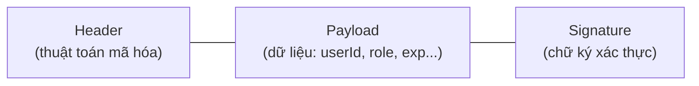
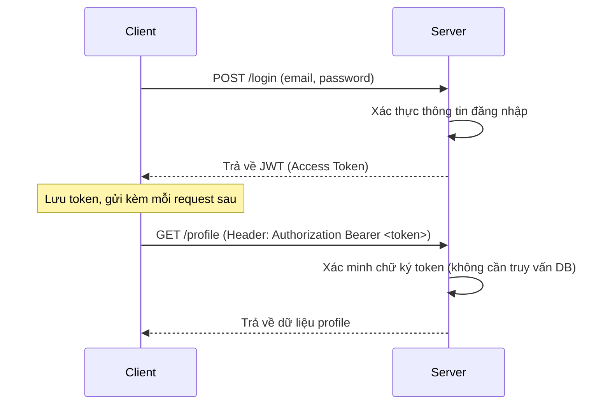
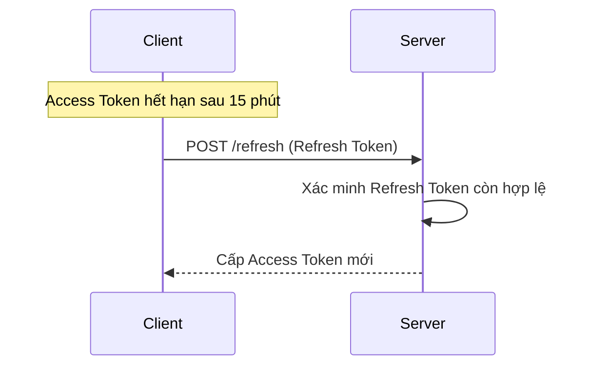
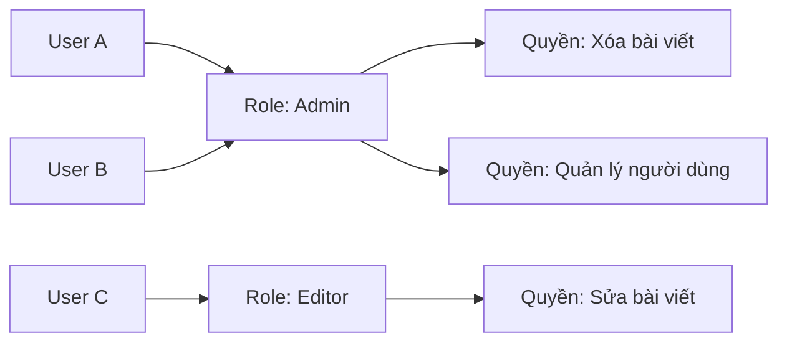
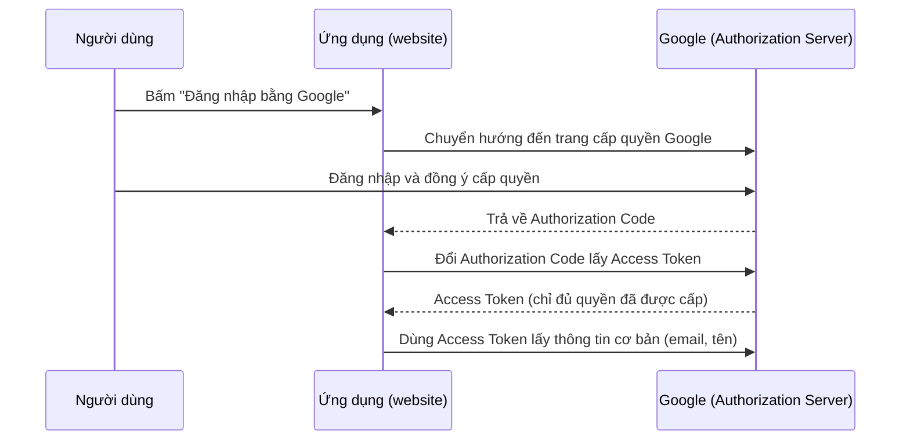
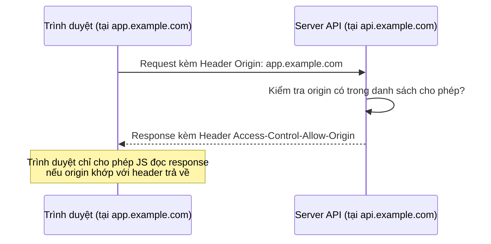
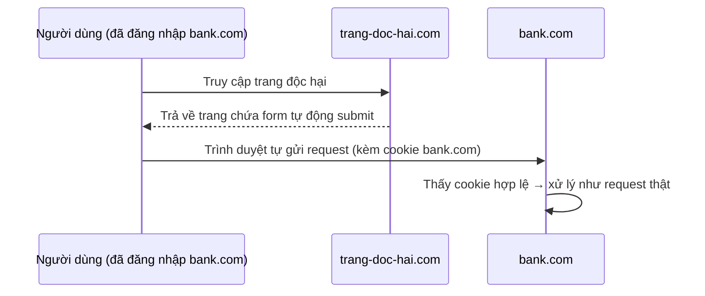

# Chương 8: Security

## Giới thiệu

Nếu các chương trước tập trung vào việc hệ thống xử lý đúng và hoạt động ổn định, chương này trả lời một câu hỏi khác biệt về bản chất: **làm sao đảm bảo chỉ đúng người, đúng quyền, mới có thể thực hiện đúng hành động — và dữ liệu không bị đánh cắp, giả mạo hay thao túng bởi bên thứ ba**. Bảo mật không phải là một tính năng có thể "thêm vào sau", mà là một tập hợp các ràng buộc phải được thiết kế xuyên suốt hệ thống. Chương này trình bày từ nền tảng — xác thực danh tính và phân quyền — đến các lỗ hổng tấn công phổ biến nhất mà mọi backend đều phải phòng vệ.

---

## 8.1. Authentication (Xác thực)

### 8.1.1. Bản chất

**Authentication** trả lời câu hỏi: **"Bạn là ai?"**. Đây là bước xác minh danh tính của một chủ thể (người dùng, hệ thống khác) trước khi cho phép nó tương tác với hệ thống. Về bản chất, authentication luôn dựa trên việc chủ thể chứng minh mình sở hữu một (hoặc nhiều) trong ba loại yếu tố sau:

| Loại yếu tố | Ví dụ | Bản chất |
|---|---|---|
| **Something you know** | Mật khẩu, mã PIN | Thông tin chỉ chủ thể hợp lệ biết |
| **Something you have** | Điện thoại nhận OTP, thiết bị bảo mật | Vật chỉ chủ thể hợp lệ sở hữu |
| **Something you are** | Vân tay, khuôn mặt | Đặc điểm sinh trắc học duy nhất |

Việc kết hợp từ hai yếu tố trở lên (ví dụ: mật khẩu + OTP) gọi là **Multi-Factor Authentication (MFA)** — làm tăng độ khó cho kẻ tấn công vì chiếm đoạt một yếu tố không còn đủ để giả mạo danh tính.

### 8.1.2. Vì sao HTTP cần cơ chế xác thực riêng

Giao thức HTTP vốn **stateless** (đã đề cập ở Chương 2) — mỗi request độc lập, server không tự nhớ ai vừa đăng nhập ở request trước. Vì vậy, sau khi xác thực thành công lần đầu (thường bằng mật khẩu), hệ thống cần một cơ chế để các request tiếp theo **chứng minh lại danh tính mà không cần nhập mật khẩu mỗi lần** — đây chính là vai trò của Token (JWT, mục 8.3) hoặc Session.

---

## 8.2. Authorization (Phân quyền)

### 8.2.1. Bản chất

**Authorization** trả lời một câu hỏi hoàn toàn khác: **"Bạn được phép làm gì?"**. Authorization luôn diễn ra **sau** Authentication — hệ thống phải biết chủ thể là ai trước, rồi mới quyết định chủ thể đó có quyền thực hiện hành động cụ thể đang yêu cầu hay không.

### 8.2.2. Phân biệt Authentication và Authorization

Đây là hai khái niệm bị nhầm lẫn nhiều nhất trong bảo mật backend:

| Tiêu chí | Authentication | Authorization |
|---|---|---|
| Câu hỏi trả lời | Bạn là ai? | Bạn được phép làm gì? |
| Thời điểm | Diễn ra trước | Diễn ra sau, dựa trên kết quả của Authentication |
| Kết quả khi thất bại | `401 Unauthorized` | `403 Forbidden` |
| Ví dụ | Đăng nhập bằng email/mật khẩu | Chỉ `admin` mới được xóa người dùng khác |

Trong NestJS, cả hai thường được triển khai bằng **Guard** (Chương 5): một Guard xác thực token (Authentication), một Guard khác kiểm tra quyền hạn (Authorization) — tách biệt rõ ràng hai mối quan tâm.

---

## 8.3. JWT (JSON Web Token)

### 8.3.1. Bản chất

JWT là giải pháp phổ biến nhất cho bài toán "ghi nhớ trạng thái đăng nhập" trong một giao thức stateless. Thay vì server phải lưu trạng thái đăng nhập của từng người dùng (session lưu ở server), JWT chuyển toàn bộ thông tin xác thực **vào chính token, do client giữ và gửi kèm mỗi request** — server chỉ cần xác minh chữ ký của token là biết token đó có hợp lệ hay không, mà không cần tra cứu lại bất kỳ nơi lưu trữ nào.

Một JWT gồm ba phần, ngăn cách bởi dấu chấm: `header.payload.signature`



**Signature** là phần quan trọng nhất về mặt bảo mật: nó được tạo ra bằng cách mã hóa Header + Payload với một khóa bí mật (secret key) mà chỉ server biết. Nếu ai đó cố sửa đổi payload (ví dụ: đổi `role: "user"` thành `role: "admin"`), chữ ký sẽ không còn khớp và server sẽ từ chối token — đây chính là cơ chế đảm bảo tính toàn vẹn mà không cần tra cứu database.

### 8.3.2. Cách hoạt động



```ts
// auth.service.ts
async login(user: User) {
  const payload = { sub: user.id, role: user.role };
  return {
    accessToken: this.jwtService.sign(payload, { expiresIn: '15m' }),
  };
}
```

```ts
// jwt.strategy.ts
@Injectable()
export class JwtStrategy extends PassportStrategy(Strategy) {
  constructor() {
    super({
      jwtFromRequest: ExtractJwt.fromAuthHeaderAsBearerToken(),
      secretOrKey: process.env.JWT_SECRET,
    });
  }

  validate(payload: any) {
    return { userId: payload.sub, role: payload.role };
  }
}
```

### 8.3.3. Refresh Token

JWT thường được thiết kế có **thời gian sống rất ngắn** (Access Token, ví dụ 15 phút) — nếu token bị đánh cắp, thiệt hại chỉ giới hạn trong khoảng thời gian ngắn đó. Nhưng nếu bắt người dùng đăng nhập lại mỗi 15 phút thì trải nghiệm rất tệ. **Refresh Token** giải quyết mâu thuẫn này: là một token riêng, có thời gian sống dài hơn nhiều (ví dụ 7 ngày), **chỉ dùng cho một mục đích duy nhất — xin cấp lại Access Token mới** khi Access Token cũ hết hạn, mà không cần người dùng nhập lại mật khẩu.



Vì Refresh Token có giá trị lâu dài và quyền hạn cao (có thể sinh ra Access Token mới), nó cần được lưu trữ an toàn hơn (thường ở `HttpOnly Cookie` thay vì `localStorage`, để hạn chế bị đánh cắp qua tấn công XSS — mục 8.9) và có khả năng **thu hồi (revoke)** phía server khi cần (ví dụ khi người dùng đăng xuất hoặc nghi ngờ bị lộ).

---

## 8.4. RBAC (Role-Based Access Control)

### 8.4.1. Bản chất

Nếu Authorization là khái niệm tổng quát, **RBAC** là một mô hình cụ thể để hiện thực hóa nó: thay vì gán quyền hạn trực tiếp cho từng người dùng (không thể quản lý khi có hàng nghìn người dùng), RBAC nhóm các quyền hạn thành **vai trò (Role)**, rồi gán vai trò đó cho người dùng. Việc quản lý quyền hạn trở thành việc quản lý một số lượng nhỏ Role, thay vì quản lý quyền của từng người riêng lẻ.



### 8.4.2. Triển khai với Guard trong NestJS

```ts
// roles.decorator.ts
export const Roles = (...roles: string[]) => SetMetadata('roles', roles);
```

```ts
// roles.guard.ts
@Injectable()
export class RolesGuard implements CanActivate {
  constructor(private reflector: Reflector) {}

  canActivate(context: ExecutionContext): boolean {
    const requiredRoles = this.reflector.get<string[]>('roles', context.getHandler());
    if (!requiredRoles) return true;

    const { user } = context.switchToHttp().getRequest();
    return requiredRoles.includes(user.role);
  }
}
```

```ts
@Roles('admin')
@UseGuards(JwtAuthGuard, RolesGuard)
@Delete(':id')
deleteUser(@Param('id') id: string) {
  return this.userService.delete(id);
}
```

---

## 8.5. OAuth2

### 8.5.1. Bản chất

OAuth2 giải quyết một bài toán khác với Authentication thông thường: **làm sao cho phép một ứng dụng bên thứ ba (ví dụ: một website) truy cập một phần dữ liệu của người dùng trên một hệ thống khác (ví dụ: Google), mà người dùng không cần đưa mật khẩu Google cho website đó**.

Bản chất cốt lõi là cơ chế **ủy quyền (delegation)**: người dùng cấp phép trực tiếp trên hệ thống gốc (Google), hệ thống gốc cấp cho website một **access token có phạm vi giới hạn (scope)**, thay vì để lộ thông tin đăng nhập gốc cho bên thứ ba.



**Lưu ý quan trọng về mặt bản chất**: OAuth2 là giao thức **ủy quyền (Authorization)**, không phải giao thức xác thực thuần túy. Việc dùng OAuth2 để "đăng nhập" (như "Login with Google") thực chất là dùng thông tin được ủy quyền (email, tên) để suy ra danh tính — phần chuẩn hóa việc này gọi là **OpenID Connect**, xây dựng trên nền OAuth2.

---

## 8.6. Password Hashing

### 8.6.1. Bản chất

Mật khẩu người dùng **không bao giờ** được lưu ở dạng văn bản gốc (plain text) trong database — nếu database bị rò rỉ, toàn bộ mật khẩu của người dùng sẽ lộ ngay lập tức. **Password Hashing** là việc biến đổi mật khẩu thành một chuỗi mã hóa **một chiều** (không thể đảo ngược lại thành mật khẩu gốc) trước khi lưu trữ.

Điểm khác biệt cốt lõi so với mã hóa thông thường (encryption): encryption có thể giải mã ngược lại nếu có khóa, còn hashing thì **không thể đảo ngược theo thiết kế** — khi xác thực đăng nhập, hệ thống không "giải mã" hash để lấy lại mật khẩu, mà **hash lại mật khẩu người dùng vừa nhập rồi so sánh hai chuỗi hash với nhau**.

### 8.6.2. Vì sao không dùng hàm hash thông thường (MD5, SHA-256)?

Các hàm hash tổng quát như MD5, SHA-256 được thiết kế để chạy **càng nhanh càng tốt** — điều này lại trở thành điểm yếu khi dùng cho mật khẩu, vì kẻ tấn công có thể thử hàng tỷ mật khẩu mỗi giây (brute-force) để tìm ra chuỗi khớp với hash bị rò rỉ.

**bcrypt** và **argon2** được thiết kế đặc thù cho mật khẩu, với đặc điểm cố ý **chậm và tốn nhiều tài nguyên tính toán**, khiến việc brute-force trở nên cực kỳ tốn kém về thời gian dù kẻ tấn công có phần cứng mạnh. Ngoài ra, cả hai đều tự động thêm **salt** (một chuỗi ngẫu nhiên riêng cho mỗi mật khẩu) trước khi hash, đảm bảo hai người dùng có cùng mật khẩu sẽ cho ra hai chuỗi hash hoàn toàn khác nhau — vô hiệu hóa kiểu tấn công dùng bảng tra cứu hash dựng sẵn (rainbow table).

| Tiêu chí | bcrypt | argon2 |
|---|---|---|
| Năm ra đời | 1999 | 2015 (người thắng cuộc thi Password Hashing Competition) |
| Khả năng chống tấn công bằng GPU/ASIC | Khá tốt | Tốt hơn — thiết kế chống được cả tấn công tốn nhiều bộ nhớ |
| Độ phổ biến | Rất phổ biến, ổn định lâu năm | Ngày càng được khuyến nghị cho hệ thống mới |
| Độ phức tạp cấu hình | Đơn giản | Có nhiều tham số tinh chỉnh hơn (bộ nhớ, độ song song) |

```ts
import * as bcrypt from 'bcrypt';

// Khi đăng ký
const hashedPassword = await bcrypt.hash(plainPassword, 10); // 10 = độ phức tạp (salt rounds)

// Khi đăng nhập
const isMatch = await bcrypt.compare(inputPassword, hashedPassword);
```

---

## 8.7. CORS (Cross-Origin Resource Sharing)

### 8.7.1. Bản chất

Theo mặc định, trình duyệt áp dụng **Same-Origin Policy**: một trang web chỉ được phép gọi API đến **cùng nguồn gốc (origin)** đã tải trang đó (cùng domain, giao thức, cổng). Đây là cơ chế bảo vệ người dùng khỏi việc một trang web độc hại âm thầm gọi API đến một trang web khác mà người dùng đang đăng nhập, để đánh cắp dữ liệu.

**CORS** là cơ chế cho phép server **chủ động khai báo** những origin nào được phép gọi đến API của mình — nới lỏng Same-Origin Policy một cách có kiểm soát, thay vì chặn hoàn toàn mọi request từ nguồn gốc khác.



```ts
// main.ts
app.enableCors({
  origin: ['https://app.example.com'],
  credentials: true,
});
```

**Lưu ý về bản chất**: CORS là cơ chế bảo vệ **được trình duyệt thực thi**, không phải bảo vệ ở phía server. Một request gọi trực tiếp bằng công cụ như `curl` hay Postman sẽ không bị CORS chặn — vì bản chất CORS chỉ kiểm soát việc **JavaScript chạy trên trình duyệt** có được đọc response hay không, chứ không ngăn được request được gửi đi.

---

## 8.8. CSRF (Cross-Site Request Forgery)

### 8.8.1. Bản chất

CSRF khai thác một đặc điểm của trình duyệt: khi gọi request đến một domain, trình duyệt **tự động đính kèm cookie** đã lưu cho domain đó, kể cả khi request được khởi tạo từ một trang web hoàn toàn khác. Kẻ tấn công lợi dụng điều này: dụ người dùng đang đăng nhập vào `bank.com` (có cookie session hợp lệ) truy cập một trang độc hại, trang đó âm thầm gửi request đến `bank.com` (ví dụ form tự động submit lệnh chuyển tiền) — trình duyệt vẫn tự động đính kèm cookie hợp lệ của người dùng, khiến `bank.com` tưởng đây là request hợp lệ từ chính người dùng.



### 8.8.2. Cách phòng chống

- **CSRF Token**: server sinh ra một token ngẫu nhiên, nhúng vào form; các thao tác ghi dữ liệu phải gửi kèm token này. Vì trang độc hại không thể đọc được token (do Same-Origin Policy), nó không thể giả mạo request hợp lệ.
- **SameSite Cookie**: khai báo cookie với thuộc tính `SameSite=Strict` hoặc `Lax`, khiến trình duyệt **không tự động gửi cookie** khi request được khởi tạo từ một domain khác — đây là giải pháp hiện đại, đơn giản và được khuyến nghị hàng đầu hiện nay.

---

## 8.9. XSS (Cross-Site Scripting)

### 8.9.1. Bản chất

XSS xảy ra khi ứng dụng **hiển thị lại dữ liệu do người dùng nhập vào mà không kiểm soát**, cho phép kẻ tấn công chèn mã JavaScript độc hại vào trang web, khiến mã đó được **thực thi trong trình duyệt của nạn nhân khác** dưới danh nghĩa của trang web hợp lệ. Vì đoạn mã chạy trong ngữ cảnh của trang thật, nó có thể đọc cookie, giả mạo hành động, hoặc đánh cắp token của nạn nhân.

Ví dụ: một bình luận chứa `<script>gửi cookie đến server của kẻ tấn công</script>` — nếu hệ thống hiển thị nguyên văn nội dung này cho người dùng khác mà không xử lý, đoạn script sẽ tự động chạy trong trình duyệt của họ.

### 8.9.2. Cách phòng chống

- **Escape/Sanitize dữ liệu đầu ra**: chuyển các ký tự đặc biệt (`<`, `>`, `&`...) thành dạng ký tự HTML an toàn trước khi hiển thị, để trình duyệt hiểu đó là văn bản thuần chứ không phải mã thực thi.
- **Content Security Policy (CSP)**: header HTTP cho phép khai báo rõ nguồn nào được phép chạy script trên trang, hạn chế thiệt hại kể cả khi có đoạn mã độc lọt qua.
- Hầu hết framework frontend hiện đại (React, Angular) **tự động escape** dữ liệu khi render, giúp giảm đáng kể rủi ro XSS nếu không cố tình sử dụng các API "render HTML thô" (`dangerouslySetInnerHTML`...).

---

## 8.10. SQL Injection

### 8.10.1. Bản chất

SQL Injection xảy ra khi ứng dụng **nối chuỗi dữ liệu đầu vào của người dùng trực tiếp vào câu lệnh SQL**, khiến kẻ tấn công có thể chèn thêm cú pháp SQL để thay đổi hoàn toàn ý nghĩa của câu truy vấn gốc.

Ví dụ câu lệnh nguy hiểm:

```ts
// KHÔNG AN TOÀN — nối chuỗi trực tiếp
const query = `SELECT * FROM users WHERE email = '${email}'`;
```

Nếu kẻ tấn công nhập `email` là `' OR '1'='1`, câu lệnh thực tế trở thành:

```sql
SELECT * FROM users WHERE email = '' OR '1'='1'
```

Điều kiện `'1'='1'` luôn đúng, khiến câu lệnh trả về **toàn bộ** người dùng trong bảng thay vì một người dùng cụ thể — kẻ tấn công có thể dùng kỹ thuật tương tự để đọc trộm, sửa, hoặc xóa dữ liệu tùy ý.

### 8.10.2. Cách phòng chống

Giải pháp cốt lõi là **Parameterized Query (câu lệnh tham số hóa)**: dữ liệu đầu vào được truyền như một **tham số riêng biệt**, không bao giờ được nối trực tiếp vào chuỗi câu lệnh SQL — database engine xử lý tham số này thuần túy như dữ liệu, không bao giờ diễn giải nó như cú pháp SQL.

```ts
// AN TOÀN — dữ liệu truyền như tham số riêng
const query = 'SELECT * FROM users WHERE email = $1';
await client.query(query, [email]);
```

**Đây là lý do ORM (Chương 4) giúp giảm đáng kể rủi ro SQL Injection**: khi dùng ORM đúng cách (ví dụ `prisma.user.findFirst({ where: { email } })`), thư viện tự động sử dụng parameterized query ở tầng dưới, lập trình viên không có cơ hội vô tình nối chuỗi SQL thủ công.

---

## 8.11. Helmet

### 8.11.1. Bản chất

Nhiều lỗ hổng bảo mật web không đến từ lỗi logic nghiệp vụ, mà từ việc **thiếu các HTTP Header bảo mật cơ bản** mà trình duyệt dựa vào để tự bảo vệ người dùng (ví dụ: ngăn trang web bị nhúng vào iframe của trang độc hại, ép buộc kết nối HTTPS). **Helmet** là middleware giúp tự động thiết lập một tập hợp các header bảo mật này theo cấu hình mặc định đã được khuyến nghị, thay vì lập trình viên phải tự nhớ và cấu hình từng header thủ công.

```ts
// main.ts
import helmet from 'helmet';

app.use(helmet());
```

Một số header tiêu biểu mà Helmet thiết lập: `X-Content-Type-Options` (ngăn trình duyệt tự đoán sai kiểu file), `X-Frame-Options` (ngăn tấn công kiểu nhúng iframe - clickjacking), `Strict-Transport-Security` (ép buộc dùng HTTPS).

---

## Tổng kết chương

Chương này trình bày hai trụ cột và bốn nhóm lỗ hổng cốt lõi của bảo mật backend. Authentication và Authorization là hai câu hỏi khác nhau về bản chất — "bạn là ai" và "bạn được làm gì" — được hiện thực hóa qua JWT (xác thực không trạng thái), RBAC (quản lý quyền theo vai trò) và OAuth2 (ủy quyền cho bên thứ ba). Bốn lỗ hổng CSRF, XSS, SQL Injection và vấn đề CORS đều có chung một bản chất: chúng khai thác **ranh giới tin cậy bị mờ nhạt** — giữa dữ liệu người dùng nhập và mã lệnh được thực thi (XSS, SQL Injection), giữa request hợp lệ và request bị giả mạo (CSRF), hoặc giữa các nguồn gốc khác nhau được phép truy cập lẫn nhau (CORS). Hiểu rõ bản chất này, thay vì chỉ nhớ cách phòng chống, giúp lập trình viên nhận diện được các biến thể tấn công mới chưa từng gặp trước đó.
