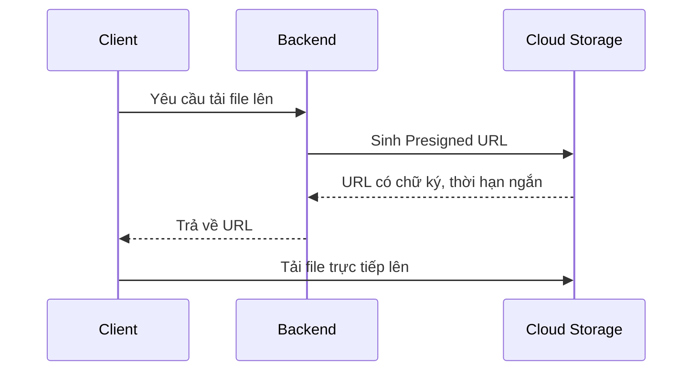
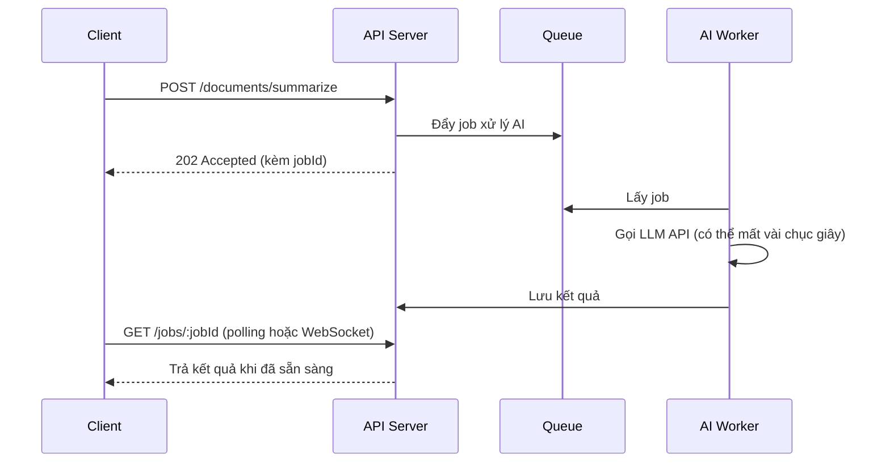

# Chương 9: Backend Common Features

## Giới thiệu

Chương này tổng hợp các tính năng và mảng kiến thức xuất hiện lặp đi lặp lại trong hầu hết hệ thống backend thực tế, bất kể lĩnh vực nghiệp vụ cụ thể là gì: thao tác dữ liệu qua ORM, tải file lên, nhận thông báo từ hệ thống bên ngoài, giao tiếp thời gian thực, phân trang, xóa mềm, ghi vết thao tác, tài liệu hóa API, tích hợp AI, và quản lý cấu hình theo môi trường triển khai. Đây đều là những bài toán đã có **mẫu giải pháp chuẩn (pattern)** được cộng đồng đúc kết qua thời gian — hiểu đúng bản chất giúp tránh việc "phát minh lại bánh xe" theo cách kém an toàn hoặc kém hiệu quả hơn.

---

## 9.1. ORM chuyên sâu: Prisma và TypeORM

### 9.1.1. Nhắc lại bản chất ORM

Chương 4 đã trình bày khái niệm ORM ở mức tổng quát: ánh xạ giữa đối tượng trong code và bảng trong database, cùng với N+1 Query Problem và Migration. Phần này đi sâu vào cách **áp dụng thực tế trong NestJS** với hai lựa chọn phổ biến nhất, phân tích kỹ triết lý thiết kế đằng sau mỗi công cụ — vì hiểu triết lý mới giúp chọn đúng công cụ cho đúng dự án, thay vì chọn theo trào lưu.

### 9.1.2. Prisma — Triết lý "Schema là nguồn chân lý duy nhất"

**Bản chất thiết kế**: Prisma tách biệt hoàn toàn việc **định nghĩa cấu trúc dữ liệu** ra khỏi code TypeScript, đặt vào một file khai báo riêng (`schema.prisma`), viết bằng một ngôn ngữ mô tả (DSL) riêng của Prisma. Từ file này, Prisma **tự động sinh ra** toàn bộ client TypeScript với type an toàn tuyệt đối — nghĩa là nếu schema định nghĩa `email: String`, mọi nơi trong code thao tác với trường này đều được kiểm tra kiểu dữ liệu ngay từ lúc biên dịch, không cần lập trình viên tự viết type thủ công.

```prisma
// schema.prisma
model User {
  id        Int      @id @default(autoincrement())
  email     String   @unique
  name      String?
  posts     Post[]
  createdAt DateTime @default(now())
}

model Post {
  id       Int    @id @default(autoincrement())
  title    String
  authorId Int
  author   User   @relation(fields: [authorId], references: [id])
}
```

```ts
// prisma.service.ts — khởi tạo Prisma Client trong NestJS
@Injectable()
export class PrismaService extends PrismaClient implements OnModuleInit {
  async onModuleInit() {
    await this.$connect();
  }

  async onModuleDestroy() {
    await this.$disconnect();
  }
}
```

```ts
// user.service.ts
@Injectable()
export class UserService {
  constructor(private prisma: PrismaService) {}

  findOne(id: number) {
    return this.prisma.user.findUnique({
      where: { id },
      include: { posts: true }, // eager loading — tránh N+1 (Chương 4)
    });
  }

  async createWithPost(email: string, title: string) {
    // Nested write — Prisma tự gộp thành một transaction
    return this.prisma.user.create({
      data: {
        email,
        posts: { create: [{ title }] },
      },
    });
  }
}
```

**Quản lý Migration với Prisma**:

```bash
npx prisma migrate dev --name add_user_table   # tạo migration mới từ thay đổi schema
npx prisma migrate deploy                       # áp dụng migration ở môi trường production
npx prisma generate                              # sinh lại Prisma Client sau khi schema thay đổi
```

Bản chất của lệnh `migrate dev` là: Prisma **so sánh** schema hiện tại với trạng thái database, tự động sinh ra file SQL migration tương ứng — lập trình viên hiếm khi phải viết SQL migration thủ công.

### 9.1.3. TypeORM — Triết lý "Entity là code, code là nguồn chân lý"

**Bản chất thiết kế**: khác với Prisma, TypeORM không có file schema riêng biệt — cấu trúc dữ liệu được định nghĩa **trực tiếp bằng class TypeScript**, sử dụng decorator, theo đúng tinh thần OOP đã trình bày ở Chương 2. Đây là mô hình gần gũi hơn với các ORM truyền thống ở những ngôn ngữ hướng đối tượng khác (Hibernate của Java, Entity Framework của .NET).

```ts
// user.entity.ts
@Entity()
export class User {
  @PrimaryGeneratedColumn()
  id: number;

  @Column({ unique: true })
  email: string;

  @Column({ nullable: true })
  name: string;

  @OneToMany(() => Post, (post) => post.author)
  posts: Post[];

  @CreateDateColumn()
  createdAt: Date;
}
```

```ts
// user.service.ts
@Injectable()
export class UserService {
  constructor(
    @InjectRepository(User)
    private userRepository: Repository<User>,
  ) {}

  findOne(id: number) {
    return this.userRepository.findOne({
      where: { id },
      relations: ['posts'], // eager loading tương đương include của Prisma
    });
  }
}
```

TypeORM hỗ trợ hai phong cách truy cập dữ liệu, phản ánh hai Design Pattern khác nhau đã học ở Chương 2:

- **Active Record**: bản thân Entity có sẵn phương thức thao tác dữ liệu (`user.save()`) — Entity vừa là dữ liệu vừa là hành vi (đúng tinh thần Encapsulation thuần túy).
- **Data Mapper** (qua `Repository<T>`, cách dùng phổ biến hơn trong NestJS): tách biệt hoàn toàn Entity (chỉ chứa dữ liệu) khỏi logic truy vấn (nằm trong Repository) — phù hợp trực tiếp với Repository Pattern đã trình bày ở Chương 2 và 3.

**Quản lý Migration với TypeORM**:

```bash
npm run typeorm migration:generate -- -n AddUserTable   # sinh migration từ thay đổi Entity
npm run typeorm migration:run                             # áp dụng migration
```

### 9.1.4. So sánh chi tiết Prisma và TypeORM

| Tiêu chí | Prisma | TypeORM |
|---|---|---|
| Nơi định nghĩa dữ liệu | File `schema.prisma` riêng, ngôn ngữ khai báo riêng | Class Entity bằng TypeScript, dùng decorator |
| Type Safety | Rất cao — type được sinh tự động, luôn khớp 100% với schema | Khá tốt, nhưng phụ thuộc vào cách khai báo Entity, dễ lệch nếu thao tác thủ công |
| Cú pháp truy vấn | Riêng biệt, gần với ngôn ngữ tự nhiên (`findUnique`, `findMany`) | Gần với SQL hơn (Query Builder), hoặc qua Repository API |
| Xử lý quan hệ (relation) | Khai báo rõ ràng trong schema, nested write/read trực quan | Linh hoạt, hỗ trợ nhiều kiểu quan hệ phức tạp hơn |
| Công cụ Migration | `prisma migrate` — tự động sinh SQL migration từ diff schema | Có hỗ trợ, nhưng cấu hình và luồng làm việc phức tạp hơn |
| Công cụ hỗ trợ trực quan | Prisma Studio — giao diện xem/sửa dữ liệu trực tiếp | Không có công cụ tương đương chính thức |
| Độ trưởng thành & hệ sinh thái | Mới hơn (từ 2019), phát triển rất nhanh, cộng đồng lớn | Lâu đời hơn (từ 2016), tích hợp sâu, quen thuộc với dev có nền tảng Java/.NET |
| Đường cong học tập | Thấp hơn — cú pháp trực quan, tài liệu rõ ràng | Cao hơn — cần hiểu rõ khái niệm Repository, Entity Manager, QueryBuilder |

### 9.1.5. Khi nào chọn cái nào?

- **Chọn Prisma** khi: bắt đầu dự án mới, đội ngũ ưu tiên type safety tối đa và tốc độ phát triển, không có nhiều kinh nghiệm ORM trước đó.
- **Chọn TypeORM** khi: đội ngũ đã quen thuộc với mô hình Entity/Repository truyền thống (đặc biệt nếu có nền tảng Java Hibernate hoặc .NET Entity Framework), cần các tính năng truy vấn phức tạp mà TypeORM linh hoạt hơn, hoặc dự án đã dùng TypeORM từ trước.

### 9.1.6. Transaction với ORM — nhắc lại và mở rộng

Đây là ứng dụng trực tiếp của ACID và Atomic Update đã trình bày ở Chương 4 và 6:

```ts
// Prisma
async transferMoney(fromId: number, toId: number, amount: number) {
  return this.prisma.$transaction(async (tx) => {
    await tx.account.update({ where: { id: fromId }, data: { balance: { decrement: amount } } });
    await tx.account.update({ where: { id: toId }, data: { balance: { increment: amount } } });
  });
}
```

```ts
// TypeORM
async transferMoney(fromId: number, toId: number, amount: number) {
  return this.dataSource.transaction(async (manager) => {
    await manager.decrement(Account, { id: fromId }, 'balance', amount);
    await manager.increment(Account, { id: toId }, 'balance', amount);
  });
}
```

Nếu bất kỳ thao tác nào trong khối transaction thất bại, ORM tự động rollback toàn bộ — dữ liệu không bao giờ bị "sửa dở dang".

---

## 9.2. File Upload

### 9.2.1. Multipart Upload

**Bản chất**: chuẩn `multipart/form-data` chia request thành nhiều phần (part) riêng biệt, cho phép gửi cả dữ liệu nhị phân (file) lẫn dữ liệu văn bản trong cùng một request.

```ts
@Post('upload')
@UseInterceptors(FileInterceptor('file'))
uploadFile(@UploadedFile() file: Express.Multer.File) {
  return { filename: file.originalname, size: file.size };
}
```

### 9.2.2. Chunk Upload

**Bản chất**: với file lớn, gửi trong một request duy nhất rất rủi ro — chỉ cần mạng gián đoạn là phải tải lại từ đầu. Chunk Upload chia file thành nhiều phần nhỏ, gửi qua nhiều request, server ghép lại sau. Nếu một chunk thất bại, chỉ cần gửi lại đúng chunk đó (áp dụng tư duy Retry ở Chương 6), đồng thời cho phép tạm dừng và tiếp tục.

### 9.2.3. Presigned URL

**Bản chất**: thay vì file đi qua backend rồi mới chuyển tiếp lên cloud storage (tốn băng thông, tạo điểm nghẽn), backend chỉ **cấp một đường link tạm thời có chữ ký xác thực**, để client tải thẳng lên cloud storage.



### 9.2.4. Cloud Storage

**Bản chất**: lưu file trên ổ đĩa server có hai vấn đề nền tảng — không đồng bộ giữa nhiều instance khi scale ngang (Chương 3), và không phù hợp cho lưu trữ lâu dài. Cloud Storage tách việc lưu trữ file thành dịch vụ độc lập, bền vững, truy cập được từ mọi instance.

---

## 9.3. Webhook

### 9.3.1. Bản chất

Thay vì hệ thống chủ động hỏi lại liên tục (polling — lãng phí tài nguyên), **Webhook** đảo ngược mô hình: hệ thống bên ngoài chủ động gọi đến một API do mình cung cấp ngay khi có sự kiện xảy ra.

### 9.3.2. Verify Signature

Vì endpoint webhook thường công khai, cần xác minh chữ ký (được ký bằng khóa bí mật chung) trước khi tin tưởng nội dung request — nguyên lý tương tự chữ ký JWT ở Chương 8.

```ts
@Post('webhooks/stripe')
handleWebhook(@Body() rawBody: Buffer, @Headers('stripe-signature') signature: string) {
  const event = this.stripeClient.webhooks.constructEvent(
    rawBody, signature, process.env.STRIPE_WEBHOOK_SECRET,
  );
}
```

### 9.3.3. Idempotency

Hệ thống gửi webhook thường không đảm bảo chỉ gửi đúng một lần (do cơ chế Retry phía họ) — xử lý webhook bắt buộc phải idempotent, dựa vào `event ID` duy nhất để tránh xử lý trùng lặp (Chương 6).

### 9.3.4. Queue

Vì bên gửi webhook thường giới hạn thời gian chờ ngắn, thực hành phổ biến là: xác thực chữ ký, lưu sự kiện, đẩy vào Queue rồi trả `200 OK` ngay — xử lý nghiệp vụ thực sự diễn ra bất đồng bộ (Chương 7).

---

## 9.4. WebSocket

### 9.4.1. Bản chất

HTTP là mô hình một chiều theo yêu cầu — server không thể tự ý gửi dữ liệu khi client chưa hỏi. **WebSocket** thiết lập kết nối hai chiều, liên tục — cả hai bên đều có thể chủ động gửi dữ liệu bất kỳ lúc nào.

```ts
@WebSocketGateway()
export class ChatGateway {
  @SubscribeMessage('sendMessage')
  handleMessage(@MessageBody() data: string, @ConnectedSocket() client: Socket) {
    client.broadcast.emit('receiveMessage', data);
  }
}
```

**Khi nào dùng**: các tính năng thật sự cần cập nhật thời gian thực (chat, thông báo trực tiếp, theo dõi vị trí). Với trường hợp không yêu cầu độ trễ cực thấp, HTTP thông thường thường đơn giản và dễ vận hành hơn.

---

## 9.5. Pagination

### 9.5.1. Bản chất

Trả về toàn bộ dữ liệu một bảng lớn trong một lần response là không khả thi. Pagination chia tập kết quả lớn thành các phần nhỏ.

| Tiêu chí | Offset-based | Cursor-based |
|---|---|---|
| Cách hoạt động | `LIMIT` + `OFFSET` | Con trỏ (ID/timestamp của dòng cuối) |
| Truy cập trang bất kỳ | Dễ | Khó, chỉ tuần tự |
| Hiệu năng với dữ liệu lớn | Giảm dần theo offset | Ổn định |
| Phù hợp | Giao diện có số trang | Infinite scroll, dữ liệu thay đổi liên tục |

---

## 9.6. Soft Delete

### 9.6.1. Bản chất

Xóa thật (hard delete) là thao tác không thể hoàn tác. Soft Delete đánh dấu bản ghi là đã xóa (cột `deletedAt`) thay vì xóa vật lý, cho phép khôi phục và kiểm toán — đánh đổi là mọi truy vấn đọc phải luôn thêm điều kiện loại trừ bản ghi đã xóa.

---

## 9.7. Audit Log

### 9.7.1. Bản chất

Khác với Logging kỹ thuật (Chương 7), Audit Log ghi lại **ai đã làm gì, với dữ liệu nào, vào lúc nào** — phục vụ trách nhiệm giải trình và tuân thủ quy định, thường không cho phép sửa/xóa sau khi ghi.

---

## 9.8. API Documentation — Swagger/OpenAPI

### 9.8.1. Bản chất

Tài liệu API viết tay, tách rời code rất dễ lỗi thời. `@nestjs/swagger` sinh tài liệu **trực tiếp từ decorator đã có trong code**, đảm bảo tài liệu luôn đồng bộ với code thực tế.

```ts
const config = new DocumentBuilder()
  .setTitle('Order API')
  .setVersion('1.0')
  .addBearerAuth()
  .build();

const document = SwaggerModule.createDocument(app, config);
SwaggerModule.setup('api-docs', app, document);
```

```ts
export class CreateOrderDto {
  @ApiProperty({ example: 'p-001' })
  @IsString()
  productId: string;
}
```

---

## 9.9. AI Integration (Tích hợp AI vào Backend)

### 9.9.1. Bản chất

Ngày càng nhiều hệ thống backend cần tích hợp khả năng AI (tóm tắt văn bản, chatbot, tìm kiếm ngữ nghĩa, sinh nội dung) thông qua việc **gọi đến các mô hình ngôn ngữ lớn (LLM)** qua API của bên cung cấp (OpenAI, Anthropic...), thay vì tự huấn luyện mô hình. Về bản chất, tích hợp AI vào backend **không phải một mảng kiến thức hoàn toàn mới** — nó là sự kết hợp của các kỹ thuật đã học ở các chương trước, áp dụng vào một loại dịch vụ bên ngoài có đặc điểm riêng: **độ trễ cao, chi phí theo lượng sử dụng, và kết quả không hoàn toàn xác định (non-deterministic)**.

### 9.9.2. Vì sao gọi LLM cần áp dụng lại nhiều kỹ thuật đã học

| Đặc điểm của LLM API | Kỹ thuật cần áp dụng | Chương liên quan |
|---|---|---|
| Độ trễ cao (vài giây đến hàng chục giây) | Timeout hợp lý, xử lý bất đồng bộ qua Queue thay vì chờ trong request | Chương 6, 7 |
| Có thể lỗi tạm thời (quá tải, rate limit từ nhà cung cấp) | Retry với Exponential Backoff, phân biệt lỗi retryable | Chương 6 |
| Chi phí tính theo mỗi lần gọi (token) | Cache kết quả cho các câu hỏi lặp lại, Rate Limiting để tránh lạm dụng | Chương 7 |
| Nhà cung cấp AI có thể gặp sự cố diện rộng | Circuit Breaker để tránh dồn request vào dịch vụ đang sập | Chương 7 |
| Phản hồi dạng luồng (streaming) | Tương tự mô hình dữ liệu đẩy liên tục của WebSocket | Mục 9.4 |

### 9.9.3. Ví dụ tích hợp cơ bản trong NestJS

```ts
// ai.service.ts
@Injectable()
export class AiService {
  constructor(private configService: ConfigService) {}

  async summarize(text: string): Promise<string> {
    const response = await fetch('https://api.anthropic.com/v1/messages', {
      method: 'POST',
      headers: {
        'x-api-key': this.configService.get('ANTHROPIC_API_KEY'),
        'Content-Type': 'application/json',
      },
      body: JSON.stringify({
        model: 'claude-sonnet-4-6',
        max_tokens: 500,
        messages: [{ role: 'user', content: `Tóm tắt đoạn văn sau: ${text}` }],
      }),
    });

    if (!response.ok) {
      throw new ServiceUnavailableException('Dịch vụ AI hiện không khả dụng');
    }

    const data = await response.json();
    return data.content[0].text;
  }
}
```

### 9.9.4. Xử lý bất đồng bộ cho tác vụ AI nặng

Vì các tác vụ AI phức tạp (xử lý tài liệu dài, sinh nội dung dài) có thể mất nhiều thời gian, thực hành phổ biến là **không chờ trong cùng một request HTTP**, mà áp dụng lại đúng mô hình Queue đã học ở Chương 7:



### 9.9.5. Lưu ý về bảo mật và chi phí

- **Không** gửi dữ liệu nhạy cảm (thông tin cá nhân, tài chính) đến AI API bên thứ ba nếu chưa xác nhận rõ chính sách xử lý dữ liệu của nhà cung cấp.
- Luôn giới hạn độ dài input/output (thông qua tham số `max_tokens` hoặc tương đương) để kiểm soát chi phí và thời gian phản hồi — đây là một dạng Validation (Chương 6) áp dụng cho dữ liệu gửi đến dịch vụ bên ngoài.
- Áp dụng Rate Limiting (Chương 7) trên chính API của mình để tránh người dùng lạm dụng, gây phát sinh chi phí AI vượt kiểm soát.

---

## 9.10. Configuration & Environment (Quản lý cấu hình theo môi trường)

### 9.10.1. Bản chất

Mục 5.13 (Chương 5) đã giới thiệu `ConfigModule` như công cụ kỹ thuật để đọc biến môi trường trong NestJS. Phần này mở rộng sang **chiến lược quản lý cấu hình** ở quy mô toàn hệ thống — vấn đề không chỉ là "đọc file `.env` bằng cách nào", mà là "làm sao đảm bảo mỗi môi trường triển khai (development, staging, production) luôn chạy với đúng cấu hình của nó, và các thông tin nhạy cảm không bao giờ bị lộ".

### 9.10.2. Environment Variables

**Bản chất**: tách cấu hình ra khỏi source code là nguyên tắc nền tảng của phần mềm hiện đại (Twelve-Factor App) — cùng một bản build duy nhất phải chạy đúng ở mọi môi trường chỉ bằng cách thay đổi biến môi trường, **không được phép build lại code** cho từng môi trường khác nhau.

```
# .env.development
DATABASE_URL=postgresql://localhost:5432/dev_db
LOG_LEVEL=debug

# .env.production
DATABASE_URL=postgresql://prod-host:5432/prod_db
LOG_LEVEL=error
```

### 9.10.3. Config theo môi trường

```ts
ConfigModule.forRoot({
  envFilePath: `.env.${process.env.NODE_ENV || 'development'}`,
  isGlobal: true,
});
```

**Thực hành khuyến nghị**: sử dụng schema validation (ví dụ với thư viện `joi` hoặc `class-validator`) để kiểm tra biến môi trường ngay lúc khởi động ứng dụng — nếu thiếu một biến bắt buộc, ứng dụng nên **dừng ngay lập tức** thay vì chạy với cấu hình không đầy đủ và gây lỗi khó hiểu sau này.

```ts
ConfigModule.forRoot({
  validationSchema: Joi.object({
    DATABASE_URL: Joi.string().required(),
    JWT_SECRET: Joi.string().required(),
    PORT: Joi.number().default(3000),
  }),
});
```

### 9.10.4. Secrets Management

**Bản chất vấn đề**: file `.env` chứa thông tin nhạy cảm (mật khẩu database, API key) — nếu vô tình commit vào Git, thông tin đó sẽ tồn tại vĩnh viễn trong lịch sử repository, kể cả khi xóa ở commit sau. Nguyên tắc cơ bản: `.env` không bao giờ được commit vào version control (khai báo trong `.gitignore`).

Với hệ thống production nghiêm túc, việc lưu secrets trong file `.env` trên server vẫn tiềm ẩn rủi ro (ai truy cập được server sẽ đọc được toàn bộ secrets). Giải pháp trưởng thành hơn là dùng **Secrets Manager** chuyên dụng (AWS Secrets Manager, HashiCorp Vault, Google Secret Manager) — nơi secrets được mã hóa, kiểm soát quyền truy cập chi tiết, và có khả năng **xoay vòng (rotation)** tự động theo chu kỳ mà không cần deploy lại ứng dụng.

| Tiêu chí | File `.env` | Secrets Manager |
|---|---|---|
| Độ phức tạp thiết lập | Rất thấp | Cao hơn, cần tích hợp thêm |
| Kiểm soát quyền truy cập | Không có, ai đọc được file là đọc được hết | Có, phân quyền chi tiết theo từng secret |
| Khả năng xoay vòng secret | Thủ công, cần deploy lại | Tự động, không cần deploy lại |
| Phù hợp với | Dự án nhỏ, môi trường development | Hệ thống production, dữ liệu nhạy cảm cao |

---

## Tổng kết chương

Chương này khép lại phần kiến thức thực hành bằng cách tổng hợp các mảng phổ biến nhất của một backend hoàn chỉnh. Phần ORM đi sâu vào hai triết lý thiết kế khác biệt của Prisma và TypeORM, giúp lựa chọn công cụ phù hợp thay vì chọn theo cảm tính. Các tính năng phổ biến (File Upload, Webhook, WebSocket, Pagination, Soft Delete, Audit Log) đều là lời giải cho một giới hạn cụ thể của mô hình HTTP truyền thống. Swagger/OpenAPI đảm bảo tài liệu API luôn đồng bộ với code. Phần AI Integration cho thấy một xu hướng ngày càng quan trọng của backend hiện đại, đồng thời chứng minh rằng việc tích hợp một loại dịch vụ mới không đòi hỏi kiến thức hoàn toàn mới, mà là việc áp dụng lại đúng đắn các nguyên tắc nền tảng (Retry, Queue, Circuit Breaker, Validation) đã được xây dựng xuyên suốt tài liệu. Cuối cùng, Configuration & Environment đảm bảo toàn bộ hệ thống được vận hành an toàn và nhất quán qua nhiều môi trường triển khai khác nhau.