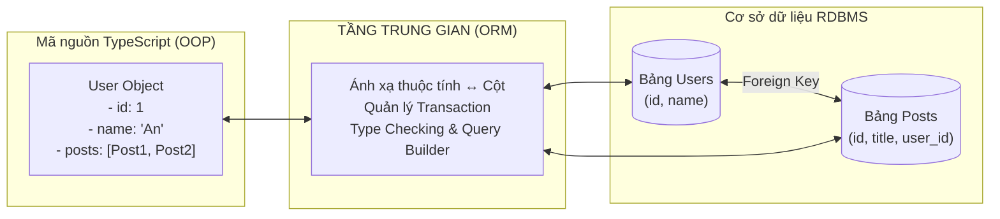
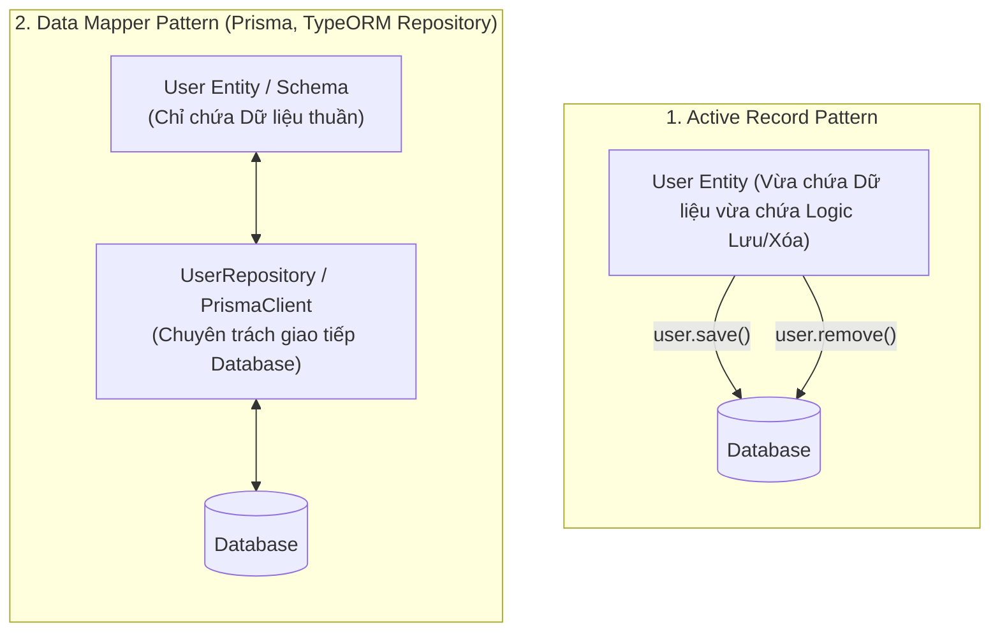
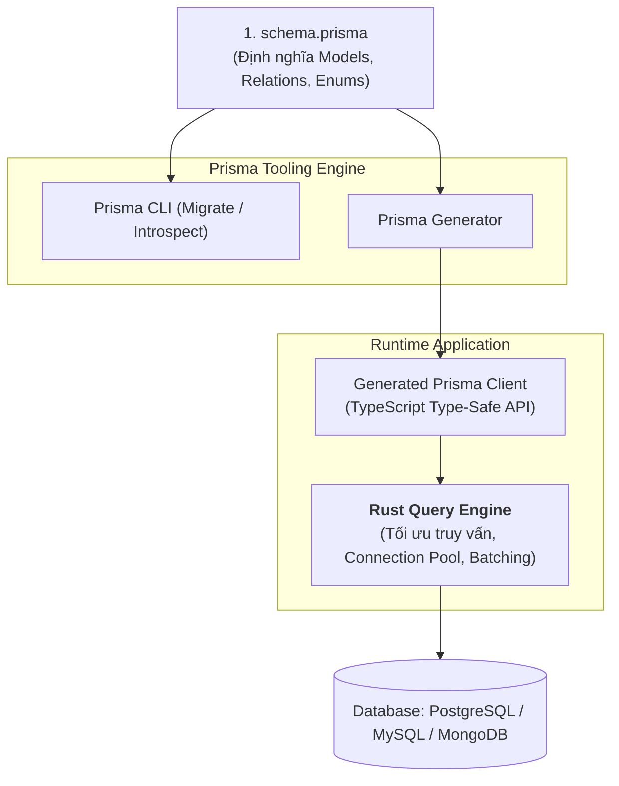
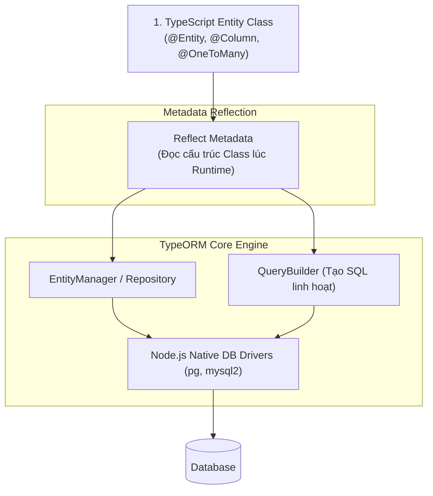
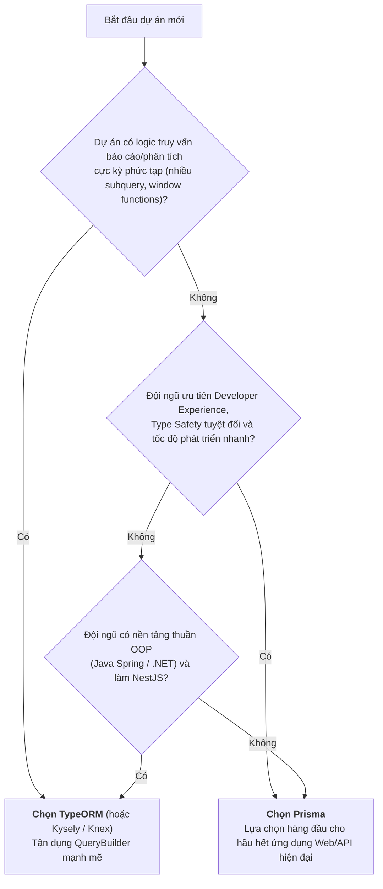

# ORM CHUYÊN SÂU: KIẾN TRÚC, SO SÁNH TOÀN DIỆN PRISMA VÀ TYPEORM

## Lời mở đầu

Trong thế giới phát triển Backend hiện đại với Node.js và TypeScript, **ORM (Object-Relational Mapping)** là cầu nối trung tâm giữa logic hướng đối tượng trong mã nguồn và cơ sở dữ liệu quan hệ (RDBMS). 

Việc lựa chọn ORM không chỉ đơn thuần là cú pháp viết truy vấn, mà nó quyết định **kiến trúc dữ liệu, độ an toàn kiểu (Type Safety), quy trình di chuyển dữ liệu (Migration), và hiệu năng tổng thể** của toàn bộ hệ thống. Hai đại diện tiêu biểu và phổ biến nhất trong hệ sinh thái TypeScript hiện nay là **Prisma** và **TypeORM**. Tài liệu này phân tích bản chất chuyên sâu của ORM, kiến trúc nội tại của từng công cụ, và đối chiếu so sánh toàn diện giúp bạn đưa ra quyết định kỹ thuật chính xác cho dự án.

---

## 1. Bản chất cốt lõi của ORM (Object-Relational Mapping)

### 1.1. Vấn đề "Trở ngại tương thích hướng đối tượng - quan hệ" (Object-Relational Impedance Mismatch)
- **Trong mã nguồn (OOP/TypeScript):** Dữ liệu được tổ chức dưới dạng các Đối tượng (Objects), liên kết với nhau qua tham chiếu (References), quan hệ cha-con lồng nhau (Nested Objects), tính kế thừa (Inheritance), và đóng gói (Encapsulation).
- **Trong Cơ sở dữ liệu quan hệ (RDBMS):** Dữ liệu được tổ chức dưới dạng các Bảng 2 chiều (Tables) gồm các Dòng (Rows) và Cột (Columns), liên kết với nhau bằng Khóa chính (Primary Key) và Khóa ngoại (Foreign Key) thông qua các phép nối toán học (JOIN).



ORM ra đời để giải quyết bài toán ánh xạ tự động hai mô hình dữ liệu này, giúp lập trình viên thao tác với database bằng cú pháp ngôn ngữ lập trình thuần túy thay vì phải viết các câu lệnh SQL thô (Raw SQL) ghép chuỗi thủ công dễ dính lỗi SQL Injection.

### 1.2. Hai mẫu kiến trúc ORM kinh điển: Active Record vs Data Mapper



- **Active Record Pattern:** Bản thân đối tượng Entity vừa lưu trữ dữ liệu, vừa sở hữu trực tiếp các hàm `save()`, `update()`, `delete()` để tự lưu nó vào database. Dễ tiếp cận, tiện cho dự án nhỏ nhưng vi phạm nguyên tắc Đơn trách nhiệm (Single Responsibility).
- **Data Mapper Pattern:** Tách biệt hoàn toàn: Entity chỉ là một đối tượng chứa dữ liệu thuần túy (In-memory Object), còn việc tương tác với database được giao cho một lớp riêng gọi là **Repository / EntityManager / Client Mapper**. Đây là kiến trúc chuẩn cho các hệ thống lớn (Clean Architecture).

---

## 2. Prisma — Triết lý "Schema là nguồn chân lý duy nhất" (Schema-First)

### 2.1. Kiến trúc nội tại của Prisma
Prisma không phải là một thư viện ORM truyền thống viết hoàn toàn bằng JavaScript. Kiến trúc của Prisma bao gồm 3 thành phần chính:



1. **Prisma Schema (`schema.prisma`):** File mô tả dữ liệu trung tâm bằng ngôn ngữ DSL (Domain-Specific Language) rõ ràng, trực quan, không phụ thuộc vào framework.
2. **Rust Query Engine:** Tầng động cơ cấp thấp viết bằng ngôn ngữ Rust cực nhanh, chịu trách nhiệm nhận logical query từ Node.js, tối ưu hóa thành câu lệnh SQL hiệu quả nhất và quản lý connection pool trực tiếp với database.
3. **Prisma Client (Tự động sinh ra):** Mỗi khi chạy `npx prisma generate`, Prisma sẽ đọc `schema.prisma` và sinh ra một bộ thư viện TypeScript được "may đo" riêng cho đúng database của bạn.

### 2.2. Khai báo Schema và Quan hệ trong Prisma
```prisma
// prisma/schema.prisma
datasource db {
  provider = "postgresql"
  url      = env("DATABASE_URL")
}

generator client {
  provider = "prisma-client-js"
}

model User {
  id        Int      @id @default(autoincrement())
  email     String   @unique
  name      String?
  role      Role     @default(USER)
  posts     Post[]
  createdAt DateTime @default(now())

  @@map("users")
}

model Post {
  id        Int      @id @default(autoincrement())
  title     String
  content   String?
  authorId  Int
  author    User     @relation(fields: [authorId], references: [id], onDelete: Cascade)
  createdAt DateTime @default(now())

  @@map("posts")
}

enum Role {
  USER
  ADMIN
}
```

### 2.3. Truy vấn Type-Safe và Nested Writes
Prisma mang lại khả năng kiểm soát kiểu dữ liệu an toàn tuyệt đối (End-to-End Type Safety):

```typescript
import { PrismaClient } from '@prisma/client';
const prisma = new PrismaClient();

// 1. Nested Write: Tạo User kèm luôn các Post con trong 1 Transaction tự động
const newUser = await prisma.user.create({
  data: {
    email: 'an.nguyen@example.com',
    name: 'An Nguyen',
    posts: {
      create: [
        { title: 'Bài viết số 1' },
        { title: 'Bài viết số 2' }
      ]
    }
  },
  // Tự động suy luận type trả về bao gồm cả mảng posts:
  include: {
    posts: true
  }
});

// 2. Type-Safe Field Selection (Chỉ lấy đúng cột cần dùng)
const userEmail = await prisma.user.findUnique({
  where: { id: 1 },
  select: { id: true, email: true } // TypeScript biết chắc chắn userEmail chỉ có { id, email }
});
```

---

## 3. TypeORM — Triết lý "Entity là code, code là nguồn chân lý" (Code-First)

### 3.1. Kiến trúc nội tại của TypeORM
TypeORM được xây dựng theo phong cách truyền thống của các ORM lớn trong thế giới OOP (như Hibernate của Java hay Entity Framework của .NET/C#). Cấu trúc bảng được định nghĩa trực tiếp bằng **Class TypeScript kết hợp Decorators và Reflect Metadata**.



### 3.2. Khai báo Entity bằng Decorators
```typescript
import {
  Entity,
  PrimaryGeneratedColumn,
  Column,
  OneToMany,
  ManyToOne,
  CreateDateColumn,
  JoinColumn
} from 'typeorm';

@Entity('users')
export class User {
  @PrimaryGeneratedColumn()
  id: number;

  @Column({ unique: true })
  email: string;

  @Column({ nullable: true })
  name: string;

  @OneToMany(() => Post, (post) => post.author, { cascade: true })
  posts: Post[];

  @CreateDateColumn()
  createdAt: Date;
}

@Entity('posts')
export class Post {
  @PrimaryGeneratedColumn()
  id: number;

  @Column()
  title: string;

  @Column({ nullable: true, type: 'text' })
  content: string;

  @Column()
  authorId: number;

  @ManyToOne(() => User, (user) => user.posts, { onDelete: 'CASCADE' })
  @JoinColumn({ name: 'authorId' })
  author: User;

  @CreateDateColumn()
  createdAt: Date;
}
```

### 3.3. Sức mạnh của QueryBuilder trong TypeORM
Khác với Prisma vốn đóng gói câu truy vấn theo cấu trúc object, TypeORM cung cấp một **QueryBuilder** cực kỳ mạnh mẽ, cho phép viết các truy vấn phức tạp gần sát với SQL thô:

```typescript
import { Repository } from 'typeorm';

// Sử dụng QueryBuilder cho báo cáo phức tạp
const report = await userRepository
  .createQueryBuilder('user')
  .leftJoinAndSelect('user.posts', 'post')
  .where('user.createdAt >= :startDate', { startDate: '2026-01-01' })
  .andWhere('post.title ILIKE :keyword', { keyword: '%kiến trúc%' })
  .groupBy('user.id')
  .having('COUNT(post.id) > :minPosts', { minPosts: 3 })
  .orderBy('user.createdAt', 'DESC')
  .skip(0)
  .take(20)
  .getMany();
```

---

## 4. So sánh toàn diện: Prisma vs TypeORM

| Tiêu chí | Prisma | TypeORM |
|:---|:---|:---|
| **Triết lý thiết kế** | **Schema-First:** Khai báo cấu trúc trong file `.prisma` DSL riêng biệt. | **Code-First / OOP:** Khai báo bảng trực tiếp bằng Class TypeScript và Decorators. |
| **Độ an toàn kiểu (Type Safety)** | **Tuyệt đối (10/10):** Sinh code tự động, type của kết quả truy vấn thay đổi chính xác theo mệnh đề `select` / `include`. | **Khá (7/10):** Type dựa trên class gốc. Khi dùng `select` một vài cột, TypeScript vẫn tưởng đối tượng có đủ các trường khác $\rightarrow$ dễ dính `undefined` lúc runtime. |
| **Độ phức tạp truy vấn (Complex Queries)** | Hạn chế với các truy vấn phức tạp (GROUP BY nâng cao, Window Functions, Full-text Search). Phải dùng `$queryRaw`. | **Rất mạnh:** `QueryBuilder` cho phép viết gần như mọi câu lệnh SQL phức tạp có JOIN lồng, sub-query mà vẫn giữ tính linh hoạt. |
| **Hệ thống Migration** | **Prisma Migrate:** Tự động so sánh schema, sinh migration SQL cực chuẩn, kiểm soát trạng thái cơ sở dữ liệu an toàn. | **TypeORM Migration:** Hỗ trợ tự sinh (CLI auto-generate) hoặc viết tay, nhưng dễ bị lỗi schema desync nếu có quan hệ phức tạp. |
| **Hiệu năng (Performance)** | Rất cao với truy vấn đơn giản/vừa nhờ Rust Engine; Có overhead nhỏ khi tuần tự hóa JSON giữa Rust và Node.js. | Trực tiếp thông qua Native Driver (`pg`, `mysql2`). Rất nhanh nếu viết tối ưu qua QueryBuilder. |
| **Mối quan hệ dữ liệu (Relations)** | Rất trực quan với cú pháp `include` và `select`. Hỗ trợ **Nested Writes** tự động mở Transaction. | Cấu hình quan hệ bằng Decorators (`@OneToMany`, `@ManyToMany`) đôi khi dễ bị lỗi đệ quy vòng tròn (Circular Dependency). |
| **Hỗ trợ Đa cơ sở dữ liệu** | PostgreSQL, MySQL, SQLite, SQL Server, CockroachDB, MongoDB. | PostgreSQL, MySQL, MariaDB, SQLite, MS SQL Server, Oracle, CockroachDB, MongoDB. |
| **Tích hợp với NestJS** | Dễ dàng thông qua việc tạo một `PrismaService` mỏng kế thừa `PrismaClient`. | Được NestJS hỗ trợ chính thức qua package `@nestjs/typeorm` (Tích hợp sâu theo phong cách Module/Repository). |
| **Đường cong học tập (Learning Curve)** | **Thấp:** Dễ học, cú pháp trực quan, tài liệu xuất sắc, công cụ Prisma Studio tích hợp sẵn xem dữ liệu trực tiếp. | **Trung bình - Cao:** Cần hiểu sâu về Decorators, Metadata, EntityManager, và tư duy SQL khi dùng QueryBuilder. |

---

## 5. Phân tích chi tiết: Ưu & Nhược điểm thực tế

### 5.1. Prisma
#### Ưu điểm:
- **Trải nghiệm lập trình (DX - Developer Experience) vượt trội:** Autocomplete chính xác $100\%$, gõ đến đâu IDE gợi ý chính xác trường dữ liệu đến đó.
- **Không bao giờ bị lỗi sai kiểu dữ liệu:** Tránh hoàn toàn lỗi truy cập nhầm thuộc tính không tồn tại.
- **Prisma Studio:** Giao diện trực quan tích hợp sẵn để xem và chỉnh sửa dữ liệu trong lúc phát triển (`npx prisma studio`).
- **File Schema tập trung:** Nhìn vào `schema.prisma` là thấy toàn bộ bức tranh kiến trúc dữ liệu của hệ thống, không cần duyệt qua hàng chục file entity.

#### Nhược điểm:
- Không phù hợp cho các câu truy vấn phân tích dữ liệu chuyên sâu (Data Analytics / BI) đòi hỏi QueryBuilder linh hoạt.
- Tốc độ khởi động (Cold start) trong môi trường Serverless (AWS Lambda) có thể bị ảnh hưởng do phải nạp Rust Engine nhị phân.

---

### 5.2. TypeORM
#### Ưu điểm:
- **Tương thích hoàn hảo với tư duy OOP:** Rất tự nhiên đối với các lập trình viên chuyển từ Java Spring (Hibernate) hoặc .NET (Entity Framework) sang Node.js.
- **QueryBuilder không giới hạn:** Xử lý tốt mọi bài toán truy vấn hóc búa, bảng tạm, CTE (Common Table Expressions).
- **Hỗ trợ cả Active Record lẫn Data Mapper:** Cho phép lựa chọn phong cách code phù hợp theo quy mô module.

#### Nhược điểm:
- Dễ gặp lỗi tiềm ẩn khi TypeScript không đồng bộ với runtime metadata (ví dụ quên khai báo type trong `@Column()`).
- Tốc độ bảo trì và phát triển của dự án mã nguồn mở TypeORM có giai đoạn chậm hơn Prisma.
- Các quan hệ nhiều-nhiều (`ManyToMany`) và Migration tự động đôi khi phát sinh lỗi khó gỡ.

---

## 6. Khuyến nghị áp dụng thực tiễn



### 1. Khi nào NÊN CHỌN PRISMA:
- Hầu hết các ứng dụng Web/Mobile thông thường (E-commerce, SaaS, Mạng xã hội, Dashboard quản trị).
- Các dự án TypeScript yêu cầu tính an toàn kiểu dữ liệu cao nhất, hạn chế tối đa lỗi runtime.
- Đội ngũ muốn tốc độ phát triển (velocity) nhanh, schema rõ ràng, dễ onboarding thành viên mới.
- Các ứng dụng sử dụng NestJS, Next.js, Remix hoặc Express thuần.

### 2. Khi nào NÊN CHỌN TYPEORM:
- Các hệ thống Doanh nghiệp lớn (Enterprise) có kiến trúc hướng đối tượng thuần túy, kế thừa nhiều tầng lớp Entity.
- Dự án có nhiều màn hình báo cáo phức tạp, cần viết dynamic SQL nối chuỗi nhiều điều kiện lọc và nhóm dữ liệu.
- Đội ngũ kỹ sư dày dạn kinh nghiệm với Hibernate / JPA muốn duy trì phong cách làm việc quen thuộc trong NestJS.

---

## Tổng kết

Không có ORM "tốt nhất cho mọi trường hợp", chỉ có ORM **phù hợp nhất với bài toán và đội ngũ của bạn**. **Prisma** đại diện cho kỷ nguyên ORM hiện đại (Type-Safe, Schema-First, DX tuyệt vời), trong khi **TypeORM** đại diện cho sự linh hoạt và sức mạnh truyền thống của thế giới hướng đối tượng (Code-First, QueryBuilder). Hiểu rõ bản chất kiến trúc của cả hai sẽ giúp bạn tự tin làm chủ tầng dữ liệu trong mọi hệ thống Backend.
