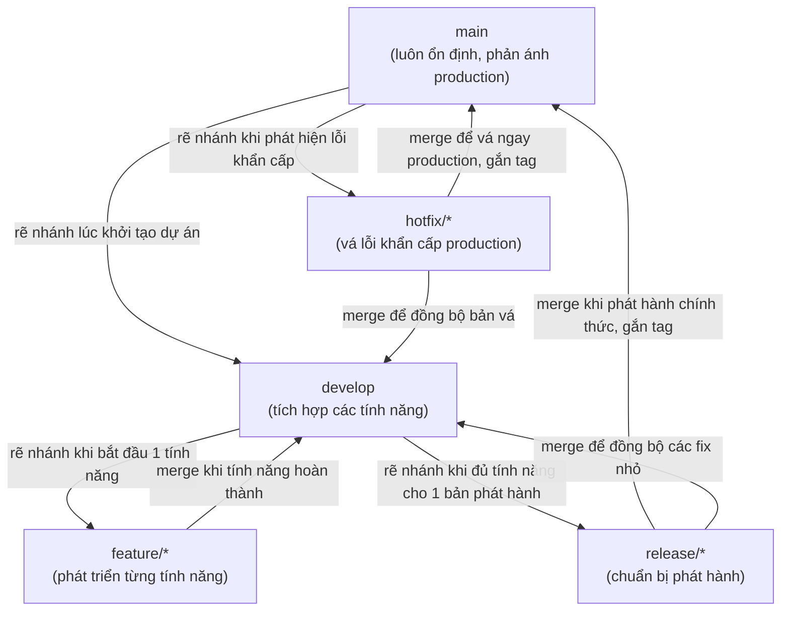
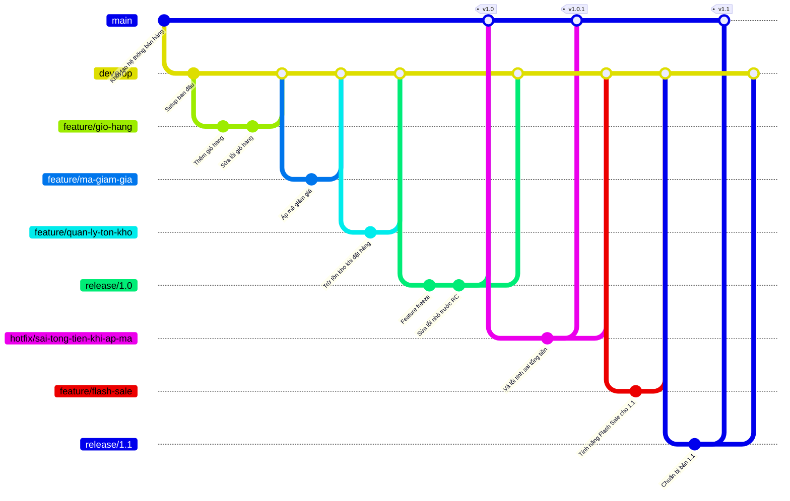

# GIT FLOW — MÔ HÌNH QUẢN LÝ NHÁNH TRONG PHÁT TRIỂN PHẦN MỀM

## Lời mở đầu

Khi một dự án phần mềm chỉ có một lập trình viên, việc quản lý mã nguồn tương đối đơn giản — mọi thay đổi có thể lưu trực tiếp trên một nhánh duy nhất. Nhưng khi đội ngũ phát triển lớn dần lên hàng chục người, cùng lúc phát triển nhiều tính năng mới, chuẩn bị phát hành phiên bản, đồng thời phải xử lý khẩn cấp lỗi phát sinh trên môi trường sản xuất (production) — nếu không có một quy ước rõ ràng về cách tạo, đặt tên, và hợp nhất (merge) các nhánh mã nguồn, dự án sẽ nhanh chóng rơi vào hỗn loạn: mã chưa hoàn thiện bị lẫn vào bản phát hành chính thức, một bản sửa lỗi khẩn cấp vô tình kéo theo tính năng đang dở dang chưa kiểm thử, hoặc nhiều lập trình viên ghi đè công việc của nhau. **Git Flow** ra đời để giải quyết chính xác vấn đề này — cung cấp một quy trình chuẩn hóa, có thể lặp lại, giúp đội ngũ phối hợp phát triển phần mềm một cách an toàn và có tổ chức.

---

## Mục lục

1. [Khái niệm tổng quan về Git Flow](#1-khái-niệm-tổng-quan-về-git-flow)
2. [Nhánh main](#2-nhánh-main)
3. [Nhánh develop](#3-nhánh-develop)
4. [Nhóm nhánh feature/](#4-nhóm-nhánh-feature)
5. [Nhánh release/](#5-nhánh-release)
6. [Nhóm nhánh hotfix/](#6-nhóm-nhánh-hotfix)
7. [Sơ đồ luồng Git Flow đầy đủ](#7-sơ-đồ-luồng-git-flow-đầy-đủ)
8. [Ví dụ minh họa thực tế](#8-ví-dụ-minh-họa-thực-tế)
9. [Ưu điểm, hạn chế và khi nào nên dùng Git Flow](#9-ưu-điểm-hạn-chế-và-khi-nào-nên-dùng-git-flow)

---

## 1. Khái niệm tổng quan về Git Flow

**Git Flow** là một mô hình quản lý nhánh (branching model) cho Git, được Vincent Driessen giới thiệu năm 2010, quy định rõ ràng: hệ thống có những loại nhánh nào, mỗi loại nhánh dùng để làm gì, nhánh nào được tạo ra từ nhánh nào, và nhánh nào sẽ được hợp nhất trở lại vào đâu. Về bản chất, Git Flow chia mã nguồn thành hai nhóm nhánh:

- **Nhánh chính, tồn tại vĩnh viễn (long-lived branches):** gồm `main` và `develop` — luôn tồn tại trong suốt vòng đời dự án.
- **Nhánh phụ trợ, tồn tại tạm thời (supporting branches):** gồm `feature/*`, `release/*`, và `hotfix/*` — được tạo ra để phục vụ một mục đích cụ thể, và bị xóa đi sau khi hoàn thành nhiệm vụ, hợp nhất trở lại vào nhánh chính tương ứng.

Nguyên tắc cốt lõi của Git Flow là **tách biệt rõ ràng giữa mã nguồn đang phát triển (chưa ổn định) và mã nguồn đã sẵn sàng phát hành (ổn định)**, đồng thời cho phép xử lý sự cố khẩn cấp trên production mà không làm gián đoạn công việc phát triển tính năng mới đang diễn ra song song.

---

## 2. Nhánh main

### 2.1. Đặt vấn đề

Môi trường sản xuất (production) — nơi người dùng thật đang sử dụng phần mềm — không thể chứa mã nguồn chưa được kiểm thử kỹ lưỡng. Đội ngũ vận hành cần một điểm tham chiếu duy nhất, đáng tin cậy tuyệt đối, phản ánh chính xác những gì đang chạy trên production tại bất kỳ thời điểm nào, để có thể xác định chính xác phiên bản nào gây ra sự cố hoặc cần rollback khi cần thiết.

### 2.2. Khái niệm

**`main`** (trong tài liệu gốc của Git Flow gọi là `master`) là nhánh đại diện cho mã nguồn đã được phát hành chính thức, đang chạy trên môi trường production. Mỗi commit nằm trên nhánh `main` được xem là một phiên bản ổn định, thường được gắn **tag** (nhãn phiên bản) như `v1.0`, `v1.1` để dễ dàng tham chiếu, rollback hoặc theo dõi lịch sử phát hành.

**Nguyên tắc bất di bất dịch:** không ai được commit trực tiếp lên `main`. Nhánh này chỉ nhận mã nguồn thông qua việc hợp nhất (merge) từ hai nguồn duy nhất: nhánh `release/*` (khi phát hành phiên bản mới theo kế hoạch) hoặc nhánh `hotfix/*` (khi cần vá lỗi khẩn cấp).

---

## 3. Nhánh develop

### 3.1. Đặt vấn đề

Nếu mọi lập trình viên đều commit trực tiếp lên `main`, môi trường production sẽ liên tục nhận những thay đổi chưa hoàn thiện, gây mất ổn định nghiêm trọng. Đội ngũ cần một không gian chung để **tích hợp (integrate)** công việc từ nhiều lập trình viên, nhiều tính năng khác nhau, kiểm thử sự tương thích giữa chúng, trước khi coi là đủ chín muồi để chuẩn bị phát hành.

### 3.2. Khái niệm

**`develop`** là nhánh tích hợp trung tâm, phản ánh trạng thái phát triển mới nhất của sản phẩm — nơi hội tụ toàn bộ các tính năng đã hoàn thành từ các nhánh `feature/*`. Nhánh `develop` được tạo ra (nhánh rẽ) từ `main` ngay tại thời điểm khởi tạo dự án, và tồn tại song song, độc lập với `main` trong suốt vòng đời dự án.

Khác với `main` vốn luôn ổn định tuyệt đối, `develop` được phép chứa những tính năng đang trong quá trình hoàn thiện, miễn là các tính năng đó không phá vỡ (break) những phần đã hoạt động trước đó — đây là nơi diễn ra kiểm thử tích hợp (integration testing) liên tục.

---

## 4. Nhóm nhánh feature/

### 4.1. Đặt vấn đề

Khi ba lập trình viên cùng lúc phát triển ba tính năng khác nhau (ví dụ: giỏ hàng, thanh toán, đánh giá sản phẩm) trên cùng một nhánh `develop`, mã nguồn dở dang của người này rất dễ xung đột (conflict) hoặc ảnh hưởng đến công việc của người kia trước khi từng tính năng thực sự hoàn chỉnh. Cần cách ly công việc của từng tính năng thành một không gian làm việc độc lập.

### 4.2. Khái niệm

**`feature/*`** (ví dụ `feature/gio-hang`, `feature/thanh-toan`) là nhóm nhánh dùng để phát triển một tính năng cụ thể, tách biệt hoàn toàn khỏi các tính năng khác đang được phát triển song song. Mỗi nhánh feature:

- Được **tạo ra (rẽ nhánh) từ `develop`**.
- Lập trình viên tự do commit, thử nghiệm, thậm chí commit mã chưa hoàn chỉnh mà không ảnh hưởng đến ai khác.
- Khi tính năng hoàn thành và được kiểm thử, nhánh feature được **hợp nhất trở lại vào `develop`** (thường thông qua Pull Request / Merge Request để đồng đội review code trước khi merge).
- Sau khi merge thành công, nhánh feature thường bị **xóa đi** vì đã hoàn thành nhiệm vụ.

Quy ước đặt tên rõ ràng (`feature/ten-tinh-nang`) giúp cả đội dễ dàng nhận biết mục đích của từng nhánh chỉ qua tên gọi, đồng thời thuận tiện cho việc tra cứu lịch sử qua các công cụ quản lý mã nguồn.

---

## 5. Nhánh release/

### 5.1. Đặt vấn đề

Trước khi phát hành một phiên bản chính thức, đội ngũ cần một khoảng thời gian để thực hiện các công việc chuẩn bị cuối cùng: kiểm thử toàn diện (regression testing), sửa các lỗi nhỏ phát hiện trong giai đoạn kiểm thử, cập nhật tài liệu, đánh số phiên bản — nhưng trong khoảng thời gian đó, đội phát triển vẫn cần tiếp tục làm việc trên `develop` để chuẩn bị cho các tính năng của phiên bản **tiếp theo**, mà không bị "đóng băng" chờ đợi bản phát hành hiện tại hoàn tất.

### 5.2. Khái niệm

**`release/*`** (ví dụ `release/1.0`) là nhánh trung gian, đóng vai trò "phòng chờ" trước khi mã nguồn chính thức lên `main`. Nhánh release:

- Được **tạo ra từ `develop`**, tại thời điểm đội ngũ xác nhận `develop` đã tích lũy đủ tính năng cho một phiên bản phát hành cụ thể (feature freeze — không thêm tính năng mới vào nhánh release nữa).
- Chỉ cho phép các thay đổi nhỏ: sửa lỗi phát sinh khi kiểm thử, cập nhật số phiên bản, chỉnh sửa tài liệu — **tuyệt đối không phát triển tính năng mới** trên nhánh này.
- Khi đã sẵn sàng phát hành, nhánh release được **hợp nhất vào cả hai nơi**: vào `main` (để phát hành chính thức, kèm gắn tag phiên bản) **và** vào `develop` (để đảm bảo các bản sửa lỗi nhỏ phát sinh trong giai đoạn release cũng được đồng bộ ngược trở lại cho các phát triển tiếp theo, tránh bị "thất lạc" lỗi đã sửa).
- Sau khi hoàn tất việc hợp nhất vào cả hai nhánh, nhánh release bị xóa.

---

## 6. Nhóm nhánh hotfix/

### 6.1. Đặt vấn đề

Giả sử phiên bản 1.0 đã phát hành được một tuần, đột nhiên phát hiện một lỗi nghiêm trọng trên production (ví dụ lỗi khiến khách hàng không thanh toán được). Đội ngũ không thể chờ đến chu kỳ phát hành phiên bản tiếp theo (có thể còn vài tuần hoặc vài tháng nữa) để vá lỗi này, đồng thời **không thể** lấy trực tiếp mã nguồn từ `develop` để vá — vì `develop` tại thời điểm đó rất có thể đã chứa những tính năng mới đang phát triển dở dang, chưa sẵn sàng đưa lên production.

### 6.2. Khái niệm

**`hotfix/*`** (ví dụ `hotfix/sua-loi-giao-dien`) là nhóm nhánh dành riêng cho việc vá lỗi khẩn cấp trên production, đòi hỏi xử lý và phát hành nhanh nhất có thể, độc lập với chu kỳ phát triển tính năng thông thường. Đặc điểm khác biệt quan trọng nhất so với `feature/*` và `release/*`:

- Được **tạo ra trực tiếp từ `main`** (chứ không phải từ `develop`) — vì mục tiêu là vá đúng mã nguồn đang thực sự chạy trên production, không lẫn các thay đổi dở dang khác.
- Sau khi vá lỗi xong và kiểm thử, nhánh hotfix được **hợp nhất vào cả `main`** (phát hành bản vá ngay lập tức, gắn tag phiên bản mới, ví dụ `v1.0.1`) **và vào `develop`** (để đảm bảo bản sửa lỗi này cũng có mặt trong các phiên bản phát triển tiếp theo, tránh tình trạng lỗi tương tự lặp lại ở bản phát hành sau).
- Nếu tại thời điểm đó đang tồn tại một nhánh `release/*` chưa kịp phát hành, bản vá cũng cần được hợp nhất vào nhánh release đó thay vì `develop` trực tiếp, để giữ tính nhất quán.

---

## 7. Sơ đồ luồng Git Flow đầy đủ

### 7.1. Sơ đồ tổng quan mối quan hệ giữa các loại nhánh



### 7.2. Sơ đồ dòng thời gian (Git Graph) minh họa toàn bộ vòng đời



---

## 8. Ví dụ minh họa thực tế

### 8.1. Bối cảnh

Công ty **ShopVN** đang xây dựng một hệ thống **bán hàng online** (tương tự mô hình một sàn thương mại điện tử thu nhỏ dành cho shop bán lẻ), cho phép khách hàng duyệt sản phẩm, thêm vào giỏ hàng, áp mã giảm giá, và đặt hàng; đồng thời hệ thống phải tự động trừ tồn kho khi có đơn hàng mới để tránh bán vượt số lượng thực tế trong kho. Đội ngũ 5 lập trình viên cần phát triển song song ba tính năng cho bản phát hành đầu tiên:

- **`feature/gio-hang`** — chức năng thêm/xóa/cập nhật sản phẩm trong giỏ hàng.
- **`feature/ma-giam-gia`** — cho phép khách nhập mã giảm giá (voucher) khi thanh toán.
- **`feature/quan-ly-ton-kho`** — tự động trừ số lượng tồn kho khi đơn hàng được xác nhận.

Sau khi hoàn thành, cả ba được tích hợp và phát hành thành phiên bản **1.0**. Một tuần sau khi lên production, bộ phận chăm sóc khách hàng báo cáo: nhiều khách hàng phản ánh **bị tính sai tổng tiền đơn hàng khi áp mã giảm giá** (hệ thống trừ giá sai, có trường hợp tính dư tiền của khách) — đây là lỗi ảnh hưởng trực tiếp đến doanh thu và uy tín, cần vá khẩn cấp ngay trong ngày. Sau khi xử lý xong sự cố, đội ngũ tiếp tục phát triển tính năng **Flash Sale** để chuẩn bị phát hành phiên bản **1.1**.

### 8.2. Diễn giải từng bước theo quy trình Git Flow

**Bước 1 — Khởi tạo:** Đội trưởng kỹ thuật tạo nhánh `develop` từ `main` ngay khi bắt đầu dự án.

```bash
git checkout main
git checkout -b develop
git push origin develop
```

**Bước 2 — Phát triển song song 3 tính năng:** Ba lập trình viên tạo ba nhánh feature độc lập từ `develop`, làm việc song song không ảnh hưởng lẫn nhau.

```bash
# Lập trình viên A — chức năng giỏ hàng
git checkout develop
git checkout -b feature/gio-hang

# Lập trình viên B — chức năng mã giảm giá
git checkout develop
git checkout -b feature/ma-giam-gia

# Lập trình viên C — chức năng trừ tồn kho tự động
git checkout develop
git checkout -b feature/quan-ly-ton-kho
```

Chức năng `feature/ma-giam-gia` được lập trình viên B triển khai với logic: `tổng_tiền = tổng_giá_sản_phẩm - (tổng_giá_sản_phẩm × phần_trăm_giảm_giá)`. Khi mỗi tính năng hoàn thành và được đồng đội review qua Pull Request, chúng lần lượt được merge trở lại `develop`. Tại thời điểm này, `develop` đã tích hợp đầy đủ cả ba tính năng và sẵn sàng bước vào giai đoạn chuẩn bị phát hành.

**Bước 3 — Chuẩn bị phát hành phiên bản 1.0:** Đội trưởng tạo nhánh `release/1.0` từ `develop`, tiến hành feature freeze — không thêm tính năng mới, chỉ tập trung kiểm thử toàn bộ luồng đặt hàng và sửa các lỗi nhỏ phát hiện được.

```bash
git checkout develop
git checkout -b release/1.0
# ... kiểm thử luồng: thêm giỏ hàng → áp mã → đặt hàng → trừ tồn kho ...
```

**Bước 4 — Phát hành chính thức:** Sau khi kiểm thử đạt yêu cầu, `release/1.0` được merge vào cả `main` (kèm gắn tag `v1.0`) và `develop` (đồng bộ các bản sửa lỗi nhỏ), sau đó nhánh release bị xóa. Hệ thống bán hàng online chính thức lên production, khách hàng bắt đầu đặt hàng thật.

```bash
git checkout main
git merge release/1.0 --no-ff
git tag -a v1.0 -m "Phát hành phiên bản 1.0 - Ra mắt hệ thống bán hàng online"
git push origin main --tags

git checkout develop
git merge release/1.0 --no-ff
git branch -d release/1.0
```

**Bước 5 — Xử lý lỗi khẩn cấp "tính sai tổng tiền khi áp mã giảm giá":** Một tuần sau, phát hiện lỗi nghiêm trọng: mã giảm giá dạng "giảm số tiền cố định" (ví dụ giảm 50.000đ) bị hệ thống tính nhầm thành công thức phần trăm, khiến một đơn hàng trị giá 200.000đ với mã giảm 50.000đ lại bị trừ thành **150.000đ × 50% = 75.000đ** thay vì đúng ra phải là **200.000đ − 50.000đ = 150.000đ** — gây thất thoát doanh thu trực tiếp cho hàng trăm đơn hàng mỗi ngày. Đội ngũ tạo nhánh `hotfix/sai-tong-tien-khi-ap-ma` trực tiếp từ `main` (không lấy từ `develop`, vì `develop` lúc này đã bắt đầu chứa tính năng Flash Sale cho bản 1.1, chưa sẵn sàng đưa lên production).

```bash
git checkout main
git checkout -b hotfix/sai-tong-tien-khi-ap-ma
# ... sửa lại logic tính giá: phân biệt rõ voucher theo % và voucher theo số tiền cố định ...
```

Sau khi vá lỗi và kiểm thử nhanh trên các trường hợp: mã giảm theo phần trăm, mã giảm theo số tiền cố định, và trường hợp mã giảm lớn hơn tổng tiền đơn hàng — hotfix được merge ngay vào `main` (phát hành bản vá `v1.0.1` khẩn cấp trong ngày) và đồng thời merge vào `develop` để đảm bảo bản vá này cũng có mặt trong phiên bản 1.1 đang phát triển.

```bash
git checkout main
git merge hotfix/sai-tong-tien-khi-ap-ma --no-ff
git tag -a v1.0.1 -m "Vá khẩn cấp: sửa lỗi tính sai tổng tiền khi áp mã giảm giá cố định"
git push origin main --tags

git checkout develop
git merge hotfix/sai-tong-tien-khi-ap-ma --no-ff
git branch -d hotfix/sai-tong-tien-khi-ap-ma
```

**Bước 6 — Tiếp tục phát triển cho phiên bản 1.1:** Trong lúc xử lý hotfix, đội ngũ vẫn tiếp tục phát triển tính năng **Flash Sale** trên nhánh `feature/flash-sale` (rẽ từ `develop`), hoàn toàn không bị gián đoạn bởi sự cố khẩn cấp vừa xảy ra — nhờ Git Flow tách bạch rõ luồng vá lỗi (dựa trên `main`) khỏi luồng phát triển tính năng (dựa trên `develop`). Sau khi Flash Sale hoàn thành và merge vào `develop`, quy trình lặp lại: tạo `release/1.1` → kiểm thử toàn diện (bao gồm cả kiểm tra lại logic mã giảm giá đã vá) → merge vào `main` (tag `v1.1`) và `develop`.

### 8.3. Kết quả trực quan

Toàn bộ quá trình trên tạo ra một cấu trúc nhánh đúng như sơ đồ ở mục 7.2: nhánh `main` chỉ nhận merge từ `release/*` và `hotfix/*`, luôn phản ánh chính xác các phiên bản đã phát hành trên hệ thống bán hàng online thực tế (`v1.0`, `v1.0.1`, `v1.1`); nhánh `develop` liên tục nhận merge từ các `feature/*` (giỏ hàng, mã giảm giá, tồn kho, Flash Sale) đồng thời được đồng bộ ngược từ `release/*` và `hotfix/*` để không bao giờ bị "thiếu" bất kỳ bản sửa lỗi nào đã phát hành ra production.

**Ý nghĩa thực tiễn của bước "merge ngược vào develop":** Nếu đội ngũ quên bước này sau khi xử lý hotfix, lỗi tính sai tổng tiền đã sửa ở bản `v1.0.1` sẽ chỉ tồn tại trên `main`, còn `develop` (và do đó bản `v1.1` phát triển sau này) vẫn mang logic tính giá cũ bị lỗi — dẫn đến tình huống trớ trêu là lỗi thất thoát doanh thu đã sửa lại "tái xuất hiện" ngay khi phiên bản 1.1 được phát hành, khiến bộ phận kế toán và chăm sóc khách hàng phải xử lý lại từ đầu. Đây là lỗi quy trình rất phổ biến trong thực tế khi đội ngũ áp dụng Git Flow không đầy đủ, và là lý do vì sao quy tắc "hotfix luôn phải merge vào cả `main` lẫn `develop`" cần được tuân thủ nghiêm ngặt, tốt nhất nên được tự động hóa qua CI/CD thay vì phụ thuộc vào việc lập trình viên nhớ thực hiện thủ công.

---

## 9. Ưu điểm, hạn chế và khi nào nên dùng Git Flow

### 9.1. Ưu điểm

- **Tách bạch rõ ràng** giữa mã nguồn ổn định (production), mã nguồn đang phát triển (develop), và các luồng công việc độc lập (feature, release, hotfix) — giảm thiểu rủi ro mã chưa hoàn thiện lọt vào production.
- **Hỗ trợ tốt cho các dự án phát hành theo phiên bản (versioned release)** — phù hợp với phần mềm đóng gói, ứng dụng di động phải qua kiểm duyệt trước khi phát hành (App Store, Google Play), hoặc phần mềm doanh nghiệp có chu kỳ phát hành cố định.
- **Xử lý sự cố khẩn cấp không làm gián đoạn** công việc phát triển tính năng đang diễn ra song song.

### 9.2. Hạn chế

- **Phức tạp hơn cần thiết** đối với các đội nhỏ hoặc các sản phẩm triển khai liên tục nhiều lần trong ngày (continuous deployment) — việc duy trì nhiều loại nhánh dài hạn tạo thêm chi phí quản lý không tương xứng với lợi ích.
- **Dễ xảy ra xung đột lớn (merge conflict)** khi các nhánh feature tồn tại quá lâu trước khi merge trở lại `develop`, do mã nguồn giữa hai nhánh ngày càng lệch xa nhau.
- Không phù hợp với triết lý **Trunk-Based Development** đang ngày càng phổ biến ở các đội ngũ áp dụng CI/CD hiện đại, nơi ưu tiên merge thường xuyên, nhanh, với các nhánh tồn tại rất ngắn hạn (thường dưới 1-2 ngày).

### 9.3. Khi nào nên áp dụng

Git Flow phù hợp nhất với các dự án có **chu kỳ phát hành theo phiên bản rõ ràng**, cần hỗ trợ song song nhiều phiên bản đang chạy trên production (ví dụ vừa duy trì bản 1.0 vừa phát triển bản 2.0), hoặc các ngành đòi hỏi kiểm thử/kiểm duyệt nghiêm ngặt trước khi phát hành. Ngược lại, với các đội ngũ làm sản phẩm SaaS triển khai liên tục nhiều lần mỗi ngày, các mô hình đơn giản hơn như **GitHub Flow** hay **Trunk-Based Development** thường được ưu tiên hơn nhờ tốc độ và độ đơn giản.