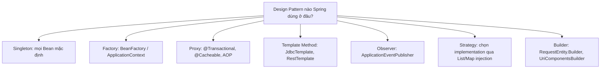
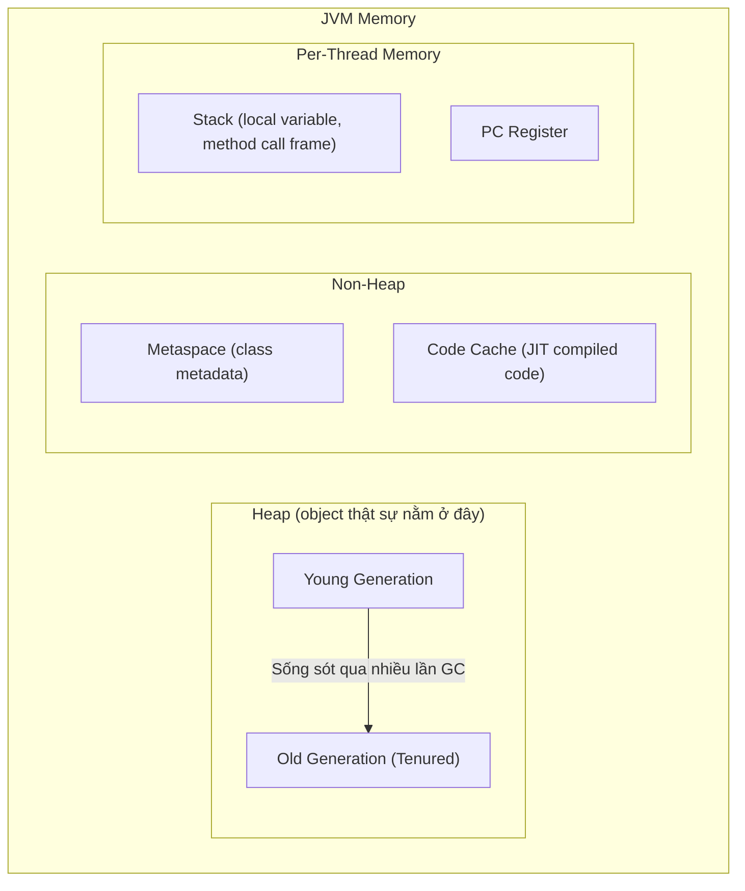
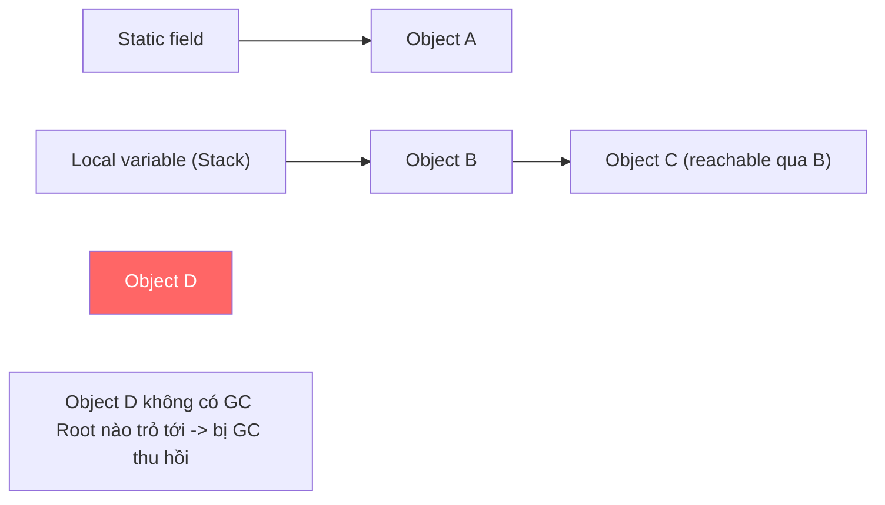
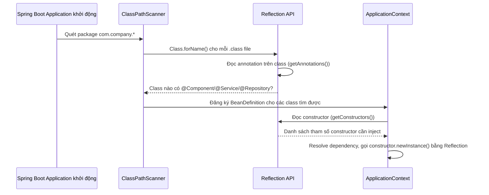

# CHƯƠNG 2: JAVA NÂNG CAO

## Mục lục

- [Giới thiệu](#giới-thiệu)
- [2.1. Design Patterns trong Java Enterprise](#21-design-patterns-trong-java-enterprise)
  - [2.1.1. Singleton Pattern](#211-singleton-pattern)
  - [2.1.2. Factory Pattern](#212-factory-pattern)
  - [2.1.3. Strategy Pattern](#213-strategy-pattern)
  - [2.1.4. Builder Pattern](#214-builder-pattern)
  - [2.1.5. Observer Pattern](#215-observer-pattern)
  - [2.1.6. Template Method Pattern](#216-template-method-pattern)
- [2.2. Minh họa](#22-minh-họa)
- [2.3. So sánh: Khi nào dùng Pattern nào](#23-so-sánh-khi-nào-dùng-pattern-nào)
- [2.4. Best Practices](#24-best-practices)
- [2.5. Anti-patterns](#25-anti-patterns)
- [2.6. Bài tập](#26-bài-tập)
- [2.7. JVM Memory Model & Garbage Collection](#27-jvm-memory-model-garbage-collection)
  - [2.7.1. Tại sao Backend Developer BẮT BUỘC phải hiểu](#271-tại-sao-backend-developer-bắt-buộc-phải-hiểu)
  - [2.7.2. Cấu trúc bộ nhớ JVM](#272-cấu-trúc-bộ-nhớ-jvm)
  - [2.7.3. Garbage Collection hoạt động thế nào](#273-garbage-collection-hoạt-động-thế-nào)
  - [2.7.4. Memory Leak trong ứng dụng Spring Boot — nguyên nhân thực tế](#274-memory-leak-trong-ứng-dụng-spring-boot-nguyên-nhân-thực-tế)
- [2.8. Reflection API & Custom Annotation](#28-reflection-api-custom-annotation)
  - [2.8.1. Reflection — cơ chế thực sự đứng sau Spring](#281-reflection-cơ-chế-thực-sự-đứng-sau-spring)
  - [2.8.2. Tự viết Custom Annotation](#282-tự-viết-custom-annotation)
- [2.9. Record & Sealed Class (Java 17-21)](#29-record-sealed-class-java-17-21)
  - [2.9.1. Record](#291-record)
  - [2.9.2. Sealed Class/Interface](#292-sealed-classinterface)
- [2.10. Bài tập tổng hợp Chương 2](#210-bài-tập-tổng-hợp-chương-2)
- [2.11. Tổng kết Chương 2](#211-tổng-kết-chương-2)

## Giới thiệu

Nếu Chương 1 là "ngữ pháp" của Java, Chương 2 là "tại sao Spring Framework lại được thiết kế như vậy". Bạn sẽ hiểu:

- **Design Pattern** — vì sao Spring dùng Proxy Pattern để làm `@Transactional`, Factory Pattern để tạo Bean, Template Method để làm `JdbcTemplate`.
- **JVM Memory Model & Garbage Collection** — vì sao ứng dụng Java "ăn RAM nhiều" lúc khởi động nhưng ổn định lâu dài, và cách tránh Memory Leak trong code Spring Boot.
- **Reflection & Annotation** — cơ chế thực sự đứng sau `@Autowired`, `@Component`, `@RequestMapping`. Đây là phần "vén màn" quan trọng nhất — sau chương này, annotation không còn là "phép thuật" nữa.
- **Record & Sealed Class (Java 17-21)** — các tính năng hiện đại giúp code Java ngắn gọn gần với TypeScript hơn rất nhiều.

Đây là kiến thức phân biệt rõ ràng giữa "biết dùng Spring Boot" và "hiểu Spring Boot" — điều mà bất kỳ buổi phỏng vấn Senior Java nào cũng sẽ hỏi tới.

---

## 2.1. Design Patterns trong Java Enterprise

Design Pattern không phải là "công thức phải học thuộc" — mà là **ngôn ngữ chung** giúp team enterprise trao đổi ý tưởng thiết kế nhanh chóng ("dùng Strategy Pattern ở đây" truyền tải nhiều thông tin hơn giải thích dài dòng). Dưới đây là các pattern **thực sự xuất hiện trong Spring Framework và codebase enterprise hàng ngày** — không liệt kê lý thuyết suông.

### 2.1.1. Singleton Pattern

**Khái niệm**: Đảm bảo 1 class chỉ có **đúng 1 instance** trong toàn bộ ứng dụng, cung cấp 1 điểm truy cập toàn cục.

**Tại sao cần**: Trong Spring Boot, mọi `@Component`/`@Service`/`@Repository` mặc định là Singleton Bean — Spring Container tự quản lý vòng đời, bạn hiếm khi phải tự viết Singleton Pattern thủ công. Nhưng hiểu cơ chế bên dưới giúp bạn tránh bug kinh điển: **Singleton Bean có mutable state dùng chung cho MỌI request** → race condition khi có nhiều thread.

**Cách hoạt động bên trong**: Cách viết Singleton "thread-safe" chuẩn nhất trong Java thuần (không qua Spring) là dùng `enum` (đảm bảo an toàn tuyệt đối trước serialization và reflection attack) hoặc **Initialization-on-demand holder** (lazy, thread-safe nhờ classloader).

```java
// Singleton thuần Java - Initialization-on-demand holder idiom
public class ConfigurationManager {
    private final Properties properties;

    private ConfigurationManager() {
        this.properties = loadProperties();
    }

    private static class Holder {
        private static final ConfigurationManager INSTANCE = new ConfigurationManager();
        // Class Holder chỉ được JVM load (và khởi tạo INSTANCE) khi getInstance() được gọi lần đầu
        // -> lazy initialization, thread-safe tự nhiên nhờ cơ chế classloader của JVM
    }

    public static ConfigurationManager getInstance() {
        return Holder.INSTANCE;
    }
}

// Trong Spring Boot - KHÔNG cần viết Singleton thủ công, Spring tự quản lý
@Service // Spring Container đảm bảo chỉ tạo 1 instance OrderService cho toàn ứng dụng
public class OrderService {
    // CẢNH BÁO: đây là bug kinh điển - field này bị CHIA SẺ giữa mọi request đồng thời
    private int processedOrderCount = 0; // KHÔNG thread-safe!

    public void processOrder(Order order) {
        processedOrderCount++; // race condition nếu nhiều request gọi cùng lúc
    }
}
```

**Best Practices**: Trong Spring, Bean Singleton **không nên có mutable field** trừ khi được đồng bộ hóa tường minh (`AtomicInteger`, `synchronized`) hoặc dùng `ThreadLocal` khi state cần riêng biệt theo từng request/thread.

### 2.1.2. Factory Pattern

**Khái niệm**: Đóng gói logic khởi tạo object phức tạp vào 1 method/class riêng, che giấu chi tiết implementation khỏi caller.

**Ứng dụng thực tế**: `BeanFactory`/`ApplicationContext` trong Spring **chính là** hiện thực hóa Factory Pattern ở quy mô framework — bạn không bao giờ `new OrderService()` thủ công, Spring "factory" tạo và quản lý nó.

```java
// Factory Method Pattern - chọn implementation dựa trên input, che giấu logic khởi tạo
@Component
public class PaymentProcessorFactory {

    private final Map<PaymentMethod, PaymentProcessor> processors;

    // Spring tự động inject TẤT CẢ Bean implement PaymentProcessor vào List này
    public PaymentProcessorFactory(List<PaymentProcessor> processorList) {
        this.processors = processorList.stream()
                .collect(Collectors.toMap(PaymentProcessor::supportedMethod, p -> p));
    }

    public PaymentProcessor getProcessor(PaymentMethod method) {
        PaymentProcessor processor = processors.get(method);
        if (processor == null) {
            throw new UnsupportedPaymentMethodException(method);
        }
        return processor;
    }
}
```

Đây là kỹ thuật **cực kỳ phổ biến trong enterprise Spring**: thay vì viết `if-else`/`switch` để chọn implementation, đăng ký tất cả implementation làm Bean và để Spring tự động gom vào `List<T>` hoặc `Map<String, T>`, sau đó Factory chọn đúng cái cần dùng.

### 2.1.3. Strategy Pattern

**Khái niệm**: Định nghĩa họ các thuật toán/hành vi có thể hoán đổi cho nhau, đóng gói mỗi thuật toán vào 1 class riêng, cho phép thay đổi hành vi lúc runtime mà không sửa code caller.

**Khác biệt với Factory**: Factory tập trung vào việc **tạo ra object nào**, Strategy tập trung vào việc **object đó làm gì** (hành vi có thể hoán đổi). Ví dụ `PaymentProcessor` ở Chương 1 chính là Strategy Pattern kết hợp Template Method.

```java
public interface ShippingFeeStrategy {
    BigDecimal calculateFee(Order order, Address destination);
}

@Component("standardShipping")
public class StandardShippingStrategy implements ShippingFeeStrategy {
    @Override
    public BigDecimal calculateFee(Order order, Address destination) {
        return BigDecimal.valueOf(30_000);
    }
}

@Component("expressShipping")
public class ExpressShippingStrategy implements ShippingFeeStrategy {
    @Override
    public BigDecimal calculateFee(Order order, Address destination) {
        return BigDecimal.valueOf(80_000);
    }
}

@Service
public class CheckoutService {
    private final Map<String, ShippingFeeStrategy> strategies;

    public CheckoutService(Map<String, ShippingFeeStrategy> strategies) {
        // Spring tự động inject Map<TênBean, Bean> cho mọi implementation của interface này
        this.strategies = strategies;
    }

    public BigDecimal calculateShippingFee(String shippingType, Order order, Address destination) {
        ShippingFeeStrategy strategy = strategies.get(shippingType + "Shipping");
        if (strategy == null) {
            throw new IllegalArgumentException("Loại vận chuyển không hợp lệ: " + shippingType);
        }
        return strategy.calculateFee(order, destination);
    }
}
```

### 2.1.4. Builder Pattern

**Khái niệm**: Tách quá trình xây dựng object phức tạp (nhiều field, nhiều field optional) khỏi biểu diễn cuối cùng, cho phép tạo object qua chuỗi method gọi liên tiếp (method chaining), dễ đọc hơn constructor có 10 tham số.

**Tại sao cần**: Java không có named parameters/default parameters như TypeScript (`function foo({a, b, c = 1})`). Builder Pattern là cách Java giải quyết vấn đề tương đương.

```java
public class ProductSearchCriteria {
    private final String keyword;
    private final BigDecimal minPrice;
    private final BigDecimal maxPrice;
    private final String category;
    private final int page;
    private final int pageSize;

    private ProductSearchCriteria(Builder builder) {
        this.keyword = builder.keyword;
        this.minPrice = builder.minPrice;
        this.maxPrice = builder.maxPrice;
        this.category = builder.category;
        this.page = builder.page;
        this.pageSize = builder.pageSize;
    }

    public static Builder builder() {
        return new Builder();
    }

    public static class Builder {
        private String keyword;
        private BigDecimal minPrice;
        private BigDecimal maxPrice;
        private String category;
        private int page = 0;
        private int pageSize = 20; // default value

        public Builder keyword(String keyword) { this.keyword = keyword; return this; }
        public Builder priceRange(BigDecimal min, BigDecimal max) {
            this.minPrice = min; this.maxPrice = max; return this;
        }
        public Builder category(String category) { this.category = category; return this; }
        public Builder page(int page) { this.page = page; return this; }
        public Builder pageSize(int pageSize) { this.pageSize = pageSize; return this; }

        public ProductSearchCriteria build() {
            return new ProductSearchCriteria(this);
        }
    }
}

// Sử dụng - đọc rõ ràng như "câu văn", không cần nhớ thứ tự tham số
ProductSearchCriteria criteria = ProductSearchCriteria.builder()
        .keyword("laptop")
        .priceRange(BigDecimal.valueOf(10_000_000), BigDecimal.valueOf(30_000_000))
        .category("electronics")
        .page(0)
        .build();
```

**Lưu ý thực tế**: Từ Java 14+ (chính thức ổn định Java 16), **Record** (học ở mục 2.9) đã thay thế phần lớn nhu cầu dùng Builder cho các DTO đơn giản bất biến. Builder Pattern vẫn cần thiết khi object có **nhiều field optional** hoặc logic validate phức tạp lúc xây dựng.

### 2.1.5. Observer Pattern

**Khái niệm**: 1 object (Subject) duy trì danh sách các đối tượng phụ thuộc (Observer) và tự động thông báo cho chúng khi có sự kiện xảy ra.

**Ứng dụng thực tế**: `ApplicationEventPublisher` của Spring chính là Observer Pattern ở tầng framework — dùng để **decouple** logic giữa các module (VD: khi đơn hàng được tạo, gửi email + trừ kho + ghi log mà không cần `OrderService` biết trực tiếp về `EmailService`).

```java
// Định nghĩa Event
public class OrderCreatedEvent extends ApplicationEvent {
    private final String orderId;
    public OrderCreatedEvent(Object source, String orderId) {
        super(source);
        this.orderId = orderId;
    }
    public String getOrderId() { return orderId; }
}

// Subject - publish event, KHÔNG cần biết ai đang lắng nghe
@Service
public class OrderService {
    private final ApplicationEventPublisher eventPublisher;

    public OrderService(ApplicationEventPublisher eventPublisher) {
        this.eventPublisher = eventPublisher;
    }

    @Transactional
    public Order createOrder(CreateOrderRequest request) {
        Order order = new Order(/* ... */);
        orderRepository.save(order);
        eventPublisher.publishEvent(new OrderCreatedEvent(this, order.getOrderId()));
        return order;
    }
}

// Observer 1 - hoàn toàn tách biệt, không ảnh hưởng lẫn nhau
@Component
public class EmailNotificationListener {
    @EventListener
    @Async // xử lý bất đồng bộ, không làm chậm luồng chính
    public void onOrderCreated(OrderCreatedEvent event) {
        emailService.sendOrderConfirmation(event.getOrderId());
    }
}

// Observer 2
@Component
public class InventoryUpdateListener {
    @EventListener
    public void onOrderCreated(OrderCreatedEvent event) {
        inventoryService.deductStock(event.getOrderId());
    }
}
```

**So sánh: gọi trực tiếp vs Event-driven (Observer)**

| Tiêu chí | Gọi method trực tiếp | Observer Pattern (ApplicationEvent) |
|---|---|---|
| Coupling | Cao — `OrderService` phải biết `EmailService`, `InventoryService` | Thấp — `OrderService` chỉ publish event, không biết ai lắng nghe |
| Thêm tính năng mới | Phải sửa `OrderService` để gọi thêm service mới | Chỉ cần thêm 1 Listener mới, không đụng vào `OrderService` |
| Xử lý lỗi | Rõ ràng, dễ trace (exception bubble ngay) | Phức tạp hơn — lỗi trong Listener cần xử lý riêng, đặc biệt với `@Async` |
| Transaction | Cùng transaction nếu không tách riêng | Cần cân nhắc `@TransactionalEventListener` để đảm bảo đúng thời điểm (sau khi commit) |

### 2.1.6. Template Method Pattern

Đã minh họa chi tiết ở Chương 1 (`PaymentProcessor`). Đây là pattern nền tảng cho `JdbcTemplate`, `RestTemplate`, `TransactionTemplate` — các class "Template" trong Spring đều theo nguyên lý: định nghĩa sẵn khung xử lý (mở connection, xử lý exception, đóng connection), chỉ để phần logic nghiệp vụ cụ thể cho caller cung cấp qua callback/lambda.

```java
// JdbcTemplate là ví dụ điển hình nhất của Template Method trong Spring
public List<Order> findHighValueOrders(BigDecimal threshold) {
    return jdbcTemplate.query(
            "SELECT * FROM orders WHERE total_amount > ?",
            (rs, rowNum) -> new Order(rs.getString("order_id"), rs.getBigDecimal("total_amount")),
            threshold
    );
    // JdbcTemplate tự lo: mở connection, tạo PreparedStatement, xử lý SQLException,
    // đóng connection - bạn chỉ cần cung cấp SQL + cách map ResultSet -> Object (RowMapper)
}
```

---

## 2.2. Minh họa



---

## 2.3. So sánh: Khi nào dùng Pattern nào

| Vấn đề cần giải quyết | Pattern phù hợp |
|---|---|
| Cần đúng 1 instance dùng chung toàn ứng dụng | Singleton (nhưng để Spring quản lý, không tự viết) |
| Logic khởi tạo object phức tạp, chọn implementation theo điều kiện | Factory |
| Nhiều thuật toán/hành vi có thể hoán đổi cho nhau lúc runtime | Strategy |
| Object có nhiều field, nhiều field optional | Builder (hoặc Record nếu bất biến & đơn giản) |
| Cần decouple module, 1 sự kiện kích hoạt nhiều hành động độc lập | Observer (ApplicationEvent) |
| Có khung xử lý chung, chỉ khác nhau vài bước cụ thể | Template Method |

---

## 2.4. Best Practices

- Không "nhét" pattern vào code chỉ để "cho giống enterprise" — chỉ áp dụng khi thực sự giải quyết vấn đề phức tạp hóa/coupling.
- Ưu tiên để **Spring Container quản lý Singleton** thay vì tự viết Singleton Pattern thủ công trong ứng dụng Spring Boot.
- Dùng Strategy + `Map<String, T>` injection thay cho chuỗi `if-else`/`switch` dài khi có nhiều implementation cùng interface.
- Cân nhắc Record thay Builder cho DTO đơn giản, bất biến, không có field optional phức tạp.

## 2.5. Anti-patterns

- **Tự viết Singleton thủ công trong code Spring** (dùng static field) thay vì để Spring quản lý — phá vỡ khả năng test, khả năng mock.
- **Lạm dụng Factory** khi chỉ có 1 implementation duy nhất — over-engineering không cần thiết.
- **Observer Pattern cho logic đồng bộ bắt buộc phải thành công cùng lúc** (VD: trừ tiền tài khoản) — event bất đồng bộ không phù hợp cho nghiệp vụ cần tính nhất quán (consistency) ngay lập tức, dễ dẫn tới lỗi nghiệp vụ khó phát hiện.

## 2.6. Bài tập

1. **Dễ**: Refactor 1 method có `switch-case` chọn 3 loại `DiscountStrategy` (VIP, Regular, New Customer) thành Strategy Pattern dùng Spring `Map<String, T>` injection.
2. **Trung bình**: Viết `NotificationEvent` + 2 Listener (`EmailListener`, `SmsListener`) dùng `ApplicationEventPublisher`, đảm bảo Listener không làm chậm luồng chính (dùng `@Async`).
3. **Khó**: Thiết kế `ReportBuilder` (Builder Pattern) cho việc tạo báo cáo doanh thu có nhiều tham số optional (khoảng thời gian, nhóm theo ngày/tháng, filter theo khu vực, có/không kèm biểu đồ), đảm bảo build() validate được tổ hợp tham số không hợp lệ.
## 2.7. JVM Memory Model & Garbage Collection

### 2.7.1. Tại sao Backend Developer BẮT BUỘC phải hiểu

Trong Node.js, bạn hiếm khi phải nghĩ về memory layout — V8 tự lo. Nhưng trong môi trường Java enterprise chạy production 24/7, việc hiểu JVM Memory Model là kỹ năng **phân biệt Junior và Senior**: đọc được `OutOfMemoryError`, tối ưu GC pause time (ảnh hưởng trực tiếp tới latency API), tránh Memory Leak trong code Spring.

### 2.7.2. Cấu trúc bộ nhớ JVM



**Heap**: nơi mọi object (kể cả array) được cấp phát. Chia thành:
- **Young Generation** (chia nhỏ thành Eden + 2 vùng Survivor): object mới tạo nằm ở đây. Hầu hết object "chết yểu" (short-lived) — ví dụ DTO tạo ra trong 1 request rồi bị loại bỏ ngay sau khi response trả về — bị dọn dẹp rất nhanh ở đây bằng **Minor GC**.
- **Old Generation**: object sống sót qua nhiều chu kỳ Minor GC (VD: Singleton Bean, cache trong memory, connection pool) được "thăng cấp" (promote) lên đây. Dọn dẹp Old Gen tốn kém hơn nhiều — gọi là **Major GC/Full GC**, có thể gây "Stop-The-World" (toàn bộ ứng dụng tạm dừng) đáng kể nếu Old Gen quá lớn hoặc GC algorithm không phù hợp.

**Stack**: mỗi thread có 1 Stack riêng, lưu **stack frame** cho mỗi lời gọi method (local variable primitive, tham chiếu tới object trên heap, địa chỉ trả về). Đây là lý do `StackOverflowError` xảy ra khi đệ quy quá sâu — Stack có kích thước giới hạn (mặc định thường 512KB-1MB/thread).

**Metaspace** (thay thế PermGen từ Java 8): lưu metadata của class đã load (bytecode method, thông tin field...) — nằm ngoài Heap, tự động mở rộng, ít khi là nguồn gây `OutOfMemoryError` trừ khi ứng dụng load động cực nhiều class (VD: dùng nhiều class loader tùy biến).

### 2.7.3. Garbage Collection hoạt động thế nào

**Nguyên lý cơ bản**: GC xác định object nào **không còn reachable** (không còn bất kỳ tham chiếu nào từ GC Root — bao gồm static field, local variable đang active trên stack, JNI reference) và giải phóng bộ nhớ của chúng.



**Các GC Algorithm phổ biến trong JVM hiện đại (Java 17-21)**:

| GC Algorithm | Đặc điểm | Khi nào dùng |
|---|---|---|
| **G1GC** (mặc định từ Java 9+) | Chia Heap thành nhiều vùng nhỏ (region), ưu tiên dọn vùng có nhiều rác trước, cân bằng throughput/pause time | Mặc định tốt cho hầu hết ứng dụng Spring Boot enterprise |
| **ZGC** (production-ready từ Java 15+) | Pause time cực thấp (dưới 10ms) kể cả với Heap hàng trăm GB | Ứng dụng cần độ trễ cực thấp, Heap rất lớn |
| **Parallel GC** | Ưu tiên throughput tối đa, chấp nhận pause time dài hơn | Batch processing, không nhạy cảm với độ trễ |
| **Serial GC** | Đơn giản, chỉ 1 thread GC | Ứng dụng nhỏ, môi trường container giới hạn tài nguyên (< 100MB Heap) |

### 2.7.4. Memory Leak trong ứng dụng Spring Boot — nguyên nhân thực tế

Java có GC tự động, nhưng **Memory Leak vẫn xảy ra thường xuyên** trong thực tế enterprise — không phải vì "quên free memory" như C++, mà vì **giữ reference không cần thiết** khiến object không bao giờ trở thành unreachable.

```java
// ❌ Memory Leak kinh điển #1: static Collection tăng trưởng không giới hạn
@Component
public class RequestCache {
    private static final Map<String, Object> cache = new HashMap<>(); // không bao giờ bị GC

    public void cacheResult(String key, Object value) {
        cache.put(key, value); // KHÔNG BAO GIỜ xóa -> tăng trưởng vô hạn -> OutOfMemoryError
    }
}

// ✅ Sửa: dùng cache có giới hạn kích thước + TTL (Caffeine, hoặc Redis ở tầng ngoài)
@Component
public class RequestCacheFixed {
    private final Cache<String, Object> cache = Caffeine.newBuilder()
            .maximumSize(10_000)
            .expireAfterWrite(Duration.ofMinutes(30))
            .build();
}
```

```java
// ❌ Memory Leak kinh điển #2: ThreadLocal không được clear trong môi trường thread pool
public class UserContextHolder {
    private static final ThreadLocal<UserContext> CONTEXT = new ThreadLocal<>();

    public static void set(UserContext context) { CONTEXT.set(context); }
    public static UserContext get() { return CONTEXT.get(); }
    // THIẾU remove() -> vì thread trong pool (Tomcat) được tái sử dụng giữa các request,
    // UserContext của request cũ vẫn "dính" lại trong ThreadLocal của thread đó
}

// ✅ Sửa: LUÔN clear ThreadLocal trong finally, đặc biệt trong Filter/Interceptor
public class UserContextFilter extends OncePerRequestFilter {
    @Override
    protected void doFilterInternal(HttpServletRequest req, HttpServletResponse res, FilterChain chain)
            throws ServletException, IOException {
        try {
            UserContextHolder.set(extractContext(req));
            chain.doFilter(req, res);
        } finally {
            UserContextHolder.remove(); // BẮT BUỘC - tránh leak context giữa các request
        }
    }
}
```

```java
// ❌ Memory Leak kinh điển #3: Listener/Observer đăng ký nhưng không bao giờ unregister
// ❌ Memory Leak kinh điển #4: đóng Connection/Stream không đúng cách (xem lại try-with-resources ở Chương 1)
```

**Best Practices**:
- Không dùng `static` Collection để cache dữ liệu tăng trưởng không giới hạn — dùng thư viện cache có TTL/max-size (Caffeine) hoặc Redis.
- Luôn `remove()` `ThreadLocal` sau khi dùng xong, đặc biệt quan trọng trong môi trường thread pool (Tomcat tái sử dụng thread).
- Set giới hạn Heap hợp lý qua `-Xmx` phù hợp với tài nguyên container (đặc biệt quan trọng khi deploy Docker/Kubernetes — JVM cần biết giới hạn memory của container để tính Heap phù hợp, dùng flag `-XX:MaxRAMPercentage` thay vì `-Xmx` cố định trong container).
- Monitor Heap usage và GC pause time qua Actuator + Prometheus/Grafana trong production (học ở phần Logging & Monitoring).

**Sai lầm thường gặp**: Nghĩ rằng "Java có GC nên không cần lo về memory" — thực tế Memory Leak trong Java enterprise application là vấn đề rất phổ biến, chỉ khác cơ chế so với ngôn ngữ quản lý memory thủ công.

---

## 2.8. Reflection API & Custom Annotation

### 2.8.1. Reflection — cơ chế thực sự đứng sau Spring

**Khái niệm**: Reflection cho phép chương trình Java **kiểm tra và thao tác với chính cấu trúc của nó lúc runtime** — đọc danh sách method/field/annotation của 1 class, tạo instance động, gọi method động — mà không cần biết trước tên class lúc compile-time.

**Đây chính là "phép thuật" đứng sau toàn bộ Spring Framework**: khi bạn viết `@Autowired` hay `@Component`, Spring **không có xử lý đặc biệt ở compiler** — lúc ứng dụng khởi động, Spring dùng Reflection để **quét (scan)** toàn bộ class trong classpath, tìm class nào có annotation `@Component`, đọc constructor của nó, và **tự động khởi tạo + inject dependency** bằng Reflection.



**Cú pháp cơ bản của Reflection**:

```java
public class ReflectionDemo {
    public static void inspectClass(Object obj) throws Exception {
        Class<?> clazz = obj.getClass();

        System.out.println("Class name: " + clazz.getName());

        // Đọc tất cả field (kể cả private)
        for (Field field : clazz.getDeclaredFields()) {
            field.setAccessible(true); // vượt qua encapsulation - đây là lý do Reflection "nguy hiểm"
            System.out.printf("Field: %s = %s%n", field.getName(), field.get(obj));
        }

        // Đọc annotation trên class
        if (clazz.isAnnotationPresent(Service.class)) {
            System.out.println(clazz.getSimpleName() + " là 1 Spring Service Bean");
        }

        // Gọi method động
        Method method = clazz.getMethod("calculateTotal");
        Object result = method.invoke(obj);
        System.out.println("Kết quả: " + result);

        // Tạo instance động (không biết trước type lúc compile)
        Constructor<?> constructor = clazz.getConstructor(String.class);
        Object newInstance = constructor.newInstance("ORD-001");
    }
}
```

### 2.8.2. Tự viết Custom Annotation

**Khái niệm**: Annotation tự nó **không làm gì cả** — nó chỉ là metadata gắn vào code. Sức mạnh thực sự đến từ việc **kết hợp Annotation + Reflection (hoặc AOP)** để đọc annotation đó và thực thi logic tương ứng lúc runtime.

```java
// Bước 1: Định nghĩa Custom Annotation
@Target(ElementType.METHOD)              // chỉ áp dụng được cho method
@Retention(RetentionPolicy.RUNTIME)      // annotation phải tồn tại tới runtime (mặc định chỉ tới compile-time)
public @interface AuditLog {
    String action();                     // element bắt buộc phải cung cấp
    String module() default "GENERAL";   // element có giá trị mặc định
}

// Bước 2: Áp dụng annotation lên method nghiệp vụ
@Service
public class OrderService {

    @AuditLog(action = "CREATE_ORDER", module = "ORDER")
    public Order createOrder(CreateOrderRequest request) {
        // logic tạo đơn hàng
        return new Order(/* ... */);
    }
}

// Bước 3: Xử lý annotation bằng Spring AOP (cách chuẩn trong Spring, học sâu ở Chương 3)
@Aspect
@Component
public class AuditLogAspect {

    @Around("@annotation(auditLog)")
    public Object logAudit(ProceedingJoinPoint joinPoint, AuditLog auditLog) throws Throwable {
        long startTime = System.currentTimeMillis();
        String methodName = joinPoint.getSignature().getName();

        try {
            Object result = joinPoint.proceed(); // gọi method thực tế (createOrder())
            log.info("AUDIT [{}][{}] method={} thành công, thời gian={}ms",
                    auditLog.module(), auditLog.action(), methodName,
                    System.currentTimeMillis() - startTime);
            return result;
        } catch (Exception e) {
            log.error("AUDIT [{}][{}] method={} THẤT BẠI: {}",
                    auditLog.module(), auditLog.action(), methodName, e.getMessage());
            throw e;
        }
    }
}
```

**Đây chính là cơ chế hoạt động thực sự của**: `@Transactional` (AOP wrap method bằng transaction begin/commit/rollback), `@Cacheable` (AOP kiểm tra cache trước khi gọi method thật), `@PreAuthorize` (AOP kiểm tra quyền trước khi cho method chạy), `@Valid` (Reflection đọc annotation validation trên field DTO để validate).

**Ví dụ thực tế doanh nghiệp**: Custom annotation `@RateLimited(maxRequests = 100, window = "1m")` kết hợp AOP để giới hạn tần suất gọi API theo method — một pattern rất phổ biến trong hệ thống enterprise cần bảo vệ API khỏi abuse mà không muốn viết logic rate-limit lặp lại ở từng Controller.

**Best Practices**:
- Chỉ dùng Reflection trực tiếp (`field.setAccessible(true)`, `method.invoke()`) khi thực sự cần (viết framework/library) — trong code nghiệp vụ hàng ngày, luôn ưu tiên cơ chế Spring cung cấp sẵn (AOP, `@Autowired`) thay vì tự viết Reflection thủ công.
- Reflection có **chi phí hiệu năng cao hơn** gọi method trực tiếp (không được JIT tối ưu tốt bằng) — tránh dùng trong code chạy nóng (hot path) với tần suất cao.
- Đặt `@Retention(RetentionPolicy.RUNTIME)` khi annotation cần được đọc lúc runtime (hầu hết trường hợp trong Spring); `CLASS` hoặc `SOURCE` khi chỉ cần cho tooling/compile-time.

**Sai lầm thường gặp**: Quên `@Retention(RetentionPolicy.RUNTIME)` khi viết custom annotation — mặc định là `CLASS`, annotation sẽ **biến mất khỏi bytecode lúc runtime**, khiến Reflection/AOP không đọc được, gây bug khó hiểu ("annotation của tôi không hoạt động").

---

## 2.9. Record & Sealed Class (Java 17-21)

### 2.9.1. Record

**Khái niệm**: `record` (Java 16+) là cú pháp rút gọn để định nghĩa 1 class **immutable data carrier** — tự động sinh constructor, getter (không có tiền tố `get`), `equals()`, `hashCode()`, `toString()`. Tương đương tinh thần với `interface`/`type` bất biến trong TypeScript, nhưng thực sự là class Java với đầy đủ tính năng.

```java
// Trước Java 16 - DTO cần viết dài dòng (hoặc dùng Lombok @Value)
public final class OrderSummaryDTOOld {
    private final String orderId;
    private final BigDecimal total;
    // constructor, getter, equals, hashCode, toString... ~40 dòng code
}

// Từ Java 16+ - Record, chỉ 1 dòng, đầy đủ tính năng tương đương
public record OrderSummaryDTO(String orderId, BigDecimal total, int itemCount) {

    // Compact constructor - thêm validate mà không cần khai báo lại field
    public OrderSummaryDTO {
        if (total.compareTo(BigDecimal.ZERO) < 0) {
            throw new IllegalArgumentException("Tổng tiền không thể âm");
        }
    }

    // Có thể thêm method nghiệp vụ như class bình thường
    public boolean isHighValue() {
        return total.compareTo(BigDecimal.valueOf(10_000_000)) > 0;
    }
}

// Sử dụng
OrderSummaryDTO dto = new OrderSummaryDTO("ORD-001", BigDecimal.valueOf(500_000), 3);
dto.orderId();      // getter KHÔNG có "get" prefix
dto.total();
dto.isHighValue();  // false
```

**Khi nào dùng Record**: DTO, Request/Response object, Value Object bất biến — đặc biệt phù hợp cho tầng API (`@RequestBody`, `@ResponseBody` trong Spring Boot 3.x hỗ trợ Record hoàn toàn tự nhiên).

**Khi nào KHÔNG dùng Record**: JPA Entity (Entity cần mutable, cần constructor rỗng, cần proxy cho lazy-loading — Record không tương thích với các yêu cầu này của Hibernate).

### 2.9.2. Sealed Class/Interface

**Khái niệm**: `sealed` (Java 17+) giới hạn **chính xác những class/interface nào được phép kế thừa/implement** một class/interface — compiler kiểm tra và đảm bảo không có subclass "lạ" nào khác ngoài danh sách khai báo.

**Tại sao cần**: Kết hợp với `switch` pattern matching (Java 21), Sealed Class cho phép compiler đảm bảo bạn xử lý **đầy đủ mọi trường hợp** (exhaustiveness checking) — tương đương Discriminated Union trong TypeScript.

```java
public sealed interface PaymentResult
        permits PaymentSuccess, PaymentDeclined, PaymentPending {
}

public record PaymentSuccess(String transactionId, BigDecimal amount) implements PaymentResult {}
public record PaymentDeclined(String reason) implements PaymentResult {}
public record PaymentPending(String queueId) implements PaymentResult {}

// Switch pattern matching (Java 21) - compiler BẮT BUỘC xử lý đủ mọi nhánh
public String describeResult(PaymentResult result) {
    return switch (result) {
        case PaymentSuccess s -> "Thanh toán thành công: " + s.transactionId();
        case PaymentDeclined d -> "Bị từ chối: " + d.reason();
        case PaymentPending p -> "Đang xử lý, mã theo dõi: " + p.queueId();
        // KHÔNG cần default - compiler biết chắc đã cover hết mọi trường hợp
        // Nếu thêm 1 subtype mới vào "permits" mà quên xử lý ở đây -> LỖI COMPILE, không phải bug runtime
    };
}
```

**Ví dụ thực tế doanh nghiệp**: Mô hình hóa kết quả xử lý nghiệp vụ có nhiều trạng thái loại trừ lẫn nhau (Success/Failure/Pending) theo kiểu an toàn tuyệt đối — nếu sau này thêm trạng thái mới (`PaymentRefunded`), mọi nơi dùng `switch` xử lý `PaymentResult` sẽ **báo lỗi compile ngay lập tức** cho tới khi được cập nhật xử lý đầy đủ, tránh sót logic trong hệ thống lớn.

**Best Practices**:
- Dùng Record cho mọi DTO/Request/Response mới trong Spring Boot 3.x — giảm boilerplate đáng kể so với Lombok `@Data` (và tránh được nhiều tranh cãi về việc Lombok "magic" sinh code ẩn).
- Dùng Sealed Interface + Record cho việc mô hình hóa kết quả nghiệp vụ có nhiều trạng thái rời rạc, kết hợp `switch` pattern matching để tận dụng exhaustiveness checking của compiler.
- Không dùng Record cho JPA Entity.

---

## 2.10. Bài tập tổng hợp Chương 2

1. **Dễ**: Viết `ProductDTO` bằng Record với compact constructor validate `price >= 0`.
2. **Trung bình**: Viết custom annotation `@LogExecutionTime` + AOP Aspect đo thời gian thực thi của bất kỳ method nào được đánh dấu, log ra nếu thời gian > 1000ms (cảnh báo hiệu năng).
3. **Trung bình**: Tìm và sửa 1 đoạn code có Memory Leak (dùng `static Map` không giới hạn) thành dùng Caffeine Cache với TTL.
4. **Khó**: Mô hình hóa `OrderStatus` (hiện tại là enum) thành `sealed interface OrderState` với các record `Pending`, `Confirmed(LocalDateTime confirmedAt)`, `Shipped(String trackingNumber)`, `Cancelled(String reason)` — mỗi trạng thái mang theo dữ liệu ngữ cảnh khác nhau. Viết method `describeState()` dùng switch pattern matching xử lý đầy đủ.

## 2.11. Tổng kết Chương 2

Chương này đã "vén màn" phần kiến thức mà đa số tài liệu Spring Boot bỏ qua nhưng lại là nền tảng để thực sự **hiểu** framework thay vì chỉ "làm theo": Design Pattern không phải lý thuyết hàn lâm mà là chính cách Spring Framework được xây dựng (Singleton Bean, Factory tạo Bean, Proxy cho AOP, Template Method cho JdbcTemplate, Observer cho ApplicationEvent); JVM Memory Model & GC là kỹ năng bắt buộc để vận hành ứng dụng Java enterprise ổn định, tránh Memory Leak; Reflection + Annotation là cơ chế runtime thực sự đứng sau mọi annotation "ma thuật" của Spring (`@Autowired`, `@Transactional`, `@Component`); và Record/Sealed Class là công cụ hiện đại giúp code Java 21 ngắn gọn, an toàn kiểu dữ liệu gần với trải nghiệm TypeScript mà bạn đã quen thuộc.

Với nền tảng Chương 1 + Chương 2, bạn đã sẵn sàng bước vào **Chương 3: Spring Framework Core** — nơi mọi khái niệm IoC Container, Dependency Injection, Bean Lifecycle sẽ không còn là "phép thuật" mà là hệ quả tự nhiên của Reflection, Annotation, và Design Pattern đã học.