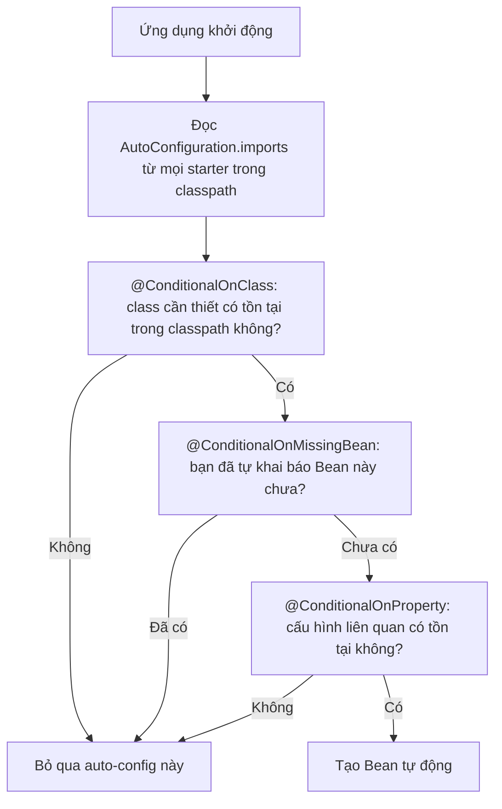

# CHƯƠNG 4: LÀM QUEN VỚI SPRING BOOT

> Tài liệu đào tạo Java Backend Developer — dành cho người đã có nền tảng Backend (Node.js/Express/NestJS), chuyển sang hệ sinh thái Java/Spring Boot.

## Mục lục

- [Giới thiệu](#giới-thiệu)
- [4.1. Spring Boot là gì, tại sao dùng Spring Boot thay vì Spring thuần](#41-spring-boot-là-gì-tại-sao-dùng-spring-boot-thay-vì-spring-thuần)
- [4.2. Spring Initializr — tạo project](#42-spring-initializr-tạo-project)
- [4.3. Cấu trúc thư mục 1 project Spring Boot](#43-cấu-trúc-thư-mục-1-project-spring-boot)
- [4.4. File `application.properties` / `application.yml`](#44-file-applicationproperties-applicationyml)
- [4.5. Annotation cơ bản](#45-annotation-cơ-bản)
- [4.6. Auto-configuration, Starter dependencies](#46-auto-configuration-starter-dependencies)
  - [4.6.1. Starter dependencies](#461-starter-dependencies)
  - [4.6.2. Auto-configuration — cơ chế thực sự bên dưới](#462-auto-configuration-cơ-chế-thực-sự-bên-dưới)
- [4.7. Chạy thử ứng dụng Spring Boot đầu tiên ("Hello World")](#47-chạy-thử-ứng-dụng-spring-boot-đầu-tiên-hello-world)
- [So sánh tổng hợp Chương 4](#so-sánh-tổng-hợp-chương-4)
- [Best Practices](#best-practices)
- [Anti-patterns](#anti-patterns)
- [Bài tập](#bài-tập)
- [Tổng kết](#tổng-kết)

## Giới thiệu

Chương 3 đã cho bạn hiểu **IoC Container hoạt động ra sao ở tầng lõi** — Bean, Dependency Injection, ApplicationContext. Nhưng nếu chỉ dùng Spring thuần, bạn sẽ phải tự khai báo hàng chục `@Bean` cho DataSource, ObjectMapper, MVC Dispatcher, Embedded Server... trước khi viết được dòng nghiệp vụ đầu tiên.

**Spring Boot ra đời để giải quyết chính xác vấn đề đó**: cung cấp cấu hình mặc định hợp lý (sensible defaults) dựa trên những gì có trong classpath, để bạn `mvn spring-boot:run` là có ngay 1 web server chạy được, chỉ cần override khi cần khác biệt so với mặc định. Đây là triết lý **"Convention over Configuration"** — cùng triết lý mà NestJS CLI hay Create React App áp dụng, nhưng Spring Boot làm điều này ở quy mô sâu hơn nhiều nhờ cơ chế **Auto-configuration** dựa trên Reflection + Conditional Annotation.

Chương này đưa bạn từ zero tới có 1 ứng dụng Spring Boot chạy được, và quan trọng hơn — hiểu **cơ chế thực sự** đằng sau `@SpringBootApplication`, thay vì chỉ coi nó là "annotation thần kỳ phải có".

---

## 4.1. Spring Boot là gì, tại sao dùng Spring Boot thay vì Spring thuần

**Khái niệm**: Spring Boot **không phải là 1 framework khác thay thế Spring** — nó là 1 lớp "bọc" (wrapper) bên trên Spring Framework, cung cấp:
1. **Auto-configuration**: tự động cấu hình Bean dựa trên thư viện có trong classpath.
2. **Starter dependencies**: gom nhóm các dependency thường đi cùng nhau thành 1 artifact Maven duy nhất.
3. **Embedded server**: nhúng sẵn Tomcat/Jetty/Undertow — không cần cài đặt server riêng, không cần deploy file WAR ra ngoài như thời Java EE cũ.
4. **Production-ready features**: Actuator (health check, metrics) có sẵn gần như không cần cấu hình.

**So sánh: Spring thuần vs Spring Boot**

| Tiêu chí | Spring (thuần) | Spring Boot |
|---|---|---|
| Cấu hình DataSource, MVC, JPA | Tự viết `@Bean` tường minh cho từng thứ | Tự động cấu hình dựa trên `application.properties` + thư viện trong classpath |
| Deploy | Đóng gói WAR, deploy vào Tomcat/JBoss cài sẵn | Đóng gói JAR có server nhúng sẵn, chạy trực tiếp `java -jar app.jar` |
| Thời gian setup dự án mới | Vài giờ tới vài ngày | Vài phút (qua Spring Initializr) |
| Độ linh hoạt | Tối đa — kiểm soát từng chi tiết | Vẫn linh hoạt — mọi auto-config đều override được, không bị "khóa" |
| Phù hợp | Hệ thống legacy, yêu cầu kiểm soát cực kỳ chi tiết | 99% dự án mới hiện nay |

**Điểm cần làm rõ**: Spring Boot **không giấu Spring Framework đi** — mọi khái niệm Bean, DI, ApplicationContext ở Chương 3 vẫn nguyên vẹn. Spring Boot chỉ tự động hóa việc **khai báo Bean nào cần thiết**, bạn hoàn toàn có thể "nhìn xuyên qua" và override bất kỳ auto-config nào khi cần.

**Best Practices**: Luôn dùng Spring Boot cho dự án mới. Khi học, đừng chỉ nhớ "phải thêm annotation X" — hãy hiểu annotation đó **thay thế cho việc bạn phải tự viết bao nhiêu `@Bean` thủ công**.

---

## 4.2. Spring Initializr — tạo project

**Khái niệm**: [start.spring.io](https://start.spring.io) là công cụ chính thức để sinh ra khung project Spring Boot với cấu trúc Maven/Gradle chuẩn, đã cấu hình sẵn các dependency bạn chọn — tương đương `npx create-nest-app` hay `npm init` với template có sẵn bên Node.js.

**Cách dùng**: Chọn:
- **Project**: Maven (theo yêu cầu tài liệu này).
- **Language**: Java.
- **Spring Boot version**: bản ổn định mới nhất (3.x).
- **Metadata**: `groupId` (thường là domain công ty đảo ngược, VD: `com.company`), `artifactId` (tên project), `Java version`: 21.
- **Dependencies**: chọn các starter cần dùng — VD: `Spring Web`, `Spring Data JPA`, `PostgreSQL Driver`, `Validation`, `Lombok` (tùy chọn).

Kết quả tải về là 1 file ZIP chứa project Maven đầy đủ, sẵn sàng import vào IntelliJ IDEA.

**Best Practices**: Chọn đúng Java version LTS (17 hoặc 21) ngay từ đầu — đổi Java version giữa chừng dự án lớn tốn khá nhiều công sức. Không chọn dependency "cho có" — mỗi starter thêm vào sẽ kéo theo auto-configuration tương ứng, thêm dependency thừa làm chậm thời gian khởi động và tăng rủi ro bảo mật (nhiều thư viện hơn = nhiều lỗ hổng tiềm ẩn hơn).

---

## 4.3. Cấu trúc thư mục 1 project Spring Boot

```
my-order-service/
├── pom.xml                                  # Khai báo dependency, build config (tương đương package.json)
├── src/
│   ├── main/
│   │   ├── java/
│   │   │   └── com/company/orderservice/
│   │   │       ├── OrderServiceApplication.java   # Entry point - chứa main()
│   │   │       ├── controller/              # Tầng nhận HTTP request
│   │   │       │   └── OrderController.java
│   │   │       ├── service/                 # Tầng business logic
│   │   │       │   ├── OrderService.java
│   │   │       │   └── impl/
│   │   │       │       └── OrderServiceImpl.java
│   │   │       ├── repository/              # Tầng truy cập dữ liệu
│   │   │       │   └── OrderRepository.java
│   │   │       ├── domain/                  # Entity JPA
│   │   │       │   └── Order.java
│   │   │       ├── dto/                     # Request/Response object
│   │   │       │   ├── CreateOrderRequest.java
│   │   │       │   └── OrderResponse.java
│   │   │       ├── config/                  # @Configuration class
│   │   │       │   └── AppConfig.java
│   │   │       └── exception/               # Custom exception + Global handler
│   │   │           ├── OrderNotFoundException.java
│   │   │           └── GlobalExceptionHandler.java
│   │   └── resources/
│   │       ├── application.yml              # File cấu hình chính
│   │       ├── application-dev.yml          # Cấu hình riêng cho profile "dev"
│   │       ├── application-prod.yml         # Cấu hình riêng cho profile "prod"
│   │       └── db/migration/                # Script Flyway (học ở chương Database)
│   └── test/
│       └── java/com/company/orderservice/
│           ├── service/
│           │   └── OrderServiceTest.java
│           └── controller/
│               └── OrderControllerTest.java
└── target/                                  # Build output (tương đương dist/ bên Node.js)
```

Nếu chia theo module
```
attendance/
├── controller/
│   └── AttendanceController.java
│
├── service/
│   ├── AttendanceService.java
│   └── impl/
│       └── AttendanceServiceImpl.java
│
├── repository/
│   └── AttendanceRepository.java
│
├── domain/
│   └── Attendance.java
│
├── dto/
│   ├── request/
│   │   ├── CreateAttendanceRequest.java
│   │   └── UpdateAttendanceRequest.java
│   │
│   └── response/
│       └── AttendanceResponse.java
│
├── mapper/
│   └── AttendanceMapper.java
│
├── specification/
│   └── AttendanceSpecification.java
│
├── validator/
│   └── AttendanceValidator.java
│
├── exception/
│   └── AttendanceException.java
│
├── enums/
│   └── AttendanceStatus.java
│
└── util/
    └── AttendanceUtils.java
```

**2 cách tổ chức package phổ biến trong enterprise**:

| Kiểu | Mô tả | Ưu điểm | Nhược điểm |
|---|---|---|---|
| **Package theo layer** (ví dụ trên) | `controller/`, `service/`, `repository/` ở cấp cao nhất, chứa mọi domain trộn lẫn | Dễ hiểu với người mới, đồng nhất toàn dự án | Khi dự án lớn, khó thấy "1 tính năng" nằm ở đâu — phải nhảy qua nhiều package |
| **Package theo feature** | `order/` chứa `OrderController`, `OrderService`, `OrderRepository` riêng; `customer/` tương tự | Cô lập rõ ràng theo domain, dễ maintain khi dự án lớn, gần với tư duy module của NestJS | Cần kỷ luật đặt tên nhất quán giữa các feature |

**Best Practices**: Với dự án nhỏ/vừa mới bắt đầu, package theo layer đủ dùng. Với dự án lớn (nhiều team cùng maintain, hướng tới tách microservices sau này), package theo feature giúp việc tách module/service sau này dễ dàng hơn nhiều.

---

## 4.4. File `application.properties` / `application.yml`

**Khái niệm**: Đây là file cấu hình trung tâm của ứng dụng Spring Boot, nơi khai báo mọi giá trị có thể thay đổi giữa các môi trường (database URL, port, log level...) mà không cần sửa code.

**2 định dạng — cùng chức năng, khác cú pháp**:

```properties
# application.properties
server.port=8080
spring.datasource.url=jdbc:postgresql://localhost:5432/orderdb
spring.datasource.username=postgres
spring.datasource.password=secret
spring.jpa.hibernate.ddl-auto=validate
logging.level.com.company.orderservice=DEBUG
```

```yaml
# application.yml - cùng nội dung, cấu trúc phân cấp (giống cấu trúc object JSON/JS)
server:
  port: 8080

spring:
  datasource:
    url: jdbc:postgresql://localhost:5432/orderdb
    username: postgres
    password: secret
  jpa:
    hibernate:
      ddl-auto: validate

logging:
  level:
    com.company.orderservice: DEBUG
```

**So sánh: `.properties` vs `.yml`**

| Tiêu chí | `.properties` | `.yml` |
|---|---|---|
| Cấu trúc phân cấp | Phẳng, lặp lại prefix (`spring.datasource.url`, `spring.datasource.username`...) | Lồng nhau tự nhiên, giống JSON/object — quen thuộc hơn với dev từ Node.js |
| Độ dài file lớn | Dài dòng, khó đọc khi nhiều cấu hình | Ngắn gọn, dễ đọc hơn |
| Khai báo List/Array | Cú pháp `key[0]=value` khó đọc | Cú pháp `- value` tự nhiên |
| Độ nhạy với indentation | Không có vấn đề | Sai indentation (dùng tab thay space) gây lỗi khó phát hiện |
| Khuyến nghị thực tế | Cấu hình đơn giản, ít nested | ✅ Khuyến nghị mặc định cho dự án enterprise hiện đại |

**Đọc giá trị cấu hình vào code — `@Value` vs `@ConfigurationProperties`**:

```java
// Cách 1: @Value - phù hợp cho 1-2 giá trị đơn lẻ
@Component
public class MailSender {
    @Value("${mail.sender.address}")
    private String senderAddress;
}

// Cách 2: @ConfigurationProperties - phù hợp khi có 1 NHÓM cấu hình liên quan, type-safe hoàn toàn
@ConfigurationProperties(prefix = "mail.sender")
public record MailSenderProperties(
        String address,
        String displayName,
        int retryAttempts,
        Duration timeout
) {}

// Kích hoạt trong Application class hoặc @Configuration class
@SpringBootApplication
@EnableConfigurationProperties(MailSenderProperties.class)
public class OrderServiceApplication { /* ... */ }

// Sử dụng - inject như Bean bình thường, đầy đủ type-safety, không có "magic string" rải rác
@Service
public class NotificationService {
    private final MailSenderProperties mailSenderProperties;

    public NotificationService(MailSenderProperties mailSenderProperties) {
        this.mailSenderProperties = mailSenderProperties;
    }
}
```

```yaml
mail:
  sender:
    address: no-reply@company.com
    display-name: "Company Order System"
    retry-attempts: 3
    timeout: 5s
```

**So sánh: `@Value` vs `@ConfigurationProperties`**

| Tiêu chí | `@Value` | `@ConfigurationProperties` |
|---|---|---|
| Số lượng giá trị | 1 giá trị/annotation | Cả nhóm cấu hình cùng lúc |
| Type safety | Yếu — dễ typo trong chuỗi SpEL | Mạnh — bind trực tiếp vào field có kiểu rõ ràng |
| Validate | Khó, phải tự viết thêm | Dễ — kết hợp `@Validated` + Bean Validation annotation |
| Refactor (đổi tên field) | Không được IDE hỗ trợ tốt (chuỗi string) | IDE hỗ trợ refactor như field bình thường |
| Khuyến nghị | Cấu hình lẻ tẻ, ít khi đổi | ✅ Khuyến nghị cho nhóm cấu hình có cấu trúc |

**Best Practices**:
- Dùng `.yml` cho dự án mới.
- Không hardcode giá trị nhạy cảm (password, API key) trực tiếp vào file cấu hình commit lên Git — dùng biến môi trường (`${DB_PASSWORD}`) hoặc secret manager (Vault, AWS Secrets Manager — học ở chương DevOps).
- Ưu tiên `@ConfigurationProperties` cho mọi nhóm cấu hình từ 3 giá trị liên quan trở lên.

---

## 4.5. Annotation cơ bản

**`@SpringBootApplication`** — đây là annotation "tổng hợp" (meta-annotation), thực chất gộp 3 annotation:

```java
// Bản chất thật của @SpringBootApplication (rút gọn)
@SpringBootConfiguration   // = @Configuration, đánh dấu đây là class cấu hình
@EnableAutoConfiguration   // BẬT cơ chế Auto-configuration (chi tiết ở mục 4.6)
@ComponentScan             // Quét package hiện tại + package con để tìm @Component
public @interface SpringBootApplication { }
```

```java
@SpringBootApplication
public class OrderServiceApplication {
    public static void main(String[] args) {
        SpringApplication.run(OrderServiceApplication.class, args);
        // Dòng này khởi động toàn bộ IoC Container đã học ở Chương 3:
        // quét component, tạo BeanDefinition, resolve dependency, khởi tạo Bean,
        // khởi động embedded Tomcat, sẵn sàng nhận HTTP request
    }
}
```

**Lưu ý quan trọng về vị trí đặt class chứa `@SpringBootApplication`**: Class này nên đặt ở package **gốc** (root package), vì `@ComponentScan` mặc định chỉ quét package hiện tại và package con — nếu đặt sai vị trí (VD: trong 1 sub-package), các Bean ở package khác sẽ **không được tìm thấy**, đây là lỗi rất phổ biến với người mới.

**Nhóm annotation stereotype đã học ở Chương 3** (`@Component`, `@Service`, `@Repository`, `@Controller`/`@RestController`, `@Autowired`) — không nhắc lại chi tiết ở đây, chỉ lưu ý: tất cả các annotation này chỉ hoạt động được **vì `@ComponentScan` đã quét và tìm thấy chúng** — nếu Bean nằm ngoài phạm vi scan, dù có đánh dấu `@Service` cũng vô nghĩa.

---

## 4.6. Auto-configuration, Starter dependencies

### 4.6.1. Starter dependencies

**Khái niệm**: Starter là 1 artifact Maven đặc biệt, **bản thân nó không chứa code**, chỉ chứa danh sách các dependency thường đi cùng nhau, giúp bạn khai báo 1 dòng thay vì chục dòng.

```xml
<!-- Chỉ cần 1 dòng này... -->
<dependency>
    <groupId>org.springframework.boot</groupId>
    <artifactId>spring-boot-starter-web</artifactId>
</dependency>

<!-- ...thay vì phải tự khai báo TỪNG dependency riêng lẻ mà starter-web đã gộp sẵn:
     spring-webmvc, spring-web, tomcat-embed-core, jackson-databind, 
     spring-boot-starter, spring-boot-starter-json, validation-api... -->
```

**Các starter thường dùng trong dự án enterprise**:

| Starter | Chức năng |
|---|---|
| `spring-boot-starter-web` | REST API, embedded Tomcat, Jackson (JSON) |
| `spring-boot-starter-data-jpa` | Spring Data JPA + Hibernate |
| `spring-boot-starter-security` | Spring Security |
| `spring-boot-starter-validation` | Bean Validation (`@Valid`, `@NotNull`...) |
| `spring-boot-starter-actuator` | Health check, metrics production-ready |
| `spring-boot-starter-test` | JUnit 5, Mockito, AssertJ, Spring Test |

### 4.6.2. Auto-configuration — cơ chế thực sự bên dưới

**Khái niệm**: Auto-configuration là cơ chế Spring Boot **tự động đăng ký Bean dựa trên những gì có trong classpath và cấu hình hiện tại**, thay vì bạn phải tự viết `@Bean` tường minh.

**Cách hoạt động bên trong**: Khi ứng dụng khởi động, Spring Boot đọc file `META-INF/spring/org.springframework.boot.autoconfigure.AutoConfiguration.imports` (từ Spring Boot 2.7+; trước đó là `spring.factories`) nằm trong mỗi thư viện — file này liệt kê hàng trăm class `@Configuration` "ứng viên". Mỗi class ứng viên được gắn các **Conditional Annotation** để tự quyết định "có nên kích hoạt cấu hình này không":

```java
// Đây là bản RÚT GỌN của DataSourceAutoConfiguration thật trong Spring Boot
@Configuration
@ConditionalOnClass(DataSource.class)          // CHỈ kích hoạt NẾU classpath có class DataSource
                                                // (tức là bạn có thêm driver JDBC/starter-data-jpa)
@ConditionalOnMissingBean(DataSource.class)    // CHỈ kích hoạt NẾU bạn CHƯA tự khai báo DataSource Bean
                                                // -> đây là lý do bạn LUÔN override được auto-config
@EnableConfigurationProperties(DataSourceProperties.class)
public class DataSourceAutoConfiguration {

    @Bean
    @ConditionalOnProperty(prefix = "spring.datasource", name = "url") // chỉ tạo nếu có cấu hình URL
    public DataSource dataSource(DataSourceProperties properties) {
        return properties.initializeDataSourceBuilder().build();
    }
}
```

**Đây chính là lý do**: nếu bạn thêm `spring-boot-starter-data-jpa` + driver PostgreSQL vào `pom.xml`, chỉ cần khai báo `spring.datasource.url` trong `application.yml` — Spring Boot **tự động tạo sẵn** `DataSource`, `EntityManagerFactory`, `TransactionManager` mà bạn không cần viết dòng `@Bean` nào. Nhưng nếu bạn tự viết `@Bean DataSource dataSource() {...}` như ở Chương 3, `@ConditionalOnMissingBean` sẽ khiến auto-configuration **tự động nhường chỗ** cho Bean bạn tự định nghĩa — đây là nguyên tắc "override luôn khả thi" của Spring Boot.



**Cách kiểm tra Auto-configuration nào đang thực sự chạy** (kỹ năng debug quan trọng thực tế):

```yaml
# application.yml - bật debug để xem báo cáo chi tiết auto-config nào MATCH/KHÔNG MATCH
debug: true
```

Khi bật `debug: true`, log khởi động sẽ in ra bảng **"CONDITIONS EVALUATION REPORT"** — liệt kê chính xác auto-configuration nào được kích hoạt và lý do, cực kỳ hữu ích khi debug "vì sao Bean X không được tạo".

**Best Practices**:
- Không "đoán mò" auto-config hoạt động thế nào — dùng `debug: true` để xem báo cáo thật khi gặp vấn đề.
- Khi cần custom hành vi khác mặc định, ưu tiên override qua `application.yml` (nếu có property tương ứng) trước khi viết `@Bean` tường minh để ghi đè toàn bộ.
- Không thêm starter dependency "phòng khi cần" — mỗi starter kéo theo auto-config tương ứng chạy lúc khởi động, thêm dependency thừa làm chậm quá trình boot và tăng bề mặt tấn công bảo mật.

**Sai lầm thường gặp**: Tự khai báo `@Bean` trùng với thứ auto-configuration đã cung cấp mà không biết, dẫn tới xung đột hoặc hành vi khó hiểu — luôn kiểm tra `debug: true` trước khi tự viết `@Bean` cho những thứ "tưởng là phải tự cấu hình" (DataSource, ObjectMapper, RestTemplate cơ bản...).

---

## 4.7. Chạy thử ứng dụng Spring Boot đầu tiên ("Hello World")

```java
package com.company.orderservice;

import org.springframework.boot.SpringApplication;
import org.springframework.boot.autoconfigure.SpringBootApplication;
import org.springframework.web.bind.annotation.GetMapping;
import org.springframework.web.bind.annotation.RestController;

@SpringBootApplication
public class OrderServiceApplication {
    public static void main(String[] args) {
        SpringApplication.run(OrderServiceApplication.class, args);
    }
}

@RestController
class HealthController {

    @GetMapping("/hello")
    public String hello() {
        return "Order Service is running!";
    }
}
```

```xml
<!-- pom.xml tối thiểu để chạy được ví dụ trên -->
<?xml version="1.0" encoding="UTF-8"?>
<project xmlns="http://maven.apache.org/POM/4.0.0">
    <modelVersion>4.0.0</modelVersion>

    <parent>
        <groupId>org.springframework.boot</groupId>
        <artifactId>spring-boot-starter-parent</artifactId>
        <version>3.3.0</version>
    </parent>

    <groupId>com.company</groupId>
    <artifactId>order-service</artifactId>
    <version>0.0.1-SNAPSHOT</version>

    <properties>
        <java.version>21</java.version>
    </properties>

    <dependencies>
        <dependency>
            <groupId>org.springframework.boot</groupId>
            <artifactId>spring-boot-starter-web</artifactId>
        </dependency>
        <dependency>
            <groupId>org.springframework.boot</groupId>
            <artifactId>spring-boot-starter-test</artifactId>
            <scope>test</scope>
        </dependency>
    </dependencies>

    <build>
        <plugins>
            <plugin>
                <groupId>org.springframework.boot</groupId>
                <artifactId>spring-boot-maven-plugin</artifactId>
            </plugin>
        </plugins>
    </build>
</project>
```

Chạy bằng lệnh:

```bash
mvn spring-boot:run
# hoặc
mvn clean package && java -jar target/order-service-0.0.1-SNAPSHOT.jar
```

Truy cập `http://localhost:8080/hello` sẽ thấy kết quả trả về. Quan sát log khởi động, bạn sẽ thấy dòng thông báo Tomcat khởi động trên port 8080 — đây là **embedded server**, không cần cài đặt Tomcat riêng như thời Java EE truyền thống.

---

## So sánh tổng hợp Chương 4

| Tiêu chí | Spring thuần | Spring Boot |
|---|---|---|
| Cấu hình Bean cơ bản (DataSource, MVC...) | Tự viết `@Bean` thủ công | Auto-configuration tự động |
| Deploy | WAR + server cài sẵn | JAR + embedded server |
| File cấu hình | XML hoặc Java Config phân tán | `application.yml` tập trung, hỗ trợ theo profile |

| Tiêu chí | `.properties` | `.yml` |
|---|---|---|
| Cấu trúc | Phẳng | Phân cấp, dễ đọc |
| Khuyến nghị | Cấu hình đơn giản | ✅ Mặc định cho dự án enterprise |

---

## Best Practices

- Luôn khởi tạo project qua Spring Initializr, chọn đúng Java LTS version (17/21) và chỉ chọn dependency thực sự cần dùng.
- Đặt class `@SpringBootApplication` ở package gốc để `@ComponentScan` bao phủ đúng phạm vi.
- Ưu tiên `.yml` + `@ConfigurationProperties` cho cấu hình có cấu trúc, tránh hardcode secret vào file commit Git.
- Dùng `debug: true` để hiểu rõ auto-configuration nào đang chạy khi cần debug hành vi bất thường.
- Tổ chức package theo layer khi dự án nhỏ/vừa, chuyển sang package theo feature khi dự án lớn dần.

## Anti-patterns

- Thêm dependency/starter "phòng khi cần" mà không dùng tới — tăng thời gian khởi động và rủi ro bảo mật không cần thiết.
- Đặt class `@SpringBootApplication` không phải ở package gốc, dẫn đến Bean ở package khác không được scan.
- Tự viết `@Bean` trùng lặp với thứ Auto-configuration đã cung cấp sẵn mà không kiểm tra trước bằng `debug: true`.
- Hardcode username/password database trực tiếp trong `application.yml` rồi commit lên Git.
- Trộn lẫn cấu hình của nhiều môi trường (dev/staging/prod) trong cùng 1 file thay vì tách theo Profile (học chi tiết ở chương sau).

## Bài tập

1. **Dễ**: Khởi tạo 1 project Spring Boot mới qua Spring Initializr với `spring-boot-starter-web`, viết 1 REST endpoint `GET /ping` trả về `"pong"`.
2. **Trung bình**: Viết 1 nhóm cấu hình `app.mail.*` trong `application.yml` (gồm `host`, `port`, `username`), bind vào 1 `record` qua `@ConfigurationProperties`, inject vào 1 Service và in ra log lúc `@PostConstruct`.
3. **Khó**: Thêm `spring-boot-starter-data-jpa` + driver H2 (in-memory database) vào dự án, chỉ cấu hình `spring.datasource.url` trong `application.yml` (không viết bất kỳ `@Bean DataSource` nào), bật `debug: true`, tìm và giải thích trong log dòng `DataSourceAutoConfiguration` đã match với điều kiện nào để tự động tạo Bean.

## Tổng kết

Chương này đã đưa những khái niệm trừu tượng của Chương 3 (Bean, IoC Container) vào bối cảnh thực tế của Spring Boot: hiểu rõ Spring Boot không phải "framework khác" mà là lớp tự động hóa việc khai báo Bean dựa trên Conditional Annotation; nắm được cấu trúc project chuẩn và cách tổ chức package theo layer hoặc feature; thành thạo việc cấu hình qua `application.yml` với `@Value`/`@ConfigurationProperties`; và quan trọng nhất — hiểu được cơ chế **Auto-configuration** hoạt động dựa trên `@ConditionalOnClass`/`@ConditionalOnMissingBean`/`@ConditionalOnProperty`, để không còn coi `@SpringBootApplication` là "annotation ma thuật" mà là kết quả tự nhiên của Reflection + Conditional Bean Registration đã học từ Chương 2 và 3.

Với nền tảng này, Chương 5 sẽ chuyển sang xây dựng REST API thực tế với Spring MVC — `@RestController`, xử lý request/response, validation, và exception handling tập trung.
