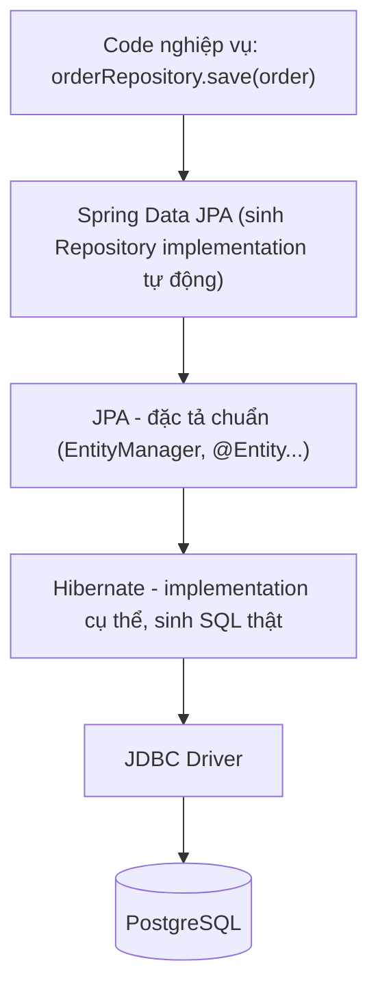
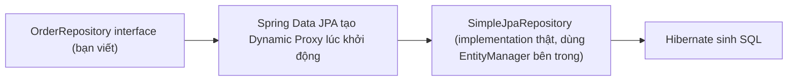

# CHƯƠNG 5: LÀM VIỆC VỚI CƠ SỞ DỮ LIỆU

> Tài liệu đào tạo Java Backend Developer — dành cho người đã có nền tảng Backend (Node.js/Express/NestJS), chuyển sang hệ sinh thái Java/Spring Boot.

## Mục lục

- [Giới thiệu](#giới-thiệu)
- [5.1. Spring Data JPA](#51-spring-data-jpa)
  - [5.1.1. ORM là gì, Hibernate là gì](#511-orm-là-gì-hibernate-là-gì)
  - [5.1.2. `@Entity`, `@Id`, `@GeneratedValue`, `@Column`, `@Table`](#512-entity-id-generatedvalue-column-table)
  - [5.1.3. Relationship Mapping](#513-relationship-mapping)
  - [5.1.4. JpaRepository, CrudRepository](#514-jparepository-crudrepository)
  - [5.1.5. Query Method, `@Query`](#515-query-method-query)
  - [5.1.6. Pagination & Sorting](#516-pagination-sorting)
- [5.2. Kết nối Database](#52-kết-nối-database)
  - [5.2.1. Cấu hình DataSource cho PostgreSQL](#521-cấu-hình-datasource-cho-postgresql)
  - [5.2.2. Flyway / Liquibase — quản lý migration database](#522-flyway-liquibase-quản-lý-migration-database)
  - [5.2.3. H2 Database cho testing](#523-h2-database-cho-testing)
- [5.3. Transaction](#53-transaction)
  - [5.3.1. `@Transactional`](#531-transactional)
  - [5.3.2. Transaction Propagation](#532-transaction-propagation)
  - [5.3.3. Isolation Level](#533-isolation-level)
- [5.4. Chủ đề mở rộng về dữ liệu](#54-chủ-đề-mở-rộng-về-dữ-liệu)
  - [5.4.1. Hibernate Caching: First-level cache và Second-level cache](#541-hibernate-caching-first-level-cache-và-second-level-cache)
  - [5.4.2. Multiple DataSource](#542-multiple-datasource)
  - [5.4.3. NoSQL với Spring Data: MongoDB, Redis](#543-nosql-với-spring-data-mongodb-redis)
- [Ví dụ Code: Tổng hợp toàn bộ chương trong 1 tình huống thực tế](#ví-dụ-code-tổng-hợp-toàn-bộ-chương-trong-1-tình-huống-thực-tế)
- [So sánh tổng hợp Chương 5](#so-sánh-tổng-hợp-chương-5)
- [Best Practices](#best-practices)
- [Anti-patterns](#anti-patterns)
- [Bài tập](#bài-tập)
- [Tổng kết](#tổng-kết)

## Giới thiệu

Nếu bạn từng dùng TypeORM hay Prisma bên Node.js, khái niệm ORM (Object-Relational Mapping) không xa lạ. Spring Data JPA là câu trả lời của hệ sinh thái Java — nhưng nó không phải là 1 ORM tự viết, mà là 1 lớp **abstraction trên Hibernate** (ORM implementation phổ biến nhất của Java), giúp bạn thao tác database qua object Java thay vì viết SQL thủ công cho từng thao tác CRUD.

Chương này đi từ khái niệm ORM/Hibernate, cách mapping Entity-Table, tới cách Spring Data JPA sinh ra **implementation cho Repository interface hoàn toàn tự động** (không cần bạn viết 1 dòng code implement nào) — đây là điểm khiến người mới học Java ngạc nhiên nhất, và cũng chính là ứng dụng thực tế lớn nhất của Reflection + Proxy Pattern đã học ở Chương 2.

---

## 5.1. Spring Data JPA

### 5.1.1. ORM là gì, Hibernate là gì

**Khái niệm**: ORM (Object-Relational Mapping) là kỹ thuật ánh xạ giữa **object hướng đối tượng** (trong code) và **bảng quan hệ** (trong database) — bạn thao tác với object Java (`order.setStatus(...)`, `orderRepository.save(order)`), ORM tự sinh câu SQL tương ứng (`UPDATE orders SET status = ? WHERE id = ?`).

**JPA (Jakarta Persistence API)** là 1 **đặc tả (specification)** — tập hợp interface/annotation chuẩn (`@Entity`, `@Id`, `EntityManager`...) do Jakarta EE định nghĩa, không phải implementation cụ thể.

**Hibernate** là **implementation phổ biến nhất** của đặc tả JPA — Hibernate thực sự viết code sinh SQL, quản lý transaction, cache. Khi bạn dùng Spring Boot với `spring-boot-starter-data-jpa`, mặc định Hibernate được chọn làm JPA provider.

**Spring Data JPA** là lớp trên cùng, xây dựng trên JPA (và do đó trên Hibernate), giúp bạn **không cần viết bất kỳ implementation Repository nào** — chỉ cần khai báo interface, Spring Data JPA tự sinh code tại runtime.



**So sánh nhanh với hệ sinh thái Node.js**: Spring Data JPA + Hibernate tương đương TypeORM (ORM đầy đủ, tự sinh query từ decorator/annotation), khác với Prisma (dùng schema file riêng + code generation) hoặc query builder thuần như Knex.js.

### 5.1.2. `@Entity`, `@Id`, `@GeneratedValue`, `@Column`, `@Table`

**Khái niệm**: Entity là 1 class Java được đánh dấu `@Entity`, đại diện cho 1 bảng trong database — mỗi instance của Entity tương ứng 1 dòng (row), mỗi field tương ứng 1 cột (column).

```java
@Entity
@Table(name = "orders", indexes = {
        @Index(name = "idx_orders_customer_id", columnList = "customer_id"),
        @Index(name = "idx_orders_status", columnList = "status")
})
public class Order {

    @Id
    @GeneratedValue(strategy = GenerationType.IDENTITY) // DB tự sinh ID (AUTO_INCREMENT/SERIAL)
    private Long id;

    @Column(name = "order_code", nullable = false, unique = true, length = 20)
    private String orderCode;

    @Column(name = "total_amount", precision = 19, scale = 2, nullable = false)
    private BigDecimal totalAmount;

    @Enumerated(EnumType.STRING) // LƯU Ý: luôn dùng STRING, KHÔNG dùng ORDINAL (mặc định)
    @Column(name = "status", nullable = false, length = 20)
    private OrderStatus status;

    @Column(name = "created_at", nullable = false, updatable = false)
    private LocalDateTime createdAt;

    @Version // Optimistic Locking - tự động tăng mỗi lần update, tránh lost update khi concurrent
    private Long version;

    protected Order() {
        // Constructor không tham số BẮT BUỘC phải có (protected/public) - Hibernate dùng Reflection
        // để tạo instance qua constructor này khi load dữ liệu từ DB, sau đó set field bằng Reflection
    }

    public Order(String orderCode, BigDecimal totalAmount) {
        this.orderCode = orderCode;
        this.totalAmount = totalAmount;
        this.status = OrderStatus.PENDING;
        this.createdAt = LocalDateTime.now();
    }

    // Getter cần thiết cho Hibernate/framework khác đọc giá trị (JSON serialize...)
    // KHÔNG cần setter cho mọi field - giữ nguyên tắc encapsulation đã học ở Chương 1
    public Long getId() { return id; }
    public OrderStatus getStatus() { return status; }

    public void confirm() {
        if (this.status != OrderStatus.PENDING) {
            throw new IllegalStateException("Chỉ xác nhận được đơn hàng đang PENDING");
        }
        this.status = OrderStatus.CONFIRMED;
    }
}
```

**Giải thích từng annotation quan trọng**:
- **`@Id`**: đánh dấu field là khóa chính (Primary Key).
- **`@GeneratedValue`**: chiến lược sinh giá trị khóa chính tự động. `IDENTITY` (dùng cột auto-increment của DB, đơn giản nhưng không tối ưu cho batch insert), `SEQUENCE` (dùng sequence object của DB — PostgreSQL hỗ trợ rất tốt, cho phép Hibernate lấy trước 1 dải ID, tối ưu batch insert hơn `IDENTITY`), `UUID` (sinh UUID, phù hợp hệ thống phân tán tránh xung đột ID giữa nhiều service).
- **`@Column`**: tùy chỉnh ánh xạ cột (tên cột khác tên field, độ dài, nullable, unique, precision cho số thập phân).
- **`@Enumerated(EnumType.STRING)`**: **bắt buộc** dùng `STRING` thay vì mặc định `ORDINAL` — `ORDINAL` lưu enum dưới dạng số thứ tự (0, 1, 2...), cực kỳ nguy hiểm vì nếu sau này thêm/sắp xếp lại giá trị enum, dữ liệu cũ trong DB sẽ bị đọc sai mà không có lỗi nào cảnh báo.
- **`@Version`**: hiện thực **Optimistic Locking** — mỗi lần update, Hibernate tự kiểm tra `version` trong DB có khớp với version đọc lúc đầu không; nếu không khớp (do thread/request khác đã update trước), ném `OptimisticLockException` — cơ chế quan trọng để tránh **lost update** trong môi trường nhiều request đồng thời.

**Best Practices**:
- Luôn có constructor không tham số (Hibernate yêu cầu, dùng để tạo proxy và load dữ liệu qua Reflection).
- Luôn dùng `@Enumerated(EnumType.STRING)`, không bao giờ dùng `ORDINAL`.
- Dùng `@Version` cho Entity có khả năng bị update đồng thời bởi nhiều request/thread.
- Đặt tên cột rõ ràng bằng `@Column(name = "...")`, không phụ thuộc vào cơ chế tự động chuyển `camelCase` → `snake_case` của Hibernate (dù nó hoạt động đúng theo mặc định, việc khai báo tường minh giúp code rõ ràng hơn khi đọc).

### 5.1.3. Relationship Mapping

**Khái niệm**: JPA cung cấp 4 loại quan hệ ánh xạ tương ứng với quan hệ khóa ngoại trong RDBMS.

```java
// @ManyToOne - nhiều Order thuộc về 1 Customer (phía "nhiều" luôn giữ khóa ngoại)
@Entity
public class Order {
    @Id @GeneratedValue
    private Long id;

    @ManyToOne(fetch = FetchType.LAZY) // LUÔN dùng LAZY cho @ManyToOne, KHÔNG dùng EAGER mặc định
    @JoinColumn(name = "customer_id", nullable = false)
    private Customer customer;

    @OneToMany(mappedBy = "order", cascade = CascadeType.ALL, orphanRemoval = true)
    private List<OrderItem> items = new ArrayList<>();

    // Helper method để đồng bộ 2 chiều quan hệ - Best Practice quan trọng, tránh bug tham chiếu lệch
    public void addItem(OrderItem item) {
        items.add(item);
        item.setOrder(this);
    }
}

@Entity
public class OrderItem {
    @Id @GeneratedValue
    private Long id;

    @ManyToOne(fetch = FetchType.LAZY)
    @JoinColumn(name = "order_id", nullable = false)
    private Order order;

    private String sku;
    private int quantity;

    void setOrder(Order order) { this.order = order; } // package-private, chỉ Order gọi qua addItem()
}

// @ManyToMany - Product có nhiều Category, Category có nhiều Product
@Entity
public class Product {
    @Id @GeneratedValue
    private Long id;

    @ManyToMany
    @JoinTable(
        name = "product_category",
        joinColumns = @JoinColumn(name = "product_id"),
        inverseJoinColumns = @JoinColumn(name = "category_id")
    )
    private Set<Category> categories = new HashSet<>();
}
```

**So sánh: `FetchType.LAZY` vs `FetchType.EAGER`**

| Tiêu chí | LAZY | EAGER |
|---|---|---|
| Thời điểm load dữ liệu liên quan | Chỉ khi thực sự truy cập (`order.getCustomer().getName()`) | Ngay lập tức cùng lúc load Entity chính |
| Hiệu năng mặc định | Tốt hơn — tránh load dữ liệu không cần thiết | Có thể load thừa dữ liệu không dùng tới |
| Rủi ro | `LazyInitializationException` nếu truy cập ngoài phạm vi Session/Transaction | Nguy cơ N+1 Query hoặc load quá nhiều dữ liệu không kiểm soát |
| Mặc định của JPA | `@ManyToOne`, `@OneToOne`: EAGER (mặc định gây hại) | `@OneToMany`, `@ManyToMany`: LAZY (mặc định hợp lý) |
| Khuyến nghị | ✅ Luôn ép `LAZY` cho MỌI loại quan hệ, kể cả `@ManyToOne`/`@OneToOne` | Tránh dùng trừ khi có lý do đo lường rõ ràng |

**Best Practices Relationship**:
- **Luôn ép `fetch = FetchType.LAZY`** cho mọi quan hệ, kể cả `@ManyToOne`/`@OneToOne` (JPA mặc định là EAGER cho 2 loại này — đây là 1 trong những "bẫy" phổ biến nhất khiến ứng dụng chậm dần khi dữ liệu lớn).
- Dùng `cascade = CascadeType.ALL` + `orphanRemoval = true` cho quan hệ "sở hữu" thực sự (Order sở hữu OrderItem — xóa Order thì OrderItem con cũng phải xóa theo).
- Luôn viết helper method (`addItem()`) để đồng bộ 2 chiều quan hệ, tránh trường hợp chỉ set 1 chiều khiến Hibernate không nhận biết thay đổi đúng.
- Với `@ManyToMany`, cân nhắc chuyển thành 2 quan hệ `@OneToMany`/`@ManyToOne` qua 1 Entity trung gian tường minh khi bảng nối cần thêm cột riêng (VD: `createdAt`, `addedBy`).

### 5.1.4. JpaRepository, CrudRepository

**Khái niệm**: Đây là nơi thể hiện rõ nhất sức mạnh của Spring Data JPA — bạn chỉ cần khai báo **interface**, Spring Data JPA **tự động sinh implementation lúc runtime bằng Dynamic Proxy** (JDK Dynamic Proxy — cùng cơ chế Proxy Pattern đã học ở Chương 2, ứng dụng cho AOP).

```java
public interface OrderRepository extends JpaRepository<Order, Long> {
    // Không cần viết implementation - Spring Data JPA tự sinh code cho các method có sẵn:
    // save(), findById(), findAll(), deleteById(), count(), existsById()...
}
```



**Hệ thống phân cấp interface**:

| Interface | Cung cấp |
|---|---|
| `Repository<T, ID>` | Marker interface gốc, không có method nào |
| `CrudRepository<T, ID>` | CRUD cơ bản: `save`, `findById`, `findAll`, `delete`, `count` |
| `PagingAndSortingRepository<T, ID>` | Thêm `findAll(Pageable)`, `findAll(Sort)` |
| `JpaRepository<T, ID>` | Kế thừa cả 2 trên + các method đặc thù JPA: `saveAndFlush`, `deleteAllInBatch`, `getReferenceById` |

**Best Practices**: Trong Spring Boot hiện đại, **luôn extends `JpaRepository`** trực tiếp (không cần extends `CrudRepository` riêng) — `JpaRepository` đã bao gồm mọi tính năng cần thiết cho ứng dụng thực tế.

### 5.1.5. Query Method, `@Query`

**Query Method — sinh query từ tên method** (không cần viết SQL/JPQL):

```java
public interface OrderRepository extends JpaRepository<Order, Long> {

    // Spring Data JPA phân tích tên method để tự sinh query tương ứng
    Optional<Order> findByOrderCode(String orderCode);

    List<Order> findByStatusAndCustomerId(OrderStatus status, Long customerId);

    List<Order> findByCreatedAtBetweenOrderByCreatedAtDesc(LocalDateTime from, LocalDateTime to);

    boolean existsByOrderCode(String orderCode);

    long countByStatus(OrderStatus status);

    List<Order> findTop10ByStatusOrderByTotalAmountDesc(OrderStatus status);
}
```

**`@Query` — khi tên method không đủ diễn tả logic phức tạp**:

```java
public interface OrderRepository extends JpaRepository<Order, Long> {

    // JPQL - làm việc với Entity/field Java, KHÔNG phải tên bảng/cột thật trong DB
    @Query("SELECT o FROM Order o WHERE o.totalAmount > :threshold AND o.status = :status")
    List<Order> findHighValueOrders(@Param("threshold") BigDecimal threshold,
                                     @Param("status") OrderStatus status);

    // JOIN FETCH - giải pháp quan trọng để tránh N+1 Query (chi tiết ở Chương 7)
    @Query("SELECT o FROM Order o JOIN FETCH o.items WHERE o.id = :id")
    Optional<Order> findByIdWithItems(@Param("id") Long id);

    // Native SQL - dùng khi cần tính năng đặc thù của PostgreSQL mà JPQL không hỗ trợ
    @Query(value = """
            SELECT customer_id, SUM(total_amount) as total_revenue
            FROM orders
            WHERE status = 'CONFIRMED'
            GROUP BY customer_id
            HAVING SUM(total_amount) > :minRevenue
            """, nativeQuery = true)
    List<Object[]> findTopCustomersByRevenue(@Param("minRevenue") BigDecimal minRevenue);

    // Update/Delete cần @Modifying + @Transactional
    @Modifying
    @Transactional
    @Query("UPDATE Order o SET o.status = :newStatus WHERE o.status = :oldStatus AND o.createdAt < :cutoff")
    int bulkCancelStaleOrders(@Param("oldStatus") OrderStatus oldStatus,
                               @Param("newStatus") OrderStatus newStatus,
                               @Param("cutoff") LocalDateTime cutoff);
}
```

**So sánh: Query Method vs JPQL (`@Query`) vs Native SQL**

| Tiêu chí | Query Method | JPQL (`@Query`) | Native SQL |
|---|---|---|---|
| Độ phức tạp hỗ trợ | Đơn giản (2-3 điều kiện) | Trung bình - phức tạp | Bất kỳ độ phức tạp nào |
| Tính khả chuyển (portable) giữa các DB | ✅ Cao | ✅ Cao (JPQL độc lập DB) | ❌ Thấp (SQL đặc thù từng DB) |
| Tận dụng tính năng riêng của DB (Window Function, JSONB...) | ❌ | ❌ | ✅ |
| Đọc hiểu khi tên method quá dài | Khó (`findByStatusAndCustomerIdAndCreatedAtBetween...`) | Rõ ràng | Rõ ràng |
| Khuyến nghị | Query đơn giản, ít điều kiện | ✅ Mặc định cho query nghiệp vụ phức tạp | Khi cần tính năng đặc thù DB hoặc tối ưu hiệu năng cao |

### 5.1.6. Pagination & Sorting

```java
public interface OrderRepository extends JpaRepository<Order, Long> {
    Page<Order> findByStatus(OrderStatus status, Pageable pageable);
}

@Service
public class OrderQueryService {
    private final OrderRepository orderRepository;

    public Page<OrderDTO> searchOrders(OrderStatus status, int page, int size) {
        Pageable pageable = PageRequest.of(page, size, Sort.by(Sort.Direction.DESC, "createdAt"));
        Page<Order> orderPage = orderRepository.findByStatus(status, pageable);

        return orderPage.map(this::toDTO); // Page<T> hỗ trợ map() tương tự Stream
    }
}
```

`Page<T>` trả về không chỉ danh sách kết quả mà còn `totalElements`, `totalPages`, `hasNext()` — Spring Data JPA tự động chạy thêm 1 câu `COUNT` query để tính tổng số bản ghi. **Lưu ý hiệu năng**: với bảng dữ liệu cực lớn, câu `COUNT` này có thể tốn kém — cân nhắc dùng `Slice<T>` (chỉ biết có trang tiếp theo hay không, không cần COUNT toàn bộ) khi không thực sự cần hiển thị tổng số trang.

---

## 5.2. Kết nối Database

### 5.2.1. Cấu hình DataSource cho PostgreSQL

```xml
<!-- pom.xml -->
<dependency>
    <groupId>org.springframework.boot</groupId>
    <artifactId>spring-boot-starter-data-jpa</artifactId>
</dependency>
<dependency>
    <groupId>org.postgresql</groupId>
    <artifactId>postgresql</artifactId>
    <scope>runtime</scope>
</dependency>
```

```yaml
# application.yml
spring:
  datasource:
    url: jdbc:postgresql://localhost:5432/orderdb
    username: ${DB_USERNAME:postgres}
    password: ${DB_PASSWORD}
    hikari:
      maximum-pool-size: 20      # số connection tối đa trong pool
      minimum-idle: 5
      connection-timeout: 30000  # ms - thời gian chờ tối đa để lấy 1 connection từ pool
      idle-timeout: 600000
  jpa:
    hibernate:
      ddl-auto: validate         # xem giải thích chi tiết bên dưới - KHÔNG dùng "update" trong production
    show-sql: false              # true chỉ nên bật khi debug local, KHÔNG bật ở production (lộ SQL, giảm hiệu năng)
    properties:
      hibernate:
        format_sql: true
        jdbc:
          batch_size: 30         # gom nhiều INSERT/UPDATE thành 1 batch, giảm round-trip tới DB
```

**Giải thích `spring.jpa.hibernate.ddl-auto`** — đây là cấu hình gây ra nhiều sự cố production nhất trong lịch sử làm việc với Hibernate nếu hiểu sai:

| Giá trị | Hành vi | Môi trường phù hợp |
|---|---|---|
| `none` | Hibernate không đụng gì tới schema | Production (kết hợp Flyway/Liquibase quản lý schema) |
| `validate` | Kiểm tra Entity có khớp schema hiện tại không, báo lỗi nếu lệch, **không tự sửa** | ✅ Production — phát hiện sớm lệch giữa code và DB |
| `update` | Tự động ALTER TABLE để khớp Entity | ❌ TUYỆT ĐỐI KHÔNG dùng ở Production — có thể xóa nhầm cột, thay đổi kiểu dữ liệu gây mất dữ liệu |
| `create` / `create-drop` | Xóa và tạo lại schema mỗi lần khởi động | Chỉ dùng cho test tự động, không bao giờ dùng ngoài môi trường test |

### 5.2.2. Flyway / Liquibase — quản lý migration database

**Khái niệm**: Migration tool quản lý **lịch sử thay đổi schema database dưới dạng version-controlled script**, tương tự cách bạn quản lý migration trong TypeORM/Prisma/Knex — nhưng độc lập với code, chạy tự động lúc ứng dụng khởi động.

```
src/main/resources/db/migration/
├── V1__create_orders_table.sql
├── V2__create_order_items_table.sql
├── V3__add_index_orders_customer_id.sql
└── V4__add_column_orders_discount_code.sql
```

```sql
-- V1__create_orders_table.sql
CREATE TABLE orders (
    id BIGSERIAL PRIMARY KEY,
    order_code VARCHAR(20) NOT NULL UNIQUE,
    total_amount NUMERIC(19,2) NOT NULL,
    status VARCHAR(20) NOT NULL,
    created_at TIMESTAMP NOT NULL DEFAULT now(),
    version BIGINT NOT NULL DEFAULT 0
);

CREATE INDEX idx_orders_status ON orders(status);
```

```xml
<dependency>
    <groupId>org.flywaydb</groupId>
    <artifactId>flyway-core</artifactId>
</dependency>
<dependency>
    <groupId>org.flywaydb</groupId>
    <artifactId>flyway-database-postgresql</artifactId>
</dependency>
```

Flyway tự động chạy khi ứng dụng khởi động (mặc định `spring.flyway.enabled=true`), theo dõi các script đã chạy qua bảng `flyway_schema_history`, chỉ chạy script **mới** chưa từng áp dụng — an toàn khi deploy nhiều lần, nhiều môi trường.

**So sánh: Flyway vs Liquibase**

| Tiêu chí | Flyway | Liquibase |
|---|---|---|
| Định dạng script | SQL thuần (native, dễ đọc với DBA) | XML/YAML/JSON hoặc SQL (trừu tượng hơn) |
| Độ phức tạp học | Thấp — chỉ cần biết SQL | Cao hơn — cần học cú pháp changelog riêng |
| Rollback tự động | Chỉ ở bản trả phí (Teams) | Hỗ trợ rollback miễn phí |
| Khả chuyển giữa nhiều loại DB | Thấp (SQL đặc thù từng DB) | Cao (abstraction độc lập DB) |
| Phổ biến trong cộng đồng Spring Boot | ✅ Phổ biến hơn, mặc định nhiều tutorial | Phổ biến trong enterprise cần đa DB |

**Best Practices Migration**:
- **`ddl-auto: validate`** ở mọi môi trường có dữ liệu thật (staging, production) — để Flyway/Liquibase là nguồn chân lý duy nhất (single source of truth) cho schema.
- Không bao giờ sửa lại 1 migration script đã chạy ở production — luôn tạo script mới (`V5__...`) để thay đổi tiếp, đảm bảo lịch sử migration nhất quán giữa mọi môi trường.
- Đặt tên migration rõ ràng, có ý nghĩa nghiệp vụ (`V4__add_column_orders_discount_code.sql`, không phải `V4__update.sql`).

### 5.2.3. H2 Database cho testing

```xml
<dependency>
    <groupId>com.h2database</groupId>
    <artifactId>h2</artifactId>
    <scope>test</scope>
</dependency>
```

```yaml
# application-test.yml
spring:
  datasource:
    url: jdbc:h2:mem:testdb;DB_CLOSE_DELAY=-1
    driver-class-name: org.h2.Driver
  jpa:
    hibernate:
      ddl-auto: create-drop
```

**Lưu ý quan trọng**: H2 chỉ nên dùng cho **Unit Test đơn giản, chạy nhanh** — vì H2 không mô phỏng hoàn toàn hành vi PostgreSQL thật (khác biệt cú pháp, kiểu dữ liệu JSONB, function riêng...). Với Integration Test cần độ chính xác cao, **Testcontainers** (chạy PostgreSQL thật trong Docker container, học ở Chương Testing) là lựa chọn đúng đắn hơn trong enterprise hiện đại.

---

## 5.3. Transaction

### 5.3.1. `@Transactional`

**Khái niệm**: Transaction đảm bảo tính **ACID** (Atomicity, Consistency, Isolation, Durability) — một nhóm thao tác database hoặc **cùng thành công tất cả**, hoặc **cùng thất bại và rollback về trạng thái ban đầu**, không có trạng thái "nửa vời".

**Cách hoạt động bên trong**: `@Transactional` hoạt động dựa trên **AOP Proxy** (đã học nguyên lý ở Chương 2) — Spring tạo 1 proxy bọc quanh Bean, method được gọi thực chất đi qua proxy trước: proxy `begin transaction` → gọi method thật → nếu không có exception thì `commit`, nếu có unchecked exception thì `rollback`.

```java
@Service
public class OrderService {

    private final OrderRepository orderRepository;
    private final InventoryService inventoryService;

    @Transactional
    public Order createOrder(CreateOrderRequest request) {
        Order order = new Order(generateOrderCode(), request.totalAmount());
        orderRepository.save(order);

        // Nếu dòng này ném exception, TOÀN BỘ transaction (kể cả save() ở trên) sẽ ROLLBACK
        inventoryService.reserveStock(request.sku(), request.quantity());

        return order;
    }
}
```

**Cảnh báo cực kỳ quan trọng — "Self-invocation problem"**: Vì `@Transactional` dựa trên **Proxy**, nó **CHỈ hoạt động khi method được gọi từ BÊN NGOÀI object thông qua proxy**. Nếu 1 method trong cùng class gọi 1 method `@Transactional` khác **ngay trong nội bộ** (`this.methodA()`), lời gọi đó **bỏ qua hoàn toàn proxy**, transaction sẽ **không có tác dụng**:

```java
@Service
public class OrderService {

    public void processOrder(Order order) {
        this.saveWithTransaction(order); // ❌ Gọi qua "this" - BỎ QUA proxy, @Transactional VÔ HIỆU
    }

    @Transactional
    public void saveWithTransaction(Order order) {
        orderRepository.save(order);
    }
}
```

**Cách khắc phục**: Tách method `@Transactional` sang 1 Bean khác, hoặc tự inject chính mình qua `ApplicationContext` (ít khuyến khích), hoặc đơn giản nhất — thiết kế lại để method public gọi từ ngoài luôn là method có `@Transactional`.

### 5.3.2. Transaction Propagation

**Khái niệm**: Propagation xác định **hành vi khi 1 method `@Transactional` được gọi trong khi đã tồn tại 1 transaction khác đang chạy**.

| Propagation | Hành vi |
|---|---|
| `REQUIRED` (mặc định) | Dùng chung transaction hiện tại nếu có, nếu chưa có thì tạo mới |
| `REQUIRES_NEW` | Luôn tạm dừng transaction hiện tại (nếu có), tạo transaction **mới hoàn toàn độc lập** |
| `SUPPORTS` | Dùng transaction hiện tại nếu có, nếu không có thì chạy **không có transaction** |
| `NOT_SUPPORTED` | Luôn chạy **không có transaction**, tạm dừng transaction hiện tại nếu có |
| `MANDATORY` | Bắt buộc phải có transaction hiện tại, nếu không thì ném exception |
| `NEVER` | Bắt buộc KHÔNG có transaction hiện tại, nếu có thì ném exception |

```java
@Service
public class OrderService {

    private final AuditLogService auditLogService;

    @Transactional
    public void createOrder(CreateOrderRequest request) {
        // ... logic tạo đơn hàng, có thể ném exception và rollback ...
        auditLogService.logOrderCreation(request); // ghi log audit
    }
}

@Service
public class AuditLogService {

    // REQUIRES_NEW: ghi log audit LUÔN được lưu, KỂ CẢ KHI transaction tạo đơn hàng bị rollback sau đó
    // -> use case thực tế: audit log cần tồn tại độc lập với kết quả nghiệp vụ chính, phục vụ điều tra
    @Transactional(propagation = Propagation.REQUIRES_NEW)
    public void logOrderCreation(CreateOrderRequest request) {
        auditLogRepository.save(new AuditLog(/* ... */));
    }
}
```

### 5.3.3. Isolation Level

**Khái niệm**: Isolation Level xác định mức độ 1 transaction "nhìn thấy" thay đổi dữ liệu từ transaction khác đang chạy đồng thời — đánh đổi giữa tính nhất quán dữ liệu và hiệu năng.

| Isolation Level | Ngăn được | Hiệu năng |
|---|---|---|
| `READ_UNCOMMITTED` | Không ngăn gì (đọc được dữ liệu chưa commit — "dirty read") | Cao nhất, gần như không dùng thực tế |
| `READ_COMMITTED` (mặc định PostgreSQL) | Dirty read | Tốt, phù hợp đa số ứng dụng |
| `REPEATABLE_READ` | Dirty read + Non-repeatable read (đọc lại cùng dòng cho kết quả khác) | Trung bình |
| `SERIALIZABLE` | Toàn bộ (dirty read, non-repeatable read, phantom read) | Thấp nhất, transaction có thể phải retry do conflict |

```java
@Transactional(isolation = Isolation.READ_COMMITTED) // mặc định PostgreSQL, phù hợp hầu hết trường hợp
public void updateInventory(String sku, int quantity) { /* ... */ }
```

**Best Practices Transaction**:
- Giữ `@Transactional` ở tầng **Service**, không đặt ở tầng Controller hay Repository.
- Method `@Transactional` nên **ngắn gọn** — không gọi API bên ngoài (HTTP call tới service khác) bên trong transaction, vì transaction sẽ giữ connection DB mở suốt thời gian chờ API response, dễ gây cạn kiệt connection pool khi traffic cao.
- Chỉ dùng `REQUIRES_NEW` khi thực sự cần transaction độc lập (audit log, notification log) — lạm dụng sẽ làm phức tạp hóa việc reasoning về tính nhất quán dữ liệu.
- Nhận thức rõ vấn đề self-invocation — đây là lỗi rất phổ biến khiến `@Transactional` "im lặng không hoạt động" mà không có bất kỳ cảnh báo nào lúc runtime.

**Sai lầm thường gặp**: Đặt `@Transactional` ở method `private` — Proxy của Spring (cả JDK Dynamic Proxy lẫn CGLIB) **không thể** bọc quanh method private, `@Transactional` sẽ hoàn toàn vô hiệu mà không có bất kỳ lỗi cảnh báo nào lúc compile hay khởi động.

---

## 5.4. Chủ đề mở rộng về dữ liệu

### 5.4.1. Hibernate Caching: First-level cache và Second-level cache

**First-level cache (Session Cache)**: **Luôn bật mặc định**, gắn liền với 1 `EntityManager`/`Session` (thường tương ứng 1 transaction). Trong cùng 1 transaction, gọi `findById()` 2 lần với cùng ID chỉ sinh **1 câu SQL** — lần thứ 2 Hibernate trả thẳng từ cache trong bộ nhớ.

```java
@Transactional
public void demo(Long orderId) {
    Order order1 = orderRepository.findById(orderId).get(); // sinh SQL SELECT
    Order order2 = orderRepository.findById(orderId).get(); // KHÔNG sinh SQL - lấy từ First-level cache
    // order1 == order2 (cùng tham chiếu object, không chỉ cùng giá trị)
}
```

**Second-level cache**: **Tắt mặc định**, cần bật tường minh — cache dữ liệu **giữa nhiều transaction/request khác nhau**, thường tích hợp với thư viện cache ngoài như Ehcache hoặc Caffeine.

```java
@Entity
@Cacheable
@org.hibernate.annotations.Cache(usage = CacheConcurrencyStrategy.READ_WRITE)
public class Category {
    @Id @GeneratedValue
    private Long id;
    private String name; // dữ liệu ít thay đổi, phù hợp cache - danh mục sản phẩm, cấu hình hệ thống
}
```

**Best Practices**: Second-level cache chỉ phù hợp cho dữ liệu **đọc nhiều, ghi ít, ít nhạy cảm với độ trễ cập nhật** (danh mục, cấu hình). Với dữ liệu nghiệp vụ thay đổi liên tục (Order, Inventory), Second-level cache dễ gây **stale data** (dữ liệu cũ) nguy hiểm hơn lợi ích mang lại — trong thực tế enterprise, **Redis ở tầng ứng dụng** (dùng `@Cacheable` của Spring, học ở chương sau) thường được ưu tiên hơn Second-level cache của Hibernate vì dễ kiểm soát, dễ chia sẻ giữa nhiều instance ứng dụng.

### 5.4.2. Multiple DataSource

**Khi nào cần**: Hệ thống cần đọc/ghi từ 2 database khác nhau — ví dụ tách **DB chính** (ghi) và **DB replica** (chỉ đọc, giảm tải cho DB chính), hoặc kết nối tới database của 1 hệ thống legacy song song với database chính.

```java
@Configuration
public class MultiDataSourceConfig {

    @Primary
    @Bean(name = "primaryDataSource")
    @ConfigurationProperties(prefix = "spring.datasource.primary")
    public DataSource primaryDataSource() {
        return DataSourceBuilder.create().build();
    }

    @Bean(name = "reportingDataSource")
    @ConfigurationProperties(prefix = "spring.datasource.reporting")
    public DataSource reportingDataSource() {
        return DataSourceBuilder.create().build();
    }

    @Primary
    @Bean(name = "primaryEntityManagerFactory")
    public LocalContainerEntityManagerFactoryBean primaryEntityManagerFactory(
            @Qualifier("primaryDataSource") DataSource dataSource,
            EntityManagerFactoryBuilder builder) {
        return builder.dataSource(dataSource)
                .packages("com.company.orderservice.domain.primary")
                .persistenceUnit("primary")
                .build();
    }
    // Tương tự cần khai báo TransactionManager riêng cho từng DataSource
}
```

**Best Practices**: Multiple DataSource làm tăng đáng kể độ phức tạp (transaction không thể "bắc cầu" giữa 2 DataSource khác nhau bằng `@Transactional` thông thường — cần XA transaction hoặc chấp nhận eventual consistency). Chỉ áp dụng khi thực sự cần thiết, và nên tách riêng biệt rõ ràng Entity/Repository nào thuộc DataSource nào bằng package riêng.

### 5.4.3. NoSQL với Spring Data: MongoDB, Redis

**Spring Data MongoDB** — cùng triết lý Repository như Spring Data JPA, nhưng làm việc với document thay vì bảng quan hệ:

```java
@Document(collection = "product_reviews")
public class ProductReview {
    @Id
    private String id; // MongoDB dùng String/ObjectId, không phải Long như JPA

    private String productId;
    private int rating;
    private String comment;
    private Instant createdAt;
}

public interface ProductReviewRepository extends MongoRepository<ProductReview, String> {
    List<ProductReview> findByProductIdOrderByCreatedAtDesc(String productId);
    List<ProductReview> findByRatingGreaterThanEqual(int rating);
}
```

**Spring Data Redis** — dùng Redis làm database chính (không chỉ cache), phù hợp cho dữ liệu cần truy cập cực nhanh, cấu trúc đơn giản (session, leaderboard, rate-limit counter):

```java
@RedisHash("shopping_cart")
public class ShoppingCart {
    @Id
    private String customerId;
    private Map<String, Integer> items; // sku -> quantity
    @TimeToLive
    private Long ttlSeconds = 86400L; // giỏ hàng tự động hết hạn sau 24h nếu không thao tác
}

public interface ShoppingCartRepository extends CrudRepository<ShoppingCart, String> {
}
```

**So sánh: Khi nào dùng RDBMS (PostgreSQL) vs NoSQL (MongoDB) vs Redis**

| Tiêu chí | PostgreSQL (RDBMS) | MongoDB (Document) | Redis (Key-Value in-memory) |
|---|---|---|---|
| Dữ liệu có cấu trúc quan hệ rõ ràng, cần JOIN | ✅ Phù hợp nhất | ⚠️ Hạn chế (không có JOIN thật) | ❌ Không phù hợp |
| Dữ liệu có schema thay đổi linh hoạt (VD: thuộc tính sản phẩm khác nhau theo ngành hàng) | ⚠️ Cần JSONB hoặc thiết kế phức tạp | ✅ Phù hợp tự nhiên | ⚠️ Hạn chế |
| Cần tính nhất quán ACID mạnh (giao dịch tài chính) | ✅ Phù hợp nhất | ⚠️ Hỗ trợ transaction nhưng phức tạp hơn | ❌ Không phù hợp |
| Tốc độ đọc/ghi cực nhanh, dữ liệu đơn giản | ⚠️ Chậm hơn (đọc từ đĩa, dù có cache) | ⚠️ Trung bình | ✅ Phù hợp nhất (in-memory) |
| Ví dụ use case thực tế | Order, Inventory, User, Payment | Product Review, Log, Content linh hoạt | Session, Cache, Rate-limit, Leaderboard, Giỏ hàng tạm |

---

## Ví dụ Code: Tổng hợp toàn bộ chương trong 1 tình huống thực tế

```java
@Entity
@Table(name = "orders")
public class Order {
    @Id @GeneratedValue(strategy = GenerationType.IDENTITY)
    private Long id;

    @Column(nullable = false, unique = true)
    private String orderCode;

    @ManyToOne(fetch = FetchType.LAZY)
    @JoinColumn(name = "customer_id", nullable = false)
    private Customer customer;

    @OneToMany(mappedBy = "order", cascade = CascadeType.ALL, orphanRemoval = true)
    private List<OrderItem> items = new ArrayList<>();

    @Enumerated(EnumType.STRING)
    private OrderStatus status;

    @Version
    private Long version;

    public void addItem(OrderItem item) {
        items.add(item);
        item.setOrder(this);
    }
}

public interface OrderRepository extends JpaRepository<Order, Long> {

    @Query("SELECT o FROM Order o JOIN FETCH o.items WHERE o.orderCode = :code")
    Optional<Order> findByOrderCodeWithItems(@Param("code") String code);

    Page<Order> findByCustomerId(Long customerId, Pageable pageable);
}

@Service
public class OrderService {

    private final OrderRepository orderRepository;
    private final InventoryService inventoryService;

    public OrderService(OrderRepository orderRepository, InventoryService inventoryService) {
        this.orderRepository = orderRepository;
        this.inventoryService = inventoryService;
    }

    @Transactional
    public Order createOrder(CreateOrderRequest request) {
        Order order = new Order(generateOrderCode(), request.customerId());
        request.items().forEach(item ->
                order.addItem(new OrderItem(item.sku(), item.quantity(), item.unitPrice())));

        orderRepository.save(order);
        inventoryService.reserveStock(request.items()); // cùng transaction - fail thì rollback toàn bộ

        return order;
    }

    @Transactional(readOnly = true) // tối ưu: Hibernate không cần dirty-checking khi chỉ đọc
    public Page<OrderDTO> getCustomerOrders(Long customerId, int page, int size) {
        Pageable pageable = PageRequest.of(page, size, Sort.by(Sort.Direction.DESC, "id"));
        return orderRepository.findByCustomerId(customerId, pageable).map(this::toDTO);
    }
}
```

---

## So sánh tổng hợp Chương 5

| Tiêu chí | JpaRepository | MongoRepository | CrudRepository (Redis) |
|---|---|---|---|
| Loại database | RDBMS quan hệ | Document NoSQL | Key-Value in-memory |
| Hỗ trợ JOIN/quan hệ | ✅ Đầy đủ | ❌ Hạn chế | ❌ Không có |
| Transaction ACID | ✅ Mạnh | ⚠️ Có nhưng hạn chế | ❌ Không có khái niệm transaction phức tạp |
| Use case phù hợp | Dữ liệu nghiệp vụ lõi | Dữ liệu schema linh hoạt | Cache, session, dữ liệu tạm |

---

## Best Practices

- Luôn ép `FetchType.LAZY` cho mọi quan hệ, kể cả `@ManyToOne`/`@OneToOne`.
- `ddl-auto: validate` ở mọi môi trường có dữ liệu thật, dùng Flyway/Liquibase làm nguồn chân lý cho schema.
- `@Transactional` đặt ở tầng Service, method public, tránh self-invocation.
- Dùng `@Query` với JOIN FETCH khi cần load quan hệ tránh N+1 (chi tiết ở Chương 7).
- Chọn đúng loại database theo đặc điểm dữ liệu: RDBMS cho dữ liệu quan hệ cần ACID, MongoDB cho schema linh hoạt, Redis cho tốc độ truy cập cực nhanh.
- Dùng `readOnly = true` trong `@Transactional` cho method chỉ đọc, giúp Hibernate tối ưu (bỏ qua dirty-checking).

## Anti-patterns

- Dùng `ddl-auto: update` ở môi trường production.
- `@Enumerated(EnumType.ORDINAL)` thay vì `STRING`.
- Đặt `@Transactional` trên method `private`, hoặc gọi method `@Transactional` qua `this` trong cùng class (self-invocation).
- Giữ transaction mở trong lúc gọi API bên ngoài (HTTP call), gây cạn kiệt connection pool.
- Lạm dụng Second-level cache cho dữ liệu nghiệp vụ thay đổi liên tục.
- Sửa lại migration script đã chạy ở production thay vì tạo script mới.

## Bài tập

1. **Dễ**: Thiết kế Entity `Product` với `@ManyToMany` tới `Category` qua bảng nối, viết Query Method tìm sản phẩm theo tên category.
2. **Trung bình**: Viết migration Flyway tạo bảng `orders` + `order_items`, cấu hình `ddl-auto: validate`, khởi động ứng dụng và xác nhận Hibernate không tự sửa schema.
3. **Trung bình**: Tạo tình huống Lost Update (2 request cùng update 1 Order không có `@Version`), sau đó thêm `@Version` và quan sát `OptimisticLockException` được ném ra.
4. **Khó**: Thiết kế 1 service dùng Redis (`@RedisHash`) làm giỏ hàng tạm với TTL, đồng thời dùng PostgreSQL cho Order chính thức sau khi checkout — giải thích lý do tách 2 loại dữ liệu này ra 2 database khác nhau.

## Tổng kết

Chương này đã trang bị toàn bộ kiến thức cần thiết để làm việc với dữ liệu trong Spring Boot enterprise: từ nguyên lý ORM/Hibernate, cách mapping Entity-quan hệ đúng chuẩn (đặc biệt là bẫy `FetchType.EAGER` mặc định), tới cơ chế Spring Data JPA tự sinh Repository implementation qua Proxy; quản lý schema an toàn bằng Flyway/Liquibase thay vì để Hibernate tự động ALTER TABLE; hiểu sâu `@Transactional` — không chỉ cú pháp mà cả cơ chế Proxy bên dưới và cạm bẫy self-invocation; và cuối cùng là bức tranh tổng quan khi nào chọn RDBMS, MongoDB, hay Redis cho từng loại dữ liệu. Chương 6 sẽ chuyển sang Bảo mật — Spring Security, JWT Authentication, và OAuth2 — dựa trên cùng nguyên lý Filter Chain và AOP đã làm quen.


