# HƯỚNG DẪN CHUYÊN SÂU VỀ BẢO MẬT BACKEND VÀ API

## Lời mở đầu

Bảo mật không phải là một "tính năng" được gắn thêm vào giai đoạn cuối của dự án, mà là một nguyên lý kiến trúc mang tính sống còn phải được thiết kế xuyên suốt từ tầng hạ tầng mạng, cổng tiếp nhận (gateway), mã nguồn ứng dụng, cho tới cơ sở dữ liệu. Trong môi trường internet mở, một hệ thống backend luôn phải đối mặt với các nguy cơ bị đánh cắp danh tính, tấn công từ chối dịch vụ, khai thác lỗ hổng tiêm mã (injection) hay thao túng dữ liệu trái phép.

Tài liệu này cung cấp cái nhìn toàn diện, chuyên sâu và có tính thực chiến cao về các kỹ thuật bảo mật cốt lõi, cơ chế xác thực/ủy quyền hiện đại, cùng các giải pháp phòng thủ trước những dạng tấn công phổ biến nhất trong phát triển Backend & API.

---

## Mục lục

- [Phần I: Authentication & Authorization Chuyên Sâu](#phần-i-authentication--authorization-chuyên-sâu)
  - [1.1. Bản chất: Authentication vs Authorization](#11-bản-chất-authentication-vs-authorization)
  - [1.2. Luồng xác thực với JWT (JSON Web Token)](#12-luồng-xác-thực-với-jwt-json-web-token)
  - [1.3. Luồng ủy quyền với OAuth 2.0 & OpenID Connect](#13-luồng-ủy-quyền-với-oauth-20--openid-connect)
  - [1.4. So sánh toàn diện: JWT (Stateless Token) vs Session (Stateful Cookie)](#14-so-sánh-toàn-diện-jwt-stateless-token-vs-session-stateful-cookie)
- [Phần II: Các Kỹ Thuật Bảo Mật API & Phòng Chống Tấn Công](#phần-ii-các-kỹ-thuật-bảo-mật-api--phòng-chống-tấn-công)
  - [2.1. Rate Limiting & DDoS Protection](#21-rate-limiting--ddos-protection)
  - [2.2. CORS (Cross-Origin Resource Sharing)](#22-cors-cross-origin-resource-sharing)
  - [2.3. SQL Injection & NoSQL Injection](#23-sql-injection--nosql-injection)
  - [2.4. CSRF (Cross-Site Request Forgery)](#24-csrf-cross-site-request-forgery)
  - [2.5. XSS (Cross-Site Scripting)](#25-xss-cross-site-scripting)
  - [2.6. Firewalls (WAF & Network Firewalls)](#26-firewalls-waf--network-firewalls)
  - [2.7. VPNs & Bảo Vệ Hạ Tầng Mạng Nội Bộ (VPC Architecture)](#27-vpns--bảo-vệ-hạ-tầng-mạng-nội-bộ-vpc-architecture)
- [Phần III: Chiến Lược Phòng Thủ Đa Lớp (Defense-in-Depth)](#phần-iii-chiến-lược-phòng-thủ-đa-lớp-defense-in-depth)

---

# Phần I: Authentication & Authorization Chuyên Sâu

## 1.1. Bản chất: Authentication vs Authorization

Hai khái niệm này đại diện cho hai tầng phòng vệ độc lập nhưng liên kết chặt chẽ trong mọi hệ thống backend:

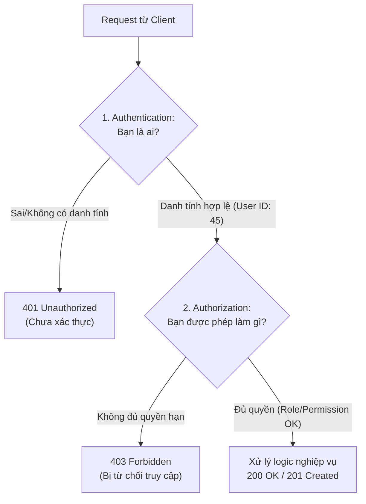

### So sánh bản chất
| Tiêu chí | Authentication (AuthN - Xác thực) | Authorization (AuthZ - Phân quyền) |
|---|---|---|
| **Câu hỏi cốt lõi** | "Bạn là ai?" (Xác minh danh tính) | "Bạn được phép làm gì?" (Kiểm tra quyền hạn) |
| **Thao tác điển hình** | Kiểm tra mật khẩu (hash), mã OTP, chữ ký JWT, sinh trắc học | Kiểm tra vai trò (Role), danh sách quyền (Permissions), thuộc tính (ABAC) |
| **Mã lỗi HTTP** | `401 Unauthorized` | `403 Forbidden` |
| **Thời điểm diễn ra** | Luôn diễn ra trước | Luôn diễn ra sau khi đã biết rõ danh tính |

### Các mô hình phân quyền phổ biến
1. **RBAC (Role-Based Access Control):** Gán quyền theo vai trò (ví dụ: `Admin`, `Editor`, `Viewer`). Đơn giản, dễ quản lý nhưng kém linh hoạt khi có các điều kiện phụ thuộc ngữ cảnh.
2. **ABAC (Attribute-Based Access Control):** Quyết định quyền dựa trên tập hợp thuộc tính: *Chủ thể* (User role, department), *Tài nguyên* (Owner ID, tài liệu bảo mật cấp 2), *Hành động* (Read, Update), và *Môi trường* (Thời gian làm việc, IP nội bộ).
3. **PBAC / ReBAC (Policy / Relationship-Based):** Phân quyền theo mối quan hệ dữ liệu (ví dụ: mô hình Google Zanzibar — "User A là thành viên của Nhóm B, Nhóm B có quyền chỉnh sửa Folder C").

---

## 1.2. Luồng xác thực với JWT (JSON Web Token)

### 1.2.1. Cấu trúc của JWT
JWT là một chuỗi văn bản gồm 3 phần ngăn cách bởi dấu chấm `.` theo định dạng: `Header.Payload.Signature` được mã hóa Base64Url.

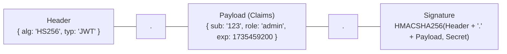

> [!IMPORTANT]
> **Payload của JWT chỉ được mã hóa Base64Url chứ KHÔNG được mã hóa bí mật (encrypt).** Bất kỳ ai có token đều đọc được nội dung bên trong Payload. Do đó, **tuyệt đối không lưu dữ liệu nhạy cảm** (như mật khẩu, số thẻ tín dụng, API secret) vào Payload.

### 1.2.2. Luồng Access Token & Refresh Token Rotation

Để cân bằng giữa **bảo mật** (Access Token có hạn ngắn) và **trải nghiệm người dùng** (không bắt đăng nhập lại liên tục), mô hình chuẩn sử dụng cặp `Access Token (15 phút)` + `Refresh Token (7 ngày)`.

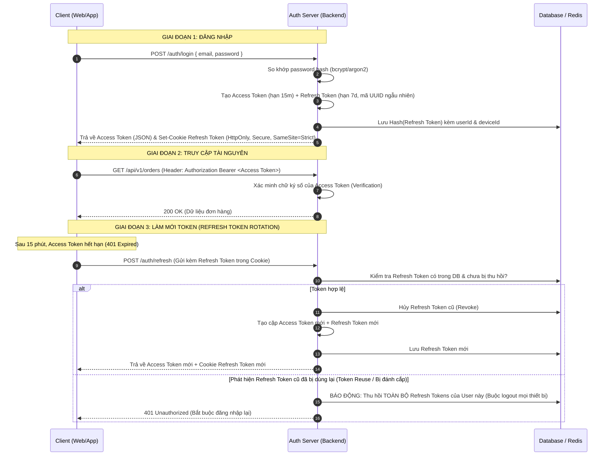

### 1.2.3. Cơ chế thu hồi JWT (Token Revocation & Blacklisting)
Vì bản chất JWT là **stateless** (server không tra cứu DB khi xác minh chữ ký), việc thu hồi ngay lập tức một Access Token còn hạn (ví dụ khi user đổi mật khẩu hoặc admin khóa tài khoản) là thách thức lớn.
- **Giải pháp 1 (Short-lived Token):** Đặt hạn Access Token cực ngắn (5 - 15 phút), chấp nhận độ trễ thu hồi tối đa bằng thời gian sống của token.
- **Giải pháp 2 (Redis Blacklist):** Khi user logout, lưu `jti` (JWT ID duy nhất) của Access Token vào Redis với TTL bằng thời gian còn lại của token. Mỗi request đến, server kiểm tra nhanh trong Redis xem token có nằm trong blacklist không (độ trễ ~1ms).

---

## 1.3. Luồng ủy quyền với OAuth 2.0 & OpenID Connect

### 1.3.1. Các thực thể trong OAuth 2.0
- **Resource Owner (Người dùng):** Người sở hữu tài khoản và dữ liệu.
- **Client (Ứng dụng bên thứ 3):** Website/App muốn truy cập dữ liệu của người dùng.
- **Authorization Server:** Máy chủ xác thực (Google, GitHub, Auth0, Keycloak).
- **Resource Server (API Server):** Máy chủ chứa dữ liệu thực tế (Google Drive API, User Profile API).

### 1.3.2. Authorization Code Flow with PKCE (Chuẩn an toàn nhất hiện nay)
Chuẩn **PKCE (Proof Key for Code Exchange)** sinh ra để bảo vệ các ứng dụng Public Client (Single Page Apps như React/Vue, Mobile Apps) khỏi cuộc tấn công đánh cắp Authorization Code.

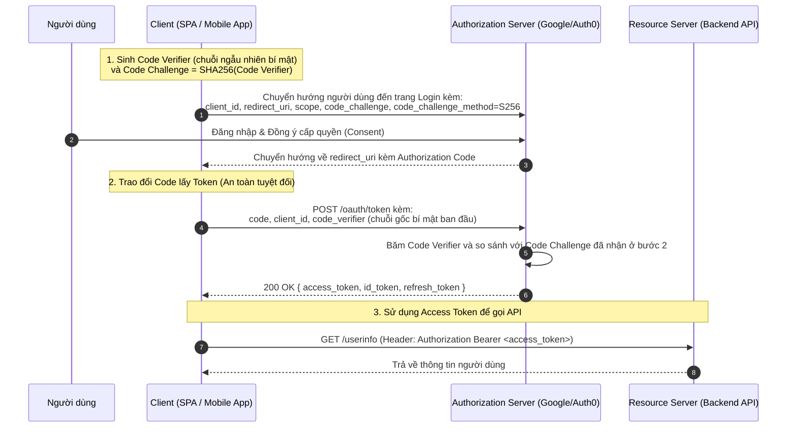

### 1.3.3. Phân biệt OAuth 2.0 vs OpenID Connect (OIDC)
- **OAuth 2.0:** Giao thức **Ủy quyền (Authorization)** — Cấp `Access Token` để ứng dụng thay mặt người dùng gọi API ("Cho phép ứng dụng X tải danh bạ từ Google").
- **OpenID Connect (OIDC):** Tầng **Xác thực (Authentication)** xây dựng trên nền OAuth 2.0 — Bổ sung `ID Token` (định dạng JWT) chứa thông tin định danh của người dùng ("Người vừa đăng nhập là `nguyenvana@gmail.com`").

---

## 1.4. So sánh toàn diện: JWT (Stateless Token) vs Session (Stateful Cookie)

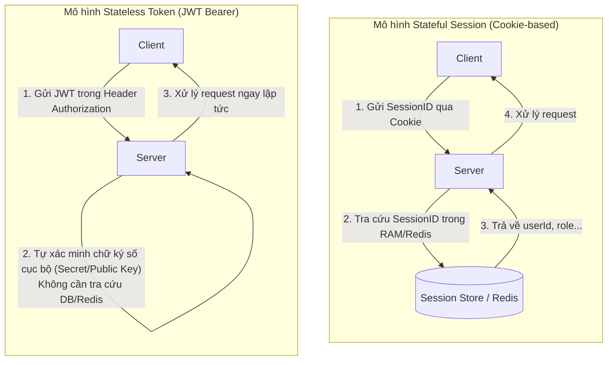

### Bảng so sánh chi tiết giữa JWT và Session

| Tiêu chí | Stateful Session (Cookie-based) | Stateless JWT (Token-based) |
|---|---|---|
| **Vị trí lưu trữ trạng thái** | Phía **Server** (Lưu trong RAM, Database, hoặc Redis Cluster). Client chỉ giữ chuỗi `sessionId`. | Phía **Client** (Trong Token chứa sẵn `userId`, `roles`, `permissions`). Server không lưu trạng thái. |
| **Chi phí bộ nhớ Server** | Tăng tuyến tính theo số lượng người dùng đang online ($O(N)$ RAM server). | Gần như bằng 0 ($O(1)$) vì server không cần lưu phiên. |
| **Khả năng mở rộng (Scalability)** | Phức tạp hơn: cần thiết lập cụm Redis Session tập trung hoặc Sticky Session trên Load Balancer. | Rất dễ mở rộng theo chiều ngang (Horizontal Scaling): Thêm bao nhiêu node server mới cũng xác thực được ngay. |
| **Khả năng thu hồi (Revocation)** | **Ngay lập tức**: Server chỉ cần xóa `sessionId` trong Redis là user bị đăng xuất tức thì. | **Khó khăn**: Token vẫn hợp lệ cho đến khi hết hạn (trừ khi dùng thêm Redis Blacklist). |
| **Kích thước gói tin (Overhead)** | Rất nhỏ (chuỗi sessionId chỉ khoảng vài chục bytes). | Lớn hơn (JWT mang theo payload claims nên kích thước khoảng vài trăm bytes đến vài KB). |
| **Hỗ trợ Cross-Domain / Mobile** | Khó khăn hơn do phụ thuộc vào chính sách gửi Cookie của trình duyệt và giới hạn domain. | Cực kỳ linh hoạt cho Mobile Native Apps, Microservices, Single Page Apps, Third-party APIs. |
| **Rủi ro bảo mật chính** | Dễ bị tấn công **CSRF** (nếu lưu trong Cookie mà không cấu hình SameSite/CSRF Token). | Dễ bị tấn công **XSS** (nếu lưu trong `localStorage` dẫn đến bị đánh cắp Token). |

### Khi nào nên sử dụng giải pháp nào?
- **Nên dùng Stateful Session khi:** Xây dựng ứng dụng Monolith truyền thống (SSR như Django, Laravel, Spring MVC, Rails), hệ thống ngân hàng/tài chính yêu cầu khả năng ngắt phiên lập tức khi phát hiện hành vi bất thường.
- **Nên dùng JWT khi:** Xây dựng hệ thống Microservices (các service tự verify token mà không dội tải về Auth DB), Mobile Apps, ứng dụng Single Page (React, Next.js, Vue) hoặc hệ thống phân tán quy mô lớn.

---

# Phần II: Các Kỹ Thuật Bảo Mật API & Phòng Chống Tấn Công

## 2.1. Rate Limiting & DDoS Protection

### Bản chất cuộc tấn công
Kẻ tấn công sử dụng script tự động hoặc botnet để gửi hàng nghìn/hàng triệu request mỗi giây nhằm:
1. **Brute-force:** Thử vét cạn mật khẩu, mã OTP xác nhận.
2. **DDoS (Distributed Denial of Service):** Làm cạn kiệt CPU, RAM, băng thông mạng hoặc Connection Pool của cơ sở dữ liệu khiến server sập.
3. **Data Scraping:** Cào vét dữ liệu độc quyền của hệ thống.

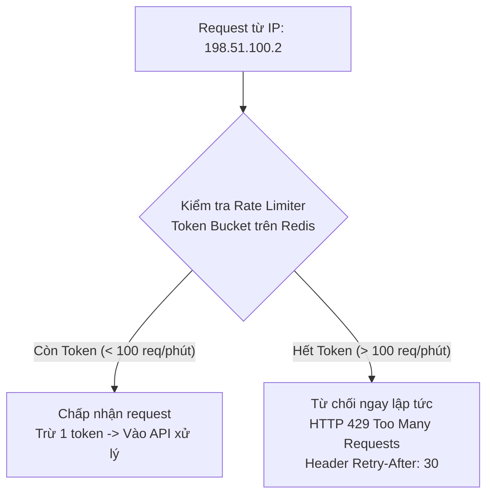

### Các giải pháp phòng thủ
1. **Áp dụng thuật toán Token Bucket / Sliding Window với Redis:** Đếm số lượng request theo IP, API Key hoặc User ID.
2. **Thiết lập HTTP Response Headers chuẩn:**
   - `X-RateLimit-Limit`: Số lượng request tối đa trong chu kỳ.
   - `X-RateLimit-Remaining`: Số lượng request còn lại được phép gọi.
   - `X-RateLimit-Reset`: Thời điểm khung giới hạn được làm mới (Unix timestamp).
   - `Retry-After`: Số giây client cần chờ trước khi thử lại khi nhận mã lỗi `429`.
3. **Phòng thủ ở tầng biên (Edge/Gateway):** Sử dụng Cloudflare, AWS WAF, Nginx `limit_req_zone` để chặn đứng lưu lượng bất thường trước khi nó chạm tới backend application.

---

## 2.2. CORS (Cross-Origin Resource Sharing)

### Bản chất cơ chế
Theo mặc định, trình duyệt áp dụng **Same-Origin Policy (SOP)**: Mã JavaScript chạy tại `https://frontend.com` không thể đọc dữ liệu phản hồi từ API tại `https://api.backend.com` (khác domain/port/giao thức).

**CORS** là cơ chế của HTTP cho phép máy chủ API **chủ động cấp phép** cho các domain frontend cụ thể được quyền truy cập tài nguyên của mình thông qua các HTTP Response Headers.

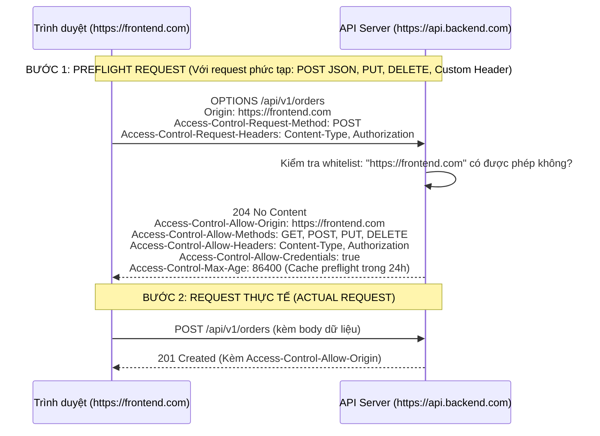

### Lỗ hổng cấu hình sai CORS phổ biến (CORS Misconfigurations)
> [!WARNING]
> **Lỗi cấu hình Wildcard kết hợp Credentials:**
> Nếu cấu hình:
> `Access-Control-Allow-Origin: *` kết hợp `Access-Control-Allow-Credentials: true`
> Trình duyệt hiện đại sẽ chặn vì lý do bảo mật. Tuy nhiên, nếu backend lập trình logic "phản chiếu bất kỳ Origin nào gửi lên" (`Access-Control-Allow-Origin: req.headers.origin`), một website độc hại có thể âm thầm gọi API và đọc toàn bộ dữ liệu nhạy cảm kèm cookie phiên của người dùng.

### Giải pháp chuẩn mực
- Khai báo danh sách trắng (Whitelist) tường minh các domain được phép:
```typescript
// NestJS / Express CORS Configuration
app.enableCors({
  origin: ['https://myapp.com', 'https://admin.myapp.com'],
  methods: ['GET', 'POST', 'PUT', 'PATCH', 'DELETE'],
  allowedHeaders: ['Content-Type', 'Authorization', 'X-Requested-With'],
  credentials: true, // Cho phép truyền Cookie / Authorization Header
  maxAge: 86400,     // Cache kết quả preflight 1 ngày
});
```

---

## 2.3. SQL Injection & NoSQL Injection

### 2.3.1. SQL Injection (SQLi)
Xảy ra khi backend nối chuỗi dữ liệu đầu vào không an toàn trực tiếp vào câu lệnh SQL, cho phép kẻ tấn công thay đổi cấu trúc truy vấn.

**Ví dụ tấn công:**
```typescript
// KHÔNG AN TOÀN - NỐI CHUỖI
const query = `SELECT * FROM users WHERE username = '${req.body.username}' AND password = '${req.body.password}'`;
```
Nếu kẻ tấn công nhập `username` là `admin' --`, câu lệnh trở thành:
```sql
SELECT * FROM users WHERE username = 'admin' --' AND password = '...'
```
*(Dấu `--` biến phần kiểm tra mật khẩu phía sau thành chú thích, giúp đăng nhập thẳng vào tài khoản admin).*

### 2.3.2. NoSQL Injection (MongoDB)
Không chỉ SQL mới bị injection; các cơ sở dữ liệu NoSQL như MongoDB cũng có thể bị tấn công thông qua **Object Query Injection** hoặc **`$where` JavaScript Evaluation**.

**Ví dụ tấn công NoSQL:**
```typescript
// KHÔNG AN TOÀN - Truyền trực tiếp req.body vào query
const user = await db.collection('users').findOne({
  username: req.body.username,
  password: req.body.password,
});
```
Nếu kẻ tấn công gửi payload JSON:
```json
{
  "username": "admin",
  "password": { "$ne": "" }
}
```
Query trở thành: "Tìm user có username là admin VÀ password **khác rỗng** (`$ne: ''`)". Điều kiện này luôn đúng và kẻ tấn công vượt qua bước kiểm tra mật khẩu.

### Giải pháp phòng chống toàn diện cho SQL & NoSQL
1. **Parameterized Queries / Prepared Statements:** Tuyệt đối tách biệt giữa mã lệnh SQL và dữ liệu tham số.
```typescript
// AN TOÀN TUYỆT ĐỐI VỚI SQL
const query = 'SELECT * FROM users WHERE username = $1 AND password_hash = $2';
await db.query(query, [username, passwordHash]);
```
2. **Sử dụng ORM/ODM an toàn:** Prisma, TypeORM, Mongoose tự động tham số hóa dữ liệu.
3. **Input Validation & Sanitization nghiêm ngặt:** Sử dụng các thư viện schema validation (Zod, Joi, class-validator trong NestJS) để ép buộc kiểu dữ liệu `string`, ngăn chặn truyền vào Object chứa toán tử `$ne`, `$gt`.
4. **Phân quyền tối thiểu cho Database User (Principle of Least Privilege):** Không dùng tài khoản `root`/`sa` cho ứng dụng; chỉ cấp quyền `SELECT`, `INSERT`, `UPDATE` trên schema cần thiết, tước bỏ quyền `DROP`, `ALTER`, `GRANT`.

---

## 2.4. CSRF (Cross-Site Request Forgery)

### Cơ chế tấn công
CSRF khai thác cơ chế mặc định của trình duyệt: **Tự động đính kèm Cookie của trang đích khi gửi request**, bất kể request đó được kích hoạt từ trang web nào.

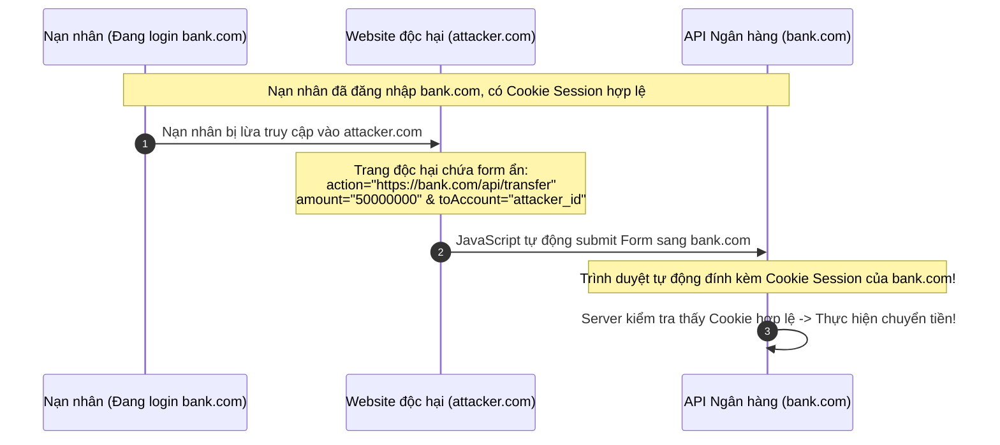

### Các giải pháp phòng chống CSRF

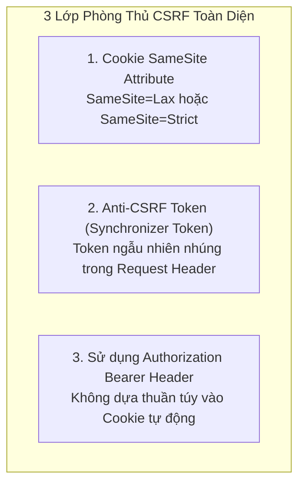

1. **Thuộc tính `SameSite` của Cookie (Giải pháp hàng đầu):**
   - `SameSite=Strict`: Trình duyệt **tuyệt đối không gửi cookie** nếu request bắt nguồn từ trang khác (kể cả click vào liên kết).
   - `SameSite=Lax`: Cookie chỉ được gửi khi người dùng chủ động điều hướng (như click link GET), **chặn hoàn toàn** các request POST/PUT/DELETE từ website khác.
2. **Cơ chế Double Submit Cookie / Anti-CSRF Token:** Server sinh một chuỗi ngẫu nhiên (CSRF Token) gửi về client. Client phải đọc token này và đính kèm vào Custom Header (ví dụ `X-CSRF-Token`). Vì website độc hại bị chặn bởi Same-Origin Policy nên không thể đọc được token này để giả mạo header.
3. **Sử dụng Token-based Auth (Bearer Header):** Trình duyệt không tự động gửi `Authorization: Bearer <token>`, do đó các API sử dụng header này tự nhiên miễn nhiễm với CSRF.

---

## 2.5. XSS (Cross-Site Scripting)

### Bản chất & Các dạng tấn công
XSS xảy ra khi ứng dụng chèn dữ liệu không được kiểm soát vào trang web, khiến mã JavaScript độc hại chạy trực tiếp trên trình duyệt của nạn nhân.

| Dạng XSS | Cơ chế hoạt động | Mức độ nguy hiểm |
|---|---|---|
| **Stored XSS (Persistent)** | Mã độc được lưu vĩnh viễn vào Database (ví dụ trong phần bình luận, bài viết) và thực thi mỗi khi bất kỳ ai tải trang. | **Nguy hiểm nhất** (ảnh hưởng hàng loạt người dùng). |
| **Reflected XSS (Non-Persistent)** | Mã độc nằm trong URL query params (ví dụ: `?search=<script>...`), server render trực tiếp kết quả tìm kiếm vào HTML. | Cần lừa nạn nhân bấm vào link chứa mã độc. |
| **DOM-based XSS** | Lỗi hoàn toàn ở JavaScript phía client (sử dụng `innerHTML`, `eval()`, `document.write` với dữ liệu không an toàn từ URL). | Không đi qua server backend. |

### Hậu quả của XSS
- Đánh cắp Token/Session lưu trong `localStorage` hoặc `sessionStorage`.
- Ghi lại thao tác bàn phím (Keylogger) để lấy mật khẩu, số thẻ.
- Tự động thay mặt người dùng thực hiện giao dịch, chuyển hướng sang trang web lừa đảo (Phishing).

### Giải pháp phòng chống XSS
1. **Lưu trữ Token an toàn trong `HttpOnly Cookie`:**
   Cờ `HttpOnly` ngăn chặn hoàn toàn JavaScript (`document.cookie`) đọc cookie. Kể cả khi website bị dính lỗ hổng XSS, kẻ tấn công cũng **không thể đánh cắp được Refresh Token**.
2. **Context-aware Output Encoding / Escaping:** Chuyển đổi các ký tự nguy hiểm thành thực thể HTML (`<` $\rightarrow$ `&lt;`, `>` $\rightarrow$ `&gt;`, `"` $\rightarrow$ `&quot;`).
3. **Thiết lập Content Security Policy (CSP) Headers:**
   Chỉ định rõ ràng domain nào được phép tải và thực thi JavaScript:
   ```http
   Content-Security-Policy: default-src 'self'; script-src 'self' https://trustedscripts.com; object-src 'none';
   ```
4. **Sanitize HTML đầu vào:** Khi cho phép người dùng nhập văn bản đa định dạng (Rich Text / WYSIWYG), bắt buộc dùng thư viện lọc mã độc mạnh như `DOMPurify` hoặc `sanitize-html`.

---

## 2.6. Firewalls (WAF & Network Firewalls)

Một hệ thống backend an toàn luôn phân tầng tường lửa rõ ràng giữa **Layer 7 (Ứng dụng)** và **Layer 3/4 (Mạng/Truyền tải)**:

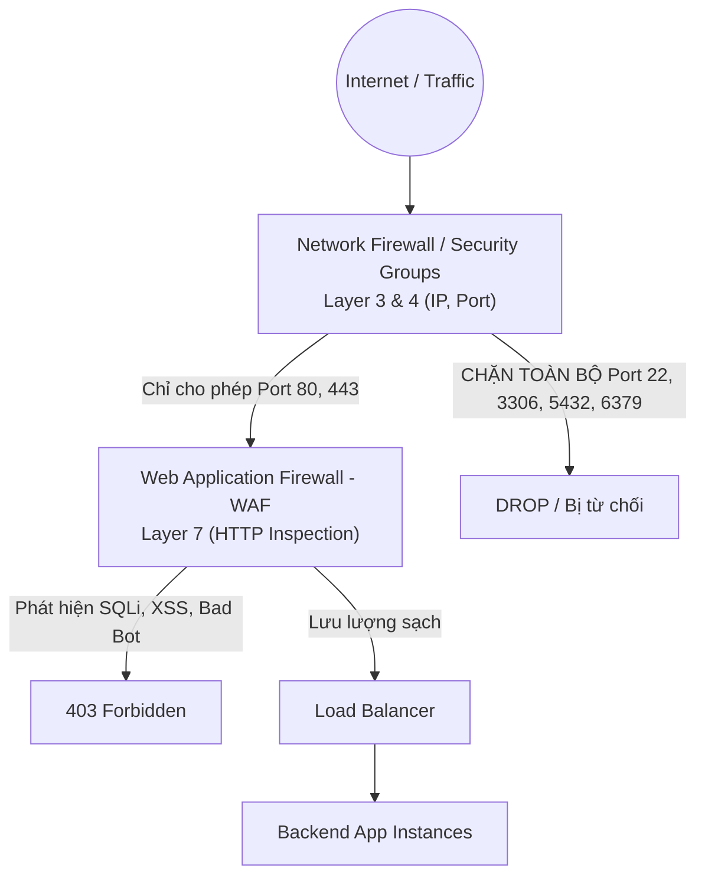

### Phân biệt WAF vs Network Firewall
| Tiêu chí | Network Firewall (Layer 3/4) | Web Application Firewall - WAF (Layer 7) |
|---|---|---|
| **Tầng hoạt động (OSI)** | Network / Transport (IP, TCP/UDP Port) | Application (HTTP/HTTPS, REST, GraphQL, WebSocket) |
| **Năng lực phân tích** | Kiểm tra IP nguồn/đích, Cổng kết nối (Port), Giao thức | Đọc và phân tích sâu Body, Headers, URI, Cookies của gói tin HTTP |
| **Mục tiêu phòng vệ** | Chặn scan cổng, tấn công SYN Flood, cô lập dải mạng | Chặn SQLi, XSS, CSRF, RCE, LFI, Credential Stuffing, Bots |
| **Ví dụ thực tế** | AWS Security Groups, Linux iptables, pfSense | Cloudflare WAF, AWS WAF, ModSecurity, F5 NGINX App Protect |

---

## 2.7. VPNs & Bảo Vệ Hạ Tầng Mạng Nội Bộ (VPC Architecture)

Một nguyên tắc bảo mật tối thượng trong hạ tầng backend: **Cơ sở dữ liệu (Database) và các dịch vụ nội bộ (Redis, RabbitMQ) tuyệt đối KHÔNG ĐƯỢC gắn Public IP ra ngoài Internet.**

### Mô hình kiến trúc VPC Subnetting chuẩn doanh nghiệp

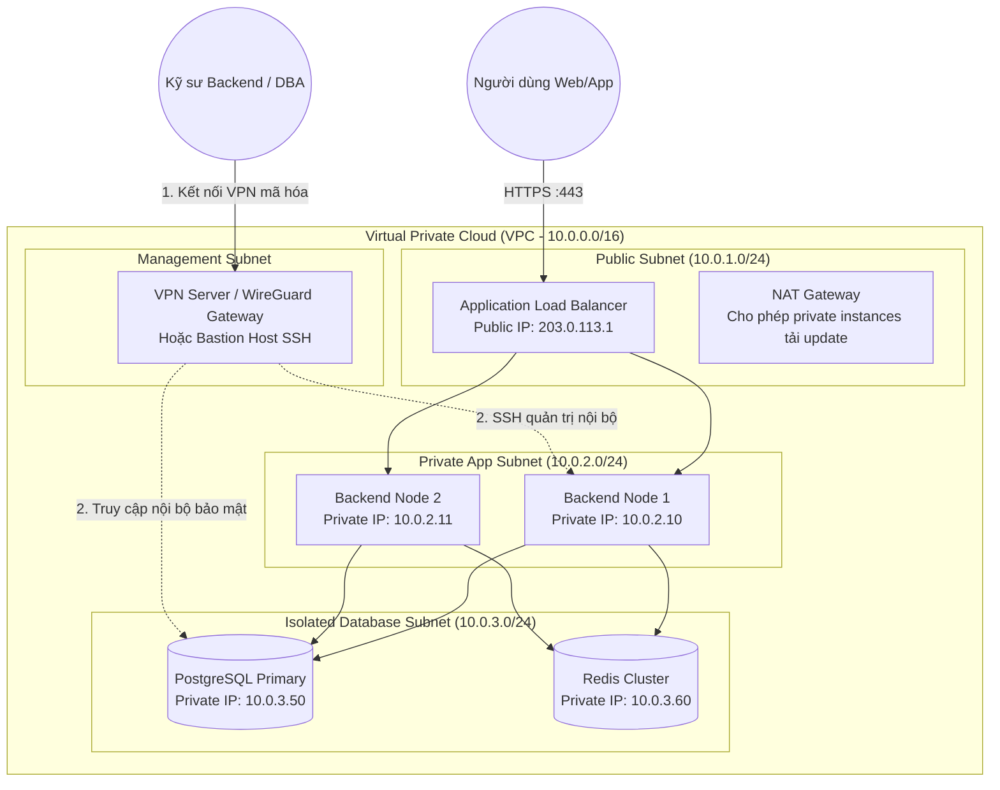

### Lợi ích của kiến trúc VPN & Subnetting
1. **Thu hẹp bề mặt tấn công (Attack Surface):** Kẻ tấn công trên Internet dù quét toàn bộ dải IP cũng không thể tìm thấy cổng PostgreSQL (5432) hay Redis (6379) vì chúng nằm trong dải IP private không định tuyến ra Internet.
2. **Kênh truy cập an toàn qua VPN:** Đội ngũ phát triển muốn truy vấn dữ liệu kiểm tra lỗi hoặc chạy migration bắt buộc phải bật VPN (WireGuard, OpenVPN, AWS Client VPN) có xác thực đa yếu tố (MFA). Toàn bộ dữ liệu truyền tải giữa máy tính kỹ sư và máy chủ nội bộ đều được mã hóa đầu cuối.

---

# Phần III: Chiến Lược Phòng Thủ Đa Lớp (Defense-in-Depth)

Một hệ thống backend đạt chuẩn bảo mật cao cấp không bao giờ dựa vào một chốt chặn duy nhất mà triển khai chiến lược **Phòng thủ theo chiều sâu (Defense-in-Depth)**:

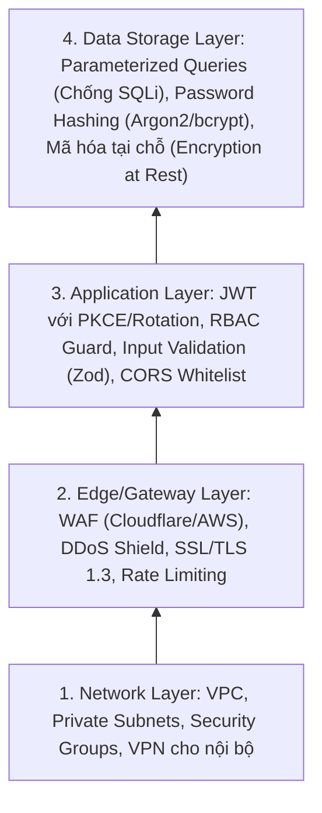

### Checklist Bảo Mật Nhanh cho Kỹ Sư Backend Trước Khi Lên Production
- [ ] **Mật khẩu & Secrets:** Sử dụng `bcrypt` hoặc `argon2` cho mật khẩu; không bao giờ commit file `.env` hoặc API keys lên Git repo (dùng AWS Secrets Manager / Vault).
- [ ] **Token & Session:** Lưu Refresh Token trong `HttpOnly, Secure, SameSite=Strict/Lax` Cookie. Đặt hạn Access Token ngắn (15 phút).
- [ ] **Cơ sở dữ liệu:** 100% truy vấn dùng Parameterized Queries / ORM. Tách DB vào Private Subnet không có Public IP.
- [ ] **Validation:** Sử dụng Schema Validation (Zod, class-validator) để parse và sanitize toàn bộ dữ liệu từ `req.body`, `req.query`, `req.params`.
- [ ] **API Security Headers:** Sử dụng thư viện `helmet` để kích hoạt `Strict-Transport-Security`, `X-Content-Type-Options`, `X-Frame-Options`.
- [ ] **CORS:** Cấu hình danh sách domain tường minh, tuyệt đối không dùng `origin: '*'` khi có `credentials: true`.
- [ ] **Rate Limiting:** Bật Rate Limiter trên các endpoint nhạy cảm (`/login`, `/register`, `/forgot-password`, `/payment`).
- [ ] **Logging & Auditing:** Ghi log các sự kiện bảo mật quan trọng (đăng nhập thất bại liên tiếp, đổi mật khẩu, phân quyền admin) nhưng **tuyệt đối che giấu (mask) dữ liệu nhạy cảm** (mật khẩu, CVV, token) trong file log.
