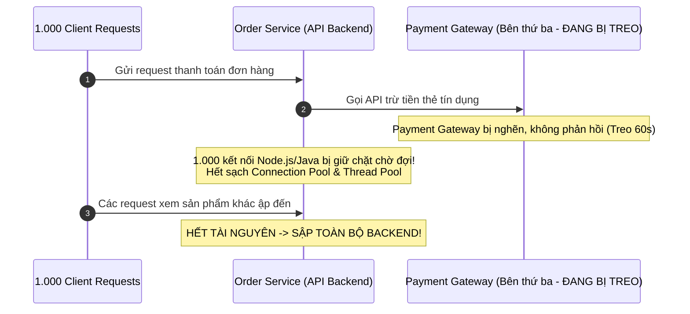
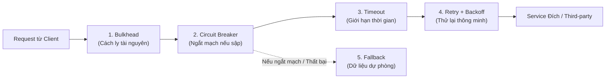
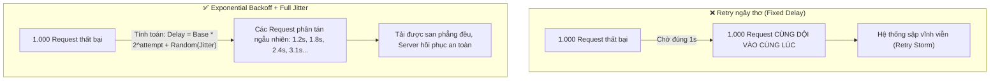
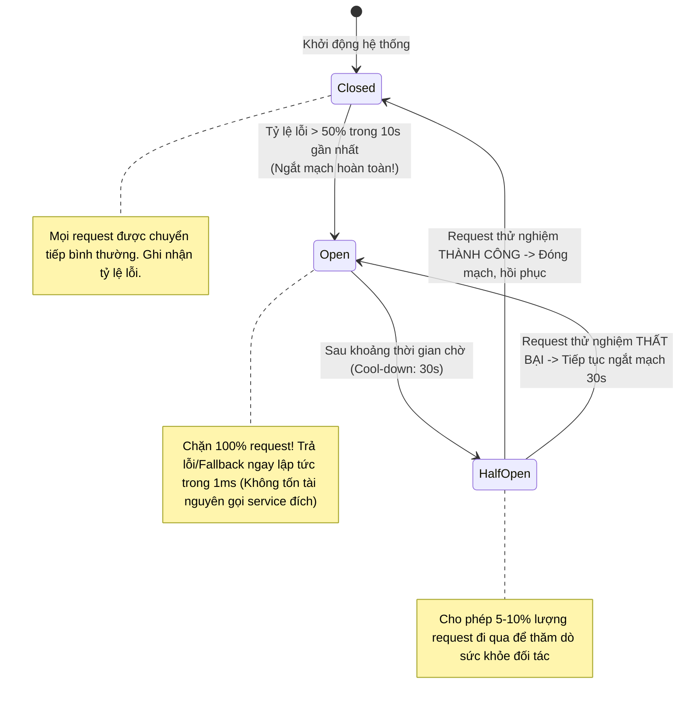
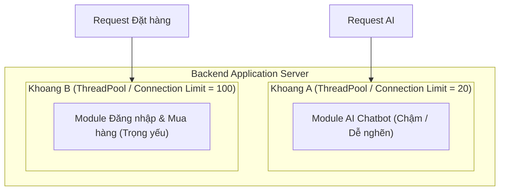

# ĐẶC TẢ CHUYÊN SÂU: CÁC MẪU THIẾT KẾ PHÒNG VỆ HỆ THỐNG (RESILIENCE PATTERNS)

## Lời mở đầu

Trong kiến trúc Backend hiện đại — đặc biệt là Microservices hoặc các hệ thống phụ thuộc nhiều vào bên thứ ba (Cổng thanh toán, Dịch vụ SMS, API AI, Database) — **sự cố là điều không thể tránh khỏi (Failures are inevitable)**. Mạng có thể bị chập chờn, database có thể bị nghẽn, dịch vụ đối tác có thể sập đột ngột.

Một hệ thống backend nghiệp dư sẽ sụp đổ theo phản ứng dây chuyền (**Cascading Failure**): một service phụ thuộc bị chậm sẽ kéo sập toàn bộ ứng dụng. Ngược lại, một hệ thống chuyên nghiệp được thiết kế theo triết lý **"Design for Failure"** với các **Resilience Patterns (Mẫu thiết kế phục hồi & đàn hồi)**, đảm bảo hệ thống tự cô lập lỗi, tự hồi phục và duy trì hoạt động ổn định trước mọi biến cố.

Tài liệu này đặc tả chi tiết bộ 5 mẫu thiết kế phòng vệ kinh điển: **Timeout, Retry with Exponential Backoff & Jitter, Circuit Breaker, Bulkhead, và Fallback**.

---

## 1. Bản chất của Thất bại dây chuyền (Cascading Failure)



Chỉ vì một dịch vụ thanh toán bên ngoài bị chậm, nếu không có cơ chế phòng vệ, toàn bộ các tính năng khác của hệ thống (đăng nhập, xem sản phẩm, giỏ hàng) cũng sẽ bị "chết chìm" theo.

---

## 2. Bộ 5 Mẫu Thiết Kế Phòng Vệ Cốt Lõi (The 5 Resilience Patterns)



---

### 2.1. Pattern 1: Timeout (Fail-Fast — Thất bại sớm để giải phóng tài nguyên)

#### Bản chất
Thay vì để một request chờ đợi vô thời hạn khi service đối tác bị treo, **Timeout** đặt ra một ngưỡng thời gian tối đa (ví dụ 3 giây). Nếu quá thời gian này mà chưa nhận được phản hồi, hệ thống lập tức **ngắt kết nối và giải phóng tài nguyên ngay lập tức (Fail-Fast)**.

#### Phân biệt 2 loại Timeout bắt buộc phải cấu hình:
1. **Connection Timeout (Thời gian bắt tay kết nối):** Giới hạn thời gian thiết lập kết nối TCP/TLS với máy chủ đích (thường đặt ngắn: $1\text{s} - 3\text{s}$). Nếu server đối tác sập nguồn, kết nối sẽ fail ngay.
2. **Socket / Read Timeout (Thời gian chờ dữ liệu):** Giới hạn thời gian chờ server đích xử lý và trả về byte dữ liệu đầu tiên (thường đặt $3\text{s} - 5\text{s}$ tùy nghiệp vụ).

---

### 2.2. Pattern 2: Retry with Exponential Backoff & Jitter (Thử lại thông minh)

#### Nguy cơ của Retry ngây thơ (Thundering Herd / Retry Storm)
Nếu 10.000 request cùng thất bại và ngay lập tức thử lại sau mỗi 1 giây (`retry 3 times with fixed 1s delay`), một "cơn bão request" khổng lồ sẽ dội ngược vào máy chủ đang gặp sự cố, khiến nó **sập hoàn toàn và không bao giờ có cơ hội hồi phục**.



#### Công thức chuẩn: Exponential Backoff kết hợp Full Jitter
$$\text{Delay} = \text{random}(0, \min(\text{MaxDelay}, \text{BaseDelay} \times 2^{\text{attempt}}))$$

```typescript
// Hàm tính thời gian chờ thông minh:
function calculateBackoffWithJitter(attempt: number, baseDelay = 1000, maxDelay = 10000): number {
  const exponentialDelay = Math.min(maxDelay, baseDelay * Math.pow(2, attempt));
  // Full Jitter: phân tán ngẫu nhiên từ 0 đến exponentialDelay
  return Math.floor(Math.random() * exponentialDelay);
}
```

#### Phân loại lỗi được phép Retry:
- **Được phép Retry (Transient Errors - Lỗi tạm thời):** `429 Too Many Requests`, `503 Service Unavailable`, `504 Gateway Timeout`, `ECONNRESET`, `ETIMEDOUT`.
- **Tuyệt đối KHÔNG Retry (Permanent Errors - Lỗi nghiệp vụ):** `400 Bad Request`, `401 Unauthorized`, `403 Forbidden`, `404 Not Found`, `422 Unprocessable Entity` (dữ liệu sai có thử lại 1.000 lần vẫn sai).

---

### 2.3. Pattern 3: Circuit Breaker (Bộ ngắt mạch tự động)

#### Bản chất
Lấy cảm hứng từ chiếc cầu dao điện trong gia đình: Khi đường dây điện bị chập (quá nhiều lỗi), cầu dao tự động ngắt (**OPEN**) để bảo vệ toàn bộ mạng điện, không cho dòng điện đi qua nữa.



---

### 2.4. Pattern 4: Bulkhead (Vách ngăn cách ly tài nguyên)

#### Bản chất
Tên gọi bắt nguồn từ thiết kế các vách ngăn chống chìm trên tàu thủy: thân tàu được chia thành nhiều khoang kín nước độc lập (Bulkheads). Nếu một khoang bị thủng và ngập nước, nước chỉ nằm trong khoang đó, các khoang khác vẫn an toàn và con tàu không bị chìm.



- **Trong Backend:** Ta chia nhỏ tài nguyên (Thread Pool, HTTP Connection Pool, Database Connection Pool) cho từng dịch vụ riêng biệt.
- **Tác dụng:** Dù tính năng AI Chatbot bị nghẽn $100\%$ và chiếm hết 20 kết nối trong Pool A, thì Module Mua hàng (Pool B với 100 kết nối) vẫn hoạt động hoàn toàn bình thường, không bị ảnh hưởng.

---

### 2.5. Pattern 5: Fallback (Kịch bản cứu cánh)

Khi tất cả các biện pháp trên đều thất bại hoặc khi Circuit Breaker đang ở trạng thái OPEN, hệ thống không trả về lỗi `500 Internal Server Error` xấu xí, mà kích hoạt **phương án dự phòng (Graceful Degradation)**:

1. **Fallback từ Cache cũ (Stale Cache):** Trả về dữ liệu sản phẩm lấy từ Redis cách đây 1 giờ thay vì báo lỗi không tải được trang.
2. **Fallback về giá trị mặc định:** Trả về danh sách gợi ý sản phẩm mặc định (Best sellers) nếu AI Recommendation Service bị sập.
3. **Fallback dạng Silent Queue:** Ghi nhận yêu cầu gửi email/thông báo vào hàng đợi tạm thời trên đĩa, thông báo cho người dùng "Yêu cầu đã được tiếp nhận" và gửi sau khi hệ thống hồi phục.

---

## 3. Triển khai thực tế trong Node.js / NestJS với thư viện `cockatiel`

Thư viện **`cockatiel`** là giải pháp chuẩn công nghiệp hàng đầu cho TypeScript/Node.js để kết hợp toàn bộ các Resilience Patterns:

```typescript
// payment-resilience.service.ts
import { Injectable, Logger } from '@nestjs/common';
import {
  Policy,
  circuitBreaker,
  handleWhen,
  retry,
  timeout,
  fallback,
  ConsecutiveBreaker,
  ExponentialBackoff,
} from 'cockatiel';
import axios from 'axios';

@Injectable()
export class PaymentResilienceService {
  private readonly logger = new Logger(PaymentResilienceService.name);
  private resilientPolicy: any;

  constructor() {
    // 1. Định nghĩa điều kiện lỗi cần bắt (Chỉ bắt lỗi 5xx hoặc Timeout mạng)
    const handleNetworkErrors = handleWhen((err: any) => {
      return (
        err.code === 'ECONNABORTED' ||
        err.code === 'ETIMEDOUT' ||
        (err.response && err.response.status >= 500)
      );
    });

    // 2. Timeout Policy: Hủy nếu vượt quá 3 giây
    const timeoutPolicy = timeout(3000);

    // 3. Retry Policy: Thử lại tối đa 3 lần với Exponential Backoff + Jitter
    const retryPolicy = retry(handleNetworkErrors, {
      maxAttempts: 3,
      backoff: new ExponentialBackoff({ initialDelay: 500, maxDelay: 4000 }),
    });

    // 4. Circuit Breaker Policy: Ngắt mạch sau 5 lỗi liên tiếp, thời gian chờ 30 giây
    const circuitBreakerPolicy = circuitBreaker(handleNetworkErrors, {
      halfOpenAfter: 30 * 1000,
      breaker: new ConsecutiveBreaker(5),
    });

    circuitBreakerPolicy.onBreak(() => {
      this.logger.error('[CircuitBreaker] CẢNH BÁO: Mạch đã ngắt (OPEN)! Dừng gọi Payment Gateway.');
    });

    circuitBreakerPolicy.onReset(() => {
      this.logger.log('[CircuitBreaker] THÔNG BÁO: Mạch đã đóng lại (CLOSED). Hệ thống đã hồi phục.');
    });

    // 5. Fallback Policy: Trả về trạng thái chờ xử lý nếu sập hoàn toàn
    const fallbackPolicy = fallback(handleNetworkErrors, () => {
      this.logger.warn('[Fallback] Kích hoạt phương án dự phòng: Đưa giao dịch vào hàng đợi offline.');
      return {
        success: false,
        status: 'PENDING_OFFLINE',
        message: 'Hệ thống thanh toán đang bảo trì, đơn hàng sẽ được xử lý tự động trong ít phút.',
      };
    });

    // 6. Gộp toàn bộ chính sách theo thứ tự ưu tiên:
    // Fallback -> CircuitBreaker -> Retry -> Timeout
    this.resilientPolicy = Policy.wrap(
      fallbackPolicy,
      circuitBreakerPolicy,
      retryPolicy,
      timeoutPolicy,
    );
  }

  async processPayment(orderId: string, amount: number) {
    return this.resilientPolicy.execute(async () => {
      const response = await axios.post(
        'https://api.payment-gateway.com/v1/charges',
        { orderId, amount },
        { timeout: 3000 },
      );
      return response.data;
    });
  }
}
```

---

## 4. Ma trận ứng phó sự cố (Resilience Decision Matrix)

| Tình huống sự cố | Triệu chứng | Pattern giải quyết chính | Hành vi hệ thống |
|---|---|---|---|
| **Mạng chập chờn / Mất gói tin** | Thỉnh thoảng dính `ETIMEDOUT`, `ECONNRESET` ngẫu nhiên. | **Retry + Exponential Backoff** | Thử lại tự động sau vài trăm ms, người dùng không nhận ra lỗi. |
| **Dịch vụ đối tác bị treo** | Request gọi ra ngoài mất 30-60 giây không trả về. | **Timeout (Fail-Fast)** | Ngắt ngay sau 3 giây, giải phóng connection pool cho luồng khác. |
| **Dịch vụ đối tác sập hoàn toàn** | 100% request gọi sang đều trả về lỗi 500 hoặc Timeout. | **Circuit Breaker + Fallback** | Ngắt mạch tức thì, không gửi thêm request vô ích, trả dữ liệu từ Cache hoặc Fallback. |
| **Một tính năng phụ bị quá tải** | Tính năng xuất file Excel hoặc AI ngốn sạch CPU / Connections. | **Bulkhead Isolation** | Giới hạn tối đa 5 luồng cho tính năng đó, bảo vệ 95 luồng còn lại cho API mua hàng. |

---

## Tổng kết

Xây dựng hệ thống Backend chịu lỗi không phải là cố gắng ngăn chặn sự cố xảy ra, mà là **chuẩn bị sẵn sàng ứng phó khi sự cố chắc chắn sẽ xảy ra**:
1. **Luôn luôn đặt Timeout** cho mọi kết nối mạng ra bên ngoài (Database, Redis, HTTP).
2. **Retry phải có Backoff + Jitter**, không bao giờ retry lỗi `4xx`.
3. Bọc các dịch vụ bên thứ ba bằng **Circuit Breaker** để chống sập dây chuyền.
4. Cách ly tài nguyên bằng **Bulkhead** và xoa dịu trải nghiệm người dùng bằng **Fallback**.
