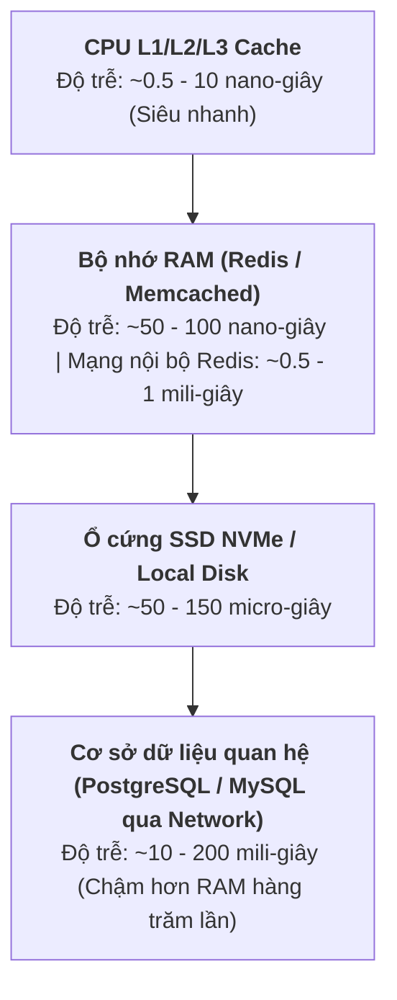
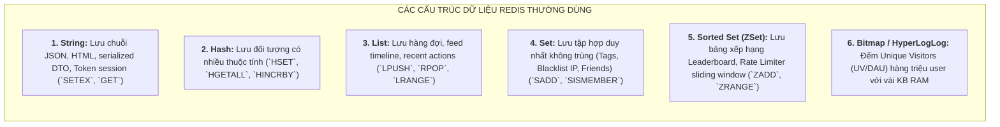
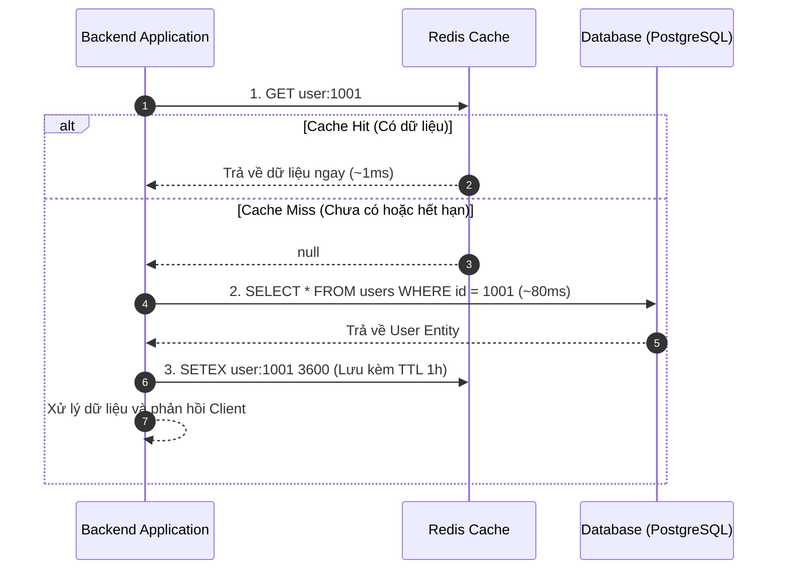
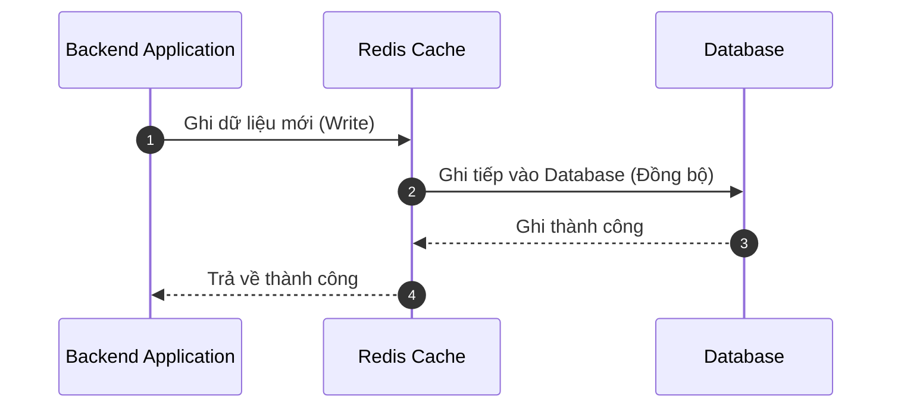
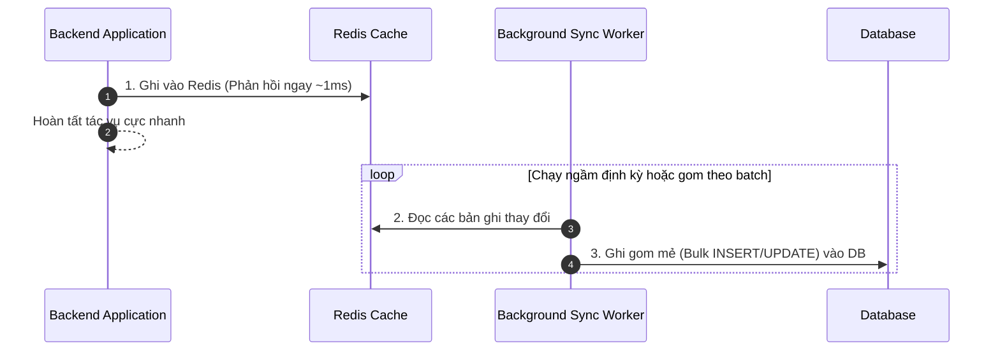
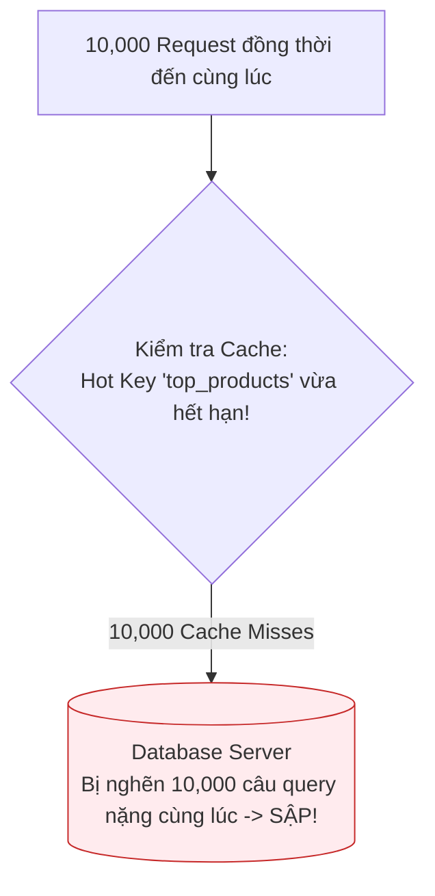
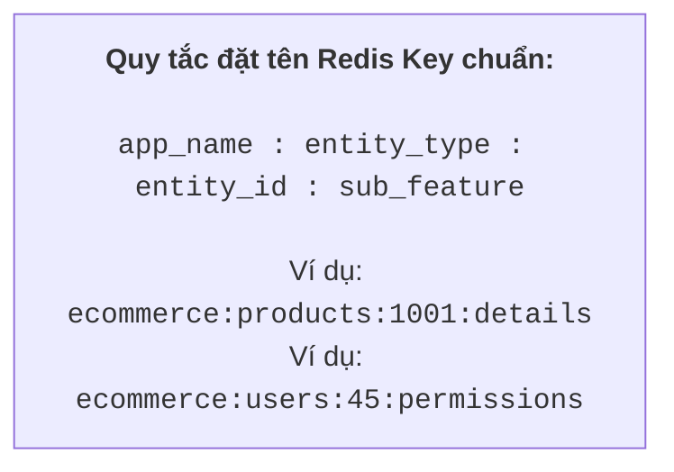

# ĐẶC TẢ CHUYÊN SÂU VỀ CACHING VỚI REDIS TRONG HỆ THỐNG BACKEND

## Lời mở đầu

Trong kiến trúc hệ thống hiện đại, **Cơ sở dữ liệu (Database)** thường là nút thắt cổ chai (Bottleneck) lớn nhất về mặt hiệu năng và khả năng mở rộng. Đĩa cứng (ngay cả SSD NVMe thế hệ mới) và các câu truy vấn quan hệ phức tạp (JOIN, Aggregate, Index Lookup) luôn có độ trễ từ vài chục đến hàng trăm mili-giây.

**Redis (Remote Dictionary Server)** — một hệ thống lưu trữ cấu trúc dữ liệu trong bộ nhớ RAM (In-Memory Key-Value Store) với độ trễ phản hồi dưới 1 mili-giây (Sub-millisecond) — đóng vai trò là tầng đệm phòng vệ số một, giúp giảm tải hơn 90-95% áp lực truy vấn cho database chính và tăng thông lượng (Throughput) của hệ thống lên hàng chục lần.

Tài liệu này cung cấp bản đặc tả toàn diện, chuyên sâu và chuẩn kỹ thuật về kỹ thuật Caching với Redis: từ cấu trúc dữ liệu, các chiến lược caching kinh điển, giải pháp xử lý 4 vấn nạn thực tế (Stampede, Penetration, Breakdown, Invalidation), thuật toán giải phóng bộ nhớ, cho đến mã nguồn triển khai thực chiến trên NestJS.

---

## Mục lục

- [Phần I: Bản Chất Caching & Kim Tự Tháp Bộ Nhớ](#phần-i-bản-chất-caching--kim-tự-tháp-bộ-nhớ)
- [Phần II: Các Cấu Trúc Dữ Liệu Redis Dùng Cho Caching](#phần-ii-các-cấu-trúc-dữ-liệu-redis-dùng-cho-caching)
- [Phần III: 4 Chiến Lược Caching Kinh Điển (Caching Patterns)](#phần-iii-4-chiến-lược-caching-kinh-điển-caching-patterns)
  - [1. Cache-Aside (Lazy Loading - Phổ biến nhất)](#1-cache-aside-lazy-loading---phổ-biến-nhất)
  - [2. Write-Through](#2-write-through)
  - [3. Write-Behind (Write-Back)](#3-write-behind-write-back)
  - [4. Refresh-Ahead](#4-refresh-ahead)
- [Phần IV: 4 Hiểm Họa Kinh Điển Trong Caching & Giải Pháp](#phần-iv-4-hiểm-họa-kinh-điển-trong-caching--giải-pháp)
  - [1. Cache Stampede (Thundering Herd / Tuyết lở)](#1-cache-stampede-thundering-herd--tuyết-lở)
  - [2. Cache Penetration (Xuyên thủng Cache)](#2-cache-penetration-xuyên-thủng-cache)
  - [3. Cache Breakdown (Hotspot Key hết hạn)](#3-cache-breakdown-hotspot-key-hết-hạn)
  - [4. Cache Invalidation & Dữ Liệu Lỗi Thời (Stale Data)](#4-cache-invalidation--dữ-liệu-lỗi-thời-stale-data)
- [Phần V: Cơ Chế Thu Dọn Bộ Nhớ (Eviction Policies)](#phần-v-cơ-chế-thu-dọn-bộ-nhớ-eviction-policies)
- [Phần VI: Triển Khai Thực Chiến Với NestJS & Redis](#phần-vi-triển-khai-thực-chiến-với-nestjs--redis)
- [Phần VII: Best Practices & Quy Tắc Thiết Kế Key Chuẩn Production](#phần-vii-best-practices--quy-tắc-thiết-kế-key-chuẩn-production)

---

# Phần I: Bản Chất Caching & Kim Tự Tháp Bộ Nhớ

## 1. Kim tự tháp phân cấp tốc độ bộ nhớ (Memory Hierarchy)



## 2. Chỉ số vàng: Cache Hit Ratio

Hiệu quả của tầng Cache được đo lường bằng **Tỷ lệ trúng Cache (Cache Hit Ratio)**:

$$\text{Cache Hit Ratio} = \frac{\text{Total Cache Hits}}{\text{Total Cache Hits} + \text{Total Cache Misses}} \times 100\%$$

- **Cache Hit (Trúng Cache):** Dữ liệu yêu cầu đã có sẵn trong Redis $\rightarrow$ Trả về ngay lập tức ($\sim 1\text{ms}$).
- **Cache Miss (Trượt Cache):** Dữ liệu chưa có hoặc đã hết hạn $\rightarrow$ Bắt buộc phải truy vấn Database ($\sim 50-200\text{ms}$), sau đó ghi ngược lại vào Redis.
- **Mục tiêu Production:** Một hệ thống backend tối ưu cần duy trì Cache Hit Ratio đạt từ **90% đến 98%**.

---

# Phần II: Các Cấu Trúc Dữ Liệu Redis Dùng Cho Caching

Redis không chỉ là một kho chứa Key-Value dạng chuỗi đơn thuần, mà cung cấp các cấu trúc dữ liệu tối ưu cho từng mục đích nghiệp vụ:



### So sánh lưu Object giữa String (JSON) và Hash:
- **String (JSON):** Phù hợp khi bạn luôn đọc/ghi **toàn bộ đối tượng** cùng một lúc (`JSON.stringify` / `JSON.parse`).
- **Hash:** Phù hợp khi bạn có một Object lớn (ví dụ User Profile có 30 fields) và chỉ muốn **đọc hoặc cập nhật một vài trường riêng lẻ** (như cập nhật `lastLoginAt` bằng `HSET user:123 lastLoginAt 1735459200`) mà không cần nạp lại toàn bộ đối tượng $\rightarrow$ Tiết kiệm băng thông và RAM.

---

# Phần III: 4 Chiến Lược Caching Kinh Điển (Caching Patterns)

## 1. Cache-Aside (Lazy Loading - Phổ biến nhất)

Ứng dụng trực tiếp điều phối luồng đọc/ghi giữa Cache và Database. Dữ liệu chỉ được nạp vào cache khi có yêu cầu đọc đầu tiên (Lazy).


- **Ưu điểm:** Chỉ cache những dữ liệu thực sự được truy vấn; nếu Redis bị sập tạm thời, hệ thống vẫn hoạt động (dù chậm hơn).
- **Nhược điểm:** Request đầu tiên luôn bị chậm (Cache Miss); rủi ro dữ liệu bị lỗi thời (Stale Data) nếu DB thay đổi mà không xóa cache tương ứng.

---

## 2. Write-Through

Mỗi khi có thao tác ghi hoặc cập nhật dữ liệu, ứng dụng sẽ **ghi đồng thời vào Cache, và tầng Cache/Service sẽ ghi tiếp vào Database** trong cùng một transaction.


- **Ưu điểm:** Dữ liệu trong Cache luôn mới nhất, không bao giờ bị trượt cache ở các lần đọc sau.
- **Nhược điểm:** Độ trễ ghi tăng lên vì phải ghi 2 nơi; có thể lãng phí bộ nhớ khi cache cả những dữ liệu ít khi được đọc lại.

---

## 3. Write-Behind (Write-Back)

Ứng dụng **chỉ ghi vào Cache ngay lập tức**, sau đó một tiến trình chạy ngầm bất đồng bộ sẽ gom dữ liệu (Batching) để ghi xuống Database sau đó.


- **Ưu điểm:** Tốc độ ghi cực nhanh, chịu tải ghi khổng lồ (rất phù hợp cho đếm view YouTube/TikTok, like bài viết, tracking log clickstream).
- **Nhược điểm:** Nguy cơ mất dữ liệu (Data Loss) nếu máy chủ Redis gặp sự cố trước khi kịp đồng bộ xuống Database.

---

## 4. Refresh-Ahead

Hệ thống cấu hình để **tự động làm mới cache trước khi nó hết hạn (TTL)** dựa trên tần suất truy cập của người dùng.
- **Cơ chế:** Nếu một key có TTL 60 giây và thường xuyên được truy vấn ở giây thứ 50, hệ thống sẽ tự động gọi truy vấn ngầm xuống DB để cập nhật key đó lên TTL mới $\rightarrow$ Người dùng không bao giờ phải chịu cảm giác Cache Miss.

---

# Phần IV: 4 Hiểm Họa Kinh Điển Trong Caching & Giải Pháp

## 1. Cache Stampede (Thundering Herd / Tuyết lở)

### Bản chất hiện tượng
Xảy ra khi một Hot Key (ví dụ danh sách sản phẩm trang chủ) vừa hết hạn (TTL = 0), đúng lúc đó có **hàng nghìn request đồng thời ập đến**. Tất cả các request đều gặp Cache Miss và cùng lúc dội thẳng vào Database để tính toán lại $\rightarrow$ Database bị quá tải kết nối, CPU nhảy lên 100% và sập toàn bộ hệ thống.



### Giải pháp triệt để: Distributed Mutex Lock (Khóa phân tán)
Chỉ cho phép **đúng 1 request** được quyền lấy khóa (`SET key lock NX EX 10`) để truy vấn database và nạp lại cache; các request khác trong lúc chờ sẽ ngủ 50ms rồi thử đọc lại từ Redis hoặc nhận dữ liệu cũ tạm thời.

```typescript
async function getTopProductsWithMutexLock(): Promise<Product[]> {
  const cacheKey = 'top_products';
  const lockKey = 'lock:top_products';

  // 1. Thử lấy dữ liệu từ cache
  let data = await redis.get(cacheKey);
  if (data) return JSON.parse(data);

  // 2. Nếu Cache Miss, cố gắng chiếm khóa phân tán
  const acquiredLock = await redis.set(lockKey, 'LOCKED', 'EX', 10, 'NX');

  if (acquiredLock === 'OK') {
    try {
      // Chỉ đúng 1 thread này được query Database
      const products = await db.queryTopSellingProducts();
      await redis.set(cacheKey, JSON.stringify(products), 'EX', 3600);
      return products;
    } finally {
      await redis.del(lockKey); // Giải phóng khóa
    }
  } else {
    // Các thread khác chờ 50ms rồi thử đọc lại cache
    await new Promise((resolve) => setTimeout(resolve, 50));
    return getTopProductsWithMutexLock();
  }
}
```

---

## 2. Cache Penetration (Xuyên thủng Cache)

### Bản chất hiện tượng
Kẻ tấn công cố tình gửi hàng loạt request truy vấn các dữ liệu **hoàn toàn không tồn tại** trong hệ thống (ví dụ: `GET /users/-9999` hoặc `GET /products/fake_uuid_xyz`).
- Vì dữ liệu không có trong Redis $\rightarrow$ Bị Cache Miss.
- Hệ thống query xuống DB $\rightarrow$ DB cũng không tìm thấy gì $\rightarrow$ Không có gì để lưu vào Cache.
- Kết quả: Mọi request độc hại tiếp theo đều **xuyên thẳng xuống Database**, vô hiệu hóa hoàn toàn tầng Cache.

```mermaid
flowchart LR
    Attacker["Hacker gửi /user/-9999"] --> Redis{"Redis: Miss (Không có)"}
    Redis --> DB[("Database: Query không thấy")]
    DB -. "Không lưu gì vào cache" .-> Attacker
    Note over Attacker,DB: Mọi request sau tiếp tục đâm thẳng vào Database!
```

### Giải pháp:
1. **Cache Null Object (Lưu kết quả rỗng kèm TTL ngắn):** Nếu DB không tìm thấy bản ghi, lưu ngay giá trị `null` hoặc chuỗi rỗng `"{}"` vào Redis với TTL ngắn (30 - 60 giây). Request tiếp theo sẽ gặp Cache Hit (`null`) và dừng lại ngay tại Redis.
2. **Bloom Filter:** Sử dụng cấu trúc dữ liệu Bloom Filter đứng trước Redis. Bloom Filter có khả năng khẳng định chắc chắn 100% nếu một ID **không tồn tại** trong hệ thống để chặn đứng request ngay lập tức.

---

## 3. Cache Breakdown (Hotspot Key hết hạn)

### Bản chất
Khác với Stampede (nhiều key cùng hết hạn hoặc sập cụm cache), Breakdown tập trung vào **đúng 1 Key duy nhất nhưng siêu nóng (Hotspot Key)** — ví dụ: Trang chi tiết sản phẩm iPhone 16 trong ngày mở bán, hoặc tin tức bầu cử đang viral hàng triệu lượt xem/phút. Khi key này hết hạn đúng tích tắc, hàng trăm nghìn truy vấn ập vào DB.

### Giải pháp:
1. **Logical Expiration (Hết hạn mềm / Stale-While-Revalidate):** Không set TTL cứng trên Redis (`SET key value` không có EX). Trong payload JSON, lưu thêm trường `expireAt = Date.now() + 60000`. Khi đọc thấy quá hạn mềm, trả về dữ liệu cũ ngay cho user, đồng thời kích hoạt một background job âm thầm tính toán nạp dữ liệu mới.
2. **Chủ động làm mới bằng Cron Job:** Với các dữ liệu trang chủ cố định, một cron job chạy mỗi 5 phút làm mới cache trước khi nó kịp hết hạn.

---

## 4. Cache Invalidation & Dữ Liệu Lỗi Thời (Stale Data)

> *"There are only two hard things in Computer Science: cache invalidation and naming things."* — Phil Karlton

### Vấn đề
Khi dữ liệu gốc trong Database bị thay đổi (User đổi tên, Admin đổi giá sản phẩm), nếu không cập nhật hoặc xóa cache kịp thời, người dùng sẽ đọc phải **dữ liệu cũ sai lệch (Stale Data)**.

### Các chiến lược vô hiệu hóa Cache an toàn:
1. **Xóa Cache ngay khi Ghi (Cache Invalidation on Mutation):**
   - Khi có `UPDATE` hoặc `DELETE` ở DB $\rightarrow$ Luôn thực hiện `redis.del('product:123')` ngay sau khi commit transaction.
2. **Event-Driven Invalidation:**
   - Sử dụng Message Queue (RabbitMQ / Kafka) hoặc Database Change Data Capture (CDC - Debezium): Khi bảng `products` có thay đổi, bắn một event `product.updated` $\rightarrow$ Consumer lắng nghe và xóa các cache keys liên quan.
3. **Cache Tagging & Key Versioning:**
   - Thay vì xóa từng key, quản lý theo phiên bản: `product:123:v1` $\rightarrow$ Khi đổi dữ liệu, nâng version lên `product:123:v2`.

---

# Phần V: Cơ Chế Thu Dọn Bộ Nhớ (Eviction Policies)

Khi dung lượng dữ liệu trong Redis đạt ngưỡng tối đa được cấu hình (`maxmemory` ví dụ: `4GB`), Redis sẽ kích hoạt thuật toán giải phóng bộ nhớ theo cấu hình `maxmemory-policy`:

| Thuật toán Eviction | Cơ chế hoạt động | Trường hợp áp dụng |
|---|---|---|
| **`allkeys-lru`** | Xóa các key **ít được sử dụng gần đây nhất (Least Recently Used)** trong toàn bộ database. | **Khuyên dùng cho Caching thông thường** (Giữ lại các dữ liệu nóng). |
| **`volatile-lru`** | Chỉ xóa theo thuật toán LRU đối với các key **có thiết lập TTL (expire)**. | Khi bạn dùng Redis vừa làm Cache (có TTL), vừa làm Session/State lâu dài (không TTL). |
| **`allkeys-lfu`** | Xóa các key có **tần suất truy cập thấp nhất (Least Frequently Used)**. | Rất tốt khi có các key được truy cập định kỳ nhưng không đều đặn. |
| **`volatile-ttl`** | Xóa các key có **thời gian sống còn lại ngắn nhất (Shortest TTL)**. | Ưu tiên xóa các dữ liệu sắp hết hạn trước. |
| **`noeviction`** *(Mặc định)* | **Không xóa bất kỳ key nào**. Khi đầy RAM, mọi lệnh ghi mới (`SET`, `HSET`) sẽ bị từ chối và trả về lỗi OOM (Out Of Memory). | Dùng khi Redis đóng vai trò Database chính, không được phép mất dữ liệu. |

---

# Phần VI: Triển Khai Thực Chiến Với NestJS & Redis

Dưới đây là kiến trúc triển khai **Cache-Aside Pattern** chuẩn mực, hỗ trợ Generic Type, phòng chống Cache Penetration và tự động sinh key trong NestJS.

### Bước 1: Cài đặt thư viện
```bash
npm install ioredis
npm install -D @types/ioredis
```

### Bước 2: Xây dựng Redis Cache Service tái sử dụng
```typescript
// redis-cache.service.ts
import { Injectable, OnModuleDestroy, OnModuleInit } from '@nestjs/common';
import Redis from 'ioredis';

@Injectable()
export class RedisCacheService implements OnModuleInit, OnModuleDestroy {
  private client: Redis;

  onModuleInit() {
    this.client = new Redis({
      host: process.env.REDIS_HOST || 'localhost',
      port: Number(process.env.REDIS_PORT) || 6379,
      password: process.env.REDIS_PASSWORD || undefined,
      retryStrategy: (times) => Math.min(times * 50, 2000), // Tự động kết nối lại
    });

    this.client.on('connect', () => console.log('[Redis] Kết nối thành công'));
    this.client.on('error', (err) => console.error('[Redis] Lỗi kết nối:', err));
  }

  onModuleDestroy() {
    this.client.disconnect();
  }

  // Phương thức bọc Cache-Aside chuẩn mực (Helper hàm cao cấp)
  async getOrSet<T>(
    key: string,
    fetcher: () => Promise<T>,
    ttlInSeconds: number = 300,
  ): Promise<T> {
    // 1. Thử lấy từ Cache
    const cachedData = await this.client.get(key);
    if (cachedData) {
      // Xử lý chống Cache Penetration: Nếu cache đang lưu chuỗi rỗng "__NULL__"
      if (cachedData === '__NULL__') return null as unknown as T;
      return JSON.parse(cachedData) as T;
    }

    // 2. Cache Miss: Gọi hàm fetcher từ Database
    const freshData = await fetcher();

    // 3. Phòng chống Cache Penetration: Nếu DB không có, cache lại dấu hiệu __NULL__ trong 30s
    if (freshData === null || freshData === undefined) {
      await this.client.set(key, '__NULL__', 'EX', 30);
      return null as unknown as T;
    }

    // 4. Lưu dữ liệu thật vào Cache kèm TTL
    await this.client.set(key, JSON.stringify(freshData), 'EX', ttlInSeconds);
    return freshData;
  }

  async del(key: string): Promise<void> {
    await this.client.del(key);
  }

  async delByPattern(pattern: string): Promise<void> {
    const stream = this.client.scanStream({ match: pattern });
    stream.on('data', (keys: string[]) => {
      if (keys.length) {
        const pipeline = this.client.pipeline();
        keys.forEach((k) => pipeline.del(k));
        pipeline.exec();
      }
    });
  }
}
```

### Bước 3: Sử dụng trong ProductService
```typescript
// product.service.ts
import { Injectable, NotFoundException } from '@nestjs/common';
import { RedisCacheService } from './redis-cache.service';
import { PrismaService } from '../prisma/prisma.service';

@Injectable()
export class ProductService {
  constructor(
    private readonly prisma: PrismaService,
    private readonly cache: RedisCacheService,
  ) {}

  // Lấy chi tiết sản phẩm: Áp dụng Caching tự động
  async getProductById(id: string) {
    const cacheKey = `product:detail:${id}`;

    return this.cache.getOrSet(
      cacheKey,
      async () => {
        console.log(`[Database Query] Đang truy vấn sản phẩm ID: ${id}`);
        return this.prisma.product.findUnique({ where: { id } });
      },
      3600, // TTL 1 giờ
    );
  }

  // Cập nhật sản phẩm: Luôn xóa cache để chống Stale Data
  async updateProduct(id: string, dto: UpdateProductDto) {
    const updated = await this.prisma.product.update({
      where: { id },
      data: dto,
    });

    // Vô hiệu hóa cache ngay lập tức
    await this.cache.del(`product:detail:${id}`);
    await this.cache.delByPattern('product:list:*'); // Xóa luôn cache phân trang danh sách

    return updated;
  }
}
```

---

# Phần VII: Best Practices & Quy Tắc Thiết Kế Key Chuẩn Production



### 6 Nguyên tắc vàng khi vận hành Redis trong Production:
1. **Luôn đặt Namespace cho Key có dấu hai chấm `:`:** Giúp các công cụ quản lý GUI (RedisInsight, TablePlus) tự động gom nhóm key theo thư mục trực quan và tránh xung đột giữa các module.
2. **Luôn thiết lập TTL (Time To Live):** Trừ các key cấu hình hệ thống hoặc session có cơ chế xóa chủ động, **100% các key cache thông thường bắt buộc phải có TTL** để tránh rò rỉ bộ nhớ (Memory Leak).
3. **Thêm độ lệch ngẫu nhiên vào TTL (TTL Jitter):** Để tránh hàng loạt key cùng hết hạn tại một giây gây ra *Cache Stampede*, hãy thêm một khoảng ngẫu nhiên vào TTL:  
   $$\text{TTL} = \text{Base TTL} + \text{random}(0, 300\text{s})$$
4. **Tuyệt đối cấm sử dụng lệnh `KEYS *`:** Lệnh `KEYS *` là lệnh đơn luồng (Single-threaded blocking) duyệt qua toàn bộ database. Nếu Redis có 5 triệu keys, lệnh này sẽ làm treo toàn bộ máy chủ Redis trong vài giây $\rightarrow$ Thay thế hoàn toàn bằng lệnh **`SCAN`**.
5. **Cấu hình Alerting giám sát Memory Usage:** Thiết lập cảnh báo khi dung lượng sử dụng vượt quá **75% - 80%** `maxmemory` để kịp thời nâng cấp RAM (Scale Up) hoặc thêm Node (Scale Out Cluster).
6. **Không lưu Payload quá lớn:** Tránh lưu các chuỗi JSON nặng trên 1MB trong 1 key đơn lẻ. Hãy chia nhỏ dữ liệu hoặc nén trước khi lưu (Gzip/Snappy) nếu bắt buộc phải lưu object lớn.

---

# Tổng kết

| Thành phần | Đặc tả kỹ thuật cốt lõi |
|---|---|
| **Mục tiêu Caching** | Đạt **Cache Hit Ratio > 90%**, giảm tải tối đa cho Database, độ trễ phản hồi $\sim 1\text{ms}$. |
| **Chiến lược tối ưu** | **Cache-Aside** cho dữ liệu đọc nhiều; **Write-Behind** cho dữ liệu đếm/tracking ghi dồn dập. |
| **Phòng chống Stampede** | Dùng **Distributed Mutex Lock** hoặc **TTL Jitter** (thêm độ trễ ngẫu nhiên). |
| **Phòng chống Penetration** | **Cache Null Object** (TTL 30s) hoặc **Bloom Filter**. |
| **Thu dọn bộ nhớ (Eviction)** | Cấu hình `maxmemory-policy allkeys-lru` cho môi trường chuyên Cache. |
