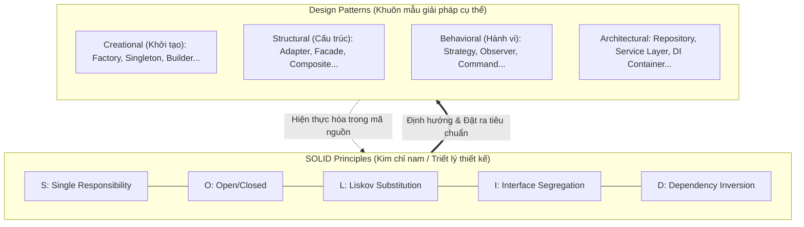
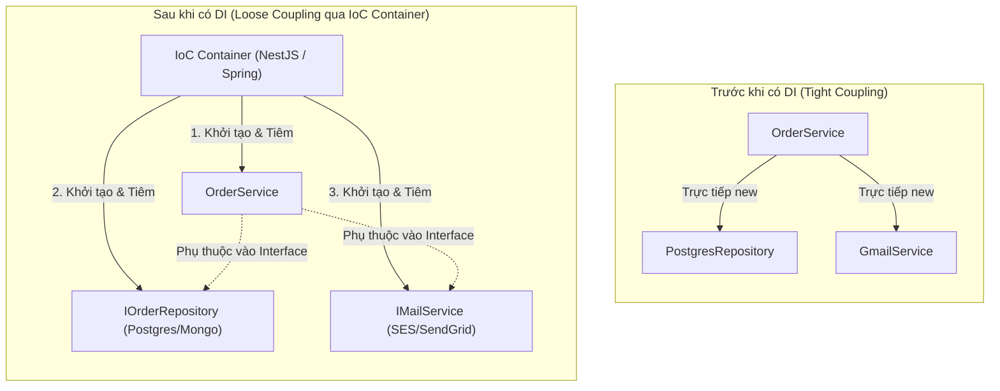
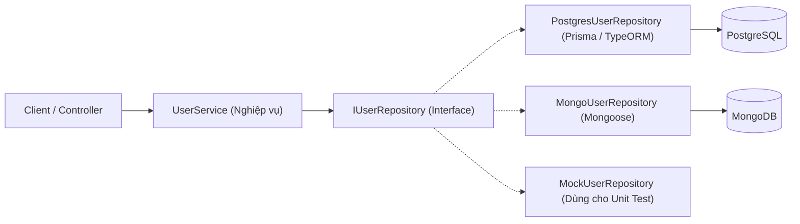
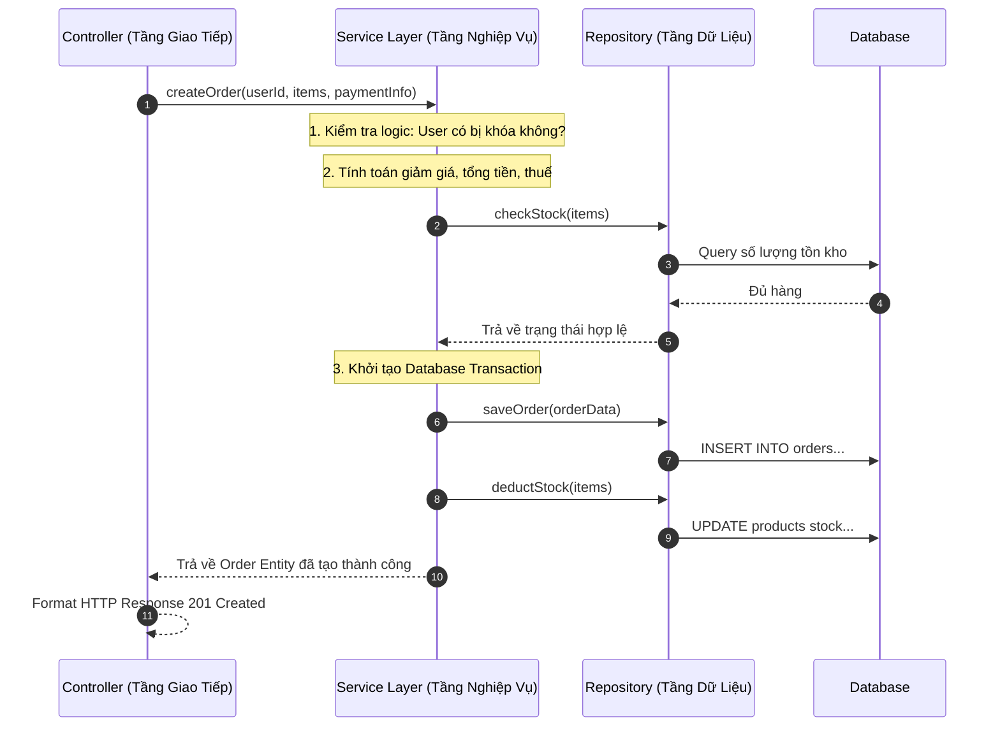
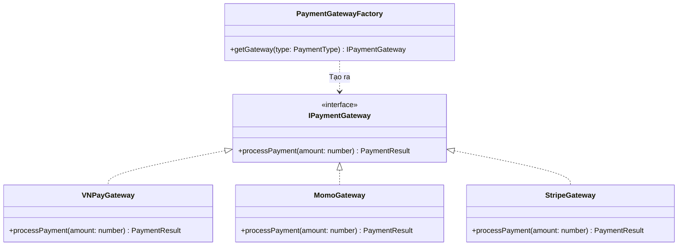
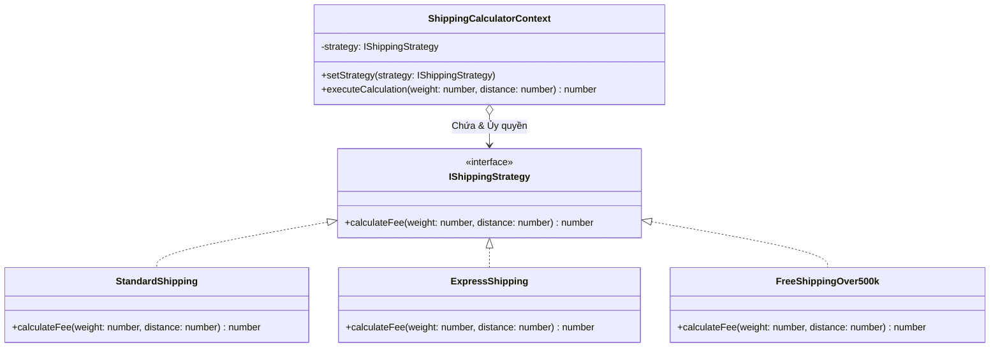
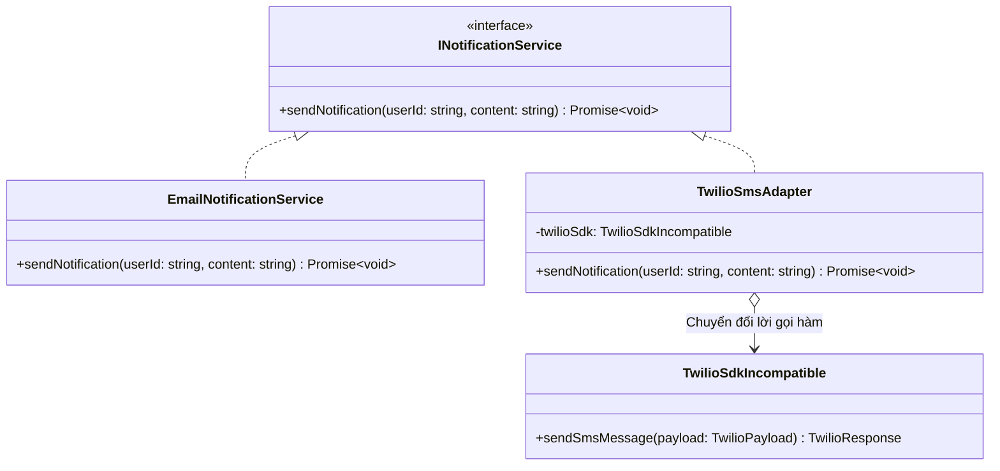
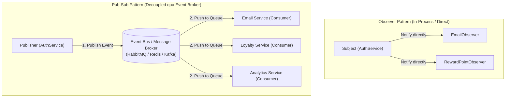
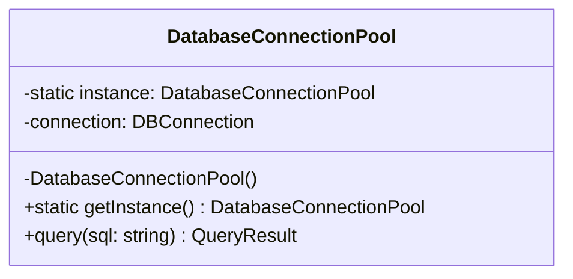
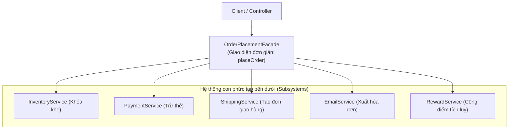

# HƯỚNG DẪN CHUYÊN SÂU VỀ CÁC DESIGN PATTERN TRONG BACKEND

## Lời mở đầu

Trong kỹ thuật phát triển phần mềm, việc viết mã "chạy được" chỉ là bước khởi đầu. Khi quy mô hệ thống tăng lên, yêu cầu nghiệp vụ liên tục thay đổi và đội ngũ mở rộng, mã nguồn không có cấu trúc tốt sẽ nhanh chóng biến thành một mớ bòng bong (Spaghetti Code) — khó hiểu, khó kiểm thử và cực kỳ rủi ro khi bảo trì. 

**Design Patterns (Mẫu thiết kế)** là những giải pháp mẫu đã được chuẩn hóa và tối ưu hóa qua nhiều thập kỷ bởi các chuyên gia phần mềm hàng đầu nhằm giải quyết các vấn đề thiết kế tái diễn trong lập trình hướng đối tượng và kiến trúc backend.

Tài liệu này cung cấp hướng dẫn chuyên sâu về 9 mẫu thiết kế và nguyên lý kiến trúc kinh điển nhất trong backend, mở đầu bằng sự phân biệt cốt lõi giữa **SOLID Principles** và **Design Patterns**, đi kèm phân tích bản chất, sơ đồ luồng, mã nguồn TypeScript/NestJS thực chiến và đánh giá ưu/nhược điểm trong môi trường sản xuất (production).

---

## Mục lục

- [Phần 0: Phân biệt SOLID Principles và Design Patterns](#phần-0-phân-biệt-solid-principles-và-design-patterns)
- [1. Dependency Injection (DI) & Inversion of Control (IoC)](#1-dependency-injection-di--inversion-of-control-ioc)
- [2. Repository Pattern](#2-repository-pattern)
- [3. Service Layer Pattern](#3-service-layer-pattern)
- [4. Factory Pattern](#4-factory-pattern)
- [5. Strategy Pattern](#5-strategy-pattern)
- [6. Adapter Pattern](#6-adapter-pattern)
- [7. Observer & Publish-Subscribe (Pub-Sub) Pattern](#7-observer--publish-subscribe-pub-sub-pattern)
- [8. Singleton Pattern](#8-singleton-pattern)
- [9. Facade Pattern](#9-facade-pattern)
- [Tổng kết: Ma trận lựa chọn Design Pattern](#tổng-kết-ma-trận-lựa-chọn-design-pattern)

---

# Phần 0: Phân biệt SOLID Principles và Design Patterns

Một trong những câu hỏi nền tảng hay gặp nhất trong phỏng vấn kỹ thuật và thiết kế hệ thống là: **"SOLID khác gì Design Pattern?"**.



### Bảng so sánh bản chất
| Tiêu chí | SOLID Principles (Nguyên lý thiết kế) | Design Patterns (Mẫu thiết kế) |
|---|---|---|
| **Bản chất** | Là **triết lý, mục tiêu, kim chỉ nam** định hướng thiết kế phần mềm sạch (Clean Architecture). | Là **khuôn mẫu giải pháp cụ thể** (blueprints) cho các bài toán lặp đi lặp lại. |
| **Mức độ trừu tượng** | Trừu tượng mức cao — nói cho bạn biết code cần đạt được *tính chất gì* (linh hoạt, dễ bảo trì, ít phụ thuộc). | Cụ thể hơn — chỉ rõ cấu trúc các Class, Interface, mối quan hệ và cách tương tác giữa chúng. |
| **Cách áp dụng** | Không có đoạn code mẫu cố định; áp dụng xuyên suốt toàn bộ codebase. | Có cấu trúc sơ đồ lớp (Class Diagram) và mô hình code định hình sẵn. |
| **Mối quan hệ** | **Nguyên nhân / Mục tiêu**: Tại sao ta cần thiết kế như vậy. | **Kết quả / Công cụ**: Cách thức cụ thể để đạt được mục tiêu SOLID. |

### Cách các Design Pattern hiện thực hóa nguyên lý SOLID
- **Single Responsibility Principle (SRP):** Hiện thực hóa qua *Service Layer*, *Repository Pattern* (tách biệt nghiệp vụ và truy cập dữ liệu).
- **Open/Closed Principle (OCP):** Hiện thực hóa qua *Strategy Pattern*, *Factory Pattern* (thêm tính năng mới bằng cách thêm class mới mà không sửa class cũ).
- **Liskov Substitution Principle (LSP):** Hiện thực hóa qua *Adapter Pattern*, *Strategy Pattern* (các class con thay thế hoàn hảo cho Interface chung).
- **Interface Segregation Principle (ISP):** Hiện thực hóa qua việc chia nhỏ interface trong *Repository* và *Adapter*.
- **Dependency Inversion Principle (DIP):** Hiện thực hóa trực tiếp qua *Dependency Injection (DI)*.

---

# 1. Dependency Injection (DI) & Inversion of Control (IoC)

## 1.1. Đặt vấn đề
Nếu một class tự chịu trách nhiệm khởi tạo (dùng toán tử `new`) các đối tượng phụ thuộc bên trong nó, hệ thống sẽ bị **liên kết chặt (tight coupling)**. Khi cần đổi database, chuyển sang môi trường test (cần Mock data), hoặc thay đổi tham số cấu hình, bạn buộc phải sửa trực tiếp mã nguồn của class đó.

```typescript
// KHÔNG AN TOÀN / TIGHT COUPLING
class OrderService {
  private mailer = new SmtpMailerService('smtp.gmail.com', 'user', 'pass'); // Bị dính chặt vào Gmail SMTP
  private repo = new PostgresOrderRepository(); // Bị dính chặt vào Postgres
}
```

## 1.2. Khái niệm
- **Inversion of Control (IoC - Đảo ngược điều khiển):** Nguyên lý chuyển giao quyền kiểm soát luồng chương trình và khởi tạo đối tượng từ class nội bộ sang một "khung quản lý" bên ngoài (IoC Container).
- **Dependency Injection (DI - Tiêm phụ thuộc):** Kỹ thuật cụ thể để hiện thực hóa IoC: các dependencies được "tiêm" vào class từ bên ngoài (thường qua hàm khởi tạo — Constructor Injection) dưới dạng **Interface trừu tượng**.

## 1.3. Sơ đồ minh họa


## 1.4. Mã nguồn thực tế (TypeScript & NestJS)
```typescript
// 1. Định nghĩa Interface trừu tượng
export interface IMailService {
  sendMail(to: string, subject: string, body: string): Promise<void>;
}

// 2. Class thực thi cụ thể
@Injectable()
export class SendGridMailService implements IMailService {
  async sendMail(to: string, subject: string, body: string): Promise<void> {
    console.log(`[SendGrid] Gửi email đến: ${to}`);
  }
}

// 3. Class sử dụng nhận dependency qua Constructor (Constructor Injection)
@Injectable()
export class OrderService {
  constructor(
    @Inject('IMailService') private readonly mailService: IMailService,
  ) {}

  async createOrder(userEmail: string) {
    // Logic tạo đơn hàng...
    await this.mailService.sendMail(userEmail, 'Đơn hàng thành công', 'Cảm ơn bạn!');
  }
}
```

## 1.5. Đánh giá kỹ thuật
- **Ưu điểm:** Khả năng Unit Test tối đa (dễ dàng Mock Interface bằng fake data); code độc lập, linh hoạt hoán đổi thư viện bên dưới.
- **Nhược điểm:** Tăng độ phức tạp ban đầu khi cần thiết lập Container/Module; luồng khởi tạo bị trừu tượng hóa khó debug hơn đối với người mới.

---

# 2. Repository Pattern

## 2.1. Đặt vấn đề
Nếu trong Controller hoặc Service ngập tràn các câu truy vấn cơ sở dữ liệu (như `SELECT * FROM users WHERE...`, `prisma.user.findMany()`, `Mongoose.find()`), logic truy vấn dữ liệu bị trộn lẫn với logic nghiệp vụ. Khi chuyển đổi cơ sở dữ liệu (từ PostgreSQL sang MongoDB) hoặc viết test, lập trình viên sẽ gặp ác mộng vì không thể giả lập (mock) database độc lập.

## 2.2. Khái niệm
**Repository Pattern** đóng vai trò là một lớp trừu tượng trung gian giữa tầng Business Logic (Service) và tầng Lưu trữ Dữ liệu (Database/ORM). Nó mô phỏng một **tập hợp các đối tượng trong bộ nhớ (in-memory collection)**, che giấu hoàn toàn chi tiết kỹ thuật về SQL, ORM, Table schemas hay Network queries bên dưới.

## 2.3. Sơ đồ minh họa


## 2.4. Mã nguồn thực tế
```typescript
// 1. Interface đại diện cho Repository
export interface IUserRepository {
  findById(id: string): Promise<User | null>;
  findByEmail(email: string): Promise<User | null>;
  save(user: User): Promise<User>;
}

// 2. Hiện thực cụ thể sử dụng Prisma ORM
@Injectable()
export class PrismaUserRepository implements IUserRepository {
  constructor(private readonly prisma: PrismaClient) {}

  async findById(id: string): Promise<User | null> {
    return this.prisma.user.findUnique({ where: { id } });
  }

  async findByEmail(email: string): Promise<User | null> {
    return this.prisma.user.findUnique({ where: { email } });
  }

  async save(user: User): Promise<User> {
    return this.prisma.user.create({ data: user });
  }
}
```

## 2.5. Đánh giá kỹ thuật
- **Ưu điểm:** Tách biệt hoàn toàn tầng nghiệp vụ khỏi cơ sở dữ liệu (Tuân thủ DIP & SRP); tái sử dụng các câu query phức tạp ở nhiều nơi; cực kỳ dễ viết Unit Test độc lập không cần database thật.
- **Nhược điểm:** Tốn thêm mã nguồn boilerplate nếu dự án CRUD đơn giản; một số ORM hiện đại (như Prisma/TypeORM) đã có sẵn pattern Repository tích hợp, nếu wrap quá nhiều tầng có thể gây thừa thãi (Over-engineering).

---

# 3. Service Layer Pattern

## 3.1. Đặt vấn đề
Trong mô hình MVC cơ bản, lập trình viên thường mắc lỗi viết toàn bộ logic nghiệp vụ (tính toán giá tiền, kiểm tra tồn kho, gửi email, trừ điểm thưởng) trực tiếp bên trong Controller ("Fat Controller"). Điều này khiến Controller phình to hàng nghìn dòng, không tái sử dụng được khi có thêm GraphQL endpoint hoặc Cron Job, và vi phạm nguyên lý Single Responsibility.

## 3.2. Khái niệm
**Service Layer** là tầng ranh giới đóng gói toàn bộ **Logic Nghiệp Vụ (Business Logic)** của ứng dụng. Nó đứng giữa Controller (nơi nhận/trả request HTTP) và Repository (nơi lấy dữ liệu), chịu trách nhiệm:
1. Thực thi các quy tắc nghiệp vụ (Business Rules).
2. Điều phối giao dịch dữ liệu (Database Transactions).
3. Phối hợp giữa nhiều Repository và các dịch vụ thứ 3 (Email, Payment, Cache).

## 3.3. Sơ đồ kiến trúc 3 tầng chuẩn (3-Tier Layered Architecture)


## 3.4. Mã nguồn thực tế
```typescript
@Injectable()
export class OrderService {
  constructor(
    private readonly orderRepo: IOrderRepository,
    private readonly productRepo: IProductRepository,
    private readonly paymentService: IPaymentService,
  ) {}

  async checkout(userId: string, items: OrderItemDto[]): Promise<Order> {
    // 1. Nghiệp vụ: Kiểm tra tồn kho
    for (const item of items) {
      const product = await this.productRepo.findById(item.productId);
      if (!product || product.stock < item.quantity) {
        throw new BadRequestException(`Sản phẩm ${item.productId} không đủ hàng`);
      }
    }

    // 2. Nghiệp vụ: Tính toán tổng tiền
    const totalAmount = this.calculateTotal(items);

    // 3. Tích hợp thanh toán
    await this.paymentService.charge(userId, totalAmount);

    // 4. Lưu đơn hàng
    return this.orderRepo.save({ userId, items, totalAmount, status: 'PAID' });
  }

  private calculateTotal(items: OrderItemDto[]): number {
    return items.reduce((sum, i) => sum + i.price * i.quantity, 0);
  }
}
```

---

# 4. Factory Pattern

## 4.1. Đặt vấn đề
Khi hệ thống cần tạo ra nhiều đối tượng có chung một Interface nhưng logic khởi tạo phức tạp và phụ thuộc vào điều kiện runtime (ví dụ: các cổng thanh toán Stripe, Momo, VNPay, ZaloPay), việc dùng `if-else` hoặc `switch-case` rải rác khắp mã nguồn sẽ vi phạm nghiêm trọng **Open/Closed Principle** — mỗi khi thêm một cổng thanh toán mới, bạn phải sửa toàn bộ các khối lệnh `switch-case` cũ.

## 4.2. Khái niệm
**Factory Pattern** (Mẫu nhà máy) là mẫu thiết kế thuộc nhóm Creational (Khởi tạo), cung cấp một giao diện trừu tượng để tạo ra các đối tượng trong một superclass, nhưng cho phép các class con hoặc phương thức factory quyết định chính xác class cụ thể nào sẽ được khởi tạo.

## 4.3. Sơ đồ minh họa


## 4.4. Mã nguồn thực tế
```typescript
// 1. Interface chung cho sản phẩm
export interface IPaymentGateway {
  pay(amount: number): Promise<boolean>;
}

@Injectable()
export class MomoGateway implements IPaymentGateway {
  async pay(amount: number): Promise<boolean> {
    console.log(`Thanh toán ${amount} qua Ví MoMo`);
    return true;
  }
}

@Injectable()
export class VNPayGateway implements IPaymentGateway {
  async pay(amount: number): Promise<boolean> {
    console.log(`Thanh toán ${amount} qua Cổng VNPAY`);
    return true;
  }
}

// 2. Factory Class quản lý việc khởi tạo
@Injectable()
export class PaymentGatewayFactory {
  constructor(
    private readonly momo: MomoGateway,
    private readonly vnpay: VNPayGateway,
  ) {}

  getGateway(provider: 'MOMO' | 'VNPAY'): IPaymentGateway {
    switch (provider) {
      case 'MOMO':
        return this.momo;
      case 'VNPAY':
        return this.vnpay;
      default:
        throw new Error(`Cổng thanh toán không hỗ trợ: ${provider}`);
    }
  }
}
```

---

# 5. Strategy Pattern

## 5.1. Đặt vấn đề
Một ứng dụng thương mại điện tử cần tính toán phí giao hàng dựa trên nhiều nhà vận chuyển khác nhau: Giao Hàng Nhanh, Giao Hàng Tiết Kiệm, GrabExpress, hoặc Hỏa tốc. Mỗi đơn vị có công thức tính cước, giới hạn cân nặng và địa lý riêng biệt. Nếu dồn tất cả công thức tính toán vào một hàm duy nhất với hàng loạt câu lệnh `if-else`, mã nguồn sẽ trở nên cồng kềnh, dễ sinh lỗi khi sửa đổi và cực kỳ khó viết unit test.

## 5.2. Khái niệm
**Strategy Pattern** là mẫu thiết kế thuộc nhóm Behavioral (Hành vi), cho phép bạn định nghĩa một **tập hợp các thuật toán (strategies)**, đóng gói từng thuật toán vào một class riêng biệt, và làm cho chúng **có thể hoán đổi cho nhau (interchangeable)** ở thời điểm chạy (runtime).

## 5.3. Sơ đồ minh họa


## 5.4. Mã nguồn thực tế
```typescript
// 1. Strategy Interface
export interface IShippingStrategy {
  calculate(weightInKg: number, distanceInKm: number): number;
}

// 2. Các Concrete Strategies cụ thể
export class StandardShippingStrategy implements IShippingStrategy {
  calculate(weight: number, distance: number): number {
    return distance * 2000 + weight * 5000;
  }
}

export class ExpressShippingStrategy implements IShippingStrategy {
  calculate(weight: number, distance: number): number {
    return distance * 5000 + weight * 10000 + 20000; // Phí hỏa tốc phụ trội
  }
}

// 3. Context sử dụng Strategy
export class ShippingContext {
  private strategy: IShippingStrategy;

  constructor(strategy: IShippingStrategy) {
    this.strategy = strategy;
  }

  setStrategy(strategy: IShippingStrategy) {
    this.strategy = strategy;
  }

  calculateShippingFee(weight: number, distance: number): number {
    return this.strategy.calculate(weight, distance);
  }
}
```

---

# 6. Adapter Pattern

## 6.1. Đặt vấn đề
Hệ thống của bạn đã có sẵn một chuẩn gửi thông báo (Notification Interface) với phương thức `send(to: string, message: string)`. Bây giờ công ty muốn tích hợp thêm một SDK của bên thứ ba (ví dụ Twilio SMS SDK hoặc Firebase Cloud Messaging), nhưng SDK này lại có tên phương thức và tham số hoàn toàn khác: `twilioClient.messages.create({ body: msg, from: sender, to: phone })`. Bạn không thể sửa mã nguồn của thư viện bên ngoài, cũng không muốn đập đi xây lại toàn bộ hệ thống cũ.

## 6.2. Khái niệm
**Adapter Pattern** (Mẫu chuyển đổi) là mẫu thiết kế thuộc nhóm Structural (Cấu trúc), đóng vai trò như một **bộ chuyển đổi phích cắm điện**: nó bọc lấy (wrap) một đối tượng không tương thích và cung cấp một Interface chuẩn mà Client mong đợi, giúp hai class không tương thích có thể làm việc cùng nhau mượt mà.

## 6.3. Sơ đồ minh họa


## 6.4. Mã nguồn thực tế
```typescript
// 1. Target Interface hệ thống của ta mong đợi
export interface INotificationService {
  send(recipient: string, message: string): Promise<void>;
}

// 2. Adaptee: Thư viện bên thứ ba với interface khác biệt
export class ThirdPartyTwilioSdk {
  async sendSmsDirect(config: { toPhone: string; textBody: string; senderId: string }) {
    console.log(`[Twilio API] Gửi tới ${config.toPhone}: ${config.textBody}`);
  }
}

// 3. Adapter: Cầu nối biến đổi SDK bên ngoài thành chuẩn của ta
@Injectable()
export class TwilioSmsAdapter implements INotificationService {
  constructor(private readonly twilioSdk: ThirdPartyTwilioSdk) {}

  async send(recipient: string, message: string): Promise<void> {
    // Chuyển đổi tham số từ chuẩn hệ thống sang chuẩn Twilio SDK
    await this.twilioSdk.sendSmsDirect({
      toPhone: recipient,
      textBody: message,
      senderId: 'SYSTEM_ALERT',
    });
  }
}
```

---

# 7. Observer & Publish-Subscribe (Pub-Sub) Pattern

## 7.1. Đặt vấn đề
Khi một sự kiện quan trọng xảy ra trong hệ thống — ví dụ: `UserRegisteredEvent` (Người dùng đăng ký tài khoản thành công) — hệ thống cần thực hiện hàng loạt hành động phụ trợ:
1. Gửi email kích hoạt tài khoản.
2. Cộng 50 điểm thưởng chào mừng vào ví điểm.
3. Gửi thông báo cho nhân viên chăm sóc khách hàng qua Telegram/Slack.
4. Ghi log kiểm toán (Audit Trail) vào ElasticSearch.

Nếu viết toàn bộ 4 hành động trên tuần tự bên trong `register()` của `AuthService`, `AuthService` sẽ bị phình to, phụ thuộc chặt vào 4 dịch vụ khác và nếu một bước phụ gặp lỗi có thể làm hỏng toàn bộ luồng đăng ký.

## 7.2. Khái niệm & Phân biệt Observer vs Pub-Sub
- **Observer Pattern (In-memory / Khớp nối trực tiếp):** Đối tượng chủ thể (`Subject`) duy trì danh sách các đối tượng lắng nghe (`Observers`) và chủ động gọi hàm callback trực tiếp trên từng Observer khi có trạng thái mới.
- **Pub-Sub Pattern (Decoupled / Qua Broker trung gian):** Người phát tin (`Publisher`) và Người nhận tin (`Subscriber`) **hoàn toàn không biết sự tồn tại của nhau**. Chúng giao tiếp thông qua một kênh trung gian (**Event Bus / Message Broker** như Redis Pub/Sub, RabbitMQ, Kafka).



## 7.3. Mã nguồn thực tế (Event-Driven với NestJS EventEmitter)
```typescript
// 1. Định nghĩa Sự kiện
export class UserRegisteredEvent {
  constructor(public readonly userId: string, public readonly email: string) {}
}

// 2. Publisher: Phát ra sự kiện, không cần biết ai xử lý
@Injectable()
export class AuthService {
  constructor(private readonly eventEmitter: EventEmitter2) {}

  async register(dto: RegisterDto) {
    const user = await this.userRepo.create(dto);
    
    // Bắn sự kiện bất đồng bộ
    this.eventEmitter.emit('user.registered', new UserRegisteredEvent(user.id, user.email));
    return user;
  }
}

// 3. Subscribers / Listeners: Tách biệt hoàn toàn độc lập
@Injectable()
export class WelcomeEmailListener {
  @OnEvent('user.registered')
  async handleWelcomeEmail(event: UserRegisteredEvent) {
    console.log(`[Email Service] Gửi mail chào mừng tới: ${event.email}`);
  }
}

@Injectable()
export class LoyaltyRewardListener {
  @OnEvent('user.registered')
  async handleBonusPoints(event: UserRegisteredEvent) {
    console.log(`[Reward Service] Cộng 50 điểm cho User: ${event.userId}`);
  }
}
```

---

# 8. Singleton Pattern

## 8.1. Đặt vấn đề
Một số tài nguyên trong hệ thống có chi phí khởi tạo cực kỳ tốn kém và cần duy trì trạng thái chia sẻ duy nhất trong suốt vòng đời của ứng dụng — ví dụ: **Database Connection Pool**, **Bộ nhớ đệm cấu hình (Configuration Manager)**, hoặc **Logger Core**. Nếu mỗi controller hay service tự tạo ra một connection pool riêng, hệ thống sẽ nhanh chóng cạn kiệt socket kết nối và RAM.

## 8.2. Khái niệm
**Singleton Pattern** là mẫu thiết kế thuộc nhóm Creational (Khởi tạo), đảm bảo rằng **một class chỉ có duy nhất một thực thể (instance)** trong toàn bộ runtime của ứng dụng và cung cấp một điểm truy cập toàn cục (global access point) đến thực thể đó.

## 8.3. Sơ đồ minh họa


## 8.4. Mã nguồn thực tế (Pure TypeScript vs DI Scope)
```typescript
// Triển khai Singleton cổ điển (Classic Singleton)
export class DatabaseConnection {
  private static instance: DatabaseConnection | null = null;

  // 1. Constructor private để ngăn toán tử 'new' từ bên ngoài
  private constructor() {
    console.log('Khởi tạo kết nối Database (Chỉ chạy đúng 1 lần)');
  }

  // 2. Static method kiểm soát việc cấp phát instance
  public static getInstance(): DatabaseConnection {
    if (!DatabaseConnection.instance) {
      DatabaseConnection.instance = new DatabaseConnection();
    }
    return DatabaseConnection.instance;
  }

  public query(sql: string) {
    console.log(`Thực thi query: ${sql}`);
  }
}
```

> [!TIP]
> **Singleton trong các Framework hiện đại (NestJS / Spring):**
> Trong thực tế hiện đại, ta hiếm khi viết Singleton thủ công với `static getInstance()` vì nó gây khó khăn cho Unit Testing. Thay vào đó, **mặc định tất cả các Provider trong NestJS / Spring đều có scope là Singleton** được quản lý bởi IoC Container — framework tự động đảm bảo chỉ tạo duy nhất một instance trong bộ nhớ và inject cho toàn bộ ứng dụng.

---

# 9. Facade Pattern

## 9.1. Đặt vấn đề
Để hoàn tất một nghiệp vụ "Đặt mua hàng", hệ thống cần tương tác với hàng loạt hệ thống con phức tạp:
1. `InventoryService.checkStock()`
2. `InventoryService.lockItems()`
3. `PaymentGateway.chargeCreditCard()`
4. `ShippingProvider.createShipmentOrder()`
5. `EmailService.sendInvoice()`
6. `AnalyticsService.trackPurchase()`

Nếu để Client (Frontend) hoặc Controller gọi tuần tự 6 service trên, mã nguồn sẽ cực kỳ lộn xộn, client phải hiểu sâu kiến trúc nội bộ, và độ trễ mạng tăng cao do phải gửi nhiều request liên tiếp.

## 9.2. Khái niệm
**Facade Pattern** (Mẫu mặt tiền) là mẫu thiết kế thuộc nhóm Structural (Cấu trúc), cung cấp một **giao diện đơn giản hóa cấp cao (simplified high-level interface)** che giấu toàn bộ sự phức tạp của một hệ thống con (subsystem) gồm nhiều class phức tạp phía sau.

## 9.3. Sơ đồ minh họa


## 9.4. Mã nguồn thực tế
```typescript
@Injectable()
export class OrderPlacementFacade {
  constructor(
    private readonly inventory: InventoryService,
    private readonly payment: PaymentService,
    private readonly shipping: ShippingService,
    private readonly email: EmailService,
  ) {}

  // Cung cấp đúng 1 hàm cấp cao duy nhất cho Controller
  async placeOrder(userId: string, cartItems: CartItem[], cardToken: string) {
    console.log('--- Bắt đầu quy trình xử lý đơn hàng phức tạp ---');
    
    // 1. Giữ hàng trong kho
    await this.inventory.reserve(cartItems);

    // 2. Thanh toán
    const paymentResult = await this.payment.charge(userId, cardToken);

    // 3. Tạo vận đơn giao hàng
    const trackingCode = await this.shipping.createShipping(userId, cartItems);

    // 4. Gửi email
    await this.email.sendConfirmation(userId, trackingCode);

    return { success: true, trackingCode };
  }
}
```

---

# Tổng kết: Ma trận lựa chọn Design Pattern

| Bài toán thiết kế thực tế | Design Pattern phù hợp | Mục tiêu kiến trúc đạt được |
|---|---|---|
| Cần quản lý vòng đời đối tượng, tách rời class khỏi việc tự `new` dependencies | **Dependency Injection (DI)** | Khả năng kiểm thử (Testability), Loose Coupling |
| Cần che giấu chi tiết SQL/ORM, tách biệt nghiệp vụ khỏi cơ sở dữ liệu | **Repository Pattern** | Độc lập tầng dữ liệu (Data Access Abstraction) |
| Cần nơi tập trung logic nghiệp vụ, điều phối transaction và security | **Service Layer** | Clean Architecture, chống Fat Controller |
| Cần tạo đối tượng động theo điều kiện runtime mà không dùng switch-case rải rác | **Factory Pattern** | Tuân thủ Open/Closed Principle (OCP) |
| Cần thay đổi hoặc mở rộng nhiều thuật toán xử lý linh hoạt ở runtime | **Strategy Pattern** | Dễ mở rộng, loại bỏ `if-else` lồng nhau |
| Cần tích hợp thư viện/SDK bên ngoài có giao diện không khớp với chuẩn dự án | **Adapter Pattern** | Tương thích ngược, không sửa mã nguồn cũ |
| Cần kích hoạt nhiều tác vụ phụ trợ bất đồng bộ khi một sự kiện xảy ra | **Observer / Pub-Sub** | Loose Coupling, Event-Driven Architecture |
| Cần duy trì duy nhất một kết nối, config manager trong toàn bộ runtime | **Singleton Pattern** | Tiết kiệm tài nguyên bộ nhớ và socket |
| Cần một điểm truy cập đơn giản che giấu quy trình xử lý phức tạp của nhiều service | **Facade Pattern** | Đơn giản hóa API cho Client, giảm khớp nối |
