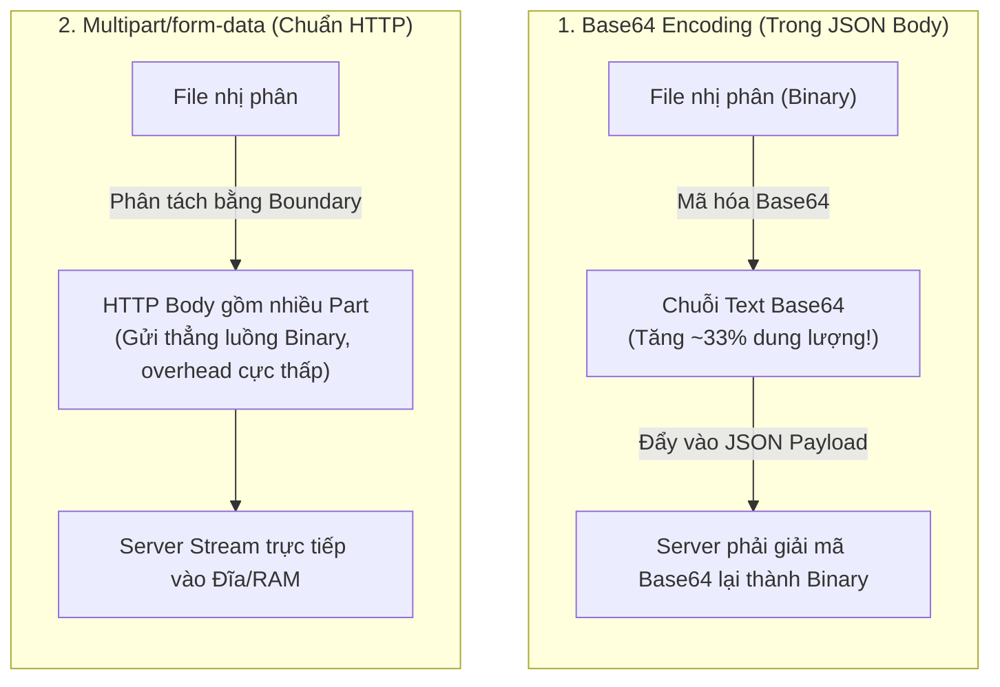
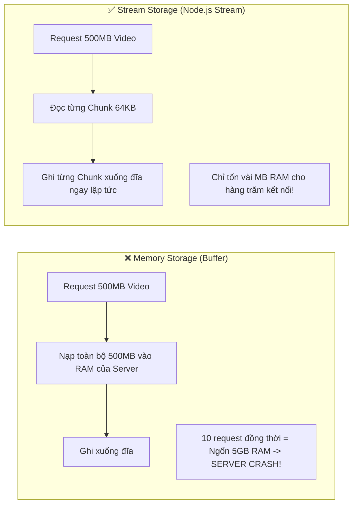
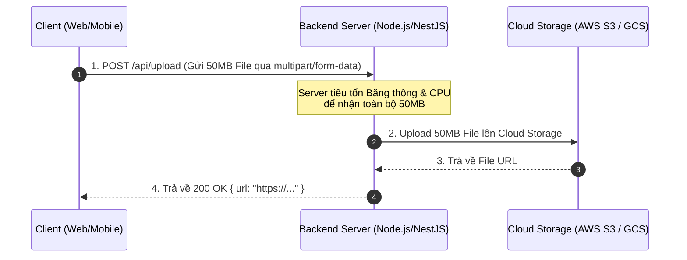
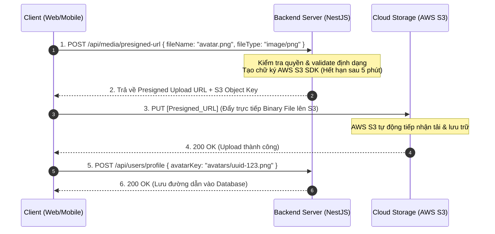
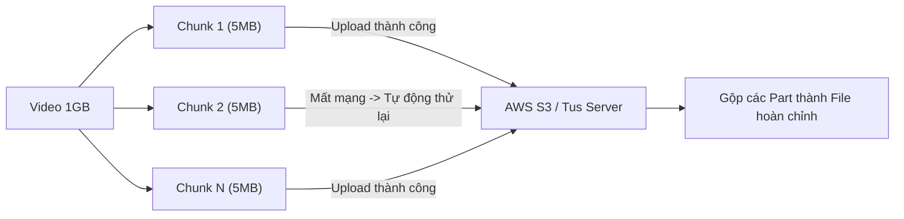
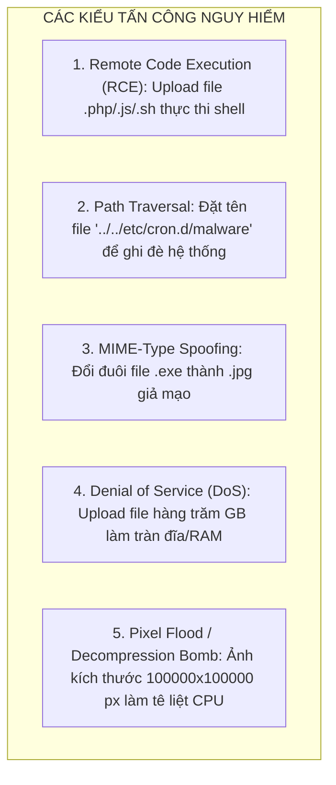
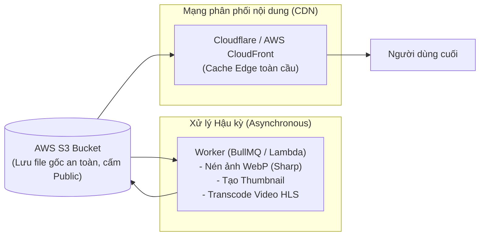

# ĐẶC TẢ CHUYÊN SÂU: KIẾN TRÚC VÀ BẢO MẬT FILE UPLOAD TRONG BACKEND

## Lời mở đầu

**File Upload (Tải tệp tin lên hệ thống)** là một trong những tính năng phổ biến nhất trong các ứng dụng Backend (ảnh đại diện, hóa đơn PDF, video, tài liệu đính kèm). Tuy nhiên, đây cũng là một trong những **vector tấn công nguy hiểm nhất (Remote Code Execution, DoS, Path Traversal)** và là nguyên nhân hàng đầu gây **tràn bộ nhớ (Out of Memory - OOM), nghẽn I/O server**.

Tài liệu này đặc tả toàn diện bản chất kỹ thuật của File Upload, so sánh các mô hình kiến trúc từ truyền thống đến hiện đại (Presigned URL), các nguyên tắc bảo mật tối quan trọng, và hướng dẫn triển khai chuẩn mực trong môi trường Production.

---

## 1. Bản chất kỹ thuật của việc truyền tải File qua HTTP

### 1.1. So sánh các phương thức mã hóa dữ liệu khi gửi File



| Phương thức | Cơ chế | Ưu điểm | Nhược điểm | Trường hợp sử dụng |
|---|---|---|---|---|
| **Base64 (JSON)** | Chuyển file nhị phân thành chuỗi văn bản ASCII. | Nhúng trực tiếp vào payload JSON cùng với các trường form khác. | **Tăng $33\%$ dung lượng dữ liệu**, tốn CPU mã hóa/giải mã, dễ gây nghẽn RAM. | Chỉ dùng cho ảnh đại diện cực nhỏ (thumbnail $< 50\text{KB}$) hoặc chữ ký số SVG. |
| **`multipart/form-data`** | Chia HTTP Body thành nhiều phần (parts), ngăn cách bởi một chuỗi ký tự ngẫu nhiên (`boundary`). | Truyền dữ liệu nhị phân nguyên bản (**zero-overhead**), truyền kèm được cả metadata (text). | Cần thư viện multipart parser (Multer, Busboy) ở phía server. | Chuẩn mực cho upload form thông thường. |
| **Direct Binary Stream (`application/octet-stream`)** | Gửi toàn bộ Body là dữ liệu nhị phân thuần của file. | Hiệu năng tối đa, không cần parse boundary. | Không gửi kèm được các field text khác trong cùng 1 request (phải dùng Query Param hoặc Header). | Upload file đơn lẻ lên Cloud Storage (S3, GCS). |

### 1.2. Memory Buffer vs Streaming: Nguy cơ tràn RAM (OOM)



- **Memory Buffer (`MemoryStorage`):** Server nhận toàn bộ nội dung file và lưu vào bộ nhớ RAM trước khi xử lý. **Cực kỳ nguy hiểm** đối với các file lớn vì sẽ khiến tiến trình Node.js cạn kiệt RAM và bị hệ điều hành tắt (Kill process).
- **Streaming (`DiskStorage` / Stream Pipeline):** Server mở luồng dữ liệu (Readable Stream) và chuyển tiếp từng khối nhỏ (Chunks: $16\text{KB} - 64\text{KB}$) trực tiếp sang Writable Stream (ổ cứng hoặc Cloud). Dung lượng RAM tiêu thụ là hằng số $O(1)$ bất kể file lớn đến mức nào.

---

## 2. Các mô hình kiến trúc File Upload trong Backend

### Mô hình 1: Upload qua Application Server truyền thống (Server Proxy Upload)

Client gửi file lên Backend Server, Backend Server lưu tạm rồi đẩy tiếp sang Cloud Storage hoặc lưu trên ổ cứng cục bộ.



- **Nhược điểm nghiêm trọng:**
  - Backend trở thành **điểm nghẽn cổ chai (Bottleneck)** về cả băng thông (Bandwidth) lẫn CPU.
  - Tốn **băng thông gấp đôi**: 1 lần từ Client $\rightarrow$ Server, 1 lần từ Server $\rightarrow$ Cloud.
  - Server bị giữ kết nối HTTP lâu (Slow Connection), làm giảm khả năng phục vụ các API nghiệp vụ khác.

---

### Mô hình 2: Upload trực tiếp qua Presigned URL (Chuẩn mực hệ thống hiện đại)

Backend Server chỉ đóng vai trò **cấp quyền** (sinh URL có chữ ký bảo mật ngắn hạn), Client sẽ **gửi file trực tiếp lên Cloud Storage** mà không đi qua Backend.



- **Ưu điểm vượt trội:**
  - **Giảm tải $100\%$ băng thông file cho Backend Server:** Server chỉ xử lý JSON request vài bytes để sinh URL.
  - **Tận dụng hạ tầng phân tán của Cloud:** AWS S3/GCS có thể xử lý hàng chục nghìn file upload đồng thời mà không lo sập server.
  - **Tối ưu tốc độ (Upload Acceleration):** Có thể kết hợp với S3 Transfer Acceleration hoặc CDN Edge.

---

### Mô hình 3: Resumable & Chunked Upload (Cho tệp tin dung lượng lớn: Video, File GB)

Đối với các tệp tin từ hàng trăm MB đến nhiều GB, kết nối mạng chập chờn có thể làm gián đoạn quá trình tải lên. Giải pháp là **chia nhỏ file thành nhiều phần (Chunks)** và sử dụng giao thức có khả năng tiếp tục khi đứt mạng (ví dụ giao thức mở **`tus.io`** hoặc **AWS S3 Multipart Upload**).



---

## 3. Các nguy cơ bảo mật và Biện pháp phòng vệ tối quan trọng

File Upload là tính năng tiềm ẩn nhiều rủi ro an ninh mạng nghiêm trọng nếu không được bảo vệ chặt chẽ:



### 3.1. Danh sách kiểm tra bảo mật (Security Checklist)

#### 1. Kiểm tra Magic Bytes (Đọc Header nhị phân thực tế)
- **Lỗ hổng:** Client có thể dễ dàng gửi một file chứa mã độc thực thi (`malware.exe` hoặc `shell.php`) nhưng cố tình đặt tên là `avatar.png` và gắn header giả mạo `Content-Type: image/png`.
- **Giải pháp:** Không bao giờ tin tưởng `file.mimetype` hay đuôi mở rộng từ client. Phải đọc **Magic Number (các byte đầu tiên của file nhị phân)** bằng thư viện như `file-type`.

| Định dạng file | Hex Signature (Magic Bytes) |
|---|---|
| **JPEG / JPG** | `FF D8 FF` |
| **PNG** | `89 50 4E 47 0D 0A 1A 0A` |
| **PDF** | `25 50 44 46` (`%PDF`) |
| **ZIP / DOCX / XLSX** | `50 4B 03 04` (`PK..`) |

#### 2. Vệ sinh và Đổi tên file ngẫu nhiên (UUID Renaming)
- **Tuyệt đối không sử dụng tên file gốc của người dùng** để lưu vào ổ cứng hay S3 (tránh lỗi Path Traversal `../../../` và tấn công ghi đè).
- Tự động sinh tên file bằng **UUID v4** kết hợp phần mở rộng hợp lệ:
  ```typescript
  const safeFileName = `${crypto.randomUUID()}.${detectedExtension}`;
  ```

#### 3. Giới hạn dung lượng nghiêm ngặt (File Size Limit)
- Thiết lập giới hạn kích thước tối đa ở cả **Tầng Reverse Proxy (Nginx `client_max_body_size 10M;`)** và **Tầng Ứng dụng (Multer limits)** để chặn request độc hại ngay từ ngoài cửa ngõ.

#### 4. Vô hiệu hóa quyền thực thi (Disable Script Execution)
- Nếu lưu file trên đĩa cục bộ, thư mục `uploads/` **tuyệt đối không được cấp quyền thực thi** (`chmod 644` cho file, `chmod 755` cho thư mục).
- Cấu hình Web Server (Nginx) cấm thực thi bất kỳ script nào trong thư mục tải lên:
  ```nginx
  location /uploads/ {
      # Không cho phép thực thi PHP/CGI/Node trong thư mục upload
      location ~ \.(php|php5|phtml|sh|pl|cgi)$ {
          deny all;
      }
      add_header X-Content-Type-Options "nosniff";
  }
  ```

---

## 4. Triển khai mẫu trong NestJS

### 4.1. Cách 1: Upload và Validate chặt chẽ với Multer + Sharp (Local/Direct)

```typescript
// upload.controller.ts
import {
  Controller,
  Post,
  UseInterceptors,
  UploadedFile,
  ParseFilePipe,
  MaxFileSizeValidator,
  FileTypeValidator,
  BadRequestException
} from '@nestjs/common';
import { FileInterceptor } from '@nestjs/platform-express';
import { diskStorage } from 'multer';
import { extname } from 'path';
import * as crypto from 'crypto';
import { fromBuffer } from 'file-type';

@Controller('media')
export class UploadController {
  @Post('avatar')
  @UseInterceptors(
    FileInterceptor('file', {
      limits: { fileSize: 5 * 1024 * 1024 }, // 5MB
      storage: diskStorage({
        destination: './uploads/avatars',
        filename: (req, file, callback) => {
          // 1. Đổi tên file sang UUID ngẫu nhiên
          const uniqueSuffix = crypto.randomUUID();
          callback(null, `${uniqueSuffix}${extname(file.originalname).toLowerCase()}`);
        },
      }),
    }),
  )
  async uploadAvatar(
    @UploadedFile(
      new ParseFilePipe({
        validators: [
          new MaxFileSizeValidator({ maxSize: 5 * 1024 * 1024 }),
          // Kiểm tra MIME-type cơ bản
          new FileTypeValidator({ fileType: /(jpg|jpeg|png|webp)$/ }),
        ],
      }),
    )
    file: Express.Multer.File,
  ) {
    // 2. Validate sâu bằng Magic Bytes kiểm tra nội dung thực sự
    // (Đảm bảo file không phải là script độc hại đổi đuôi)
    return {
      message: 'Upload ảnh đại diện thành công',
      filePath: `/uploads/avatars/${file.filename}`,
      size: file.size,
    };
  }
}
```

---

### 4.2. Cách 2: Triển khai AWS S3 Presigned URL (Production Standard)

```typescript
// s3-storage.service.ts
import { Injectable } from '@nestjs/common';
import { S3Client, PutObjectCommand } from '@aws-sdk/client-s3';
import { getSignedUrl } from '@aws-sdk/s3-request-presigner';
import * as crypto from 'crypto';

@Injectable()
export class S3StorageService {
  private s3: S3Client;
  private bucketName = process.env.AWS_S3_BUCKET_NAME;

  constructor() {
    this.s3 = new S3Client({
      region: process.env.AWS_REGION,
      credentials: {
        accessKeyId: process.env.AWS_ACCESS_KEY_ID!,
        secretAccessKey: process.env.AWS_SECRET_ACCESS_KEY!,
      },
    });
  }

  async generatePresignedUploadUrl(
    userId: number,
    originalFileName: string,
    contentType: string,
  ) {
    // 1. Chỉ chấp nhận định dạng ảnh hợp lệ
    const allowedTypes = ['image/jpeg', 'image/png', 'image/webp', 'application/pdf'];
    if (!allowedTypes.includes(contentType)) {
      throw new Error('Định dạng file không được hỗ trợ');
    }

    // 2. Tạo đường dẫn Object an toàn: users/{userId}/avatars/{uuid}.png
    const extension = originalFileName.split('.').pop()?.toLowerCase();
    const key = `users/${userId}/media/${crypto.randomUUID()}.${extension}`;

    // 3. Khởi tạo Command với ràng buộc Content-Type
    const command = new PutObjectCommand({
      Bucket: this.bucketName,
      Key: key,
      ContentType: contentType,
    });

    // 4. Sinh URL có chữ ký bảo mật hết hạn sau 5 phút (300 giây)
    const uploadUrl = await getSignedUrl(this.s3, command, { expiresIn: 300 });

    return {
      uploadUrl,
      objectKey: key,
      expiresInSeconds: 300,
    };
  }
}
```

---

## 5. Xử lý hậu kỳ và Phân phối tệp tin (Post-Processing & CDN)



1. **Tối ưu hóa hình ảnh tự động (Image Optimization):** Chuyển đổi các định dạng nặng (PNG, JPEG gốc) sang **WebP** hoặc **AVIF** bằng thư viện `sharp` để giảm $50\% - 70\%$ dung lượng ảnh mà vẫn giữ nguyên chất lượng hiển thị.
2. **Không bao giờ mở Public quyền truy cập S3 Bucket:** Sử dụng **CloudFront Origin Access Identity (OAI)** hoặc **Origin Access Control (OAC)** để chỉ cho phép duy nhất CDN đọc dữ liệu từ S3.
3. **Cache-Control Headers:** Đặt header `Cache-Control: public, max-age=31536000, immutable` cho các file tĩnh đã gắn UUID, giúp trình duyệt cache vĩnh viễn và không tốn request tải lại.

---

## Tổng kết

Xây dựng tính năng File Upload chất lượng cao trong Backend đòi hỏi sự kết hợp chặt chẽ giữa **kiến trúc truyền tải (Streaming / Presigned URL)** và **hàng rào bảo mật nhiều lớp (Magic Bytes, UUID Renaming, Size Limits, Non-executable Directory)**. 

Đối với hệ thống quy mô lớn, việc chuyển đổi sang mô hình **Presigned URL kết hợp Cloud Object Storage (S3) và CDN** là quyết định kiến trúc bắt buộc để giải phóng tài nguyên CPU/RAM cho máy chủ ứng dụng và đảm bảo tính sẵn sàng cao (High Availability).
