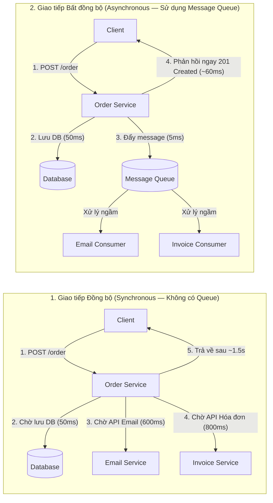
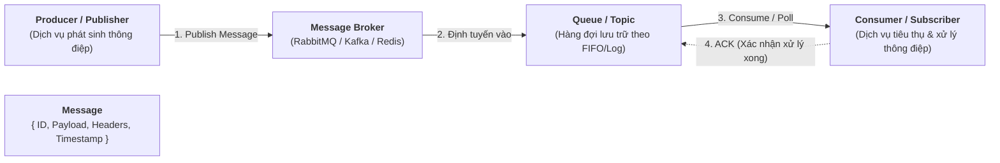
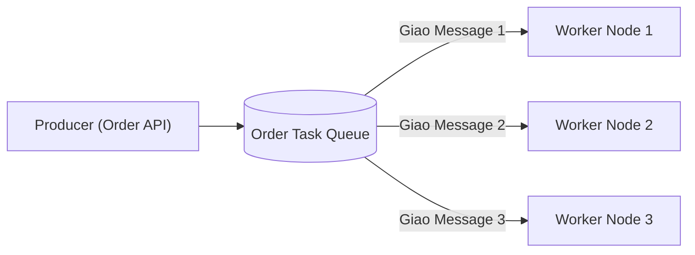
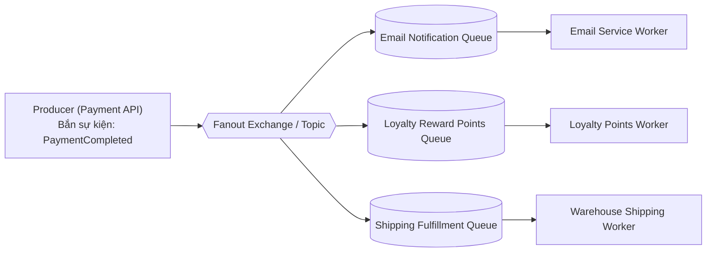
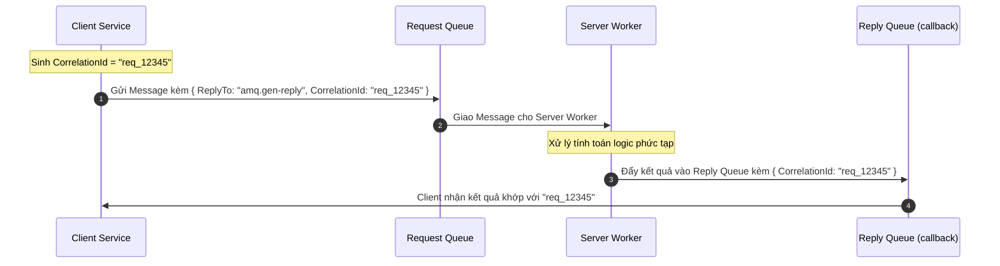
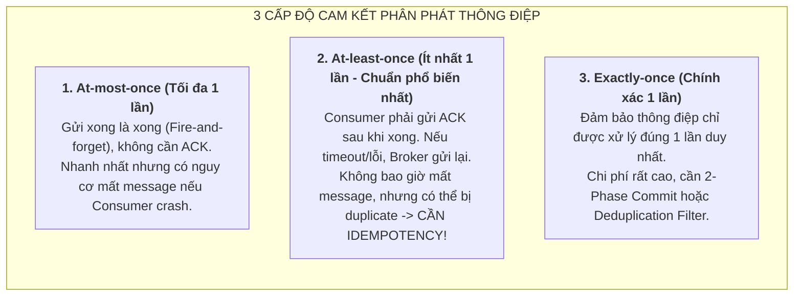
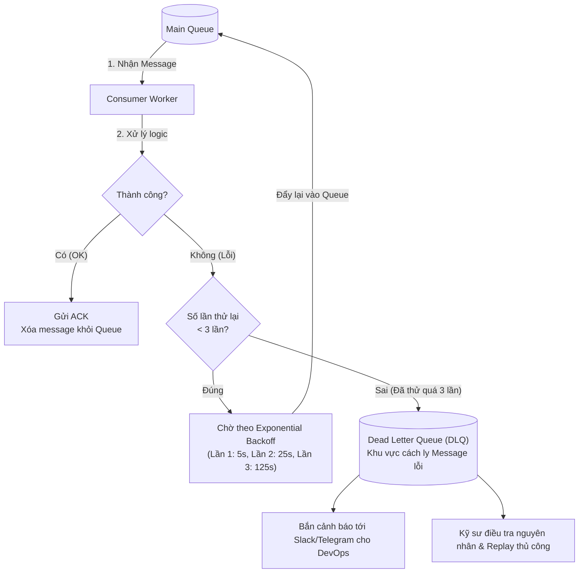
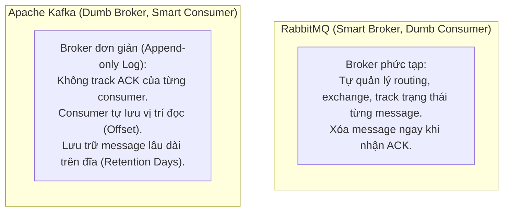

# HƯỚNG DẪN CHUYÊN SÂU VỀ MESSAGE QUEUE TRONG KIẾN TRÚC BACKEND

## Lời mở đầu

Trong các hệ thống phần mềm truyền thống, các thành phần thường giao tiếp với nhau theo cơ chế **Đồng bộ (Synchronous / Request-Response qua HTTP REST hoặc gRPC)**: Dịch vụ A gọi Dịch vụ B và phải chờ đợi B xử lý xong mới có thể tiếp tục. 

Khi hệ thống phát triển đến quy mô hàng triệu người dùng, kiến trúc đồng bộ bộc lộ những điểm nghẽn nghiêm trọng:
1. **Độ trễ tích lũy (Cascading Latency):** Một thao tác người dùng kéo theo chuỗi 4-5 API calls liên tiếp khiến thời gian phản hồi tăng lên hàng giây.
2. **Lỗi dây chuyền (Cascading Failure):** Nếu một dịch vụ phụ trợ (như gửi email, xuất hóa đơn) bị chậm hoặc sập, toàn bộ luồng nghiệp vụ chính (như Đặt hàng) bị sập theo.
3. **Quá tải khi có đột biến lưu lượng (Spike Traffic):** Vào các đợt Flash Sale, database backend bị dội hàng chục nghìn request cùng lúc dẫn đến sập kết nối (Connection Exhaustion).

**Message Queue (Hàng đợi thông điệp)** ra đời như một giải pháp nền tảng để giải quyết triệt để các bài toán trên thông qua cơ chế **Giao tiếp Bất đồng bộ (Asynchronous Messaging)** và **Khớp nối lỏng (Decoupling)**.

---

## Mục lục

- [Phần I: Bản Chất & Lợi Ích Cốt Lõi Của Message Queue](#phần-i-bản-chất--lợi-ích-cốt-lõi-của-message-queue)
- [Phần II: Các Khái Niệm & Thành Phần Cơ Bản](#phần-ii-các-khái-niệm--thành-phần-cơ-bản)
- [Phần III: Các Mô Hình Phân Phát Thông Điệp (Messaging Patterns)](#phần-iii-các-mô-hình-phân-phát-thông-điệp-messaging-patterns)
  - [1. Point-to-Point (Work Queues / Competing Consumers)](#1-point-to-point-work-queues--competing-consumers)
  - [2. Publish-Subscribe (Pub-Sub / Fanout Topic)](#2-publish-subscribe-pub-sub--fanout-topic)
  - [3. Request-Reply (RPC qua Queue)](#3-request-reply-rpc-qua-queue)
- [Phần IV: Các Cấp Độ Bảo Đảm Phân Phát (Delivery Guarantees)](#phần-iv-các-cấp-độ-bảo-đảm-phân-phát-delivery-guarantees)
- [Phần V: Cơ Chế Chịu Lỗi: Retry, Backoff & Dead Letter Queue (DLQ)](#phần-v-cơ-chế-chịu-lỗi-retry-backoff--dead-letter-queue-dlq)
- [Phần VI: So Sánh Chi Tiết Các Message Broker Phổ Biến](#phần-vi-so-sánh-chi-tiết-các-message-broker-phổ-biến)
  - [1. RabbitMQ vs Apache Kafka vs Redis Streams / BullMQ vs AWS SQS](#1-rabbitmq-vs-apache-kafka-vs-redis-streams--bullmq-vs-aws-sqs)
  - [2. Bảng so sánh 10 tiêu chí kỹ thuật](#2-bảng-so-sánh-10-tiêu-chí-kỹ-thuật)
- [Phần VII: Triển Khai Thực Chiến Với NestJS & BullMQ / RabbitMQ](#phần-vii-triển-khai-thực-chiến-với-nestjs--bullmq--rabbitmq)
- [Phần VIII: Best Practices & Cạm Bẫy Trong Production](#phần-viii-best-practices--cạm-bẫy-trong-production)

---

# Phần I: Bản Chất & Lợi Ích Cốt Lõi Của Message Queue



### 4 Lợi ích mang tính sống còn của Message Queue:
1. **Giảm độ trễ phản hồi cho người dùng (Decoupling & Low Latency):** Server chỉ làm những gì tối thiểu cần thiết để ghi nhận giao dịch, đẩy các tác vụ phụ trợ vào hàng đợi và phản hồi ngay lập tức cho client.
2. **Cân bằng đỉnh tải (Peak Shaving / Load Leveling):** Khi có đợt Flash Sale nhận 50.000 đơn/phút, thay vì dội thẳng vào database làm sập hệ thống, hàng đợi đóng vai trò như một **bể chứa đệm (Buffer)**. Các Consumer phía sau sẽ rút thông điệp ra xử lý đều đặn theo tốc độ an toàn tối đa của chúng.
3. **Tăng khả năng chịu lỗi (Fault Tolerance & Resilience):** Nếu dịch vụ gửi Email bên thứ ba bị gián đoạn 30 phút, đơn hàng của khách hàng vẫn được tạo thành công. Các thông điệp gửi mail nằm an toàn trong hàng đợi và sẽ tự động được xử lý ngay khi dịch vụ email phục hồi.
4. **Mở rộng độc lập theo chiều ngang (Elastic Scalability):** Nếu số lượng tác vụ xử lý video hoặc tạo hóa đơn tăng vọt, bạn chỉ cần tăng số lượng container Consumer (Scale Out) mà không cần can thiệp vào máy chủ API chính.

---

# Phần II: Các Khái Niệm & Thành Phần Cơ Bản



### Các thuật ngữ cốt lõi:
- **Producer / Publisher:** Tiến trình hoặc dịch vụ tạo ra và gửi thông điệp vào Message Broker.
- **Consumer / Worker / Subscriber:** Tiến trình nhận thông điệp từ hàng đợi và thực thi tác vụ logic nghiệp vụ.
- **Message:** Gói dữ liệu được truyền tải, bao gồm **Payload** (dữ liệu thực tế, thường ở định dạng JSON hoặc Protocol Buffers) và **Headers/Metadata** (Message ID, Retry Count, Timestamp, Routing Key).
- **Queue:** Cấu trúc dữ liệu hàng đợi lưu trữ các thông điệp theo cơ chế FIFO (First-In, First-Out) hoặc theo thứ tự Offset.
- **Message Broker:** Phần mềm trung gian quản lý việc nhận, lưu trữ, định tuyến và phân phối thông điệp (RabbitMQ, Kafka, ActiveMQ).
- **Acknowledgement (ACK / NACK):**
  - `ACK (Acknowledge)`: Tín hiệu Consumer gửi về báo cho Broker biết tác vụ đã xử lý thành công $\rightarrow$ Broker an toàn xóa message khỏi hàng đợi.
  - `NACK (Negative ACK) / Reject`: Tín hiệu báo xử lý thất bại $\rightarrow$ Broker sẽ đẩy lại message vào hàng đợi (Re-queue) hoặc chuyển sang Dead Letter Queue.

---

# Phần III: Các Mô Hình Phân Phát Thông Điệp (Messaging Patterns)

## 1. Point-to-Point (Work Queues / Competing Consumers)

Nhiều Consumer cùng lắng nghe trên **một hàng đợi duy nhất**. Mỗi thông điệp chỉ được giao cho **đúng một Consumer** xử lý.


- **Ứng dụng:** Chia tải xử lý các tác vụ nặng (nén ảnh, render video, xuất file Excel báo cáo, quét virus).

---

## 2. Publish-Subscribe (Pub-Sub / Fanout Topic)

Một thông điệp do Producer phát ra được sao chép và chuyển đồng thời tới **tất cả các Subscribers** đang đăng ký theo dõi sự kiện đó. Mỗi Subscriber có một hàng đợi riêng biệt.


- **Ứng dụng:** Kiến trúc Event-Driven Microservices (Khi đơn hàng thanh toán thành công $\rightarrow$ đồng thời gửi mail + cộng điểm thưởng + tạo vận đơn kho).

---

## 3. Request-Reply (RPC qua Queue)

Cho phép Client gửi yêu cầu và nhận kết quả phản hồi bất đồng bộ qua Message Queue bằng cách sử dụng hai header đặc biệt: **`CorrelationId`** (ID định danh yêu cầu) và **`ReplyTo`** (Tên hàng đợi nhận kết quả).



---

# Phần IV: Các Cấp Độ Bảo Đảm Phân Phát (Delivery Guarantees)

Trong hệ thống phân tán và mạng không dây, các sự cố đứt kết nối, crash phần cứng có thể xảy ra bất kỳ lúc nào. Message Queue cung cấp 3 cấp độ cam kết:



> [!IMPORTANT]
> **Quy tắc vàng cho Kỹ sư Backend:**  
> Hầu hết các Message Broker thực tế (RabbitMQ, Kafka, SQS) hoạt động theo cơ chế **At-least-once Delivery**. Do đó, **mọi Consumer trong hệ thống bắt buộc phải được thiết kế mang tính Lũy Đẳng (Idempotent Consumer)** để xử lý an toàn khi nhận lại thông điệp trùng lặp do mạng thử lại (Retry).

---

# Phần V: Cơ Chế Chịu Lỗi: Retry, Backoff & Dead Letter Queue (DLQ)

Khi một Consumer gặp lỗi (ví dụ: Database bị deadlock tạm thời hoặc API bên thứ ba bị timeout), hệ thống không nên vứt bỏ message ngay lập tức mà cần có chiến lược xử lý lỗi thông minh:



### 3 Thành phần phòng vệ sự cố:
1. **Exponential Backoff (Thử lại với khoảng trễ tăng dần):** Thay vì thử lại dồn dập ngay lập tức (khiến hệ thống đang quá tải càng sập nặng hơn), khoảng thời gian chờ giữa các lần thử lại tăng theo hàm mũ: $T = \text{base} \times 2^{\text{attempt}}$ (ví dụ: 2s, 4s, 8s, 16s...).
2. **Dead Letter Queue (DLQ):** Khi một thông điệp bị lỗi liên tục vượt quá số lần thử lại tối đa (thường do lỗi dữ liệu hỏng — "Poison Pill Message"), Broker sẽ chuyển nó sang một hàng đợi riêng biệt gọi là DLQ. Điều này giúp hàng đợi chính không bị tắc nghẽn.
3. **Alerting & Replay:** Thiết lập cảnh báo khi có message rơi vào DLQ để đội ngũ kỹ thuật can thiệp sửa lỗi code/dữ liệu và kích hoạt cơ chế chạy lại (Replay) các message đó.

---

# Phần VI: So Sánh Chi Tiết Các Message Broker Phổ Biến

## 1. Phân loại kiến trúc Broker



## 2. Bảng so sánh 10 tiêu chí kỹ thuật

| Tiêu chí | RabbitMQ | Apache Kafka | Redis Streams / BullMQ | AWS SQS |
|---|---|---|---|---|
| **Mô hình kiến trúc** | Hàng đợi truyền thống (AMQP), Smart Broker. | Phân tán dựa trên Append-only Commit Log. | In-Memory Data Structure kết hợp Disk persistence. | Cloud-native Serverless Managed Queue. |
| **Thông lượng (Throughput)** | Trung bình - Cao (~50K - 100K msg/sec). | **Cực cao** (> 1 triệu msg/sec trên cụm cluster). | Rất cao (~100K - 200K msg/sec trên 1 node RAM). | Cao (Tự động co giãn không giới hạn). |
| **Độ trễ (Latency)** | **Cực thấp** (Sub-millisecond: 1-5ms). | Rất thấp (5-20ms). | **Cực thấp** (< 1ms do chạy trên RAM). | Trung bình (10-50ms do qua HTTP API). |
| **Lưu giữ thông điệp (Persistence)** | Xóa ngay khi Consumer gửi ACK thành công. | **Lưu trữ lâu dài** (theo thời gian ngày/tuần hoặc dung lượng GB). | Lưu trữ trong RAM + Snapshot RDB/AOF đĩa cứng. | Tối đa 14 ngày. |
| **Khả năng Replay (Đọc lại dữ liệu cũ)** | ❌ Không hỗ trợ (đã ACK là mất). | ✅ **Rất mạnh mẽ** (Consumer chỉ cần tua lại Offset). | ✅ Hỗ trợ qua Stream ID. | ❌ Không hỗ trợ. |
| **Định tuyến linh hoạt (Routing)** | **Vô địch** (Direct, Topic, Fanout, Headers Exchange). | Đơn giản (Định tuyến theo Partition Key). | Cơ bản (Định tuyến theo Channel/Stream name). | Đơn giản (Định tuyến theo Queue URL). |
| **Quản lý độ ưu tiên (Priority Queue)** | ✅ Có hỗ trợ (`x-max-priority`). | ❌ Không hỗ trợ tự nhiên. | ✅ Hỗ trợ rất tốt (BullMQ Priority). | ❌ Không hỗ trợ (Cần tạo 2 queue High/Low). |
| **Độ phức tạp vận hành** | Trung bình (Dễ cài đặt, có Web UI trực quan). | **Cao** (Cần cụm Cluster, ZooKeeper/KRaft, tinh chỉnh JVM). | **Rất thấp** (Tận dụng sẵn hạ tầng Redis có sẵn). | **Bằng 0** (AWS quản lý toàn bộ hạ tầng). |
| **Delayed / Scheduled Jobs** | Cần plugin `rabbitmq_delayed_message_exchange`. | Không hỗ trợ tự nhiên. | **Cực kỳ xuất sắc** (Hẹn giờ chạy sau X phút dễ dàng). | Hỗ trợ Delay tối đa 15 phút. |
| **Trường hợp sử dụng lý tưởng** | - Giao dịch tài chính, đơn hàng cần độ tin cậy cao.<br/>- Routing phức tạp trong Microservices. | - Big Data, Log Aggregation, Clickstream analytics.<br/>- Event Sourcing, Real-time Stream Processing. | - Background Jobs trong Node.js/NestJS.<br/>- Gửi email, xử lý ảnh, quét cron job định kỳ. | - Ứng dụng chạy thuần Cloud AWS không muốn quản lý server. |

---

# Phần VII: Triển Khai Thực Chiến Với NestJS & BullMQ / RabbitMQ

## 1. Triển khai Background Task với NestJS & BullMQ (Redis-based)

BullMQ là thư viện hàng đợi mạnh mẽ và phổ biến nhất trong hệ sinh thái Node.js/NestJS.

### Bước 1: Cài đặt thư viện
```bash
npm install @nestjs/bullmq bullmq ioredis
```

### Bước 2: Khai báo Module
```typescript
// app.module.ts
import { Module } from '@nestjs/common';
import { BullModule } from '@nestjs/bullmq';
import { OrderModule } from './order/order.module';

@Module({
  imports: [
    BullModule.forRoot({
      connection: {
        host: 'localhost',
        port: 6379,
      },
    }),
    OrderModule,
  ],
})
export class AppModule {}
```

### Bước 3: Producer — Đẩy tác vụ vào Queue
```typescript
// order.service.ts
import { Injectable } from '@nestjs/common';
import { InjectQueue } from '@nestjs/bullmq';
import { Queue } from 'bullmq';

@Injectable()
export class OrderService {
  constructor(
    @InjectQueue('order-processing-queue') private readonly orderQueue: Queue,
  ) {}

  async createOrder(orderDto: any) {
    // 1. Lưu đơn hàng vào Database (nhanh)
    const orderId = `ORD_${Date.now()}`;
    console.log(`[OrderService] Đã tạo đơn hàng: ${orderId}`);

    // 2. Đẩy tác vụ nặng vào Message Queue
    await this.orderQueue.add(
      'process-order-task',
      { orderId, userEmail: orderDto.email, amount: orderDto.amount },
      {
        attempts: 3, // Thử lại tối đa 3 lần nếu lỗi
        backoff: {
          type: 'exponential',
          delay: 3000, // Lần 1: 3s, Lần 2: 6s, Lần 3: 12s
        },
        removeOnComplete: true, // Xóa task khi hoàn tất để tiết kiệm RAM
      },
    );

    return { success: true, orderId, message: 'Đơn hàng đang được xử lý ngầm' };
  }
}
```

### Bước 4: Consumer — Xử lý tác vụ ngầm độc lập
```typescript
// order.processor.ts
import { Processor, WorkerHost } from '@nestjs/bullmq';
import { Job } from 'bullmq';
import { Injectable } from '@nestjs/common';

@Processor('order-processing-queue', { concurrency: 5 }) // Xử lý đồng thời 5 jobs song song
@Injectable()
export class OrderProcessor extends WorkerHost {
  async process(job: Job<any, any, string>): Promise<any> {
    console.log(`[Worker] Bắt đầu xử lý Job ID ${job.id} cho đơn hàng: ${job.data.orderId}`);

    // Giả lập tác vụ nặng tốn 2 giây: Xuất PDF hóa đơn & Gửi Email qua SMTP
    await new Promise((resolve) => setTimeout(resolve, 2000));

    // Giả lập lỗi để kiểm tra cơ chế Retry
    if (Math.random() < 0.2) {
      console.error(`[Worker] Lỗi mạng khi gọi dịch vụ Email cho đơn: ${job.data.orderId}`);
      throw new Error('SMTP Timeout');
    }

    console.log(`[Worker] Hoàn tất xử lý hóa đơn & email cho đơn: ${job.data.orderId}`);
    return { status: 'COMPLETED' };
  }
}
```

---

# Phần VIII: Best Practices & Cạm Bẫy Trong Production

### 1. Luôn thiết kế Consumer mang tính Idempotent (Chống trùng lặp dữ liệu)
Vì mạng phân tán có thể gửi lại cùng một message nhiều lần, Consumer cần kiểm tra xem `messageId` hoặc `orderId` đã được xử lý chưa trước khi thực thi:

```typescript
async function handlePaymentMessage(msg: PaymentMessage) {
  // 1. Kiểm tra khóa phân tán trong Redis
  const isProcessed = await redis.get(`processed_msg:${msg.id}`);
  if (isProcessed) {
    console.log(`Message ${msg.id} đã được xử lý trước đó. Bỏ qua!`);
    return; // Không xử lý lại
  }

  // 2. Thực hiện trừ tiền trong Database Transaction
  await executePayment(msg);

  // 3. Đánh dấu đã xử lý kèm TTL 24h
  await redis.set(`processed_msg:${msg.id}`, 'DONE', 'EX', 86400);
}
```

### 2. Giám sát độ trễ hàng đợi (Queue Depth / Consumer Lag Monitoring)
Chỉ số quan trọng nhất khi vận hành Message Queue là **Queue Lag (Số lượng thông điệp đang bị ứ đọng chờ xử lý)**.
- Nếu Queue Lag liên tục tăng cao $\rightarrow$ Số lượng Consumer không đủ đáp ứng $\rightarrow$ Kích hoạt **Auto-scaling** tăng thêm worker instances.
- Sử dụng Prometheus + Grafana hoặc Datadog để thiết lập Dashboard theo dõi tốc độ Publish vs Consume.

### 3. Cẩn trọng với kích thước Payload (Message Size)
Message Queue được tối ưu cho các thông điệp có kích thước nhỏ (vài KB). **Tuyệt đối không nhét toàn bộ file ảnh, video hay dữ liệu base64 hàng chục MB vào payload của message**.
- **Giải pháp chuẩn (Claim Check Pattern):** Lưu file lớn lên Cloud Object Storage (S3 / GCS), sau đó chỉ gửi đường link URL (URI) của file trong message payload.

### 4. Xử lý thứ tự thông điệp (Message Ordering)
Trong môi trường có nhiều Consumer chạy song song (Concurrent Workers), thứ tự xử lý thông điệp **không được đảm bảo tuyệt đối 100%**.
- Nếu nghiệp vụ bắt buộc phải đúng thứ tự (ví dụ: `Tạo tài khoản` bắt buộc phải chạy trước `Nạp tiền`):
  - Trong **Kafka**: Đặt chung `Partition Key = userId` (đảm bảo mọi sự kiện của user đó đi vào cùng 1 partition và được xử lý tuần tự bởi 1 consumer).
  - Trong **RabbitMQ**: Sử dụng Single Active Consumer hoặc Consistent Hash Exchange.

---

# Tổng kết

| Thành phần | Vai trò cốt lõi |
|---|---|
| **Message Queue** | Chuyển đổi giao tiếp đồng bộ thành bất đồng bộ, phân tách (decouple) các dịch vụ, cân bằng tải đỉnh. |
| **RabbitMQ** | Lựa chọn số 1 cho các tác vụ cần định tuyến phức tạp, giao dịch đơn hàng đòi hỏi độ trễ thấp và độ tin cậy cao. |
| **Apache Kafka** | Lựa chọn số 1 cho xử lý luồng dữ liệu lớn (Big Data), log aggregation, real-time analytics và event sourcing. |
| **BullMQ / Redis** | Lựa chọn nhanh gọn, nhẹ nhàng và tối ưu nhất cho hệ sinh thái Node.js / NestJS background processing. |
| **Dead Letter Queue (DLQ)** | Chốt chặn an toàn cuối cùng giúp cô lập message lỗi, ngăn ngừa nghẽn hàng đợi và hỗ trợ điều tra sự cố. |
