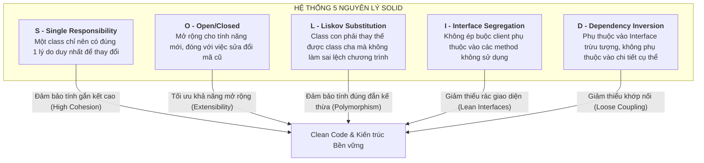
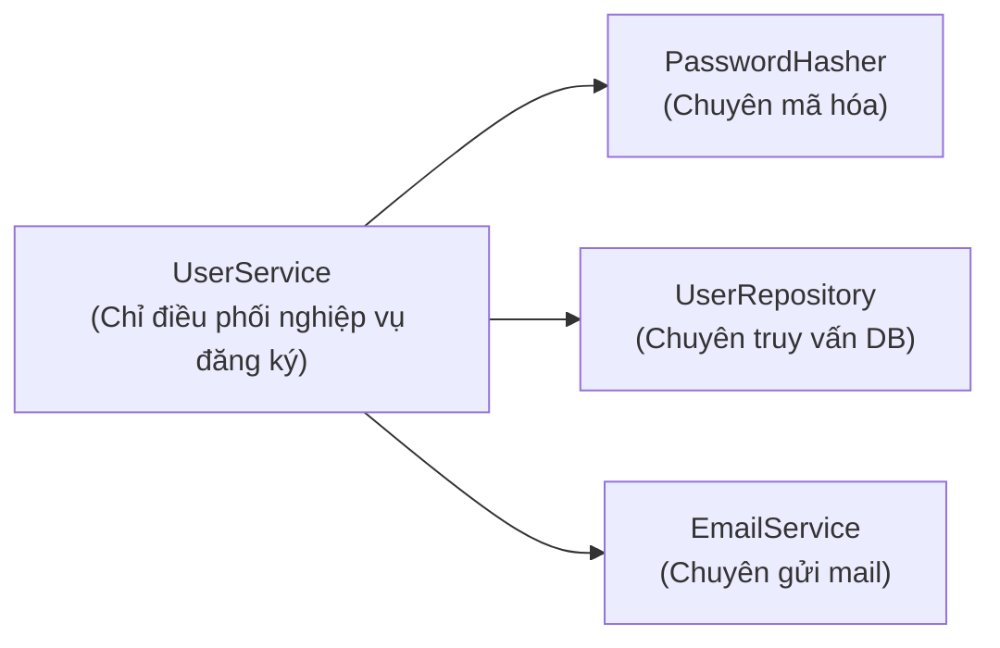
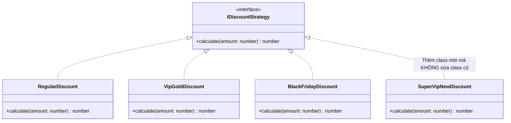
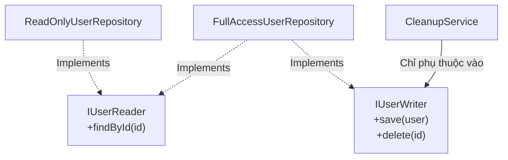
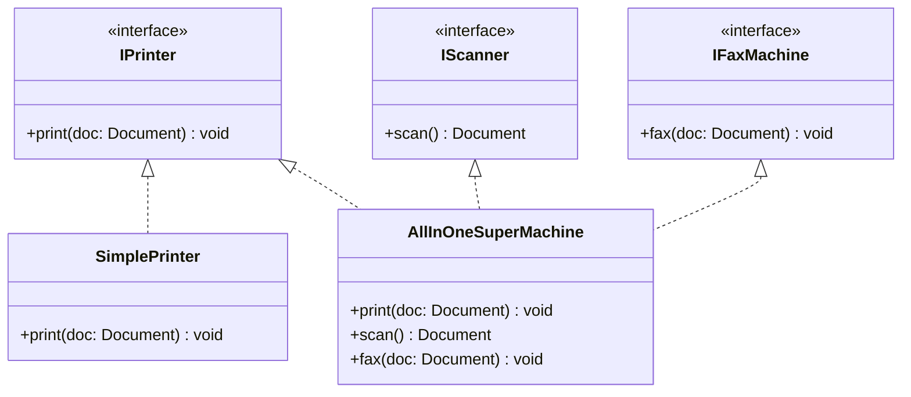
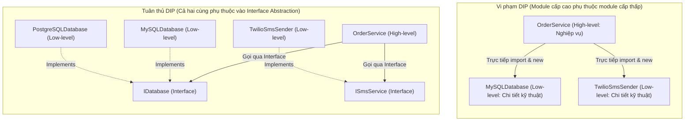

# HƯỚNG DẪN CHUYÊN SÂU VỀ 5 NGUYÊN LÝ SOLID TRONG THIẾT KẾ BACKEND

## Lời mở đầu

Trong quá trình phát triển phần mềm, giai đoạn đầu của một dự án thường diễn ra rất nhanh và thuận lợi. Tuy nhiên, sau vài tháng hoặc vài năm, khi mã nguồn phình to và các yêu cầu nghiệp vụ liên tục thay đổi, dự án thường rơi vào trạng thái "thối rữa" (Software Rot):
- **Tính mong manh (Fragility):** Sửa một lỗi ở module A lại làm hỏng một tính năng không liên quan ở module B.
- **Tính cứng nhắc (Rigidity):** Rất khó thay đổi hoặc thêm tính năng mới vì một thay đổi nhỏ kéo theo hàng loạt sửa đổi ở các class khác.
- **Tính bất động (Immobility):** Không thể tái sử dụng một đoạn code vì nó bị dính chặt (tightly coupled) với quá nhiều phụ thuộc xung quanh.

Để giải quyết tận gốc những vấn đề này, **Robert C. Martin (Uncle Bob)** đã tổng hợp và chuẩn hóa **5 nguyên lý thiết kế hướng đối tượng**, viết tắt là **SOLID**. Đây là nền tảng cốt lõi của mọi kiến trúc phần mềm hiện đại (Clean Architecture, Domain-Driven Design, Microservices).

Tài liệu này phân tích chuyên sâu từng nguyên lý: định nghĩa bản chất, phân tích các lỗi vi phạm kinh điển (Anti-patterns), mã nguồn so sánh trước và sau khi tối ưu (TypeScript/Node.js), cùng sơ đồ Mermaid trực quan.

---

## Mục lục

- [Tổng quan 5 nguyên lý SOLID](#tổng-quan-5-nguyên-lý-solid)
- [1. S - Single Responsibility Principle (Nguyên lý Đơn trách nhiệm)](#1-s---single-responsibility-principle-nguyên-lý-đơn-trách-nhiệm)
- [2. O - Open/Closed Principle (Nguyên lý Đóng/Mở)](#2-o---openclosed-principle-nguyên-lý-đóngmở)
- [3. L - Liskov Substitution Principle (Nguyên lý Thay thế Liskov)](#3-l---liskov-substitution-principle-nguyên-lý-thay-thế-liskov)
- [4. I - Interface Segregation Principle (Nguyên lý Phân tách Interface)](#4-i---interface-segregation-principle-nguyên-lý-phân-tách-interface)
- [5. D - Dependency Inversion Principle (Nguyên lý Đảo ngược Phụ thuộc)](#5-d---dependency-inversion-principle-nguyên-lý-đảo-ngược-phụ-thuộc)
- [Tổng kết & Checklist Code Review SOLID](#tổng-kết--checklist-code-review-solid)

---

# Tổng quan 5 nguyên lý SOLID



---

# 1. S - Single Responsibility Principle (Nguyên lý Đơn trách nhiệm)

> *"A class should have one, and only one, reason to change."*  
> *(Một class chỉ nên có một, và duy nhất một, lý do để thay đổi.)*

## 1.1. Bản chất cốt lõi
"Lý do để thay đổi" ở đây thực chất ám chỉ **một tác nhân (Actor / Stakeholder)** cụ thể. Nếu một class phục vụ cho nhiều đối tượng người dùng hoặc phòng ban khác nhau (ví dụ: vừa phục vụ Kế toán tính lương, vừa phục vụ IT kết nối Database, vừa phục vụ Marketing gửi email), class đó có nhiều hơn một lý do để thay đổi và vi phạm SRP.

Khi một class ôm đồm quá nhiều trách nhiệm (thường gọi là **God Object** hay **Fat Class**):
1. Rất khó đọc và hiểu toàn bộ logic.
2. Khi sửa đổi logic cho tính năng A, nguy cơ cao làm phát sinh lỗi ngoài ý muốn ở tính năng B.
3. Rất khó viết Unit Test độc lập.

## 1.2. Ví dụ thực tế

### ❌ Mã nguồn VI PHẠM SRP (God Class)
```typescript
// KHÔNG AN TOÀN: Class này có tới 4 lý do để thay đổi!
export class UserService {
  // Lý do 1: Thay đổi thuật toán băm mật khẩu (Security team)
  hashPassword(password: string): string {
    return `hashed_${password}_salt123`;
  }

  // Lý do 2: Thay đổi cấu trúc truy vấn DB / đổi ORM (DBA team)
  async saveUserToDatabase(user: any) {
    const db = await connectPostgres();
    await db.query('INSERT INTO users VALUES (...)', [user]);
  }

  // Lý do 3: Thay đổi nhà cung cấp gửi email / mẫu email (Marketing team)
  async sendWelcomeEmail(email: string) {
    const mailer = new SmtpClient();
    await mailer.send(email, 'Chào mừng!', 'Nội dung email...');
  }

  // Lý do 4: Thay đổi logic đăng ký tài khoản (Product Manager)
  async register(dto: any) {
    const passwordHash = this.hashPassword(dto.password);
    const user = { ...dto, password: passwordHash };
    await this.saveUserToDatabase(user);
    await this.sendWelcomeEmail(user.email);
    return user;
  }
}
```

### ✅ Mã nguồn TÁI CẤU TRÚC TUÂN THỦ SRP
Tách biệt từng trách nhiệm riêng rẽ cho các class chuyên trách:



```typescript
// 1. Chuyên gia băm mật khẩu
@Injectable()
export class PasswordHasher {
  async hash(plain: string): Promise<string> {
    return bcrypt.hash(plain, 10);
  }
}

// 2. Chuyên gia lưu trữ dữ liệu
@Injectable()
export class UserRepository {
  constructor(private readonly prisma: PrismaClient) {}
  async save(user: CreateUserDto) {
    return this.prisma.user.create({ data: user });
  }
}

// 3. Chuyên gia giao tiếp email
@Injectable()
export class EmailService {
  async sendWelcome(to: string) {
    // Gọi SendGrid/SES SDK...
  }
}

// 4. Service điều phối nghiệp vụ duy nhất: Đăng ký người dùng
@Injectable()
export class UserService {
  constructor(
    private readonly hasher: PasswordHasher,
    private readonly userRepo: UserRepository,
    private readonly emailService: EmailService,
  ) {}

  async register(dto: RegisterDto) {
    const hashedPassword = await this.hasher.hash(dto.password);
    const user = await this.userRepo.save({ ...dto, password: hashedPassword });
    await this.emailService.sendWelcome(user.email);
    return user;
  }
}
```

---

# 2. O - Open/Closed Principle (Nguyên lý Đóng/Mở)

> *"Software entities (classes, modules, functions, etc.) should be open for extension, but closed for modification."*  
> *(Các thực thể phần mềm nên mở rộng cho việc phát triển tính năng mới, nhưng đóng với việc sửa đổi mã nguồn sẵn có.)*

## 2.1. Bản chất cốt lõi
- **Open for extension (Mở cho mở rộng):** Khi yêu cầu nghiệp vụ mới xuất hiện, ta có thể bổ sung hành vi mới cho hệ thống.
- **Closed for modification (Đóng cho sửa đổi):** Việc thêm hành vi mới không được phép can thiệp hoặc sửa đổi mã nguồn của các class cũ đã chạy ổn định và đã được kiểm thử trên production.

Cách tốt nhất để đạt được OCP là dựa vào **Tính đa hình (Polymorphism)** và **Tính trừu tượng (Abstraction / Interfaces)**.

## 2.2. Ví dụ thực tế: Hệ thống tính toán chiết khấu đơn hàng

### ❌ Mã nguồn VI PHẠM OCP (Switch-case phình to)
Mỗi lần công ty có thêm một chương trình khuyến mãi mới (ví dụ: khuyến mãi Black Friday, thẻ VIP Silver), lập trình viên buộc phải nhảy vào class `DiscountCalculator` để thêm nhánh `case` mới. Hành vi này có thể vô tình làm hỏng công thức tính của các gói cũ.

```typescript
// KHÔNG AN TOÀN: Vi phạm OCP
export class DiscountCalculator {
  calculateDiscount(orderAmount: number, customerType: string): number {
    if (customerType === 'REGULAR') {
      return orderAmount * 0.05; // Giảm 5%
    } else if (customerType === 'VIP_GOLD') {
      return orderAmount * 0.15; // Giảm 15%
    } else if (customerType === 'VIP_DIAMOND') {
      return orderAmount * 0.25; // Giảm 25%
    } else if (customerType === 'BLACK_FRIDAY') {
      return orderAmount * 0.40; // Giảm 40%
    }
    return 0;
  }
}
```

### ✅ Mã nguồn TÁI CẤU TRÚC TUÂN THỦ OCP (Áp dụng Strategy Pattern)



```typescript
// 1. Interface trừu tượng (Contract)
export interface IDiscountStrategy {
  calculate(amount: number): number;
}

// 2. Từng chiến lược giảm giá riêng biệt
export class RegularDiscountStrategy implements IDiscountStrategy {
  calculate(amount: number): number {
    return amount * 0.05;
  }
}

export class VipGoldDiscountStrategy implements IDiscountStrategy {
  calculate(amount: number): number {
    return amount * 0.15;
  }
}

// 3. Khi có yêu cầu mới (Black Friday / Tết): CHỈ CẦN TẠO FILE MỚI, KHÔNG SỬA CODE CŨ!
export class BlackFridayDiscountStrategy implements IDiscountStrategy {
  calculate(amount: number): number {
    return amount * 0.40;
  }
}

// 4. Class sử dụng hoàn toàn đóng với các thay đổi
export class OrderService {
  processOrder(amount: number, discountStrategy: IDiscountStrategy) {
    const discount = discountStrategy.calculate(amount);
    const finalAmount = amount - discount;
    return finalAmount;
  }
}
```

---

# 3. L - Liskov Substitution Principle (Nguyên lý Thay thế Liskov)

> *"Functions that use pointers or references to base classes must be able to use objects of derived classes without knowing it."*  
> *(Các hàm sử dụng con trỏ hoặc tham chiếu đến lớp cha phải có thể sử dụng các đối tượng của lớp con mà không cần biết và không làm thay đổi tính đúng đắn của chương trình — Barbara Liskov, 1987.)*

## 3.1. Bản chất cốt lõi
Nếu Class `B` là con của Class `A`, thì ở bất kỳ vị trí nào trong mã nguồn đang nhận tham số kiểu `A`, ta đều có thể truyền một instance của `B` vào mà chương trình vẫn hoạt động đúng như mong đợi, **không phát sinh Exception bất thường hay hành vi kì dị**.

### Các dấu hiệu vi phạm LSP phổ biến:
1. **Class con ghi đè phương thức bằng cách ném ra ngoại lệ:** `throw new UnsupportedOperationException()`.
2. **Class con có phương thức rỗng:** Không làm gì cả (Empty implementation).
3. **Class con làm yếu đi điều kiện tiên quyết (Preconditions) hoặc làm mạnh hơn điều kiện đầu ra (Postconditions)** so với lớp cha.
4. Client phải dùng `instanceof` hoặc ép kiểu (casting) để kiểm tra xem đang làm việc với class con nào.

## 3.2. Ví dụ thực tế

### ❌ Mã nguồn VI PHẠM LSP: Lỗi Read-Only Repository
Một `ReadOnlyUserRepository` kế thừa từ `UserRepository` nhưng lại quăng lỗi ở phương thức `delete()` hoặc `save()`:

```typescript
export class BaseUserRepository {
  async findById(id: string): Promise<User> { /* Query DB */ return {} as any; }
  async save(user: User): Promise<void> { /* Ghi DB */ }
  async delete(id: string): Promise<void> { /* Xóa DB */ }
}

// Class con vi phạm LSP
export class ReadOnlyUserRepository extends BaseUserRepository {
  async delete(id: string): Promise<void> {
    // VI PHẠM: Phá vỡ hợp đồng của lớp cha!
    throw new Error('Tài khoản này chỉ có quyền đọc, không được xóa!');
  }
}

// Một hàm bên ngoài tin tưởng vào BaseUserRepository
async function cleanupInactiveUsers(repo: BaseUserRepository, inactiveIds: string[]) {
  for (const id of inactiveIds) {
    // Nếu ai đó truyền ReadOnlyUserRepository vào đây -> Hệ thống crash!
    await repo.delete(id);
  }
}
```

### ✅ Mã nguồn TÁI CẤU TRÚC TUÂN THỦ LSP
Tách các giao diện theo đúng năng lực (kết hợp với ISP):



```typescript
export interface IUserReader {
  findById(id: string): Promise<User | null>;
}

export interface IUserWriter {
  save(user: User): Promise<void>;
  delete(id: string): Promise<void>;
}

// 1. Class chỉ có quyền đọc: Chỉ implements IUserReader
export class ReadOnlyUserRepository implements IUserReader {
  async findById(id: string): Promise<User | null> {
    // Chỉ đọc dữ liệu từ DB replica...
    return null;
  }
}

// 2. Class có toàn quyền: Implements cả 2 interface
export class FullAccessUserRepository implements IUserReader, IUserWriter {
  async findById(id: string): Promise<User | null> { return null; }
  async save(user: User): Promise<void> {}
  async delete(id: string): Promise<void> {}
}

// Hàm dọn dẹp chỉ yêu cầu IUserWriter -> Không bao giờ nhận nhầm ReadOnly repo!
export async function cleanupUsers(writer: IUserWriter, userIds: string[]) {
  for (const id of userIds) {
    await writer.delete(id);
  }
}
```

---

# 4. I - Interface Segregation Principle (Nguyên lý Phân tách Interface)

> *"Clients should not be forced to depend upon interfaces that they do not use."*  
> *(Các client không nên bị ép buộc phải phụ thuộc vào các interface mà chúng không sử dụng.)*

## 4.1. Bản chất cốt lõi
Một **Interface quá lớn (Fat Interface / Polluted Interface)** với hàng chục method khác nhau sẽ ép các class thực thi phải triển khai cả những phương thức vô nghĩa đối với chúng.

**Giải pháp:** Thay vì tạo ra một Interface "vạn năng" khổng lồ, hãy chia nhỏ nó thành nhiều **Role Interfaces (Interface theo vai trò)** hẹp và chuyên biệt.

## 4.2. Ví dụ thực tế

### ❌ Mã nguồn VI PHẠM ISP: Fat Interface
```typescript
// KHÔNG AN TOÀN: Interface quá ôm đồm
export interface IDocumentManager {
  readDocument(): void;
  writeDocument(content: string): void;
  printDocument(): void;
  faxDocument(): void;
  scanDocument(): void;
}

// Một class thiết bị đơn giản bị ép phải triển khai các hàm không hỗ trợ
export class SimplePrinter implements IDocumentManager {
  readDocument(): void { /* ... */ }
  printDocument(): void { console.log('In tài liệu'); }

  // Các hàm bị ép buộc vô lý:
  writeDocument(): void { throw new Error('Máy in không thể viết!'); }
  faxDocument(): void { throw new Error('Máy in không có fax!'); }
  scanDocument(): void { throw new Error('Máy in không có máy quét!'); }
}
```

### ✅ Mã nguồn TÁI CẤU TRÚC TUÂN THỦ ISP



```typescript
// Chia nhỏ thành các Interface chuyên biệt
export interface IPrinter {
  print(doc: string): void;
}

export interface IScanner {
  scan(): string;
}

export interface IFax {
  fax(doc: string): void;
}

// 1. Máy in cơ bản chỉ cần implements IPrinter
export class BasicPrinter implements IPrinter {
  print(doc: string): void {
    console.log(`Đang in: ${doc}`);
  }
}

// 2. Máy in đa năng văn phòng (Photocopy) implements nhiều interface
export class MultiFunctionPrinter implements IPrinter, IScanner, IFax {
  print(doc: string): void { console.log('In tài liệu...'); }
  scan(): string { return 'Nội dung scan'; }
  fax(doc: string): void { console.log('Gửi fax...'); }
}
```

---

# 5. D - Dependency Inversion Principle (Nguyên lý Đảo ngược Phụ thuộc)

> *1. "High-level modules should not depend on low-level modules. Both should depend on abstractions."*  
> *(Các module cấp cao không nên phụ thuộc vào các module cấp thấp. Cả hai nên phụ thuộc vào các abstractions/interfaces.)*  
> *2. "Abstractions should not depend on details. Details should depend on abstractions."*  
> *(Các abstractions không nên phụ thuộc vào chi tiết. Chi tiết cụ thể phải phụ thuộc vào abstractions.)*

## 5.1. Phân biệt 3 khái niệm dễ nhầm lẫn
1. **Dependency Inversion Principle (DIP):** Nguyên lý kiến trúc cốt lõi (Mục tiêu thiết kế: Module cấp cao và cấp thấp giao tiếp qua Interface).
2. **Inversion of Control (IoC):** Khuôn mẫu thiết kế thực hiện việc đảo ngược luồng điều khiển (Ví dụ: Framework gọi code của bạn, thay vì code của bạn gọi framework).
3. **Dependency Injection (DI):** Kỹ thuật cụ thể để truyền các dependency (qua constructor, setter) vào class từ bên ngoài thay vì class tự `new`.

## 5.2. Ví dụ thực tế



### ❌ Mã nguồn VI PHẠM DIP
```typescript
// Low-level Module: Giao tiếp trực tiếp với MySQL
export class MySQLConnection {
  insert(table: string, data: any) {
    console.log(`INSERT INTO ${table} VALUES (...)`);
  }
}

// Low-level Module: Gửi SMS qua Twilio SDK
export class TwilioService {
  sendSMS(phone: string, text: string) {
    console.log(`Gửi SMS qua Twilio tới ${phone}`);
  }
}

// High-level Module (Chứa nghiệp vụ đặt hàng quan trọng) lại đi phụ thuộc trực tiếp vào 2 class cấp thấp!
export class OrderService {
  private db = new MySQLConnection();     // Dính chặt vào MySQL
  private sms = new TwilioService();      // Dính chặt vào Twilio

  createOrder(order: any, phone: string) {
    this.db.insert('orders', order);
    this.sms.sendSMS(phone, 'Đơn hàng thành công');
  }
}
```

### ✅ Mã nguồn TÁI CẤU TRÚC TUÂN THỦ DIP
```typescript
// 1. Abstractions (Interfaces)
export interface IDatabase {
  save(entityName: string, data: any): Promise<void>;
}

export interface INotificationService {
  notify(recipient: string, message: string): Promise<void>;
}

// 2. High-level Module chỉ phụ thuộc vào Abstractions
@Injectable()
export class OrderService {
  constructor(
    @Inject('IDatabase') private readonly db: IDatabase,
    @Inject('INotificationService') private readonly notifier: INotificationService,
  ) {}

  async createOrder(order: any, phone: string) {
    await this.db.save('orders', order);
    await this.notifier.notify(phone, 'Đơn hàng đã được tạo thành công!');
  }
}

// 3. Low-level Modules implements Abstractions
@Injectable()
export class PostgresDatabase implements IDatabase {
  async save(entityName: string, data: any): Promise<void> {
    console.log(`[PostgreSQL] Lưu bản ghi vào bảng ${entityName}`);
  }
}

@Injectable()
export class TelegramNotificationService implements INotificationService {
  async notify(recipient: string, message: string): Promise<void> {
    console.log(`[Telegram Bot] Gửi tin nhắn tới chat_id ${recipient}: ${message}`);
  }
}
```

---

# Tổng kết & Checklist Code Review SOLID

### Bảng tóm tắt 5 nguyên lý
| Nguyên lý | Tóm tắt ý nghĩa cốt lõi | Dấu hiệu nhận biết vi phạm (Code Smells) | Giải pháp thiết kế |
|---|---|---|---|
| **S - Single Responsibility** | Mỗi class chỉ làm 1 việc duy nhất và chỉ có 1 lý do để thay đổi. | File dài hàng nghìn dòng, class tên quá chung chung (`Manager`, `Util`, `Helper`), import quá nhiều thư viện khác nhau. | Tách nhỏ thành các service, repository, helper chuyên biệt. |
| **O - Open/Closed** | Mở rộng tính năng bằng cách viết thêm code, không sửa code cũ. | Khối lệnh `if-else` hoặc `switch-case` kiểm tra loại đối tượng (Type checking) lặp lại ở nhiều nơi. | Áp dụng Polymorphism, Strategy Pattern, Factory Pattern. |
| **L - Liskov Substitution** | Class con phải thay thế được class cha mà không làm hỏng logic. | Class con quăng `UnsupportedException`, method con để rỗng, dùng `instanceof` để ép kiểu. | Tách Interface nhỏ hơn, thay thế quan hệ kế thừa (Inheritance) bằng Composition. |
| **I - Interface Segregation** | Chia nhỏ Interface theo từng vai trò, tránh Fat Interface. | Class bị ép phải implements những hàm vô nghĩa hoặc ném lỗi "Not implemented". | Phân rã Interface lớn thành nhiều Role Interfaces nhỏ gọn. |
| **D - Dependency Inversion** | Phụ thuộc vào Interface trừu tượng, không phụ thuộc class cụ thể. | Dùng từ khóa `new ClassName()` trực tiếp bên trong class nghiệp vụ. | Dùng Dependency Injection (DI) và Constructor Injection. |

### Checklist nhanh cho Pull Request / Code Review
- [ ] Class này có đang làm nhiều hơn một nhiệm vụ không? (Ví dụ: vừa query DB vừa gửi mail).
- [ ] Khi thêm một loại người dùng/phương thức thanh toán mới, tôi có phải sửa class hiện tại không?
- [ ] Class con có ghi đè method cha bằng cách ném ra lỗi hoặc để trống không?
- [ ] Có interface nào chứa các phương thức mà một số class implements không hề sử dụng không?
- [ ] Module nghiệp vụ (Service) có đang trực tiếp khởi tạo (`new`) các kết nối database hoặc SDK bên ngoài không?
