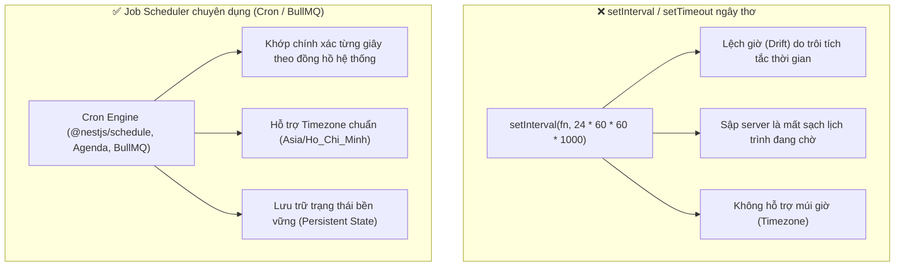
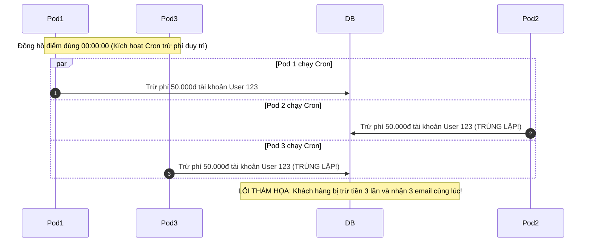
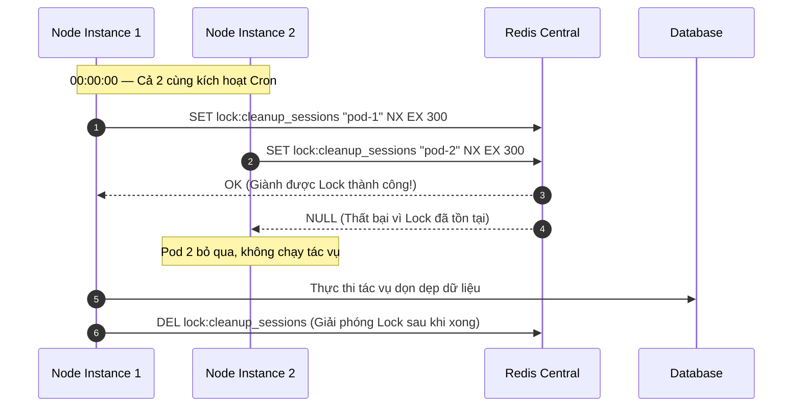
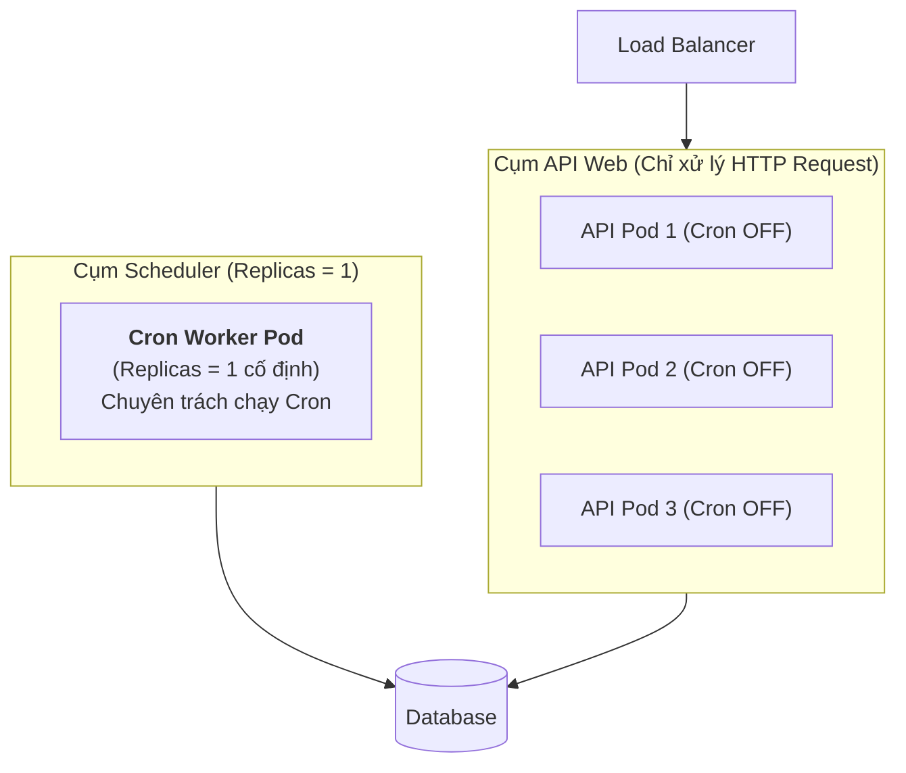
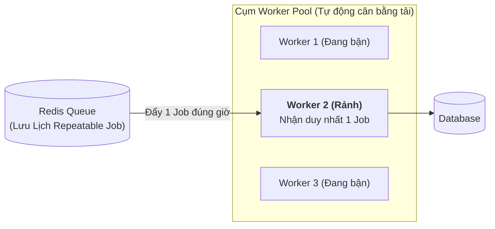

# ĐẶC TẢ CHUYÊN SÂU: TASK SCHEDULING VÀ CRON JOB PHÂN TÁN TRONG BACKEND

## Lời mở đầu

Trong kiến trúc Backend, không phải mọi tác vụ đều bắt nguồn từ tương tác trực tiếp của người dùng qua API HTTP. Rất nhiều tác vụ trọng yếu phải chạy **tự động theo lịch trình hoặc định kỳ (Task Scheduling / Cron Job)** — ví dụ: đối soát giao dịch ngân hàng lúc nửa đêm, gửi email nhắc hẹn vào 08:00 sáng, dọn dẹp session hết hạn, hoặc tính toán báo cáo tài chính hàng tuần.

Tuy nhiên, khi hệ thống mở rộng từ 1 máy chủ (Single Instance) lên cụm phân tán nhiều máy chủ (Multi-instance / Kubernetes Pods), Cron Job trở thành một bài toán kiến trúc hóc búa: **Làm sao để một tác vụ định kỳ chỉ chạy ĐÚNG 1 LẦN duy nhất trong toàn cụm mà không bị thực thi trùng lặp (Duplicate Execution)?**

Tài liệu này đặc tả toàn diện bản chất của Task Scheduling, giải quyết bài toán Cron Job phân tán với Distributed Lock, mô hình Dynamic Scheduling với BullMQ, và hướng dẫn triển khai chuẩn production trong NestJS.

---

## 1. Bản chất kỹ thuật của Task Scheduling & Cron Expression

### 1.1. In-memory Timers vs Job Scheduler chuyên dụng



### 1.2. Cấu trúc chuẩn của một biểu thức Cron (Cron Expression)

Biểu thức Cron gồm 5 hoặc 6 trường ngăn cách bởi dấu cách, đại diện cho thời điểm kích hoạt:

```text
 ┌────────────── giây (tùy chọn trong NestJS / node-cron: 0-59)
 │ ┌──────────── phút (0-59)
 │ │ ┌────────── giờ (0-23)
 │ │ │ ┌──────── ngày trong tháng (1-31)
 │ │ │ │ ┌────── tháng (1-12 hoặc JAN-DEC)
 │ │ │ │ │ ┌──── ngày trong tuần (0-7: 0 & 7 = Chủ Nhật, 1 = Thứ Hai)
 │ │ │ │ │ │
 * * * * * *
```

| Ký tự đặc biệt | Ý nghĩa | Ví dụ biểu thức | Giải thích |
|:---|:---|:---|:---|
| `*` | Mọi giá trị hợp lệ | `0 * * * *` | Chạy vào phút thứ 0 của mỗi giờ (1:00, 2:00...) |
| `,` | Danh sách giá trị | `0 0 8,12,18 * * *` | Chạy vào đúng 08:00, 12:00 và 18:00 mỗi ngày |
| `-` | Khoảng giá trị liên tục | `0 0 9-17 * * 1-5` | Chạy mỗi giờ một lần từ 9h đến 17h, từ Thứ 2 đến Thứ 6 |
| `/` | Bước nhảy (Step) | `0 */15 * * * *` | Chạy mỗi 15 phút một lần (`:00`, `:15`, `:30`, `:45`) |
| `0 0 0 1 * *` | Ngày đầu tháng | `0 0 0 1 * *` | Chạy vào đúng 00:00:00 ngày đầu tiên của mỗi tháng |

---

## 2. "Cơn ác mộng" Cron Job trên cụm Multi-Instance (Horizontal Scaling)

### 2.1. Hiện tượng thực thi trùng lặp (Duplicate Execution)

Khi ứng dụng backend được triển khai trên Kubernetes hoặc đứng sau Load Balancer với **5 Pod / Instances** chạy song song cùng một codebase:



- Mỗi instance đều có một bộ đếm giờ riêng trong tiến trình Node.js của nó. Khi đến đúng 00:00, **cả 5 instance đều đồng loạt kích hoạt cùng một hàm cron**.
- Hậu quả: Gửi 5 email trùng lặp, trừ tiền nhiều lần, hoặc gây tắc nghẽn database do 5 máy cùng quét toàn bộ bảng một lúc.

---

## 3. Các giải pháp kiến trúc cho Cron Job phân tán

### Giải pháp 1: Distributed Lock với Redis (Redlock / SETNX) — Phổ biến & Hiệu quả nhất

Trước khi chạy tác vụ, instance phải cố gắng "giành" một chiếc khóa độc quyền trên Redis. Instance nào giành được khóa đầu tiên sẽ được thực thi; các instance khác giành khóa thất bại sẽ bỏ qua lượt chạy đó.



- `NX` (Not Exists): Chỉ ghi nếu key chưa tồn tại.
- `EX 300` (TTL 300s): Đảm bảo tự động giải phóng khóa sau 5 phút phòng trường hợp Pod 1 bị crash giữa chừng, tránh deadlock vĩnh viễn.

---

### Giải pháp 2: Dedicated Worker Pod (Tách riêng Worker chuyên trách)

Tách riêng 1 container duy nhất trong cụm chỉ cấu hình nạp module Schedule, các container phục vụ API (Web Pods) hoàn toàn tắt tính năng Cron.



- **Ưu điểm:** Đơn giản, không cần cấu hình Distributed Lock.
- **Nhược điểm:** Điểm lỗi đơn lẻ (Single Point of Failure - SPOF). Nếu Pod Cron duy nhất này chết và chưa kịp khởi động lại vào đúng 00:00, tác vụ ngày hôm đó sẽ bị bỏ lỡ.

---

### Giải pháp 3: Message Queue Repeatable Jobs (BullMQ Scheduler) — Chuẩn Enterprise

Sử dụng BullMQ kết hợp Redis: Lịch biểu Cron không gắn vào code của từng server mà được đăng ký trực tiếp vào **Redis Queue dưới dạng Repeatable Job**. 
- Redis quản lý thời gian chính xác.
- Khi đến giờ, Redis đẩy 1 Job duy nhất vào Queue.
- Trong 10 worker pods, **chỉ có duy nhất 1 worker rảnh rỗi nhận job về xử lý**, các worker khác vẫn làm việc khác.



---

## 4. Dynamic Task Scheduling (Lên lịch động theo yêu cầu nghiệp vụ)

Khác với Cron Job cố định (Static Cron: chạy mỗi đêm), **Dynamic Scheduling** là bài toán lên lịch theo dữ liệu phát sinh của người dùng lúc runtime:
- *Ví dụ 1:* Khách hàng đặt mua vé máy bay lúc 14:00 $\rightarrow$ Lên lịch hủy vé nếu chưa thanh toán sau **đúng 15 phút** (vào lúc 14:15).
- *Ví dụ 2:* Nhắc nhở người dùng hoàn tất khảo sát sau **đúng 3 ngày** kể từ khi đăng ký tài khoản.

### Triển khai Dynamic Delay với BullMQ:

```typescript
// appointment.service.ts
import { Injectable } from '@nestjs/common';
import { InjectQueue } from '@nestjs/bullmq';
import { Queue } from 'bullmq';

@Injectable()
export class AppointmentService {
  constructor(@InjectQueue('reminder-queue') private reminderQueue: Queue) {}

  async scheduleReminder(appointmentId: string, appointmentTime: Date) {
    // Tính toán thời gian cần delay (gửi trước giờ hẹn 2 tiếng)
    const reminderTime = appointmentTime.getTime() - (2 * 60 * 60 * 1000);
    const delayMs = reminderTime - Date.now();

    if (delayMs > 0) {
      await this.reminderQueue.add(
        'send-reminder',
        { appointmentId },
        {
          delay: delayMs, // Trì hoãn thực thi chính xác đến thời điểm mong muốn
          jobId: `reminder:${appointmentId}`, // Định danh để có thể hủy nếu lịch bị dời
          removeOnComplete: true,
        },
      );
    }
  }

  async cancelReminder(appointmentId: string) {
    // Cho phép hủy lịch động nếu khách hàng hủy lịch hẹn
    const job = await this.reminderQueue.getJob(`reminder:${appointmentId}`);
    if (job) {
      await job.remove();
    }
  }
}
```

---

## 5. Triển khai thực tế trong NestJS: Static Cron kết hợp Redis Lock

```typescript
// cleanup.task.ts
import { Injectable, Logger } from '@nestjs/common';
import { Cron, CronExpression } from '@nestjs/schedule';
import { InjectRedis } from '@nestjs-modules/ioredis';
import Redis from 'ioredis';

@Injectable()
export class DataCleanupTask {
  private readonly logger = new Logger(DataCleanupTask.name);

  constructor(@InjectRedis() private readonly redis: Redis) {}

  @Cron(CronExpression.EVERY_DAY_AT_MIDNIGHT, {
    timeZone: 'Asia/Ho_Chi_Minh',
  })
  async handleNightlyCleanup() {
    const lockKey = 'locks:cron:nightly_cleanup';
    const lockTTLSeconds = 60 * 10; // 10 phút
    const instanceId = `pod_${process.env.HOSTNAME || Math.random().toString(36).substring(7)}`;

    // 1. Thử giành Distributed Lock (chỉ 1 instance trong cụm thành công)
    const acquired = await this.redis.set(
      lockKey,
      instanceId,
      'EX',
      lockTTLSeconds,
      'NX',
    );

    if (!acquired) {
      this.logger.log(`[Cron] Instance khác đã nhận quyền thực thi. Bỏ qua.`);
      return;
    }

    try {
      this.logger.log(`[Cron] Giành khóa thành công bởi ${instanceId}. Bắt đầu xử lý...`);
      
      // 2. Thực thi logic nghiệp vụ nặng
      await this.performHeavyCleanup();

      this.logger.log(`[Cron] Hoàn thành dọn dẹp dữ liệu.`);
    } catch (error) {
      this.logger.error(`[Cron] Lỗi khi xử lý: ${error.message}`, error.stack);
    } finally {
      // 3. Giải phóng lock an toàn nếu instance này sở hữu lock
      const currentHolder = await this.redis.get(lockKey);
      if (currentHolder === instanceId) {
        await this.redis.del(lockKey);
      }
    }
  }

  private async performHeavyCleanup() {
    // Xóa session hết hạn, nén log cũ...
    await new Promise((resolve) => setTimeout(resolve, 3000));
  }
}
```

---

## 6. Bảng so sánh các giải pháp Task Scheduling

| Tiêu chí | Native `node-cron` / `@nestjs/schedule` | Redis Distributed Lock + Cron | BullMQ Repeatable / Delayed Jobs | Temporal / Camunda Workflow |
|---|---|---|---|---|
| **Môi trường phù hợp** | Single instance (1 máy chủ đơn lẻ). | Cụm Multi-instance vừa & nhỏ. | Cụm Multi-instance lớn, hệ thống phân tán. | Hệ thống Microservices quy mô Enterprise phức tạp. |
| **Xử lý Multi-Instance** | ❌ Bị chạy trùng lặp trên mọi Pod. | ✅ An toàn (chỉ 1 Pod chạy). | ✅ Tự động phân phối 1 Job cho Worker rảnh. | ✅ Quản lý trạng thái và điều phối tuyệt đối. |
| **Lên lịch động (Dynamic)** | Rất khó quản lý. | Khó quản lý. | **Cực tốt (Delayed Jobs).** | **Rất mạnh (Hỗ trợ Workflow kéo dài nhiều tháng).** |
| **Giao diện Dashboard** | Không có. | Không có (phải tự viết). | Có sẵn (Bull-Board trực quan). | Có sẵn Web UI chi tiết từng bước. |
| **Độ phức tạp cài đặt** | Cực thấp (Chỉ cần npm install). | Thấp (Cần thêm Redis client). | Trung bình (Cần Redis Server). | Cao (Cần dựng cụm Temporal Cluster). |

---

## Tổng kết

1. **Không bao giờ dùng Cron mặc định trên cụm Multi-instance** mà không có cơ chế kiểm soát tranh chấp — nguy cơ trùng lặp dữ liệu là $100\%$.
2. Sử dụng **Redis Lock (`SETNX`)** cho các tác vụ định kỳ cố định đơn giản (Static Cron).
3. Sử dụng **Message Queue (BullMQ Repeatable / Delayed Jobs)** cho các hệ thống mở rộng, tác vụ nặng cần retry, hoặc bài toán lên lịch động theo tương tác của người dùng.
