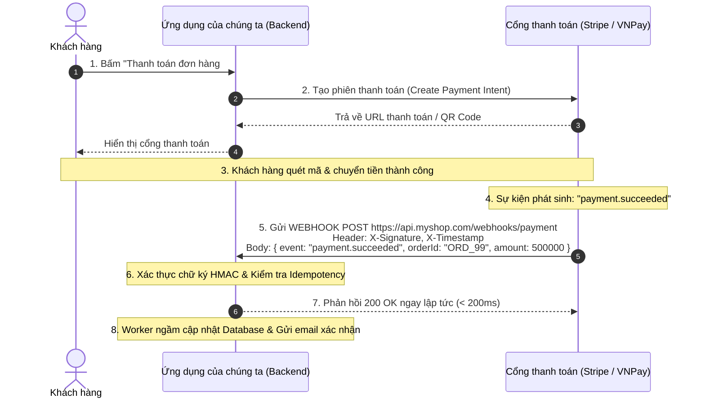
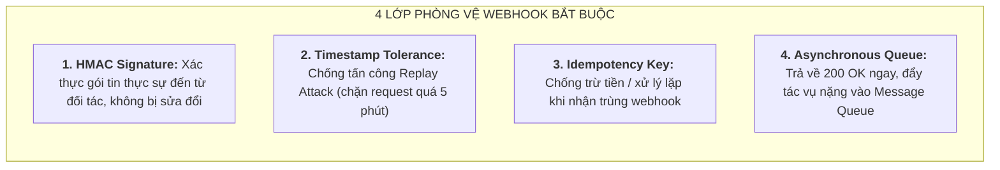
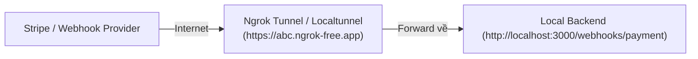

# HƯỚNG DẪN CHUYÊN SÂU VỀ WEBHOOK TRONG PHÁT TRIỂN BACKEND

## Lời mở đầu

Trong kiến trúc tích hợp hệ thống hiện đại, nhu cầu đồng bộ dữ liệu theo thời gian thực (Real-time data synchronization) giữa các nền tảng độc lập là vô cùng cấp thiết. 

Truyền thống trước đây thường sử dụng cơ chế **Polling (Hỏi thăm định kỳ)**: Ứng dụng client liên tục gửi request HTTP mỗi vài giây để hỏi server: *"Đơn hàng này đã thanh toán chưa?"*, *"Có tin nhắn mới không?"*. Cách làm này cực kỳ lãng phí tài nguyên CPU, băng thông mạng và gây độ trễ lớn.

**Webhook (hay còn gọi là Reverse API / HTTP Push)** ra đời để thay đổi hoàn toàn cục diện: Thay vì bên nhận phải liên tục "kéo" (Pull) dữ liệu, bên phát sinh sự kiện sẽ chủ động **"đẩy" (Push) dữ liệu qua một HTTP POST request** ngay khi sự kiện diễn ra.

Tài liệu này cung cấp bản đặc tả chuyên sâu và thực chiến về Webhook: từ bản chất, so sánh với Polling/WebSocket, thiết kế bảo mật HMAC Signature, xử lý tính lũy đẳng (Idempotency), kiến trúc chống Timeout với Message Queue, cho đến mã nguồn triển khai Consumer & Provider hoàn chỉnh trên NestJS.

---

## Mục lục

- [Phần I: Bản Chất Webhook & So Sánh Các Mô Hình Giao Tiếp](#phần-i-bản-chất-webhook--so-sánh-các-mô-hình-giao-tiếp)
- [Phần II: Luồng Hoạt Động & Kiến Trúc Chuẩn Của Webhook](#phần-ii-luồng-hoạt-động--kiến-trúc-chuẩn-của-webhook)
- [Phần III: 4 Trụ Cột Bảo Mật & Thách Thức Kỹ Thuật Trong Webhook](#phần-iii-4-trụ-cột-bảo-mật--thách-thức-kỹ-thuật-trong-webhook)
  - [1. Xác thực nguồn tin & Chữ ký số HMAC Signature](#1-xác-thực-nguồn-tin--chữ-ký-số-hmac-signature)
  - [2. Chống tấn công phát lại (Replay Attack) với Timestamp](#2-chống-tấn-công-phát-lại-replay-attack-với-timestamp)
  - [3. Tính Lũy Đẳng (Idempotency) & Chống trùng lặp sự kiện](#3-tính-lũy-đẳng-idempotency--chống-trùng-lặp-sự-kiện)
  - [4. Chống Timeout với Kiến Trúc Xử Lý Bất Đồng Bộ (Async Queue)](#4-chống-timeout-với-kiến-trúc-xử-lý-bất-đồng-bộ-async-queue)
- [Phần IV: Triển Khai Thực Chiến Với NestJS](#phần-iv-triển-khai-thực-chiến-với-nestjs)
  - [1. Xây dựng Webhook Consumer (Phía Nhận — Xác thực HMAC & Xử lý an toàn)](#1-xây-dựng-webhook-consumer-phía-nhận--xác-thực-hmac--xử-lý-an-toàn)
  - [2. Xây dựng Webhook Provider (Phía Gửi — Ký số & Retry với Exponential Backoff)](#2-xây-dựng-webhook-provider-phía-gửi--ký-số--retry-với-exponential-backoff)
- [Phần V: Công Cụ Kiểm Thử, Gỡ Lỗi & Best Practices Production](#phần-v-công-cụ-kiểm-thử-gỡ-lỗi--best-practices-production)

---

# Phần I: Bản Chất Webhook & So Sánh Các Mô Hình Giao Tiếp

```mermaid
flowchart TD
    subgraph POLLING["1. Short Polling (Kéo dữ liệu - Lãng phí tài nguyên)"]
        direction TB
        C1["Client Backend"] -->|"1. GET /status (Có gì mới chưa?)"| S1["Payment Gateway"]
        S1 -- "Chưa có (Pending)" --> C1
        C1 -->|"2. GET /status (Có gì mới chưa?)"| S1
        S1 -- "Chưa có (Pending)" --> C1
        C1 -->|"3. GET /status (Có gì mới chưa?)"| S1
        S1 -- "Thành công (Paid) sau 30s" --> C1
    end

    subgraph WEBHOOK["2. Webhook (Đẩy dữ liệu - Tức thì, tối ưu)"]
        direction TB
        C2["Client Backend (Lắng nghe tại /api/webhooks/payment)"]
        S2["Payment Gateway"]
        Note over S2: Khách hàng quét mã QR thanh toán thành công!
        S2 -->|"Bắn ngay lập tức: POST /api/webhooks/payment<br/>Payload: { orderId: '1001', status: 'PAID' }"| C2
        C2 -- "Trả về ngay: 200 OK" --> S2
    end
```

### Bảng so sánh Polling vs Long-Polling vs WebSocket vs Webhook

| Tiêu chí | Short Polling | Long Polling | WebSocket | Webhook |
|---|---|---|---|---|
| **Mô hình** | **Pull** (Client chủ động kéo liên tục). | **Pull** (Client gửi request, server giữ kết nối chờ). | **Bi-directional** (Giao tiếp 2 chiều toàn phần qua TCP socket). | **Push** (Server bên ngoài chủ động gọi HTTP POST sang ta). |
| **Giao thức** | HTTP/1.1 hoặc HTTP/2. | HTTP/1.1 (Keep-Alive). | WebSocket Protocol (`ws://`, `wss://`). | HTTP/HTTPS chuẩn (REST POST). |
| **Duy trì kết nối** | Đóng mở kết nối liên tục. | Giữ kết nối mở trong 30-60s. | **Duy trì kết nối liên tục** (Stateful Socket). | **Stateless** (Chỉ mở kết nối khi có sự kiện). |
| **Độ trễ (Latency)** | Cao (phụ thuộc vào chu kỳ polling, ví dụ 5-10s). | Trung bình - Thấp. | **Cực thấp** (Real-time tính bằng mili-giây). | **Rất thấp** (Gần như tức thì ngay khi sự kiện xảy ra). |
| **Mục đích sử dụng lý tưởng** | Bảng tin đơn giản, tác vụ kiểm tra trạng thái ít khi đổi. | Chat app cũ, thông báo đơn giản không dùng WS. | Ứng dụng Chat, Game trực tuyến, Bảng giá chứng khoán, Live Streaming. | **Tích hợp Server-to-Server giữa các bên thứ 3** (Stripe, GitHub, VNPay, ZaloPay, Shopify, Slack). |

---

# Phần II: Luồng Hoạt Động & Kiến Trúc Chuẩn Của Webhook



---

# Phần III: 4 Trụ Cột Bảo Mật & Thách Thức Kỹ Thuật Trong Webhook

Vì endpoint Webhook của bạn được mở công khai trên Internet để bên thứ ba gọi vào, nó là mục tiêu hàng đầu của các cuộc tấn công giả mạo dữ liệu.



---

## 1. Xác thực nguồn tin & Chữ ký số HMAC Signature

### Nguy cơ
Nếu không kiểm tra chữ ký, kẻ tấn công có thể tự gửi một request `POST /webhooks/payment` với body giả mạo `{ "orderId": "ORD_99", "status": "SUCCESS" }` để chiếm đoạt hàng hóa mà không cần thanh toán.

### Cơ chế HMAC (Hash-based Message Authentication Code)
1. Bên gửi (Stripe) và bên nhận (Bạn) cùng chia sẻ một chuỗi bí mật gọi là **`Webhook Secret Key`** (ví dụ: `whsec_abc123...`).
2. Khi gửi, bên gửi lấy toàn bộ chuỗi **Raw Body** của request, băm cùng Secret Key qua thuật toán `SHA256` để tạo chữ ký HMAC:
   $$\text{Signature} = \text{HMAC-SHA256}(\text{RawBody}, \text{SecretKey})$$
3. Chữ ký này được đính kèm vào HTTP Header (ví dụ: `X-Signature` hoặc `Stripe-Signature`).
4. Khi nhận, backend của bạn **tự tính toán lại chữ ký** từ Raw Body nhận được và so sánh với Header gửi lên (sử dụng hàm so sánh an toàn `crypto.timingSafeEqual` để chống Timing Attack).

```mermaid
flowchart LR
    subgraph SENDER["Bên Gửi (Stripe)"]
        RawBody1["Raw JSON Payload"] + Secret1["Shared Secret"] --> HashFunc1["HMAC-SHA256"]
        HashFunc1 --> Sig1["Chữ ký Signature (Header)"]
    end

    subgraph RECEIVER["Bên Nhận (Backend của bạn)"]
        RawBody2["Raw Body nhận được"] + Secret2["Shared Secret"] --> HashFunc2["HMAC-SHA256"]
        HashFunc2 --> CalcSig["Chữ ký tự tính"]
        CalcSig <-->|"So sánh an toàn (timingSafeEqual)"| Sig1
    end
```

> [!WARNING]
> **Cạm bẫy kinh điển: Mất chuỗi Raw Body khi parse JSON**  
> Việc xác thực HMAC yêu cầu **chính xác từng ký tự (kể cả dấu cách, xuống dòng)** của chuỗi body nguyên bản. Nếu framework của bạn tự động parse body thành JSON object (`req.body`) rồi `JSON.stringify()` lại để verify, thứ tự các key có thể bị đảo lộn dẫn đến **chữ ký không khớp (Signature Mismatch)**. Bắt buộc phải giữ lại chuỗi `rawBody` dạng Buffer/String.

---

## 2. Chống tấn công phát lại (Replay Attack) với Timestamp

### Nguy cơ
Kẻ tấn công bắt lén (Sniffing) được một gói tin Webhook hợp lệ trên đường truyền mạng (kèm cả chữ ký đúng), sau đó gửi lại gói tin đó 100 lần vào server của bạn.

### Giải pháp:
1. Bên gửi đính kèm thêm **Timestamp (thời điểm gửi)** vào Header: `t=1735459200,v1=signature_hash...`
2. Chữ ký HMAC được tính trên chuỗi kết hợp: `Timestamp + "." + RawBody`.
3. Khi nhận, backend kiểm tra:
   $$|\text{CurrentTime} - \text{Timestamp}| \le 300\text{ giây (5 phút)}$$
   Nếu request đã quá 5 phút $\rightarrow$ **Từ chối ngay lập tức**, vô hiệu hóa hoàn toàn cuộc tấn công Replay Attack.

---

## 3. Tính Lũy Đẳng (Idempotency) & Chống trùng lặp sự kiện

Hầu hết các Webhook Provider đều hoạt động theo nguyên tắc **At-least-once Delivery (Giao ít nhất một lần)**. Nếu mạng bị giật giữa chừng khiến Provider không nhận được `200 OK` kịp thời, họ sẽ tự động **bắn lại webhook đó 2-3 lần nữa**.

### Giải pháp thiết kế Idempotent Webhook Handler:
1. Mỗi sự kiện Webhook luôn có một trường định danh duy nhất: **`event_id`** (ví dụ `evt_3MtwLw2eZvKYlo2C01234567`).
2. Backend lưu `event_id` vào Database/Redis với trạng thái `PROCESSING` hoặc `COMPLETED`.
3. Nếu nhận được `event_id` đã tồn tại $\rightarrow$ **Không thực hiện lại logic nghiệp vụ**, chỉ trả về ngay `200 OK`.

---

## 4. Chống Timeout với Kiến Trúc Xử Lý Bất Đồng Bộ (Async Queue)

Hầu hết các bên thứ ba (Stripe, GitHub, MoMo) đều đặt **Timeout rất ngắn (thường từ 3 đến 5 giây)** cho mỗi lần gọi Webhook. Nếu server của bạn xử lý đồng bộ (Sync) tốn nhiều thời gian (vừa query DB, vừa xuất PDF, vừa gửi mail) dẫn đến quá 5 giây $\rightarrow$ Provider coi là lỗi và tiếp tục retry dội bom vào hệ thống của bạn!

```mermaid
flowchart TD
    subgraph WRONG["❌ SAI LẦM: Xử lý Đồng bộ (Dễ bị Timeout)"]
        direction TB
        W_Req["Webhook Request đến"] --> W_Check["Xác thực"]
        W_Check --> W_DB["Ghi DB (100ms)"]
        W_DB --> W_PDF["Xuất hóa đơn PDF (2.5s)"]
        W_PDF --> W_Mail["Gửi Email (3s)"]
        W_Mail --> W_Timeout["Hết 5.6s -> Stripe Timeout & Bắn lại liên tục!"]
        style W_Timeout fill:#ffebee,stroke:#c62828
    end

    subgraph CORRECT["✅ CHUẨN: Xử lý Bất đồng bộ với Message Queue"]
        direction TB
        C_Req["Webhook Request đến"] --> C_Check["1. Xác thực HMAC & Timestamp"]
        C_Check --> C_Save["2. Lưu Raw Event vào DB/Queue (10ms)"]
        C_Save -- "3. Trả về ngay 200 OK trong 50ms" --> C_FastRes["Provider nhận thành công"]
        
        C_Save --> C_Queue[("Message Queue (BullMQ / RabbitMQ)")]
        C_Queue --> C_Worker["Worker ngầm xử lý xuất PDF & gửi Email độc lập"]
        style C_FastRes fill:#e8f5e9,stroke:#2e7d32
    end
```



---

# Phần IV: Triển Khai Thực Chiến Với NestJS

## 1. Xây dựng Webhook Consumer (Phía Nhận — Xác thực HMAC & Xử lý an toàn)

### Bước 1: Kích hoạt `rawBody` trong `main.ts` của NestJS
```typescript
// main.ts
import { NestFactory } from '@nestjs/core';
import { AppModule } from './app.module';

async function bootstrap() {
  const app = await NestFactory.create(AppModule, {
    rawBody: true, // BẮT BUỘC: Giữ lại chuỗi rawBuffer để verify chữ ký HMAC
  });
  await app.listen(3000);
}
bootstrap();
```

### Bước 2: Viết Webhook Controller & Xác thực HMAC
```typescript
// webhook.controller.ts
import {
  Controller,
  Post,
  Headers,
  Req,
  HttpCode,
  HttpStatus,
  BadRequestException,
  UnauthorizedException,
} from '@nestjs/common';
import { Request } from 'express';
import * as crypto from 'crypto';
import { InjectQueue } from '@nestjs/bullmq';
import { Queue } from 'bullmq';
import { PrismaService } from '../prisma/prisma.service';

@Controller('webhooks')
export class WebhookController {
  private readonly WEBHOOK_SECRET = process.env.PAYMENT_WEBHOOK_SECRET || 'whsec_my_secret_key_123';

  constructor(
    private readonly prisma: PrismaService,
    @InjectQueue('webhook-events-queue') private readonly webhookQueue: Queue,
  ) {}

  @Post('payment')
  @HttpCode(HttpStatus.OK)
  async handlePaymentWebhook(
    @Headers('x-signature') signature: string,
    @Headers('x-timestamp') timestamp: string,
    @Req() req: Request,
  ) {
    // 1. Kiểm tra sự tồn tại của Headers
    if (!signature || !timestamp) {
      throw new BadRequestException('Thiếu chữ ký hoặc timestamp');
    }

    // 2. Chống Replay Attack: Kiểm tra thời gian (Không quá 5 phút)
    const currentTime = Math.floor(Date.now() / 1000);
    const eventTime = parseInt(timestamp, 10);
    if (Math.abs(currentTime - eventTime) > 300) {
      throw new UnauthorizedException('Request đã quá hạn (Replay Attack)');
    }

    // 3. Lấy rawBody Buffer nguyên bản
    const rawBody = (req as any).rawBody;
    if (!rawBody) {
      throw new BadRequestException('Không tìm thấy raw body');
    }

    // 4. Xác thực chữ ký HMAC-SHA256
    const signedPayload = `${timestamp}.${rawBody.toString('utf-8')}`;
    const expectedSignature = crypto
      .createHmac('sha256', this.WEBHOOK_SECRET)
      .update(signedPayload)
      .digest('hex');

    // So sánh chuỗi an toàn chống Timing Attack
    const isValid = crypto.timingSafeEqual(
      Buffer.from(signature),
      Buffer.from(expectedSignature),
    );

    if (!isValid) {
      throw new UnauthorizedException('Chữ ký HMAC không hợp lệ!');
    }

    // 5. Parse dữ liệu sau khi đã xác thực thành công
    const payload = JSON.parse(rawBody.toString('utf-8'));
    const { event_id, event_type, data } = payload;

    // 6. Kiểm tra Idempotency: Sự kiện này đã được ghi nhận chưa?
    const existingEvent = await this.prisma.webhookEvent.findUnique({
      where: { eventId: event_id },
    });

    if (existingEvent) {
      console.log(`[Webhook] Sự kiện ${event_id} đã nhận trước đó. Bỏ qua.`);
      return { received: true, message: 'Already processed' };
    }

    // 7. Lưu lại sự kiện vào DB để đảm bảo Idempotency
    await this.prisma.webhookEvent.create({
      data: {
        eventId: event_id,
        eventType: event_type,
        payload: data,
        status: 'PENDING',
      },
    });

    // 8. Đẩy vào Message Queue để xử lý ngầm (Không chặn phản hồi)
    await this.webhookQueue.add('process-payment-event', {
      eventId: event_id,
      eventType: event_type,
      data: data,
    });

    // 9. Trả về ngay 200 OK trong vòng < 50ms
    return { received: true };
  }
}
```

---

## 2. Xây dựng Webhook Provider (Phía Gửi — Ký số & Retry với Exponential Backoff)

Nếu hệ thống của bạn là một nền tảng SaaS (như Shopify, cổng thanh toán) và cần **bắn webhook sang cho các đối tác thứ ba**:

```typescript
// webhook-dispatcher.service.ts
import { Injectable, Logger } from '@nestjs/common';
import axios from 'axios';
import * as crypto from 'crypto';

@Injectable()
export class WebhookDispatcherService {
  private readonly logger = new Logger(WebhookDispatcherService.name);

  async dispatchWebhook(
    targetUrl: string,
    secretKey: string,
    eventType: string,
    data: any,
  ) {
    const timestamp = Math.floor(Date.now() / 1000).toString();
    const eventId = `evt_${crypto.randomUUID()}`;

    const payload = JSON.stringify({
      event_id: eventId,
      event_type: eventType,
      created_at: timestamp,
      data: data,
    });

    // 1. Tạo chữ ký HMAC-SHA256
    const signedPayload = `${timestamp}.${payload}`;
    const signature = crypto
      .createHmac('sha256', secretKey)
      .update(signedPayload)
      .digest('hex');

    // 2. Gửi với cơ chế Retry & Exponential Backoff
    const maxRetries = 4;
    for (let attempt = 1; attempt <= maxRetries; attempt++) {
      try {
        this.logger.log(`Gửi Webhook ${eventId} tới ${targetUrl} (Lần ${attempt})`);

        const response = await axios.post(targetUrl, payload, {
          headers: {
            'Content-Type': 'application/json',
            'X-Signature': signature,
            'X-Timestamp': timestamp,
            'User-Agent': 'MyPlatform-Webhook/1.0',
          },
          timeout: 4000, // Timeout 4 giây
        });

        if (response.status >= 200 && response.status < 300) {
          this.logger.log(`Webhook ${eventId} gửi thành công!`);
          return true;
        }
      } catch (error) {
        this.logger.warn(`Lần ${attempt} thất bại: ${error.message}`);

        if (attempt < maxRetries) {
          // Khoảng trễ tăng dần: 2s, 8s, 32s...
          const delayMs = Math.pow(4, attempt) * 500;
          await new Promise((resolve) => setTimeout(resolve, delayMs));
        } else {
          this.logger.error(`Đã thử ${maxRetries} lần nhưng thất bại. Đưa vào DLQ.`);
          // Lưu vào bảng failed_webhooks để điều tra
        }
      }
    }
  }
}
```

---

# Phần V: Công Cụ Kiểm Thử, Gỡ Lỗi & Best Practices Production



### 1. Công cụ gỡ lỗi và phát triển Local:
- **Ngrok / Cloudflare Tunnel / Localtunnel:** Mở một đường hầm công khai (Public HTTPS URL) trỏ thẳng về `localhost:3000` của bạn để nhận webhook thực từ Stripe, GitHub, ZaloPay khi đang dev trên máy cá nhân.
- **Stripe CLI (`stripe listen --forward-to localhost:3000/webhooks`):** Công cụ chính thức của Stripe tự động tạo tunnel và giả lập sự kiện cục bộ mà không cần cấu hình domain.
- **Webhook.site:** Website nhận và hiển thị trực quan toàn bộ Headers, Body, Signature của bất kỳ webhook nào gửi vào để kiểm tra cấu trúc payload.

### 2. Checklist Vận Hành Webhook Chuẩn Production:
- [ ] **Bắt buộc dùng HTTPS:** Tuyệt đối không dùng URL `http://` để tránh rò rỉ dữ liệu trên đường truyền.
- [ ] **Luôn xác thực chữ ký HMAC:** Không bao giờ tin tưởng payload nếu chữ ký không khớp.
- [ ] **Bảo vệ chống Replay Attack:** Chặn đứng các request có timestamp sai lệch quá 5 phút.
- [ ] **Luôn đảm bảo Idempotency:** Lưu lại danh sách `event_id` đã xử lý để tránh trừ tiền 2 lần khi nhà cung cấp gửi lặp.
- [ ] **Trả về `200 OK` nhanh chóng:** Đẩy toàn bộ logic tính toán, ghi DB nặng, xuất hóa đơn vào Message Queue chạy ngầm.
- [ ] **Lưu trữ Audit Log của Webhook:** Lưu lại toàn bộ lịch sử các request webhook (Headers, Raw Payload, Response Status, Error Message) trong database để phục vụ tra cứu khi có tranh chấp giao dịch.
