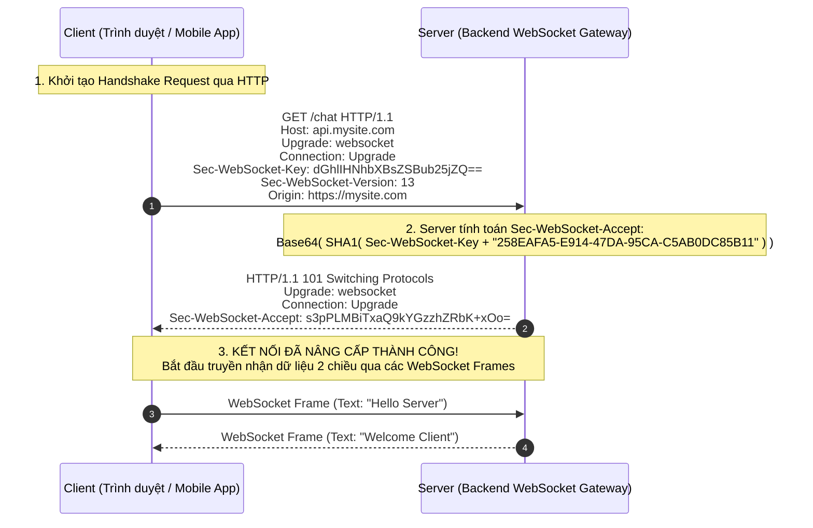
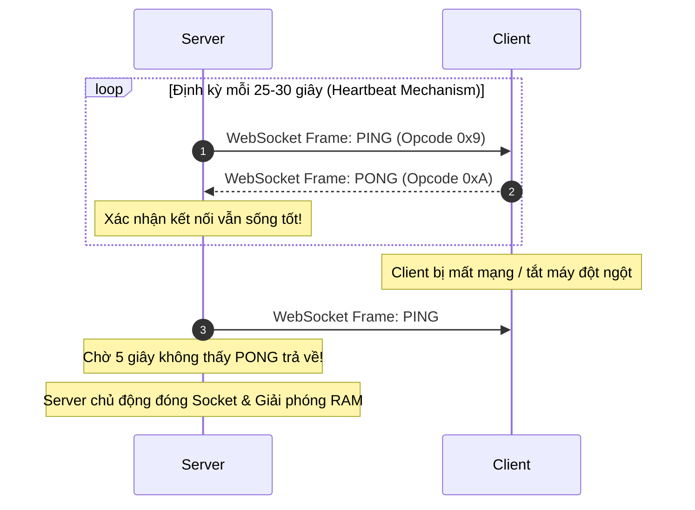
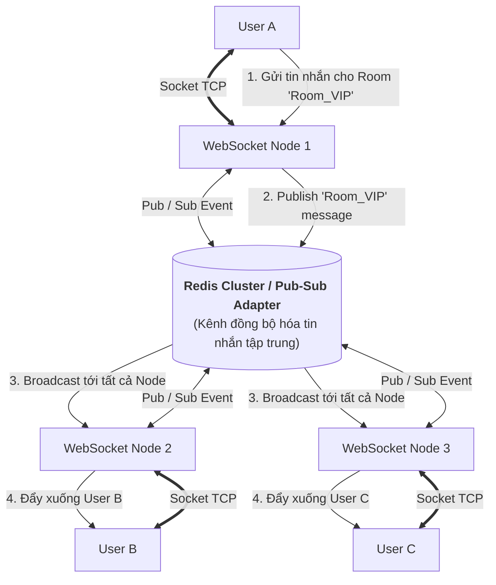

# ĐẶC TẢ CHUYÊN SÂU VỀ WEBSOCKET TRONG PHÁT TRIỂN BACKEND

## Lời mở đầu

Trong giao thức HTTP truyền thống, mô hình giao tiếp hoạt động theo cơ chế **Một chiều / Bán song công (Half-Duplex Request-Response)**: Client luôn phải là bên chủ động gửi yêu cầu thì Server mới có thể phản hồi. Ngoài ra, mỗi request HTTP đều mang theo một lượng lớn Header (Cookies, User-Agent, Auth Tokens $\sim 1\text{KB} - 2\text{KB}$) gây lãng phí băng thông nghiêm trọng khi truyền tải dữ liệu nhỏ liên tục.

**WebSocket (RFC 6455)** ra đời để giải quyết triệt để nhu cầu tương tác thời gian thực (Real-time). Nó thiết lập một **kênh giao tiếp hai chiều toàn phần (Full-Duplex), liên tục và có độ trễ cực thấp (Sub-millisecond)** trên một kết nối TCP duy nhất, với chi phí Overhead của mỗi gói tin (Frame) chỉ từ **2 đến 6 bytes**.

Tài liệu này cung cấp bản đặc tả chuyên sâu và toàn diện về WebSocket: từ quá trình bắt tay Handshake `HTTP 101`, cấu trúc Frame & Ping-Pong Heartbeat, so sánh với SSE / Polling, kỹ thuật mở rộng cụm WebSocket với Redis Adapter, bảo mật chống tấn công CSWSH, cho đến mã nguồn NestJS Gateway thực chiến.

---

## Mục lục

- [Phần I: Bản Chất WebSocket & So Sánh Các Công Nghệ Real-time](#phần-i-bản-chất-websocket--so-sánh-các-công-nghệ-real-time)
  - [1. Giới hạn của HTTP & Sự ra đời của WebSocket](#1-giới-hạn-của-http--sự-ra-đời-của-websocket)
  - [2. Bảng so sánh: HTTP vs Long-Polling vs Server-Sent Events (SSE) vs WebSocket](#2-bảng-so-sánh-http-vs-long-polling-vs-server-sent-events-sse-vs-websocket)
- [Phần II: Quá Trình Bắt Tay Nâng Cấp Giao Thức (WebSocket Handshake)](#phần-ii-quá-trình-bắt-tay-nâng-cấp-giao-thức-websocket-handshake)
- [Phần III: Cấu Trúc Khung Dữ Liệu (Frame Format) & Cơ Chế Heartbeat](#phần-iii-cấu-trúc-khung-dữ-liệu-frame-format--cơ-chế-heartbeat)
  - [1. Cấu trúc nhị phân của một WebSocket Frame](#1-cấu-trúc-nhị-phân-của-một-websocket-frame)
  - [2. Cơ chế Heartbeat (Ping / Pong) & Quản lý Zombie Connections](#2-cơ-chế-heartbeat-ping--pong--quản-lý-zombie-connections)
- [Phần IV: Bài Toán Mở Rộng Quy Mô (Horizontal Scaling) Với Redis Adapter](#phần-iv-bài-toán-mở-rộng-quy-mô-horizontal-scaling-với-redis-adapter)
- [Phần V: Bảo Mật Trong WebSocket (WebSocket Security)](#phần-v-bảo-mật-trong-websocket-websocket-security)
  - [1. Xác thực (Authentication) với JWT an toàn](#1-xác-thực-authentication-với-jwt-an-toàn)
  - [2. Chống tấn công Cross-Site WebSocket Hijacking (CSWSH)](#2-chống-tấn-công-cross-site-websocket-hijacking-cswsh)
  - [3. Rate Limiting trên kết nối WebSocket](#3-rate-limiting-trên-kết-nối-websocket)
- [Phần VI: Triển Khai Thực Chiến Với NestJS (Socket.IO / ws Gateway)](#phần-vi-triển-khai-thực-chiến-với-nestjs-socketio--ws-gateway)
- [Phần VII: Best Practices & Checklist Vận Hành Production](#phần-vii-best-practices--checklist-vận-hành-production)

---

# Phần I: Bản Chất WebSocket & So Sánh Các Công Nghệ Real-time

## 1. Giới hạn của HTTP & Sự ra đời của WebSocket

```mermaid
flowchart TD
    subgraph HTTP_MODEL["1. Mô hình HTTP Truyền Thống (Half-Duplex / Stateless)"]
        direction TB
        C1["Client"] -->|"1. Request (Mang theo 1-2KB Headers)"| S1["Server"]
        S1 -->|"2. Response (Đóng kết nối)"| C1
        Note over C1,S1: Server KHÔNG THỂ tự ý gửi dữ liệu về Client nếu Client không hỏi!
    end

    subgraph WS_MODEL["2. Mô hình WebSocket (Full-Duplex / Stateful Connection)"]
        direction TB
        C2["Client"] <==|"Thiết lập kết nối TCP liên tục 2 chiều<br/>Overhead chỉ 2-6 bytes mỗi tin nhắn"|==> S2["Server"]
        Note over C2,S2: Cả Client và Server đều có thể chủ động bắn tin nhắn bất kỳ lúc nào!
    end
```

---

## 2. Bảng so sánh: HTTP vs Long-Polling vs Server-Sent Events (SSE) vs WebSocket

| Tiêu chí | HTTP REST | Long Polling | Server-Sent Events (SSE) | WebSocket |
|---|---|---|---|---|
| **Hướng truyền dữ liệu** | Đơn hướng (Client $\rightarrow$ Server). | Đơn hướng lặp lại. | **Đơn hướng từ Server** (Server $\rightarrow$ Client). | **Hai chiều toàn phần (Full-Duplex)** (Client $\leftrightarrow$ Server). |
| **Giao thức** | HTTP/1.1, HTTP/2. | HTTP/1.1 (Keep-Alive). | HTTP/1.1 hoặc HTTP/2 (`text/event-stream`). | WebSocket Protocol (`ws://`, `wss://` qua RFC 6455). |
| **Chi phí Header (Overhead)** | Rất lớn (~1KB - 2KB mỗi request). | Lớn (Mỗi chu kỳ tạo lại header). | Rất nhỏ (Chỉ header ở request ban đầu). | **Cực nhỏ (2 - 6 bytes mỗi frame)**. |
| **Độ trễ (Latency)** | Cao (Chỉ khi client gửi request). | Trung bình (~500ms - 2s). | Rất thấp (Server đẩy tức thì). | **Cực thấp (< 5ms, thời gian thực)**. |
| **Định dạng dữ liệu** | Bất kỳ (JSON, XML, Form). | Bất kỳ (JSON, XML). | **Chỉ hỗ trợ Text (UTF-8)**. | **Hỗ trợ cả Text (UTF-8) và Nhị phân (Binary / ArrayBuffer)**. |
| **Tự động kết nối lại** | ❌ Không | Thủ công qua JS. | ✅ **Trình duyệt tự hỗ trợ sẵn** qua `EventSource`. | ❌ Phải tự viết logic reconnect hoặc dùng Socket.IO. |
| **Hỗ trợ HTTP/2 Multiplexing** | ✅ Có | ✅ Có | ✅ **Rất tốt** (Nhiều stream trên 1 kết nối TCP). | ❌ Không (WebSocket độc lập trên TCP riêng). |
| **Trường hợp sử dụng lý tưởng** | CRUD dữ liệu tĩnh, RESTful APIs thông thường. | Giải pháp fallback cho trình duyệt cũ. | - Thông báo đẩy (Push notification).<br/>- Dashboard theo dõi chỉ số chứng khoán/thời tiết.<br/>- Stream phản hồi AI ChatGPT (LLM Token Streaming). | - Ứng dụng Chat, Nhắn tin nhóm.<br/>- Game Online nhiều người chơi (Multiplayer).<br/>- Bảng tương tác cộng tác thời gian thực (Figma, Miro, Google Docs).<br/>- Sàn giao dịch tiền ảo/chứng khoán cần đặt lệnh tức thì. |

---

# Phần II: Quá Trình Bắt Tay Nâng Cấp Giao Thức (WebSocket Handshake)

WebSocket không dùng một cổng (port) riêng biệt ngay từ đầu. Nó bắt đầu bằng một **HTTP GET Request thông thường** (thường qua Port 80 cho `ws://` hoặc Port 443 cho `wss://`), sau đó nâng cấp (Upgrade) kết nối thành WebSocket.



### Giải mã các Header cốt lõi:
- **`Upgrade: websocket` & `Connection: Upgrade`:** Báo cho Web Server (Nginx, Node.js) biết Client muốn nâng cấp từ giao thức HTTP sang giao thức WebSocket.
- **`Sec-WebSocket-Key`:** Một chuỗi ngẫu nhiên 16-byte được mã hóa Base64 do Client sinh ra để chống lại các proxy trung gian lưu cache nhầm.
- **`Sec-WebSocket-Accept`:** Server chứng minh mình hiểu giao thức WebSocket bằng cách lấy `Sec-WebSocket-Key` ghép với chuỗi Magic GUID bí mật `258EAFA5-E914-47DA-95CA-C5AB0DC85B11`, sau đó băm SHA-1 và mã hóa Base64 gửi lại.
- **`HTTP/1.1 101 Switching Protocols`:** Mã trạng thái HTTP xác nhận Server đồng ý chuyển đổi giao thức.

---

# Phần III: Cấu Trúc Khung Dữ Liệu (Frame Format) & Cơ Chế Heartbeat

## 1. Cấu trúc nhị phân của một WebSocket Frame

Khác với HTTP gửi cả khối văn bản lớn, WebSocket chia nhỏ dữ liệu thành các **Frames (Khung nhị phân)** siêu nhẹ:

```
 0                   1                   2                   3
 0 1 2 3 4 5 6 7 8 9 0 1 2 3 4 5 6 7 8 9 0 1 2 3 4 5 6 7 8 9 0 1
+-+-+-+-+-------+-+-------------+-------------------------------+
|F|R|R|R| opcode|M| Payload len |    Extended payload length    |
|I|S|S|S|  (4)  |A|     (7)     |             (16/64)           |
|N|V|V|V|       |S|             |   (if payload len==126/127)   |
| |1|2|3|       |K|             |                               |
+-+-+-+-+-------+-+-------------+ - - - - - - - - - - - - - - - +
|     Extended payload length continued, if payload len == 127  |
+ - - - - - - - - - - - - - - - +-------------------------------+
|                               |Masking-key, if MASK set to 1  |
+-------------------------------+-------------------------------+
| Masking-key (continued)       |          Payload Data         |
+-------------------------------- - - - - - - - - - - - - - - - +
:                     Payload Data continued ...                :
+---------------------------------------------------------------+
```

### Các trường quan trọng:
- **`FIN (1 bit)`:** Báo hiệu đây có phải là frame cuối cùng của thông điệp không (cho phép phân mảnh tin nhắn lớn).
- **`Opcode (4 bits)`:** Xác định loại dữ liệu của frame:
  - `0x1`: Text data (Chuỗi JSON, chuỗi ký tự UTF-8).
  - `0x2`: Binary data (Buffer hình ảnh, âm thanh, file).
  - `0x8`: Connection Close (Đóng kết nối).
  - `0x9`: **Ping** (Kiểm tra sống còn).
  - `0xA`: **Pong** (Phản hồi sống còn).
- **`MASK (1 bit) & Masking-key (4 bytes)`:** Tất cả các frame gửi từ **Client lên Server bắt buộc phải được Mask (mã hóa XOR)** bằng Masking Key để ngăn chặn tấn công đầu độc Cache (Cache Poisoning) trên các Proxy mạng. Frame từ Server xuống Client thì không cần mask.

---

## 2. Cơ chế Heartbeat (Ping / Pong) & Quản lý Zombie Connections

### Vấn nạn "Kết nối ma" (Zombie / Half-Open Connections)
Trong môi trường mạng di động (4G/5G hoặc Wi-Fi), người dùng có thể đi vào vùng mất sóng, tắt nguồn điện thoại hoặc ngắt kết nối đột ngột mà **không kịp gửi gói tin TCP FIN/RST đóng kết nối**. 
- Phía Server vẫn tin rằng kết nối đang mở $\rightarrow$ Tiếp tục giữ socket trong bộ nhớ RAM $\rightarrow$ Rò rỉ tài nguyên (Resource Leak).
- Các thiết bị mạng trung gian (Firewalls, NAT Gateways, Load Balancers) thường tự động hủy (drop) các kết nối TCP không có dữ liệu truyền qua sau 30 - 60 giây.



---

# Phần IV: Bài Toán Mở Rộng Quy Mô (Horizontal Scaling) Với Redis Adapter

## 1. Điểm nghẽn khi Scale Out nhiều Server WebSocket

Không giống như HTTP API là **Stateless** (request nào vào server nào cũng xử lý được), WebSocket là **Stateful Persistent Connection** (Mỗi kết nối TCP gắn chặt vào bộ nhớ của một máy chủ vật lý cụ thể).

```mermaid
flowchart TD
    UserA["User A (Kết nối vào Server 1)"] <== "Socket TCP A" ==> WS1["WebSocket Server 1"]
    UserB["User B (Kết nối vào Server 2)"] <== "Socket TCP B" ==> WS2["WebSocket Server 2"]
    
    UserA -.->|"1. Gửi tin nhắn cho User B: 'Chào bạn'"| WS1
    WS1 -.x|"LỖI: Server 1 không giữ kết nối của User B!<br/>Không thể gửi tin nhắn sang User B!"| UserB
    style WS1 fill:#ffebee,stroke:#c62828
```

---

## 2. Giải pháp: Cụm WebSocket phân tán với Redis Pub/Sub Adapter

Sử dụng **Redis Pub/Sub (hoặc Socket.IO Redis Adapter)** làm tầng trung gian (Message Broker) liên kết toàn bộ các node server lại với nhau.



---

# Phần V: Bảo Mật Trong WebSocket (WebSocket Security)

## 1. Xác thực (Authentication) với JWT an toàn

### ❌ Sai lầm phổ biến: Truyền Token qua URL Query Params
```javascript
// KHÔNG AN TOÀN: Token bị lưu lại trong Access Log của Nginx/Load Balancer và Browser History!
const socket = new WebSocket('wss://api.mysite.com/ws?token=eyJhbGciOi...');
```

### ✅ Giải pháp chuẩn: Xác thực trong giai đoạn Handshake hoặc First Auth Message
1. **Cách 1 (Khuyên dùng với Web App):** Đính kèm JWT trong **`HttpOnly, Secure Cookie`**; trình duyệt sẽ tự động gửi kèm cookie này trong HTTP GET Handshake ban đầu.
2. **Cách 2 (Socket.IO / Mobile App):** Truyền Token trong `auth` object khi kết nối hoặc Header `Authorization`:
```typescript
// Client kết nối an toàn với Socket.IO
const socket = io('https://api.mysite.com', {
  auth: {
    token: 'Bearer eyJhbGciOi...',
  },
});
```

---

## 2. Chống tấn công Cross-Site WebSocket Hijacking (CSWSH)

### Bản chất
Tương tự như tấn công CSRF trên HTTP: Khi người dùng truy cập một website độc hại (`evil.com`), mã JS độc hại trên trang đó khởi tạo kết nối WebSocket đến `wss://yourbank.com/ws`. Vì trình duyệt tự động đính kèm Cookie của `yourbank.com`, kết nối được thiết lập thành công và kẻ tấn công có thể nghe lén hoặc thực hiện giao dịch trái phép.

### Giải pháp:
Bắt buộc **kiểm tra nghiêm ngặt Header `Origin`** ngay tại thời điểm bắt tay (Handshake). Nếu `Origin` không nằm trong danh sách Whitelist cho phép $\rightarrow$ Từ chối Handshake ngay lập tức (`HTTP 403 Forbidden`).

---

## 3. Rate Limiting trên kết nối WebSocket

Kẻ tấn công sau khi mở kết nối có thể dùng vòng lặp gửi hàng triệu tin nhắn mỗi giây làm cạn kiệt CPU của server.
- **Giải pháp:** Sử dụng thuật toán Token Bucket với Redis để giới hạn số lượng tin nhắn tối đa mà 1 `socket.id` hoặc `user_id` được phép gửi trong 1 giây (ví dụ: tối đa 20 messages/giây). Nếu vượt quá, ngắt kết nối ngay lập tức.

---

# Phần VI: Triển Khai Thực Chiến Với NestJS (Socket.IO / ws Gateway)

NestJS cung cấp module `@nestjs/websockets` hỗ trợ xây dựng WebSocket Gateway chuẩn kiến trúc Dependency Injection.

### Bước 1: Cài đặt thư viện
```bash
npm install @nestjs/websockets @nestjs/platform-socket.io socket.io @socket.io/redis-adapter ioredis
```

### Bước 2: Cấu hình Redis Adapter để Scale Out đa Server
```typescript
// redis-io.adapter.ts
import { IoAdapter } from '@nestjs/platform-socket.io';
import { ServerOptions } from 'socket.io';
import { createAdapter } from '@socket.io/redis-adapter';
import Redis from 'ioredis';

export class RedisIoAdapter extends IoAdapter {
  private adapterConstructor: ReturnType<typeof createAdapter>;

  async connectToRedis(): Promise<void> {
    const pubClient = new Redis({ host: 'localhost', port: 6379 });
    const subClient = pubClient.duplicate();

    this.adapterConstructor = createAdapter(pubClient, subClient);
  }

  createIOServer(port: number, options?: ServerOptions): any {
    const server = super.createIOServer(port, options);
    server.adapter(this.adapterConstructor);
    return server;
  }
}
```

Kích hoạt trong `main.ts`:
```typescript
// main.ts
const app = await NestFactory.create(AppModule);
const redisIoAdapter = new RedisIoAdapter(app);
await redisIoAdapter.connectToRedis();
app.useWebSocketAdapter(redisIoAdapter);
await app.listen(3000);
```

### Bước 3: Xây dựng Chat Gateway với Xác thực JWT & Quản lý Room
```typescript
// chat.gateway.ts
import {
  WebSocketGateway,
  WebSocketServer,
  SubscribeMessage,
  OnGatewayConnection,
  OnGatewayDisconnect,
  MessageBody,
  ConnectedSocket,
} from '@nestjs/websockets';
import { Server, Socket } from 'socket.io';
import { Logger, UseGuards } from '@nestjs/common';
import { JwtService } from '@nestjs/jwt';

@WebSocketGateway({
  cors: {
    origin: ['https://mysite.com', 'http://localhost:3000'], // Chống CSWSH
    credentials: true,
  },
  namespace: '/chat',
})
export class ChatGateway implements OnGatewayConnection, OnGatewayDisconnect {
  @WebSocketServer()
  server: Server;

  private readonly logger = new Logger(ChatGateway.name);

  constructor(private readonly jwtService: JwtService) {}

  // 1. Xác thực ngay khi Client kết nối (Handshake Auth)
  async handleConnection(client: Socket) {
    try {
      const authHeader = client.handshake.auth?.token || client.handshake.headers?.authorization;
      if (!authHeader) {
        this.logger.warn(`Client ${client.id} bị từ chối: Không có token`);
        client.disconnect();
        return;
      }

      const token = authHeader.replace('Bearer ', '');
      const payload = await this.jwtService.verifyAsync(token, {
        secret: process.env.JWT_SECRET || 'my_jwt_secret',
      });

      // Lưu thông tin user vào socket instance
      client.data.user = payload;
      this.logger.log(`User ${payload.userId} (Socket ${client.id}) kết nối thành công`);
    } catch (error) {
      this.logger.error(`Xác thực thất bại cho Socket ${client.id}: ${error.message}`);
      client.disconnect();
    }
  }

  handleDisconnect(client: Socket) {
    this.logger.log(`Client ${client.id} đã ngắt kết nối`);
  }

  // 2. Tham gia phòng chat (Join Room)
  @SubscribeMessage('join_room')
  handleJoinRoom(
    @ConnectedSocket() client: Socket,
    @MessageBody() data: { roomId: string },
  ) {
    client.join(data.roomId);
    this.logger.log(`User ${client.data.user?.userId} tham gia phòng: ${data.roomId}`);
    
    // Thông báo cho mọi người trong phòng (trừ người vừa vào)
    client.to(data.roomId).emit('user_joined', {
      userId: client.data.user?.userId,
      message: `User ${client.data.user?.userId} đã tham gia cuộc trò chuyện.`,
    });
  }

  // 3. Gửi tin nhắn trong phòng
  @SubscribeMessage('send_message')
  handleMessage(
    @ConnectedSocket() client: Socket,
    @MessageBody() data: { roomId: string; content: string },
  ) {
    const messagePayload = {
      senderId: client.data.user?.userId,
      content: data.content,
      createdAt: new Date().toISOString(),
    };

    // Bắn tin nhắn cho tất cả thành viên trong Room (Bao gồm cả các Node server khác qua Redis Adapter)
    this.server.to(data.roomId).emit('new_message', messagePayload);
  }
}
```

---

# Phần VII: Best Practices & Checklist Vận Hành Production

### 1. Giám sát tài nguyên Socket & Giới hạn File Descriptors (ulimit)
Mỗi kết nối TCP WebSocket trên Linux tiêu tốn một **File Descriptor (FD)** và khoảng $4\text{KB} - 10\text{KB}$ RAM buffer.
- Cấu hình hệ điều hành Linux: Nâng giới hạn FD `fs.file-max` và `ulimit -n 65535` để 1 máy chủ có thể chịu tải hàng chục nghìn kết nối đồng thời.

### 2. Cấu hình Load Balancer (Nginx / AWS ALB) hỗ trợ WebSocket
Khi đứng sau Nginx Reverse Proxy, bắt buộc phải cấu hình chuyển tiếp Header `Upgrade`:
```nginx
location /chat/ {
    proxy_pass http://backend_nodes;
    proxy_http_version 1.1;
    proxy_set_header Upgrade $http_upgrade;
    proxy_set_header Connection "upgrade";
    proxy_set_header Host $host;
    proxy_read_timeout 60s; # Thời gian chờ Ping/Pong
}
```

### 3. Checklist An Toàn & Vận Hành WebSocket:
- [ ] **Bắt buộc dùng `wss://` (TLS):** Mã hóa toàn bộ dữ liệu trên đường truyền mạng.
- [ ] **Kiểm tra Header `Origin`:** Ngăn chặn tấn công Cross-Site WebSocket Hijacking.
- [ ] **Bật Ping/Pong Heartbeat:** Định kỳ 25s để dọn dẹp các Zombie Connections.
- [ ] **Sử dụng Redis Adapter:** Đảm bảo hệ thống có thể mở rộng Scale Out nhiều server mà không mất tin nhắn giữa các User.
- [ ] **Xác thực JWT tại Handshake:** Ngắt kết nối ngay lập tức nếu token không hợp lệ trước khi cấp phát tài nguyên.
- [ ] **Xử lý Reconnect có Backoff phía Client:** Khi mất mạng, Client nên thử kết nối lại với khoảng trễ tăng dần (ví dụ 1s, 3s, 5s) thay vì dội request liên tục làm nghẽn server.

---

# Tổng kết

| Thành phần | Đặc tả kỹ thuật cốt lõi |
|---|---|
| **Bản chất WebSocket** | Kênh giao tiếp 2 chiều toàn phần (Full-Duplex), liên tục trên 1 kết nối TCP, overhead siêu nhẹ 2-6 bytes. |
| **Quá trình Handshake** | Khởi tạo bằng HTTP GET `Upgrade: websocket`, server phản hồi `HTTP 101 Switching Protocols`. |
| **Quản lý kết nối** | Sử dụng **Ping/Pong Heartbeat** để duy trì kết nối qua Firewall/NAT và loại bỏ Zombie sockets. |
| **Mở rộng cụm phân tán** | Dùng **Redis Pub/Sub Adapter** để broadcast tin nhắn giữa các máy chủ backend trong cụm. |
| **Bảo mật** | Bắt buộc `wss://`, kiểm tra `Origin` chống CSWSH, xác thực JWT trong auth payload/handshake. |
