# TỔNG HỢP CÂU HỎI PHỎNG VẤN BACKEND: XỬ LÝ TÌNH HUỐNG, HIỆU NĂNG VÀ ĐỒNG THỜI

## Lời mở đầu

Tài liệu này tổng hợp và hệ thống hóa 29 câu hỏi phỏng vấn kỹ thuật thường gặp dành cho vị trí Backend Developer/Engineer, tập trung vào năm nhóm chủ đề cốt lõi: (i) xử lý tình huống trong hệ thống backend, (ii) tối ưu hiệu năng — bao gồm một mục chuyên sâu riêng về Caching, (iii) xử lý đồng thời (concurrency), (iv) các vấn đề mở rộng liên quan đến tính nhất quán, bảo mật và khả năng mở rộng, và (v) các tình huống xử lý phổ biến nhất trong thực tế vận hành hệ thống hiện nay (webhook, zero-downtime deployment, sinh ID phân tán, multi-tenant, WebSocket ở quy mô lớn, GDPR, tiền tệ, phân trang dữ liệu lớn, observability). Với mỗi câu hỏi, tài liệu trình bày theo cấu trúc thống nhất gồm: phát biểu câu hỏi, bản chất vấn đề, giải pháp chi tiết, sơ đồ minh họa (nếu phù hợp) và ví dụ minh họa khi cần thiết. Mục tiêu của tài liệu không chỉ dừng lại ở việc cung cấp câu trả lời mẫu, mà hướng đến việc giúp người đọc hiểu được nguyên lý nền tảng đằng sau mỗi vấn đề, từ đó có khả năng ứng biến trước các biến thể câu hỏi khác nhau trong thực tế phỏng vấn.

### Mục lục

- **Phần I — Xử lý tình huống trong hệ thống backend** (Câu 1–4): Cascading failure & Circuit Breaker, Idempotency, Distributed Transaction & Saga, Background job an toàn.
- **Phần II — Tối ưu hiệu năng** (Câu 5–8): Quy trình chẩn đoán hiệu năng, N+1 Query, Caching tổng quan, Tối ưu database lớn.
- **Phần II.B — Chuyên sâu về Caching** (Câu 9–12): Update vs Delete cache, Hot Key, Eviction policy (LRU/LFU/TTL), Cache warm-up.
- **Phần III — Xử lý đồng thời** (Câu 13–16): Race condition, Deadlock/Livelock, Thread vs Event Loop, Backpressure.
- **Phần IV — Các vấn đề khác** (Câu 17–19): Định lý CAP, Rate limiting/DoS, Thiết kế khả năng mở rộng.
- **Phần V — Tình huống phổ biến hiện nay** (Câu 20–29): Webhook, Zero-downtime deployment, Distributed ID, Message ordering, Multi-tenant isolation, WebSocket scale, GDPR/xóa dữ liệu, Tiền tệ, Cursor pagination, Observability/Distributed tracing.

---

## PHẦN I. XỬ LÝ TÌNH HUỐNG TRONG HỆ THỐNG BACKEND

### Câu 1: Khi một service phụ thuộc (dependency) bị chậm hoặc down, hệ thống của bạn sẽ bị ảnh hưởng như thế nào? Giải pháp xử lý là gì?

**Bản chất vấn đề:** Trong kiến trúc microservices, các service gọi lẫn nhau qua mạng. Khi service B chậm, các request từ service A gọi đến B sẽ bị treo (block) trong thời gian dài, chiếm dụng thread/connection pool của A. Nếu lượng request tăng cao, A sẽ cạn kiệt tài nguyên (thread pool exhaustion) và sụp đổ theo, dẫn đến hiệu ứng lan truyền lỗi (cascading failure) trên toàn hệ thống — đây là bản chất của "hiệu ứng domino" trong hệ thống phân tán.

**Giải pháp chi tiết:**

1. **Timeout hợp lý:** Đặt timeout cho mọi lời gọi mạng (HTTP, DB, RPC) để tránh request bị treo vô hạn.
2. **Circuit Breaker (bộ ngắt mạch):** Theo dõi tỷ lệ lỗi của một dependency; khi vượt ngưỡng, "mở mạch" (open circuit) để chặn các request tiếp theo trong một khoảng thời gian, tránh dồn thêm tải vào service đang gặp sự cố, đồng thời cho phép nó có thời gian hồi phục.
3. **Retry với Exponential Backoff + Jitter:** Thử lại request khi lỗi tạm thời, nhưng tăng dần thời gian chờ giữa các lần thử (và thêm nhiễu ngẫu nhiên - jitter) để tránh hiện tượng "thundering herd" (nhiều client cùng retry đồng loạt gây quá tải thêm).
4. **Bulkhead pattern:** Cô lập tài nguyên (thread pool, connection pool) theo từng dependency, để một dependency lỗi không làm cạn kiệt tài nguyên chung của toàn hệ thống — giống như các khoang kín nước trên tàu thủy.
5. **Fallback/Graceful degradation:** Trả về dữ liệu mặc định, dữ liệu cache cũ, hoặc một phản hồi rút gọn thay vì để lỗi lan ra người dùng cuối.

**Sơ đồ minh họa (trạng thái Circuit Breaker):**

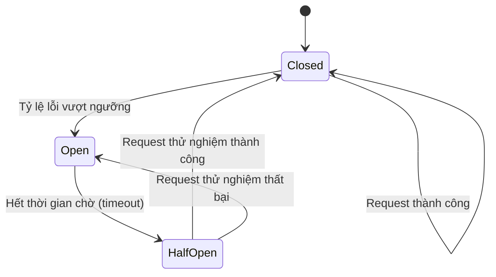

---

### Câu 2: Làm thế nào để đảm bảo một API không bị gọi trùng lặp (duplicate request) gây ra sai lệch dữ liệu, ví dụ như thanh toán hai lần?

**Bản chất vấn đề:** Trong môi trường mạng không đáng tin cậy, client có thể gửi lại request do timeout dù server đã xử lý thành công (client không nhận được response), hoặc do người dùng bấm nút submit nhiều lần. Nếu API không có cơ chế bảo vệ, thao tác sẽ được thực thi nhiều lần ngoài ý muốn.

**Giải pháp chi tiết — Tính Idempotency (tính lũy đẳng):**

1. **Idempotency Key:** Client sinh ra một khóa duy nhất (UUID) cho mỗi thao tác nghiệp vụ và gửi kèm trong header. Server lưu lại khóa này cùng kết quả xử lý; nếu nhận lại cùng khóa, server trả về kết quả đã lưu thay vì xử lý lại.
2. **Thiết kế API theo nguyên tắc idempotent tự nhiên:** Sử dụng PUT thay vì POST khi có thể (PUT với cùng dữ liệu luôn cho cùng kết quả cuối).
3. **Unique constraint ở tầng database:** Ví dụ ràng buộc unique trên (order_id, type) để database tự chối các bản ghi trùng.
4. **Distributed lock hoặc trạng thái xử lý (state machine):** Đánh dấu trạng thái "đang xử lý" trước khi thực hiện, tránh hai luồng xử lý cùng một giao dịch song song.

**Sơ đồ minh họa luồng xử lý Idempotency Key:**

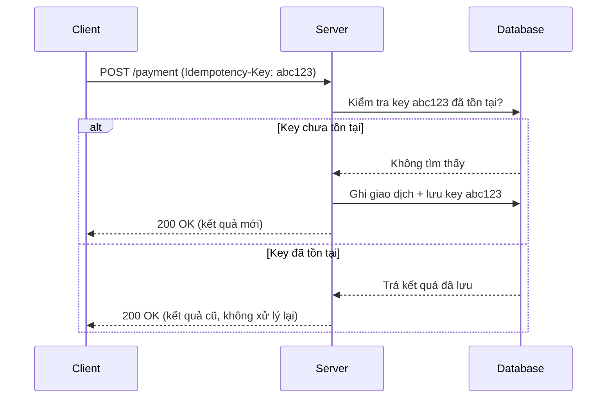

---

### Câu 3: Hệ thống cần thực hiện một giao dịch (transaction) trải dài trên nhiều service/database khác nhau (distributed transaction). Bạn xử lý như thế nào để đảm bảo tính toàn vẹn dữ liệu?

**Bản chất vấn đề:** Transaction truyền thống (ACID) chỉ đảm bảo tính toàn vẹn trong phạm vi một database. Khi nghiệp vụ trải dài qua nhiều service (ví dụ: đặt hàng → trừ kho → thanh toán → giao vận), không thể dùng một transaction database duy nhất để bao trùm tất cả. Nếu một bước ở giữa thất bại, hệ thống cần cách "hoàn tác" các bước trước đó để tránh trạng thái dữ liệu không nhất quán.

**Giải pháp chi tiết:**

1. **Saga Pattern:** Chia giao dịch lớn thành chuỗi các giao dịch cục bộ (local transaction), mỗi bước có một "hành động bù trừ" (compensating action) tương ứng để hoàn tác nếu bước sau thất bại.
   - **Choreography (biên đạo phân tán):** Các service tự lắng nghe sự kiện (event) của nhau và tự quyết định hành động tiếp theo, không có nhạc trưởng trung tâm.
   - **Orchestration (điều phối tập trung):** Có một "nhạc trưởng" (orchestrator) điều khiển toàn bộ luồng, gọi lần lượt từng service và xử lý lỗi khi có bước thất bại.
2. **Two-Phase Commit (2PC):** Giao thức đồng thuận cổ điển gồm pha "chuẩn bị" (prepare — mọi bên khẳng định có thể commit) và pha "thực thi" (commit/rollback đồng loạt). Đảm bảo tính nhất quán mạnh nhưng đánh đổi bằng độ trễ cao và rủi ro khóa tài nguyên lâu nếu coordinator gặp sự cố — vì vậy ít được dùng trong hệ thống phân tán quy mô lớn, hiện đại thường ưu tiên Saga.
3. **Outbox Pattern:** Kết hợp ghi dữ liệu nghiệp vụ và ghi sự kiện (event) vào cùng một transaction cục bộ, sau đó dùng một tiến trình nền (relay) để phát sự kiện ra message queue, đảm bảo không mất sự kiện dù service crash giữa chừng.

**Sơ đồ minh họa Saga (Orchestration) khi có lỗi giữa chừng:**

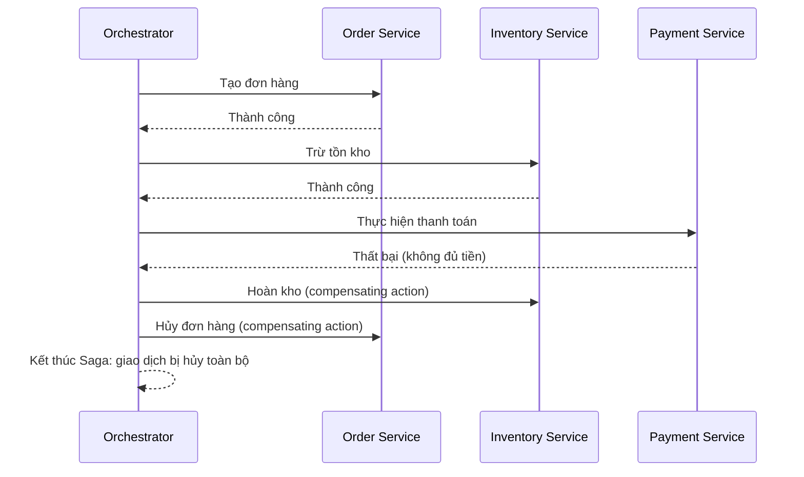

---

### Câu 4: Một job xử lý nền (background job) bị crash giữa chừng khi đang xử lý dữ liệu. Làm sao đảm bảo không mất dữ liệu và không xử lý trùng?

**Bản chất vấn đề:** Đây là vấn đề về "at-least-once vs exactly-once delivery" trong xử lý message/job. Nếu job bị crash sau khi đã xử lý một phần nhưng chưa kịp đánh dấu hoàn thành (commit offset/ack message), hệ thống sẽ đẩy lại job đó cho một worker khác xử lý — có nguy cơ xử lý trùng nếu thao tác không idempotent.

**Giải pháp chi tiết:**

1. **Acknowledge sau khi xử lý xong (at-least-once delivery):** Chỉ gửi ACK cho message queue (Kafka, RabbitMQ, SQS) sau khi đã xử lý và lưu kết quả thành công, không ACK trước.
2. **Thiết kế xử lý idempotent:** Áp dụng nguyên tắc tương tự Câu 2 — dùng ID duy nhất của message để kiểm tra đã xử lý hay chưa trước khi thực thi lại.
3. **Dead Letter Queue (DLQ):** Sau một số lần retry thất bại nhất định, đẩy message vào một queue riêng để xử lý thủ công hoặc phân tích nguyên nhân, tránh việc retry vô hạn làm nghẽn hệ thống.
4. **Checkpoint/Offset tracking:** Với job xử lý dữ liệu lớn theo batch, lưu lại vị trí đã xử lý (checkpoint) để khi restart có thể tiếp tục từ điểm dừng thay vì làm lại từ đầu.

---

## PHẦN II. TỐI ƯU HIỆU NĂNG (PERFORMANCE)

### Câu 5: API của bạn đang phản hồi chậm. Bạn sẽ tiếp cận vấn đề theo quy trình nào để xác định và khắc phục nguyên nhân?

**Bản chất vấn đề:** "Chậm" là một triệu chứng, không phải nguyên nhân. Nếu tối ưu ngay mà không đo đạc (profiling) trước, rất dễ tối ưu sai chỗ (premature optimization), tốn công sức nhưng không cải thiện được điều gì. Nguyên tắc cốt lõi là: **đo trước, tối ưu sau, đo lại để xác nhận**.

**Giải pháp chi tiết — quy trình 5 bước:**

1. **Xác định điểm nghẽn (bottleneck) bằng công cụ đo đạc:** APM (Application Performance Monitoring) như New Relic, Datadog, hoặc distributed tracing (Jaeger, Zipkin) để biết thời gian tiêu tốn ở tầng nào: network, application logic, database, hay external call.
2. **Phân tích tầng Database:** Đây thường là nguyên nhân phổ biến nhất — kiểm tra slow query log, EXPLAIN query plan, chỉ mục (index) có được sử dụng hay không.
3. **Phân tích tầng Application:** Kiểm tra vấn đề N+1 query, serialize/deserialize dữ liệu lớn không cần thiết, thuật toán có độ phức tạp cao (O(n²) trở lên) trên tập dữ liệu lớn.
4. **Phân tích tầng hạ tầng/mạng:** CPU, RAM, I/O của server; độ trễ mạng giữa các service; connection pool có bị cạn kiệt hay không.
5. **Áp dụng giải pháp tương ứng và đo lại (load test):** Dùng công cụ như k6, JMeter, Locust để xác nhận cải thiện thực sự trước khi triển khai production.

**Sơ đồ minh họa quy trình chẩn đoán hiệu năng:**

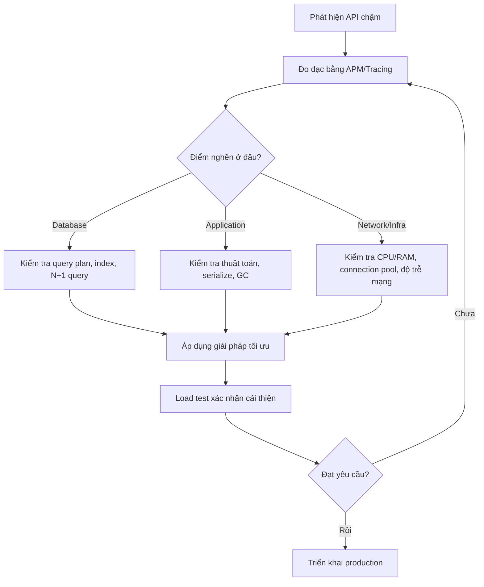

---

### Câu 6: Giải thích vấn đề N+1 Query là gì và cách khắc phục?

**Bản chất vấn đề:** N+1 Query xảy ra khi hệ thống thực hiện 1 truy vấn để lấy danh sách N bản ghi cha, sau đó thực hiện thêm N truy vấn riêng lẻ để lấy dữ liệu con tương ứng cho từng bản ghi (thay vì gộp lại thành một truy vấn duy nhất). Vấn đề này thường phát sinh âm thầm khi dùng ORM với cơ chế lazy loading, khiến số lượng truy vấn tăng tuyến tính theo kích thước dữ liệu, gây quá tải database khi N lớn.

**Ví dụ minh họa (giả lập bằng pseudocode):**

```
# Cách gây ra N+1 (mỗi vòng lặp gọi 1 query riêng)
orders = SELECT * FROM orders WHERE user_id = 1   -- 1 query
for order in orders:
    items = SELECT * FROM order_items WHERE order_id = order.id  -- N query
```

**Giải pháp chi tiết:**

1. **Eager Loading (JOIN hoặc batch fetch):** Gộp truy vấn cha và con thành một lần bằng JOIN, hoặc dùng cơ chế `include`/`with` của ORM (ví dụ `select_related`/`prefetch_related` trong Django, `JOIN FETCH` trong JPA) để ORM tự gộp thành 1-2 truy vấn thay vì N+1.
2. **DataLoader pattern (batching + caching):** Phổ biến trong GraphQL — gom nhiều yêu cầu lấy dữ liệu con trong cùng một tick sự kiện thành một truy vấn batch duy nhất (`WHERE order_id IN (...)`).
3. **Giám sát chủ động:** Bật cấu hình cảnh báo N+1 trong ORM (nhiều ORM hiện đại hỗ trợ) hoặc theo dõi số lượng query trên mỗi request trong môi trường development/staging.

---

### Câu 7: Khi nào nên dùng Caching và những vấn đề (cạm bẫy) thường gặp khi triển khai cache là gì?

**Bản chất vấn đề:** Caching đánh đổi giữa hiệu năng và tính nhất quán dữ liệu (consistency). Dữ liệu cache là một bản sao, nên luôn tồn tại nguy cơ "lệch pha" (staleness) so với dữ liệu gốc trong database nếu không có chiến lược invalidate (làm mất hiệu lực cache) hợp lý.

**Giải pháp chi tiết:**

1. **Chọn đúng chiến lược đọc/ghi cache:**
   - **Cache-aside (lazy loading):** Ứng dụng kiểm tra cache trước; nếu miss thì đọc từ DB rồi ghi vào cache. Đơn giản, phổ biến nhất.
   - **Write-through:** Mọi lần ghi đều ghi đồng thời vào cache và DB — đảm bảo cache luôn mới nhưng tăng độ trễ ghi.
   - **Write-behind (write-back):** Ghi vào cache trước, đồng bộ xuống DB bất đồng bộ sau — hiệu năng ghi cao nhưng rủi ro mất dữ liệu nếu cache sập trước khi đồng bộ.
2. **Xử lý các vấn đề kinh điển:**
   - **Cache Stampede (Thundering Herd):** Khi một key nóng (hot key) hết hạn, hàng loạt request cùng lúc đổ dồn vào DB để tính lại giá trị. Giải pháp: dùng khóa (lock) khi tính lại giá trị, hoặc cơ chế "early expiration" làm mới cache trước khi thực sự hết hạn.
   - **Cache Penetration:** Truy vấn liên tục vào các key không tồn tại (không có trong cache lẫn DB), khiến mọi request đều phải chạm DB. Giải pháp: cache cả giá trị "rỗng" (null) với TTL ngắn, hoặc dùng Bloom Filter để lọc trước các key chắc chắn không tồn tại.
   - **Cache Avalanche:** Nhiều key cùng hết hạn tại một thời điểm, gây quá tải DB đồng loạt. Giải pháp: đặt TTL có độ lệch ngẫu nhiên (jitter) cho từng key thay vì TTL cố định giống nhau.
3. **Chiến lược Invalidation:** Ưu tiên "TTL hợp lý + invalidate chủ động khi có sự kiện thay đổi dữ liệu" hơn là chỉ dựa vào TTL đơn thuần.

**Sơ đồ minh họa Cache-aside pattern:**

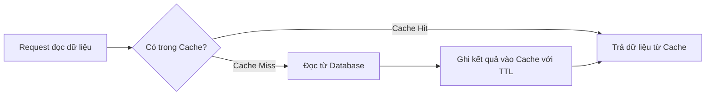

---

### Câu 8: Cơ sở dữ liệu của bạn có bảng hàng chục triệu bản ghi, các truy vấn ngày càng chậm dần. Bạn xử lý như thế nào?

**Bản chất vấn đề:** Khi dữ liệu tăng, chi phí quét bảng (full table scan), chi phí cập nhật/bảo trì chỉ mục, và kích thước index không còn vừa trong bộ nhớ (buffer pool) đều tăng theo, khiến độ trễ truy vấn tăng phi tuyến. Đây là vấn đề về khả năng mở rộng theo chiều dữ liệu (data scalability).

**Giải pháp chi tiết:**

1. **Indexing đúng cách:** Đảm bảo các cột dùng trong `WHERE`, `JOIN`, `ORDER BY` có chỉ mục phù hợp (composite index đúng thứ tự cột theo nguyên tắc "left-most prefix"); tránh over-indexing vì mỗi index làm chậm thao tác ghi.
2. **Query optimization:** Tránh `SELECT *`, tránh hàm trên cột được lọc (khiến index không dùng được), dùng `EXPLAIN ANALYZE` để kiểm tra execution plan thực tế.
3. **Partitioning (phân vùng bảng):** Chia một bảng lớn thành nhiều phân vùng vật lý theo tiêu chí (thời gian, khoảng giá trị id...) để truy vấn chỉ cần quét phân vùng liên quan.
4. **Sharding (phân mảnh theo chiều ngang):** Phân tán dữ liệu ra nhiều database instance theo shard key, mỗi instance chỉ chứa một phần dữ liệu — áp dụng khi quy mô vượt quá khả năng của một server đơn.
5. **Read Replica:** Tách các truy vấn đọc (chiếm phần lớn lưu lượng trong nhiều hệ thống) sang các bản sao chỉ đọc (read replica), giảm tải cho node ghi chính (master/primary).
6. **Archiving dữ liệu cũ:** Di chuyển dữ liệu lịch sử ít truy cập sang kho lưu trữ riêng (cold storage/data warehouse), giữ bảng chính gọn nhẹ.

**Sơ đồ minh họa kiến trúc Read Replica + Sharding:**

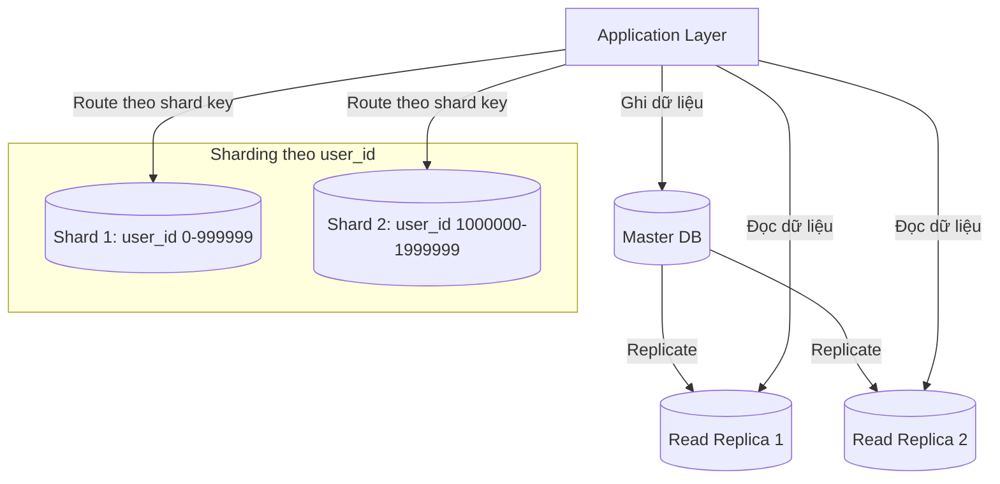

---

## PHẦN II.B. CHUYÊN SÂU VỀ CACHING — NHÓM CÂU HỎI PHỔ BIẾN NHẤT

Caching là chủ đề xuất hiện với tần suất rất cao trong phỏng vấn backend hiện nay, vì gần như mọi hệ thống có lưu lượng lớn đều phải dùng cache, và cache luôn đi kèm những cạm bẫy tinh vi về tính nhất quán. Phần này trình bày các tình huống cụ thể thường được hỏi xoáy sâu hơn câu hỏi tổng quan ở Câu 7.

### Câu 9: Khi cập nhật dữ liệu, bạn nên "update cache" hay "xóa cache" (invalidate)? Tại sao thứ tự thao tác giữa cache và DB lại quan trọng?

**Bản chất vấn đề:** Đây là một trong những câu hỏi cache bị hỏi xoáy nhiều nhất, vì nhìn tưởng đơn giản nhưng ẩn chứa race condition kinh điển. Nếu ghi đè trực tiếp giá trị mới vào cache mỗi khi update DB, hai request update đồng thời có thể khiến cache lưu giá trị **cũ hơn** giá trị thực tế trong DB (do request chậm hơn ghi đè sau cùng vào cache dù DB đã đúng), gây ra tình trạng "cache mất đồng bộ vĩnh viễn" cho đến lần TTL hết hạn tiếp theo.

**Giải pháp chi tiết:**

1. **Ưu tiên "Delete cache" (invalidate) hơn "Update cache":** Khi dữ liệu thay đổi, xóa key khỏi cache thay vì ghi đè giá trị mới. Lần đọc tiếp theo sẽ tự động cache-miss và load lại dữ liệu mới nhất từ DB — đơn giản và ít rủi ro sai lệch hơn.
2. **Thứ tự thao tác chuẩn — "Delete cache SAU khi update DB" (không phải trước):**
   - Nếu xóa cache **trước** khi update DB: một request đọc xen giữa có thể load dữ liệu cũ từ DB vào lại cache ngay sau khi xóa, khiến cache "hồi sinh" giá trị cũ.
   - Thứ tự đúng: `Update DB → Delete cache`. Vẫn có race condition hiếm gặp (đọc xen giữa lúc DB đã update nhưng cache chưa xóa), nhưng xác suất và mức độ nghiêm trọng thấp hơn nhiều so với chiều ngược lại.
3. **Cache-Aside kết hợp Delayed Double Delete:** Xóa cache lần 1 trước update DB, update DB, sau đó xóa cache lần 2 (có delay nhỏ, ví dụ 500ms) để dọn sạch mọi giá trị bị ghi lại do race condition tạm thời.
4. **Sử dụng Write-through cho dữ liệu cần độ chính xác cao ngay lập tức**, chấp nhận đánh đổi độ trễ ghi cao hơn để đảm bảo cache luôn đồng bộ với DB tại mọi thời điểm.

**Sơ đồ minh họa race condition khi xóa cache trước khi update DB:**

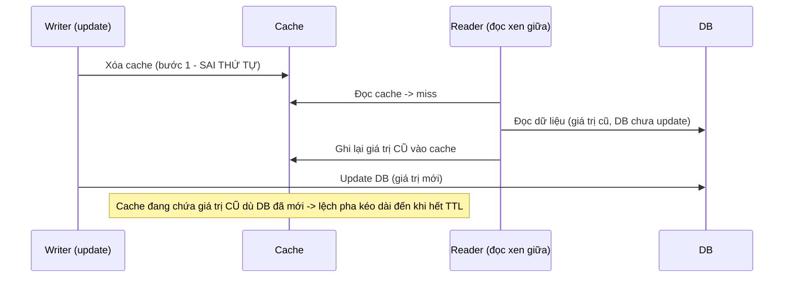

---

### Câu 10: Trong hệ thống nhiều instance dùng chung một cụm Redis, làm sao xử lý vấn đề "Hot Key" — một key bị truy cập với tần suất cực cao gây nghẽn một node Redis duy nhất?

**Bản chất vấn đề:** Redis Cluster phân phối dữ liệu theo hash slot dựa trên key, nghĩa là một key cụ thể luôn được route đến đúng một node. Nếu một key trở nên "nóng" (ví dụ thông tin sản phẩm đang flash-sale, cấu hình toàn hệ thống, hoặc bài viết viral), toàn bộ lưu lượng đọc dồn vào đúng một node duy nhất, khiến node đó quá tải trong khi các node khác vẫn nhàn rỗi — mất cân bằng tải trong hệ thống lẽ ra đã được phân tán.

**Giải pháp chi tiết:**

1. **Local Cache (in-process cache) làm tầng đệm phía trước Redis:** Mỗi application instance giữ một bản cache cục bộ trong bộ nhớ tiến trình (ví dụ Caffeine, Guava Cache) với TTL rất ngắn (vài giây); phần lớn lượng đọc hot key được chặn lại ở tầng local, chỉ một phần nhỏ chạm đến Redis — mô hình này gọi là **Multi-level Caching (cache đa tầng)**.
2. **Key Replication (nhân bản key):** Chủ động tạo nhiều bản sao của cùng một giá trị dưới các key khác nhau (ví dụ `product:123:0`, `product:123:1`,... `product:123:9`), khi đọc thì chọn ngẫu nhiên một bản sao — phân tán tải đọc ra nhiều node/slot khác nhau thay vì dồn vào một key duy nhất.
3. **Phát hiện hot key chủ động:** Dùng công cụ giám sát (Redis `MONITOR`, hoặc thống kê phía client) để phát hiện sớm các key có tần suất truy cập bất thường, từ đó áp dụng các biện pháp trên trước khi gây sự cố thực sự.

**Sơ đồ minh họa kiến trúc Cache đa tầng:**

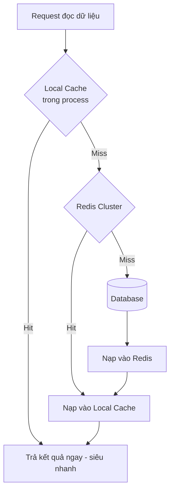

---

### Câu 11: Sự khác biệt giữa các chính sách loại bỏ dữ liệu khỏi cache khi bộ nhớ đầy (eviction policy) là gì? Khi nào nên dùng LRU, LFU hay TTL thuần túy?

**Bản chất vấn đề:** Bộ nhớ dùng cho cache luôn có giới hạn hữu hạn, trong khi lượng dữ liệu tiềm năng cần cache thường lớn hơn nhiều. Hệ thống cache cần một thuật toán quyết định "giữ lại cái gì, loại bỏ cái gì" khi bộ nhớ đầy, sao cho tối đa hóa tỷ lệ cache hit trong tương lai.

**Giải pháp chi tiết — phân tích bản chất từng chính sách:**

1. **LRU (Least Recently Used):** Loại bỏ mục **lâu nhất chưa được truy cập gần đây**. Giả định: dữ liệu vừa được dùng có khả năng cao sẽ được dùng lại sớm ("temporal locality"). Phù hợp với đa số workload thông thường (session, dữ liệu người dùng đang hoạt động).
2. **LFU (Least Frequently Used):** Loại bỏ mục có **tần suất truy cập thấp nhất** trong toàn bộ lịch sử, bất kể truy cập gần đây hay không. Phù hợp khi có sự phân hóa rõ rệt giữa dữ liệu "phổ biến bền vững" (ví dụ sản phẩm bán chạy quanh năm) và dữ liệu chỉ được truy cập đột biến một lần rồi không dùng lại — LRU có thể vô tình giữ lại các mục đột biến này (vì "vừa mới truy cập") và đẩy các mục phổ biến thực sự ra ngoài.
3. **TTL (Time To Live) thuần túy:** Mỗi mục tự động hết hạn sau một khoảng thời gian cố định, bất kể tần suất hay thời điểm truy cập. Phù hợp khi dữ liệu có tính "hết hạn tự nhiên" theo nghiệp vụ (giá cổ phiếu, phiên đăng nhập, mã OTP) hơn là theo áp lực bộ nhớ.
4. **Kết hợp trong thực tế:** Đa số hệ thống cache hiện đại (Redis với `maxmemory-policy`, CDN) áp dụng đồng thời TTL (giới hạn "tuổi thọ" tối đa dữ liệu để đảm bảo tính mới) và LRU/LFU (giải quyết áp lực bộ nhớ khi TTL chưa hết mà bộ nhớ đã đầy).

---

### Câu 12: "Cache warm-up" là gì và tại sao cần thực hiện nó khi triển khai (deploy) hoặc khởi động lại hệ thống cache?

**Bản chất vấn đề:** Khi một cache mới khởi động (cold cache) hoặc một cụm cache mới được scale/thay thế, toàn bộ dữ liệu đều ở trạng thái miss. Nếu lưu lượng truy cập thực tế đổ vào ngay lập tức, toàn bộ request sẽ dồn xuống database cùng lúc — hiện tượng tương tự Cache Stampede nhưng xảy ra trên diện rộng (toàn bộ hệ thống, không chỉ một key), có thể khiến database sụp đổ ngay sau mỗi lần deploy hoặc failover cache.

**Giải pháp chi tiết:**

1. **Chủ động nạp trước dữ liệu (pre-warming):** Trước khi đưa cache mới vào phục vụ traffic thực, chạy script/job đọc trước các dữ liệu "nóng" nhất (theo thống kê truy cập trước đó) và nạp sẵn vào cache.
2. **Traffic shifting dần dần (gradual rollout):** Kết hợp với load balancer, chuyển traffic sang cache/instance mới theo tỷ lệ tăng dần (ví dụ 5% → 20% → 100%) thay vì chuyển toàn bộ ngay lập tức, cho cache có thời gian tự "làm nóng" tự nhiên qua các lần miss ban đầu ở quy mô nhỏ.
3. **Giữ replica cache song song trong quá trình chuyển đổi:** Đảm bảo luôn có ít nhất một cụm cache "ấm" (warm) sẵn sàng phục vụ trong khi cụm mới đang được làm nóng, tránh khoảng trống hoàn toàn không có cache.
4. **Kết hợp Circuit Breaker/Rate limiting phía trước Database** như một lớp bảo vệ dự phòng trong giai đoạn cache còn nguội, tránh trường hợp warm-up không kịp vẫn làm sập DB.

---

## PHẦN III. XỬ LÝ ĐỒNG THỜI (CONCURRENCY)

### Câu 13: Hai request cùng lúc cập nhật số dư tài khoản (ví dụ: trừ tiền), làm sao đảm bảo không xảy ra race condition (điều kiện tranh chấp)?

**Bản chất vấn đề:** Race condition xảy ra khi kết quả cuối cùng của hệ thống phụ thuộc vào thứ tự thực thi không xác định của nhiều luồng/tiến trình truy cập đồng thời vào cùng một tài nguyên dùng chung. Với thao tác "đọc — sửa — ghi" (read-modify-write) như trừ tiền, nếu hai luồng cùng đọc số dư ban đầu trước khi luồng nào ghi lại, một trong hai lần cập nhật sẽ bị "mất" (lost update).

**Ví dụ minh họa race condition:**

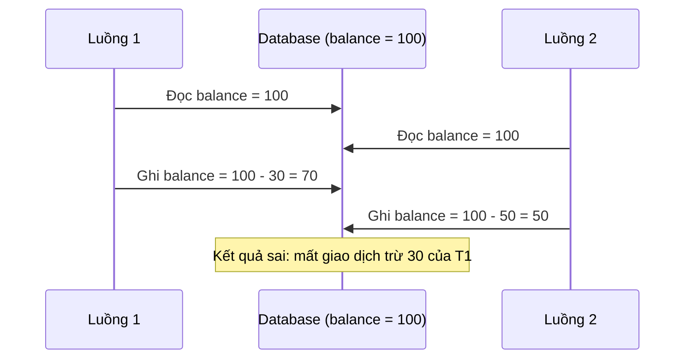

**Giải pháp chi tiết:**

1. **Pessimistic Locking (khóa bi quan):** Khóa bản ghi ngay khi bắt đầu đọc (`SELECT ... FOR UPDATE`), các luồng khác phải chờ đến khi luồng hiện tại hoàn tất transaction. Phù hợp khi tỷ lệ tranh chấp (contention) cao, nhưng làm giảm thông lượng do phải chờ.
2. **Optimistic Locking (khóa lạc quan):** Không khóa trước, mà kiểm tra một trường phiên bản (version) hoặc timestamp tại thời điểm ghi; nếu dữ liệu đã bị thay đổi bởi luồng khác kể từ lúc đọc, thao tác ghi sẽ thất bại và được thử lại. Phù hợp khi tỷ lệ tranh chấp thấp, cho hiệu năng tốt hơn pessimistic locking.
   ```sql
   UPDATE accounts SET balance = balance - 30, version = version + 1
   WHERE id = 1 AND version = 5;
   -- Nếu 0 dòng bị ảnh hưởng: đã có luồng khác cập nhật trước, cần đọc lại và thử lại
   ```
3. **Atomic operation ở tầng database:** Thay vì đọc rồi tính rồi ghi ở tầng application, thực hiện trực tiếp phép toán tại database: `UPDATE accounts SET balance = balance - 30 WHERE id = 1 AND balance >= 30;` — database đảm bảo tính nguyên tử (atomicity) cho câu lệnh này.
4. **Distributed Lock (khi hệ thống nhiều instance):** Dùng Redis (`SETNX`/Redlock) hoặc Zookeeper để đảm bảo chỉ một instance được xử lý tài nguyên tại một thời điểm, trong bối cảnh nhiều service instance chạy song song.

---

### Câu 14: Phân biệt Deadlock và Livelock. Làm sao phát hiện và phòng tránh Deadlock trong hệ thống?

**Bản chất vấn đề:** 
- **Deadlock (bế tắc):** Hai hoặc nhiều luồng/tiến trình chờ đợi lẫn nhau để giải phóng tài nguyên mà không luồng nào chủ động nhường, dẫn đến trạng thái đóng băng vĩnh viễn. Deadlock xảy ra khi đồng thời thỏa mãn 4 điều kiện: loại trừ lẫn nhau (mutual exclusion), giữ và chờ (hold and wait), không thu hồi được (no preemption), và chờ đợi vòng tròn (circular wait).
- **Livelock:** Các luồng vẫn đang "hoạt động" (không đứng yên) nhưng liên tục nhường tài nguyên cho nhau để tránh xung đột, khiến không luồng nào thực sự tiến triển được công việc — giống như hai người cùng tránh đường cho nhau nhưng luôn né cùng một hướng.

**Giải pháp chi tiết phòng tránh Deadlock:**

1. **Thiết lập thứ tự khóa tài nguyên cố định (lock ordering):** Nếu mọi luồng đều khóa tài nguyên theo cùng một thứ tự nhất quán (ví dụ luôn khóa theo ID tăng dần), sẽ phá vỡ điều kiện "chờ đợi vòng tròn" — nguyên nhân cốt lõi gây deadlock.
2. **Giới hạn thời gian chờ khóa (lock timeout):** Nếu một transaction không lấy được khóa trong khoảng thời gian quy định, chủ động rollback thay vì chờ vô hạn.
3. **Deadlock Detection:** Nhiều hệ quản trị CSDL (như MySQL InnoDB, PostgreSQL) có cơ chế tự phát hiện chu trình chờ đợi (wait-for graph) và chủ động hủy bỏ (rollback) một trong các transaction gây deadlock để giải phóng bế tắc.
4. **Giảm phạm vi và thời gian giữ khóa:** Giữ transaction càng ngắn càng tốt, tránh gọi các thao tác chậm (network call, I/O) trong khi đang giữ khóa database.

**Sơ đồ minh họa Deadlock (chờ đợi vòng tròn):**

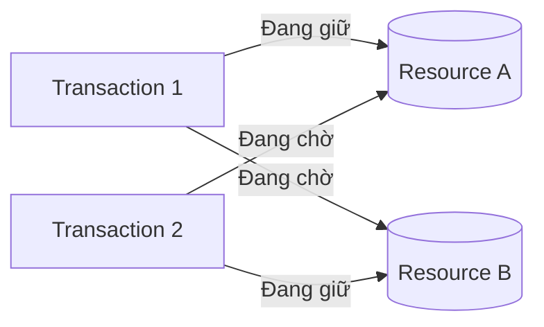

---

### Câu 15: So sánh mô hình xử lý đồng thời dựa trên Thread/Process với mô hình bất đồng bộ (Event Loop / Non-blocking I/O). Khi nào nên dùng mô hình nào?

**Bản chất vấn đề:** Đây là câu hỏi về mô hình xử lý concurrency ở tầng runtime, ảnh hưởng trực tiếp đến khả năng chịu tải của hệ thống backend.

**Giải pháp chi tiết — phân tích bản chất từng mô hình:**

1. **Mô hình Thread-per-request (đa luồng, blocking I/O):** Mỗi request được xử lý bởi một thread riêng; khi thread thực hiện I/O (đọc DB, gọi API ngoài), nó bị block (nhường CPU) cho đến khi có kết quả. Ưu điểm: dễ lập trình, tận dụng tốt đa nhân CPU cho tác vụ nặng tính toán (CPU-bound). Nhược điểm: mỗi thread tốn bộ nhớ (thường vài trăm KB–MB cho stack) và chi phí chuyển ngữ cảnh (context switching), nên khó mở rộng khi số lượng kết nối đồng thời rất lớn (hàng chục nghìn).
2. **Mô hình Event Loop / Non-blocking I/O (như Node.js, Netty, Go's goroutine ở mức độ khác):** Một (hoặc một số ít) luồng xử lý xử lý nhiều request bằng cách không chờ đợi (block) khi thực hiện I/O — thay vào đó đăng ký callback/promise và tiếp tục xử lý request khác, khi I/O hoàn tất sẽ được đưa trở lại event loop để xử lý tiếp. Ưu điểm: mở rộng tốt cho khối lượng lớn tác vụ I/O-bound (nhiều kết nối, ít tính toán). Nhược điểm: một tác vụ tính toán nặng (CPU-bound) sẽ chặn toàn bộ event loop, ảnh hưởng đến tất cả các request khác đang chờ xử lý.

**Nguyên tắc lựa chọn:**
- Hệ thống I/O-bound (API gateway, chat server, real-time notification): ưu tiên mô hình non-blocking/event loop.
- Hệ thống CPU-bound (xử lý ảnh, tính toán khoa học, mã hóa): ưu tiên mô hình đa luồng/đa tiến trình để tận dụng đa nhân CPU, hoặc tách riêng thành worker pool xử lý nền.
- Trong thực tế, nhiều hệ thống kết hợp cả hai: event loop xử lý I/O ở tầng ngoài, kết hợp thread pool/worker riêng cho các tác vụ nặng tính toán.

**Sơ đồ minh họa khác biệt mô hình xử lý:**

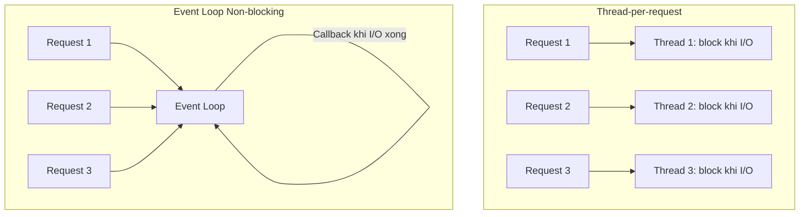

---

### Câu 16: Làm sao xử lý bài toán "producer nhanh hơn consumer" (producer tạo dữ liệu nhanh hơn tốc độ consumer xử lý), gây tràn bộ nhớ hoặc quá tải hệ thống?

**Bản chất vấn đề:** Đây là vấn đề mất cân bằng tốc độ giữa hai đầu của một pipeline xử lý dữ liệu (producer-consumer). Nếu không kiểm soát, dữ liệu sẽ tích tụ không giới hạn ở phía consumer (unbounded queue), dẫn đến cạn kiệt bộ nhớ hoặc độ trễ tăng vọt.

**Giải pháp chi tiết — Backpressure (áp lực ngược):**

1. **Bounded Queue (hàng đợi có giới hạn):** Giới hạn kích thước buffer giữa producer và consumer; khi đầy, producer buộc phải chờ hoặc bị từ chối (thay vì để hàng đợi phình to vô hạn).
2. **Rate Limiting phía producer:** Chủ động giới hạn tốc độ sinh dữ liệu của producer, đồng bộ theo khả năng xử lý thực tế của consumer.
3. **Reactive Streams (Backpressure protocol):** Các framework như Reactor, RxJava, Akka Streams cho phép consumer chủ động "yêu cầu" (request) một số lượng phần tử nhất định mà nó có khả năng xử lý, thay vì producer đẩy dữ liệu một chiều không kiểm soát.
4. **Horizontal scaling consumer:** Tăng số lượng consumer instance (worker) để tăng tổng thông lượng xử lý, kết hợp với message queue (Kafka, RabbitMQ) đóng vai trò làm bộ đệm trung gian bền vững (durable buffer) giữa hai bên.
5. **Load Shedding:** Trong tình huống quá tải nghiêm trọng, chủ động từ chối bớt một phần request ít quan trọng để bảo vệ khả năng phục vụ các request quan trọng còn lại, thay vì để toàn bộ hệ thống sập.

---

## PHẦN IV. CÁC VẤN ĐỀ KHÁC (NHẤT QUÁN, BẢO MẬT, KHẢ NĂNG MỞ RỘNG)

### Câu 17: Trình bày định lý CAP và ý nghĩa thực tiễn của nó khi thiết kế hệ thống backend phân tán?

**Bản chất vấn đề:** Định lý CAP (do Eric Brewer đề xuất) phát biểu rằng một hệ thống lưu trữ dữ liệu phân tán chỉ có thể đảm bảo tối đa **hai trong ba** thuộc tính sau tại cùng một thời điểm khi có sự cố phân vùng mạng (network partition) xảy ra:

- **Consistency (C — tính nhất quán):** Mọi node đều thấy cùng một dữ liệu tại cùng một thời điểm.
- **Availability (A — tính khả dụng):** Mọi request đều nhận được phản hồi (không lỗi), dù có thể không phải dữ liệu mới nhất.
- **Partition Tolerance (P — khả năng chịu phân vùng mạng):** Hệ thống vẫn hoạt động dù mạng giữa các node bị gián đoạn.

**Bản chất sâu hơn:** Trong hệ thống phân tán thực tế, phân vùng mạng (P) là điều **không thể tránh khỏi** (mạng luôn có rủi ro gián đoạn), nên bài toán thực chất không phải "chọn 2 trong 3" mà là: khi xảy ra phân vùng mạng, hệ thống phải chọn giữa **Consistency** hoặc **Availability**.

**Giải pháp chi tiết — ứng dụng thực tiễn:**

1. **Hệ thống thiên về CP (Consistency + Partition tolerance):** Ví dụ Zookeeper, các hệ thống ngân hàng lõi (core banking) — khi có sự cố mạng, hệ thống thà từ chối phục vụ (trả lỗi) còn hơn trả về dữ liệu sai lệch. Phù hợp với nghiệp vụ đòi hỏi tính chính xác tuyệt đối.
2. **Hệ thống thiên về AP (Availability + Partition tolerance):** Ví dụ Cassandra, DynamoDB, các hệ thống mạng xã hội, giỏ hàng thương mại điện tử — ưu tiên luôn phản hồi được cho người dùng, chấp nhận dữ liệu có thể tạm thời không đồng bộ hoàn toàn giữa các node (eventual consistency — nhất quán cuối cùng), sau đó tự đồng bộ lại sau.
3. **Trong thực tế thiết kế:** Không nhất thiết phải chọn tuyệt đối một phía cho toàn hệ thống — có thể áp dụng CP cho các nghiệp vụ nhạy cảm (thanh toán, tồn kho) và AP cho các nghiệp vụ ít nhạy cảm hơn (like, view count, gợi ý sản phẩm) trong cùng một hệ thống tổng thể.

**Sơ đồ minh họa lựa chọn CAP:**

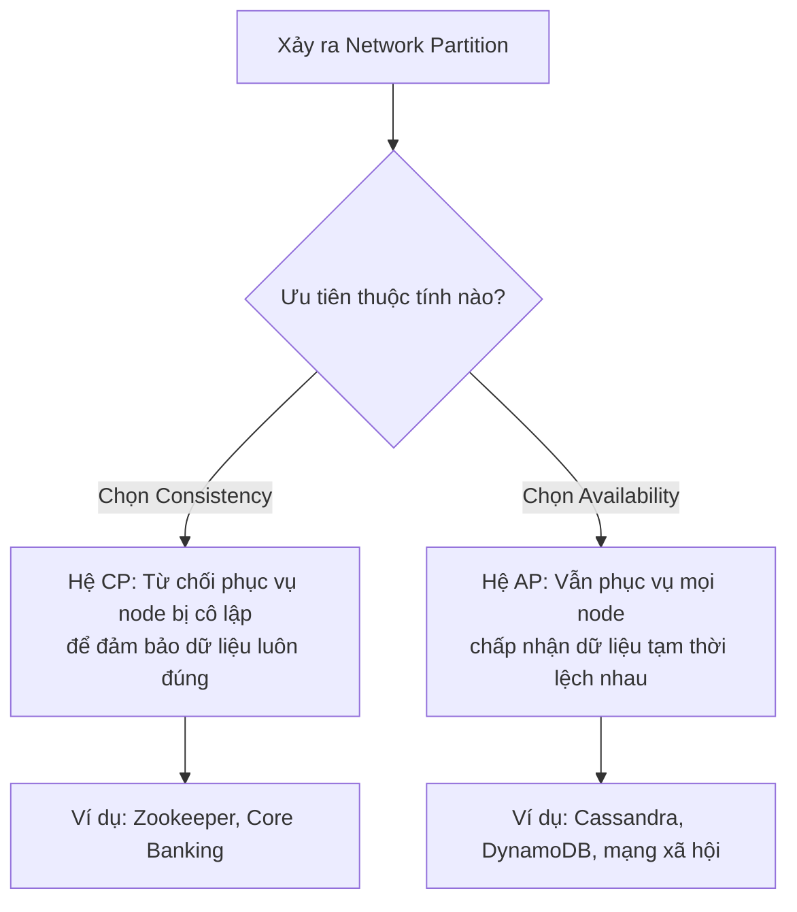

---

### Câu 18: Làm thế nào để bảo vệ một API công khai (public API) khỏi bị lạm dụng (abuse) hoặc tấn công từ chối dịch vụ (DoS)?

**Bản chất vấn đề:** API công khai luôn đối mặt với rủi ro bị gọi với tần suất bất thường — do lỗi client, do bot, hoặc do tấn công chủ đích — làm cạn kiệt tài nguyên hệ thống, ảnh hưởng đến người dùng hợp lệ khác.

**Giải pháp chi tiết:**

1. **Rate Limiting (giới hạn tần suất):** Giới hạn số lượng request cho mỗi client (theo API key, IP, hoặc user) trong một khoảng thời gian. Các thuật toán phổ biến:
   - **Fixed Window Counter:** Đếm số request trong mỗi khung thời gian cố định (ví dụ mỗi phút) — đơn giản nhưng có thể bị "lách" ở ranh giới giữa hai khung.
   - **Sliding Window Log/Counter:** Theo dõi timestamp của từng request trong một cửa sổ trượt liên tục, chính xác hơn Fixed Window.
   - **Token Bucket:** Mỗi client có một "xô" chứa token, token được nạp đều theo thời gian; mỗi request tiêu tốn một token — cho phép xử lý burst traffic (lưu lượng tăng đột biến ngắn hạn) trong giới hạn hợp lý.
2. **Authentication & Authorization chặt chẽ:** Bắt buộc API key/OAuth token, kết hợp giới hạn quyền truy cập theo scope.
3. **Layer 7 WAF (Web Application Firewall) và CDN:** Chặn các pattern tấn công phổ biến trước khi request chạm đến backend, đồng thời hấp thụ một phần lưu lượng tấn công ở biên mạng (edge).
4. **Request validation nghiêm ngặt:** Giới hạn kích thước payload, timeout hợp lý, tránh các endpoint có chi phí tính toán cao bị lạm dụng vô tội vạ.

**Sơ đồ minh họa thuật toán Token Bucket:**

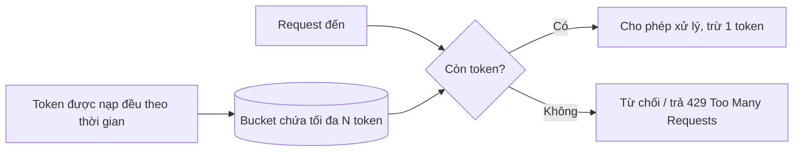

---

### Câu 19: Bạn cần thiết kế một hệ thống có khả năng mở rộng (scalable) để phục vụ lượng người dùng tăng trưởng nhanh. Những nguyên tắc thiết kế cốt lõi là gì?

**Bản chất vấn đề:** Khả năng mở rộng không chỉ đơn thuần là "thêm server" mà là thiết kế kiến trúc sao cho việc thêm tài nguyên tính toán mang lại hiệu quả tăng trưởng thông lượng tương ứng, không bị giới hạn bởi các điểm nghẽn tập trung (single point of contention).

**Giải pháp chi tiết:**

1. **Statelessness (thiết kế phi trạng thái):** Application server không lưu trạng thái phiên (session) cục bộ trên bộ nhớ instance, mà lưu ở tầng chia sẻ (Redis, database) — cho phép scale-out ngang (horizontal scaling) tự do, request nào cũng có thể được xử lý bởi bất kỳ instance nào.
2. **Horizontal scaling ưu tiên hơn Vertical scaling:** Thay vì nâng cấp một server mạnh hơn (có giới hạn vật lý và chi phí tăng phi tuyến), nhân rộng nhiều instance nhỏ hơn kết hợp Load Balancer phân phối tải.
3. **Tách rời các thành phần theo chức năng (Decoupling) qua Message Queue:** Các tác vụ không cần phản hồi ngay lập tức (gửi email, tạo báo cáo, xử lý ảnh) nên được đẩy qua hàng đợi và xử lý bất đồng bộ ở worker riêng, giảm tải cho luồng xử lý request chính.
4. **Database scaling:** Kết hợp Read Replica, Sharding, và Caching như đã trình bày ở Phần II.
5. **CDN cho tài nguyên tĩnh:** Đẩy các tài nguyên tĩnh (ảnh, JS, CSS) ra gần người dùng cuối, giảm tải cho hạ tầng gốc (origin).
6. **Auto-scaling dựa trên metric thực tế:** Tự động tăng/giảm số lượng instance dựa trên CPU, số request đang xử lý, hoặc độ dài hàng đợi — vừa đảm bảo hiệu năng vừa tối ưu chi phí vận hành.

**Sơ đồ minh họa kiến trúc tổng quan khả năng mở rộng:**

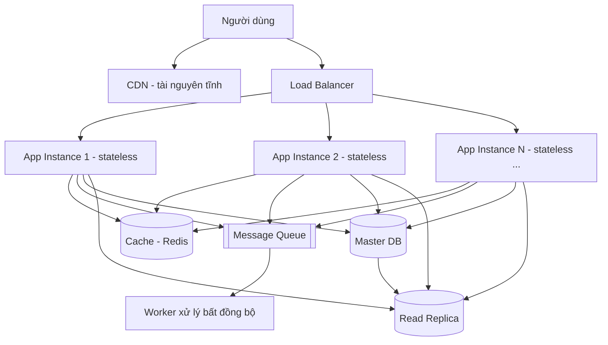

---

## PHẦN V. CÁC TÌNH HUỐNG XỬ LÝ PHỔ BIẾN NHẤT TRONG THỰC TẾ HIỆN NAY

Phần này tập hợp các tình huống xử lý mang tính thời sự, xuất hiện thường xuyên trong các buổi phỏng vấn backend hiện đại — đặc biệt với các hệ thống vận hành theo kiến trúc microservices, triển khai liên tục (CI/CD) và quy mô người dùng lớn.

### Câu 20: Hệ thống của bạn nhận webhook từ một bên thứ ba (ví dụ cổng thanh toán). Làm sao xử lý an toàn khi webhook có thể đến trễ, đến trùng lặp, hoặc sai thứ tự?

**Bản chất vấn đề:** Webhook về bản chất là một cơ chế callback bất đồng bộ qua HTTP do bên thứ ba chủ động gọi đến — hệ thống nhận không kiểm soát được thời điểm, số lần, hay thứ tự các lệnh gọi này. Bên gửi thường tự động retry nếu không nhận được response 2xx trong thời gian ngắn, dẫn đến khả năng cao webhook bị gửi lặp lại nhiều lần cho cùng một sự kiện; đồng thời hai sự kiện liên tiếp về cùng một đối tượng (ví dụ "đơn hàng đã thanh toán" rồi "đơn hàng bị hoàn tiền") có thể đến sai thứ tự do độ trễ mạng khác nhau.

**Giải pháp chi tiết:**

1. **Xác thực nguồn gốc webhook (signature verification):** Kiểm tra chữ ký HMAC gửi kèm trong header bằng secret key đã thỏa thuận trước, tránh giả mạo webhook từ nguồn không tin cậy.
2. **Idempotency theo Event ID:** Mỗi sự kiện webhook có một ID duy nhất; lưu lại các ID đã xử lý (ví dụ trong bảng `processed_events` hoặc Redis set với TTL dài) để bỏ qua sự kiện trùng lặp.
3. **Xử lý dựa trên trạng thái (state), không dựa trên thứ tự sự kiện tuyệt đối:** Thay vì tin tưởng thứ tự webhook đến, đính kèm timestamp hoặc version từ phía gửi và chỉ áp dụng cập nhật nếu sự kiện mới hơn trạng thái hiện đang lưu — tránh sự kiện đến trễ ghi đè lên trạng thái mới hơn đã xử lý trước đó.
4. **Phản hồi nhanh (ACK ngay, xử lý sau):** Trả về HTTP 2xx ngay khi đã nhận và lưu webhook vào hàng đợi nội bộ, xử lý nghiệp vụ thực sự ở một worker bất đồng bộ riêng — tránh trường hợp xử lý nghiệp vụ chậm khiến bên gửi tưởng thất bại và gửi lại (retry) gây trùng lặp.

---

### Câu 21: Bạn cần triển khai (deploy) phiên bản mới của service mà không được phép có downtime (zero-downtime deployment). Đặc biệt khi có thay đổi schema database, bạn xử lý ra sao?

**Bản chất vấn đề:** Trong lúc deploy, tại một thời điểm sẽ tồn tại đồng thời cả phiên bản code cũ và mới cùng chạy song song (rolling update), hoặc database đã đổi schema nhưng code cũ vẫn đang truy vấn theo schema cũ. Nếu không có chiến lược tương thích ngược (backward compatibility), hệ thống sẽ lỗi ngay trong quá trình chuyển đổi dù bản thân code mới không có bug.

**Giải pháp chi tiết:**

1. **Rolling Update kết hợp Health Check:** Load balancer chỉ định tuyến traffic đến các instance đã báo "sẵn sàng" (readiness probe thành công), thay thế dần từng instance cũ bằng instance mới, đảm bảo luôn có instance khả dụng phục vụ request.
2. **Thay đổi Database Schema theo nguyên tắc Expand — Migrate — Contract:**
   - **Expand:** Thêm cột/bảng mới mà không xóa cột cũ, đảm bảo cả code cũ và mới đều chạy được với schema hiện tại.
   - **Migrate:** Triển khai code mới đọc/ghi vào cấu trúc mới, đồng thời di chuyển (backfill) dữ liệu cũ sang cấu trúc mới.
   - **Contract:** Sau khi toàn bộ instance đã chuyển sang code mới và ổn định, mới thực hiện xóa cột/bảng cũ ở một đợt migration riêng.
3. **Feature Flag:** Tách rời việc triển khai code (deploy) khỏi việc kích hoạt tính năng (release) — code mới được deploy nhưng tính năng vẫn tắt, cho phép bật dần theo tỷ lệ người dùng và rollback tức thời (chỉ cần tắt flag) nếu phát sinh sự cố, không cần rollback deployment.
4. **Graceful Shutdown:** Khi instance cũ chuẩn bị bị tắt, cần xử lý nốt các request đang dang dở (drain connections) và ngừng nhận request mới, tránh cắt ngang request đang xử lý giữa chừng.

**Sơ đồ minh họa quy trình Rolling Update:**

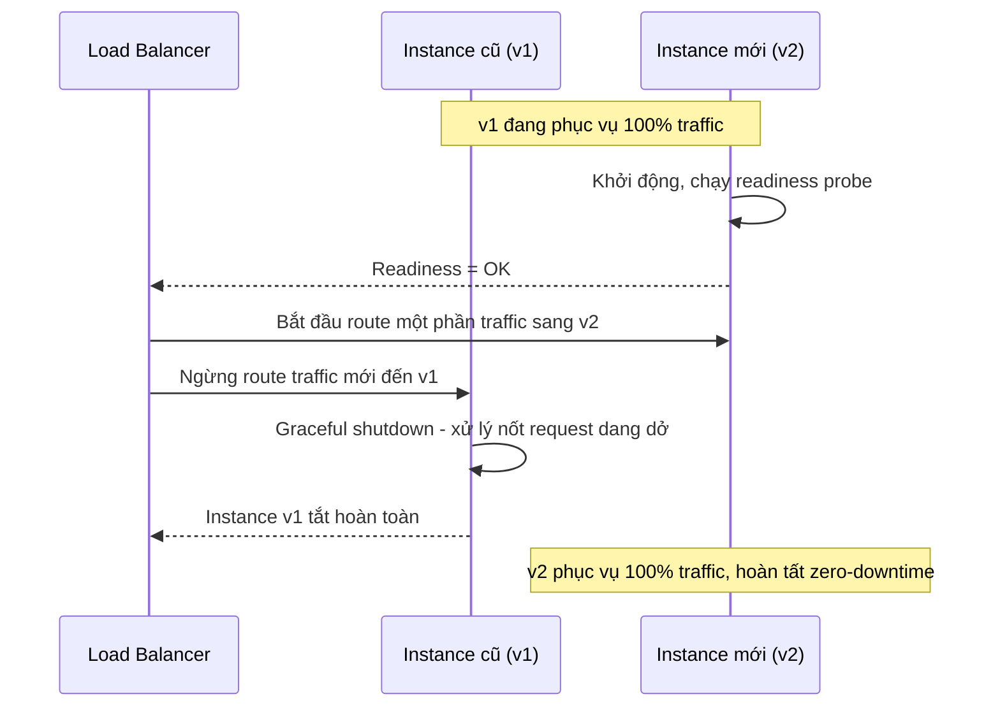

---

### Câu 22: Trong hệ thống phân tán nhiều node, làm sao sinh ra ID duy nhất (unique ID) cho các bản ghi mà không cần một điểm trung tâm duy nhất (tránh single point of failure/bottleneck)?

**Bản chất vấn đề:** Auto-increment ID truyền thống của một database duy nhất không còn phù hợp khi hệ thống đã sharding ra nhiều database, vì mỗi shard tự tăng ID độc lập sẽ gây trùng lặp giữa các shard. Cần một cơ chế sinh ID vừa đảm bảo tính duy nhất toàn cục (global uniqueness), vừa không phụ thuộc vào một service trung tâm gây nghẽn hoặc trở thành điểm lỗi duy nhất.

**Giải pháp chi tiết:**

1. **UUID (Universally Unique Identifier):** Sinh độc lập tại từng node mà không cần điều phối, xác suất trùng lặp gần như bằng không. Nhược điểm: kích thước lớn (128-bit), và UUID ngẫu nhiên (v4) làm giảm hiệu năng index B-Tree do ghi dữ liệu phân tán ngẫu nhiên thay vì tuần tự.
2. **Snowflake ID (do Twitter phát triển):** Kết hợp timestamp + machine/node ID + số thứ tự tăng dần trong cùng một mili-giây, tạo thành một số nguyên 64-bit vừa duy nhất toàn cục, vừa có tính tăng dần theo thời gian (tốt cho index và sắp xếp), vừa sinh được ở từng node độc lập không cần điều phối trung tâm.
3. **Segment-based ID Generator (cấp phát theo khoảng - id range):** Một service trung tâm nhẹ cấp phát trước cho mỗi node một khoảng ID (ví dụ 1000 ID mỗi lần), node tự tăng dần trong khoảng đã được cấp mà không cần gọi lại service trung tâm cho từng ID — giảm tải đáng kể cho service cấp phát so với gọi từng lần.
4. **Database sequence riêng theo offset:** Mỗi shard bắt đầu từ một offset khác nhau và tăng theo bước nhảy bằng số lượng shard (ví dụ shard 1: 1, 4, 7...; shard 2: 2, 5, 8...) để đảm bảo không trùng nhau giữa các shard mà vẫn dùng auto-increment gốc của database.

---

### Câu 23: Làm sao đảm bảo thứ tự xử lý message (message ordering) trong hệ thống hàng đợi phân tán (ví dụ Kafka), khi cần xử lý tuần tự các sự kiện thuộc cùng một đối tượng?

**Bản chất vấn đề:** Để đạt thông lượng cao, các message queue phân tán (Kafka, Kinesis) chia dữ liệu ra nhiều partition xử lý song song. Thứ tự chỉ được đảm bảo **trong phạm vi một partition**, không đảm bảo giữa các partition khác nhau. Nếu các sự kiện liên quan đến cùng một thực thể (ví dụ các thao tác trên cùng một đơn hàng) bị phân tán ngẫu nhiên vào nhiều partition khác nhau, chúng có thể được xử lý sai thứ tự, dẫn đến trạng thái cuối cùng sai lệch (ví dụ sự kiện "hủy đơn" được xử lý trước sự kiện "tạo đơn").

**Giải pháp chi tiết:**

1. **Partitioning theo key nghiệp vụ:** Chọn key phân vùng (partition key) là ID của thực thể cần đảm bảo thứ tự (ví dụ `order_id`). Kafka đảm bảo mọi message có cùng key sẽ luôn được ghi vào cùng một partition, và trong một partition, thứ tự luôn được giữ nguyên theo thứ tự ghi.
2. **Single consumer per partition:** Đảm bảo chỉ có một consumer instance xử lý một partition tại một thời điểm (đây cũng là hành vi mặc định trong Kafka consumer group), tránh xử lý song song phá vỡ thứ tự trong cùng partition.
3. **Đánh đổi giữa thông lượng và thứ tự:** Càng nhiều partition thì thông lượng song song càng cao, nhưng phạm vi đảm bảo thứ tự càng bị chia nhỏ theo từng key riêng biệt — cần xác định rõ đơn vị nghiệp vụ nào thực sự cần đảm bảo thứ tự tuyệt đối, tránh gộp toàn bộ hệ thống vào một partition duy nhất (làm mất khả năng mở rộng).
4. **Xử lý version/sequence number ở tầng ứng dụng như lớp phòng vệ bổ sung:** Ngay cả khi đã dùng đúng partition key, vẫn nên đính kèm số thứ tự sự kiện (sequence number) trong payload để consumer có thể phát hiện và xử lý đúng nếu có sai lệch thứ tự phát sinh từ rebalance hoặc retry.

---

### Câu 24: Hệ thống SaaS multi-tenant (nhiều khách hàng dùng chung hạ tầng) cần đảm bảo dữ liệu của tenant này tuyệt đối không bị lộ sang tenant khác. Bạn thiết kế cách ly dữ liệu như thế nào?

**Bản chất vấn đề:** Trong kiến trúc multi-tenant, một lỗi logic nhỏ (quên thêm điều kiện `WHERE tenant_id = ?`) có thể gây rò rỉ dữ liệu nghiêm trọng giữa các khách hàng — đây là loại lỗi bảo mật nguy hiểm vì hậu quả không chỉ là bug thông thường mà là vi phạm cam kết cách ly dữ liệu (data isolation) với khách hàng.

**Giải pháp chi tiết — các mô hình cách ly theo mức độ chặt chẽ tăng dần:**

1. **Shared Database, Shared Schema (cách ly bằng cột `tenant_id`):** Tất cả tenant dùng chung bảng, phân biệt bằng một cột định danh. Chi phí vận hành thấp nhất, nhưng rủi ro rò rỉ dữ liệu cao nhất nếu lập trình viên quên lọc điều kiện — cần bổ sung Row-Level Security (RLS) ở tầng database (PostgreSQL hỗ trợ native) để database tự động chặn truy cập chéo tenant bất kể câu lệnh ứng dụng có lọc đúng hay không, như một lớp phòng vệ độc lập với logic ứng dụng.
2. **Shared Database, Separate Schema:** Mỗi tenant có một schema riêng trong cùng một database instance — cách ly tốt hơn, dễ backup/restore riêng cho từng tenant, nhưng số lượng schema tăng theo số tenant có thể gây khó khăn vận hành ở quy mô rất lớn.
3. **Separate Database per Tenant:** Mỗi tenant có một database vật lý riêng biệt hoàn toàn — mức cách ly cao nhất, phù hợp với khách hàng doanh nghiệp lớn có yêu cầu compliance nghiêm ngặt, nhưng chi phí hạ tầng và vận hành cao nhất, khó scale khi số lượng tenant lên đến hàng chục nghìn.
4. **Kiểm soát ở tầng middleware bắt buộc:** Bất kể mô hình nào, nên có một lớp middleware trung gian tự động gắn `tenant_id` vào mọi câu truy vấn dựa theo thông tin xác thực (authentication context) của request, thay vì để từng đoạn code nghiệp vụ tự thêm điều kiện thủ công — giảm thiểu rủi ro con người quên sót.

---

### Câu 25: Hệ thống chat/thông báo real-time cần duy trì hàng trăm nghìn kết nối WebSocket đồng thời. Những thách thức chính khi mở rộng (scale) hệ thống này là gì?

**Bản chất vấn đề:** Khác với HTTP request-response ngắn hạn, WebSocket là kết nối "sống" (long-lived, stateful) — server phải duy trì trạng thái kết nối trong bộ nhớ trong suốt thời gian client online. Điều này phá vỡ nguyên tắc "stateless" vốn là nền tảng cho horizontal scaling dễ dàng ở Câu 19, đòi hỏi kiến trúc riêng.

**Giải pháp chi tiết:**

1. **Connection Gateway tách riêng khỏi Business Logic:** Tách một tầng riêng chuyên trách giữ kết nối WebSocket (connection layer), không xử lý nghiệp vụ nặng tại đây — tầng này chỉ định tuyến message giữa client và các service xử lý nghiệp vụ phía sau qua message queue nội bộ.
2. **Presence/Session Registry tập trung:** Vì một user có thể kết nối đến bất kỳ instance connection gateway nào (do load balancer phân phối), cần một registry dùng chung (Redis) lưu ánh xạ `user_id -> instance nào đang giữ kết nối của user đó`, để khi cần gửi message đến user, hệ thống biết định tuyến đến đúng instance.
3. **Pub/Sub làm cầu nối giữa các instance:** Khi service backend cần gửi thông báo đến một user, publish message lên một kênh Pub/Sub (Redis Pub/Sub, Kafka); mọi connection gateway instance đều subscribe, chỉ instance đang thực sự giữ kết nối của user đó mới đẩy message xuống client.
4. **Sticky session (nếu cần) ở tầng load balancer:** Đảm bảo trong thời gian một session WebSocket còn sống, mọi giao tiếp liên quan vẫn đi qua đúng instance ban đầu, tránh phức tạp hóa việc đồng bộ trạng thái kết nối giữa các instance.
5. **Giới hạn tài nguyên mỗi instance và auto-scaling theo số connection:** Theo dõi số lượng kết nối đang mở trên mỗi instance (không chỉ CPU/RAM) làm chỉ số chính để quyết định auto-scale, vì kết nối WebSocket tiêu tốn tài nguyên (file descriptor, bộ nhớ buffer) ngay cả khi không có traffic thực sự.

**Sơ đồ minh họa kiến trúc WebSocket scale ngang:**

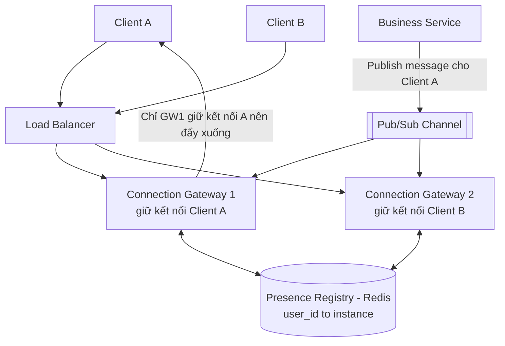

---

### Câu 26: Người dùng yêu cầu xóa toàn bộ dữ liệu cá nhân của họ (theo quy định GDPR/Nghị định bảo vệ dữ liệu cá nhân). Bạn xử lý yêu cầu này trong một hệ thống phân tán như thế nào?

**Bản chất vấn đề:** Trong hệ thống hiện đại, dữ liệu của một người dùng thường không nằm ở một nơi duy nhất mà rải rác qua nhiều service, database, cache, log, bản backup, và cả các hệ thống phân tích/data warehouse — việc "xóa" phải đảm bảo tính đầy đủ (không sót nơi nào) và đúng thời hạn theo luật định, đồng thời không được phá vỡ tính toàn vẹn tham chiếu (referential integrity) của các dữ liệu liên quan khác (ví dụ đơn hàng cần giữ lại cho mục đích kế toán).

**Giải pháp chi tiết:**

1. **Data Inventory/Mapping tập trung:** Xây dựng và duy trì một danh mục chính thức liệt kê mọi nơi có lưu dữ liệu cá nhân của người dùng (database nào, bảng nào, service nào, có ở cache/log/analytics hay không) — đây là điều kiện tiên quyết, không thể xóa đầy đủ nếu không biết dữ liệu đang nằm ở đâu.
2. **Orchestrated Deletion qua Event/Saga:** Phát ra một sự kiện "user deletion requested" trung tâm, mỗi service tự lắng nghe và chủ động xóa/ẩn danh (anonymize) phần dữ liệu thuộc phạm vi của mình, tương tự mô hình Saga đã trình bày ở Câu 3, đồng thời báo cáo trạng thái hoàn tất về một service điều phối để theo dõi tiến độ toàn hệ thống.
3. **Ưu tiên Anonymization (ẩn danh hóa) hơn Hard Delete khi cần giữ tính toàn vẹn dữ liệu liên quan:** Với các bản ghi có ràng buộc nghiệp vụ/pháp lý khác (như lịch sử giao dịch cần lưu cho kế toán/thuế), thay vì xóa hẳn, thay thế các trường định danh cá nhân (tên, email, số điện thoại) bằng giá trị vô danh, giữ lại cấu trúc dữ liệu nghiệp vụ.
4. **Xử lý các tầng "khó xóa":** Cache sẽ tự hết hạn theo TTL hoặc cần chủ động invalidate; bản backup cũ cần có chính sách xóa theo lịch trình (retention policy) thay vì phải rà soát thủ công từng bản backup lịch sử; log cần được thiết kế ngay từ đầu để không ghi trực tiếp dữ liệu cá nhân nhạy cảm (PII) dưới dạng plain text.

---

### Câu 27: Khi xử lý dữ liệu tiền tệ (số tiền, giá cả) trong hệ thống backend, tại sao không nên dùng kiểu dữ liệu số thực (float/double)? Cách xử lý đúng là gì?

**Bản chất vấn đề:** Kiểu số thực dấu phẩy động (`float`/`double`) biểu diễn giá trị theo hệ nhị phân, không thể biểu diễn chính xác tuyệt đối nhiều giá trị thập phân thông thường (ví dụ 0.1 + 0.2 trong nhiều ngôn ngữ lập trình không cho kết quả chính xác bằng 0.3 do sai số làm tròn nhị phân). Với dữ liệu tiền tệ, dù sai số rất nhỏ nhưng khi tích lũy qua hàng triệu giao dịch, có thể dẫn đến chênh lệch sổ sách nghiêm trọng — một lỗi không thể chấp nhận trong nghiệp vụ tài chính.

**Giải pháp chi tiết:**

1. **Dùng kiểu số nguyên biểu diễn đơn vị nhỏ nhất (Integer + minor unit):** Lưu trữ số tiền dưới dạng số nguyên theo đơn vị nhỏ nhất của đồng tiền (ví dụ lưu "xu"/"cent" thay vì "đồng"/"dollar": 150000 thay vì 1500.00), tránh hoàn toàn vấn đề số thực. Đây là cách phổ biến nhất trong các hệ thống thanh toán lớn (Stripe lưu trữ theo cents).
2. **Dùng kiểu Decimal/BigDecimal (số thập phân có độ chính xác cố định):** Với ngôn ngữ hỗ trợ (Java `BigDecimal`, Python `Decimal`, kiểu `DECIMAL`/`NUMERIC` trong SQL), sử dụng các kiểu này để biểu diễn số thập phân chính xác tuyệt đối theo hệ thập phân, tránh sai số nhị phân của float/double.
3. **Xác định rõ quy tắc làm tròn (rounding rule) nhất quán trong toàn hệ thống:** Khi cần chia hoặc tính phần trăm (ví dụ chia hóa đơn, tính thuế), phải quy định rõ làm tròn lên/xuống/gần nhất và áp dụng nhất quán, tránh mỗi nơi trong code tự làm tròn theo cách khác nhau gây lệch số liệu tổng.
4. **Không bao giờ thực hiện phép so sánh bằng (`==`) trực tiếp trên số thực** cho các giá trị tài chính; nếu buộc phải dùng, luôn dựa trên đơn vị nguyên hoặc Decimal thay vì float ngay từ đầu để loại bỏ hoàn toàn vấn đề gốc rễ.

---

### Câu 28: API trả về danh sách dữ liệu rất lớn (hàng triệu bản ghi). Vì sao phân trang bằng `OFFSET/LIMIT` truyền thống lại có vấn đề khi dữ liệu lớn, và giải pháp thay thế là gì?

**Bản chất vấn đề:** Với `OFFSET/LIMIT`, database vẫn phải quét (scan) và bỏ qua toàn bộ số bản ghi đứng trước offset trước khi lấy được các bản ghi cần trả về — chi phí này tăng tuyến tính theo giá trị offset. Khi phân trang đến các trang càng sâu (offset càng lớn), truy vấn càng chậm dần một cách rõ rệt. Ngoài ra, nếu có bản ghi mới được thêm/xóa giữa các lần gọi trang liên tiếp, kết quả phân trang có thể bị trùng hoặc bỏ sót bản ghi do toàn bộ tập dữ liệu đã dịch chuyển vị trí.

**Giải pháp chi tiết — Cursor-based Pagination (phân trang theo con trỏ):**

1. **Nguyên lý:** Thay vì dùng vị trí số học (offset), sử dụng giá trị của một cột có thứ tự duy nhất (thường là khóa chính hoặc timestamp kết hợp khóa chính để đảm bảo duy nhất) của bản ghi cuối cùng ở trang trước làm "con trỏ" (cursor) cho trang tiếp theo.
   ```sql
   -- Thay vì: SELECT * FROM orders ORDER BY id LIMIT 20 OFFSET 100000  (chậm dần theo offset)
   -- Dùng:    SELECT * FROM orders WHERE id > :last_seen_id ORDER BY id LIMIT 20  (luôn nhanh, tận dụng index)
   ```
2. **Ưu điểm:** Hiệu năng ổn định (constant time) bất kể đang ở trang nào, vì luôn tận dụng được index để tìm điểm bắt đầu trực tiếp thay vì quét bỏ qua. Đồng thời tránh được vấn đề trùng/sót bản ghi khi dữ liệu thay đổi giữa các lần gọi.
3. **Đánh đổi:** Cursor-based pagination không hỗ trợ tốt việc "nhảy thẳng đến trang số N" (vì không có khái niệm offset tuyệt đối) — phù hợp với giao diện dạng cuộn vô hạn (infinite scroll) hơn là giao diện phân trang có đánh số trang truyền thống.
4. **Khi nào vẫn chấp nhận OFFSET/LIMIT:** Với tập dữ liệu nhỏ, hoặc giao diện quản trị nội bộ có lượng truy cập thấp và bắt buộc phải hiển thị số trang cụ thể, OFFSET/LIMIT vẫn là lựa chọn đơn giản và đủ dùng.

---

### Câu 29: Khi hệ thống gồm hàng chục microservices, một lỗi xảy ra ở service tận cùng khiến việc xác định nguyên nhân gốc (root cause) rất khó khăn. Bạn thiết kế khả năng quan sát (observability) hệ thống như thế nào?

**Bản chất vấn đề:** Trong kiến trúc monolith, toàn bộ luồng xử lý nằm trong một tiến trình, dễ dàng debug bằng log/stack trace thông thường. Trong microservices, một request từ người dùng có thể đi qua hàng chục service khác nhau; nếu mỗi service ghi log độc lập mà không có cơ chế liên kết, việc truy vết một request cụ thể qua toàn bộ hành trình của nó gần như bất khả thi khi hệ thống ở quy mô lớn.

**Giải pháp chi tiết — ba trụ cột của Observability:**

1. **Distributed Tracing (Truy vết phân tán) với Correlation ID/Trace ID:** Sinh một `trace_id` duy nhất ngay tại điểm request đi vào hệ thống (API Gateway), truyền `trace_id` này xuyên suốt qua mọi lời gọi service tiếp theo (qua HTTP header hoặc message metadata). Mỗi service khi ghi log hoặc gửi span dữ liệu đến hệ thống tracing (Jaeger, Zipkin, OpenTelemetry) đều đính kèm `trace_id` này, cho phép dựng lại toàn bộ hành trình của một request cụ thể qua tất cả các service liên quan, kèm thời gian xử lý tại từng chặng.
2. **Centralized Logging (Log tập trung):** Toàn bộ log từ mọi service được đẩy về một hệ thống tập trung (ELK Stack, Loki, Datadog Logs) thay vì nằm rải rác trên từng máy chủ, cho phép tìm kiếm theo `trace_id` xuyên suốt toàn hệ thống chỉ trong một truy vấn.
3. **Metrics & Alerting:** Thu thập các chỉ số định lượng theo thời gian (latency, error rate, throughput, resource usage) ở từng service, thiết lập cảnh báo tự động (alerting) khi chỉ số vượt ngưỡng bất thường — giúp phát hiện sự cố chủ động trước khi người dùng phàn nàn, thay vì chỉ phân tích sau khi sự cố đã xảy ra.
4. **Structured Logging:** Ghi log dưới định dạng có cấu trúc (JSON) thay vì văn bản tự do, giúp hệ thống log tập trung dễ dàng lập chỉ mục, lọc và truy vấn theo trường dữ liệu cụ thể (`trace_id`, `user_id`, `service_name`, `status_code`...).

**Sơ đồ minh họa Distributed Tracing qua nhiều service:**

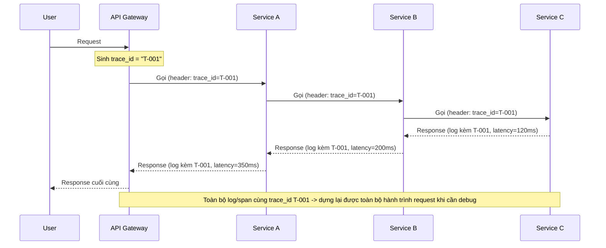

---

## KẾT LUẬN

Qua các câu hỏi và giải pháp được trình bày ở trên, có thể nhận thấy một điểm chung xuyên suốt: phần lớn các vấn đề trong hệ thống backend — dù thuộc nhóm xử lý tình huống, hiệu năng hay đồng thời — đều bắt nguồn từ bản chất của **hệ thống phân tán**: dữ liệu được chia sẻ và truy cập bởi nhiều tác nhân (thread, service, client) tại cùng một thời điểm, trong một môi trường mạng vốn dĩ không đáng tin cậy tuyệt đối (độ trễ, mất gói tin, node có thể sập bất cứ lúc nào). Do đó, thay vì ghi nhớ máy móc từng giải pháp riêng lẻ, người làm backend cần nắm vững các nguyên lý nền tảng — tính idempotent, tính nhất quán, đánh đổi CAP, kiểm soát tài nguyên dùng chung — để có thể phân tích và ứng biến linh hoạt trước bất kỳ biến thể tình huống thực tế nào, kể cả những tình huống chưa từng gặp trước đó. Đây cũng chính là năng lực cốt lõi mà các buổi phỏng vấn kỹ thuật backend thực sự muốn đánh giá ở ứng viên.

