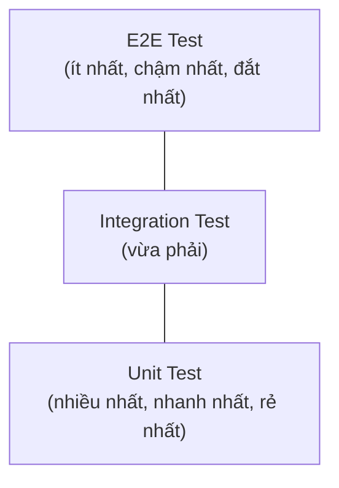

# Backend Testing

## Giới thiệu

Mọi kỹ thuật trình bày ở các chương trước — Validation, Concurrency, Idempotency, Security — đều chỉ có giá trị nếu chúng thực sự hoạt động đúng như thiết kế. Nhưng làm sao biết được điều đó, ngoài việc **tự tay chạy thử ứng dụng mỗi lần thay đổi code**? Cách làm thủ công này không thể mở rộng: khi hệ thống lớn dần, số lượng tình huống cần kiểm tra tăng theo cấp số nhân, và con người rất dễ bỏ sót hoặc quên kiểm tra lại những phần cũ khi sửa phần mới. **Testing** giải quyết vấn đề này bằng cách biến việc kiểm tra thành một quy trình **tự động, lặp lại được, và đáng tin cậy** — chương này trình bày tư duy kiểm thử và cách hiện thực hóa nó trong NestJS bằng Jest.

---

## 10.1. Giới thiệu Testing

### 10.1.1. Testing là gì?

**Bản chất**: Testing là việc viết code để **tự động xác minh rằng một phần code khác hoạt động đúng như kỳ vọng**, thay vì kiểm tra thủ công bằng mắt. Một bài test bản chất là một đoạn kịch bản: chuẩn bị một tình huống cụ thể, thực hiện một hành động, và khẳng định kết quả phải đúng như mong đợi.

**Giá trị cốt lõi mà Testing mang lại không nằm ở việc "bắt lỗi ngay lúc viết"**, mà nằm ở việc **bảo vệ hệ thống khỏi bị hỏng khi có thay đổi trong tương lai** (gọi là *regression* — lỗi hồi quy). Khi một dự án có bộ test đầy đủ, lập trình viên có thể tự tin sửa đổi hoặc tái cấu trúc (refactor) code mà không lo âm thầm làm hỏng một tính năng khác ở nơi xa — chỉ cần chạy lại bộ test, nếu tất cả vẫn pass thì hệ thống vẫn đúng như trước.

### 10.1.2. Unit Test

**Bản chất**: Unit Test kiểm tra **một đơn vị nhỏ nhất, độc lập** của code — thường là một hàm hoặc một phương thức của một class — **hoàn toàn tách biệt** khỏi các thành phần phụ thuộc bên ngoài (database, API khác, file system). Mọi dependency đều được thay thế bằng phiên bản giả lập (mock, trình bày ở mục 10.3), để bài test chỉ tập trung xác minh đúng logic của riêng đơn vị đang được kiểm tra.

Đặc điểm cốt lõi: Unit Test phải **chạy cực nhanh** (mili-giây) và **không phụ thuộc vào môi trường bên ngoài** (không cần database thật đang chạy) — vì tốc độ nhanh này chính là điều cho phép chạy hàng nghìn Unit Test chỉ trong vài giây mỗi khi code thay đổi.

### 10.1.3. Integration Test

**Bản chất**: Integration Test kiểm tra **sự phối hợp giữa nhiều thành phần thật với nhau** — ví dụ Controller gọi đúng Service, Service truy vấn đúng vào một database thật (thường là database test riêng biệt). Mục tiêu không phải kiểm tra lại logic từng đơn vị (đã được Unit Test đảm nhiệm), mà kiểm tra xem **các thành phần khi kết hợp với nhau có hoạt động đúng như thiết kế hay không** — đây là điều Unit Test, vì bản chất cô lập của nó, không bao giờ có thể phát hiện ra.

### 10.1.4. End-to-End (E2E) Test

**Bản chất**: E2E Test mô phỏng **hành vi của một người dùng thật**, gửi request HTTP thật đến ứng dụng đang chạy đầy đủ (toàn bộ Middleware, Guard, Pipe, Controller, Service, Database) và kiểm tra kết quả trả về cuối cùng. Đây là mức độ kiểm thử gần nhất với thực tế sử dụng, nhưng đổi lại là **chậm nhất** và khó xác định chính xác nguyên nhân khi test thất bại (vì có quá nhiều thành phần tham gia).

### 10.1.5. Testing Pyramid

**Bản chất**: Testing Pyramid là mô hình kim tự tháp thể hiện **tỷ lệ hợp lý** giữa ba loại test trên trong một dự án — không phải chỉ đơn thuần là một sơ đồ phân loại, mà là một khuyến nghị chiến lược về nơi nên **đầu tư công sức kiểm thử nhiều nhất**.



| Tiêu chí | Unit Test | Integration Test | E2E Test |
|---|---|---|---|
| Tốc độ chạy | Rất nhanh (mili-giây) | Trung bình (giây) | Chậm (nhiều giây) |
| Phạm vi kiểm tra | Một đơn vị code cô lập | Sự phối hợp giữa vài thành phần | Toàn bộ luồng hệ thống |
| Phụ thuộc môi trường ngoài | Không | Có (thường database test) | Có (toàn bộ hệ thống chạy thật) |
| Số lượng nên có trong dự án | Nhiều nhất | Vừa phải | Ít nhất |
| Độ khó xác định nguyên nhân lỗi | Rất dễ (phạm vi hẹp) | Trung bình | Khó (phạm vi rộng) |

**Vì sao hình kim tự tháp, không phải hình chữ nhật hay kim tự tháp ngược?** Nếu phần lớn test là E2E (kim tự tháp ngược), bộ test sẽ chạy rất chậm và khi có lỗi, rất khó xác định lỗi nằm ở đâu trong hàng loạt thành phần liên quan — làm chậm toàn bộ quy trình phát triển. Ngược lại, đầu tư nhiều vào Unit Test (đáy kim tự tháp rộng) giúp phát hiện lỗi nhanh, chính xác vị trí, và không làm chậm chu trình phát triển — trong khi Integration Test và E2E Test chỉ cần một số lượng vừa đủ để đảm bảo các thành phần thực sự ăn khớp với nhau khi hoạt động cùng lúc.

---

## 10.2. Jest

### 10.2.1. Giới thiệu

**Jest** là framework kiểm thử phổ biến nhất cho hệ sinh thái JavaScript/TypeScript, được NestJS tích hợp sẵn làm công cụ kiểm thử mặc định. Jest cung cấp mọi thứ cần thiết trong một gói duy nhất: chạy test, thư viện khẳng định kết quả (assertion), và khả năng mock — không cần cài đặt thêm nhiều thư viện rời rạc.

Các khối xây dựng cơ bản của một bài test trong Jest:

```ts
describe('CalculatorService', () => {          // nhóm các test liên quan
  let calculator: CalculatorService;

  beforeEach(() => {                            // chạy trước MỖI test trong nhóm
    calculator = new CalculatorService();
  });

  afterEach(() => {                             // chạy sau MỖI test trong nhóm
    jest.clearAllMocks();
  });

  it('nên cộng đúng hai số dương', () => {       // "it" và "test" tương đương nhau
    const result = calculator.add(2, 3);
    expect(result).toBe(5);                      // khẳng định kết quả mong đợi
  });

  test('nên trả về 0 khi cộng với 0', () => {
    expect(calculator.add(5, 0)).toBe(5);
  });
});
```

### 10.2.2. describe

**Bản chất**: `describe` nhóm các bài test có liên quan đến nhau (thường theo cùng một class hoặc một method) thành một khối, giúp kết quả test khi chạy được hiển thị có cấu trúc, dễ đọc, và cho phép dùng chung `beforeEach`/`afterEach` cho cả nhóm.

### 10.2.3. test / it

**Bản chất**: `test` (hoặc `it`, hai từ khóa tương đương, `it` thường dùng để câu mô tả đọc tự nhiên hơn: *"it should return 5"*) định nghĩa **một kịch bản kiểm thử cụ thể**. Tên mô tả của mỗi `test`/`it` nên nêu rõ **hành vi được kỳ vọng**, không chỉ nêu tên hàm đang test — một tên tốt như *"nên ném lỗi khi số dư không đủ"* tự nó đã là tài liệu giải thích ý nghĩa nghiệp vụ.

### 10.2.4. expect

**Bản chất**: `expect` là điểm bắt đầu của một **khẳng định (assertion)** — khai báo kết quả thực tế và so sánh với kết quả mong đợi bằng các "matcher" đi kèm (`toBe`, `toEqual`, `toThrow`, `toHaveBeenCalledWith`...).

```ts
expect(result).toBe(5);                       // so sánh giá trị nguyên thủy
expect(user).toEqual({ id: 1, name: 'An' });  // so sánh sâu (deep equality) cho object
expect(() => calculator.divide(1, 0)).toThrow('Không thể chia cho 0');
```

### 10.2.5. beforeEach / afterEach

**Bản chất**: hai hook này giải quyết vấn đề **lặp lại code chuẩn bị/dọn dẹp** ở đầu và cuối mỗi bài test. Quan trọng hơn, `beforeEach` đảm bảo **mỗi bài test bắt đầu từ một trạng thái sạch, độc lập** — không bị ảnh hưởng bởi kết quả hoặc trạng thái còn sót lại từ bài test chạy trước đó. Đây là nguyên tắc nền tảng: **các bài test không bao giờ được phép phụ thuộc vào thứ tự chạy** của nhau.

---

## 10.3. Mocking

### 10.3.1. Bản chất

Mục 10.1.2 đã nêu: Unit Test cần cô lập hoàn toàn khỏi các dependency bên ngoài. **Mocking** là kỹ thuật hiện thực hóa sự cô lập đó — thay thế một dependency thật (một Service khác, một API bên ngoài, một Repository truy vấn database) bằng một **phiên bản giả**, có hành vi được lập trình sẵn theo đúng những gì bài test cần, mà không thực sự thực thi logic hay kết nối mạng/database thật.

**Vì sao cần Mock, không dùng thẳng dependency thật?** Ba lý do cốt lõi: (1) **tốc độ** — gọi database/API thật rất chậm so với việc trả về ngay một giá trị giả định; (2) **tính xác định** — dependency thật có thể trả về kết quả khác nhau mỗi lần chạy (dữ liệu thay đổi, API bên ngoài không ổn định), làm bài test không đáng tin cậy; (3) **cô lập nguyên nhân lỗi** — nếu test thất bại, chắc chắn lỗi nằm ở chính đơn vị đang test, không phải do dependency bên ngoài đang gặp sự cố.

### 10.3.2. Mock Function

Dạng đơn giản nhất: thay thế một hàm bằng một hàm giả có thể theo dõi được (số lần gọi, tham số truyền vào) và điều khiển được giá trị trả về.

```ts
const mockCallback = jest.fn().mockReturnValue(42);

mockCallback(10);

expect(mockCallback).toHaveBeenCalledWith(10);   // kiểm tra được gọi đúng tham số
expect(mockCallback).toHaveBeenCalledTimes(1);   // kiểm tra được gọi đúng số lần
```

### 10.3.3. Mock Dependency

Trong NestJS, nhờ cơ chế Dependency Injection (Chương 5), việc thay thế một dependency thật bằng mock trở nên rất tự nhiên — chỉ cần cung cấp cho IoC Container một phiên bản giả thay vì phiên bản thật khi khởi tạo module test.

```ts
describe('UserService', () => {
  let service: UserService;
  let mockRepository: Partial<UserRepository>;

  beforeEach(async () => {
    mockRepository = {
      findById: jest.fn(),
      save: jest.fn(),
    };

    const module: TestingModule = await Test.createTestingModule({
      providers: [
        UserService,
        { provide: UserRepository, useValue: mockRepository }, // thay thế bằng mock
      ],
    }).compile();

    service = module.get<UserService>(UserService);
  });

  it('nên ném lỗi khi không tìm thấy người dùng', async () => {
    (mockRepository.findById as jest.Mock).mockResolvedValue(null);

    await expect(service.findOne('id-khong-ton-tai')).rejects.toThrow(NotFoundException);
  });
});
```

**Điểm cốt lõi**: nhờ Service chỉ phụ thuộc vào interface `UserRepository` (đúng nguyên tắc Dependency Inversion, Chương 2), bài test có thể tự do thay thế bằng bất kỳ đối tượng nào tuân theo interface đó — đây chính là lợi ích thực tế, cụ thể của việc thiết kế theo DI mà Chương 5 đã nhấn mạnh.

### 10.3.4. Mock External API

Với các dependency là API bên ngoài (thanh toán, AI — Chương 9), việc gọi API thật trong test vừa chậm, vừa tốn chi phí, vừa không ổn định. Cách tiếp cận tương tự Mock Dependency — thay thế client gọi API bằng một mock trả về dữ liệu giả định sẵn.

```ts
it('nên xử lý đúng khi API thanh toán trả về lỗi', async () => {
  const mockPaymentClient = {
    charge: jest.fn().mockRejectedValue(new Error('Payment gateway timeout')),
  };

  const module = await Test.createTestingModule({
    providers: [
      OrderService,
      { provide: PaymentClient, useValue: mockPaymentClient },
    ],
  }).compile();

  const service = module.get<OrderService>(OrderService);

  await expect(service.checkout(orderId)).rejects.toThrow('Payment gateway timeout');
});
```

Kỹ thuật này cho phép kiểm tra cả những tình huống **rất khó tái hiện với API thật** — ví dụ: API bên ngoài bị timeout, trả về lỗi 500, hay trả về dữ liệu bất thường — chính là cách kiểm chứng các kỹ thuật Retry, Circuit Breaker (Chương 7) có thực sự hoạt động đúng khi gặp lỗi hay không.

---

## 10.4. Unit Testing

### 10.4.1. Testing Service

Service chứa logic nghiệp vụ (Chương 5) — đây là nơi Unit Test mang lại giá trị lớn nhất, vì logic nghiệp vụ là phần quan trọng và dễ có lỗi tinh vi nhất trong toàn hệ thống.

```ts
// order.service.ts
@Injectable()
export class OrderService {
  constructor(private productRepo: ProductRepository) {}

  async validateStock(productId: string, quantity: number): Promise<void> {
    const product = await this.productRepo.findById(productId);
    if (!product) throw new NotFoundException('Sản phẩm không tồn tại');
    if (product.stock < quantity) {
      throw new BadRequestException('Số lượng tồn kho không đủ');
    }
  }
}
```

```ts
// order.service.spec.ts
describe('OrderService', () => {
  let service: OrderService;
  let mockProductRepo: Partial<ProductRepository>;

  beforeEach(async () => {
    mockProductRepo = { findById: jest.fn() };
    const module = await Test.createTestingModule({
      providers: [
        OrderService,
        { provide: ProductRepository, useValue: mockProductRepo },
      ],
    }).compile();
    service = module.get(OrderService);
  });

  it('nên thành công khi tồn kho đủ', async () => {
    (mockProductRepo.findById as jest.Mock).mockResolvedValue({ id: '1', stock: 10 });
    await expect(service.validateStock('1', 5)).resolves.not.toThrow();
  });

  it('nên ném lỗi khi tồn kho không đủ', async () => {
    (mockProductRepo.findById as jest.Mock).mockResolvedValue({ id: '1', stock: 2 });
    await expect(service.validateStock('1', 5)).rejects.toThrow(BadRequestException);
  });
});
```

### 10.4.2. Testing Utility Function

Các hàm tiện ích thuần túy (pure function — đầu vào giống nhau luôn cho đầu ra giống nhau, không phụ thuộc dependency ngoài) là loại code **dễ và nên test nhất**, vì không cần mock bất kỳ thứ gì.

```ts
// utils/format-currency.ts
export function formatCurrency(amount: number): string {
  return amount.toLocaleString('vi-VN') + ' đ';
}
```

```ts
describe('formatCurrency', () => {
  it('nên định dạng đúng số tiền dương', () => {
    expect(formatCurrency(1000000)).toBe('1.000.000 đ');
  });

  it('nên định dạng đúng khi số tiền bằng 0', () => {
    expect(formatCurrency(0)).toBe('0 đ');
  });
});
```

---

## 10.5. Integration Testing

### 10.5.1. Test Controller

**Bản chất**: khác với Unit Test cho Service (chỉ kiểm tra logic thuần túy), Integration Test cho Controller kiểm tra xem **Controller có thực sự điều phối đúng đến Service, và trả về đúng response HTTP** hay không — bao gồm cả một phần của các lớp trung gian như Pipe (validate DTO).

```ts
describe('UserController (Integration)', () => {
  let app: INestApplication;

  beforeEach(async () => {
    const moduleRef = await Test.createTestingModule({
      controllers: [UserController],
      providers: [
        { provide: UserService, useValue: { create: jest.fn().mockResolvedValue({ id: '1' }) } },
      ],
    }).compile();

    app = moduleRef.createNestApplication();
    app.useGlobalPipes(new ValidationPipe()); // kiểm tra cả Pipe thực sự hoạt động
    await app.init();
  });

  it('nên trả về 400 khi email không hợp lệ', () => {
    return request(app.getHttpServer())
      .post('/users')
      .send({ email: 'khong-phai-email', password: '123456' })
      .expect(400);
  });
});
```

### 10.5.2. Test Database

**Bản chất**: một số bài test cần xác minh Repository/ORM (Chương 4, 9) thực sự tương tác đúng với database — điều mà mock không thể đảm bảo (mock chỉ xác nhận Repository *được gọi đúng cách*, không xác nhận câu SQL sinh ra có đúng hay không). Integration Test loại này chạy trên một **database test riêng biệt** (thường dùng Docker để khởi tạo nhanh, hoặc SQLite in-memory cho tốc độ), hoàn toàn tách biệt khỏi database development/production.

```ts
describe('UserRepository (Integration với Database thật)', () => {
  let repository: UserRepository;
  let dataSource: DataSource;

  beforeAll(async () => {
    dataSource = await createTestDataSource(); // kết nối đến database test riêng
    repository = new UserRepository(dataSource);
  });

  afterEach(async () => {
    await dataSource.query('TRUNCATE TABLE users'); // dọn dẹp dữ liệu sau mỗi test
  });

  afterAll(async () => {
    await dataSource.destroy();
  });

  it('nên lưu và truy vấn lại đúng người dùng', async () => {
    await repository.save({ email: 'a@test.com' });
    const found = await repository.findByEmail('a@test.com');
    expect(found).not.toBeNull();
  });
});
```

**Nguyên tắc quan trọng**: database test phải hoàn toàn tách biệt khỏi database thật, và dữ liệu cần được dọn dẹp sau mỗi bài test (thường qua `afterEach`) để đảm bảo các bài test không ảnh hưởng lẫn nhau — nhất quán với nguyên tắc "mỗi test độc lập" đã nêu ở mục 10.2.5.

---

## 10.6. End-to-End Testing

### 10.6.1. Supertest

**Bản chất**: Supertest là thư viện cho phép gửi HTTP request thật đến một ứng dụng đang chạy (hoặc mô phỏng chạy trong bộ nhớ) và khẳng định kết quả trả về — đây là công cụ tiêu chuẩn để viết E2E Test cho ứng dụng Node.js, được NestJS tích hợp sẵn.

```ts
import * as request from 'supertest';

it('GET /users nên trả về danh sách người dùng', () => {
  return request(app.getHttpServer())
    .get('/users')
    .expect(200)
    .expect((res) => {
      expect(Array.isArray(res.body)).toBe(true);
    });
});
```

### 10.6.2. Nest TestingModule

**Bản chất**: `TestingModule` là công cụ của NestJS cho phép **khởi tạo toàn bộ (hoặc một phần) ứng dụng thật** trong môi trường test, bao gồm cả IoC Container thực sự — khác với Integration Test ở mục 10.5.1 (thường chỉ khởi tạo riêng lẻ Controller), E2E Test dùng toàn bộ `AppModule` để đảm bảo mọi thành phần (Middleware, Guard, tất cả Module) hoạt động cùng nhau đúng như khi chạy thật.

```ts
describe('App (E2E)', () => {
  let app: INestApplication;

  beforeAll(async () => {
    const moduleRef = await Test.createTestingModule({
      imports: [AppModule], // toàn bộ ứng dụng thật
    }).compile();

    app = moduleRef.createNestApplication();
    await app.init();
  });

  afterAll(async () => {
    await app.close();
  });

  it('/health (GET)', () => {
    return request(app.getHttpServer()).get('/health').expect(200);
  });
});
```

### 10.6.3. Authentication Testing

**Bản chất**: kiểm tra các endpoint được bảo vệ bởi Guard (Chương 5, 8) đòi hỏi bài test phải **mô phỏng đúng quy trình xác thực thật** — thường là đăng nhập trước để lấy token, sau đó đính kèm token vào các request tiếp theo, giống hệt cách một client thật sẽ làm.

```ts
describe('Protected routes (E2E)', () => {
  let app: INestApplication;
  let accessToken: string;

  beforeAll(async () => {
    const moduleRef = await Test.createTestingModule({ imports: [AppModule] }).compile();
    app = moduleRef.createNestApplication();
    await app.init();

    const loginRes = await request(app.getHttpServer())
      .post('/auth/login')
      .send({ email: 'test@example.com', password: 'password123' });

    accessToken = loginRes.body.accessToken;
  });

  it('nên từ chối truy cập khi không có token', () => {
    return request(app.getHttpServer()).get('/profile').expect(401);
  });

  it('nên cho phép truy cập khi có token hợp lệ', () => {
    return request(app.getHttpServer())
      .get('/profile')
      .set('Authorization', `Bearer ${accessToken}`)
      .expect(200);
  });
});
```

Bài test này đồng thời xác minh cả Guard **từ chối đúng** khi thiếu quyền và **cho phép đúng** khi hợp lệ — cả hai chiều đều cần được kiểm tra, không chỉ chiều "hoạt động thành công".

---

## 10.7. Testing Best Practices

### 10.7.1. Arrange - Act - Assert (AAA)

**Bản chất**: đây là cấu trúc chuẩn cho mọi bài test, chia thành ba bước rõ ràng, giúp bài test dễ đọc và dễ bảo trì:

```ts
it('nên tính đúng tổng tiền đơn hàng có giảm giá', () => {
  // Arrange — chuẩn bị dữ liệu và điều kiện đầu vào
  const items = [{ price: 100, quantity: 2 }];
  const discountRate = 0.1;

  // Act — thực hiện hành động đang được kiểm tra
  const total = calculateTotal(items, discountRate);

  // Assert — khẳng định kết quả đúng như mong đợi
  expect(total).toBe(180);
});
```

**Giá trị cốt lõi**: khi mọi bài test đều tuân theo cùng một cấu trúc, người đọc (kể cả người không viết bài test đó) có thể nhanh chóng hiểu được: dữ liệu đầu vào là gì, hành động nào đang được kiểm tra, và kết quả mong đợi ra sao — mà không cần đọc kỹ toàn bộ logic.

### 10.7.2. Test Happy Path

**Bản chất**: "Happy Path" là kịch bản mọi thứ diễn ra đúng như mong đợi — đầu vào hợp lệ, không có lỗi phát sinh. Đây là kịch bản **cơ bản nhất, bắt buộc phải test đầu tiên**, vì nó xác nhận chức năng cốt lõi hoạt động đúng trước khi quan tâm đến các trường hợp ngoại lệ.

### 10.7.3. Test Error Case

**Bản chất**: chỉ test Happy Path là chưa đủ — phần lớn lỗi trong thực tế xảy ra ở **những tình huống không lý tưởng**: dữ liệu đầu vào sai, dependency bên ngoài thất bại, tài nguyên không tồn tại. Đây chính là lý do mục 10.3.4 (Mock External API) nhấn mạnh khả năng mô phỏng các tình huống lỗi khó tái hiện với hệ thống thật — Error Case chỉ có thể được kiểm thử đáng tin cậy khi có Mocking hỗ trợ.

```ts
describe('OrderService.checkout', () => {
  it('nên xử lý thành công khi thanh toán hợp lệ (happy path)', async () => { /* ... */ });

  it('nên ném lỗi khi tồn kho không đủ (error case)', async () => { /* ... */ });

  it('nên ném lỗi khi cổng thanh toán timeout (error case)', async () => { /* ... */ });

  it('nên ném lỗi khi đơn hàng đã được thanh toán trước đó (error case)', async () => { /* ... */ });
});
```

Một bộ test chỉ toàn Happy Path tạo ra **cảm giác an toàn giả** — hệ thống trông như đã được kiểm thử kỹ, nhưng thực chất chưa xác minh được điều quan trọng nhất: hệ thống có xử lý đúng khi mọi thứ **không** diễn ra suôn sẻ hay không.

### 10.7.4. Không test private method

**Bản chất**: một phương thức `private` là **chi tiết triển khai nội bộ** của một class — nó có thể bị đổi tên, gộp lại, hoặc tách ra thành nhiều hàm nhỏ hơn trong quá trình refactor mà **không làm thay đổi hành vi bên ngoài** mà class đó cung cấp. Nếu viết test trực tiếp nhắm vào một private method, bài test đó sẽ **vỡ mỗi khi refactor nội bộ**, dù hành vi công khai của class hoàn toàn không đổi — điều này đi ngược lại chính mục tiêu cốt lõi của Testing đã nêu ở mục 10.1.1: bảo vệ khả năng thay đổi code một cách an toàn.

**Nguyên tắc đúng**: chỉ nên test thông qua **giao diện công khai (public interface)** của class — nếu một private method thực sự quan trọng và cần được kiểm thử kỹ càng, đó thường là dấu hiệu cho thấy nó nên được tách thành một class/hàm riêng, với giao diện công khai của chính nó (áp dụng lại nguyên tắc Single Responsibility, Chương 2).

```ts
// KHÔNG NÊN — cố gắng gọi trực tiếp private method để test
// (thường phải dùng thủ thuật ép kiểu để bypass, dấu hiệu của thiết kế sai)

// NÊN — chỉ test qua phương thức public, private method được kiểm chứng gián tiếp
it('nên tính đúng tổng đơn hàng (bao gồm cả phần logic tính thuế private bên trong)', () => {
  const result = orderService.calculateOrderTotal(order); // method public
  expect(result).toBe(220); // gián tiếp xác nhận logic private bên trong đã chạy đúng
});
```

---

## Tổng kết chương

Chương này trình bày Testing không phải như một bước kiểm tra phụ thêm sau khi viết code, mà như một **kỷ luật thiết kế** đi xuyên suốt toàn bộ quá trình phát triển. Testing Pyramid định hướng nên đầu tư công sức vào đâu: nhiều Unit Test nhanh và rẻ, một lượng vừa đủ Integration Test để xác nhận các thành phần ăn khớp, và một số ít E2E Test để đảm bảo toàn hệ thống hoạt động đúng từ góc nhìn người dùng. Jest cung cấp bộ công cụ để hiện thực hóa tư duy đó, còn Mocking là kỹ thuật cho phép cô lập từng đơn vị code — và giá trị của Mocking chỉ thực sự phát huy khi hệ thống được thiết kế tuân theo Dependency Injection (Chương 5) và Dependency Inversion (Chương 2), một lần nữa cho thấy các chương của tài liệu này không tách rời nhau. Cuối cùng, các nguyên tắc AAA, kiểm tra cả Happy Path lẫn Error Case, và không test chi tiết triển khai nội bộ, đảm bảo bộ test thực sự đáng tin cậy và không trở thành gánh nặng bảo trì riêng của chính nó.
