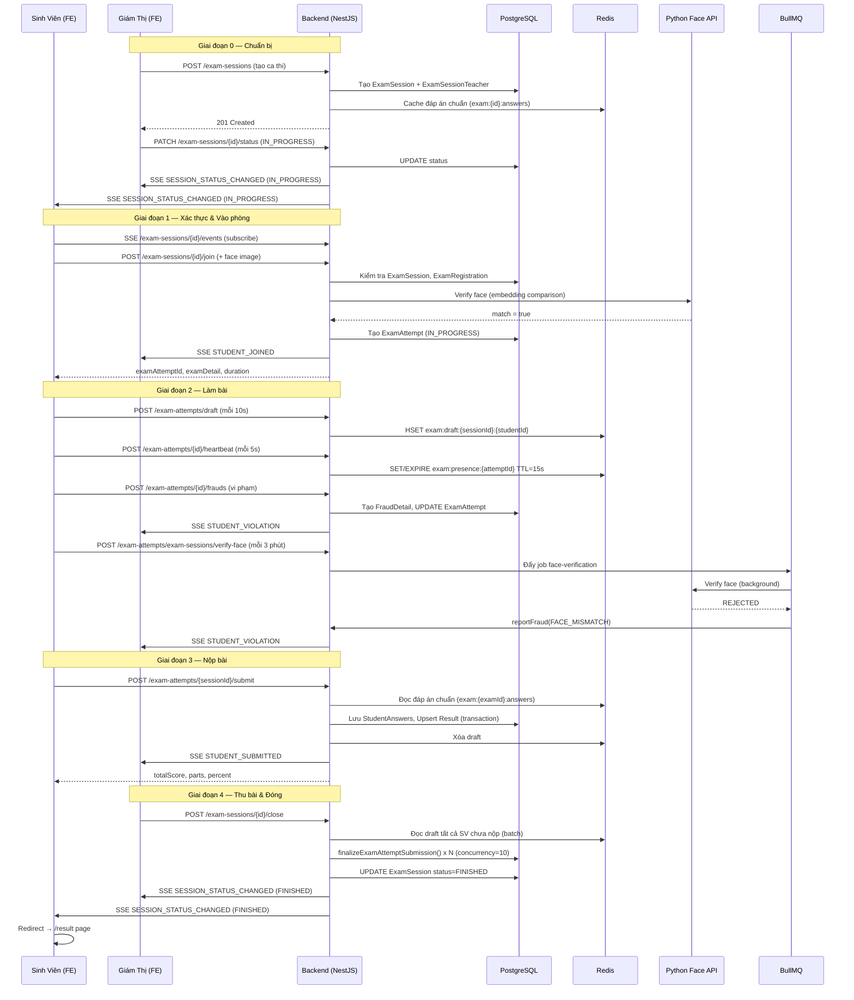

# 📋 Luồng Ca Thi (Exam Session Flow)

> **Tài liệu này mô tả toàn bộ luồng hoạt động của một ca thi trong hệ thống ITEST, từ giao diện người dùng (Frontend) đến xử lý nghiệp vụ (Backend), bao gồm cả các cơ chế realtime, chống gian lận và chấm điểm.**

---

## Mục Lục

1. [Tổng Quan Kiến Trúc](#1-tổng-quan-kiến-trúc)
2. [Giai Đoạn 0 — Chuẩn Bị Ca Thi (Admin)](#2-giai-đoạn-0--chuẩn-bị-ca-thi-admin)
3. [Giai Đoạn 1 — Xác Thực Khuôn Mặt & Vào Phòng Thi (Sinh Viên)](#3-giai-đoạn-1--xác-thực-khuôn-mặt--vào-phòng-thi-sinh-viên)
4. [Giai Đoạn 2 — Làm Bài Thi (Sinh Viên)](#4-giai-đoạn-2--làm-bài-thi-sinh-viên)
5. [Giai Đoạn 3 — Nộp Bài & Chấm Điểm](#5-giai-đoạn-3--nộp-bài--chấm-điểm)
6. [Giai Đoạn 4 — Giám Sát Realtime (Giáo Viên)](#6-giai-đoạn-4--giám-sát-realtime-giáo-viên)
7. [Giai Đoạn 5 — Kết Thúc & Đóng Ca Thi](#7-giai-đoạn-5--kết-thúc--đóng-ca-thi)
8. [Các Cơ Chế Nền](#8-các-cơ-chế-nền)
9. [Sơ Đồ Tổng Quan (Sequence Diagram)](#9-sơ-đồ-tổng-quan-sequence-diagram)
10. [Tham Chiếu File](#10-tham-chiếu-file)

---

## 1. Tổng Quan Kiến Trúc

```
┌──────────────────────────────────────────────────────────────────┐
│                        FRONTEND (Next.js)                         │
│  ┌──────────────┐   ┌─────────────────────┐   ┌───────────────┐ │
│  │ Student Pages│   │ Teacher Pages        │   │ Admin Pages   │ │
│  │  /student/   │   │  /teacher/           │   │  /admin/      │ │
│  │  examSession │   │  examSession/        │   │               │ │
│  │  verifyFace  │   │  monitorExam         │   │               │ │
│  │  takeExam    │   │                      │   │               │ │
│  └──────────────┘   └─────────────────────┘   └───────────────┘ │
│           │                    │                                   │
│    HTTP/SSE Requests     SSE Subscribe                            │
└───────────┼────────────────────┼──────────────────────────────────┘
            │                    │
┌───────────▼────────────────────▼──────────────────────────────────┐
│                      BACKEND (NestJS)                              │
│                                                                    │
│  ┌──────────────────┐  ┌─────────────────┐  ┌─────────────────┐  │
│  │ ExamSessionModule│  │ExamAttemptModule│  │FaceVerification │  │
│  │  - Controller    │  │  - Controller   │  │    Module       │  │
│  │  - Service       │  │  - Service      │  │  - Service      │  │
│  │  - SSE Service   │  │  - Repository   │  └─────────────────┘  │
│  └──────────────────┘  └─────────────────┘                        │
│           │                    │                                   │
│  ┌────────▼────────────────────▼──────────────────────────┐       │
│  │               Infrastructure Layer                      │       │
│  │  ┌──────────────┐  ┌──────────────┐  ┌─────────────┐  │       │
│  │  │  PostgreSQL  │  │    Redis     │  │  BullMQ     │  │       │
│  │  │  (Prisma ORM)│  │ (Cache/Draft │  │  (Queue)    │  │       │
│  │  │              │  │  /Presence)  │  │             │  │       │
│  │  └──────────────┘  └──────────────┘  └─────────────┘  │       │
│  └─────────────────────────────────────────────────────────┘       │
│                                                                    │
│  ┌──────────────────────────────────────────────────────────┐      │
│  │         External Services                                │      │
│  │   Face Verification Python API (Api_Face)               │      │
│  └──────────────────────────────────────────────────────────┘      │
└────────────────────────────────────────────────────────────────────┘
```

### Các Module BE liên quan

| Module | Vai trò |
|---|---|
| `exam-session` | Quản lý vòng đời ca thi (tạo, đổi trạng thái, join, đóng) |
| `exam-attempt` | Quản lý lượt thi của từng sinh viên (join, draft, submit, fraud) |
| `exam-session-handling` | Ghi nhận xử lý kỷ luật (cảnh cáo, đình chỉ) bởi giám thị |
| `face-verification` | Giao tiếp Python API để xác thực khuôn mặt |
| `queue` / `workers` | BullMQ: xử lý xác thực khuôn mặt bất đồng bộ |
| `exam-session-sse` | SSE (Server-Sent Events) realtime cho giám thị và sinh viên |
| `redis` | Cache đáp án chuẩn, draft bài làm, presence heartbeat |

---

## 2. Giai Đoạn 0 — Chuẩn Bị Ca Thi (Admin)

### Mô tả

Admin/Teacher tạo ca thi và cấu hình trước khi ca thi diễn ra.

### Luồng tạo ca thi

```
Admin FE
  │
  ├─ POST /exam-sessions
  │   Body: { examSetId, date, duration, room, teacherIds[], isCameraRequired }
  │
  └─▶ ExamSessionController.create()
        │
        ├─ 1. Lấy danh sách exam thuộc examSet
        ├─ 2. Tính TTL cache = (endTime + 2h) - now
        ├─ 3. Pre-cache đáp án chuẩn vào Redis
        │      Key: exam:{examId}:answers
        │      TTL: tính theo thời gian ca thi + 2h buffer
        ├─ 4. Tạo ExamSession record trong DB (transaction)
        └─ 5. Tạo ExamSessionTeacher records (gán giám thị)
```

### Trạng thái ca thi (ExamSessionStatus)

```
NOT_STARTED ──▶ IN_PROGRESS ──▶ FINISHED
                    │
                    ▼
                  PAUSE
                    │
                    ▼
               IN_PROGRESS
```

---

## 3. Giai Đoạn 1 — Xác Thực Khuôn Mặt & Vào Phòng Thi (Sinh Viên)

### 3.1 Trang Xác Thực Khuôn Mặt (FE)

**File:** `itest_fe/src/app/student/examSession/verifyFace/[examSessionId]/page.tsx`

```
Sinh viên truy cập /student/examSession/verifyFace/{examSessionId}
  │
  ├─ Load MediaPipe FaceMesh từ CDN
  ├─ Bật webcam (getUserMedia)
  ├─ Kết nối SSE để nhận trạng thái ca thi realtime
  │   └─ Nếu SESSION_STATUS_CHANGED → PAUSE: block không cho vào
  │
  ├─ Bước 1: Hướng dẫn quay mặt TRÁI
  ├─ Bước 2: Hướng dẫn quay mặt PHẢI
  ├─ Bước 3: Nhìn thẳng → tự động chụp ảnh
  │
  └─ Khi đủ điều kiện: gọi joinExam()
```

### 3.2 API Vào Phòng Thi

```
FE gọi: POST /exam-sessions/{examSessionId}/join
  Form-data: { face: File (nếu isCameraRequired = true) }

  │
  └─▶ ExamSessionController.joinExamSession()
        │
        ├─ Lấy clientIp từ request
        │
        └─▶ ExamSessionService.joinExamSession()
              │
              ├─ 1. Lấy studentCode từ studentId
              │
              ├─ 2. validateAndGetExamSessionData()
              │     ├─ Query DB: examSession + examRegistrations + examAttempts
              │     ├─ Kiểm tra ca thi phải đang IN_PROGRESS
              │     ├─ Kiểm tra sinh viên có trong danh sách đăng ký (REGISTERED)
              │     └─ Kiểm tra isAccessGranted !== false
              │
              ├─ 3. [Nếu isCameraRequired] handleFaceVerification()
              │     ├─ Lấy faceEmbedding đã đăng ký từ Profile
              │     ├─ Gọi FaceVerificationService.verifyFace() → Python API
              │     ├─ Nếu FAIL: cập nhật faceVerificationResult = FAILED
              │     │           throw BadRequestException
              │     └─ Nếu PASS: cập nhật faceVerificationResult = PASSED
              │
              ├─ 4. Phân nhánh theo trạng thái examAttempt:
              │
              │   [KHÔNG CÓ examAttempt — Lần đầu vào thi]
              │   └─▶ handleFirstTimeJoin()
              │         ├─ ExamShuffleHelper.generateExamVariants() → random đề
              │         ├─ ExamAttemptService.create() → tạo ExamAttempt (IN_PROGRESS)
              │         ├─ SSE emit: STUDENT_JOINED → thông báo cho giám thị
              │         └─ Trả về: { examAttemptId, examDetail, duration, ... }
              │
              │   [CÓ examAttempt với status = DISCONNECTED — Vào lại sau mất mạng]
              │   └─▶ handleResumeExam()
              │         ├─ Lấy examDetail theo examId cũ (đề cũ, không random lại)
              │         ├─ ExamShuffleHelper.shuffleExam() → hoán vị theo examCode
              │         ├─ Cập nhật examAttempt: status = IN_PROGRESS, ip mới
              │         ├─ Đọc draft answers từ Redis (cachedSubmission)
              │         ├─ SSE emit: STUDENT_JOINED
              │         └─ Trả về: { ..., cachedSubmission } (bài làm cũ)
              │
              └─▶ FE nhận response, lưu vào Zustand Store
                   Chuyển hướng: /student/examSession/takeExam/{examSessionId}
                                  ?examId=...&examAttemptId=...
```

---

## 4. Giai Đoạn 2 — Làm Bài Thi (Sinh Viên)

### 4.1 Trang Làm Bài (FE)

**File:** `itest_fe/src/app/student/examSession/takeExam/[id]/page.tsx`

```
/student/examSession/takeExam/{examSessionId}
  │
  ├─ Nguồn dữ liệu đề thi:
  │   1. Zustand Store (từ join response) — ưu tiên
  │   2. API GET /exams/{examId} (fallback khi F5)
  │
  ├─ Nguồn bài làm cũ (khi reload):
  │   1. localStorage: exam_progress_{examSessionId}
  │   2. storeExamData.cachedSubmission (từ BE khi reconnect)
  │   → Chọn cái nào có nhiều câu trả lời hơn
  │
  ├─ Kết nối SSE Student: GET /exam-sessions/{id}/student-events/{studentId}
  │   → Nhận events: RETAKE_GRANTED, proctoring handle,...
  │
  ├─ Render giao diện: Tab theo phần (Part), câu hỏi trắc nghiệm + tự luận
  │
  └─ Hooks chạy ngầm:
      ├─ useExamTimer        → đếm ngược thời gian
      ├─ useExamAutoSave     → tự động lưu draft mỗi 10s
      ├─ useExamSecurity     → heartbeat, phát hiện gian lận, chụp khuôn mặt
      ├─ useExamFullscreen   → phát hiện thoát fullscreen
      ├─ useExamNetwork      → phát hiện mất mạng
      └─ useExamSSE          → nhận sự kiện realtime từ giám thị
```

### 4.2 Auto-Save Draft (Mỗi 10 giây)

**File:** `itest_fe/src/app/student/examSession/takeExam/(hooks)/useExamAutoSave.ts`

```
FE (mỗi 10 giây)
  ├─ So sánh userAnswers hiện tại với lần lưu trước
  ├─ Nếu có thay đổi: POST /exam-attempts/draft
  │   Body: { examSessionId, changes: [{questionId, answer, ...}] }
  │
  └─▶ ExamAttemptController.saveDraft()
        └─▶ ExamAttemptService.saveDraft()
              ├─ 1. Kiểm tra ca thi đang IN_PROGRESS
              ├─ 2. Tính TTL = endTime - now (+ 2h buffer)
              ├─ 3. Build draftHashFields: key = "qid:{questionId}"
              ├─ 4. HSET vào Redis Hash: exam:draft:{examSessionId}:{studentId}
              └─ 5. Cập nhật TTL cho hash key
```

> **Redis Hash Draft:** Mỗi câu hỏi là 1 field trong hash. HSET overwrite câu cũ nếu đã tồn tại → luôn giữ bản mới nhất.

### 4.3 Heartbeat (Mỗi 5 giây)

**File:** `itest_fe/src/app/student/examSession/takeExam/(hooks)/useExamSecurity.ts`

```
FE (mỗi 5 giây)
  └─ POST /exam-attempts/{examAttemptId}/heartbeat
      │
      └─▶ ExamAttemptService.heartbeat()
            ├─ Lấy Redis key: exam:presence:{attemptId}
            │
            ├─ [Lần đầu] SET presence với TTL = 15s
            │
            └─ [Đã có] EXPIRE reset TTL về 15s
                  └─ [IP thay đổi] reportFraud(IP_CHANGED)
                  └─ [Status = DISCONNECTED] cập nhật IN_PROGRESS + SSE notify ATTEMPT_RESUMED
```

**Cơ chế phát hiện mất kết nối:**

```
Redis TTL expire (sau 15s không heartbeat)
  └─▶ ExamAttemptService.onModuleInit() — Redis keyevent subscriber
        └─▶ handlePresenceExpired(attemptId)
              ├─ Kiểm tra attempt status = IN_PROGRESS
              ├─ reportFraud(NETWORK_DISRUPTION)
              └─ SSE emit: ATTEMPT_DISCONNECTED → giám thị nhận được
```

### 4.4 Phát Hiện Gian Lận (Browser Events)

**File:** `itest_fe/src/app/student/examSession/takeExam/(hooks)/useExamSecurity.ts`

| Hành vi | FraudType | Cách phát hiện |
|---|---|---|
| Chuyển tab | `TAB_SWITCHING` | `visibilitychange` event |
| Rời cửa sổ | `WINDOW_BLUR` | `blur` event |
| Mất mạng | `NETWORK_DISRUPTION` | `offline` event |
| Thoát fullscreen | Configurable | `fullscreenchange` event |
| Khuôn mặt không khớp | `FACE_MISMATCH` | Camera capture → Python API |
| Đổi IP | `IP_CHANGED` | So sánh IP trong heartbeat |

```
FE phát hiện vi phạm
  └─ POST /exam-attempts/{examAttemptId}/frauds
      Body: { fraudType: "TAB_SWITCHING" }
      │
      └─▶ ExamAttemptService.reportFraud()
            ├─ Tăng warningCount
            ├─ Tính fraudLevel: LOW(>=2), MEDIUM(>=3), HIGH(>=5)
            ├─ [NETWORK_DISRUPTION] → status = DISCONNECTED
            ├─ Tạo FraudDetail record trong DB (transaction)
            ├─ Cập nhật ExamAttempt (warningCount, fraudLevel, status)
            └─ SSE emit: STUDENT_VIOLATION → giám thị thấy ngay
```

### 4.5 Giám Sát Khuôn Mặt Định Kỳ (Camera)

**File:** `itest_fe/src/app/student/examSession/takeExam/(hooks)/useExamSecurity.ts`

```
FE (sau 1 phút đầu, sau đó mỗi 3 phút)
  ├─ Chụp frame từ video element
  ├─ Encode sang JPEG blob
  └─ POST /exam-attempts/exam-sessions/verify-face (multipart/form-data)
      Body: { examAttemptId, face: File, occurredAt: Date }
      │
      └─▶ ExamAttemptService.verifyFacePeriodically()
            ├─ Validate file size (max 50KB)
            ├─ Kiểm tra attempt đang IN_PROGRESS
            └─▶ FaceVerificationProducer.faceVerification()
                  └─ Đẩy job vào BullMQ Queue
                      (imageBuffer base64, accountId, occurredAt)

                  BullMQ Worker (xử lý bất đồng bộ)
                  └─▶ FaceVerificationProcessor.process()
                        ├─ Decode base64 → Buffer
                        ├─ Lấy faceEmbedding từ Profile DB
                        ├─ Gọi Python Face API để so sánh
                        ├─ CONFIRMED → bỏ qua
                        ├─ NEEDS_REVIEW → log warning
                        └─ REJECTED → reportFraud(FACE_MISMATCH) + SSE notify
```

---

## 5. Giai Đoạn 3 — Nộp Bài & Chấm Điểm

### 5.1 Sinh Viên Chủ Động Nộp Bài

**File:** `itest_fe/src/app/student/examSession/takeExam/(hooks)/useExamSubmit.ts`

```
Sinh viên bấm "NỘP BÀI THI" hoặc đồng hồ hết giờ
  │
  ├─ [Tự nộp] Modal xác nhận → OK
  ├─ [Hết giờ] Auto submit (bypass modal)
  │
  ├─ Xóa localStorage: exam_endtime_*, exam_progress_*
  ├─ Format answers: { questionId, answer, file_urls }
  │
  └─ POST /exam-attempts/{examSessionId}/submit
      Body: { answers: [{questionId, answer, file_urls}] }
      │
      └─▶ ExamAttemptController.submitExam()
            └─▶ ExamAttemptService.studentSubmitExam()
                  │
                  ├─ 1. Kiểm tra attempt status = IN_PROGRESS
                  ├─ 2. Kiểm tra examSession status = IN_PROGRESS
                  │
                  ├─ 3. Lấy đáp án chuẩn (questionAnswers):
                  │     ├─ Thử đọc từ Redis cache: exam:{examId}:answers
                  │     └─ Fallback: query DB (QuestionAnswerService)
                  │
                  └─▶ finalizeExamAttemptSubmission()
                        ├─ Chuẩn hóa câu trả lời (normalizeAnswers)
                        ├─ calculateScore():
                        │   ├─ Map userAnswer theo questionId
                        │   ├─ So sánh từng câu với correctAnswer
                        │   ├─ Tính totalScore, totalCorrect, parts[]
                        │   └─ [Có câu tự luận] → resultStatus = NOT_GRADED
                        │      [Không tự luận]  → resultStatus = PUBLISHED
                        │
                        ├─ Lưu StudentAnswers vào DB (best-effort)
                        │
                        ├─ DB Transaction:
                        │   ├─ UPDATE ExamAttempt: status=COMPLETED, endTime=now
                        │   └─ UPSERT Result: { scoreDetail, status }
                        │
                        ├─ SSE emit: STUDENT_SUBMITTED → giám thị
                        └─ Xóa draft Redis: exam:draft:{examSessionId}:{studentId}
                        │
                        └─ FE: chuyển hướng đến /student/.../result
```

### 5.2 Điểm Số (ScoreDetail Structure)

```json
{
  "totalScore": 8.5,
  "totalCorrect": 17,
  "totalQuestions": 20,
  "maxScore": 10,
  "percent": 85.00,
  "parts": [
    { "partIndex": 1, "score": 4.5, "correct": 9, "totalQuestions": 10 },
    { "partIndex": 2, "score": 4.0, "correct": 8, "totalQuestions": 10 }
  ]
}
```

---

## 6. Giai Đoạn 4 — Giám Sát Realtime (Giáo Viên)

### 6.1 Trang Giám Sát

**File:** `itest_fe/src/app/teacher/examSession/monitorExam/[id]/`

```
Giáo viên truy cập trang giám sát ca thi
  └─ Kết nối SSE: GET /exam-sessions/{examSessionId}/events
      (persistent HTTP connection, text/event-stream)
      │
      └─▶ ExamSessionController.streamEvents()
            └─▶ ExamSessionSseService.subscribeToSession(examSessionId)
                  └─ Trả về Observable<ExamSessionEvent>
                      (push events realtime đến teacher)
```

### 6.2 Các SSE Events và Ý Nghĩa

#### Teacher Channel (broadcast — tất cả giám thị của ca thi nhận được)

| Event Type | Mô tả | Trigger bởi |
|---|---|---|
| `STUDENT_JOINED` | Sinh viên vào phòng thi | `joinExamSession()` |
| `STUDENT_SUBMITTED` | Sinh viên nộp bài | `studentSubmitExam()` |
| `STUDENT_VIOLATION` | Sinh viên có vi phạm | `reportFraud()` |
| `TEACHER_COLLECTED` | Giáo viên thu bài 1 SV | `forceSubmit()` |
| `SESSION_STATUS_CHANGED` | Trạng thái ca thi thay đổi | `changeStatus()` / `closeExamSession()` |
| `ATTEMPT_PAUSED` | Bài thi bị tạm dừng | `pauseExamSession()` / `pauseExamAttempt()` |
| `ATTEMPT_RESUMED` | Bài thi được tiếp tục | `resumeExamSession()` / heartbeat reconnect |
| `ATTEMPT_DISCONNECTED` | Sinh viên mất kết nối | Redis presence expire |
| `TIME_WARNING` | Cảnh báo thời gian | Scheduled task |

#### Student Channel (isolated — chỉ đúng sinh viên đó nhận)

| Event Type | Mô tả |
|---|---|
| `RETAKE_GRANTED` | Giáo viên cấp quyền thi lại |
| `WARNING` | Cảnh cáo từ giáo viên |
| `SUSPENSION` | Đình chỉ thi |
| `REPRIMAND` | Khiển trách |

### 6.3 Các Thao Tác Giám Thị

#### Tạm Dừng / Tiếp Tục Ca Thi (toàn bộ)

```
Teacher FE
  └─ PATCH /exam-sessions/{examSessionId}/pause-state
      Body: { isPaused: true }
      │
      └─▶ ExamSessionService.pauseExamSession()
            ├─ Raw SQL UPDATE exam_attempts SET status='PAUSE'
            │   tính consumedTime tại thời điểm pause
            ├─ UPDATE ExamSession: status = PAUSE
            └─ SSE emit: ATTEMPT_PAUSED (kèm danh sách updatedAttempts)
               → FE sinh viên: hiện màn hình "BÀI THI ĐANG TẠM DỪNG"
```

#### Tạm Dừng Riêng 1 Sinh Viên

```
Teacher FE
  └─ PATCH /exam-attempts/{examSessionId}/{studentId}/pause-state
      Body: { isPaused: true }
      │
      └─▶ ExamAttemptService.setPauseState() → pauseExamAttempt()
            ├─ Tính consumedTime
            ├─ UPDATE ExamAttempt: status='PAUSE', consumedTime
            └─ SSE emit: ATTEMPT_PAUSED (chỉ studentId đó)
```

#### Thu Bài (Force Submit)

```
Teacher FE
  └─ POST /exam-attempts/{examSessionId}/force-submit/selected
      Body: { studentCodes: [...], studentIds: [...] }
      │
      └─▶ ExamAttemptService.forceSubmitExamAttempts()
            ├─ Validate: SV có trong danh sách đăng ký không?
            ├─ Validate: attempt phải ở trạng thái submittable?
            │   (IN_PROGRESS | DISCONNECTED | PAUSE)
            │
            └─▶ forceSubmitCandidates() (concurrency limit = 10)
                  ├─ Đọc draft answers từ Redis (batch)
                  ├─ Pre-fetch đáp án chuẩn theo examId (batch)
                  └─ Với mỗi SV: processSingleForceSubmit()
                        ├─ Tính consumedTime
                        ├─ finalizeExamAttemptSubmission()
                        ├─ SSE emit: TEACHER_COLLECTED → SV đó chuyển trang kết quả
                        └─ Xóa draft Redis
```

#### Cấp Quyền Thi Lại

```
Teacher FE
  └─ PATCH /exam-attempts/retake-permission
      Body: { examSessionId, studentId, studentCode }
      │
      └─▶ ExamAttemptService.enableRetakePermission()
            ├─ Kiểm tra ca thi IN_PROGRESS, SV đã đăng ký
            ├─ DB Transaction:
            │   ├─ DELETE Result cũ
            │   ├─ DELETE StudentAnswers cũ
            │   └─ UPDATE ExamAttempt: examId mới (random), status=IN_PROGRESS,
            │                          warningCount=0, startTime=now
            ├─ Xóa draft Redis cũ
            └─ SSE emit: RETAKE_GRANTED → student channel
               → FE sinh viên: xóa bài cũ, load đề mới
```

#### Xử Lý Kỷ Luật (Warning / Suspension / Reprimand)

```
Teacher FE
  └─ POST /exam-session-handlings/{examAttemptId}
      Body: { type: "WARNING" | "SUSPENSION" | "REPRIMAND" }
      │
      └─▶ ExamSessionHandlingService.create()
            ├─ Lưu ExamSessionHandling record
            └─ SSE emit: ProctoringHandleType → student channel riêng
               → FE sinh viên:
                  ├─ WARNING: hiện cảnh báo đỏ
                  └─ SUSPENSION/REPRIMAND: tự động nộp bài sau 2s
```

---

## 7. Giai Đoạn 5 — Kết Thúc & Đóng Ca Thi

### 7.1 Đóng Ca Thi

```
Teacher FE
  └─ POST /exam-sessions/{examSessionId}/close
      │
      └─▶ ExamSessionService.closeExamSession()
            ├─ 1. Kiểm tra ca thi đang IN_PROGRESS
            ├─ 2. Lấy tất cả submittable attempts (IN_PROGRESS | DISCONNECTED | PAUSE)
            ├─ 3. [Còn SV chưa nộp] closeOneAttempt() với concurrency = 10
            │     └─ Với mỗi attempt:
            │         ├─ Đọc draft từ Redis
            │         ├─ finalizeExamAttemptSubmission() (chấm điểm + lưu)
            │         └─ Xóa draft Redis
            ├─ 4. UPDATE ExamSession: status = FINISHED
            ├─ 5. SSE emit: SESSION_STATUS_CHANGED (FINISHED)
            │     → Tất cả SV chuyển về trang kết quả
            └─ 6. SSE closeSession() → đóng tất cả kết nối
```

### 7.2 Chuyển Hướng Kết Quả (FE)

```
Sinh viên nhận SSE SESSION_STATUS_CHANGED(FINISHED) hoặc TEACHER_COLLECTED
  │
  ├─ Lưu scoreData vào Zustand Store và localStorage
  ├─ Xóa exam_progress_* và exam_endtime_* khỏi localStorage
  └─ Router.replace: /student/examSession/takeExam/{id}/result
```

---

## 8. Các Cơ Chế Nền

### 8.1 Caching Chiến Lược (Redis)

| Key Pattern | Nội dung | TTL |
|---|---|---|
| `exam:{examId}:answers` | Đáp án chuẩn của đề thi | endTime + 2h |
| `exam:draft:{sessionId}:{studentId}` | Redis Hash bài nháp SV | endTime + 2h |
| `exam:presence:{attemptId}` | Heartbeat presence | 15 giây |

### 8.2 BullMQ Queue — Face Verification

```
Queue Name: FACE_VERIFICATION_QUEUE
Default Options:
  - attempts: 3 (retry khi fail)
  - backoff: exponential (tránh retry dồn dập)
  - timeout: 5 phút
  - removeOnComplete: giữ 100 job gần nhất
  - removeOnFail: giữ 7 ngày
  - concurrency: 50 (job song song)
  - lockDuration: env.QUEUE_LOCK_DURATION_MS
```

### 8.3 SSE Architecture

```
ExamSessionSseService (In-Memory)
  │
  ├─ sessions: Map<examSessionId, { subject: Subject<Event>, subscriberCount }>
  │   → Teacher channel (broadcast)
  │
  └─ studentChannels: Map<"{sessionId}:{studentId}", SessionState>
      → Student channel (isolated)

Lifecycle:
  - Subscribe khi FE kết nối (subscriberCount++)
  - Cleanup khi FE disconnect (subscriberCount--)
  - Xóa khỏi Map khi subject.closed && subscriberCount === 0
  - closeSession() khi ca thi kết thúc → complete() subject
```

### 8.4 Exam Shuffle (Bảo Mật Đề)

```
ExamShuffleHelper.generateExamVariants()
  ├─ Input: parts[], examCodes[]
  └─ Output: mảng đề đã hoán vị câu hỏi theo examCode

ExamShuffleHelper.shuffleExam()
  ├─ Input: parts[], examCode (cố định)
  └─ Output: đề đã hoán vị xác định (deterministic theo code)

→ Mỗi SV nhận 1 đề random khác nhau
→ Khi reconnect, SV nhận lại đúng đề cũ (theo examId đã lưu)
```

---

## 9. Sơ Đồ Tổng Quan (Sequence Diagram)



---

## 10. Tham Chiếu File

### Frontend

| File | Mô tả |
|---|---|
| `itest_fe/src/app/student/examSession/verifyFace/[examSessionId]/page.tsx` | Trang xác thực khuôn mặt trước khi vào thi |
| `itest_fe/src/app/student/examSession/takeExam/[id]/page.tsx` | Trang làm bài thi chính |
| `itest_fe/src/app/student/examSession/takeExam/(hooks)/useExamAutoSave.ts` | Hook tự động lưu draft mỗi 10s |
| `itest_fe/src/app/student/examSession/takeExam/(hooks)/useExamSecurity.ts` | Hook heartbeat, phát hiện gian lận, chụp ảnh |
| `itest_fe/src/app/student/examSession/takeExam/(hooks)/useExamSubmit.ts` | Hook xử lý nộp bài (tự nộp + auto-submit) |
| `itest_fe/src/app/student/examSession/takeExam/(hooks)/useExamTimer.ts` | Hook đếm ngược thời gian |
| `itest_fe/src/app/teacher/examSession/monitorExam/` | Trang giám sát của giáo viên |

### Backend

| File | Mô tả |
|---|---|
| `itest_be/src/modules/exam-session/controllers/exam-session.controller.ts` | REST + SSE endpoints cho ca thi |
| `itest_be/src/modules/exam-session/services/exam-session.service.ts` | Business logic: join, close, pause/resume ca thi |
| `itest_be/src/modules/exam-session/services/exam-session-sse.service.ts` | Quản lý SSE channels và emit events |
| `itest_be/src/modules/exam-attempt/controllers/exam-attempt.controller.ts` | REST endpoints cho lượt thi |
| `itest_be/src/modules/exam-attempt/services/exam-attempt.service.ts` | Business logic: draft, submit, fraud, heartbeat, score |
| `itest_be/src/modules/workers/face-verification.processor.ts` | BullMQ worker xử lý xác thực khuôn mặt |
| `itest_be/src/modules/exam-session-handling/controllers/exam-session-handling.controller.ts` | Endpoints xử lý kỷ luật (warning, suspension) |
| `itest_be/src/config/queue.config.ts` | Cấu hình BullMQ Queue và Worker |

---

*Tài liệu được tạo tự động từ source code — Cập nhật lần cuối: 2026-08-28*
