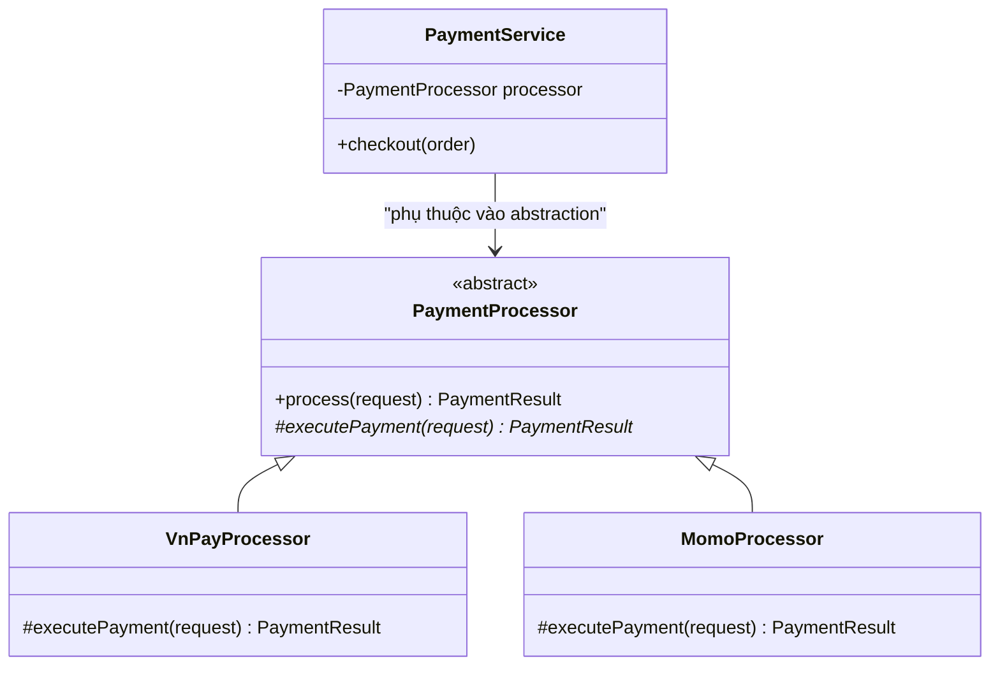
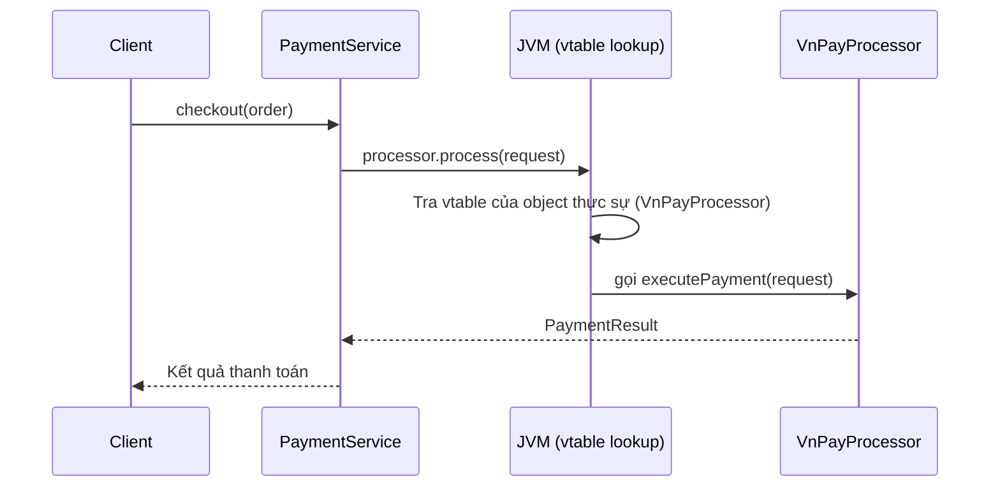
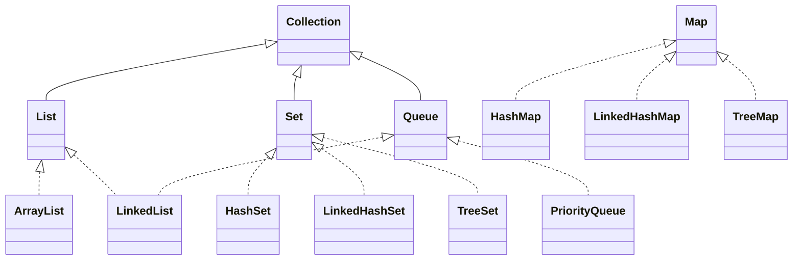
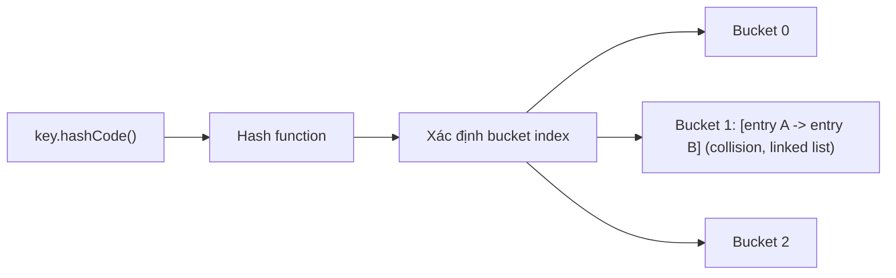
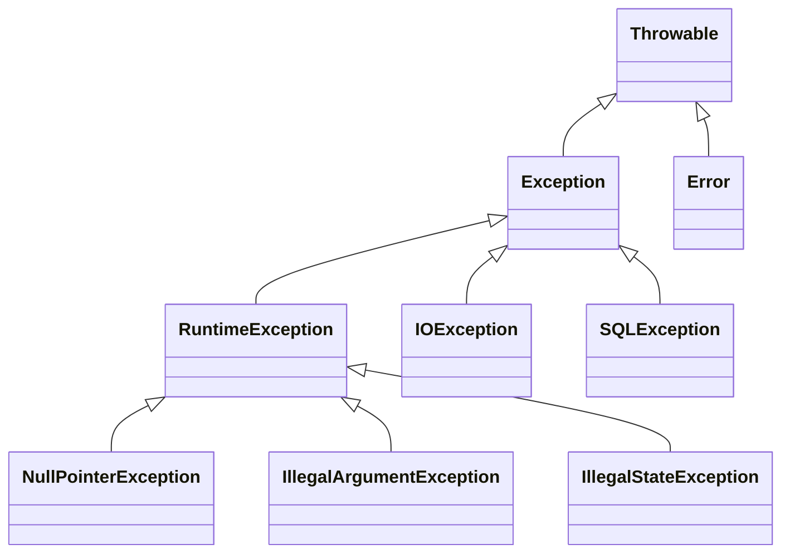
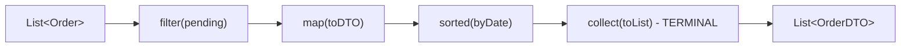
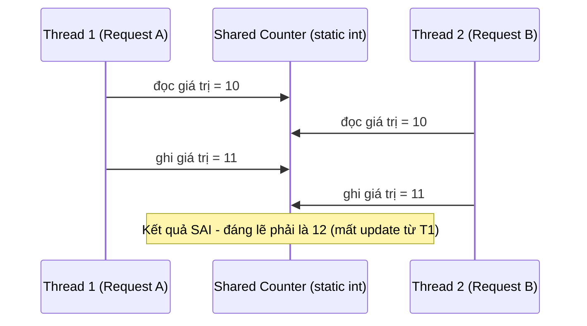

# CHƯƠNG 1: JAVA CORE

> Tài liệu đào tạo Java Backend Developer — dành cho người đã có nền tảng Backend (Node.js/Express/NestJS), chuyển sang hệ sinh thái Java/Spring Boot.

---

## 1. Giới thiệu

Nếu bạn đến từ NodeJS/NestJS, bạn đã quen với runtime đơn luồng non-blocking I/O, typing động (hoặc TypeScript typing tĩnh nhưng bị xoá lúc runtime), và một hệ sinh thái package cực kỳ linh hoạt (npm). Java giải quyết bài toán "xây dựng hệ thống backend enterprise, chạy hàng chục năm, hàng trăm developer cùng maintain" bằng một triết lý gần như đối lập:

- **Static typing thật sự** — type tồn tại ở runtime (qua bytecode), không bị erase như TS compile sang JS.
- **JVM (Java Virtual Machine)** — Java không chạy trực tiếp trên OS, mà chạy trên một máy ảo có GC, JIT compiler, memory model riêng. Đây là lý do "Write Once, Run Anywhere".
- **Multithreading thật (OS-level threads)** — khác hẳn Event Loop của Node. Java xử lý concurrency bằng thread pool thật, đòi hỏi hiểu rõ về race condition, synchronization.
- **Đóng gói + tính kỷ luật cao** — Java ép bạn viết code theo OOP nghiêm ngặt, mọi thứ (trừ primitive) đều là object, mọi file `.java` gắn với 1 class public.

Chương này sẽ không dạy bạn "lập trình là gì" — bạn đã biết. Chương này dạy bạn **Java suy nghĩ khác NodeJS như thế nào**, và cách khai thác đúng các cơ chế đặc trưng của Java để sau này đọc hiểu source code Spring Boot mà không bị choáng ngợp bởi annotation, generic, reflection.

---

## 2. Kiến thức

### 2.1. Kiểu dữ liệu và biến (Type System)

**Khái niệm**: Java có 2 nhóm kiểu dữ liệu:
- **Primitive types**: `byte, short, int, long, float, double, boolean, char` — lưu trực tiếp giá trị trên stack (hoặc trong object nếu là field), không phải object, không có method, không thể `null`.
- **Reference types**: `String, Integer, List, Object`, mọi class tự định nghĩa — biến chỉ lưu **địa chỉ tham chiếu** tới object nằm trên heap, có thể `null`.

**Tại sao cần phân biệt**: Đây là khác biệt lớn nhất với JS (nơi mọi thứ ngoại trừ primitive JS type đều "giống nhau" về mặt tham chiếu). Trong Java, việc chọn `int` hay `Integer` ảnh hưởng trực tiếp tới performance (boxing/unboxing), khả năng `null`, và việc dùng trong Collection (Collection chỉ chứa được reference type, không chứa được primitive — đây là lý do `List<Integer>` tồn tại chứ không phải `List<int>`).

**Cách hoạt động bên trong**:
- Primitive nằm trực tiếp trong stack frame (nếu là local variable) → truy cập cực nhanh, không qua GC.
- Wrapper class (`Integer`, `Long`, `Boolean`...) là object thật trên heap. Java tự động **autoboxing** (`int` → `Integer`) và **unboxing** (`Integer` → `int`) khi cần, nhưng đây là nguồn gốc của rất nhiều bug hiệu năng và `NullPointerException` (NPE) nếu unbox một `Integer` đang là `null`.
- Java cache sẵn các `Integer` từ **-128 đến 127** (Integer Cache) — đây là lý do một số so sánh `==` giữa các `Integer` nhỏ cho ra kết quả "đúng" một cách tình cờ, nhưng là **anti-pattern** nếu dựa vào đó.

**Cú pháp**:

```java
// Primitive - lưu giá trị trực tiếp
int quantity = 10;
double price = 199.99;
boolean isActive = true;

// Reference type - lưu địa chỉ tham chiếu tới object trên heap
Integer stock = 10;          // autoboxing: int -> Integer
Integer nullableStock = null; // hợp lệ vì là object

// Bug kinh điển khi chuyển từ primitive dùng trong Collection sang so sánh
Integer a = 200;
Integer b = 200;
System.out.println(a == b);        // false! (ngoài vùng cache -128..127, so sánh địa chỉ)
System.out.println(a.equals(b));   // true (so sánh giá trị) - LUÔN dùng equals() cho reference type

// Bug NPE kinh điển khi unboxing
Integer count = null;
int result = count + 1; // NullPointerException lúc runtime, compiler KHÔNG báo lỗi
```

**Best Practices**:
- Luôn dùng primitive (`int`, `boolean`...) cho biến local, field không thể `null`, và các phép tính hiệu năng cao.
- Dùng wrapper class (`Integer`, `Long`...) khi cần đại diện cho "giá trị có thể chưa xác định" — ví dụ field trong Entity JPA ánh xạ cột DB có thể `NULL`.
- So sánh giá trị của reference type luôn dùng `.equals()`, không dùng `==`.
- Với String, dùng `.equals()` — String trong Java là **immutable** và được lưu trong **String Pool** (một vùng nhớ đặc biệt để tái sử dụng literal), nên `==` đôi khi "đúng" do String Pool cache, nhưng vẫn là anti-pattern.

**Sai lầm thường gặp**:
- So sánh 2 object bằng `==` thay vì `.equals()`.
- Dùng `Integer`/`Long` cho counter trong vòng lặp hiệu năng cao → boxing/unboxing liên tục làm chậm chương trình đáng kể.
- Không kiểm tra `null` trước khi unbox một wrapper type từ DB/API response, dẫn tới NPE mơ hồ khó debug.

---

### 2.2. Lập trình hướng đối tượng (OOP) trong Java

Đây là phần **quan trọng nhất** để hiểu Spring Boot, vì toàn bộ Spring Framework được xây dựng trên nguyên lý OOP + Design Pattern.

#### 2.2.1. Encapsulation (Đóng gói)

**Khái niệm**: Ẩn dữ liệu nội bộ của object (field) khỏi thế giới bên ngoài, chỉ cho phép truy cập/thay đổi thông qua method công khai (getter/setter, hoặc method nghiệp vụ).

**Tại sao cần**: Trong NestJS bạn có thể dùng `private` (TypeScript) nhưng đó chỉ là kiểm tra compile-time — object JS bên dưới vẫn "phẳng". Java thực thi encapsulation ở **cấp bytecode**: field `private` thực sự không thể truy cập từ ngoài class, kể cả qua reflection thông thường (trừ khi ép `setAccessible(true)`).

**Cách hoạt động**: Java có 4 access modifier: `private` (chỉ trong class), package-private/default (chỉ trong package), `protected` (package + subclass), `public` (mọi nơi). Việc chọn đúng access modifier là một phần thiết kế API quan trọng — nó là "hợp đồng" (contract) bạn cam kết với người dùng class của mình.

**Cú pháp**:

```java
public class Order {
    private final String orderId;
    private OrderStatus status;   // không cho phép set trực tiếp từ ngoài
    private BigDecimal totalAmount;

    public Order(String orderId, BigDecimal totalAmount) {
        this.orderId = orderId;
        this.totalAmount = totalAmount;
        this.status = OrderStatus.PENDING;
    }

    // Không có setStatus() public tùy tiện — nghiệp vụ chuyển trạng thái
    // phải đi qua method có validate, tránh set trạng thái tùy tiện gây sai nghiệp vụ
    public void confirm() {
        if (this.status != OrderStatus.PENDING) {
            throw new IllegalStateException(
                "Chỉ có thể confirm đơn hàng đang ở trạng thái PENDING, hiện tại: " + this.status);
        }
        this.status = OrderStatus.CONFIRMED;
    }

    public OrderStatus getStatus() {
        return status;
    }
}
```

**Best Practices**:
- Field mặc định luôn `private`. Chỉ mở rộng ra `protected`/`public` khi có lý do rõ ràng (ví dụ base class cho inheritance).
- Không tạo setter "trần" (`setStatus(OrderStatus s)`) cho các field mang tính nghiệp vụ (business invariant) — hãy expose method nghiệp vụ (`confirm()`, `cancel()`, `ship()`) để đảm bảo transition hợp lệ.
- Field nào không đổi sau khi khởi tạo → khai báo `final`.

**Anti-pattern**: "Anemic Domain Model" — class chỉ có toàn `private` field + getter/setter trần, không có method nghiệp vụ nào, mọi logic đẩy hết sang Service layer. Đây là pattern rất phổ biến (và bị nhiều Senior Java Developer phê phán) vì nó phá vỡ nguyên lý encapsulation, biến Entity thành "túi dữ liệu" (data bag) thay vì object thực sự.

#### 2.2.2. Inheritance (Kế thừa) & Polymorphism (Đa hình)

**Khái niệm**: Kế thừa cho phép 1 class (subclass) tái sử dụng field/method từ 1 class khác (superclass) qua từ khóa `extends`. Đa hình cho phép gọi cùng 1 method nhưng hành vi thực thi khác nhau tùy vào object thực sự lúc runtime (runtime polymorphism qua **method overriding**), hoặc cùng tên method nhưng khác tham số (compile-time polymorphism qua **method overloading**).

**Khi nào dùng kế thừa**: Khi có quan hệ "IS-A" thật sự và rõ ràng (VD: `AdminUser extends User`). Trong thực tế enterprise, kế thừa bị lạm dụng rất nhiều — nguyên tắc kinh điển là **"Favor composition over inheritance"** (ưu tiên kết hợp thành phần thay vì kế thừa).

**Khi nào KHÔNG nên dùng**: Khi quan hệ chỉ là "HAS-A" (VD: `Order` có `Customer`, không phải `Order extends Customer`), hoặc khi bạn kế thừa chỉ để "tái sử dụng code" mà không có quan hệ ngữ nghĩa IS-A thật sự — đây là nguồn gốc của hệ thống class hierarchy rối rắm, khó maintain (fragile base class problem: sửa class cha ảnh hưởng không lường trước tới toàn bộ subclass).

**Cách hoạt động bên trong**: Java thực hiện **dynamic dispatch (virtual method invocation)** — khi bạn gọi `animal.makeSound()`, JVM không quyết định method nào chạy lúc compile-time, mà tra bảng **vtable (method table)** gắn với object thực sự lúc runtime để tìm implementation đúng. Đây chính là cơ chế cho phép Spring tiêm (inject) một implementation cụ thể vào biến khai báo kiểu interface.

**Cú pháp**:

```java
public abstract class PaymentProcessor {
    // Template method pattern - khung xử lý chung, chi tiết để subclass tự quyết
    public final PaymentResult process(PaymentRequest request) {
        validate(request);
        PaymentResult result = executePayment(request);
        logTransaction(request, result);
        return result;
    }

    protected void validate(PaymentRequest request) {
        if (request.amount().compareTo(BigDecimal.ZERO) <= 0) {
            throw new InvalidPaymentException("Số tiền thanh toán phải lớn hơn 0");
        }
    }

    // Method trừu tượng - bắt buộc subclass override
    protected abstract PaymentResult executePayment(PaymentRequest request);

    private void logTransaction(PaymentRequest request, PaymentResult result) {
        System.out.printf("Transaction %s: %s%n", request.orderId(), result.status());
    }
}

public class VnPayProcessor extends PaymentProcessor {
    @Override
    protected PaymentResult executePayment(PaymentRequest request) {
        // Gọi API VNPay thực tế ở đây
        return new PaymentResult(request.orderId(), PaymentStatus.SUCCESS);
    }
}

public class MomoProcessor extends PaymentProcessor {
    @Override
    protected PaymentResult executePayment(PaymentRequest request) {
        // Gọi API Momo thực tế ở đây
        return new PaymentResult(request.orderId(), PaymentStatus.SUCCESS);
    }
}
```

```java
// Runtime polymorphism trong thực tế - đây chính là cơ chế Dependency Injection dựa vào
PaymentProcessor processor = paymentMethod.equals("VNPAY")
        ? new VnPayProcessor()
        : new MomoProcessor();

processor.process(request); // JVM tự chọn đúng executePayment() lúc runtime
```

**Best Practices**:
- Luôn dùng `@Override` annotation khi override method — compiler sẽ báo lỗi nếu bạn gõ sai tên method (typo), tránh bug âm thầm do "overload nhầm" thay vì "override".
- Giới hạn độ sâu kế thừa tối đa 2-3 cấp. Kế thừa sâu (`A extends B extends C extends D`) cực kỳ khó maintain.
- Đánh dấu method/class là `final` nếu không có ý định cho override/kế thừa thêm — bảo vệ tính đúng đắn của logic.

#### 2.2.3. Abstraction: Interface vs Abstract Class

**Khái niệm**:
- **Interface**: hợp đồng thuần túy — khai báo method signature, mọi implementing class phải cung cấp implementation. Từ Java 8, interface có thể có `default method` (có implementation sẵn) và `static method`.
- **Abstract class**: class không thể khởi tạo trực tiếp, có thể chứa cả method đã implement lẫn method trừu tượng (`abstract`), có thể có field, constructor.

**Khi nào dùng Interface**: Khi bạn muốn định nghĩa **hợp đồng** (contract) mà nhiều class không liên quan về mặt kế thừa cùng thực thi. Đây là nền tảng của toàn bộ Spring: `PaymentProcessor` interface, `UserRepository` interface — Spring inject implementation cụ thể vào runtime.

**Khi nào dùng Abstract Class**: Khi các class con **chia sẻ chung state (field) và một phần logic implement sẵn**, chỉ khác nhau ở một vài bước cụ thể (Template Method Pattern như ví dụ `PaymentProcessor` ở trên).

**So sánh chi tiết**:

| Tiêu chí | Interface | Abstract Class |
|---|---|---|
| Đa kế thừa | 1 class implement nhiều interface | 1 class chỉ extends 1 abstract class |
| Field | Chỉ `public static final` (hằng số) | Có thể có field instance, mọi access modifier |
| Constructor | Không có | Có, để khởi tạo state chung |
| Method có implementation | `default`, `static` (từ Java 8+) | Bất kỳ method non-abstract nào |
| Mục đích chính | Định nghĩa hợp đồng/khả năng (capability) | Chia sẻ code + state giữa các class liên quan |
| Ví dụ thực tế | `Comparable`, `Runnable`, `UserRepository` | `HttpServlet`, `AbstractPaymentProcessor` |

**Ví dụ thực tế doanh nghiệp**: Trong kiến trúc Spring Boot chuẩn, bạn hầu như luôn dùng **interface** cho tầng Repository và Service (`UserService` interface + `UserServiceImpl` class), vì:
1. Cho phép Spring tạo **proxy** (AOP, transaction, cache) bọc quanh interface dễ dàng.
2. Dễ viết Unit Test — mock interface bằng Mockito mà không cần load implementation thật.
3. Tuân thủ **Dependency Inversion Principle** (chữ D trong SOLID) — tầng cao phụ thuộc vào abstraction, không phụ thuộc vào implementation cụ thể.

```java
// Interface - hợp đồng nghiệp vụ, KHÔNG chứa logic
public interface InventoryService {
    void reserveStock(String sku, int quantity);
    void releaseStock(String sku, int quantity);
}

// Implementation cụ thể - Spring sẽ inject class này vào nơi cần InventoryService
@Service
public class InventoryServiceImpl implements InventoryService {

    private final InventoryRepository inventoryRepository;

    public InventoryServiceImpl(InventoryRepository inventoryRepository) {
        this.inventoryRepository = inventoryRepository;
    }

    @Override
    public void reserveStock(String sku, int quantity) {
        Inventory inventory = inventoryRepository.findBySku(sku)
                .orElseThrow(() -> new SkuNotFoundException(sku));
        inventory.reserve(quantity); // logic nghiệp vụ nằm trong Entity, không phải "anemic"
        inventoryRepository.save(inventory);
    }

    @Override
    public void releaseStock(String sku, int quantity) {
        // ...
    }
}
```

**Anti-pattern**: Tạo interface cho MỌI class dù chỉ có duy nhất 1 implementation và không có nhu cầu mock/test/đa hình (over-engineering). Nguyên tắc thực dụng: tạo interface khi có ít nhất 1 trong 3 lý do — (1) có nhiều implementation thực sự, (2) cần mock trong test, (3) cần Spring proxy (transaction/cache/AOP).

---

## 3. Minh họa

Sơ đồ dưới thể hiện cơ chế Runtime Polymorphism — nền tảng để hiểu Dependency Injection trong Spring:



Luồng gọi method với dynamic dispatch lúc runtime:



---

## 4. Ví dụ Code: Hệ thống quản lý đơn hàng (mini)

Ví dụ tổng hợp OOP: Encapsulation + Inheritance + Polymorphism + Interface, mô phỏng một phần nhỏ hệ thống e-commerce thực tế.

```java
package com.company.order.domain;

import java.math.BigDecimal;
import java.util.ArrayList;
import java.util.List;

public enum OrderStatus {
    PENDING, CONFIRMED, SHIPPED, CANCELLED
}

public class OrderItem {
    private final String sku;
    private final int quantity;
    private final BigDecimal unitPrice;

    public OrderItem(String sku, int quantity, BigDecimal unitPrice) {
        if (quantity <= 0) {
            throw new IllegalArgumentException("Số lượng phải lớn hơn 0");
        }
        this.sku = sku;
        this.quantity = quantity;
        this.unitPrice = unitPrice;
    }

    public BigDecimal getSubtotal() {
        return unitPrice.multiply(BigDecimal.valueOf(quantity));
    }

    public String getSku() { return sku; }
    public int getQuantity() { return quantity; }
}

public class Order {
    private final String orderId;
    private final List<OrderItem> items = new ArrayList<>();
    private OrderStatus status;

    public Order(String orderId) {
        this.orderId = orderId;
        this.status = OrderStatus.PENDING;
    }

    public void addItem(OrderItem item) {
        if (this.status != OrderStatus.PENDING) {
            throw new IllegalStateException("Không thể thêm sản phẩm sau khi đơn hàng đã được xác nhận");
        }
        this.items.add(item);
    }

    public BigDecimal calculateTotal() {
        return items.stream()
                .map(OrderItem::getSubtotal)
                .reduce(BigDecimal.ZERO, BigDecimal::add);
    }

    public void confirm() {
        if (items.isEmpty()) {
            throw new IllegalStateException("Không thể xác nhận đơn hàng chưa có sản phẩm");
        }
        this.status = OrderStatus.CONFIRMED;
    }

    public OrderStatus getStatus() { return status; }
    public String getOrderId() { return orderId; }
    public List<OrderItem> getItems() { return List.copyOf(items); } // trả bản copy bất biến, bảo vệ encapsulation
}
```

**Điểm cần chú ý**: `getItems()` trả về `List.copyOf(items)` thay vì trả trực tiếp `items` — đây là **defensive copy**, một Best Practice cực kỳ quan trọng để tránh caller sửa đổi trực tiếp state nội bộ của object, phá vỡ encapsulation.

---

## 5. So sánh: Constructor Injection vs Field Injection (áp dụng nguyên lý OOP)

Đây là ví dụ áp dụng OOP + Encapsulation trong bối cảnh Spring — sẽ học sâu ở Chương 3, nhưng cần nắm nguyên lý ngay từ Chương 1 vì nó dựa hoàn toàn vào `final` field + constructor.

| Tiêu chí | Constructor Injection | Field Injection (`@Autowired` trên field) |
|---|---|---|
| Immutability | Field khai báo `final`, không đổi sau khởi tạo | Field không thể `final`, có thể bị sửa runtime |
| Testability | Dễ test — new object trực tiếp truyền mock vào constructor | Khó test — cần reflection hoặc Spring context để inject |
| Phát hiện circular dependency | Phát hiện ngay lúc khởi động ứng dụng | Có thể "che giấu" lỗi circular dependency lâu hơn |
| Rõ ràng về dependency | Constructor liệt kê rõ mọi dependency bắt buộc | Dependency ẩn trong field, phải đọc cả class mới biết |
| Khuyến nghị | ✅ Best Practice chính thức của Spring team | ❌ Chỉ nên dùng cho test nhanh, không dùng production |

```java
// ✅ Constructor Injection - Best Practice
@Service
public class OrderService {
    private final InventoryService inventoryService;
    private final PaymentService paymentService;

    public OrderService(InventoryService inventoryService, PaymentService paymentService) {
        this.inventoryService = inventoryService;
        this.paymentService = paymentService;
    }
}

// ❌ Field Injection - Anti-pattern trong production code
@Service
public class OrderServiceBad {
    @Autowired
    private InventoryService inventoryService; // không final, khó test, dependency ẩn
}
```

---

## 6. Best Practices (tổng hợp Chương 1)

- Luôn ưu tiên `private` field, `final` khi có thể, method nghiệp vụ thay vì setter trần.
- Ưu tiên **composition over inheritance** — chỉ kế thừa khi có quan hệ IS-A rõ ràng.
- Interface cho hợp đồng nghiệp vụ (Service, Repository), Abstract class cho chia sẻ logic + state giữa các class họ hàng gần.
- So sánh reference type luôn dùng `.equals()`.
- Method override luôn có `@Override`.
- Trả về **defensive copy** cho Collection field trong getter, tránh lộ tham chiếu nội bộ.

## 7. Anti-patterns

- **Anemic Domain Model**: Entity chỉ có getter/setter, không có method nghiệp vụ — logic bị đẩy hết sang Service, phá vỡ encapsulation, khó maintain khi hệ thống lớn.
- **God Class**: 1 class ôm quá nhiều trách nhiệm (vi phạm Single Responsibility Principle).
- **Deep Inheritance Hierarchy**: kế thừa 4-5 cấp khiến việc trace logic cực kỳ khó khăn.
- **Interface cho mọi thứ** dù không có nhu cầu đa hình/mock/test thực sự — over-engineering.
- **So sánh `==` cho reference type** thay vì `.equals()`.

## 8. Bài tập

1. **Dễ**: Viết class `Product` với field `name`, `price` (dùng `BigDecimal`), đảm bảo encapsulation đúng chuẩn (constructor validate, không có setter trần cho `price`).
2. **Trung bình**: Thiết kế interface `NotificationSender` với 2 implementation `EmailSender` và `SmsSender`. Viết class `NotificationService` nhận vào `NotificationSender` qua constructor injection và gọi `send()`.
3. **Khó**: Áp dụng Template Method Pattern (giống ví dụ `PaymentProcessor`) để xây dựng `ReportExporter` abstract class với 2 implementation `PdfReportExporter` và `ExcelReportExporter`, trong đó bước validate dữ liệu đầu vào là chung, bước xuất file là riêng từng loại.

## 9. Tổng kết

Chương này đã trang bị nền tảng OOP thực chiến của Java — không chỉ là lý thuyết 4 tính chất, mà là cách JVM thực thi dynamic dispatch, cách chọn Interface vs Abstract Class đúng ngữ cảnh, và vì sao Constructor Injection là Best Practice bắt buộc trong Spring. Đây là nền tảng bắt buộc phải vững trước khi bước vào Generic, Collection, Stream API ở phần tiếp theo — và là nền tảng để hiểu tại sao Spring Framework thiết kế xoay quanh Interface + Dependency Injection.
## 10. Generics

### 10.1. Khái niệm & Tại sao cần

**Khái niệm**: Generic cho phép class/interface/method hoạt động với **kiểu dữ liệu tham số hóa** (type parameter), kiểm tra type an toàn ngay lúc **compile-time** thay vì runtime.

**Tại sao cần**: Trước Java 5, Collection chỉ lưu `Object`, buộc phải ép kiểu (cast) thủ công khi lấy ra — dễ gây `ClassCastException` lúc runtime. Generic giải quyết triệt để vấn đề này. So với TypeScript Generic mà bạn đã quen (`Array<T>`, `Promise<T>`), Java Generic có một khác biệt quan trọng: **Type Erasure**.

**Cách hoạt động bên trong — Type Erasure**: Java Generic chỉ tồn tại lúc **compile-time** để compiler kiểm tra type. Sau khi compile ra bytecode, thông tin generic **bị xóa** — `List<String>` và `List<Integer>` ở runtime đều chỉ là `List`. Đây là lý do:
- Không thể tạo array của generic type (`new T[10]` — lỗi compile).
- Không thể dùng `instanceof` với generic type cụ thể (`obj instanceof List<String>` — lỗi compile).
- Overload 2 method chỉ khác generic type parameter (`void process(List<String>)` và `void process(List<Integer>)`) là **lỗi compile** vì sau erasure chúng giống hệt nhau.

**Cú pháp**:

```java
// Generic class
public class Result<T> {
    private final T data;
    private final boolean success;
    private final String errorMessage;

    private Result(T data, boolean success, String errorMessage) {
        this.data = data;
        this.success = success;
        this.errorMessage = errorMessage;
    }

    public static <T> Result<T> success(T data) {
        return new Result<>(data, true, null);
    }

    public static <T> Result<T> failure(String errorMessage) {
        return new Result<>(null, false, errorMessage);
    }

    public T getData() { return data; }
    public boolean isSuccess() { return success; }
}

// Bounded type parameter - giới hạn T phải là subtype của Comparable
public class PriceRange<T extends Comparable<T>> {
    private final T min;
    private final T max;

    public PriceRange(T min, T max) {
        if (min.compareTo(max) > 0) {
            throw new IllegalArgumentException("min phải nhỏ hơn hoặc bằng max");
        }
        this.min = min;
        this.max = max;
    }

    public boolean contains(T value) {
        return value.compareTo(min) >= 0 && value.compareTo(max) <= 0;
    }
}

// Wildcard - dùng khi chỉ đọc (producer) hoặc chỉ ghi (consumer)
public class InventoryUtils {
    // PECS: Producer Extends, Consumer Super
    public static double sumPrices(List<? extends Number> prices) {
        double sum = 0;
        for (Number n : prices) {
            sum += n.doubleValue();
        }
        return sum;
    }
}
```

**Ví dụ thực tế doanh nghiệp**: `ResponseEntity<T>` của Spring, `Optional<T>`, `JpaRepository<T, ID>` — toàn bộ Spring Data JPA dựa vào Generic để 1 interface `JpaRepository` phục vụ được cho MỌI Entity mà không cần viết lại code.

**Best Practices**:
- Áp dụng nguyên tắc **PECS** (Producer Extends, Consumer Super) khi dùng wildcard: nếu chỉ đọc từ Collection dùng `? extends T`, nếu chỉ ghi vào dùng `? super T`.
- Đặt tên type parameter theo quy ước: `T` (Type), `E` (Element), `K`/`V` (Key/Value), `R` (Result).
- Tránh raw type (`List` thay vì `List<String>`) — mất hoàn toàn type safety, compiler sẽ cảnh báo "unchecked".

**Sai lầm thường gặp**: Nhầm lẫn generic method với generic class; cố tạo array generic (`new T[]`); quên rằng generic không tồn tại ở runtime nên không thể dùng để phân biệt overload hoặc check kiểu bằng `instanceof`.

---

## 11. Collection Framework

### 11.1. Tổng quan kiến trúc

**Khái niệm**: Collection Framework là bộ interface + implementation chuẩn hóa để lưu trữ và thao tác nhóm object: `List`, `Set`, `Map`, `Queue`. Khác với JS array (vừa là list vừa là stack vừa là queue), Java tách biệt rõ ràng theo ngữ nghĩa sử dụng và **độ phức tạp thuật toán (Big-O)** của từng implementation.



### 11.2. List: ArrayList vs LinkedList

| Tiêu chí | ArrayList | LinkedList |
|---|---|---|
| Cấu trúc bên trong | Mảng động (dynamic array) | Danh sách liên kết đôi (doubly linked list) |
| Truy cập theo index `get(i)` | O(1) | O(n) |
| Thêm/xóa ở cuối | O(1) amortized | O(1) |
| Thêm/xóa ở giữa | O(n) (phải dịch chuyển phần tử) | O(1) nếu đã có iterator tại vị trí, O(n) nếu phải duyệt tới |
| Bộ nhớ | Ít overhead hơn (chỉ có mảng) | Nhiều overhead hơn (mỗi node có 2 con trỏ prev/next) |
| Khi nào dùng | 95% trường hợp thực tế — truy cập ngẫu nhiên, duyệt tuần tự | Khi cần thao tác thêm/xóa liên tục ở đầu/giữa danh sách (hiếm gặp trong backend thực tế) |

**Khuyến nghị thực tế**: Dùng `ArrayList` làm mặc định trừ khi có lý do đo lường (benchmark) rõ ràng cần `LinkedList`. Trong 15 năm làm Java enterprise, việc thực sự cần `LinkedList` là rất hiếm — hầu hết use case về queue nên dùng `ArrayDeque` (nhanh hơn `LinkedList` cho thao tác queue/stack vì không có overhead node).

### 11.3. Set: HashSet vs LinkedHashSet vs TreeSet

- **HashSet**: dựa trên `HashMap` bên trong, không đảm bảo thứ tự, `add/contains/remove` trung bình O(1). Yêu cầu implement đúng `hashCode()` và `equals()` cho object tự định nghĩa (xem mục 11.5).
- **LinkedHashSet**: giữ thứ tự chèn (insertion order), chi phí thêm một chút overhead cho linked list nội bộ.
- **TreeSet**: tự động sắp xếp theo thứ tự tự nhiên (`Comparable`) hoặc `Comparator` truyền vào, dựa trên cấu trúc Red-Black Tree, O(log n) cho các thao tác.

### 11.4. Map: HashMap vs LinkedHashMap vs TreeMap

**Cách HashMap hoạt động bên trong**: HashMap lưu dữ liệu dưới dạng mảng các "bucket". Mỗi key được băm qua `hashCode()` để xác định bucket. Nếu 2 key khác nhau rơi vào cùng bucket (hash collision), chúng được lưu dưới dạng linked list trong bucket đó (từ Java 8, nếu 1 bucket có quá 8 phần tử, nó tự động chuyển thành Red-Black Tree để tối ưu tra cứu từ O(n) xuống O(log n)).



**Yêu cầu bắt buộc khi dùng object tự định nghĩa làm key**: Phải override đúng cặp `hashCode()` và `equals()` — nếu chỉ override 1 trong 2, HashMap sẽ hoạt động sai (không tìm thấy key dù logic bằng nhau, hoặc coi 2 object khác nhau là trùng key).

```java
public class ProductKey {
    private final String sku;
    private final String warehouseCode;

    public ProductKey(String sku, String warehouseCode) {
        this.sku = sku;
        this.warehouseCode = warehouseCode;
    }

    @Override
    public boolean equals(Object o) {
        if (this == o) return true;
        if (!(o instanceof ProductKey)) return false;
        ProductKey that = (ProductKey) o;
        return sku.equals(that.sku) && warehouseCode.equals(that.warehouseCode);
    }

    @Override
    public int hashCode() {
        return Objects.hash(sku, warehouseCode);
    }
}
```

**Best Practices Collection**:
- Luôn khai báo biến theo **interface**, khởi tạo bằng implementation cụ thể: `List<String> names = new ArrayList<>();` — không bao giờ `ArrayList<String> names = new ArrayList<>();`. Nguyên tắc "program to interface, not implementation".
- Dùng `Map.of()`, `List.of()` (Java 9+) cho collection bất biến (immutable) khi dữ liệu không đổi.
- Luôn override cả `equals()` và `hashCode()` cùng lúc khi dùng object làm key trong `HashMap`/`HashSet`.
- Cân nhắc dùng `ConcurrentHashMap` thay vì `HashMap` khi có truy cập đa luồng (multi-thread) — `HashMap` **không thread-safe**.

**Anti-pattern**: Dùng `Vector`, `Hashtable` (các class cũ, thread-safe bằng cách synchronize toàn bộ method, hiệu năng kém) — hiện tại nên dùng `ArrayList` + xử lý concurrency tường minh (hoặc `Collections.synchronizedList`), hoặc `ConcurrentHashMap`.

---

## 12. Exception Handling

### 12.1. Checked vs Unchecked Exception

**Khái niệm**: Java có 3 loại throwable:
- **Checked Exception** (kế thừa `Exception`, không kế thừa `RuntimeException`): compiler **bắt buộc** phải catch hoặc khai báo `throws` trong method signature. Ví dụ: `IOException`, `SQLException`.
- **Unchecked Exception** (kế thừa `RuntimeException`): compiler **không bắt buộc** xử lý. Ví dụ: `NullPointerException`, `IllegalArgumentException`, `IllegalStateException`.
- **Error**: sự cố nghiêm trọng ở tầng JVM, không nên catch/xử lý (VD: `OutOfMemoryError`, `StackOverflowError`).



**Tại sao quan trọng với backend Spring Boot**: Đây là điểm gây tranh cãi nhiều nhất trong cộng đồng Java enterprise. Checked Exception buộc caller phải xử lý ngay lập tức (hoặc propagate tiếp bằng `throws`), điều này **rất phổ biến bị lạm dụng** dẫn đến code đầy `try-catch` vô nghĩa hoặc `throws Exception` bừa bãi. Từ khi Spring ra đời, xu hướng chủ đạo trong enterprise Java là: **ưu tiên Unchecked Exception cho lỗi nghiệp vụ**, chỉ dùng Checked Exception khi caller thực sự có khả năng **phục hồi (recover)** từ lỗi đó.

**Cú pháp**:

```java
// Custom exception cho lỗi nghiệp vụ - unchecked, kế thừa RuntimeException
public class OrderNotFoundException extends RuntimeException {
    public OrderNotFoundException(String orderId) {
        super("Không tìm thấy đơn hàng với ID: " + orderId);
    }
}

public class InsufficientStockException extends RuntimeException {
    private final String sku;
    private final int requested;
    private final int available;

    public InsufficientStockException(String sku, int requested, int available) {
        super(String.format("SKU %s không đủ tồn kho: yêu cầu %d, còn lại %d", sku, requested, available));
        this.sku = sku;
        this.requested = requested;
        this.available = available;
    }

    public String getSku() { return sku; }
}

// Sử dụng trong Service
@Service
public class OrderService {
    public Order getOrder(String orderId) {
        return orderRepository.findById(orderId)
                .orElseThrow(() -> new OrderNotFoundException(orderId));
        // Không cần throws, không cần try-catch tại nơi gọi
        // -> để tầng @ControllerAdvice xử lý tập trung (học ở Chương 4)
    }
}
```

```java
// try-with-resources - quản lý tài nguyên tự động (đóng resource dù có exception hay không)
public String readConfigFile(String path) throws IOException {
    try (BufferedReader reader = new BufferedReader(new FileReader(path))) {
        return reader.readLine();
    }
    // reader.close() tự động được gọi, kể cả khi có exception xảy ra bên trong try
}

// Multi-catch
public void processPayment(PaymentRequest request) {
    try {
        externalPaymentGateway.charge(request);
    } catch (PaymentGatewayTimeoutException | PaymentGatewayUnavailableException e) {
        // Xử lý chung cho các lỗi có thể retry
        retryQueue.add(request);
    } catch (PaymentDeclinedException e) {
        // Lỗi nghiệp vụ, không retry
        throw new PaymentFailedException(request.orderId(), e.getMessage());
    }
}
```

**So sánh: Checked vs Unchecked Exception**

| Tiêu chí | Checked Exception | Unchecked Exception |
|---|---|---|
| Compiler kiểm tra | Bắt buộc catch hoặc `throws` | Không bắt buộc |
| Dùng khi nào | Lỗi caller **có khả năng phục hồi** thực sự (I/O tạm thời, cần retry) | Lỗi nghiệp vụ, lỗi lập trình, lỗi không thể phục hồi tại chỗ |
| Ảnh hưởng tới code | Buộc method signature "leak" chi tiết implementation, dễ bị lạm dụng `throws Exception` | Giữ method signature sạch, exception tự propagate lên tầng xử lý tập trung |
| Khuyến nghị trong Spring Boot | Hạn chế dùng, chỉ dùng nội bộ tầng thấp (VD: parse file) | ✅ Mặc định cho toàn bộ exception nghiệp vụ |

**Best Practices**:
- Custom exception nghiệp vụ nên **extends `RuntimeException`**, đặt tên rõ ràng theo domain (`OrderNotFoundException`, không phải `AppException`).
- Không bao giờ `catch (Exception e) {}` (empty catch — nuốt lỗi âm thầm) — đây là một trong những anti-pattern nguy hiểm nhất, khiến hệ thống lỗi mà không ai biết.
- Luôn xử lý exception tập trung ở tầng Controller (`@ControllerAdvice`) thay vì try-catch rải rác khắp Service (học chi tiết ở Chương 4).
- Log đầy đủ context (orderId, userId...) khi catch exception, không chỉ log `e.getMessage()`.
- Dùng `try-with-resources` cho mọi resource cần đóng (file, connection, stream).

**Sai lầm thường gặp**:
- `catch (Exception e) { e.printStackTrace(); }` — không log đúng chuẩn, mất context, không throw lại.
- `throws Exception` trên method signature — "khai báo cho có", không cung cấp thông tin gì hữu ích cho caller.
- Catch exception quá sớm (ở tầng Repository) làm mất thông tin lỗi gốc trước khi nó lên tới tầng xử lý phù hợp.
## 13. Java 8+ Features: Lambda, Stream API, Optional, Functional Interface

### 13.1. Functional Interface & Lambda Expression

**Khái niệm**: Functional Interface là interface chỉ có **đúng 1 abstract method** (có thể có nhiều `default`/`static` method). Lambda Expression là cú pháp ngắn gọn để tạo implementation "vô danh" (anonymous) của Functional Interface, tương tự arrow function trong JS nhưng có kiểu tĩnh.

**Cách hoạt động bên trong**: Khác với Anonymous Class (tạo hẳn 1 class ẩn danh ở bytecode), Lambda được biên dịch bằng cơ chế `invokedynamic` — hiệu quả hơn về bộ nhớ vì không tạo class file riêng cho mỗi lambda.

```java
// Các Functional Interface có sẵn quan trọng nhất trong java.util.function
Function<String, Integer> stringLength = s -> s.length();       // T -> R
Predicate<Order> isPending = order -> order.getStatus() == OrderStatus.PENDING; // T -> boolean
Consumer<Order> logOrder = order -> System.out.println(order.getOrderId());     // T -> void
Supplier<Order> orderFactory = () -> new Order("ORD-" + UUID.randomUUID());     // () -> T
BiFunction<Integer, Integer, Integer> sum = (a, b) -> a + b;                    // (T, U) -> R

// Custom Functional Interface
@FunctionalInterface
public interface DiscountCalculator {
    BigDecimal calculate(BigDecimal originalPrice);
}

DiscountCalculator tenPercentOff = price -> price.multiply(BigDecimal.valueOf(0.9));
```

### 13.2. Stream API

**Khái niệm**: Stream là một pipeline xử lý dữ liệu theo phong cách khai báo (declarative), tương tự `Array.prototype.map/filter/reduce` trong JS nhưng mạnh hơn — hỗ trợ **lazy evaluation** (chỉ thực sự chạy khi gặp terminal operation) và **parallel processing** dễ dàng.

**Cách hoạt động bên trong**: Stream chia làm 2 loại operation:
- **Intermediate operation** (`map`, `filter`, `sorted`, `distinct`...): trả về Stream mới, **lazy** — không thực thi ngay, chỉ ghi nhận vào pipeline.
- **Terminal operation** (`collect`, `forEach`, `reduce`, `count`...): kích hoạt toàn bộ pipeline chạy thật sự, trả về kết quả cuối cùng.



**Ví dụ thực tế doanh nghiệp**:

```java
public List<OrderSummaryDTO> getPendingOrderSummaries(List<Order> orders) {
    return orders.stream()
            .filter(order -> order.getStatus() == OrderStatus.PENDING)
            .filter(order -> order.calculateTotal().compareTo(BigDecimal.ZERO) > 0)
            .sorted(Comparator.comparing(Order::getCreatedAt).reversed())
            .map(order -> new OrderSummaryDTO(
                    order.getOrderId(),
                    order.calculateTotal(),
                    order.getItems().size()))
            .collect(Collectors.toList());
}

// Group theo trạng thái - use case rất phổ biến trong báo cáo nghiệp vụ
public Map<OrderStatus, List<Order>> groupOrdersByStatus(List<Order> orders) {
    return orders.stream()
            .collect(Collectors.groupingBy(Order::getStatus));
}

// Tính tổng doanh thu theo từng khách hàng
public Map<String, BigDecimal> revenueByCustomer(List<Order> orders) {
    return orders.stream()
            .collect(Collectors.groupingBy(
                    Order::getCustomerId,
                    Collectors.reducing(BigDecimal.ZERO, Order::calculateTotal, BigDecimal::add)));
}

// Parallel Stream - CHỈ dùng khi dữ liệu lớn và tác vụ CPU-bound, đo lường benchmark trước khi dùng
public BigDecimal calculateTotalRevenueParallel(List<Order> largeOrderList) {
    return largeOrderList.parallelStream()
            .map(Order::calculateTotal)
            .reduce(BigDecimal.ZERO, BigDecimal::add);
}
```

**So sánh: Stream API vs vòng lặp truyền thống (for/foreach)**

| Tiêu chí | Stream API | for/foreach truyền thống |
|---|---|---|
| Độ dễ đọc với pipeline nhiều bước | Cao — khai báo rõ từng bước biến đổi | Thấp — logic dồn vào 1 khối, khó tách bước |
| Hiệu năng tác vụ đơn giản | Overhead nhỏ do tạo object trung gian | Nhanh hơn nhẹ (không có overhead) |
| Parallel hóa | Rất dễ (`parallelStream()`) | Phải tự viết thread pool thủ công |
| Debug | Khó đặt breakpoint giữa pipeline hơn | Dễ debug từng dòng |
| Khuyến nghị | Business logic biến đổi/lọc/gom nhóm dữ liệu | Vòng lặp đơn giản, hiệu năng cực cao, hoặc cần early-exit phức tạp |

**Best Practices**:
- Không lạm dụng Stream cho logic có nhiều side-effect (gọi API, ghi log, thay đổi state bên ngoài) trong `map`/`forEach` — làm giảm khả năng đọc, vi phạm nguyên tắc functional (pure function).
- Đặt tên biến lambda rõ ràng, tránh `x -> x.getX()` mơ hồ.
- Chỉ dùng `parallelStream()` sau khi đã benchmark — với dataset nhỏ, overhead tạo thread pool có thể làm **chậm hơn** stream tuần tự.
- Ưu tiên method reference (`Order::getStatus`) thay vì lambda tương đương (`order -> order.getStatus()`) khi có thể — ngắn gọn, rõ ràng hơn.

**Anti-pattern**: Viết pipeline Stream quá dài (10+ bước liên tiếp) nhồi trong 1 statement — nên tách thành các method nhỏ có tên rõ ràng, dễ test riêng từng bước.

### 13.3. Optional

**Khái niệm**: `Optional<T>` là wrapper container biểu diễn "có thể có hoặc không có giá trị" — thay thế cho việc trả về `null` và bắt buộc caller `null-check`. Về mặt triết lý, tương đương `T | undefined` trong TypeScript, nhưng Optional là 1 object thật, có method riêng (`map`, `filter`, `orElse`...).

**Tại sao cần**: `NullPointerException` là lỗi runtime phổ biến nhất trong lịch sử Java (được chính người tạo ra nó — Tony Hoare — gọi là "sai lầm trị giá tỷ đô"). `Optional` không loại bỏ hoàn toàn NPE, nhưng buộc caller **tường minh xử lý trường hợp rỗng** thay vì quên mất.

**Khi nào dùng**: **Chỉ nên dùng làm kiểu trả về của method** (đặc biệt là ở tầng Repository/Service khi tìm kiếm có thể không thấy). **KHÔNG** nên dùng làm kiểu của field trong Entity, tham số method, hay phần tử trong Collection.

```java
// ✅ Đúng cách: Optional làm kiểu trả về
public interface OrderRepository extends JpaRepository<Order, Long> {
    Optional<Order> findByOrderId(String orderId);
}

@Service
public class OrderService {
    private final OrderRepository orderRepository;

    public OrderDTO getOrderDetail(String orderId) {
        return orderRepository.findByOrderId(orderId)
                .map(this::toDTO)
                .orElseThrow(() -> new OrderNotFoundException(orderId));
    }

    // Xử lý có giá trị mặc định
    public BigDecimal getDiscountOrDefault(String orderId) {
        return orderRepository.findByOrderId(orderId)
                .map(Order::getDiscount)
                .orElse(BigDecimal.ZERO);
    }

    // Xử lý side-effect có điều kiện
    public void notifyIfHighValue(String orderId) {
        orderRepository.findByOrderId(orderId)
                .filter(order -> order.calculateTotal().compareTo(BigDecimal.valueOf(10_000_000)) > 0)
                .ifPresent(order -> notificationService.sendHighValueAlert(order));
    }
}

// ❌ SAI cách dùng - field trong Entity KHÔNG nên là Optional
public class OrderBad {
    private Optional<String> promoCode; // SAI - Optional không Serializable, JPA không hỗ trợ tốt
}

// ❌ SAI cách dùng - gọi .get() trực tiếp không kiểm tra
Optional<Order> maybeOrder = orderRepository.findByOrderId(orderId);
Order order = maybeOrder.get(); // Nếu rỗng -> NoSuchElementException, MẤT hết ý nghĩa của Optional
```

**Best Practices**:
- Luôn dùng `orElseThrow()`, `orElse()`, `orElseGet()`, `map()`, `filter()`, `ifPresent()` — tránh gọi `.get()` trực tiếp.
- `orElseGet(Supplier)` thay vì `orElse(value)` khi việc tạo `value` tốn chi phí (VD: gọi method khác) — `orElse` LUÔN evaluate tham số dù Optional có giá trị hay không, `orElseGet` chỉ evaluate khi cần.
- Không dùng Optional cho field, parameter, hay Collection element.

---

## 14. Multithreading & Concurrency cơ bản

### 14.1. Khác biệt cốt lõi so với Node.js Event Loop

Đây là phần **quan trọng bậc nhất** với người chuyển từ Node.js, vì mô hình concurrency của 2 nền tảng khác nhau hoàn toàn:

| Tiêu chí | Node.js | Java (truyền thống, trước Virtual Thread) |
|---|---|---|
| Mô hình | Single-thread + Event Loop, non-blocking I/O | Multi-thread thật (OS-level thread), mỗi request thường chiếm 1 thread |
| Chia sẻ state | Không lo race condition (đơn luồng) | Phải tự đồng bộ hóa (synchronization) khi nhiều thread truy cập chung dữ liệu |
| Chi phí thread | Không có khái niệm thread ở tầng ứng dụng | Mỗi thread tốn ~1MB stack mặc định, tạo thread có chi phí đáng kể |
| Xử lý CPU-bound | Chặn Event Loop nếu không cẩn thận (phải offload qua worker_threads) | Tận dụng multi-core thật sự qua nhiều thread song song |
| Concurrency primitive | `async/await`, `Promise` | `Thread`, `ExecutorService`, `synchronized`, `CompletableFuture` |

**Cách hoạt động bên trong**: Mỗi request HTTP trong 1 Spring Boot ứng dụng Servlet truyền thống (Tomcat) được xử lý bởi **1 thread riêng lấy từ thread pool**. Điều này khác biệt cơ bản với Node.js — nếu 2 request cùng lúc đọc/ghi vào 1 biến `static` hay 1 Singleton Bean có mutable state, sẽ xảy ra **race condition** (kết quả không xác định vì thứ tự thực thi giữa các thread không đảm bảo).



### 14.2. Thread, Runnable, ExecutorService

```java
// Cách cũ - tạo Thread trực tiếp (KHÔNG khuyến nghị trong production)
Thread thread = new Thread(() -> {
    System.out.println("Xử lý trong thread riêng");
});
thread.start();

// Cách khuyến nghị - ExecutorService quản lý thread pool
public class ReportGenerationService {

    // Fixed thread pool - giới hạn số thread tối đa, tránh tạo thread vô tội vạ
    private final ExecutorService executorService = Executors.newFixedThreadPool(10);

    public void generateReportsAsync(List<String> reportIds) {
        List<Future<ReportResult>> futures = reportIds.stream()
                .map(id -> executorService.submit(() -> generateReport(id)))
                .toList();

        for (Future<ReportResult> future : futures) {
            try {
                ReportResult result = future.get(30, TimeUnit.SECONDS); // timeout bắt buộc
                saveResult(result);
            } catch (TimeoutException e) {
                log.warn("Report generation timeout");
            } catch (ExecutionException | InterruptedException e) {
                log.error("Report generation failed", e);
            }
        }
    }

    @PreDestroy // Đóng thread pool đúng cách khi ứng dụng shutdown
    public void shutdown() {
        executorService.shutdown();
    }
}
```

### 14.3. synchronized, volatile, và race condition

```java
// Race condition - counter không thread-safe
public class UnsafeCounter {
    private int count = 0;
    public void increment() { count++; } // KHÔNG atomic - đọc, cộng, ghi là 3 bước riêng biệt
}

// Giải pháp 1: synchronized - chỉ 1 thread được vào method tại 1 thời điểm
public class SafeCounterSynchronized {
    private int count = 0;
    public synchronized void increment() { count++; }
    public synchronized int getCount() { return count; }
}

// Giải pháp 2: AtomicInteger - dùng CAS (Compare-And-Swap) ở tầng CPU, nhanh hơn synchronized
public class SafeCounterAtomic {
    private final AtomicInteger count = new AtomicInteger(0);
    public void increment() { count.incrementAndGet(); }
    public int getCount() { return count.get(); }
}
```

**`volatile`**: đảm bảo mọi thread đọc/ghi biến này đều thấy giá trị mới nhất từ **main memory** (không bị cache riêng ở CPU core của từng thread), nhưng **không đảm bảo atomic** cho phép toán phức hợp như `count++`.

```java
public class FeatureToggle {
    private volatile boolean enabled = false; // đảm bảo mọi thread thấy thay đổi ngay lập tức

    public void enable() { enabled = true; }
    public boolean isEnabled() { return enabled; }
}
```

### 14.4. CompletableFuture — lập trình bất đồng bộ kiểu Java

**Khái niệm**: `CompletableFuture` là API bất đồng bộ hiện đại của Java, khá tương đồng về mặt tư duy với `Promise` trong JS/TypeScript.

```java
public CompletableFuture<OrderConfirmationDTO> processOrderAsync(String orderId) {
    return CompletableFuture.supplyAsync(() -> inventoryService.reserveStock(orderId))
            .thenCompose(reserved -> CompletableFuture.supplyAsync(() -> paymentService.charge(orderId)))
            .thenApply(paymentResult -> buildConfirmation(orderId, paymentResult))
            .exceptionally(ex -> {
                log.error("Xử lý đơn hàng {} thất bại", orderId, ex);
                return OrderConfirmationDTO.failed(orderId, ex.getMessage());
            });
}

// So sánh với async/await trong Node.js:
// async function processOrder(orderId) {
//   try {
//     const reserved = await inventoryService.reserveStock(orderId);
//     const paymentResult = await paymentService.charge(orderId);
//     return buildConfirmation(orderId, paymentResult);
//   } catch (ex) {
//     return OrderConfirmationDTO.failed(orderId, ex.message);
//   }
// }
```

**Best Practices Concurrency**:
- Ưu tiên `ExecutorService`/thread pool có giới hạn, không bao giờ tạo `Thread` không kiểm soát trong vòng lặp.
- Dùng `AtomicInteger`/`AtomicLong` thay vì `synchronized` cho counter đơn giản — hiệu năng tốt hơn.
- Luôn set timeout khi `future.get()` — tránh thread bị treo vô thời hạn.
- Tránh Singleton Bean có mutable field không đồng bộ hóa trong Spring (mặc định Bean là singleton, dùng chung cho mọi request).

**Anti-pattern**: Tạo `new Thread()` trực tiếp trong Controller/Service cho mỗi request — không kiểm soát được số lượng thread, dễ gây `OutOfMemoryError` khi traffic cao.

---

## 15. I/O cơ bản

```java
// Đọc file với try-with-resources (Java NIO.2 - khuyến nghị)
public List<String> readLines(Path filePath) throws IOException {
    return Files.readAllLines(filePath, StandardCharsets.UTF_8);
}

// Ghi file
public void writeReport(Path filePath, String content) throws IOException {
    Files.writeString(filePath, content, StandardCharsets.UTF_8,
            StandardOpenOption.CREATE, StandardOpenOption.TRUNCATE_EXISTING);
}

// Đọc file lớn theo stream, tránh load hết vào memory
public long countLinesInLargeFile(Path filePath) throws IOException {
    try (Stream<String> lines = Files.lines(filePath)) {
        return lines.count();
    }
}
```

**Best Practices**: Ưu tiên NIO.2 (`java.nio.file.Files`, `Path`) thay vì `java.io.File` cũ (API rõ ràng hơn, hiệu năng tốt hơn). Với file lớn, luôn dùng `Files.lines()` (lazy stream) thay vì `readAllLines()` (load toàn bộ vào memory).

---

## 16. Bài tập tổng hợp Chương 1

1. **Dễ**: Viết method dùng Stream API để lọc danh sách `Product` có `price > 100_000` và trả về danh sách tên sản phẩm, sắp xếp theo giá giảm dần.
2. **Trung bình**: Implement `ConcurrentHashMap<String, AtomicInteger>` để đếm số lượt truy cập API theo từng endpoint trong môi trường đa luồng, đảm bảo thread-safe.
3. **Trung bình**: Viết `OrderRepository` giả lập (dùng `Map` trong memory) trả về `Optional<Order>`, và `OrderService` sử dụng đúng chuẩn Best Practice của Optional (không gọi `.get()` trực tiếp).
4. **Khó**: Dùng `ExecutorService` + `CompletableFuture` xây dựng 1 method gọi song song 3 API giả lập (inventory, payment, shipping) với timeout riêng từng API, tổng hợp kết quả, xử lý trường hợp 1 trong 3 API lỗi mà không làm crash toàn bộ luồng.

## 17. Tổng kết Chương 1

Chương 1 đã trang bị toàn bộ nền tảng Java Core cần thiết để đọc hiểu bất kỳ codebase Spring Boot enterprise nào: hệ thống kiểu dữ liệu và cạm bẫy autoboxing, 4 trụ cột OOP với trọng tâm là cách JVM thực thi dynamic dispatch, Generic với type erasure, Collection Framework với độ phức tạp thuật toán từng loại, Exception Handling theo triết lý enterprise hiện đại (ưu tiên unchecked exception), Stream API/Optional theo phong cách functional, và đặc biệt là Multithreading — khác biệt lớn nhất so với tư duy Node.js mà bạn cần "reset" lại. Chương 2 sẽ đi sâu vào các chủ đề nâng cao hơn: Design Pattern, JVM Memory Model/Garbage Collection, Reflection, và các tính năng hiện đại của Java 17-21 (Record, Sealed Class) — nền tảng trực tiếp để hiểu cách Spring Framework hoạt động "bên dưới lớp vỏ" annotation.

