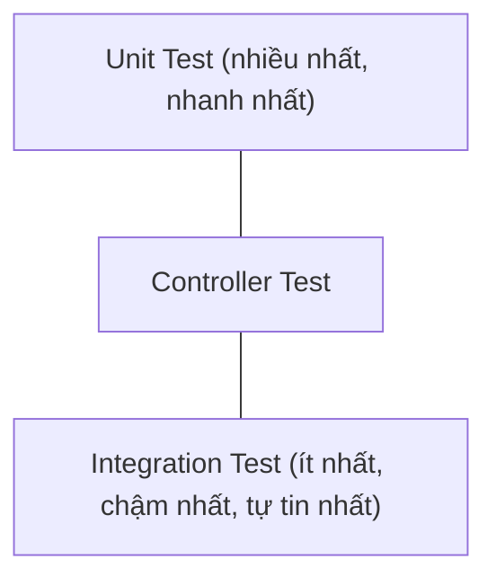

# CHƯƠNG 7: KIỂM THỬ (TESTING)

> Tài liệu đào tạo Java Backend Developer — dành cho người đã có nền tảng Backend (Node.js/Express/NestJS), chuyển sang hệ sinh thái Java/Spring Boot.

## Giới thiệu

Nếu bạn từng dùng Jest/Vitest bên Node.js, tư duy testing không xa lạ: Unit Test cô lập 1 đơn vị logic, Integration Test kiểm tra nhiều thành phần phối hợp với nhau. Điểm khác biệt lớn nhất khi testing trong Spring Boot là **2 chế độ chạy test hoàn toàn tách biệt**: test **không cần khởi động Spring Context** (nhanh, dùng cho Unit Test tầng Service/logic nghiệp vụ) và test **cần khởi động toàn bộ hoặc một phần Spring Context** (chậm hơn nhiều, dùng cho Integration Test xác nhận các Bean thực sự phối hợp đúng).

Chương này đi thẳng vào việc viết test cho chính các class đã xây dựng ở Chương 3-6 (`OrderService`, `OrderController`, `OrderRepository`) — không dùng ví dụ trừu tượng `Calculator`/`Foo` — để bạn thấy rõ testing tích hợp vào 1 codebase thực tế như thế nào, không phải một bài tập tách rời.

---

## 7.1. Unit Test

### 7.1.1. Tích hợp dependency vào `pom.xml`

Từ Spring Initializr, nếu bạn đã chọn dependency `Spring Web`, `spring-boot-starter-test` **đã tự động được thêm sẵn** — đây là 1 starter gộp toàn bộ công cụ test cần thiết, không cần cài thêm gì cho Unit Test cơ bản:

```xml
<dependency>
    <groupId>org.springframework.boot</groupId>
    <artifactId>spring-boot-starter-test</artifactId>
    <scope>test</scope>
    <!-- Đã gộp sẵn: JUnit 5 (Jupiter), Mockito, AssertJ, Hamcrest, JSONassert, Spring Test -->
</dependency>
```

Kiểm tra nhanh xem project đã có sẵn chưa: mở `pom.xml`, tìm dependency trên. Nếu project được tạo qua Spring Initializr với bất kỳ starter nào, nó gần như chắc chắn đã có sẵn. Cấu trúc thư mục test đặt song song với `main`, cùng package để có quyền truy cập package-private nếu cần:

```
src/
├── main/java/com/company/orderservice/service/OrderService.java
└── test/java/com/company/orderservice/service/OrderServiceTest.java
```

### 7.1.2. JUnit 5 cơ bản

**Khái niệm**: JUnit 5 (Jupiter) là framework test chuẩn của Java, tương đương vai trò Jest bên Node.js — cung cấp annotation đánh dấu test method, cơ chế lifecycle (setup/teardown), và assertion cơ bản.

```java
package com.company.orderservice.service;

import org.junit.jupiter.api.*;
import static org.junit.jupiter.api.Assertions.*;

class OrderCalculationTest {

    private Order order;

    @BeforeEach // chạy TRƯỚC mỗi test method - tương đương beforeEach() của Jest
    void setUp() {
        order = new Order("ORD-001", 1L);
    }

    @Test
    @DisplayName("Tính tổng tiền đơn hàng phải cộng đúng tất cả OrderItem")
    void calculateTotal_shouldSumAllItems() {
        order.addItem(new OrderItem("SKU-001", 2, BigDecimal.valueOf(100_000)));
        order.addItem(new OrderItem("SKU-002", 1, BigDecimal.valueOf(50_000)));

        BigDecimal total = order.calculateTotal();

        assertEquals(BigDecimal.valueOf(250_000), total);
    }

    @Test
    void addItem_shouldThrowException_whenOrderAlreadyConfirmed() {
        order.confirm();

        // assertThrows - kiểm tra chính xác exception nào được ném, tương đương expect().toThrow() của Jest
        IllegalStateException exception = assertThrows(IllegalStateException.class,
                () -> order.addItem(new OrderItem("SKU-003", 1, BigDecimal.TEN)));

        assertTrue(exception.getMessage().contains("đã được xác nhận"));
    }

    @ParameterizedTest // chạy CÙNG 1 test logic với nhiều bộ dữ liệu khác nhau - tránh lặp code
    @ValueSource(ints = {-1, -100, -9999})
    void orderItem_shouldRejectNegativeQuantity(int invalidQuantity) {
        assertThrows(IllegalArgumentException.class,
                () -> new OrderItem("SKU-001", invalidQuantity, BigDecimal.TEN));
    }

    @Nested // gom nhóm test liên quan, hiển thị rõ ràng trong báo cáo test, tương đương describe() lồng nhau
    @DisplayName("Khi đơn hàng đã bị hủy")
    class WhenOrderCancelled {

        @BeforeEach
        void cancelOrder() {
            order.cancel("Khách hàng yêu cầu hủy");
        }

        @Test
        void shouldNotAllowConfirm() {
            assertThrows(IllegalStateException.class, order::confirm);
        }
    }
}
```

**So sánh nhanh với Jest (Node.js)** để dễ hình dung:

| JUnit 5 | Jest | Ý nghĩa |
|---|---|---|
| `@Test` | `test()` / `it()` | Đánh dấu 1 test case |
| `@BeforeEach` | `beforeEach()` | Chạy trước mỗi test |
| `@BeforeAll` | `beforeAll()` | Chạy 1 lần trước toàn bộ class (method phải `static`) |
| `@Nested` | `describe()` lồng nhau | Gom nhóm test liên quan |
| `assertEquals(expected, actual)` | `expect(actual).toBe(expected)` | So sánh kết quả (lưu ý thứ tự tham số NGƯỢC với Jest) |
| `assertThrows(Type.class, executable)` | `expect(fn).toThrow()` | Kiểm tra exception |

**Best Practices đặt tên test**: Dùng quy ước `methodName_shouldExpectedBehavior_whenCondition` (như ví dụ trên) — tên test đọc lên phải hiểu ngay được đang kiểm tra hành vi gì, không cần mở code ra xem.

### 7.1.3. Mockito: mock dependency, verify, when-thenReturn

**Khái niệm**: Trong Unit Test tầng Service (như `OrderService` đã xây ở Chương 5), bạn muốn **cô lập hoàn toàn logic của `OrderService`**, không phụ thuộc vào `OrderRepository` thật (vốn cần database thật để chạy) — Mockito tạo ra 1 **object giả (mock)** thay thế dependency, cho phép bạn kiểm soát hoàn toàn hành vi trả về của nó.

**Đây chính là lý do Constructor Injection (Chương 3) là bắt buộc** — nhờ `OrderService` nhận `OrderRepository` qua constructor, ta có thể truyền thẳng mock vào mà **không cần khởi động Spring Context**, giúp test chạy trong mili-giây thay vì giây.

```java
package com.company.orderservice.service;

import org.junit.jupiter.api.Test;
import org.junit.jupiter.api.extension.ExtendWith;
import org.mockito.InjectMocks;
import org.mockito.Mock;
import org.mockito.junit.jupiter.MockitoExtension;

import static org.assertj.core.api.Assertions.assertThat;
import static org.mockito.ArgumentMatchers.any;
import static org.mockito.Mockito.*;

@ExtendWith(MockitoExtension.class) // kích hoạt Mockito trong JUnit 5, KHÔNG cần Spring Context
class OrderServiceTest {

    @Mock // Mockito tự tạo object giả cho interface này
    private OrderRepository orderRepository;

    @Mock
    private InventoryService inventoryService;

    @InjectMocks // Mockito tự tạo OrderService thật, TIÊM các @Mock ở trên vào qua constructor
    private OrderService orderService;

    @Test
    void createOrder_shouldSaveOrderAndReserveStock() {
        // ARRANGE (Given) - thiết lập hành vi giả định cho dependency
        CreateOrderRequest request = new CreateOrderRequest(1L, "SKU-001", 2, BigDecimal.valueOf(100_000));

        when(orderRepository.save(any(Order.class)))
                .thenAnswer(invocation -> invocation.getArgument(0)); // trả về chính Order được truyền vào save()

        // ACT (When) - gọi method đang test
        Order result = orderService.createOrder(request);

        // ASSERT (Then) - kiểm tra kết quả VÀ hành vi tương tác với dependency
        assertThat(result).isNotNull();
        assertThat(result.getStatus()).isEqualTo(OrderStatus.PENDING);

        verify(orderRepository, times(1)).save(any(Order.class)); // xác nhận save() được gọi ĐÚNG 1 lần
        verify(inventoryService).reserveStock("SKU-001", 2);       // xác nhận đúng tham số được truyền
    }

    @Test
    void getOrder_shouldThrowOrderNotFoundException_whenOrderDoesNotExist() {
        when(orderRepository.findByOrderCode("ORD-999")).thenReturn(Optional.empty());

        assertThatThrownBy(() -> orderService.getOrderDetail("ORD-999"))
                .isInstanceOf(OrderNotFoundException.class)
                .hasMessageContaining("ORD-999");

        verify(inventoryService, never()).reserveStock(any(), anyInt()); // xác nhận method KHÔNG được gọi
    }

    @Test
    void reserveStock_shouldThrowException_whenInventoryServiceFails() {
        CreateOrderRequest request = new CreateOrderRequest(1L, "SKU-001", 100, BigDecimal.TEN);

        // Giả lập dependency ném exception - kiểm tra OrderService xử lý đúng khi phụ thuộc lỗi
        doThrow(new InsufficientStockException("SKU-001", 100, 5))
                .when(inventoryService).reserveStock("SKU-001", 100);

        assertThatThrownBy(() -> orderService.createOrder(request))
                .isInstanceOf(InsufficientStockException.class);
    }
}
```

**Giải thích các API Mockito quan trọng**:
- **`when(mock.method()).thenReturn(value)`**: định nghĩa "khi gọi method này với tham số này, trả về giá trị này" — chỉ dùng được cho method **có giá trị trả về**.
- **`doThrow(...).when(mock).method()`**: dùng khi cần mock ném exception, hoặc mock method **`void`** (cú pháp `when().thenThrow()` không áp dụng được cho method void).
- **`verify(mock).method(args)`**: xác nhận method đã **thực sự được gọi** với đúng tham số — quan trọng để test hành vi tương tác (side-effect), không chỉ giá trị trả về.
- **`verify(mock, times(n))`**, **`verify(mock, never())`**: kiểm soát chính xác **số lần** method được gọi.
- **`any()`, `anyString()`, `anyInt()`**: argument matcher — chấp nhận bất kỳ giá trị nào ở vị trí tham số đó, dùng khi giá trị cụ thể không quan trọng với test case.

**So sánh: `@Mock` + `@InjectMocks` vs tự tạo mock thủ công**

| Cách viết | Ưu điểm | Nhược điểm |
|---|---|---|
| `@Mock` + `@InjectMocks` (khuyến nghị) | Ngắn gọn, Mockito tự động wiring qua constructor | Cần đúng constructor injection (lại là lý do ưu tiên Constructor Injection) |
| `Mockito.mock(OrderRepository.class)` thủ công | Kiểm soát tường minh, không cần `@ExtendWith` | Dài dòng hơn, phải tự `new OrderService(mockRepo, ...)` |

**Best Practices Mockito**:
- Tuân theo cấu trúc **Arrange-Act-Assert** (Given-When-Then) rõ ràng trong mỗi test, giúp test dễ đọc.
- Chỉ mock **dependency trực tiếp** của class đang test, không mock quá sâu (mock cả dependency của dependency) — dấu hiệu thiết kế có vấn đề nếu phải làm vậy.
- Dùng `verify()` cho các method có **side-effect quan trọng về nghiệp vụ** (gửi email, trừ kho, ghi log audit) — không lạm dụng `verify()` cho mọi lời gọi, làm test trở nên giòn (brittle), dễ vỡ khi refactor nội bộ không ảnh hưởng hành vi thực sự.
- Ưu tiên assertion của **AssertJ** (`assertThat(...).isEqualTo(...)`, `assertThatThrownBy(...)`) thay vì JUnit assertion thuần (`assertEquals`) — AssertJ có cú pháp fluent dễ đọc hơn và thông báo lỗi chi tiết hơn khi test fail.

**Sai lầm thường gặp**: Viết Unit Test cho tầng Service nhưng lại `@Autowired` thật `OrderRepository` và cần Spring Context chạy — biến 1 Unit Test lẽ ra chạy trong mili-giây thành chạy chậm như Integration Test, làm chậm toàn bộ CI pipeline khi số lượng test tăng lên hàng trăm/nghìn test.

---

## 7.2. Integration Test

### 7.2.1. `@SpringBootTest` — khi nào cần khởi động Spring Context thật

**Khái niệm**: Khác với Unit Test ở mục 7.1 (không đụng tới Spring), `@SpringBootTest` khởi động **toàn bộ (hoặc gần như toàn bộ) `ApplicationContext` thật** — dùng khi bạn cần xác nhận nhiều Bean **thực sự phối hợp đúng với nhau** (Controller → Service → Repository → Database thật), điều mà Unit Test cô lập từng phần không phát hiện được.

```java
@SpringBootTest(webEnvironment = SpringBootTest.WebEnvironment.RANDOM_PORT)
@ActiveProfiles("test") // dùng application-test.yml đã cấu hình ở Chương 5 (H2 hoặc Testcontainers)
class OrderServiceIntegrationTest {

    @Autowired
    private OrderService orderService; // Bean THẬT, dependency cũng THẬT (trừ khi @MockBean)

    @Autowired
    private OrderRepository orderRepository;

    @Test
    void createOrder_shouldPersistToDatabase() {
        CreateOrderRequest request = new CreateOrderRequest(1L, "SKU-001", 2, BigDecimal.valueOf(100_000));

        Order created = orderService.createOrder(request);

        // Query LẠI từ database thật để xác nhận dữ liệu THỰC SỰ được lưu đúng,
        // không chỉ tin vào giá trị trả về của method (điều Unit Test với mock không kiểm chứng được)
        Order fromDb = orderRepository.findById(created.getId()).orElseThrow();
        assertThat(fromDb.getStatus()).isEqualTo(OrderStatus.PENDING);
    }
}
```

**Chi phí cần cân nhắc**: `@SpringBootTest` khởi động Context tốn **vài giây** (so với mili-giây của Unit Test) — Spring có cơ chế **cache Context giữa các test class** (nếu cấu hình giống hệt nhau) để giảm chi phí này, nhưng vẫn chậm hơn Unit Test đáng kể. **Nguyên tắc thực tế**: đa số test nên là Unit Test (nhanh, chạy được hàng nghìn lần mỗi ngày trong vòng lặp phát triển), chỉ 1 tỷ lệ nhỏ là Integration Test (xác nhận các thành phần phối hợp đúng ở những điểm quan trọng nhất) — mô hình này gọi là **Test Pyramid**.

### 7.2.2. Test Controller với MockMvc

**Khái niệm**: `MockMvc` mô phỏng HTTP request/response **mà không cần khởi động server thật** (không tốn cổng mạng, nhanh hơn gọi API thật) — dùng để test tầng Controller: routing đúng không, validation hoạt động không, response JSON đúng format không.

```java
@WebMvcTest(OrderController.class) // CHỈ load Controller layer + các Bean liên quan (MVC), KHÔNG load toàn bộ Context
class OrderControllerTest {

    @Autowired
    private MockMvc mockMvc;

    @MockBean // thay thế OrderService thật bằng mock TRONG Spring Context - Controller vẫn được test thật
    private OrderService orderService;

    @Autowired
    private ObjectMapper objectMapper;

    @Test
    void getOrder_shouldReturn200_whenOrderExists() throws Exception {
        OrderDTO orderDTO = new OrderDTO("ORD-001", BigDecimal.valueOf(250_000), OrderStatus.PENDING);
        when(orderService.getOrderDetail("ORD-001")).thenReturn(orderDTO);

        mockMvc.perform(get("/api/v1/orders/ORD-001"))
                .andExpect(status().isOk())
                .andExpect(jsonPath("$.orderCode").value("ORD-001"))
                .andExpect(jsonPath("$.status").value("PENDING"))
                .andExpect(jsonPath("$.totalAmount").value(250_000));
    }

    @Test
    void getOrder_shouldReturn404_whenOrderNotFound() throws Exception {
        when(orderService.getOrderDetail("ORD-999")).thenThrow(new OrderNotFoundException("ORD-999"));

        mockMvc.perform(get("/api/v1/orders/ORD-999"))
                .andExpect(status().isNotFound())
                .andExpect(jsonPath("$.message").value(containsString("ORD-999")));
    }

    @Test
    void createOrder_shouldReturn400_whenRequestInvalid() throws Exception {
        CreateOrderRequest invalidRequest = new CreateOrderRequest(null, "", -1, null); // vi phạm @Valid

        mockMvc.perform(post("/api/v1/orders")
                        .contentType(MediaType.APPLICATION_JSON)
                        .content(objectMapper.writeValueAsString(invalidRequest)))
                .andExpect(status().isBadRequest())
                .andExpect(jsonPath("$.errors").isArray());
    }

    @Test
    @WithMockUser(roles = "ADMIN") // mô phỏng user đã xác thực với role ADMIN - test tầng phân quyền (Chương 6)
    void deleteOrder_shouldReturn204_whenUserIsAdmin() throws Exception {
        mockMvc.perform(delete("/api/v1/orders/ORD-001"))
                .andExpect(status().isNoContent());
    }

    @Test
    @WithMockUser(roles = "USER") // role KHÔNG đủ quyền
    void deleteOrder_shouldReturn403_whenUserIsNotAdmin() throws Exception {
        mockMvc.perform(delete("/api/v1/orders/ORD-001"))
                .andExpect(status().isForbidden());
    }
}
```

**Điểm quan trọng — `@WebMvcTest` vs `@SpringBootTest`**: `@WebMvcTest(OrderController.class)` chỉ load `OrderController` cùng các Bean liên quan tới MVC (`@ControllerAdvice`, converter, Security filter chain) — **không** load `OrderService`/`OrderRepository` thật, buộc bạn phải `@MockBean` chúng. Cách này **nhanh hơn nhiều** so với dùng `@SpringBootTest` để test Controller, vì không cần khởi động toàn bộ tầng Service/Repository/DataSource.

### 7.2.3. RestAssured — lựa chọn thay thế cho Integration Test gọi API thật

```xml
<dependency>
    <groupId>io.rest-assured</groupId>
    <artifactId>rest-assured</artifactId>
    <scope>test</scope>
</dependency>
```

```java
@SpringBootTest(webEnvironment = SpringBootTest.WebEnvironment.RANDOM_PORT)
class OrderApiRestAssuredTest {

    @LocalServerPort
    private int port;

    @BeforeEach
    void setUp() {
        RestAssured.port = port; // server thật đang chạy trên port ngẫu nhiên
    }

    @Test
    void createOrder_shouldReturnCreatedOrderWithLocationHeader() {
        given()
            .contentType(ContentType.JSON)
            .body("""
                {"customerId": 1, "sku": "SKU-001", "quantity": 2, "unitPrice": 100000}
                """)
        .when()
            .post("/api/v1/orders")
        .then()
            .statusCode(201)
            .header("Location", containsString("/api/v1/orders/"))
            .body("status", equalTo("PENDING"));
    }
}
```

**So sánh: MockMvc vs RestAssured**

| Tiêu chí | MockMvc | RestAssured |
|---|---|---|
| Cần server thật chạy | ❌ Không (mô phỏng ở tầng Servlet) | ✅ Có (`RANDOM_PORT`, gọi HTTP thật) |
| Tốc độ | Nhanh hơn | Chậm hơn (có network round-trip thật, dù là localhost) |
| Độ chính xác end-to-end | Cao nhưng vẫn là mô phỏng | Cao nhất — kiểm tra đúng những gì client thật sẽ nhận |
| Cú pháp | Gắn liền hệ sinh thái Spring Test | Fluent, độc lập framework, style BDD dễ đọc (`given/when/then`) |
| Khi nào dùng | ✅ Mặc định cho test tầng Controller | Khi cần test thực sự end-to-end qua network, hoặc test API từ góc nhìn client bên ngoài |

### 7.2.4. Testcontainers — test với PostgreSQL thật trong container

**Vấn đề với H2** (đã nhắc ở Chương 5): H2 không mô phỏng hoàn toàn hành vi PostgreSQL thật — dùng H2 cho Integration Test có thể **pass test nhưng vẫn lỗi khi chạy với PostgreSQL thật ở production** (khác biệt cú pháp, kiểu dữ liệu, ràng buộc). Testcontainers giải quyết triệt để: tự động khởi động **PostgreSQL thật trong Docker container** ngay trong lúc chạy test, không cần bạn tự cài đặt hay tự chạy `docker-compose` thủ công — toàn bộ vòng đời container được quản lý bằng code Java.

```xml
<dependency>
    <groupId>org.testcontainers</groupId>
    <artifactId>junit-jupiter</artifactId>
    <scope>test</scope>
</dependency>
<dependency>
    <groupId>org.testcontainers</groupId>
    <artifactId>postgresql</artifactId>
    <scope>test</scope>
</dependency>
```

```java
@SpringBootTest
@Testcontainers // JUnit 5 extension - tự động quản lý vòng đời container (start trước test, stop sau khi xong)
class OrderRepositoryTestcontainersTest {

    @Container // Testcontainers tự động start container NÀY trước khi chạy test, KHÔNG cần thao tác thủ công
    static PostgreSQLContainer<?> postgres = new PostgreSQLContainer<>("postgres:16-alpine")
            .withDatabaseName("orderdb_test")
            .withUsername("test")
            .withPassword("test");

    @DynamicPropertySource // ghi đè cấu hình DataSource của Spring Boot bằng địa chỉ container VỪA được tạo
    static void configureProperties(DynamicPropertyRegistry registry) {
        registry.add("spring.datasource.url", postgres::getJdbcUrl);
        registry.add("spring.datasource.username", postgres::getUsername);
        registry.add("spring.datasource.password", postgres::getPassword);
    }

    @Autowired
    private OrderRepository orderRepository;

    @Test
    void findByOrderCode_shouldReturnOrder_whenExistsInRealPostgres() {
        Order order = new Order("ORD-TEST-001", 1L);
        orderRepository.save(order);

        Optional<Order> found = orderRepository.findByOrderCode("ORD-TEST-001");

        assertThat(found).isPresent();
    }
}
```

**Điều quan trọng cần hiểu**: Khi chạy test này, Testcontainers sẽ **tự động** gọi Docker Engine trên máy bạn (yêu cầu Docker Desktop/Docker Engine đã cài sẵn và đang chạy) để tạo 1 container PostgreSQL mới, chờ nó sẵn sàng, rồi mới chạy test — toàn bộ diễn ra **hoàn toàn tự động trong vòng đời JUnit**, bạn không cần viết `docker-compose.yml` hay chạy lệnh `docker` nào thủ công. Sau khi test xong, container tự động bị hủy.

**Best Practices Testcontainers**: Dùng `static` field cho container để **tái sử dụng cùng 1 container giữa nhiều test method** trong 1 class (tránh chi phí khởi động container lặp lại cho từng test). Với dự án lớn nhiều test class cùng cần PostgreSQL, cân nhắc tạo 1 abstract base test class dùng chung 1 container (singleton container pattern) để giảm tổng thời gian chạy toàn bộ test suite.

### 7.2.5. Đo Test Coverage với JaCoCo

**Khái niệm**: JaCoCo (Java Code Coverage) đo lường **tỷ lệ % dòng code/nhánh logic thực sự được thực thi** khi chạy test — giúp phát hiện phần code chưa có test nào bao phủ.

**Tích hợp vào `pom.xml` hiện có**:

```xml
<build>
    <plugins>
        <plugin>
            <groupId>org.jacoco</groupId>
            <artifactId>jacoco-maven-plugin</artifactId>
            <version>0.8.12</version>
            <executions>
                <execution>
                    <goals>
                        <goal>prepare-agent</goal> <!-- gắn agent vào JVM lúc chạy test để đo coverage -->
                    </goals>
                </execution>
                <execution>
                    <id>report</id>
                    <phase>test</phase>
                    <goals>
                        <goal>report</goal> <!-- sinh báo cáo HTML sau khi test chạy xong -->
                    </goals>
                </execution>
                <execution>
                    <id>check-coverage</id>
                    <goals>
                        <goal>check</goal>
                    </goals>
                    <configuration>
                        <rules>
                            <rule>
                                <element>PACKAGE</element>
                                <limits>
                                    <limit>
                                        <counter>LINE</counter>
                                        <value>COVEREDRATIO</value>
                                        <minimum>0.70</minimum> <!-- build FAIL nếu coverage dưới 70% -->
                                    </limit>
                                </limits>
                            </rule>
                        </rules>
                    </configuration>
                </execution>
            </executions>
        </plugin>
    </plugins>
</build>
```

```bash
mvn clean test
# Báo cáo HTML sinh ra tại: target/site/jacoco/index.html
# Mở file này bằng trình duyệt để xem chi tiết dòng nào/nhánh nào CHƯA có test bao phủ
```

**Best Practices Test Coverage**: Coverage cao **không đồng nghĩa với test tốt** — 1 test chỉ gọi method mà không có assertion nào vẫn tính là "covered" nhưng vô nghĩa. Coverage là chỉ số **cảnh báo phần code hoàn toàn chưa được test tới**, không phải thước đo chất lượng test. Đặt ngưỡng coverage tối thiểu hợp lý (70-80% cho tầng Service/business logic) trong CI pipeline, nhưng ưu tiên **test đúng các trường hợp nghiệp vụ quan trọng và edge case** hơn là chạy theo con số phần trăm.

**Anti-pattern**: Viết test chỉ để "kéo coverage" mà không có assertion ý nghĩa (gọi là "assertion-free test" hoặc "coverage padding") — che giấu code thực sự chưa được kiểm chứng đúng đắn đằng sau con số coverage đẹp.

---

## Ví dụ Code: Bộ test hoàn chỉnh cho `OrderService` — từ Unit tới Integration

```java
// 1. Unit Test - nhanh, cô lập, chạy hàng nghìn lần mỗi ngày trong lúc code
@ExtendWith(MockitoExtension.class)
class OrderServiceTest {
    @Mock private OrderRepository orderRepository;
    @Mock private InventoryService inventoryService;
    @InjectMocks private OrderService orderService;

    @Test
    void createOrder_shouldReserveStockAfterSaving() {
        when(orderRepository.save(any())).thenAnswer(inv -> inv.getArgument(0));

        orderService.createOrder(new CreateOrderRequest(1L, "SKU-001", 2, BigDecimal.TEN));

        InOrder inOrder = inOrder(orderRepository, inventoryService); // xác nhận THỨ TỰ gọi đúng
        inOrder.verify(orderRepository).save(any());
        inOrder.verify(inventoryService).reserveStock("SKU-001", 2);
    }
}

// 2. Controller Test - test tầng HTTP, mock Service
@WebMvcTest(OrderController.class)
class OrderControllerTest {
    @Autowired private MockMvc mockMvc;
    @MockBean private OrderService orderService;
    // ... như ví dụ mục 7.2.2
}

// 3. Integration Test - xác nhận toàn bộ luồng thật với PostgreSQL thật qua Testcontainers
@SpringBootTest
@Testcontainers
class OrderFullFlowIntegrationTest {
    @Container
    static PostgreSQLContainer<?> postgres = new PostgreSQLContainer<>("postgres:16-alpine");

    @DynamicPropertySource
    static void props(DynamicPropertyRegistry registry) {
        registry.add("spring.datasource.url", postgres::getJdbcUrl);
        registry.add("spring.datasource.username", postgres::getUsername);
        registry.add("spring.datasource.password", postgres::getPassword);
    }

    @Autowired private OrderService orderService;
    @Autowired private OrderRepository orderRepository;

    @Test
    void fullCheckoutFlow_shouldPersistOrderCorrectly() {
        Order created = orderService.createOrder(new CreateOrderRequest(1L, "SKU-001", 2, BigDecimal.TEN));

        assertThat(orderRepository.findById(created.getId())).isPresent();
    }
}
```

---

## So sánh tổng hợp: Test Pyramid trong Spring Boot

| Loại test | Công cụ | Tốc độ | Phạm vi | Tỷ lệ khuyến nghị trong test suite |
|---|---|---|---|---|
| Unit Test | JUnit 5 + Mockito | Rất nhanh (mili-giây) | 1 class, dependency mock | ~70% |
| Controller Test | `@WebMvcTest` + MockMvc | Nhanh | Tầng HTTP + validation + security | ~20% |
| Integration Test | `@SpringBootTest` + Testcontainers | Chậm (giây) | Toàn bộ luồng, DB thật | ~10% |



---

## Best Practices

- Tuân theo Test Pyramid: đa số là Unit Test nhanh, ít Integration Test chậm hơn ở những điểm quan trọng nhất.
- Constructor Injection (Chương 3) là điều kiện tiên quyết để viết Unit Test dễ dàng với `@Mock`/`@InjectMocks`.
- Dùng `@WebMvcTest` cho Controller (nhanh hơn `@SpringBootTest` toàn bộ), `@DataJpaTest` cho Repository, `@SpringBootTest` chỉ khi thực sự cần toàn bộ Context.
- Testcontainers thay cho H2 khi Integration Test cần độ chính xác với PostgreSQL thật — tự động qua code, không cần thao tác Docker thủ công.
- Đặt tên test theo `method_shouldExpected_whenCondition`, cấu trúc Arrange-Act-Assert rõ ràng.
- Coverage là công cụ cảnh báo, không phải mục tiêu — ưu tiên test đúng nghiệp vụ quan trọng và edge case.

## Anti-patterns

- Unit Test tầng Service nhưng vẫn dùng Spring Context thật (`@Autowired` thay vì `@Mock`).
- `verify()` cho mọi lời gọi dependency kể cả không quan trọng nghiệp vụ — test giòn, dễ vỡ khi refactor.
- Dùng H2 cho Integration Test rồi tin tưởng hoàn toàn hành vi giống PostgreSQL thật ở production.
- Viết test không có assertion ý nghĩa chỉ để tăng số coverage.
- Test phụ thuộc lẫn nhau (test B chỉ pass nếu test A chạy trước) — vi phạm nguyên tắc test phải độc lập, có thể chạy riêng lẻ hoặc song song.

## Bài tập

1. **Dễ**: Viết Unit Test cho method `calculateTotal()` của `Order` (Chương 1) với ít nhất 3 trường hợp: đơn hàng có nhiều item, đơn hàng rỗng, item có số lượng lớn.
2. **Trung bình**: Viết Unit Test đầy đủ cho `OrderService.createOrder()` dùng Mockito, bao phủ cả trường hợp thành công và trường hợp `InventoryService` ném `InsufficientStockException`.
3. **Trung bình**: Viết `@WebMvcTest` cho `OrderController`, test đầy đủ 4 trường hợp: thành công (200), không tìm thấy (404), validation lỗi (400), không đủ quyền (403) dùng `@WithMockUser`.
4. **Khó**: Viết Integration Test dùng Testcontainers xác nhận `@Version` (Optimistic Locking, Chương 5) hoạt động đúng — mô phỏng 2 transaction cùng đọc 1 Order rồi update, xác nhận transaction thứ 2 ném `OptimisticLockException`. Sau đó cấu hình JaCoCo và đạt tối thiểu 70% coverage cho package `service`.

## Tổng kết

Chương này đã trang bị kỹ năng kiểm chứng cho toàn bộ hệ thống Spring Boot đã xây dựng qua các chương trước: Unit Test với JUnit 5 + Mockito cô lập hoàn toàn logic nghiệp vụ khỏi dependency, chạy nhanh nhờ Constructor Injection; Integration Test với `@SpringBootTest`/`@WebMvcTest`/MockMvc xác nhận các tầng phối hợp đúng; và Testcontainers đưa PostgreSQL thật vào vòng đời test hoàn toàn tự động qua code mà không cần thao tác Docker thủ công — đảm bảo test pass đồng nghĩa với hoạt động đúng ở production thật. Kết hợp với JaCoCo đo lường coverage, bạn đã có đủ công cụ để tự tin rằng mọi thay đổi trong `OrderService`, `OrderController`, hay các Entity đã xây dựng từ Chương 3 tới Chương 6 đều được kiểm chứng đúng đắn trước khi lên production.

Với việc hoàn thành Chương 1 tới Chương 8, bạn đã có đầy đủ nền tảng của 1 Java Spring Boot Backend Developer: từ Java Core/nâng cao, Spring Framework, Spring Boot, Database, Security, tới các chủ đề nâng cao (Caching, Message Queue, Microservices, Observability) và Testing — đủ kiến thức nền tảng để tự tin đi làm và tiếp tục học sâu hơn qua thực tế dự án.


