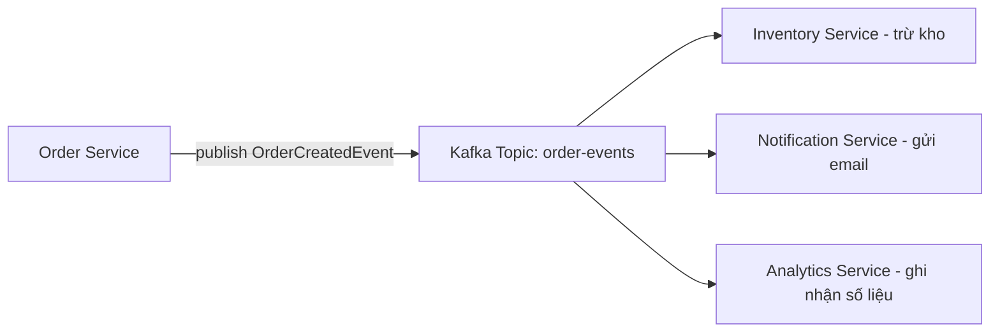

# CHƯƠNG 8: CÁC CHỦ ĐỀ NÂNG CAO

> Tài liệu đào tạo Java Backend Developer — dành cho người đã có nền tảng Backend (Node.js/Express/NestJS), chuyển sang hệ sinh thái Java/Spring Boot.

## Giới thiệu

Các chương trước đã trang bị đủ kiến thức để xây dựng 1 REST API monolith hoàn chỉnh: kiến trúc, dữ liệu, bảo mật. Chương này đưa bạn tới những chủ đề khiến 1 hệ thống thực sự **sẵn sàng cho production ở quy mô enterprise**: cache giảm tải database, xử lý bất đồng bộ và message queue để decouple hệ thống, kiến trúc Microservices khi monolith không còn đủ, quan sát được (observability) hệ thống đang chạy ra sao, và tối ưu hiệu năng ở tầng sâu nhất.

Đây là chương dài nhất và cũng là chương phân biệt rõ ràng nhất giữa "biết code Spring Boot" và "biết vận hành hệ thống Spring Boot ở quy mô thật". Mỗi mục đều là 1 chủ đề đủ lớn để có riêng 1 cuốn sách — tài liệu này tập trung vào **những gì bạn cần biết để bắt đầu áp dụng đúng đắn trong công việc thực tế**, kèm định hướng khi nào nên đào sâu thêm.

**Quy ước vị trí file trong dự án**: Toàn bộ code ví dụ trong chương này được đặt vào đúng cấu trúc package đã thiết lập từ Chương 4, mở rộng thêm các package mới khi cần:

```
src/main/java/com/company/orderservice/
├── OrderServiceApplication.java
├── config/                      # MỌI @Configuration class của chương này nằm ở đây
│   ├── CacheConfig.java         # 8.1
│   ├── AsyncConfig.java         # 8.2
│   ├── RabbitMQConfig.java      # 8.2
│   ├── KafkaConfig.java         # 8.2
│   ├── SchedulingConfig.java    # 8.6
│   ├── WebSocketConfig.java     # 8.7
│   └── SecurityConfig.java      # (đã có từ Chương 6, bổ sung whitelist webhook ở 8.8)
├── controller/
│   ├── OrderController.java     # (đã có từ Chương 4-6)
│   └── PaymentWebhookController.java # 8.8 - Webhook Receiver
├── client/                      # package MỚI - Feign Client (nội bộ) + RestClient (bên ngoài)
│   ├── InventoryClient.java     # 8.3 - gọi service NỘI BỘ qua Feign/Eureka
│   └── ExchangeRateClient.java  # 8.10 - gọi API BÊN NGOÀI qua RestClient
├── service/
│   ├── OrderService.java
│   ├── OrderEventPublisher.java # 8.2 - Producer gửi message
│   ├── OrderStatusNotifier.java # 8.7 - đẩy WebSocket
│   ├── PaymentWebhookService.java    # 8.8 - xử lý webhook nhận vào
│   ├── WebhookDeliveryService.java   # 8.8 - gửi webhook ra ngoài
│   ├── OrderCancellationClassifierService.java # 8.11 - phân loại bằng AI
│   ├── ReviewAnalysisService.java    # 8.11 - Structured Output
│   └── OrderSupportAssistant.java    # 8.11 - Function Calling/Tools
├── messaging/                   # package MỚI - Consumer lắng nghe message queue
│   ├── OrderEventConsumer.java       # 8.2 (RabbitMQ)
│   └── OrderEventKafkaConsumer.java  # 8.2 (Kafka)
├── scheduler/                   # package MỚI - các job định kỳ
│   └── OrderCleanupJob.java     # 8.6
├── batch/                       # package MỚI - Spring Batch Job/Step config
│   └── OrderReconciliationBatchConfig.java # 8.5
├── health/                      # package MỚI - Custom Actuator Health Indicator
│   └── PaymentGatewayHealthIndicator.java  # 8.4
└── domain/vo/                   # package MỚI - Value Object (DDD, mục 8.3.9)
    └── Money.java                # 8.3
```

**Nguyên tắc tổ chức**: Mọi `@Configuration` class (nơi đăng ký `@Bean` tường minh — đã học nguyên lý ở Chương 3) tập trung vào package `config/`, tách biệt hoàn toàn khỏi code nghiệp vụ (`service/`) — giúp bất kỳ ai mới vào dự án chỉ cần mở `config/` là biết ngay ứng dụng đang bật những tính năng hạ tầng nào (cache, async, messaging, scheduling...) mà không cần lục tìm rải rác khắp codebase.

---

## 8.1. Caching

### 8.1.1. Spring Cache Abstraction: `@Cacheable`, `@CacheEvict`, `@CachePut`

**Khái niệm**: Spring Cache Abstraction là 1 lớp trừu tượng thống nhất trên nhiều cache provider khác nhau (Redis, Caffeine, EhCache...) — bạn viết code nghiệp vụ dựa vào annotation, đổi provider chỉ cần đổi cấu hình, không sửa code nghiệp vụ. Cơ chế hoạt động dựa trên **AOP Proxy** (giống `@Transactional` đã học ở Chương 5) — Spring bọc method bằng proxy, kiểm tra cache trước khi thực sự gọi method.

```java
// File: src/main/java/com/company/orderservice/service/ProductService.java
@Service
public class ProductService {

    private final ProductRepository productRepository;

    // Lần gọi đầu tiên với cùng "sku" -> chạy method thật, lưu kết quả vào cache "products"
    // Lần gọi tiếp theo với CÙNG "sku" -> trả thẳng từ cache, KHÔNG chạy lại method/query DB
    @Cacheable(value = "products", key = "#sku")
    public ProductDTO getProduct(String sku) {
        Product product = productRepository.findBySku(sku)
                .orElseThrow(() -> new ProductNotFoundException(sku));
        return toDTO(product);
    }

    // CHẠY method thật để update DB, ĐỒNG THỜI cập nhật lại cache với kết quả mới
    @CachePut(value = "products", key = "#result.sku()")
    public ProductDTO updateProduct(String sku, UpdateProductRequest request) {
        Product product = productRepository.findBySku(sku).orElseThrow();
        product.updatePrice(request.newPrice());
        return toDTO(productRepository.save(product));
    }

    // Xóa entry khỏi cache khi sản phẩm bị xóa, tránh trả về dữ liệu đã không còn tồn tại
    @CacheEvict(value = "products", key = "#sku")
    public void deleteProduct(String sku) {
        productRepository.deleteBySku(sku);
    }

    // Xóa TOÀN BỘ cache "products" - dùng khi có thay đổi hàng loạt (bulk update, import lại dữ liệu)
    @CacheEvict(value = "products", allEntries = true)
    public void reindexAllProducts() { /* ... */ }
}
```

**Cần bật `@EnableCaching`** trong 1 class `@Configuration` (đặt vào package `config/` theo quy ước đã nêu ở phần Giới thiệu) — file `CacheConfig.java` đầy đủ (kèm cấu hình Redis) được trình bày ở mục 8.1.2 ngay bên dưới, khi cache provider đã sẵn sàng.

### 8.1.2. Tích hợp Redis làm cache

**Setup môi trường Redis bằng Docker** (dùng cho local development):

```yaml
# docker-compose.yml
version: "3.8"
services:
  redis:
    image: redis:7.2-alpine
    container_name: order-service-redis
    ports:
      - "6379:6379"
    command: redis-server --requirepass "redispass" --maxmemory 256mb --maxmemory-policy allkeys-lru
    volumes:
      - redis-data:/data

volumes:
  redis-data:
```

```bash
docker compose up -d redis
# Kiểm tra kết nối
docker exec -it order-service-redis redis-cli -a redispass PING
# Kết quả mong đợi: PONG
```

`--maxmemory-policy allkeys-lru`: khi Redis đầy bộ nhớ, tự động loại bỏ key ít dùng nhất gần đây (Least Recently Used) — quan trọng vì Redis mặc định **không** tự giới hạn bộ nhớ, có thể gây crash container nếu không cấu hình.

```xml
<dependency>
    <groupId>org.springframework.boot</groupId>
    <artifactId>spring-boot-starter-data-redis</artifactId>
</dependency>
```

```yaml
spring:
  data:
    redis:
      host: localhost
      port: 6379
      password: redispass
  cache:
    type: redis
    redis:
      time-to-live: 600000 # TTL mặc định 10 phút cho mọi cache entry
```

```java
// File: src/main/java/com/company/orderservice/config/CacheConfig.java
// Đây là class @Configuration DUY NHẤT cho cache trong dự án - gộp @EnableCaching
// và cấu hình chi tiết Redis vào cùng 1 chỗ, không tách 2 class riêng để tránh trùng lặp @EnableCaching
@Configuration
@EnableCaching
public class CacheConfig {

    @Bean
    public RedisCacheConfiguration cacheConfiguration() {
        return RedisCacheConfiguration.defaultCacheConfig()
                .entryTtl(Duration.ofMinutes(10))
                .serializeValuesWith(RedisSerializationContext.SerializationPair
                        .fromSerializer(new GenericJackson2JsonRedisSerializer())) // lưu JSON thay vì Java Serialization
                .disableCachingNullValues(); // tránh cache "null" gây nhầm lẫn với cache miss
    }

    @Bean
    public CacheManager cacheManager(RedisConnectionFactory factory) {
        // TTL riêng cho từng cache name - dữ liệu ít đổi (category) cache lâu hơn dữ liệu hay đổi (inventory)
        Map<String, RedisCacheConfiguration> configs = Map.of(
                "products", cacheConfiguration().entryTtl(Duration.ofMinutes(30)),
                "inventory", cacheConfiguration().entryTtl(Duration.ofSeconds(30))
        );
        return RedisCacheManager.builder(factory)
                .cacheDefaults(cacheConfiguration())
                .withInitialCacheConfigurations(configs)
                .build();
    }
}
```

**So sánh: Caffeine (in-memory) vs Redis (distributed) làm cache provider**

| Tiêu chí | Caffeine (in-memory, cùng JVM) | Redis (distributed, ngoài JVM) |
|---|---|---|
| Tốc độ truy cập | Nhanh nhất (không qua network) | Chậm hơn (có network round-trip) |
| Chia sẻ giữa nhiều instance ứng dụng | ❌ Không — mỗi instance có cache riêng | ✅ Có — mọi instance dùng chung 1 cache |
| Consistency khi scale-out nhiều instance | ❌ Kém — mỗi instance có thể thấy dữ liệu cache khác nhau | ✅ Tốt — mọi instance thấy cùng dữ liệu |
| Khi nào dùng | Ứng dụng chạy 1 instance, hoặc cache dữ liệu không cần đồng bộ tuyệt đối giữa các instance | Ứng dụng chạy nhiều instance (điều kiện gần như bắt buộc trong production thật) |

**Best Practices Caching**:
- Luôn đặt TTL rõ ràng — không bao giờ cache vô thời hạn (dẫn đến stale data không kiểm soát được).
- Cache key phải đủ đặc trưng (bao gồm mọi tham số ảnh hưởng tới kết quả) — thiếu tham số trong key dẫn tới trả nhầm dữ liệu giữa các request khác điều kiện.
- Không cache dữ liệu thay đổi liên tục theo giây (VD: tồn kho realtime) trừ khi TTL cực ngắn và chấp nhận độ trễ nhỏ.
- Với hệ thống nhiều instance, luôn dùng Redis (hoặc cache provider phân tán khác), không dùng Caffeine làm cache chính cho dữ liệu cần nhất quán.

**Anti-pattern**: Dùng `@Cacheable` cho method có tham số là object phức tạp không override `equals()`/`hashCode()` đúng chuẩn — Spring dùng key này để tra cache, sinh ra key sai khiến cache luôn miss (không hiệu quả) hoặc tệ hơn là đôi khi trùng nhầm giữa các request khác nhau.

---

## 8.2. Xử lý bất đồng bộ & Message Queue

### 8.2.1. `@Async` trong Spring

**Khái niệm**: `@Async` cho phép 1 method chạy trên **thread riêng biệt** (từ thread pool khác), trả về ngay lập tức cho caller mà không chờ method hoàn tất — tương tự việc "fire and forget" 1 Promise không `await` bên Node.js, nhưng thực sự chạy song song trên OS thread thật (đã học nguyên lý Multithreading ở Chương 1).

```java
// File: src/main/java/com/company/orderservice/config/AsyncConfig.java
@Configuration
@EnableAsync
public class AsyncConfig {

    @Bean(name = "notificationExecutor")
    public Executor notificationExecutor() {
        ThreadPoolTaskExecutor executor = new ThreadPoolTaskExecutor();
        executor.setCorePoolSize(5);
        executor.setMaxPoolSize(20);
        executor.setQueueCapacity(100);
        executor.setThreadNamePrefix("notif-async-");
        executor.initialize();
        return executor; // LUÔN đặt tên thread pool riêng biệt, tránh dùng chung ForkJoinPool.commonPool()
    }
}
```

```java
// File: src/main/java/com/company/orderservice/service/NotificationService.java
@Service
public class NotificationService {

    @Async("notificationExecutor")
    public void sendOrderConfirmationEmail(String orderId, String email) {
        // Chạy trên thread riêng - Controller/Service gọi method này KHÔNG bị block chờ gửi email xong
        emailClient.send(email, "Xác nhận đơn hàng " + orderId);
    }

    @Async("notificationExecutor")
    public CompletableFuture<Boolean> sendSmsAsync(String phone, String message) {
        boolean sent = smsClient.send(phone, message);
        return CompletableFuture.completedFuture(sent); // dùng khi caller CẦN biết kết quả sau này
    }
}
```

**Cảnh báo self-invocation (giống `@Transactional`)**: `@Async` cũng dựa trên Proxy — gọi method `@Async` từ **trong cùng class** qua `this` sẽ **bỏ qua hoàn toàn** cơ chế bất đồng bộ, chạy đồng bộ như method thường.

**Best Practices `@Async`**: Luôn đặt tên riêng cho từng `Executor` theo mục đích sử dụng (email, SMS, report...), không dùng thread pool mặc định dùng chung cho mọi tác vụ — tránh 1 tác vụ chậm làm cạn kiệt thread pool ảnh hưởng tới tác vụ khác. Luôn xử lý exception trong method `@Async` (dùng `AsyncUncaughtExceptionHandler`) — exception ném ra từ thread bất đồng bộ **không tự động propagate lên caller**, dễ bị "nuốt" âm thầm nếu không cấu hình đúng.

### 8.2.2. Message Queue: RabbitMQ vs Kafka

**Khái niệm chung**: Message Queue giải quyết bài toán **giao tiếp bất đồng bộ, decoupled** giữa các service — bên gửi (Producer) đẩy message vào queue/topic, bên nhận (Consumer) xử lý độc lập, không cần Producer/Consumer online cùng lúc.

**So sánh: RabbitMQ vs Kafka**

| Tiêu chí | RabbitMQ | Kafka |
|---|---|---|
| Mô hình | Message Broker truyền thống (push-based) | Distributed Log/Streaming platform (pull-based) |
| Đảm bảo thứ tự message | Theo từng queue | Theo từng partition |
| Throughput | Trung bình - cao | Rất cao (thiết kế cho khối lượng lớn) |
| Lưu trữ message sau khi consume | Xóa sau khi ACK (mặc định) | **Giữ lại** theo retention policy, cho phép replay lại message cũ |
| Routing phức tạp (fanout, topic, header) | ✅ Mạnh — Exchange linh hoạt | ⚠️ Đơn giản hơn — chủ yếu theo topic/partition |
| Use case điển hình | Task queue, RPC, xử lý job nền, routing phức tạp | Event streaming, Event Sourcing, xử lý log/dữ liệu khối lượng lớn, CDC |
| Độ phức tạp vận hành | Thấp hơn | Cao hơn (cần Zookeeper/KRaft, quản lý partition) |

**Khi nào chọn cái nào**: RabbitMQ phù hợp cho **task queue truyền thống** (gửi email nền, xử lý job, RPC giữa service) — nơi bạn cần độ tin cậy giao 1 message tới đúng 1 consumer xử lý. Kafka phù hợp cho **event streaming** — nơi nhiều consumer khác nhau cùng cần đọc cùng 1 luồng sự kiện (audit, analytics, đồng bộ dữ liệu giữa nhiều service), hoặc khối lượng message cực lớn.

### 8.2.3. Tích hợp Spring Boot với RabbitMQ

**Setup môi trường RabbitMQ bằng Docker**:

```yaml
# docker-compose.yml
services:
  rabbitmq:
    image: rabbitmq:3.13-management-alpine # bản "management" kèm sẵn Web UI quản trị
    container_name: order-service-rabbitmq
    ports:
      - "5672:5672"   # port giao tiếp AMQP - ứng dụng Spring Boot kết nối vào đây
      - "15672:15672" # port Web UI quản trị
    environment:
      RABBITMQ_DEFAULT_USER: admin
      RABBITMQ_DEFAULT_PASS: adminpass
    volumes:
      - rabbitmq-data:/var/lib/rabbitmq

volumes:
  rabbitmq-data:
```

```bash
docker compose up -d rabbitmq
# Truy cập Web UI quản trị tại http://localhost:15672 (user: admin / pass: adminpass)
# Dùng Web UI để quan sát trực quan Queue, Exchange, Binding, số message đang chờ xử lý
```

```yaml
# application.yml
spring:
  rabbitmq:
    host: localhost
    port: 5672
    username: admin
    password: adminpass
```

```xml
<dependency>
    <groupId>org.springframework.boot</groupId>
    <artifactId>spring-boot-starter-amqp</artifactId>
</dependency>
```

```java
// File: src/main/java/com/company/orderservice/config/RabbitMQConfig.java
@Configuration
public class RabbitMQConfig {

    public static final String ORDER_QUEUE = "order.created.queue";
    public static final String ORDER_EXCHANGE = "order.exchange";
    public static final String ORDER_ROUTING_KEY = "order.created";

    @Bean
    public Queue orderQueue() {
        return QueueBuilder.durable(ORDER_QUEUE)
                .withArgument("x-dead-letter-exchange", "order.dlx") // Dead Letter Queue cho message xử lý lỗi
                .build();
    }

    @Bean
    public DirectExchange orderExchange() {
        return new DirectExchange(ORDER_EXCHANGE);
    }

    @Bean
    public Binding binding(Queue orderQueue, DirectExchange orderExchange) {
        return BindingBuilder.bind(orderQueue).to(orderExchange).with(ORDER_ROUTING_KEY);
    }

    @Bean
    public MessageConverter jsonMessageConverter() {
        return new Jackson2JsonMessageConverter(); // luôn dùng JSON, tránh Java Serialization mặc định
    }
}
```

```java
// File: src/main/java/com/company/orderservice/service/OrderEventPublisher.java
// Producer - đặt cùng package "service" vì đây là 1 phần logic nghiệp vụ (publish sự kiện sau khi tạo đơn)
@Service
public class OrderEventPublisher {
    private final RabbitTemplate rabbitTemplate;

    public OrderEventPublisher(RabbitTemplate rabbitTemplate) {
        this.rabbitTemplate = rabbitTemplate; // RabbitTemplate là Bean tự động cấu hình sẵn bởi starter-amqp
    }

    public void publishOrderCreated(OrderCreatedEvent event) {
        rabbitTemplate.convertAndSend(
                RabbitMQConfig.ORDER_EXCHANGE, RabbitMQConfig.ORDER_ROUTING_KEY, event);
    }
}
```

```java
// File: src/main/java/com/company/orderservice/messaging/OrderEventConsumer.java
// Consumer - đặt vào package RIÊNG "messaging" (khác "service") vì đây là "lối vào" (entry point)
// từ hệ thống bên ngoài, tương tự vai trò "controller" nhưng cho message thay vì HTTP request
@Component
public class OrderEventConsumer {

    private final InventoryService inventoryService;

    public OrderEventConsumer(InventoryService inventoryService) {
        this.inventoryService = inventoryService;
    }

    @RabbitListener(queues = RabbitMQConfig.ORDER_QUEUE)
    public void handleOrderCreated(OrderCreatedEvent event) {
        try {
            inventoryService.deductStock(event.sku(), event.quantity());
        } catch (Exception e) {
            log.error("Xử lý order.created thất bại cho order {}", event.orderId(), e);
            throw e; // ném lại để RabbitMQ đẩy message vào Dead Letter Queue thay vì mất message
        }
    }
}
```

### 8.2.4. Tích hợp Spring Boot với Kafka

**Setup môi trường Kafka bằng Docker** (dùng KRaft mode — không cần Zookeeper riêng, chuẩn hiện đại từ Kafka 3.x+):

```yaml
# docker-compose.yml
services:
  kafka:
    image: apache/kafka:3.7.0
    container_name: order-service-kafka
    ports:
      - "9092:9092"
    environment:
      KAFKA_NODE_ID: 1
      KAFKA_PROCESS_ROLES: broker,controller
      KAFKA_LISTENERS: PLAINTEXT://:9092,CONTROLLER://:9093
      KAFKA_ADVERTISED_LISTENERS: PLAINTEXT://localhost:9092
      KAFKA_CONTROLLER_QUORUM_VOTERS: 1@localhost:9093
      KAFKA_CONTROLLER_LISTENER_NAMES: CONTROLLER
      KAFKA_INTER_BROKER_LISTENER_NAME: PLAINTEXT
      KAFKA_OFFSETS_TOPIC_REPLICATION_FACTOR: 1
```

```bash
docker compose up -d kafka

# Tạo topic thủ công (hoặc để Spring Boot tự tạo khi Producer gửi message đầu tiên, KHÔNG khuyến nghị cho production)
docker exec -it order-service-kafka /opt/kafka/bin/kafka-topics.sh \
  --create --topic order-events --bootstrap-server localhost:9092 \
  --partitions 3 --replication-factor 1

# Xem danh sách topic
docker exec -it order-service-kafka /opt/kafka/bin/kafka-topics.sh \
  --list --bootstrap-server localhost:9092

# Theo dõi message realtime (hữu ích khi debug local)
docker exec -it order-service-kafka /opt/kafka/bin/kafka-console-consumer.sh \
  --topic order-events --bootstrap-server localhost:9092 --from-beginning
```

**Lưu ý về `--partitions 3`**: số partition xác định mức độ song song hóa tối đa khi consume (mỗi partition chỉ được 1 consumer trong cùng consumer group đọc tại 1 thời điểm) — chọn số partition dựa trên throughput mong muốn, tăng partition sau này được nhưng giảm thì không thể.

```xml
<dependency>
    <groupId>org.springframework.kafka</groupId>
    <artifactId>spring-kafka</artifactId>
</dependency>
```

```java
// File: src/main/java/com/company/orderservice/service/OrderEventProducer.java
@Service
public class OrderEventProducer {
    private final KafkaTemplate<String, OrderCreatedEvent> kafkaTemplate;

    public OrderEventProducer(KafkaTemplate<String, OrderCreatedEvent> kafkaTemplate) {
        this.kafkaTemplate = kafkaTemplate;
    }

    public void publish(OrderCreatedEvent event) {
        // key = orderId đảm bảo mọi event của CÙNG 1 order luôn vào CÙNG 1 partition -> giữ thứ tự
        kafkaTemplate.send("order-events", event.orderId(), event);
    }
}
```

```java
// File: src/main/java/com/company/orderservice/messaging/OrderEventKafkaConsumer.java
// LƯU Ý: nếu dự án dùng CẢ RabbitMQ lẫn Kafka, đặt tên class phân biệt rõ ràng
// (OrderEventKafkaConsumer vs OrderEventConsumer ở mục 8.2.3) để tránh nhầm lẫn khi đọc code
@Component
public class OrderEventKafkaConsumer {

    private final InventoryService inventoryService;

    public OrderEventKafkaConsumer(InventoryService inventoryService) {
        this.inventoryService = inventoryService;
    }

    @KafkaListener(topics = "order-events", groupId = "inventory-service")
    public void consume(OrderCreatedEvent event, Acknowledgment ack) {
        inventoryService.deductStock(event.sku(), event.quantity());
        ack.acknowledge(); // manual ACK - chỉ commit offset SAU KHI xử lý thành công, tránh mất message khi lỗi
    }
}
```

```yaml
spring:
  kafka:
    bootstrap-servers: localhost:9092
    consumer:
      group-id: inventory-service
      auto-offset-reset: earliest
      enable-auto-commit: false # BẮT BUỘC tắt để dùng manual ACK ở trên
    producer:
      acks: all # chờ TẤT CẢ replica xác nhận trước khi coi là gửi thành công - đảm bảo không mất message
```

**Best Practices Message Queue**:
- Luôn thiết kế Consumer **idempotent** (xử lý 1 message nhiều lần cho cùng 1 kết quả) — vì message queue thường đảm bảo "at-least-once delivery" (có thể gửi trùng trong 1 số tình huống lỗi mạng/retry), không phải "exactly-once".
- Luôn có Dead Letter Queue (RabbitMQ) hoặc xử lý lỗi rõ ràng (Kafka) cho message xử lý thất bại nhiều lần, tránh block toàn bộ queue hoặc mất dữ liệu.
- Manual ACK/Commit thay vì auto — đảm bảo message chỉ được coi là "đã xử lý" sau khi logic nghiệp vụ thực sự thành công.
- Message payload nên là JSON có versioning rõ ràng (thêm field mới phải backward-compatible), tránh phá vỡ Consumer cũ khi Producer thay đổi format.

**Anti-pattern**: Coi Message Queue là "đảm bảo giao đúng 1 lần, đúng thứ tự" theo mặc định mà không thiết kế cho các trường hợp trùng lặp/mất thứ tự — đây là nguồn gốc của rất nhiều bug nghiệp vụ khó phát hiện trong hệ thống dùng MQ.

---

## 8.3. Microservices với Spring Cloud

### 8.3.1. Kiến trúc Microservices so với Monolithic

**So sánh: Monolithic vs Microservices**

| Tiêu chí | Monolithic | Microservices |
|---|---|---|
| Đơn vị triển khai | 1 ứng dụng duy nhất | Nhiều service độc lập, deploy riêng |
| Công nghệ | Thống nhất 1 stack | Có thể khác nhau giữa các service |
| Scale | Scale toàn bộ ứng dụng | Scale độc lập từng service theo nhu cầu |
| Độ phức tạp vận hành | Thấp lúc đầu | Cao — cần Service Discovery, API Gateway, Distributed Tracing |
| Giao tiếp nội bộ | Gọi hàm trực tiếp (in-process) | Gọi qua network (REST/gRPC/message queue) — chậm hơn, có thể lỗi mạng |
| Transaction | ACID đơn giản (1 database) | Phức tạp — cần Saga Pattern/Eventual Consistency (nhiều database) |
| Khi nào phù hợp | Đội nhỏ, sản phẩm giai đoạn đầu, chưa rõ boundary nghiệp vụ | Đội lớn, nhiều team độc lập, nghiệp vụ đã ổn định rõ ràng, cần scale khác nhau giữa các phần |

**Lời khuyên thực tế từ kinh nghiệm enterprise**: **Không bắt đầu dự án mới bằng Microservices** — nguyên tắc phổ biến là "Monolith First": xây dựng Monolith có kiến trúc module rõ ràng (theo feature, boundary nghiệp vụ tách bạch), chỉ tách thành Microservices **khi thực sự cảm nhận được nỗi đau cụ thể** của Monolith (team quá đông đụng code lẫn nhau, cần scale riêng biệt 1 phần hệ thống). Tách Microservices quá sớm khi chưa hiểu rõ boundary nghiệp vụ là nguyên nhân hàng đầu khiến dự án Microservices thất bại trong thực tế.

### 8.3.2. Service Discovery: Spring Cloud Netflix Eureka

**Khái niệm**: Trong Microservices, địa chỉ IP/port của mỗi service instance thay đổi liên tục (scale, restart, deploy). Service Discovery giải quyết bằng cách để mỗi service **tự đăng ký** vào 1 "sổ đăng ký" trung tâm (Eureka Server), các service khác **tra cứu** theo tên thay vì hardcode địa chỉ IP.

**Bước 1 — Tạo project riêng cho Eureka Server** (1 project Spring Boot độc lập, không chung codebase với `order-service`):

```xml
<!-- pom.xml của discovery-server -->
<dependencyManagement>
    <dependencies>
        <dependency>
            <groupId>org.springframework.cloud</groupId>
            <artifactId>spring-cloud-dependencies</artifactId>
            <version>2023.0.3</version>
            <type>pom</type>
            <scope>import</scope>
        </dependency>
    </dependencies>
</dependencyManagement>

<dependencies>
    <dependency>
        <groupId>org.springframework.cloud</groupId>
        <artifactId>spring-cloud-starter-netflix-eureka-server</artifactId>
    </dependency>
</dependencies>
```

```java
// Eureka Server - "sổ đăng ký" trung tâm
@SpringBootApplication
@EnableEurekaServer
public class DiscoveryServerApplication {
    public static void main(String[] args) {
        SpringApplication.run(DiscoveryServerApplication.class, args);
    }
}
```

```yaml
# application.yml của discovery-server
server:
  port: 8761
eureka:
  client:
    register-with-eureka: false # Eureka Server không cần tự đăng ký chính nó
    fetch-registry: false
```

**Bước 2 — Thêm dependency Eureka Client vào project `order-service` hiện có**:

```xml
<!-- pom.xml của order-service - thêm dependencyManagement giống trên, sau đó thêm dependency sau -->
<dependency>
    <groupId>org.springframework.cloud</groupId>
    <artifactId>spring-cloud-starter-netflix-eureka-client</artifactId>
</dependency>
```

```java
// OrderServiceApplication.java - thêm @EnableDiscoveryClient vào class main đã có sẵn từ Chương 4
@SpringBootApplication
@EnableDiscoveryClient // đánh dấu ứng dụng này là 1 client, tự đăng ký vào Eureka Server lúc khởi động
public class OrderServiceApplication {
    public static void main(String[] args) {
        SpringApplication.run(OrderServiceApplication.class, args);
    }
}
```

```yaml
# application.yml của order-service - thêm vào file đã có sẵn
spring:
  application:
    name: order-service # tên service dùng để các service khác tra cứu
eureka:
  client:
    service-url:
      defaultZone: http://localhost:8761/eureka
```

Khởi động `discovery-server` trước, sau đó khởi động `order-service` — truy cập `http://localhost:8761` sẽ thấy `ORDER-SERVICE` xuất hiện trong danh sách instance đã đăng ký.

### 8.3.3. OpenFeign — giao tiếp giữa các service

**Thêm dependency vào `pom.xml` của service cần gọi service khác** (VD: `order-service` gọi `inventory-service`):

```xml
<dependency>
    <groupId>org.springframework.cloud</groupId>
    <artifactId>spring-cloud-starter-openfeign</artifactId>
</dependency>
```

```java
// Bật Feign trong class main đã có sẵn - thêm annotation này bên cạnh @EnableDiscoveryClient
@SpringBootApplication
@EnableDiscoveryClient
@EnableFeignClients // BẮT BUỘC - nếu thiếu, mọi @FeignClient interface sẽ KHÔNG được Spring nhận diện
public class OrderServiceApplication { /* ... */ }
```

```java
// File: src/main/java/com/company/orderservice/client/InventoryClient.java
// Package MỚI "client/" - nơi tập trung mọi Feign interface gọi ra service khác
@FeignClient(name = "inventory-service") // Feign tự tra cứu địa chỉ qua Eureka bằng tên service
public interface InventoryClient {

    @PostMapping("/api/v1/inventory/reserve")
    ReservationResponse reserveStock(@RequestBody ReserveStockRequest request);
}
```

```java
// File: src/main/java/com/company/orderservice/service/OrderService.java (bổ sung vào class đã có sẵn)
@Service
public class OrderService {
    private final InventoryClient inventoryClient;

    public OrderService(InventoryClient inventoryClient) {
        this.inventoryClient = inventoryClient;
    }

    public void checkout(CreateOrderRequest request) {
        // Gọi service khác gần giống gọi method local - Feign tự lo việc serialize, gửi HTTP request thật
        ReservationResponse response = inventoryClient.reserveStock(
                new ReserveStockRequest(request.sku(), request.quantity()));
    }
}
```

**So sánh: RestTemplate/WebClient vs OpenFeign**

| Tiêu chí | RestTemplate / WebClient | OpenFeign |
|---|---|---|
| Cú pháp | Gọi API tường minh (build request, parse response) | Khai báo interface như 1 client "ảo", Feign tự sinh implementation |
| Tích hợp Service Discovery | Cần cấu hình thêm | Tích hợp sẵn (`@FeignClient(name=...)`) |
| Độ dài code | Dài hơn cho mỗi lời gọi | Ngắn gọn, giống gọi local method |
| Khi nào dùng | Gọi API bên ngoài không qua Eureka, cần kiểm soát chi tiết | Giao tiếp nội bộ giữa các Microservices trong cùng hệ thống |

### 8.3.4. Spring Cloud Gateway — API Gateway

**Khái niệm**: API Gateway là **điểm vào duy nhất** (single entry point) cho mọi request từ client, đứng trước toàn bộ Microservices — đảm nhiệm routing, xác thực tập trung, rate limiting, load balancing.

```yaml
# File: gateway-service/src/main/resources/application.yml (project Spring Boot RIÊNG, độc lập với order-service)
spring:
  cloud:
    gateway:
      routes:
        - id: order-service-route
          uri: lb://order-service # "lb://" = load balance qua Service Discovery, không hardcode IP
          predicates:
            - Path=/api/v1/orders/**
          filters:
            - StripPrefix=0
        - id: inventory-service-route
          uri: lb://inventory-service
          predicates:
            - Path=/api/v1/inventory/**
```

**Lợi ích thực tế**: Client (frontend/mobile) chỉ cần biết **1 địa chỉ duy nhất** (Gateway), không cần biết hệ thống bên trong có bao nhiêu Microservices hay chúng nằm ở đâu — đồng thời là nơi tập trung hóa xác thực JWT (thay vì mỗi service tự verify riêng lẻ), giảm trùng lặp code.

### 8.3.5. Config Server — quản lý cấu hình tập trung

```java
// File: config-server/src/main/java/com/company/configserver/ConfigServerApplication.java
// (project Spring Boot RIÊNG, độc lập với order-service, giống Eureka Server)
@SpringBootApplication
@EnableConfigServer
public class ConfigServerApplication {
    public static void main(String[] args) {
        SpringApplication.run(ConfigServerApplication.class, args);
    }
}
```

Config Server đọc cấu hình từ 1 Git repository trung tâm, phục vụ cấu hình cho mọi Microservice — thay đổi cấu hình không cần rebuild/redeploy từng service, chỉ cần push lên Git và (kết hợp Spring Cloud Bus) các service tự động refresh cấu hình.

### 8.3.6. Circuit Breaker: Resilience4j

**Khái niệm**: Trong Microservices, 1 service gọi service khác qua network — nếu service đích chậm/lỗi, có thể gây "cascading failure" (lỗi dây chuyền lan ra toàn hệ thống do request bị chờ/dồn ứ). Circuit Breaker "ngắt mạch" tạm thời khi phát hiện tỷ lệ lỗi cao, tránh tiếp tục gọi tới service đang gặp sự cố.

```java
// File: src/main/java/com/company/orderservice/service/OrderService.java (bổ sung method vào class đã có sẵn)
@Service
public class OrderService {

    private final InventoryClient inventoryClient;

    public OrderService(InventoryClient inventoryClient) {
        this.inventoryClient = inventoryClient;
    }

    @CircuitBreaker(name = "inventoryService", fallbackMethod = "reserveStockFallback")
    @Retry(name = "inventoryService")
    @TimeLimiter(name = "inventoryService")
    public CompletableFuture<ReservationResponse> reserveStock(ReserveStockRequest request) {
        return CompletableFuture.supplyAsync(() -> inventoryClient.reserveStock(request));
    }

    // Fallback được gọi khi Circuit Breaker OPEN (đang ngắt mạch) hoặc lỗi vượt ngưỡng
    public CompletableFuture<ReservationResponse> reserveStockFallback(
            ReserveStockRequest request, Throwable t) {
        log.warn("Inventory Service không phản hồi, dùng fallback cho SKU {}", request.sku(), t);
        return CompletableFuture.completedFuture(ReservationResponse.pendingManualReview(request.sku()));
    }
}
```

```yaml
resilience4j:
  circuitbreaker:
    instances:
      inventoryService:
        sliding-window-size: 10
        failure-rate-threshold: 50   # ngắt mạch khi > 50% request lỗi trong window gần nhất
        wait-duration-in-open-state: 10s  # chờ 10s trước khi thử lại (half-open state)
```

**3 trạng thái Circuit Breaker**: `CLOSED` (bình thường, cho request đi qua) → `OPEN` (ngắt mạch, từ chối request ngay lập tức, gọi fallback) → `HALF_OPEN` (thử cho 1 số request đi qua để kiểm tra service đích đã hồi phục chưa) → quay lại `CLOSED` nếu ổn, hoặc `OPEN` lại nếu vẫn lỗi.

### 8.3.7. Distributed Tracing: Zipkin, Micrometer Tracing

**Setup Zipkin bằng Docker**:

```bash
docker run -d --name zipkin -p 9411:9411 openzipkin/zipkin
# Web UI truy cập tại http://localhost:9411 - tìm kiếm trace theo traceId, xem waterfall timing từng service
```

**Khái niệm**: Khi 1 request đi qua nhiều Microservices (Gateway → Order Service → Inventory Service → Payment Service), Distributed Tracing gắn 1 **Trace ID duy nhất** xuyên suốt toàn bộ hành trình request, giúp trực quan hóa toàn bộ luồng và đo thời gian xử lý ở từng service — cực kỳ quan trọng để debug hiệu năng trong Microservices (không thể chỉ xem log riêng lẻ từng service).

```xml
<!-- pom.xml -->
<dependency>
    <groupId>io.micrometer</groupId>
    <artifactId>micrometer-tracing-bridge-brave</artifactId>
</dependency>
<dependency>
    <groupId>io.zipkin.reporter2</groupId>
    <artifactId>zipkin-reporter-brave</artifactId>
</dependency>
```

```yaml
# File: src/main/resources/application.yml (bổ sung vào file đã có sẵn)
management:
  tracing:
    sampling:
      probability: 1.0 # 1.0 = trace 100% request (chỉ nên dùng ở dev, production nên giảm xuống VD 0.1)
  zipkin:
    tracing:
      endpoint: http://localhost:9411/api/v2/spans
```

Micrometer Tracing tự động gắn Trace ID vào log và propagate qua HTTP header (`traceparent`) khi gọi service khác — không cần code thủ công truyền Trace ID qua từng lời gọi.

### 8.3.8. Event-Driven Architecture giữa các Microservices

**Khái niệm**: Thay vì Service A gọi trực tiếp Service B (đồng bộ, coupling chặt), Service A phát ra **event** (qua Kafka/RabbitMQ đã học ở mục 8.2), các Service quan tâm tự lắng nghe và xử lý độc lập — giảm coupling, tăng khả năng chịu lỗi (Service B tạm thời offline không làm Service A bị treo).



**Đánh đổi cần hiểu rõ**: Event-Driven giúp giảm coupling nhưng đưa vào **Eventual Consistency** — tại 1 thời điểm, Inventory có thể chưa kịp cập nhật dù Order đã tạo xong (khác với gọi đồng bộ, nơi mọi thứ nhất quán ngay lập tức). Thiết kế nghiệp vụ phải chấp nhận và xử lý đúng đắn khoảng "độ trễ nhất quán" này.

### 8.3.9. Domain-Driven Design (DDD) — khái niệm cơ bản

**Bounded Context**: ranh giới rõ ràng trong đó 1 mô hình nghiệp vụ (domain model) có ý nghĩa nhất quán — VD: khái niệm "Product" trong Bounded Context "Catalog" (tên, mô tả, hình ảnh) khác hoàn toàn ý nghĩa "Product" trong Bounded Context "Inventory" (số lượng tồn, vị trí kho). Trong Microservices, **mỗi service thường tương ứng 1 Bounded Context** — đây là cách xác định ranh giới tách service hợp lý (thay vì tách tùy tiện theo công nghệ).

**Aggregate**: 1 cụm Entity/Value Object được coi là **1 đơn vị nhất quán dữ liệu duy nhất** — Order và OrderItem là 1 Aggregate (đã minh họa ở Chương 5), với `Order` là **Aggregate Root** — mọi thay đổi vào OrderItem phải đi qua Order, không được sửa OrderItem trực tiếp từ bên ngoài.

**Entity vs Value Object**: Entity có **định danh (identity)** riêng biệt xuyên suốt vòng đời (2 Order dù mọi field giống hệt nhau vẫn là 2 Order khác nhau nếu khác `id`). Value Object **không có định danh**, được so sánh bằng giá trị (VD: `Address`, `Money` — 2 object `Money(100, "VND")` được coi là bằng nhau nếu giá trị giống nhau, không cần khác biệt về "định danh").

```java
// File: src/main/java/com/company/orderservice/domain/vo/Money.java
// Package MỚI "domain/vo/" - tách riêng Value Object khỏi Entity trong package "domain/"
// Value Object - dùng Record rất tự nhiên (đã học ở Chương 2), immutable, so sánh bằng giá trị
public record Money(BigDecimal amount, String currency) {
    public Money {
        if (amount.compareTo(BigDecimal.ZERO) < 0) {
            throw new IllegalArgumentException("Số tiền không thể âm");
        }
    }
    public Money add(Money other) {
        if (!this.currency.equals(other.currency)) {
            throw new IllegalArgumentException("Không thể cộng 2 loại tiền tệ khác nhau");
        }
        return new Money(this.amount.add(other.amount), this.currency);
    }
}
```

**Best Practices Microservices**: Bắt đầu với Monolith module hóa rõ ràng, chỉ tách Microservices khi có lý do cụ thể. Xác định ranh giới service dựa trên Bounded Context (DDD), không dựa trên tầng kỹ thuật (không tách "UserController Service" riêng "UserRepository Service"). Luôn có Circuit Breaker cho mọi lời gọi giữa các service. Luôn có Distributed Tracing trước khi hệ thống Microservices phức tạp tới mức không debug được nếu thiếu nó.

**Anti-pattern**: "Distributed Monolith" — tách thành nhiều service nhưng chúng vẫn phụ thuộc chặt chẽ lẫn nhau (gọi đồng bộ liên tục, chia sẻ chung 1 database), gánh chịu toàn bộ độ phức tạp vận hành của Microservices mà không có lợi ích thực sự nào của kiến trúc phân tán.

---

## 8.4. Logging & Monitoring

### 8.4.1. Logback/SLF4J — cấu hình log

**Khái niệm**: SLF4J (Simple Logging Facade for Java) là 1 **facade** (lớp trừu tượng chung) cho logging — code của bạn gọi API SLF4J, còn implementation thực sự (Logback — mặc định trong Spring Boot, hoặc Log4j2) có thể đổi mà không sửa code nghiệp vụ.

```java
// File: src/main/java/com/company/orderservice/service/OrderService.java (bổ sung logger vào class đã có sẵn)
@Service
public class OrderService {
    private static final Logger log = LoggerFactory.getLogger(OrderService.class);

    public void createOrder(CreateOrderRequest request) {
        // Dùng placeholder {} thay vì nối chuỗi "+" - tránh tốn chi phí string concat khi log level bị tắt
        log.info("Bắt đầu tạo đơn hàng cho customerId={}", request.customerId());

        try {
            // ...
        } catch (Exception e) {
            // LUÔN truyền exception làm tham số cuối - Logback tự in đầy đủ stack trace
            log.error("Tạo đơn hàng thất bại cho customerId={}", request.customerId(), e);
            throw e;
        }
    }
}
```

```xml
<!-- pom.xml - cần thêm dependency này để dùng LogstashEncoder (JSON format) ở file logback-spring.xml bên dưới -->
<dependency>
    <groupId>net.logstash.logback</groupId>
    <artifactId>logstash-logback-encoder</artifactId>
    <version>7.4</version>
</dependency>
```

```xml
<!-- File: src/main/resources/logback-spring.xml (file MỚI, Spring Boot tự động nhận diện theo đúng tên này) -->
<configuration>
    <appender name="CONSOLE" class="ch.qos.logback.core.ConsoleAppender">
        <encoder>
            <pattern>%d{yyyy-MM-dd HH:mm:ss} [%thread] %-5level %logger{36} traceId=%X{traceId} - %msg%n</pattern>
        </encoder>
    </appender>

    <appender name="FILE_JSON" class="ch.qos.logback.core.rolling.RollingFileAppender">
        <file>logs/order-service.log</file>
        <encoder class="net.logstash.logback.encoder.LogstashEncoder" /> <!-- JSON format cho ELK -->
        <rollingPolicy class="ch.qos.logback.core.rolling.TimeBasedRollingPolicy">
            <fileNamePattern>logs/order-service.%d{yyyy-MM-dd}.log</fileNamePattern>
            <maxHistory>30</maxHistory>
        </rollingPolicy>
    </appender>

    <root level="INFO">
        <appender-ref ref="CONSOLE" />
        <appender-ref ref="FILE_JSON" />
    </root>

    <!-- Log level riêng cho package của bạn, chi tiết hơn mặc định -->
    <logger name="com.company.orderservice" level="DEBUG" />
</configuration>
```

**Best Practices Logging**:
- Dùng placeholder `{}` thay vì nối chuỗi — tránh tính toán chuỗi lãng phí khi log level đó đang bị tắt.
- Log ở đúng level: `ERROR` (lỗi cần chú ý ngay), `WARN` (bất thường nhưng chưa nghiêm trọng), `INFO` (sự kiện nghiệp vụ quan trọng), `DEBUG` (chi tiết kỹ thuật, chỉ bật khi cần điều tra).
- Không log dữ liệu nhạy cảm (password, số thẻ, JWT token đầy đủ).
- Log dạng **JSON có cấu trúc** (structured logging) trong production, không phải plain text — cần thiết để ELK/Splunk parse và tìm kiếm hiệu quả.

### 8.4.2. Spring Boot Actuator

```xml
<dependency>
    <groupId>org.springframework.boot</groupId>
    <artifactId>spring-boot-starter-actuator</artifactId>
</dependency>
```

```yaml
management:
  endpoints:
    web:
      exposure:
        include: health, info, metrics, prometheus # CHỈ mở những endpoint cần thiết, KHÔNG dùng "*"
  endpoint:
    health:
      show-details: when-authorized # ẩn chi tiết nhạy cảm (DB connection string...) với người chưa xác thực
```

```java
// File: src/main/java/com/company/orderservice/health/PaymentGatewayHealthIndicator.java
// Custom Health Indicator - kiểm tra sức khỏe của dependency ngoài (VD: kết nối tới payment gateway)
@Component
public class PaymentGatewayHealthIndicator implements HealthIndicator {

    private final PaymentGatewayClient paymentGatewayClient;

    public PaymentGatewayHealthIndicator(PaymentGatewayClient paymentGatewayClient) {
        this.paymentGatewayClient = paymentGatewayClient;
    }

    @Override
    public Health health() {
        boolean isUp = paymentGatewayClient.ping();
        return isUp
                ? Health.up().withDetail("gateway", "reachable").build()
                : Health.down().withDetail("gateway", "unreachable").build();
    }
}
```

Endpoint `/actuator/health` trả về trạng thái tổng hợp (`UP`/`DOWN`) từ mọi Health Indicator (database, disk space, custom check) — dùng cho Kubernetes liveness/readiness probe. Endpoint `/actuator/metrics` cung cấp số liệu chi tiết (JVM memory, HTTP request count/latency, connection pool usage) — nền tảng để Prometheus scrape dữ liệu.

**Best Practices Actuator**: Không bao giờ expose `management.endpoints.web.exposure.include: "*"` ra internet công khai (đặc biệt endpoint `/actuator/env`, `/actuator/heapdump` có thể lộ secret hoặc dữ liệu nhạy cảm) — chỉ mở đúng endpoint cần thiết, và luôn đặt Actuator sau xác thực/tách port riêng không public trong môi trường production.

### 8.4.3. Tích hợp Prometheus + Grafana

**Setup Prometheus + Grafana bằng Docker Compose**:

```yaml
# docker-compose.yml
services:
  prometheus:
    image: prom/prometheus:v2.53.0
    ports:
      - "9090:9090"
    volumes:
      - ./prometheus.yml:/etc/prometheus/prometheus.yml

  grafana:
    image: grafana/grafana:11.0.0
    ports:
      - "3000:3000"
    environment:
      GF_SECURITY_ADMIN_PASSWORD: admin
    depends_on:
      - prometheus
```

```yaml
# prometheus.yml - cấu hình Prometheus scrape metrics từ Spring Boot Actuator
global:
  scrape_interval: 15s

scrape_configs:
  - job_name: "order-service"
    metrics_path: "/actuator/prometheus"
    static_configs:
      - targets: ["host.docker.internal:8080"] # địa chỉ ứng dụng Spring Boot chạy trên máy host
```

```bash
docker compose up -d prometheus grafana
# Prometheus UI: http://localhost:9090 -> kiểm tra Status > Targets, đảm bảo order-service ở trạng thái "UP"
# Grafana UI: http://localhost:3000 (user: admin / pass: admin)
#   -> Add data source: chọn Prometheus, URL: http://prometheus:9090
#   -> Import dashboard có sẵn cho Spring Boot: dùng dashboard ID 12900 (JVM Micrometer) từ grafana.com
```

```xml
<dependency>
    <groupId>io.micrometer</groupId>
    <artifactId>micrometer-registry-prometheus</artifactId>
</dependency>
```

Sau khi thêm dependency này, endpoint `/actuator/prometheus` tự động xuất hiện, cung cấp metrics theo định dạng Prometheus có thể scrape trực tiếp. Prometheus định kỳ (VD: mỗi 15s) gọi endpoint này, lưu trữ dạng time-series, Grafana kết nối tới Prometheus để trực quan hóa thành dashboard (biểu đồ latency API, tỷ lệ lỗi, JVM Heap usage theo thời gian — các chỉ số đã học nguyên lý ở Chương 2).

```java
// Custom metric nghiệp vụ - đo số đơn hàng tạo thành công, phân loại theo trạng thái
@Service
public class OrderService {
    private final MeterRegistry meterRegistry;

    public Order createOrder(CreateOrderRequest request) {
        Order order = // ... logic tạo đơn hàng
        meterRegistry.counter("orders.created", "status", order.getStatus().name()).increment();
        return order;
    }
}
```

### 8.4.4. Centralized Logging với ELK Stack

**Setup ELK Stack bằng Docker Compose** (dùng Filebeat thay Logstash — nhẹ hơn, đủ dùng cho hầu hết trường hợp thu thập log file):

```yaml
# docker-compose.yml
services:
  elasticsearch:
    image: docker.elastic.co/elasticsearch/elasticsearch:8.14.0
    environment:
      - discovery.type=single-node
      - xpack.security.enabled=false # CHỈ tắt cho môi trường dev local, KHÔNG dùng ở production
      - "ES_JAVA_OPTS=-Xms512m -Xmx512m"
    ports:
      - "9200:9200"

  kibana:
    image: docker.elastic.co/kibana/kibana:8.14.0
    ports:
      - "5601:5601"
    environment:
      - ELASTICSEARCH_HOSTS=http://elasticsearch:9200
    depends_on:
      - elasticsearch

  filebeat:
    image: docker.elastic.co/beats/filebeat:8.14.0
    user: root
    volumes:
      - ./filebeat.yml:/usr/share/filebeat/filebeat.yml:ro
      - ./logs:/app-logs:ro # trỏ tới thư mục logs/ chứa file order-service.log đã cấu hình ở mục 8.4.1
    depends_on:
      - elasticsearch
```

```yaml
# filebeat.yml
filebeat.inputs:
  - type: log
    paths:
      - /app-logs/*.log
    json.keys_under_root: true # parse trực tiếp JSON log (đã cấu hình LogstashEncoder ở mục 8.4.1)

output.elasticsearch:
  hosts: ["elasticsearch:9200"]
  index: "order-service-logs-%{+yyyy.MM.dd}"
```

```bash
docker compose up -d elasticsearch kibana filebeat
# Kibana UI: http://localhost:5601
#   -> Stack Management > Index Patterns -> tạo pattern "order-service-logs-*"
#   -> Discover -> tìm kiếm log theo traceId, level, thời gian
```

**Best Practices Logging & Monitoring**: Luôn log dạng JSON có `traceId` (kết hợp Distributed Tracing ở mục 8.3.7) để dễ dàng lọc toàn bộ log liên quan 1 request qua nhiều service. Thiết lập alert (qua Grafana/Prometheus Alertmanager) cho các ngưỡng quan trọng (tỷ lệ lỗi 5xx tăng đột biến, latency P99 vượt ngưỡng, connection pool gần cạn) thay vì chỉ xem dashboard thụ động.

---

## 8.5. Performance & Tối ưu

### 8.5.1. N+1 Query Problem và cách khắc phục

**Khái niệm**: N+1 Query là vấn đề hiệu năng phổ biến nhất trong ứng dụng dùng ORM — xảy ra khi load `N` bản ghi cha, sau đó với **mỗi** bản ghi cha lại chạy thêm 1 query riêng để load dữ liệu con (do `FetchType.LAZY`), tổng cộng thành `1 + N` query thay vì lẽ ra chỉ cần 1-2 query.

```java
// ❌ N+1 Query - lỗi kinh điển
@GetMapping("/orders")
public List<OrderDTO> getOrders() {
    List<Order> orders = orderRepository.findAll(); // 1 query: SELECT * FROM orders

    return orders.stream()
            .map(order -> new OrderDTO(order.getId(), order.getCustomer().getName())) // order.getCustomer()
            // Mỗi lần gọi getCustomer() với quan hệ LAZY -> chạy THÊM 1 query SELECT * FROM customers WHERE id = ?
            // 100 đơn hàng -> 1 (orders) + 100 (customer riêng lẻ) = 101 query!
            .toList();
}
```

**Cách phát hiện**: Bật `spring.jpa.show-sql: true` ở môi trường dev/test, quan sát số lượng câu SQL sinh ra cho 1 request — nếu thấy hàng chục câu `SELECT` giống hệt nhau chỉ khác giá trị tham số, đó chính là dấu hiệu N+1. Công cụ chuyên nghiệp hơn: thư viện `datasource-proxy` hoặc `p6spy` đếm chính xác số query mỗi request, tích hợp vào Integration Test để **fail test tự động** nếu số query vượt ngưỡng cho phép.

**Giải pháp 1 — JOIN FETCH (đã giới thiệu ở Chương 5)**:

```java
public interface OrderRepository extends JpaRepository<Order, Long> {
    @Query("SELECT o FROM Order o JOIN FETCH o.customer") // gộp thành 1 query JOIN duy nhất
    List<Order> findAllWithCustomer();
}
```

**Giải pháp 2 — `@EntityGraph`** (khai báo tường minh những quan hệ cần load kèm, không phải sửa JPQL):

```java
public interface OrderRepository extends JpaRepository<Order, Long> {
    @EntityGraph(attributePaths = {"customer", "items"})
    List<Order> findAll(); // override method có sẵn của JpaRepository, tự động JOIN FETCH các quan hệ khai báo
}
```

**Giải pháp 3 — Batch Fetching** (khi không muốn JOIN FETCH làm nhân bản dòng kết quả với quan hệ 1-nhiều):

```java
@Entity
public class Order {
    @ManyToOne(fetch = FetchType.LAZY)
    @JoinColumn(name = "customer_id")
    @org.hibernate.annotations.BatchSize(size = 20) // gộp tối đa 20 ID thành 1 câu "WHERE id IN (...)"
    private Customer customer;
}
// Kết quả: thay vì 100 query riêng lẻ, Hibernate gộp thành 5 query (100/20), mỗi query lấy 20 customer cùng lúc
```

**So sánh 3 giải pháp N+1**

| Giải pháp | Ưu điểm | Nhược điểm |
|---|---|---|
| JOIN FETCH | Chỉ 1 query duy nhất, nhanh nhất | Với quan hệ 1-nhiều, kết quả bị nhân bản dòng (cần `DISTINCT`); không dùng được cùng lúc `Pageable` với `JOIN FETCH` quan hệ collection (giới hạn của Hibernate) |
| `@EntityGraph` | Tái sử dụng method có sẵn của Repository, không cần viết JPQL riêng | Cùng hạn chế với `Pageable` như JOIN FETCH |
| Batch Fetching | Hoạt động tốt với `Pageable`, không nhân bản dòng | Vẫn nhiều hơn 1 query (dù ít hơn N+1 rất nhiều) |

### 8.5.2. Connection Pool (HikariCP)

**Khái niệm**: Mở/đóng connection database thực sự (bắt tay TCP, xác thực) tốn chi phí đáng kể — Connection Pool giữ sẵn 1 nhóm connection đã mở, tái sử dụng giữa các request thay vì tạo mới liên tục. HikariCP là connection pool **mặc định** của Spring Boot từ 2.x trở đi, được đánh giá là nhanh và nhẹ nhất trong các lựa chọn Java hiện có.

```yaml
spring:
  datasource:
    hikari:
      maximum-pool-size: 20      # số connection tối đa - KHÔNG phải "càng lớn càng tốt"
      minimum-idle: 5            # số connection tối thiểu giữ sẵn dù không dùng tới
      connection-timeout: 30000  # ms - thời gian chờ tối đa để lấy 1 connection từ pool trước khi ném lỗi
      idle-timeout: 600000       # ms - đóng connection nhàn rỗi quá lâu để giải phóng tài nguyên
      max-lifetime: 1800000      # ms - buộc tái tạo connection sau thời gian này, tránh vấn đề connection "già"
      leak-detection-threshold: 60000 # ms - cảnh báo nếu 1 connection bị giữ quá lâu không trả về pool (rò rỉ)
```

**Công thức ước lượng `maximum-pool-size` hợp lý** (theo khuyến nghị chính thức của HikariCP, dựa trên công thức của PostgreSQL): `pool size = số CPU core * 2 + số ổ đĩa hiệu dụng`. Với server 4 core dùng SSD, con số hợp lý thường quanh **10**, không phải hàng trăm — đây là hiểu lầm phổ biến rằng pool càng lớn càng nhanh; thực tế pool quá lớn gây tranh chấp tài nguyên CPU/lock ở tầng database, làm **giảm** hiệu năng tổng thể thay vì tăng.

**Best Practices Connection Pool**: Luôn set `connection-timeout` hợp lý (không để mặc định vô hạn) để request fail nhanh và rõ ràng khi pool cạn kiệt, thay vì treo vô thời hạn. Bật `leak-detection-threshold` ở môi trường staging để phát hiện sớm code quên đóng connection/transaction kéo dài bất thường.

### 8.5.3. Tối ưu JPA/Hibernate (tổng hợp)

Đã học chi tiết `FetchType.LAZY` (Chương 5), JOIN FETCH (mục 8.5.1). Bổ sung 2 kỹ thuật quan trọng khác:

```java
// File: src/main/java/com/company/orderservice/repository/OrderRepository.java (bổ sung vào interface đã có sẵn từ Chương 5)
public interface OrderRepository extends JpaRepository<Order, Long> {

    // Interface-based Projection - Hibernate tự sinh query SELECT chỉ đúng 2 cột cần thiết
    interface OrderSummary {
        String getOrderCode();
        BigDecimal getTotalAmount();
    }

    List<OrderSummary> findByCustomerId(Long customerId);
    // Sinh ra: SELECT order_code, total_amount FROM orders WHERE customer_id = ?
    // Thay vì load TOÀN BỘ cột của Entity Order như findAll() thông thường
}
```

```java
// File: src/main/java/com/company/orderservice/service/OrderService.java (bổ sung method vào class đã có sẵn)
// Batch Insert/Update - gộp nhiều câu INSERT/UPDATE thành 1 round-trip tới DB
@Transactional
public void bulkCreateOrders(List<CreateOrderRequest> requests) {
    for (int i = 0; i < requests.size(); i++) {
        entityManager.persist(toEntity(requests.get(i)));
        if (i % 30 == 0) { // khớp với hibernate.jdbc.batch_size đã cấu hình ở Chương 5
            entityManager.flush();
            entityManager.clear(); // giải phóng Persistence Context, tránh OutOfMemoryError khi insert số lượng lớn
        }
    }
}
```

### 8.5.4. Batch Processing với Spring Batch

**Khi nào cần**: Xử lý khối lượng dữ liệu lớn theo lô định kỳ (import file CSV hàng triệu dòng, đối soát giao dịch cuối ngày, gửi báo cáo hàng loạt) — vượt quá khả năng xử lý hợp lý của 1 request HTTP đồng bộ thông thường.

```java
// File: src/main/java/com/company/orderservice/batch/OrderReconciliationBatchConfig.java
@Configuration
public class OrderReconciliationBatchConfig {

    @Bean
    public Job reconciliationJob(JobRepository jobRepository, Step reconciliationStep) {
        return new JobBuilder("reconciliationJob", jobRepository)
                .start(reconciliationStep)
                .build();
    }

    @Bean
    public Step reconciliationStep(JobRepository jobRepository,
                                    PlatformTransactionManager transactionManager,
                                    ItemReader<OrderRecord> reader,
                                    ItemProcessor<OrderRecord, ReconciledOrder> processor,
                                    ItemWriter<ReconciledOrder> writer) {
        return new StepBuilder("reconciliationStep", jobRepository)
                .<OrderRecord, ReconciledOrder>chunk(100, transactionManager) // xử lý và commit theo lô 100 dòng
                .reader(reader)
                .processor(processor)
                .writer(writer)
                .faultTolerant()
                .skipLimit(50) // cho phép bỏ qua tối đa 50 dòng lỗi mà không dừng toàn bộ job
                .skip(ValidationException.class)
                .build();
    }

    @Bean
    @StepScope
    public FlatFileItemReader<OrderRecord> reader(
            @Value("#{jobParameters['inputFile']}") String inputFile) {
        return new FlatFileItemReaderBuilder<OrderRecord>()
                .name("orderRecordReader")
                .resource(new FileSystemResource(inputFile))
                .delimited().delimiter(",")
                .names("orderCode", "amount", "status")
                .targetType(OrderRecord.class)
                .build();
    }
}
```

**Mô hình Chunk-Oriented Processing**: Spring Batch xử lý dữ liệu theo **Reader → Processor → Writer**, gom thành từng "chunk" (lô) commit 1 lần — nếu lỗi giữa chừng, chỉ rollback đúng chunk đang xử lý, không mất tiến độ toàn bộ job đã chạy trước đó. Đây là khác biệt lớn so với việc tự viết vòng lặp xử lý thủ công (dễ mất toàn bộ tiến độ khi crash giữa chừng, không có cơ chế resume).

**Best Practices Performance**: Luôn đo lường (benchmark) trước khi tối ưu — không tối ưu "theo cảm tính". Ưu tiên khắc phục N+1 Query trước, đây là nguyên nhân hiệu năng kém phổ biến nhất trong ứng dụng Spring Boot thực tế, ảnh hưởng lớn hơn nhiều so với việc tinh chỉnh JVM flag hay GC algorithm.

---

## 8.6. Scheduling

### 8.6.1. `@Scheduled`, Quartz Scheduler

**`@Scheduled`** — đủ dùng cho tác vụ định kỳ đơn giản, chạy trong cùng JVM ứng dụng:

```java
// File: src/main/java/com/company/orderservice/config/SchedulingConfig.java
@Configuration
@EnableScheduling
public class SchedulingConfig { }
```

```java
// File: src/main/java/com/company/orderservice/scheduler/OrderCleanupJob.java
@Component
public class OrderCleanupJob {

    private final OrderRepository orderRepository;

    public OrderCleanupJob(OrderRepository orderRepository) {
        this.orderRepository = orderRepository;
    }

    @Scheduled(cron = "0 0 2 * * *") // chạy 2h sáng mỗi ngày (giờ hệ thống)
    public void cancelStaleOrders() {
        LocalDateTime cutoff = LocalDateTime.now().minusHours(24);
        int cancelled = orderRepository.bulkCancelStaleOrders(OrderStatus.PENDING, OrderStatus.CANCELLED, cutoff);
        log.info("Đã tự động hủy {} đơn hàng PENDING quá 24h", cancelled);
    }

    @Scheduled(fixedDelay = 60000) // chạy lại sau 60s kể từ khi lần chạy TRƯỚC hoàn tất (không chồng lấn)
    public void syncInventorySnapshot() { /* ... */ }
}
```

**Hạn chế của `@Scheduled`**: Chỉ chạy trong 1 instance JVM — nếu ứng dụng scale ra **nhiều instance** (điều rất phổ biến trong production), **mỗi instance đều tự chạy job này độc lập**, dẫn tới job chạy trùng lặp nhiều lần (VD: gửi email nhắc nhở bị gửi N lần nếu có N instance).

**Giải pháp cho môi trường nhiều instance — ShedLock**:

```xml
<!-- pom.xml - thêm 2 dependency này để dùng ShedLock với PostgreSQL đã có sẵn từ Chương 5 -->
<dependency>
    <groupId>net.javacrumbs.shedlock</groupId>
    <artifactId>shedlock-spring</artifactId>
    <version>5.13.0</version>
</dependency>
<dependency>
    <groupId>net.javacrumbs.shedlock</groupId>
    <artifactId>shedlock-provider-jdbc-template</artifactId>
    <version>5.13.0</version>
</dependency>
```

```sql
-- File: src/main/resources/db/migration/V5__create_shedlock_table.sql (thêm vào Flyway đã có từ Chương 5)
CREATE TABLE shedlock (
    name VARCHAR(64) NOT NULL PRIMARY KEY,
    lock_until TIMESTAMP NOT NULL,
    locked_at TIMESTAMP NOT NULL,
    locked_by VARCHAR(255) NOT NULL
);
```

```java
// File: src/main/java/com/company/orderservice/config/SchedulingConfig.java (bổ sung vào file đã tạo ở trên)
@Configuration
@EnableScheduling
@EnableSchedulerLock(defaultLockAtMostFor = "10m")
public class SchedulingConfig {

    @Bean
    public LockProvider lockProvider(DataSource dataSource) {
        return new JdbcTemplateLockProvider(dataSource); // dùng chung DataSource PostgreSQL đã có sẵn
    }
}
```

```java
// File: src/main/java/com/company/orderservice/scheduler/OrderCleanupJob.java (bổ sung annotation vào method đã có)
@Scheduled(cron = "0 0 2 * * *")
@SchedulerLock(name = "cancelStaleOrders", lockAtMostFor = "10m", lockAtLeastFor = "1m")
public void cancelStaleOrders() {
    // ShedLock dùng bảng "shedlock" vừa tạo làm "khóa phân tán" -
    // chỉ 1 instance giành được lock mới thực sự chạy job, các instance khác tự bỏ qua
}
```

**Quartz Scheduler** — dùng khi cần lên lịch **phức tạp và động** (job được tạo/sửa/xóa lúc runtime từ dữ liệu người dùng nhập, không cố định như `@Scheduled`), hoặc cần **persist trạng thái job** vào database để phục hồi đúng tiến độ sau khi restart ứng dụng.

---

## 8.7. WebSocket với Spring Boot

### 8.7.1. Khái niệm và Setup

**Khái niệm**: WebSocket thiết lập 1 kết nối **hai chiều, liên tục** giữa client-server (khác HTTP request-response truyền thống) — phù hợp cho tính năng thời gian thực: thông báo đơn hàng cập nhật trạng thái, chat, dashboard live.

```xml
<dependency>
    <groupId>org.springframework.boot</groupId>
    <artifactId>spring-boot-starter-websocket</artifactId>
</dependency>
```

```java
// File: src/main/java/com/company/orderservice/config/WebSocketConfig.java
@Configuration
@EnableWebSocketMessageBroker
public class WebSocketConfig implements WebSocketMessageBrokerConfigurer {

    @Override
    public void configureMessageBroker(MessageBrokerRegistry registry) {
        registry.enableSimpleBroker("/topic"); // client subscribe vào các topic dạng /topic/orders
        registry.setApplicationDestinationPrefixes("/app"); // client gửi message tới /app/**
    }

    @Override
    public void registerStompEndpoints(StompEndpointRegistry registry) {
        registry.addEndpoint("/ws")
                .setAllowedOrigins("https://app.company.com")
                .withSockJS(); // fallback cho trình duyệt không hỗ trợ WebSocket thuần
    }
}
```

```java
// File: src/main/java/com/company/orderservice/service/OrderStatusNotifier.java
@Service
public class OrderStatusNotifier {
    private final SimpMessagingTemplate messagingTemplate;

    public OrderStatusNotifier(SimpMessagingTemplate messagingTemplate) {
        this.messagingTemplate = messagingTemplate; // Bean tự động cấu hình sẵn bởi @EnableWebSocketMessageBroker
    }

    public void notifyStatusChanged(String orderId, OrderStatus newStatus) {
        // Đẩy realtime tới mọi client đang subscribe /topic/orders/{orderId}
        messagingTemplate.convertAndSend("/topic/orders/" + orderId,
                new OrderStatusUpdate(orderId, newStatus));
    }
}
```

**Gọi `OrderStatusNotifier` từ `OrderService` đã có sẵn** — ví dụ tích hợp thực tế, nối vào luồng nghiệp vụ đã xây từ Chương 5:

```java
// File: src/main/java/com/company/orderservice/service/OrderService.java (bổ sung dependency + gọi notifier)
@Service
public class OrderService {
    private final OrderRepository orderRepository;
    private final OrderStatusNotifier orderStatusNotifier;

    public OrderService(OrderRepository orderRepository, OrderStatusNotifier orderStatusNotifier) {
        this.orderRepository = orderRepository;
        this.orderStatusNotifier = orderStatusNotifier;
    }

    @Transactional
    public void confirmOrder(String orderCode) {
        Order order = orderRepository.findByOrderCode(orderCode).orElseThrow();
        order.confirm();
        orderStatusNotifier.notifyStatusChanged(orderCode, order.getStatus()); // đẩy realtime ngay sau khi commit
    }
}
```

---

## 8.8. Webhook

### 8.8.1. Khái niệm và thiết kế Webhook Receiver (nhận webhook từ bên thứ 3)

**Khái niệm**: Webhook là cơ chế **"đảo ngược"** so với việc bạn chủ động gọi API (pull) — thay vào đó, 1 hệ thống bên ngoài (VD: cổng thanh toán VNPay/Stripe, dịch vụ giao hàng) **chủ động gửi HTTP request tới endpoint của bạn** ngay khi có sự kiện xảy ra (thanh toán thành công, đơn hàng được giao) — mô hình "push" thay vì bạn phải liên tục polling hỏi "đã xong chưa?".

**Vấn đề bảo mật cốt lõi của Webhook Receiver**: Endpoint nhận webhook thường phải **public** (bên thứ 3 mới gọi vào được), nhưng nếu không xác thực đúng, bất kỳ ai cũng có thể giả mạo request gửi tới endpoint này (VD: giả vờ "thanh toán thành công" để chiếm đoạt đơn hàng miễn phí). Giải pháp chuẩn: **xác minh chữ ký số (signature)** đính kèm trong header, được bên gửi ký bằng 1 secret key mà chỉ 2 bên biết.

```java
// File: src/main/java/com/company/orderservice/controller/PaymentWebhookController.java
// Package "controller/" - Webhook Receiver về bản chất là 1 REST endpoint bình thường,
// chỉ khác ở việc caller là hệ thống bên ngoài thay vì frontend của bạn
@RestController
@RequestMapping("/api/v1/webhooks")
public class PaymentWebhookController {

    private final PaymentWebhookService paymentWebhookService;

    public PaymentWebhookController(PaymentWebhookService paymentWebhookService) {
        this.paymentWebhookService = paymentWebhookService;
    }

    @PostMapping("/vnpay")
    public ResponseEntity<Void> handleVnPayWebhook(
            @RequestBody String rawPayload, // BẮT BUỘC nhận String thô để verify chữ ký trên đúng byte gốc
            @RequestHeader("X-VNPay-Signature") String signature) {

        paymentWebhookService.processVnPayCallback(rawPayload, signature);
        return ResponseEntity.ok().build(); // LUÔN trả 200 nhanh nhất có thể - xem giải thích bên dưới
    }
}
```

```java
// File: src/main/java/com/company/orderservice/service/PaymentWebhookService.java
@Service
public class PaymentWebhookService {

    private final ObjectMapper objectMapper;
    private final OrderService orderService;

    @Value("${payment.vnpay.webhook-secret}")
    private String webhookSecret; // BẮT BUỘC lấy từ biến môi trường, KHÔNG hardcode (giống JWT secret ở Chương 6)

    public PaymentWebhookService(ObjectMapper objectMapper, OrderService orderService) {
        this.objectMapper = objectMapper;
        this.orderService = orderService;
    }

    public void processVnPayCallback(String rawPayload, String receivedSignature) {
        // BƯỚC 1 - BẮT BUỘC: xác minh chữ ký TRƯỚC khi tin bất kỳ nội dung nào trong payload
        String expectedSignature = computeHmacSha256(rawPayload, webhookSecret);
        if (!MessageDigest.isEqual(
                expectedSignature.getBytes(StandardCharsets.UTF_8),
                receivedSignature.getBytes(StandardCharsets.UTF_8))) {
            // Dùng MessageDigest.isEqual() thay vì "equals()" thường - so sánh "constant-time",
            // tránh rò rỉ thông tin qua "timing attack" (kẻ tấn công đo thời gian phản hồi để dò chữ ký đúng)
            throw new InvalidWebhookSignatureException("Chữ ký webhook không hợp lệ");
        }

        VnPayCallbackPayload payload = parsePayload(rawPayload);

        // BƯỚC 2 - BẮT BUỘC: đảm bảo idempotent - VNPay có thể gửi TRÙNG LẶP cùng 1 webhook (do lỗi mạng, retry)
        if (orderService.isPaymentAlreadyProcessed(payload.transactionId())) {
            return; // đã xử lý rồi, bỏ qua, KHÔNG xử lý lại (tránh cộng dồn/trừ kho 2 lần)
        }

        orderService.confirmPaymentReceived(payload.orderCode(), payload.transactionId());
    }

    private String computeHmacSha256(String data, String secret) {
        try {
            Mac mac = Mac.getInstance("HmacSHA256");
            mac.init(new SecretKeySpec(secret.getBytes(StandardCharsets.UTF_8), "HmacSHA256"));
            byte[] hash = mac.doFinal(data.getBytes(StandardCharsets.UTF_8));
            return HexFormat.of().formatHex(hash);
        } catch (NoSuchAlgorithmException | InvalidKeyException e) {
            throw new WebhookProcessingException("Không thể tính chữ ký webhook", e);
        }
    }
}
```

```yaml
# File: src/main/resources/application.yml (bổ sung vào file đã có sẵn)
payment:
  vnpay:
    webhook-secret: ${VNPAY_WEBHOOK_SECRET} # đọc từ biến môi trường, secret lấy từ dashboard VNPay
```

**Whitelist endpoint webhook trong `SecurityFilterChain` đã xây ở Chương 6** — endpoint webhook không đi qua JWT của hệ thống bạn (vì bên gọi là VNPay, không có JWT của bạn), nhưng vẫn phải bảo vệ bằng chữ ký như trên:

```java
// File: src/main/java/com/company/orderservice/config/SecurityConfig.java (bổ sung whitelist vào file đã có)
.authorizeHttpRequests(auth -> auth
        .requestMatchers("/api/v1/auth/**").permitAll()
        .requestMatchers("/api/v1/webhooks/**").permitAll() // public nhưng được bảo vệ bằng chữ ký, không phải JWT
        .anyRequest().authenticated())
```

**Tại sao phải "LUÔN trả 200 nhanh nhất có thể"**: Hầu hết hệ thống gửi webhook (VNPay, Stripe, GitHub) có cơ chế **retry tự động** nếu không nhận được response `2xx` trong thời gian ngắn (thường vài giây) — nếu Controller xử lý logic nghiệp vụ nặng (gửi email, gọi API khác) ngay trong request, dễ bị timeout dẫn tới bên gửi **retry liên tục**, gây xử lý trùng lặp. Giải pháp: Controller chỉ **xác minh chữ ký + lưu event vào DB/queue** rồi trả `200` ngay, xử lý nghiệp vụ thực sự diễn ra bất đồng bộ (dùng `@Async` hoặc đẩy vào RabbitMQ/Kafka đã học ở mục 8.2).

```java
// File: src/main/java/com/company/orderservice/service/PaymentWebhookService.java (điều chỉnh cho pattern chuẩn hơn)
public void processVnPayCallback(String rawPayload, String receivedSignature) {
    verifySignature(rawPayload, receivedSignature); // nhanh, đồng bộ - phải xong TRƯỚC khi trả response

    VnPayCallbackPayload payload = parsePayload(rawPayload);
    webhookEventRepository.save(new WebhookEvent(payload.transactionId(), rawPayload)); // lưu lại NGAY, nhanh

    orderEventPublisher.publishPaymentReceived(payload); // đẩy vào RabbitMQ, xử lý nghiệp vụ THỰC SỰ ở Consumer riêng
    // Controller trả 200 ngay sau dòng này - không chờ Consumer xử lý xong
}
```

### 8.8.2. Gửi Webhook cho hệ thống khác (Webhook Sender)

**Khi nào cần**: Khi hệ thống của bạn cần **chủ động thông báo** cho hệ thống khách hàng/đối tác khi có sự kiện xảy ra (VD: nền tảng e-commerce của bạn thông báo cho hệ thống ERP của khách hàng doanh nghiệp khi đơn hàng đổi trạng thái) — vai trò ngược lại với mục 8.8.1.

```java
// File: src/main/java/com/company/orderservice/service/WebhookDeliveryService.java
@Service
public class WebhookDeliveryService {

    private final RestClient restClient;
    private final WebhookSubscriptionRepository subscriptionRepository;

    public WebhookDeliveryService(RestClient.Builder restClientBuilder,
                                   WebhookSubscriptionRepository subscriptionRepository) {
        this.restClient = restClientBuilder.build();
        this.subscriptionRepository = subscriptionRepository;
    }

    @Async("notificationExecutor") // dùng lại Executor đã cấu hình ở mục 8.2.1 - KHÔNG block luồng nghiệp vụ chính
    @Retryable(retryFor = RestClientException.class, maxAttempts = 3, backoff = @Backoff(delay = 2000, multiplier = 2))
    public void deliverOrderStatusChanged(String customerId, OrderStatusChangedPayload payload) {
        WebhookSubscription subscription = subscriptionRepository.findByCustomerId(customerId)
                .orElseThrow(() -> new WebhookSubscriptionNotFoundException(customerId));

        String signature = computeHmacSha256(objectMapper.writeValueAsString(payload), subscription.getSecret());

        restClient.post()
                .uri(subscription.getCallbackUrl())
                .header("X-Signature", signature) // đối tác của bạn cũng verify chữ ký này, giống mục 8.8.1
                .body(payload)
                .retrieve()
                .toBodilessEntity();
    }
}
```

**Best Practices Webhook**:
- **Nhận webhook**: luôn verify chữ ký bằng thuật toán so sánh constant-time (`MessageDigest.isEqual`), luôn thiết kế idempotent (dùng `transactionId` để chống xử lý trùng), luôn trả `200` nhanh và xử lý nghiệp vụ nặng bất đồng bộ.
- **Gửi webhook**: luôn có cơ chế retry với backoff (`@Retryable`, giống Resilience4j ở mục 8.3.6), luôn ký payload để đối tác verify được nguồn gốc, luôn gửi bất đồng bộ (`@Async`) để không block luồng nghiệp vụ chính khi đối tác chậm/down.
- Log đầy đủ mọi webhook nhận/gửi (payload, thời điểm, kết quả) vào bảng riêng (`webhook_events`) để phục vụ điều tra khi có tranh chấp giao dịch.

**Anti-pattern**: Xử lý toàn bộ logic nghiệp vụ (trừ kho, gửi email, cập nhật nhiều bảng) đồng bộ ngay trong Webhook Controller trước khi trả response — vừa dễ bị bên gửi coi là timeout và retry trùng lặp, vừa khiến 1 lỗi nhỏ trong luồng nghiệp vụ phụ (VD: gửi email lỗi) làm toàn bộ webhook bị coi là thất bại dù phần quan trọng nhất (xác nhận thanh toán) đã xử lý xong.

---

## 8.9. GraphQL với Spring Boot (tùy chọn)

**Khái niệm**: GraphQL cho phép client **tự định nghĩa chính xác dữ liệu cần lấy** trong 1 request duy nhất (khác REST — thường phải gọi nhiều endpoint hoặc nhận dư thừa dữ liệu không dùng tới — vấn đề gọi là "over-fetching"/"under-fetching").

```graphql
# schema.graphqls
type Order {
    id: ID!
    orderCode: String!
    totalAmount: Float!
    customer: Customer!
}

type Query {
    order(id: ID!): Order
    ordersByCustomer(customerId: ID!): [Order!]!
}
```

```java
@Controller
public class OrderGraphQLController {

    @QueryMapping
    public Order order(@Argument Long id) {
        return orderService.getOrder(id);
    }

    @SchemaMapping(typeName = "Order", field = "customer")
    public Customer customer(Order order) {
        // Spring for GraphQL tự động dùng DataLoader để BATCH các lời gọi này,
        // tránh vấn đề N+1 Query tương tự đã học ở mục 8.5.1 nhưng ở tầng GraphQL resolver
        return customerService.getCustomer(order.getCustomerId());
    }
}
```

**So sánh: REST vs GraphQL**

| Tiêu chí | REST | GraphQL |
|---|---|---|
| Client kiểm soát dữ liệu trả về | ❌ Cố định theo endpoint, dễ over-fetching | ✅ Client tự chọn field cần lấy |
| Số lượng request cho dữ liệu lồng nhau | Nhiều (hoặc cần thiết kế endpoint tổng hợp riêng) | 1 request duy nhất |
| Caching HTTP tiêu chuẩn (CDN, browser cache) | ✅ Tận dụng tốt (dựa vào URL + method) | ⚠️ Phức tạp hơn (thường POST tới 1 endpoint duy nhất) |
| Độ phức tạp học/triển khai | Thấp, quen thuộc | Cao hơn — cần hiểu schema, resolver, N+1 ở tầng resolver |
| Khi nào dùng | ✅ Mặc định cho hầu hết REST API enterprise | Ứng dụng có nhiều client khác nhau với nhu cầu dữ liệu rất khác biệt (mobile vs web), dữ liệu lồng nhau phức tạp |

**Best Practices**: Với đa số hệ thống enterprise, REST vẫn là lựa chọn mặc định hợp lý nhờ sự đơn giản và hệ sinh thái tooling (caching, API Gateway, giám sát) trưởng thành hơn. GraphQL đáng cân nhắc khi có nhiều loại client với nhu cầu dữ liệu khác biệt lớn, hoặc dữ liệu lồng nhau phức tạp khiến REST phải tạo quá nhiều endpoint chuyên biệt.

---

## 8.10. Gọi API ngoài

### 8.10.1. RestTemplate vs WebClient vs RestClient

**Khái niệm**: Khi ứng dụng cần gọi 1 API bên ngoài không thông qua Eureka/Feign (VD: gọi API tỷ giá ngoại tệ, API tra cứu địa chỉ, API của đối tác không nằm trong hệ thống Microservices nội bộ của bạn), Spring cung cấp 3 lựa chọn qua từng thời kỳ:

| Client | Trạng thái | Mô hình | Khi nào dùng |
|---|---|---|---|
| `RestTemplate` | **Deprecated** (không xóa nhưng không phát triển thêm) từ Spring 5 | Đồng bộ (blocking) | Chỉ gặp trong codebase legacy, **không dùng cho code mới** |
| `WebClient` | Ổn định, thuộc module `spring-webflux` | Bất đồng bộ, reactive (non-blocking) | Ứng dụng đã dùng WebFlux, hoặc cần gọi song song nhiều API hiệu năng cao |
| `RestClient` | Mới (Spring 6.1+/Boot 3.2+), khuyến nghị mặc định | Đồng bộ (blocking) nhưng cú pháp fluent hiện đại như `WebClient` | ✅ Mặc định cho ứng dụng Spring MVC (Servlet, không dùng WebFlux) — hầu hết trường hợp thực tế |

**Tại sao `RestClient` là lựa chọn mặc định trong dự án Spring Boot 3.2+ dùng Spring MVC** (như `order-service` xuyên suốt tài liệu này): `RestTemplate` cú pháp cũ, dài dòng; `WebClient` đòi hỏi tư duy reactive (`Mono`/`Flux`) trong khi ứng dụng của bạn vẫn chạy trên mô hình Servlet blocking truyền thống — dùng `WebClient` trong ứng dụng không reactive tạo ra sự "vênh" mô hình lập trình không cần thiết. `RestClient` giải quyết đúng vấn đề: cú pháp fluent hiện đại, nhưng vẫn blocking, khớp tự nhiên với phần còn lại của ứng dụng.

### 8.10.2. Setup và tích hợp `RestClient` vào dự án hiện có

```java
// File: src/main/java/com/company/orderservice/config/RestClientConfig.java
@Configuration
public class RestClientConfig {

    @Bean
    public RestClient exchangeRateApiClient(RestClient.Builder builder,
                                             @Value("${external.exchange-rate-api.base-url}") String baseUrl,
                                             @Value("${external.exchange-rate-api.api-key}") String apiKey) {
        return builder
                .baseUrl(baseUrl)
                .defaultHeader("Authorization", "Bearer " + apiKey)
                .requestFactory(clientHttpRequestFactory()) // gắn timeout - xem giải thích bên dưới
                .requestInterceptor(loggingInterceptor())   // log mọi request/response ra ngoài (xem 8.10.4)
                .build();
    }

    @Bean
    public ClientHttpRequestFactory clientHttpRequestFactory() {
        ClientHttpRequestFactorySettings settings = ClientHttpRequestFactorySettings.DEFAULTS
                .withConnectTimeout(Duration.ofSeconds(3))  // thời gian chờ THIẾT LẬP kết nối
                .withReadTimeout(Duration.ofSeconds(5));    // thời gian chờ ĐỌC response sau khi đã kết nối
        return ClientHttpRequestFactoryBuilder.detect().build(settings);
        // BẮT BUỘC set timeout tường minh - mặc định KHÔNG có timeout, 1 API ngoài bị treo
        // có thể khiến toàn bộ thread xử lý request của BẠN bị block vô thời hạn theo (nhớ lại HikariCP ở 8.5.2)
    }
}
```

```yaml
# File: src/main/resources/application.yml (bổ sung vào file đã có sẵn)
external:
  exchange-rate-api:
    base-url: https://api.exchangerate.example.com
    api-key: ${EXCHANGE_RATE_API_KEY} # BẮT BUỘC lấy từ biến môi trường, giống mọi secret khác trong tài liệu này
```

```java
// File: src/main/java/com/company/orderservice/client/ExchangeRateClient.java
// Package "client/" - CÙNG vị trí với Feign Client ở mục 8.3.3, dù cơ chế bên dưới khác nhau
// (Feign cho giao tiếp NỘI BỘ giữa Microservices qua Eureka, RestClient cho API BÊN NGOÀI hệ thống)
@Component
public class ExchangeRateClient {

    private final RestClient restClient;

    public ExchangeRateClient(@Qualifier("exchangeRateApiClient") RestClient restClient) {
        this.restClient = restClient;
    }

    public BigDecimal getUsdToVndRate() {
        ExchangeRateResponse response = restClient.get()
                .uri("/v1/latest?base=USD&symbols=VND")
                .retrieve()
                .body(ExchangeRateResponse.class);
        return response.rates().get("VND");
    }
}
```

### 8.10.3. Xử lý lỗi khi gọi API ngoài

**Nguyên tắc quan trọng**: API bên ngoài **luôn có thể lỗi** (timeout, 500, dữ liệu trả về sai format) — không bao giờ giả định API ngoài luôn thành công. Đây là nơi kết hợp lại `@Retry`/`@CircuitBreaker` đã học ở mục 8.3.6, dù không dùng Eureka/Feign.

```java
// File: src/main/java/com/company/orderservice/client/ExchangeRateClient.java (bổ sung xử lý lỗi vào class đã có)
@Component
public class ExchangeRateClient {

    private final RestClient restClient;

    @Retry(name = "exchangeRateApi")
    @CircuitBreaker(name = "exchangeRateApi", fallbackMethod = "getFallbackRate")
    public BigDecimal getUsdToVndRate() {
        try {
            ExchangeRateResponse response = restClient.get()
                    .uri("/v1/latest?base=USD&symbols=VND")
                    .retrieve()
                    .onStatus(HttpStatusCode::is4xxClientError, (req, res) -> {
                        throw new ExchangeRateClientException("Request tới Exchange Rate API không hợp lệ: " + res.getStatusCode());
                    })
                    .onStatus(HttpStatusCode::is5xxServerError, (req, res) -> {
                        throw new ExchangeRateServerException("Exchange Rate API đang gặp sự cố: " + res.getStatusCode());
                    })
                    .body(ExchangeRateResponse.class);
            return response.rates().get("VND");
        } catch (ResourceAccessException e) { // bao gồm cả timeout đã cấu hình ở 8.10.2
            throw new ExchangeRateTimeoutException("Không thể kết nối tới Exchange Rate API", e);
        }
    }

    // Fallback khi Circuit Breaker OPEN hoặc retry hết số lần - dùng tỷ giá lưu cache gần nhất thay vì crash
    public BigDecimal getFallbackRate(Throwable t) {
        log.warn("Dùng tỷ giá fallback do Exchange Rate API lỗi", t);
        return cachedRateRepository.getLastKnownUsdToVndRate();
    }
}
```

```yaml
resilience4j:
  retry:
    instances:
      exchangeRateApi:
        max-attempts: 3
        wait-duration: 500ms
  circuitbreaker:
    instances:
      exchangeRateApi:
        sliding-window-size: 10
        failure-rate-threshold: 50
```

### 8.10.4. Logging request/response khi gọi API ngoài

```java
// File: src/main/java/com/company/orderservice/config/RestClientConfig.java (bổ sung method vào class đã có)
private ClientHttpRequestInterceptor loggingInterceptor() {
    return (request, body, execution) -> {
        long start = System.currentTimeMillis();
        ClientHttpResponse response = execution.execute(request, body);
        log.info("Gọi API ngoài: {} {} -> {} ({}ms)",
                request.getMethod(), request.getURI(), response.getStatusCode(),
                System.currentTimeMillis() - start);
        return response;
    };
}
```

**So sánh: Gọi qua Feign (mục 8.3.3) vs `RestClient`**

| Tiêu chí | Feign | `RestClient` |
|---|---|---|
| Đối tượng gọi tới | Service **nội bộ** trong hệ thống Microservices, đăng ký qua Eureka | API **bên ngoài** hệ thống, không qua Service Discovery |
| Cú pháp | Khai báo interface, Feign tự sinh implementation | Fluent builder, gọi tường minh từng bước |
| Load balancing | Tự động qua `lb://` | Không có — 1 `base-url` cố định |
| Khi nào dùng | `InventoryClient`, `PaymentServiceClient` (service của chính bạn) | `ExchangeRateClient`, `GoogleMapsClient` (dịch vụ bên thứ 3) |

**Best Practices gọi API ngoài**:
- **Luôn** set `connectTimeout`/`readTimeout` tường minh — không bao giờ dùng timeout mặc định (thường là vô hạn).
- Luôn có `@Retry` + `@CircuitBreaker` cho API ngoài quan trọng, kèm fallback hợp lý (dùng cache/giá trị mặc định thay vì để lỗi lan ra toàn bộ request của người dùng).
- Không đặt API key/secret trực tiếp trong code — luôn qua biến môi trường, giống nguyên tắc JWT secret ở Chương 6.
- Log đầy đủ request/response (trừ dữ liệu nhạy cảm) để phục vụ debug khi đối tác báo lỗi tích hợp.

**Anti-pattern**: Gọi API ngoài đồng bộ ngay trong 1 transaction `@Transactional` đang mở (đã cảnh báo ở mục 5.3.3, Chương 5) — API ngoài chậm/treo sẽ giữ luôn connection database, dễ cạn kiệt Connection Pool khi nhiều request cùng lúc gặp API ngoài chậm.

---

## 8.11. AI Integration

### 8.11.1. Khái niệm và Setup Spring AI

**Khái niệm**: Spring AI là dự án chính thức của Spring Framework, cung cấp lớp abstraction thống nhất để tích hợp LLM (OpenAI, Anthropic Claude, Google Gemini, hoặc model chạy local qua Ollama) vào ứng dụng Spring Boot — cùng triết lý với Spring Data JPA (Chương 5): bạn viết code dựa vào interface chung (`ChatClient`), đổi provider AI chỉ cần đổi cấu hình/dependency, không sửa code nghiệp vụ.

```xml
<!-- pom.xml - thêm BOM quản lý version, tương tự Spring Cloud BOM ở mục 8.3.2 -->
<dependencyManagement>
    <dependencies>
        <dependency>
            <groupId>org.springframework.ai</groupId>
            <artifactId>spring-ai-bom</artifactId>
            <version>1.0.0</version>
            <type>pom</type>
            <scope>import</scope>
        </dependency>
    </dependencies>
</dependencyManagement>

<dependencies>
    <dependency>
        <groupId>org.springframework.ai</groupId>
        <artifactId>spring-ai-starter-model-anthropic</artifactId>
    </dependency>
</dependencies>
```

```yaml
# File: src/main/resources/application.yml (bổ sung vào file đã có sẵn)
spring:
  ai:
    anthropic:
      api-key: ${ANTHROPIC_API_KEY} # BẮT BUỘC từ biến môi trường, tuyệt đối không hardcode/commit lên Git
      chat:
        options:
          model: claude-sonnet-4-5
          max-tokens: 1024
          temperature: 0.3 # thấp = ổn định/nhất quán hơn, phù hợp tác vụ nghiệp vụ (không phải sáng tạo tự do)
```

### 8.11.2. Tích hợp `ChatClient` vào Service nghiệp vụ hiện có

**Ví dụ thực tế**: Dùng AI để tự động tóm tắt lý do khách hàng hủy đơn hàng (đã có sẵn field `cancellationReason` dạng text tự do từ Chương 5) thành 1 category chuẩn hóa phục vụ báo cáo — 1 use case nghiệp vụ cụ thể, không phải chatbot chung chung.

```java
// File: src/main/java/com/company/orderservice/config/AiConfig.java
@Configuration
public class AiConfig {

    @Bean
    public ChatClient chatClient(ChatClient.Builder builder) {
        // ChatClient.Builder là Bean được Spring AI TỰ ĐỘNG cấu hình sẵn dựa trên application.yml ở trên,
        // tương tự cách RestClient.Builder được auto-configure - không cần tự tạo connection thủ công
        return builder
                .defaultSystem("""
                        Bạn là hệ thống phân loại lý do hủy đơn hàng cho nền tảng e-commerce.
                        Chỉ trả lời đúng 1 trong các category sau: CHANGED_MIND, FOUND_CHEAPER,
                        DELIVERY_TOO_SLOW, ITEM_DEFECTIVE, OTHER. Không giải thích thêm.
                        """)
                .build();
    }
}
```

```java
// File: src/main/java/com/company/orderservice/service/OrderCancellationClassifierService.java
@Service
public class OrderCancellationClassifierService {

    private final ChatClient chatClient;

    public OrderCancellationClassifierService(ChatClient chatClient) {
        this.chatClient = chatClient;
    }

    public CancellationCategory classify(String rawReasonText) {
        String result = chatClient.prompt()
                .user(rawReasonText)
                .call()
                .content();

        return CancellationCategory.valueOf(result.trim());
        // LƯU Ý: luôn validate/parse cẩn thận - model có thể trả về text không đúng format mong đợi,
        // KHÔNG bao giờ tin tưởng tuyệt đối output của LLM giống như KHÔNG tin dữ liệu từ client (Chương 4)
    }
}
```

**Gọi vào luồng nghiệp vụ đã có sẵn** (nối tiếp `OrderService` từ Chương 5):

```java
// File: src/main/java/com/company/orderservice/service/OrderService.java (bổ sung dependency + method)
@Service
public class OrderService {
    private final OrderRepository orderRepository;
    private final OrderCancellationClassifierService classifierService;

    public OrderService(OrderRepository orderRepository, OrderCancellationClassifierService classifierService) {
        this.orderRepository = orderRepository;
        this.classifierService = classifierService;
    }

    @Async("notificationExecutor") // gọi LLM có độ trễ đáng kể (giây) - KHÔNG chạy đồng bộ trong request chính
    public void classifyAndTagCancellation(String orderCode, String rawReasonText) {
        CancellationCategory category = classifierService.classify(rawReasonText);
        Order order = orderRepository.findByOrderCode(orderCode).orElseThrow();
        order.tagCancellationCategory(category);
        orderRepository.save(order);
    }
}
```

### 8.11.3. Structured Output — ép kết quả trả về đúng kiểu Java

**Vấn đề với ví dụ ở 8.11.2**: Parse text trả về bằng `valueOf()` khá mong manh. Spring AI hỗ trợ **Structured Output** — tự động validate và convert kết quả LLM thành đúng Record/class Java bạn định nghĩa (khái niệm Record đã học ở Chương 2).

```java
// File: src/main/java/com/company/orderservice/dto/OrderReviewSentiment.java
public record OrderReviewSentiment(
        String sentiment,   // "POSITIVE", "NEGATIVE", "NEUTRAL"
        int confidenceScore, // 0-100
        String keyIssue      // vấn đề chính được nhắc tới, rỗng nếu không có
) {}
```

```java
// File: src/main/java/com/company/orderservice/service/ReviewAnalysisService.java
@Service
public class ReviewAnalysisService {

    private final ChatClient chatClient;

    public OrderReviewSentiment analyzeReview(String reviewText) {
        return chatClient.prompt()
                .user(u -> u.text("Phân tích cảm xúc đánh giá sau: {review}").param("review", reviewText))
                .call()
                .entity(OrderReviewSentiment.class); // Spring AI tự sinh JSON Schema từ Record, ép model trả đúng format
    }
}
```

### 8.11.4. Function Calling / Tools — cho phép AI gọi lại method Java của bạn

**Khái niệm**: Tính năng mạnh nhất của LLM hiện đại trong bối cảnh backend — cho phép model **chủ động gọi method Java thật** của bạn khi cần dữ liệu thực tế (tồn kho, trạng thái đơn hàng) thay vì chỉ trả lời dựa trên training data.

```java
// File: src/main/java/com/company/orderservice/service/OrderSupportAssistant.java
@Service
public class OrderSupportAssistant {

    private final ChatClient chatClient;

    public OrderSupportAssistant(ChatClient.Builder builder, OrderRepository orderRepository) {
        this.chatClient = builder
                .defaultTools(new OrderLookupTool(orderRepository)) // đăng ký "tool" cho model dùng
                .build();
    }

    public String answerCustomerQuestion(String question) {
        return chatClient.prompt().user(question).call().content();
        // Nếu khách hỏi "đơn hàng ORD-001 tới đâu rồi?", model TỰ ĐỘNG quyết định gọi OrderLookupTool
        // bên dưới để lấy dữ liệu THẬT từ database, thay vì "đoán mò" hay từ chối trả lời
    }
}

// File: src/main/java/com/company/orderservice/service/OrderLookupTool.java
public class OrderLookupTool {

    private final OrderRepository orderRepository;

    public OrderLookupTool(OrderRepository orderRepository) {
        this.orderRepository = orderRepository;
    }

    @Tool(description = "Tra cứu trạng thái hiện tại của 1 đơn hàng theo mã đơn hàng")
    public String getOrderStatus(String orderCode) {
        return orderRepository.findByOrderCode(orderCode)
                .map(order -> "Đơn hàng " + orderCode + " đang ở trạng thái: " + order.getStatus())
                .orElse("Không tìm thấy đơn hàng với mã: " + orderCode);
    }
}
```

**Cảnh báo bảo mật quan trọng**: Tool cho phép AI gọi method thật — **tuyệt đối không** đăng ký các tool có khả năng thay đổi dữ liệu nhạy cảm (xóa đơn hàng, hoàn tiền, đổi quyền user) mà không có lớp xác thực/phê duyệt bổ sung. Coi input dẫn tới việc gọi tool cũng nguy hiểm tương đương input từ người dùng chưa xác thực (liên hệ nguyên tắc "không bao giờ tin dữ liệu đầu vào" đã nhấn mạnh xuyên suốt tài liệu, từ Validation ở Chương 4 tới Security ở Chương 6) — đây là dạng tấn công mới gọi là **Prompt Injection**.

### 8.11.5. So sánh: Khi nào dùng AI Integration, khi nào không

| Tiêu chí | Phù hợp dùng LLM | Không phù hợp dùng LLM |
|---|---|---|
| Bài toán có quy tắc rõ ràng, hữu hạn (VD: tính thuế, kiểm tra tồn kho) | ❌ | ✅ Dùng logic nghiệp vụ thuần Java — nhanh hơn, rẻ hơn, xác định (deterministic) hơn |
| Xử lý ngôn ngữ tự nhiên phi cấu trúc (tóm tắt, phân loại cảm xúc, trả lời câu hỏi mở) | ✅ | |
| Cần độ trễ cực thấp (< 100ms) | ❌ Gọi LLM thường mất 1-3+ giây | |
| Cần kết quả tuyệt đối chính xác, có thể kiểm chứng (giao dịch tài chính) | ❌ LLM có thể "ảo giác" (hallucination) | ✅ Dùng logic tường minh, LLM chỉ nên hỗ trợ soạn thảo/gợi ý, không quyết định cuối cùng |

**Best Practices AI Integration**:
- Luôn gọi LLM **bất đồng bộ** (`@Async`) trừ khi tính năng yêu cầu phản hồi realtime cho người dùng đang chờ (chatbot) — độ trễ LLM cao hơn nhiều so với gọi database/API nội bộ thông thường.
- Dùng **Structured Output** (Record + `.entity()`) thay vì tự parse text trả về bằng tay — an toàn hơn, ít lỗi hơn.
- Không bao giờ đăng ký Tool có khả năng thay đổi dữ liệu quan trọng mà không qua bước xác nhận/phê duyệt riêng.
- Luôn có giá trị fallback khi API AI lỗi/timeout (giống `@CircuitBreaker` ở mục 8.10.3) — tính năng AI nên là **bổ trợ**, không phải điểm lỗi duy nhất (single point of failure) làm sập luồng nghiệp vụ chính.
- Set `temperature` thấp (0.0-0.3) cho tác vụ nghiệp vụ cần tính nhất quán (phân loại, trích xuất dữ liệu), chỉ dùng `temperature` cao hơn cho tác vụ mang tính sáng tạo/gợi ý.

**Anti-pattern**: Dùng LLM để thay thế logic nghiệp vụ có quy tắc rõ ràng (VD: dùng AI để "quyết định" đơn hàng có được hủy hay không thay vì kiểm tra `OrderStatus` bằng code Java tường minh như đã xây ở Chương 1) — vừa chậm, vừa tốn chi phí API, vừa mất tính xác định (cùng input có thể ra kết quả khác nhau giữa các lần gọi).


```yaml
# docker-compose.yml - toàn bộ hạ tầng phụ trợ cho 1 dự án Spring Boot enterprise chạy local
version: "3.8"
services:
  postgres:
    image: postgres:16-alpine
    environment:
      POSTGRES_DB: orderdb
      POSTGRES_PASSWORD: postgres
    ports: ["5432:5432"]

  redis:
    image: redis:7.2-alpine
    command: redis-server --requirepass redispass
    ports: ["6379:6379"]

  rabbitmq:
    image: rabbitmq:3.13-management-alpine
    environment:
      RABBITMQ_DEFAULT_USER: admin
      RABBITMQ_DEFAULT_PASS: adminpass
    ports: ["5672:5672", "15672:15672"]

  zipkin:
    image: openzipkin/zipkin
    ports: ["9411:9411"]

  prometheus:
    image: prom/prometheus
    volumes: ["./prometheus.yml:/etc/prometheus/prometheus.yml"]
    ports: ["9090:9090"]

  grafana:
    image: grafana/grafana
    ports: ["3000:3000"]
```

```bash
# Khởi động toàn bộ hạ tầng chỉ với 1 lệnh - workflow phổ biến trong team enterprise
docker compose up -d
mvn spring-boot:run
```

---

## So sánh tổng hợp Chương 8

| Công nghệ | Vai trò | Thay thế/bổ sung cho |
|---|---|---|
| Redis (Cache) | Giảm tải database, tăng tốc đọc dữ liệu | Second-level cache của Hibernate |
| RabbitMQ | Task queue, giao tiếp bất đồng bộ tin cậy | Gọi đồng bộ trực tiếp giữa service |
| Kafka | Event streaming khối lượng lớn | RabbitMQ khi cần throughput/replay cao hơn |
| Eureka + Feign + Gateway | Hạ tầng giao tiếp Microservices | Hardcode địa chỉ IP giữa các service |
| Resilience4j | Chống cascading failure | Try-catch đơn thuần không đủ trong hệ phân tán |
| Zipkin/Micrometer Tracing | Quan sát luồng request xuyên nhiều service | Đọc log rời rạc từng service |
| Prometheus + Grafana | Giám sát metric hệ thống theo thời gian thực | Theo dõi thủ công qua log |
| ELK Stack | Tìm kiếm log tập trung | SSH vào từng server đọc log riêng lẻ |
| Spring Batch | Xử lý dữ liệu khối lượng lớn có khả năng resume | Vòng lặp thủ công dễ mất tiến độ khi lỗi |
| ShedLock | Chống job `@Scheduled` chạy trùng lặp nhiều instance | Tự viết cờ khóa thủ công trong DB |
| Webhook | Nhận/gửi sự kiện realtime với hệ thống bên ngoài (push) | Polling định kỳ hỏi trạng thái (kém hiệu quả hơn) |
| `RestClient` | Gọi API bên ngoài đồng bộ, hiện đại | `RestTemplate` (deprecated) |
| Spring AI (`ChatClient`) | Tích hợp LLM vào luồng nghiệp vụ (phân loại, tóm tắt, hỗ trợ) | Logic if-else thủ công cho bài toán ngôn ngữ tự nhiên phi cấu trúc |

**So sánh: Scheduling nội bộ vs WebSocket vs Webhook — 3 cơ chế dễ nhầm lẫn**

| Tiêu chí | `@Scheduled` (Scheduling) | WebSocket | Webhook |
|---|---|---|---|
| Ai khởi xướng | Chính ứng dụng của bạn, theo thời gian định trước | Client (trình duyệt/app) mở kết nối, giữ liên tục | Hệ thống bên thứ 3, khi có sự kiện xảy ra |
| Hướng giao tiếp | Nội bộ (không giao tiếp ra ngoài) | Hai chiều, liên tục | Một chiều, từng request rời rạc (HTTP POST) |
| Use case điển hình | Dọn dữ liệu định kỳ, đối soát cuối ngày | Chat, dashboard realtime, thông báo tức thời cho UI | Callback thanh toán, tích hợp CRM/ERP đối tác |
| Yêu cầu kết nối liên tục | ❌ Không | ✅ Có | ❌ Không (mỗi lần chỉ 1 request độc lập) |

---

## Best Practices tổng hợp

- Luôn dùng Docker Compose để dựng hạ tầng phụ trợ (Redis, MQ, Zipkin, Prometheus) đồng nhất giữa các thành viên team và giữa local/CI.
- Mọi `@Configuration` class tập trung vào package `config/`, Consumer/Webhook Receiver vào package riêng (`messaging/`, `controller/`) — giữ codebase dễ định vị khi dự án lớn dần.
- Cache có TTL rõ ràng, key đặc trưng đầy đủ tham số.
- Consumer message queue phải idempotent, có Dead Letter Queue/manual ACK.
- Monolith trước, chỉ tách Microservices khi có lý do cụ thể; luôn có Circuit Breaker + Distributed Tracing khi đã là Microservices.
- Khắc phục N+1 Query là ưu tiên tối ưu hiệu năng hàng đầu, trước khi nghĩ tới các tối ưu phức tạp khác.
- Dùng ShedLock khi `@Scheduled` chạy trong môi trường nhiều instance.
- Webhook Receiver luôn verify chữ ký + idempotent + trả `200` nhanh, xử lý nghiệp vụ nặng bất đồng bộ.
- Gọi API ngoài luôn set timeout tường minh, kèm `@Retry`/`@CircuitBreaker` và fallback hợp lý.
- Tích hợp AI chỉ cho bài toán ngôn ngữ tự nhiên phi cấu trúc, luôn có Structured Output + fallback, không thay thế logic nghiệp vụ có quy tắc rõ ràng.

## Anti-patterns tổng hợp

- Cache vô thời hạn không TTL.
- Coi Message Queue đảm bảo "exactly-once, in-order" mà không thiết kế idempotent.
- Tách Microservices quá sớm khi chưa hiểu rõ boundary nghiệp vụ ("Distributed Monolith").
- Mở toàn bộ Actuator endpoint (`*`) ra ngoài internet công khai.
- `@Scheduled` chạy trùng lặp trên nhiều instance mà không có cơ chế khóa phân tán.
- Tối ưu hiệu năng "theo cảm tính" mà không đo lường/benchmark trước.
- Xử lý toàn bộ nghiệp vụ đồng bộ trong Webhook Controller trước khi trả response, gây timeout và bị bên gửi retry trùng lặp.
- Gọi API ngoài không set timeout, hoặc gọi đồng bộ ngay trong 1 `@Transactional` đang mở.
- Dùng LLM để quyết định logic nghiệp vụ có quy tắc rõ ràng, hoặc đăng ký AI Tool có thể thay đổi dữ liệu nhạy cảm không qua xác nhận.

## Bài tập

1. **Dễ**: Dựng Redis bằng Docker Compose, áp dụng `@Cacheable` cho 1 method truy vấn sản phẩm, dùng Actuator `/actuator/metrics/cache.gets` để quan sát cache hit/miss.
2. **Trung bình**: Dựng RabbitMQ bằng Docker Compose, xây dựng luồng Producer-Consumer cho sự kiện `OrderCreatedEvent`, cấu hình Dead Letter Queue và test trường hợp Consumer ném exception.
3. **Trung bình**: Tạo tình huống N+1 Query thực tế (in ra số câu SQL qua `show-sql: true`), sau đó khắc phục bằng `@EntityGraph` và so sánh số lượng query trước/sau.
4. **Trung bình**: Xây dựng `PaymentWebhookController` nhận webhook giả lập, verify chữ ký HMAC-SHA256, thiết kế idempotent bằng bảng `webhook_events`, viết test giả lập gửi trùng cùng 1 webhook 2 lần và xác nhận nghiệp vụ chỉ xử lý đúng 1 lần.
5. **Trung bình**: Viết `ExchangeRateClient` dùng `RestClient` gọi 1 API tỷ giá công khai, cấu hình timeout + `@Retry`/`@CircuitBreaker`, viết fallback trả về tỷ giá mặc định khi API lỗi.
6. **Khó**: Xây dựng 2 Microservice tối thiểu (Order Service, Inventory Service) giao tiếp qua OpenFeign + Eureka, thêm Resilience4j Circuit Breaker cho lời gọi giữa 2 service, mô phỏng Inventory Service down và quan sát fallback hoạt động.
7. **Khó**: Tích hợp Spring AI vào `order-service`, xây dựng `OrderSupportAssistant` với 1 Tool tra cứu trạng thái đơn hàng thật từ database, thử hỏi bằng ngôn ngữ tự nhiên và xác nhận model tự động gọi đúng Tool để lấy dữ liệu thật thay vì trả lời chung chung.

## Tổng kết

Chương này đã đưa hệ thống Spring Boot từ "chạy được" tới "sẵn sàng vận hành ở quy mô enterprise thật": Caching giảm tải database bằng Redis; xử lý bất đồng bộ qua `@Async` và Message Queue (RabbitMQ/Kafka) để decouple hệ thống; kiến trúc Microservices với đầy đủ hạ tầng hỗ trợ (Service Discovery, API Gateway, Circuit Breaker, Distributed Tracing) cùng nền tảng tư duy DDD; Logging/Monitoring có cấu trúc (Actuator, Prometheus/Grafana, ELK); tối ưu hiệu năng ở tầng sâu nhất (N+1 Query, Connection Pool, Batch Processing); Scheduling an toàn với nhiều instance (ShedLock); WebSocket cho tính năng realtime hai chiều; Webhook cho giao tiếp sự kiện một chiều với hệ thống bên ngoài; gọi API bên ngoài đúng chuẩn hiện đại với `RestClient` kèm timeout/retry/circuit breaker; và tích hợp AI (Spring AI) vào luồng nghiệp vụ thực tế qua `ChatClient`, Structured Output, và Function Calling — kèm ranh giới rõ ràng khi nào nên và không nên dùng LLM trong hệ thống backend. Mỗi công nghệ đều đi kèm chỉ dẫn cụ thể **đặt file ở đâu trong package nào** của dự án `order-service` đã xây dựng xuyên suốt từ Chương 4, giúp bạn tích hợp trực tiếp vào codebase thực tế thay vì chỉ đọc code mẫu rời rạc.

Kết hợp với Chương 7 (Testing) đã hoàn thành trước đó, bộ tài liệu Chương 1-8 đã cung cấp đầy đủ nền tảng của 1 Java Spring Boot Backend Developer sẵn sàng cho công việc thực tế.


