# TÀI LIỆU CHI TIẾT LUỒNG ĐẶT VÉ VÀ THANH TOÁN (BINGEBOX CINEMA)

Tài liệu mô tả toàn bộ kiến trúc, luồng xử lý nghiệp vụ, cơ chế giữ ghế thời gian thực, thuật toán tính giá vé đa chiều và tích hợp cổng thanh toán **SePay** trên toàn hệ thống BingeBox Cinema.

---

## 1. TỔNG QUAN KIẾN TRÚC & CÁC THÀNH PHẦN LIÊN QUAN

```
[ Frontend (Next.js) ]
  ├── 1. Giao diện chọn ghế & đồ ăn (/booking/[id])
  ├── 2. Giữ ghế thời gian thực (Socket.IO Client)
  ├── 3. Trang thanh toán SePay QR (/payment/[id])
  └── 4. Polling & Điều hướng kết quả (/ticket/[id])
       │
       ▼
[ Backend API (Express.js + TypeScript) ]
  ├── Socket Gateway (Room `showtime-{id}`)
  ├── Seat Service (Sơ đồ ghế & Kiểm tra trạng thái)
  ├── Ticket Price Service (Định giá vé theo ma trận 5 chiều)
  ├── Food, Voucher & Membership Services (Combo, Ưu đãi, Điểm thưởng)
  ├── Booking Service (MongoDB Session Transaction)
  ├── Payment Service (Tạo đơn, SePay Webhook HMAC-SHA256, Polling)
  ├── Background Cron Job (Giải phóng vé hết hạn mỗi phút)
  └── Email Service (Gửi vé QR qua Nodemailer)
       │
       ▼
[ Database & External Services ]
  ├── MongoDB (Replica Set / Transactions)
  ├── Socket.IO Server
  └── Cổng thanh toán SePay (VietQR Bank Transfer & Webhooks)
```

---

## 2. SEQUENCE DIAGRAM: LUỒNG ĐẶT VÉ & THANH TOÁN TOÀN DIỆN

```mermaid
sequenceDiagram
    autonumber
    actor User as Khách hàng
    participant FE as Frontend (Next.js)
    participant Socket as Socket.IO Server
    participant BE as Backend API (Express)
    participant DB as MongoDB (Transaction)
    participant SePay as Cổng SePay
    participant Cron as Cron Job (1 min)

    %% GIAI ĐOẠN 1: CHỌN GHẾ REALTIME
    Note over User, Socket: Giai đoạn 1: Chọn ghế & Giữ ghế tạm thời (Socket.IO)
    User->>FE: Truy cập trang đặt vé /booking/:showtimeId
    FE->>BE: GET /api/v1/seats/showtime/:showtimeId
    BE->>DB: Truy vấn ghế + Ticket (PAID/UNPAID còn hạn)
    DB-->>BE: Danh sách ghế + Trạng thái (AVAILABLE/HOLD/SOLD)
    BE-->>FE: Trả về sơ đồ ghế
    FE->>Socket: emit("join-showtime", showtimeId)
    
    User->>FE: Click chọn ghế (vd: A1)
    FE->>Socket: emit("hold-seat", { showtimeId, seatId })
    Socket-->>FE: broadcast to other clients: emit("seat:held", { seatId })
    FE->>BE: POST /api/v1/ticket-prices/preview-seat (Tính giá tạm tính)
    BE-->>FE: Trả về đơn giá ghế

    %% GIAI ĐOẠN 2: TẠO ĐƠN & KHÓA GHẾ CỨNG
    Note over User, DB: Giai đoạn 2: Tạo Booking & Khóa ghế giao dịch (10 phút)
    User->>FE: Chọn bắp nước, áp mã Voucher, dùng điểm -> Bấm "Thanh toán"
    FE->>BE: POST /api/v1/bookings (seatIds, foods, voucherCode, pointsUsed)
    
    rect rgb(30, 41, 59)
    Note over BE, DB: MongoDB Transaction Session
    BE->>DB: 1. Validate người dùng & tuổi (calcAge vs AgeType)
    BE->>DB: 2. Validate ghế chưa bị đặt (Ticket status != CANCELLED)
    BE->>DB: 3. Tính tiền vé (Ghế + Phòng + Suất + Tuổi + Ngày)
    BE->>DB: 4. Tính tiền đồ ăn (Snapshot giá tại thời điểm đặt)
    BE->>DB: 5. Áp voucher (Check minOrderValue, maxDiscount) & Trừ điểm User
    BE->>DB: 6. Tạo Booking (Status: PENDING, expiresAt: now + 10m)
    BE->>DB: 7. Tạo Tickets (Status: UNPAID, expiresAt: now + 10m, gen QR Code)
    BE->>DB: Commit Transaction
    end
    BE-->>FE: Trả về { bookingId, finalAmount, expiresAt }
    FE->>FE: Chuyển hướng sang /payment/:bookingId

    %% GIAI ĐOẠN 3: THANH TOÁN SEPAY
    Note over User, SePay: Giai đoạn 3: Thanh toán qua SePay VietQR
    FE->>BE: POST /api/v1/payments (bookingId)
    BE->>DB: Tạo Payment (Status: PENDING, referenceCode: "BINGEBOX_{bookingId}")
    BE-->>FE: Trả về thông tin thanh toán & referenceCode
    FE->>FE: Render mã VietQR (`https://qr.sepay.vn/img?...&des=BINGEBOX_{id}`)
    FE->>BE: Bắt đầu Polling GET /api/v1/payments/:bookingId/status (mỗi 5s)

    User->>SePay: Quét mã VietQR trên App ngân hàng và chuyển khoản
    SePay->>BE: Webhook POST /api/v1/payments/sepay-webhook (Kèm header `x-sepay-signature`)

    %% GIAI ĐOẠN 4: XÁC THỰC WEBHOOK & HOÀN TẤT
    Note over BE, Socket: Giai đoạn 4: Xác thực HMAC, Cập nhật trạng thái, Gửi Email & Socket
    BE->>BE: Xác thực chữ ký HMAC-SHA256 (crypto.timingSafeEqual)
    BE->>DB: Kiểm tra trùng giao dịch (bankTransactionId) & Khớp số tiền
    
    rect rgb(30, 41, 59)
    Note over BE, DB: MongoDB Transaction Update
    BE->>DB: Payment status = SUCCESS
    BE->>DB: Booking status = SUCCESS
    BE->>DB: Ticket status = PAID (expiresAt = null)
    BE->>DB: Tích điểm User ($inc currentPoints, totalSpending)
    BE->>DB: Commit Transaction
    end

    BE->>Socket: io.to("showtime-{id}").emit("seat:update", { type: "PAID", seatIds })
    BE->>User: Gửi email xác nhận kèm QR vé xem phim
    BE-->>SePay: HTTP 200 { success: true }

    FE->>BE: Polling GET /api/v1/payments/:bookingId/status
    BE-->>FE: Trả về { bookingStatus: "SUCCESS", paymentStatus: "SUCCESS" }
    FE->>FE: Toast thông báo thành công & Chuyển hướng sang /ticket/:ticketId

    %% GIAI ĐOẠN 5: XỬ LÝ HỦY / HẾT HẠN
    Note over Cron, DB: Luồng ngoại lệ: Hết hạn giữ chỗ (Timeout)
    Cron->>DB: Quét mỗi 1 phút: Ticket UNPAID & expiresAt < now
    DB->>DB: Update Ticket -> CANCELLED, Booking -> FAILED
    Cron->>Socket: Ghế tự động trở lại AVAILABLE khi client refetch
```



---

## 3. CHI TIẾT NGHIỆP VỤ & THUẬT TOÁN

### 3.1. Cơ chế Giữ ghế Realtime (Realtime Seat Holding)

Hệ thống triển khai cơ chế giữ ghế **2 tầng (Two-Tier Seat Locking)** để vừa đảm bảo tính phản hồi tức thì cho trải nghiệm người dùng, vừa đảm bảo tính toàn vẹn dữ liệu:

1. **Tầng 1 - Giữ ghế tạm thời (Soft Hold qua Socket.IO):**
   - Khi người dùng vào trang chọn ghế, Client kết nối Socket và gia nhập phòng `join-showtime` với room name `showtime-{showtimeId}`.
   - Khi người dùng nhấp chọn ghế: FE phát sự kiện `hold-seat`, Socket Server broadcast `seat:held` tới tất cả các client khác trong cùng phòng chiếu. Ghế chuyển sang trạng thái màu vàng cam (`bg-hold`).
   - Nếu là **ghế đôi (Couple Seat)**: Hệ thống tự động tìm ghế đối tác (`partnerSeatCode` hoặc số chẵn/lẻ liền kề) và giữ đồng thời cả 2 ghế.
   - Khi người dùng bỏ chọn hoặc rời trang (Component Unmount): FE phát sự kiện `release-seat`, Socket Server broadcast `seat:released`, ghế trở về trạng thái khả dụng (`AVAILABLE`).

2. **Tầng 2 - Khóa ghế giao dịch (Hard Lock qua Database Transaction):**
   - Khi người dùng nhấn "Thanh toán", API `POST /bookings` được gọi.
   - Sử dụng **Mongoose Transaction Session** để kiểm tra ghế:
     ```typescript
     const booked = await TicketModel.find({
         showtime: showtimeId,
         seat: { $in: seatIds },
         status: { $ne: TicketStatusEnum.CANCELLED }
     }).session(session);
     if (booked.length > 0) throw new AppError("Ghế đã được đặt", 400);
     ```
   - Tạo vé với trạng thái `TicketStatusEnum.UNPAID` và hạn giữ chỗ `expiresAt: new Date(Date.now() + 10 * 60 * 1000)` (10 phút).
   - Unique Index trên cặp `{ showtime, seat }` chặn tuyệt đối hiện tượng Race Condition khi có 2 người bấm thanh toán cùng một mili-giây.

3. **Cơ chế Tự động giải phóng ghế (Auto Release Cron):**
   - Cron job chạy định kỳ mỗi 1 phút (`releaseSeat.cron.ts`):
     - Quét tất cả vé có `status = UNPAID` và `expiresAt < now` chuyển thành `CANCELLED`.
     - Quét tất cả booking `PENDING` và `expiresAt < now` chuyển thành `FAILED`.

---

### 3.2. Thuật toán Tính giá vé đa chiều (Multi-Dimensional Pricing Matrix)

Giá vé được tính toán linh hoạt dựa trên ma trận **5 tham số phối hợp**:

$$\text{Final Ticket Price} = f(\text{SeatType}, \text{AgeType}, \text{FormatRoom}, \text{TimeSlot}, \text{DayOfWeek})$$

```
+-------------------------------------------------------------------------------+
|                             MA TRẬN TÍNH GIÁ VÉ                               |
+-------------------------------------------------------------------------------+
|  1. Seat Type    | Thường (Standard), VIP, Ghế đôi (Couple), Ghế bệt...       |
|  2. Age Type     | Trẻ em, HSSV, Người lớn, Người cao tuổi (calcAge(user.birth)|
|  3. Format Room  | 2D, 3D, IMAX, 4DX, ScreenX...                              |
|  4. Time Slot    | Suất sáng (<12h), Suất chiều (12-17h), Suất tối (>17h)...  |
|  5. Day Of Week  | Ngày thường (Thứ 2 - Thứ 5), Cuối tuần (Thứ 6 - CN), Lễ   |
+-------------------------------------------------------------------------------+
```

- **Quy trình tính toán:**
  1. Tính tuổi người dùng: `calcAge(user.birth)` $\rightarrow$ Tìm `AgeType` tương ứng.
  2. Xác định thứ trong tuần từ `showtime.startTime` $\rightarrow$ `mapDayOfWeek()`.
  3. Lấy định dạng phòng từ `room.format` và khung giờ từ `showtime.timeslot`.
  4. Truy vấn bảng `TicketPriceModel` với 5 tiêu chí trên để lấy chính xác `finalPrice`.

---

### 3.3. Quy tắc Tính Combo Bắp nước, Khuyến mãi & Điểm thưởng

Quy trình tính tổng tiền đơn hàng (`finalAmount`):

1. **Tổng tiền vé & Đồ ăn:**
   $$\text{ticketTotal} = \sum \text{price of each ticket}$$
   $$\text{foodTotal} = \sum (\text{food.price} \times \text{quantity})$$
   $$\text{totalAmount} = \text{ticketTotal} + \text{foodTotal}$$

2. **Mã giảm giá (Voucher):**
   - Kiểm tra điều kiện đơn tối thiểu: `totalAmount >= voucher.minOrderValue`.
   - Tính mức giảm: `voucherDiscount = Math.min(voucher.maxDiscountAmount, totalAmount)`.
   - Tăng biến đếm `voucher.usedCount += 1`.

3. **Điểm tích lũy (User Points):**
   - Kiểm tra số dư điểm: `pointsUsed <= user.currentPoints`.
   - Giảm trừ trực tiếp: 1 điểm = 1 VNĐ.

4. **Giảm giá Hạng thành viên (Membership Tier):**
   $$\text{membershipDiscount} = \text{totalAmount} \times \text{membership.discountRate}$$

5. **Tổng tiền thanh toán cuối cùng:**
   $$\text{discountAmount} = \text{voucherDiscount} + \text{pointsUsed} + \text{membershipDiscount}$$
   $$\text{finalAmount} = \max(\text{totalAmount} - \text{discountAmount}, 0)$$

6. **Điểm thưởng tích lũy dự kiến (Earned Points):**
   $$\text{pointsEarned} = \lfloor \text{finalAmount} \times \text{membership.pointAccumulationRate} \rfloor$$
   *(Điểm này được ghi nhận vào Booking và chỉ cộng vào tài khoản User sau khi thanh toán thành công).*

---

## 4. CHI TIẾT TÍCH HỢP THANH TOÁN SEPAY

### 4.1. Khởi tạo Giao dịch & Tạo mã VietQR

- **Mã tham chiếu đơn hàng (Reference Code):**
  $$\text{referenceCode} = \text{"BINGEBOX\_"} + \text{bookingId}$$
  *(Định dạng chuẩn 24 ký tự Hex của ObjectId phía sau prefix, ví dụ: `BINGEBOX_65f1a2b3c4d5e6f7a8b9c0d1`).*

- **URL sinh mã QR SePay:**
  ```text
  https://qr.sepay.vn/img?acc=0362832880&bank=Vietinbank&amount={finalAmount}&des={referenceCode}
  ```
  Khách hàng mở bất kỳ ứng dụng Mobile Banking / Ví điện tử nào quét mã QR này, nội dung chuyển khoản và số tiền sẽ được điền tự động chính xác 100%.

---

### 4.2. Xử lý Webhook & Bảo mật Chữ ký HMAC-SHA256

Khi có tiền vào tài khoản ngân hàng, hệ thống SePay gửi HTTP POST request tới webhook endpoint của BingeBox:

```
POST /api/v1/payments/sepay-webhook
Headers:
  x-sepay-signature: <HMAC_SHA256_HEX>
Body (raw JSON):
{
  "id": 123456,
  "gateway": "Vietinbank",
  "transactionDate": "2026-09-01 14:30:00",
  "accountNumber": "0362832880",
  "transferType": "in",
  "transferAmount": 150000,
  "accumulated": 1500000,
  "code": null,
  "content": "BINGEBOX_65f1a2b3c4d5e6f7a8b9c0d1 chuyen tien ve",
  "referenceCode": "FT26245XXXXX",
  "description": "..."
}
```

#### Quy trình xử lý tại Backend:

1. **Xác thực chữ ký số HMAC-SHA256:**
   - Lấy raw request body string.
   - Tính toán `expectedSignature = HMAC_SHA256(rawBody, SEPAY_WEBHOOK_SECRET)`.
   - So sánh bằng `crypto.timingSafeEqual()` chống tấn công Timing Attack. Nếu không hợp lệ $\rightarrow$ trả về `401 Unauthorized`.
2. **Lọc giao dịch:**
   - Kiểm tra `transferType === "in"` (chỉ xử lý giao dịch nhận tiền).
3. **Kiểm tra Idempotency (Chống xử lý trùng lặp):**
   - Tìm kiếm `bankTransactionId` trong bảng `PaymentModel`. Nếu đã tồn tại $\rightarrow$ trả về `200 OK` với `{ duplicated: true }`.
4. **Phân tích cú pháp nội dung chuyển khoản:**
   - Tách chuỗi sau `BINGEBOX_` bằng Regular Expression lấy đúng 24 ký tự Hex $\rightarrow$ trích xuất chính xác `bookingId`.
5. **Khớp số tiền (Amount Validation):**
   - Kiểm tra `payment.amount === transferAmount`. Nếu không khớp $\rightarrow$ báo lỗi `400 Bad Request`.
6. **Mongoose Transaction Update:**
   - Cập nhật `PaymentModel`: `status = SUCCESS`, lưu `bankTransactionId`.
   - Cập nhật `BookingModel`: `bookingStatus = SUCCESS`.
   - Cập nhật toàn bộ `TicketModel`: `status = PAID`, xóa `expiresAt`.
   - Cập nhật `UserModel`: `$inc: { currentPoints: pointsEarned, totalSpending: finalAmount }`.
7. **Thông báo Realtime & Gửi Mail:**
   - Phát Socket event `seat:update` với `type: "PAID"` tới room `showtime-{id}` để toàn bộ client trên rạp cập nhật ghế đã bán.
   - Gửi email vé điện tử (HTML template + QR Code Base64) qua `sendTicketEmail()`.

---

### 4.3. Xử lý Luồng Hủy Thanh toán & Hoàn Điểm

- Nếu người dùng chủ động nhấn **"Hủy giao dịch"** trên giao diện:
  - Gọi API `POST /api/v1/payments/fail`.
  - Backend thực hiện transaction:
    - Đổi `BookingStatus` thành `FAILED`.
    - Đổi `TicketStatus` thành `CANCELLED`.
    - Đổi `PaymentStatus` thành `FAILED`.
    - **Hoàn lại điểm tích lũy** cho người dùng nếu đơn hàng có sử dụng điểm:
      ```typescript
      if ((booking.pointsUsed || 0) > 0) {
          await UserModel.findByIdAndUpdate(
              booking.userId,
              { $inc: { currentPoints: booking.pointsUsed } },
              { session }
          );
      }
      ```
    - Phát Socket event `seat:update` với `type: "RELEASE"` giải phóng ghế ngay lập tức.

---

## 5. DANH MỤC CÁC FILE LIÊN QUAN TRONG PROJECT

### 5.1. Backend (`bingebox_be`)

| STT | File Path | Module | Chức năng / Vai trò chính |
|---|---|---|---|
| 1 | [booking.service.ts](file:///f:/Project/BINGEBOX/bingebox_be/src/modules/booking/booking.service.ts) | `booking` | Xử lý transaction tạo đơn hàng, validate ghế, tính toán tổng tiền, tạo vé giữ chỗ và tạo mã QR vé. |
| 2 | [booking.controller.ts](file:///f:/Project/BINGEBOX/bingebox_be/src/modules/booking/booking.controller.ts) | `booking` | Tiếp nhận request tạo booking, lấy chi tiết booking cho user và admin. |
| 3 | [booking.schema.ts](file:///f:/Project/BINGEBOX/bingebox_be/src/modules/booking/booking.schema.ts) | `booking` | Schema MongoDB cho Booking (lưu thông tin tiền, đồ ăn, voucher, điểm, trạng thái, thời gian hết hạn). |
| 4 | [seat.gateway.ts](file:///f:/Project/BINGEBOX/bingebox_be/src/modules/seat/seat.gateway.ts) | `seat` | Xử lý Socket.IO các sự kiện `join-showtime`, `hold-seat`, `release-seat`. |
| 5 | [seat.service.ts](file:///f:/Project/BINGEBOX/bingebox_be/src/modules/seat/seat.service.ts) | `seat` | Quản lý sơ đồ ghế, liên kết ghế đôi (`partnerSeat`), lấy danh sách ghế kèm trạng thái `AVAILABLE` / `HOLD` / `SOLD`. |
| 6 | [ticketPrice.service.ts](file:///f:/Project/BINGEBOX/bingebox_be/src/modules/ticketPrice/ticketPrice.service.ts) | `ticketPrice` | Thuật toán tính giá vé ma trận 5 chiều (`calculateTicketPrice`, `previewSeatPrice`). |
| 7 | [food.service.ts](file:///f:/Project/BINGEBOX/bingebox_be/src/modules/food/food.service.ts) | `food` | Tính tổng tiền combo bắp nước và snapshot giá tại thời điểm đặt (`calculateFoods`). |
| 8 | [voucher.service.ts](file:///f:/Project/BINGEBOX/bingebox_be/src/modules/voucher/voucher.service.ts) | `voucher` | Kiểm tra điều kiện voucher, tính chiết khấu tối đa và cập nhật số lượt sử dụng (`applyVoucher`). |
| 9 | [membership.service.ts](file:///f:/Project/BINGEBOX/bingebox_be/src/modules/membership/membership.service.ts) | `membership` | Trừ điểm tích lũy (`applyPoints`) và tính điểm thưởng theo hạng thẻ (`calculateEarnedPoints`). |
| 10 | [payment.service.ts](file:///f:/Project/BINGEBOX/bingebox_be/src/modules/payment/payment.service.ts) | `payment` | Tạo giao dịch SePay, xác thực webhook HMAC-SHA256, xử lý hủy đơn, gửi email xác nhận vé. |
| 11 | [payment.controller.ts](file:///f:/Project/BINGEBOX/bingebox_be/src/modules/payment/payment.controller.ts) | `payment` | Endpoint tạo payment, nhận webhook SePay, kiểm tra trạng thái thanh toán (polling). |
| 12 | [payment.schema.ts](file:///f:/Project/BINGEBOX/bingebox_be/src/modules/payment/payment.schema.ts) | `payment` | Schema MongoDB cho giao dịch thanh toán (referenceCode, bankTransactionId, amount, status). |
| 13 | [releaseSeat.cron.ts](file:///f:/Project/BINGEBOX/bingebox_be/src/crons/releaseSeat.cron.ts) | `crons` | Background job chạy mỗi phút tự động giải phóng vé và đơn hàng hết hạn 10 phút. |
| 14 | [sendEmail.ts](file:///f:/Project/BINGEBOX/bingebox_be/src/utils/sendEmail.ts) | `utils` | Hàm gửi email vé xem phim định dạng HTML chuyên nghiệp kèm mã QR. |
| 15 | [socket.config.ts](file:///f:/Project/BINGEBOX/bingebox_be/src/configs/socket.config.ts) | `configs` | Khởi tạo và export Socket.IO Server instance (`getIo()`). |

---

### 5.2. Frontend (`bingebox_fe`)

| STT | File Path | Thành phần | Chức năng / Vai trò chính |
|---|---|---|---|
| 1 | [booking/[id]/page.tsx](file:///f:/Project/BINGEBOX/bingebox_fe/src/app/(client)/booking/[id]/page.tsx) | Page | Trang tổng quan đặt vé: Gom cụm các bước chọn ghế, chọn bắp nước, áp voucher, dùng điểm và thanh toán. |
| 2 | [seat-list.tsx](file:///f:/Project/BINGEBOX/bingebox_fe/src/app/(client)/booking/seat-list.tsx) | Component | Hiển thị sơ đồ ghế theo hàng/cột, xử lý chọn/bỏ chọn ghế, tự chọn cặp ghế đôi, preview giá realtime. |
| 3 | [seat-item.tsx](file:///f:/Project/BINGEBOX/bingebox_fe/src/app/(client)/booking/seat-item.tsx) | Component | Render từng ghế với màu sắc tương ứng theo loại ghế và trạng thái (trống, đang chọn, đang giữ, đã bán). |
| 4 | [food-list.tsx](file:///f:/Project/BINGEBOX/bingebox_fe/src/app/(client)/booking/food-list.tsx) | Component | Danh sách combo bắp nước, tăng/giảm số lượng. |
| 5 | [voucher-list.tsx](file:///f:/Project/BINGEBOX/bingebox_fe/src/app/(client)/booking/voucher-list.tsx) | Component | Danh sách voucher khả dụng, nhập mã voucher và hiển thị số tiền giảm. |
| 6 | [user-point.tsx](file:///f:/Project/BINGEBOX/bingebox_fe/src/app/(client)/booking/user-point.tsx) | Component | Hiển thị điểm tích lũy hiện có của user, cho phép nhập số điểm muốn quy đổi thành tiền giảm. |
| 7 | [order-summary.tsx](file:///f:/Project/BINGEBOX/bingebox_fe/src/app/(client)/booking/order-summary.tsx) | Component | Sidebar tóm tắt đơn hàng (tổng tiền vé, tiền đồ ăn, giảm giá, điểm thưởng) và nút kích hoạt tạo Booking. |
| 8 | [payment/[id]/page.tsx](file:///f:/Project/BINGEBOX/bingebox_fe/src/app/(client)/payment/[id]/page.tsx) | Page | Trang thanh toán SePay: Đồng hồ đếm ngược 10 phút, hiển thị mã VietQR, nút copy nội dung chuyển khoản, nút Hủy đơn và Polling trạng thái thanh toán. |
| 9 | [useSeatSocket.ts](file:///f:/Project/BINGEBOX/bingebox_fe/src/hooks/useSeatSocket.ts) | Custom Hook | Hook quản lý kết nối Socket.IO, lắng nghe `seat:held`, `seat:released` và cập nhật trực tiếp cache React Query. |
| 10 | [useBookingQuery.ts](file:///f:/Project/BINGEBOX/bingebox_fe/src/queries/useBookingQuery.ts) | React Query | Hook gọi API tạo booking (`useCreateBooking`) và lấy chi tiết booking (`useBookingDetail`). |
| 11 | [usePaymentQuery.ts](file:///f:/Project/BINGEBOX/bingebox_fe/src/queries/usePaymentQuery.ts) | React Query | Hook gọi API tạo payment (`useCreatePayment`), hủy đơn (`useFailPayment`) và Polling status (`usePaymentStatus`). |
| 12 | [socket.ts](file:///f:/Project/BINGEBOX/bingebox_fe/src/utils/socket.ts) | Utils | Khởi tạo singleton Socket.IO client kết nối tới Backend. |

---

## 6. TỔNG KẾT CÁC ĐIỂM NỔI BẬT TRONG HỆ THỐNG

1. **Tính nhất quán dữ liệu (ACID Transactions):** Tất cả các thao tác thay đổi số dư điểm, tạo vé, giữ ghế, áp voucher đều được bọc trong MongoDB Multi-Document Transactions.
2. **Trải nghiệm mượt mà thời gian thực (Realtime UX):** Tích hợp Socket.IO giúp người dùng nhìn thấy ngay ghế đang có người khác chọn mà không cần tải lại trang.
3. **Bảo mật tuyệt đối luồng thanh toán:** SePay Webhook được ký HMAC-SHA256 và so sánh an toàn bằng hàm `crypto.timingSafeEqual()`, chặn hoàn toàn nguy cơ giả mạo thanh toán.
4. **Tự động hóa toàn diện:** Hệ thống tự động kiểm tra thời gian hết hạn bằng Cron Job định kỳ, tự động gửi email vé điện tử đính kèm mã QR sau khi thanh toán thành công.
