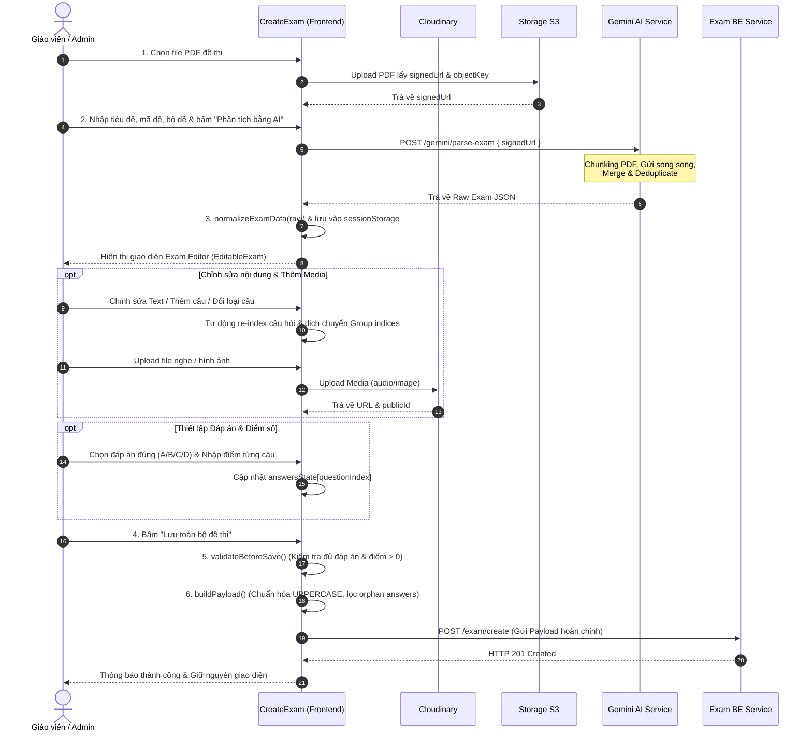

# 📝 Tài Liệu Thiết Kế & Luồng Hoạt Động Của Exam Editor (Frontend)

> **Tài liệu này mô tả chi tiết kiến trúc, luồng xử lý dữ liệu và toàn bộ logic nghiệp vụ của trình chỉnh sửa đề thi (Exam Editor) trên Frontend sau khi hệ thống AI (Gemini) phân tích và trả về cấu trúc đề thi từ file PDF.**

---

## 📑 Mục Lục

1. [Tổng Quan Kiến Trúc & Luồng Dữ Liệu](#1-tổng-quan-kiến-trúc--luồng-dữ-liệu)
2. [Cấu Trúc Dữ Liệu & State Management](#2-cấu-trúc-dữ-liệu--state-management)
3. [Giai Đoạn 1: Tiếp Nhận & Chuẩn Hóa Dữ Liệu AI (Normalization)](#3-giai-đoạn-1-tiếp-nhận--chuẩn-hóa-dữ-liệu-ai-normalization)
4. [Giai Đoạn 2: Cây Component & Trình Soạn Thảo Phân Cấp](#4-giai-đoạn-2-cây-component--trình-soạn-thảo-phân-cấp)
   - [4.1 Container & Header Actions](#41-container--header-actions)
   - [4.2 PartEditor (Quản lý Phần thi)](#42-parteditor-quản-lý-phần-thi)
   - [4.3 GroupEditor (Quản lý Nhóm câu hỏi & Bài đọc)](#43-groupeditor-quản-lý-nhóm-câu-hỏi--bài-đọc)
   - [4.4 QuestionEditor (Quản lý Câu hỏi & Đáp án)](#44-questioneditor-quản-lý-câu-hỏi--đáp-án)
5. [Cơ Chế Điều Phối Index Tự Động (Auto-Reindexing & Index Shifting)](#5-cơ-chế-điều-phối-index-tự-động-auto-reindexing--index-shifting)
6. [Quản Lý Media & Upload Đa Cấp (Cloudinary)](#6-quản-lý-media--upload-đa-cấp-cloudinary)
7. [Quản Lý Đáp Án & Thang Điểm (Answers & Points State)](#7-quản-lý-đáp-án--thang-điểm-answers--points-state)
8. [Validation & Chuẩn Hóa Payload Trước Khi Lưu (Submission Pipeline)](#8-validation--chuẩn-hóa-payload-trước-khi-lưu-submission-pipeline)
9. [Cơ Chế Lưu Trữ Tạm & Khôi Phục (SessionStorage Draft)](#9-cơ-chế-lưu-trữ-tạm--khôi-phục-sessionstorage-draft)
10. [Sơ Đồ Trình Tự Tổng Thể (Sequence Diagram)](#10-sơ-đồ-trình-tự-tổng-thể-sequence-diagram)
11. [Danh Mục File Mã Nguồn Tham Chiếu](#11-danh-mục-file-mã-nguồn-tham-chiếu)

---

## 1. Tổng Quan Kiến Trúc & Luồng Dữ Liệu

Quy trình tạo đề thi bằng AI bắt đầu từ khi người dùng tải lên file đề thi PDF và kết thúc khi đề thi được lưu thành công vào cơ sở dữ liệu. 

```
┌────────────────────────────────────────────────────────────────────────────────────────┐
│                                FRONTEND (Next.js App)                                  │
│                                                                                        │
│  [1. Upload PDF] ──> S3/MinIO (Signed URL)                                            │
│        │                                                                               │
│        ▼                                                                               │
│  [2. Trigger Parse] ──> POST /gemini/parse-exam { signedUrl }                          │
│                                │                                                       │
│                                ▼                                                       │
│                     [3. Raw JSON Response]                                             │
│                                │                                                       │
│                                ▼                                                       │
│                     [4. normalizeExamData()]                                           │
│                                │                                                       │
│        ┌───────────────────────┴───────────────────────┐                               │
│        ▼                                               ▼                               │
│  [examState] (Cấu trúc đề)                  [sessionStorage] (Draft backup)           │
│        │                                                                               │
│        ▼                                                                               │
│  ┌──────────────────────────────────────────────────────────────────────────────┐     │
│  │                    EXAM EDITOR HIERARCHY (Component Tree)                    │     │
│  │                                                                              │     │
│  │   CreateExam (Root Controller & Action Bar)                                  │     │
│  │     └── EditableExam (Root Part Loop)                                        │     │
│  │           └── PartEditor (Tiêu đề, Mô tả Part, Part Media)                    │     │
│  │                 ├── GroupEditor (Đoạn văn đọc hiểu, Gán indices, Group Media)│     │
│  │                 └── QuestionEditor (Câu hỏi, Options, Đáp án đúng, Điểm)     │     │
│  │                       └── MediaUploader / MediaRender                        │     │
│  └──────────────────────────────────────────────────────────────────────────────┘     │
│        │                                                                               │
│        ▼                                                                               │
│  [5. Validation & Payload Building] (Validate answers, points, strip orphan keys)      │
│        │                                                                               │
│        ▼                                                                               │
│  [6. Save Exam] ──> POST /exam/create                                                  │
└────────────────────────────────────────────────────────────────────────────────────────┘
```

---

## 2. Cấu Trúc Dữ Liệu & State Management

Trình soạn thảo hoạt động dựa trên sự phân tách rõ ràng giữa **Nội dung cấu trúc đề thi (`examState`)** và **Thông tin chấm điểm (`answersState`)**.

### 2.1 State `examState` (`ExamData`)

Chứa toàn bộ cây dữ liệu cấu trúc đề thi:

```typescript
export interface ExamData {
  hasParts: boolean;
  parts: Part[];
}

export interface Part {
  partIndex: number;               // Thứ tự phần thi (1, 2, ...)
  partTitle: string;               // Tiêu đề phần (vd: "Listening Section 1")
  partDescription: string | null;  // Hướng dẫn làm bài chung của phần
  questionType?: string;           // mixed | single_choice | multiple_choice | essay
  mediaPlaceholders: MediaPlaceholder[]; // Media dùng chung cho cả Part
  questionGroups: QuestionGroup[]; // Nhóm câu hỏi đọc hiểu / nghe hiểu chung đoạn văn
  questions: Question[];           // Danh sách câu hỏi trực thuộc Part
}

export interface QuestionGroup {
  groupInstruction: string;        // Đoạn văn đọc hiểu / bài khóa ngữ cảnh
  questionIndices: number[];       // Mảng các số thứ tự câu hỏi thuộc nhóm này (vd: [1, 2, 3])
  mediaPlaceholders: MediaPlaceholder[] | null; // Media dành riêng cho bài đọc
}

export interface Question {
  questionIndex: number;           // Số thứ tự câu hỏi (duy nhất toàn bài, vd: 1, 2, 3...)
  questionText: string;            // Nội dung câu hỏi
  questionType: string;            // SINGLE_CHOICE | MULTIPLE_CHOICE | TRUE_FALSE | FILL_IN_THE_BLANK | ESSAY
  options: Option[] | null;        // Mảng lựa chọn A, B, C, D (null nếu là ESSAY)
  mediaPlaceholders: MediaPlaceholder[] | null; // Hình ảnh / audio đính kèm từng câu
}

export interface Option {
  label: string;                   // "A", "B", "C", "D", ...
  text: string;                    // Nội dung văn bản của phương án
}

export interface MediaPlaceholder {
  mediaType: "image" | "audio" | "video";
  description: string;
  url: string;                     // Cloudinary URL
  publicId: string;                // Cloudinary Public ID (dùng khi xóa file)
}
```

### 2.2 State `answersState` (`Record<number, AnswerItem>`)

Lưu trữ riêng biệt cấu hình đáp án đúng và điểm số cho từng câu hỏi, đánh index theo `questionIndex`:

```typescript
type AnswersState = Record<number, {
  correctAnswer: string[]; // Mảng nhãn đáp án đúng (vd: ["A"] hoặc ["A", "C"], hoặc text đối với Essay/Điền từ)
  points: number;          // Điểm của câu (step 0.25)
}>;
```

> [!NOTE]
> Việc tách `answersState` riêng khỏi `examState` giúp:
> 1. Tránh lồng ghép dữ liệu nhạy cảm của bảng đáp án trực tiếp vào cây `parsedJson` của đề thi.
> 2. Độc lập validate điểm số và đáp án mà không cần duyệt đệ quy qua toàn bộ cây Parts/Questions.

---

## 3. Giai Đoạn 1: Tiếp Nhận & Chuẩn Hóa Dữ Liệu AI (Normalization)

Khi AI hoàn tất phân tích đề từ PDF, Backend trả về payload thô (`rawData`). Hàm `normalizeExamData(rawData)` sẽ tiến hành tiền xử lý để đảm bảo dữ liệu tương thích 100% với giao diện Frontend.

```
AI Output (Raw JSON)
        │
        ▼
normalizeExamData()
  ├── 1. Khởi tạo giá trị mặc định nếu thiếu (hasParts: false, parts: [])
  ├── 2. Chuẩn hóa Parts: gán partIndex, partTitle, fallback description
  ├── 3. Chuẩn hóa QuestionGroups: đảm bảo questionGroups luôn là Array, rà soát questionIndices
  └── 4. Chuẩn hóa Questions & Options:
        ├── Gán questionIndex (1-based)
        ├── Chuyển đổi options từ string array ["Option 1", "Option 2"]
        │   thành Object array [{ label: "A", text: "Option 1" }, { label: "B", text: "Option 2" }]
        └── Thiết lập questionType mặc định nếu trống
```

### Logic Xử Lý Trong `normalizeExamData.ts`:

```typescript
export const normalizeExamData = (raw: any): ExamData => {
  if (!raw) return { hasParts: false, parts: [] };

  return {
    hasParts: !!raw.hasParts,
    parts: (raw.parts || []).map((part: any, pIdx: number): Part => ({
      partIndex: part.partIndex || pIdx + 1,
      partTitle: part.partTitle || part.title || "",
      partDescription: part.partDescription || part.description || part.instruction || "",
      questionType: part.questionType || "mixed",
      mediaPlaceholders: part.mediaPlaceholders || [],
      questionGroups: (part.questionGroups || []).map((g: any): QuestionGroup => ({
        groupInstruction: g.groupInstruction || "",
        questionIndices: g.questionIndices || [],
        mediaPlaceholders: g.mediaPlaceholders || []
      })),
      questions: (part.questions || []).map((q: any, qIdx: number): Question => ({
        questionIndex: q.questionIndex || qIdx + 1,
        questionText: q.questionText || "",
        questionType: q.questionType || "multiple_choice",
        mediaPlaceholders: q.mediaPlaceholders || [],
        options: Array.isArray(q.options)
          ? q.options.map((opt: any, oIdx: number) => {
              if (typeof opt === 'string') {
                return { label: String.fromCharCode(65 + oIdx), text: opt };
              }
              return {
                label: opt.label || String.fromCharCode(65 + oIdx),
                text: opt.text || ""
              };
            })
          : null
      }))
    }))
  };
};
```

Sau khi chuẩn hóa:
- Cập nhật state: `setExamState(normalized)`
- Lưu vào bộ nhớ tạm: `sessionStorage.setItem("sampleData1", JSON.stringify(normalized))`
- Reset bảng đáp án: `setAnswersState({})`
- Kích hoạt thông báo thành công và chuyển giao diện sang chế độ chỉnh sửa (Editable mode).

---

## 4. Giai Đoạn 2: Cây Component & Trình Soạn Thảo Phân Cấp

Giao diện trình chỉnh sửa được phân bổ theo mô hình cây 4 tầng:

```
CreateExam (Root Page)
 └── EditableExam
      └── PartEditor (Phần thi)
           ├── GroupEditor (Nhóm câu hỏi / Đoạn văn đọc hiểu)
           └── QuestionEditor (Chi tiết câu hỏi, lựa chọn, đáp án)
```

### 4.1 Container & Header Actions (`CreateExam`)
- **Cột trái**: Form thông tin chung (Tiêu đề đề thi, Mã đề thi - tags, Chọn Bộ đề, Checkbox có bài Tự luận, Khu vực upload PDF và nút "Phân tích bằng AI").
- **Cột phải**: Khu vực soạn thảo trực quan.
  - Khi đang parse: Hiển thị `<Spin />` hiệu ứng chờ AI quét đề.
  - Khi chưa có dữ liệu: Hiển thị Empty state hướng dẫn người dùng.
  - Khi đã có dữ liệu: Hiển thị `EditableExam` cùng thanh công cụ trên đầu (Nút **Xóa dữ liệu cũ**, Nút **Lưu toàn bộ đề thi**).

---

### 4.2 PartEditor (Quản lý Phần thi)

Mỗi Part đại diện cho một phần thi độc lập (ví dụ: *Part 1: Nghe hiểu*, *Part 2: Đọc hiểu*, *Part 3: Viết luận*).

| Tính Năng | Logic Xử Lý |
|---|---|
| **Đổi tiêu đề & Hướng dẫn** | Cập nhật `part.partTitle` và `part.partDescription` thông qua `updatePart(partIndex, updatedPart)`. |
| **Xóa Part** | Lọc bỏ Part tại vị trí xóa và tự động **re-index lại toàn bộ `partIndex`** (`i + 1`). |
| **Media của Part** | Cho phép upload file Audio hoặc Ảnh chung cho cả Part (ví dụ: Audio nghe cho toàn bộ Section). Hỗ trợ upload lên Cloudinary và xóa file trên cloud. |
| **Thêm Nhóm câu hỏi mới** | Khởi tạo object `QuestionGroup` rỗng: `{ groupInstruction: "", questionIndices: [], mediaPlaceholders: null }` và đẩy vào `part.questionGroups`. |

---

### 4.3 GroupEditor (Quản lý Nhóm câu hỏi & Bài đọc)

Dành cho các câu hỏi cùng sử dụng chung một bài đọc, đoạn hội thoại hoặc ngữ cảnh.

```
┌────────────────────────────────────────────────────────────────────────┐
│ Nhóm câu: [ 1 ] [ 2 ] [ 3 ] ──(Antd Select tags)─── [Xóa nhóm (Button)]│
├────────────────────────────────────────────────────────────────────────┤
│ [TextArea] Văn bản đọc hiểu / Ngữ cảnh chung cho nhóm câu...           │
├────────────────────────────────────────────────────────────────────────┤
│ [Media Uploader & Render] File âm thanh / Hình ảnh ngữ cảnh (nếu có)   │
└────────────────────────────────────────────────────────────────────────┘
```

#### Logic Chống Trùng Lặp Index Giữa Các Nhóm (`Collision Prevention`):
Khi người dùng gõ hoặc chọn số câu gán vào nhóm:
1. Lấy toàn bộ danh sách câu hỏi đã được gán vào các nhóm khác: `allOtherUsedIndices = part.questionGroups.filter(g != this).flatMap(g => g.questionIndices)`.
2. Kiểm tra xem index mới có nằm trong `allOtherUsedIndices` không.
3. Nếu phát hiện trùng lặp:
   - Hiển thị thông báo lỗi: `message.error("Câu X đã nằm trong nhóm khác!")`.
   - Tự động loại bỏ các index bị trùng khỏi danh sách nhập.
   - Sắp xếp tăng dần và loại trừ phần tử trùng lặp: `[...new Set(validIndices)].sort((a,b) => a - b)`.

---

### 4.4 QuestionEditor (Quản lý Câu hỏi & Đáp án)

Mỗi câu hỏi hỗ trợ cấu hình đầy đủ từ nội dung, loại câu hỏi, danh sách phương án đến đáp án đúng và điểm số.

#### A. Hỗ trợ 5 Loại Câu Hỏi (`QuestionType`):
1. **`SINGLE_CHOICE`** (Trắc nghiệm 1 đáp án đúng): Hiển thị danh sách Options (A, B, C, D). Dropdown chọn 1 đáp án đúng duy nhất.
2. **`MULTIPLE_CHOICE`** (Trắc nghiệm nhiều đáp án đúng): Hiển thị Options. Dropdown chọn đa đáp án (`mode="multiple"`).
3. **`TRUE_FALSE`** (Đúng / Sai): Tự động cấu hình 2 lựa chọn A (Đúng) và B (Sai).
4. **`FILL_IN_THE_BLANK`** (Điền vào chỗ trống): Ô nhập văn bản đáp án mẫu.
5. **`ESSAY`** (Tự luận): Ẩn khu vực options. Thay ô chọn đáp án bằng ô **Gợi ý / Từ khóa đáp án** cho giáo viên chấm thi.

#### B. Chỉnh Sửa Options Nhanh:
- Giao diện dạng 2 cột (Grid layout) với tag nhãn cố định (A, B, C, D...).
- Thay đổi nội dung option trực tiếp qua borderless input.

---

## 5. Cơ Chế Điều Phối Index Tự Động (Auto-Reindexing & Index Shifting)

Khi thêm hoặc xóa câu hỏi ở giữa đề thi, toàn bộ thứ tự câu hỏi và liên kết trong các nhóm đọc hiểu (`QuestionGroup`) phải được cập nhật đồng bộ để tránh sai lệch bài làm.

### 5.1 Thêm Câu Hỏi Mới Phía Trên (`addQuestion`)

```typescript
const addQuestion = (index: number, type: string) => {
    const newQuestion: Question = {
        questionIndex: 0, // Sẽ được reindex ngay sau đó
        questionText: "Nội dung câu hỏi mới...",
        questionType: type.toUpperCase(),
        options: type === 'essay' ? null : [
            { label: "A", text: "Lựa chọn 1" },
            { label: "B", text: "Lựa chọn 2" },
            { label: "C", text: "Lựa chọn 3" },
            { label: "D", text: "Lựa chọn 4" }
        ],
        mediaPlaceholders: [],
    };

    const newQuestions = [...part.questions];
    // 1. Chèn câu mới vào vị trí index
    newQuestions.splice(index, 0, newQuestion);

    // 2. Dịch chuyển các index trong QuestionGroups (các câu >= vị trí chèn sẽ tăng 1)
    const insertedIndex = index + 1; // 1-based index
    const newGroups = (part.questionGroups || []).map(g => {
        const newIndices = g.questionIndices?.map(idx => idx >= insertedIndex ? idx + 1 : idx);
        return { ...g, questionIndices: newIndices || [] };
    });

    // 3. Re-index lại toàn bộ danh sách câu hỏi
    updatePart(partIndex, { 
        ...part, 
        questions: reindex(newQuestions),
        questionGroups: newGroups 
    });
};
```

### 5.2 Xóa Câu Hỏi (`removeQuestion`)

```typescript
const removeQuestion = (index: number) => {
    const deletedQuestionIndex = part.questions[index].questionIndex;
    const newQuestions = part.questions.filter((_, i) => i !== index);
    
    // 1. Xóa index của câu bị xóa khỏi các QuestionGroup
    // 2. Dịch giảm các index đứng sau nó đi 1 đơn vị
    const newGroups = (part.questionGroups || []).map(g => {
        const newIndices = g.questionIndices
            ?.filter(idx => idx !== deletedQuestionIndex)
            .map(idx => idx > deletedQuestionIndex ? idx - 1 : idx);
        return { ...g, questionIndices: newIndices || [] };
    });

    // 3. Re-index lại toàn bộ danh sách câu hỏi còn lại
    updatePart(partIndex, { 
        ...part, 
        questions: reindex(newQuestions),
        questionGroups: newGroups
    });
};
```

---

## 6. Quản Lý Media & Upload Đa Cấp (Cloudinary)

Hệ thống cho phép đính kèm tệp đa phương tiện (Hình ảnh, Âm thanh) tại 3 cấp độ:
1. **Part Media**: Âm thanh/hình ảnh mở đầu cho cả phần thi.
2. **Group Media**: File nghe hoặc sơ đồ đọc hiểu chung của nhóm câu.
3. **Question Media**: Hình ảnh sơ đồ, biểu đồ riêng của từng câu hỏi.

```
┌─────────────────────────────────────────────────────────────┐
│                    Upload Flow to Cloudinary                │
│                                                             │
│  User chọn file ──> MediaUploader                           │
│        │                                                    │
│        ▼                                                    │
│  useUploadFileCloudinary() ──> Cloudinary API               │
│        │                                                    │
│        ▼                                                    │
│  Nhận response { url, publicId, resourceType }             │
│        │                                                    │
│        ▼                                                    │
│  Tạo MediaPlaceholder:                                      │
│  {                                                          │
│    mediaType: resourceType === 'video' ? 'audio' : 'image', │
│    description: 'Uploaded file',                            │
│    url: data.url,                                           │
│    publicId: data.publicId                                  │
│  }                                                          │
│        │                                                    │
│        ▼                                                    │
│  Gán vào MediaPlaceholders của Part / Group / Question      │
└─────────────────────────────────────────────────────────────┘
```

Khi người dùng nhấn nút Xóa Media:
- Hệ thống gọi mutation `useDeleteFileCloudinary` với `publicId` và `resourceType` tương ứng để giải phóng dung lượng trên Cloudinary.
- Loại bỏ item khỏi mảng `mediaPlaceholders` trong state cục bộ.

---

## 7. Quản Lý Đáp Án & Thang Điểm (Answers & Points State)

Khu vực nhập đáp án đúng và điểm số được đặt nổi bật ở cuối mỗi thẻ câu hỏi:

```
┌──────────────────────────────────────────────────────────────────────────────────────────┐
│  ĐÁP ÁN ĐÚNG                                                          │ ĐIỂM             │
│  ┌─────────────────────────────────────────────────────────────────┐  │ ┌──────────────┐ │
│  │ [Dropdown Select (A, B, C, D) / Input Text cho Tự luận/Điền từ] │  │ │ 0.50 (step)  │ │
│  └─────────────────────────────────────────────────────────────────┘  │ └──────────────┘ │
└──────────────────────────────────────────────────────────────────────────────────────────┘
```

- **Đối với trắc nghiệm 1 đáp án (`SINGLE_CHOICE`, `TRUE_FALSE`)**: Dropdown cho phép chọn 1 nhãn (A/B/C/D). Giá trị lưu vào `correctAnswer: [val]`.
- **Đối với trắc nghiệm nhiều đáp án (`MULTIPLE_CHOICE`)**: Dropdown dạng multiple tags. Giá trị lưu vào `correctAnswer: [val1, val2, ...]`.
- **Đối với câu điền khuyết / tự luận (`FILL_IN_THE_BLANK`, `ESSAY`)**: Input Text cho phép nhập chuỗi đáp án gợi ý hoặc từ khóa chính xác.
- **Trường Điểm (`points`)**: Input số có step `0.25`, giá trị tối thiểu `0`.

---

## 8. Validation & Chuẩn Hóa Payload Trước Khi Lưu (Submission Pipeline)

Trước khi gửi dữ liệu lên máy chủ để tạo bản ghi đề thi hoàn chỉnh, hệ thống thực hiện quy trình kiểm tra và chuẩn hóa nghiêm ngặt.

### 8.1 Quy Trình Kiểm Tra Tính Hợp Lệ (`validateBeforeSave`)

```
Bắt đầu Kiểm Tra
       │
       ▼
examState có tồn tại không? ──[Không]──> Báo lỗi & Chặn
       │
       ▼
Duyệt qua từng Part & từng Question:
       ├── 1. Kiểm tra tồn tại: answersState[q.questionIndex] có tồn tại không?
       │        └── [Không] ──> message.error("Câu X chưa có điền thông tin điểm")
       │
       ├── 2. Kiểm tra đáp án đúng (Bắt buộc với câu Trắc nghiệm):
       │        └── [Trống] ──> message.error("Chưa nhập đáp án cho câu X")
       │
       └── 3. Kiểm tra điểm số:
                └── [points <= 0 hoặc undefined] ──> message.error("Câu X chưa nhập điểm hợp lệ")
       │
       ▼
Tất cả hợp lệ? ──[Có]──> Tiến hành buildPayload()
```

### 8.2 Chuẩn Hóa Payload (`buildPayload`)

Quy trình chuẩn hóa giải quyết các vấn đề:
1. Chuyển đổi toàn bộ `questionType` sang dạng **IN HOA** (`UPPERCASE`) để đồng bộ với Database Enum Backend.
2. Ánh xạ `q.questionIndex` (Frontend) sang `q.questionNumber` (Backend).
3. **Loại bỏ các đáp án mồ côi (Orphan Answer Cleanup)**: Nếu người dùng đã nhập điểm cho câu 5, sau đó xóa câu 5, `answersState` có thể còn lưu key `5`. Hệ thống sử dụng `validQuestionIndices = new Set(...)` để lọc bỏ hoàn toàn các key không còn tồn tại trong cây câu hỏi thực tế.

```typescript
const buildPayload = (objectKey: string): ExamBody => {
    const values = form.getFieldsValue();

    const normalizedParts = (examState?.parts || []).map(part => ({
        ...part,
        questionType: part.questionType?.toUpperCase(),
        questions: part.questions.map(q => ({
            ...q,
            questionNumber: q.questionIndex,
            questionType: q.questionType?.toUpperCase()
        }))
    }));

    const validQuestionIndices = new Set(
        normalizedParts.flatMap(part => part.questions.map(q => q.questionIndex))
    );

    return {
        title: values.title,
        examSetId: values.examSetId,
        examCodes: values.examCodes || [],
        objectKey,
        parsedJson: { parts: normalizedParts },
        answers: Object.entries(answersState)
            .filter(([questionNumber]) => validQuestionIndices.has(Number(questionNumber)))
            .map(([questionNumber, value]: any) => ({
                questionNumber: Number(questionNumber),
                correctAnswer: value.correctAnswer,
                points: value.points || 0,
            })),
        hasEssay: values.hasEssay || false,
    };
};
```

---

## 9. Cơ Chế Lưu Trữ Tạm & Khôi Phục (SessionStorage Draft)

Nhằm bảo vệ trải nghiệm người dùng tránh mất dữ liệu khi vô tình reload trang:
- **Tự động lưu draft**: Ngay sau khi AI parse xong, dữ liệu được lưu vào `sessionStorage.setItem("sampleData1", JSON.stringify(normalized))`.
- **Tự động khôi phục**: Trong hook `useEffect` khi mount component, nếu tìm thấy dữ liệu trong `sessionStorage`, tự động parse và gán vào `examState`.
- **Hành động Xóa Dữ Liệu Cũ (`handleReset`)**: Hiển thị popup xác nhận (`Modal.confirm`). Khi người dùng đồng ý:
  1. Xóa toàn bộ key trong `sessionStorage` (`parsedExamData`, `sampleData1`).
  2. Reset các state React: `setExamState(null)`, `setAnswersState({})`, `setObjectKey(null)`, `setSignedUrl(null)`.
  3. Reset toàn bộ form Ant Design (`form.resetFields()`).

---

## 10. Sơ Đồ Trình Tự Tổng Thể (Sequence Diagram)



---

## 11. Danh Mục File Mã Nguồn Tham Chiếu

| File | Đường Dẫn | Vai Trò |
|---|---|---|
| **Trang Tạo Đề Admin** | [page.tsx](file:///f:/Project/ITEST/itest_fe/src/app/admin/exam/create/page.tsx) | Controller chính, quản lý Form, xử lý upload PDF, gọi AI parse, validate & save |
| **Trang Bộ Đề Giáo Viên** | [page.tsx](file:///f:/Project/ITEST/itest_fe/src/app/teacher/examSet/page.tsx) | Quản lý bộ đề, tích hợp tab tạo đề và ngân hàng câu hỏi |
| **Exam Editor Wrapper** | [exam-editor.tsx](file:///f:/Project/ITEST/itest_fe/src/app/admin/exam/create/editors/exam-editor.tsx) | Render danh sách Part và nút thêm Part mới |
| **Part Editor** | [part-editor.tsx](file:///f:/Project/ITEST/itest_fe/src/app/admin/exam/create/editors/part-editor.tsx) | Quản lý thông tin Part, Part Media, Nhóm câu hỏi & Danh sách câu hỏi |
| **Group Editor** | [group-editor.tsx](file:///f:/Project/ITEST/itest_fe/src/app/admin/exam/create/editors/group-editor.tsx) | Quản lý đoạn văn đọc hiểu, gán tags indices với cơ chế chống trùng |
| **Question Editor** | [question-editor.tsx](file:///f:/Project/ITEST/itest_fe/src/app/admin/exam/create/editors/question-editor.tsx) | Quản lý chi tiết câu hỏi, options, đổi type, thêm/xóa câu với auto-reindex, đáp án & điểm |
| **Media Render** | [media-render.tsx](file:///f:/Project/ITEST/itest_fe/src/app/admin/exam/create/editors/media-render.tsx) | Hiển thị trình phát Audio / Ảnh kèm nút xóa |
| **Media Uploader** | [media-uploader.tsx](file:///f:/Project/ITEST/itest_fe/src/app/admin/exam/create/editors/media-uploader.tsx) | Component tải file lên Cloudinary |
| **Data Normalizer** | [normalizeExam.ts](file:///f:/Project/ITEST/itest_fe/src/shares/utils/normalizeExam.ts) | Chuẩn hóa JSON từ AI sang cấu trúc chuẩn TypeScript |
| **Object Types** | [object.ts](file:///f:/Project/ITEST/itest_fe/src/shares/types/object.ts) | Định nghĩa các Interface `ExamData`, `Part`, `QuestionGroup`, `Question`, `Option`, `MediaPlaceholder` |
| **Gemini BE Service** | [gemini.service.ts](file:///f:/Project/ITEST/itest_be/src/modules/gemini/gemini.service.ts) | Logic Backend xử lý chia chunk PDF, gọi Gemini API và deduplicate câu hỏi |
