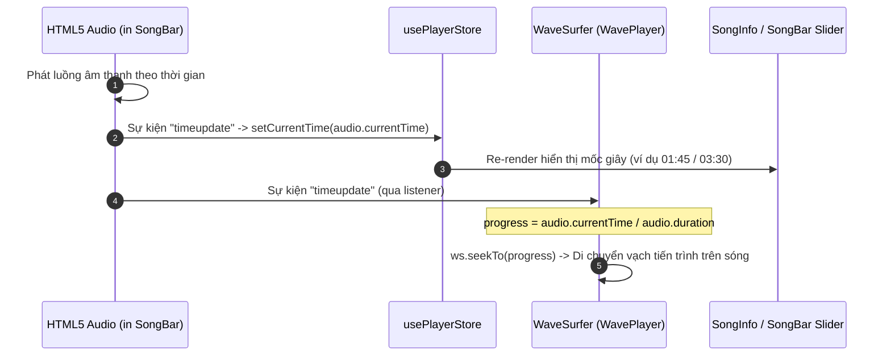
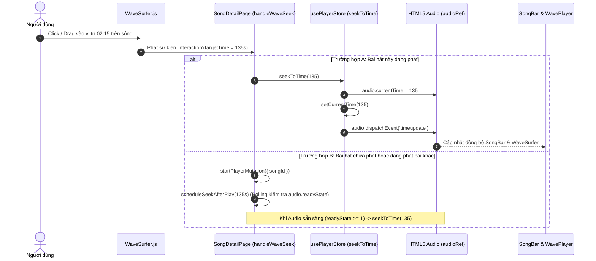
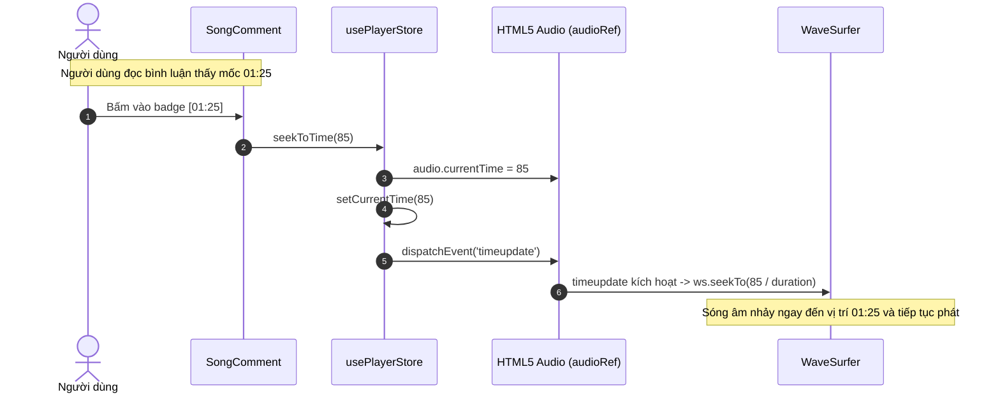

# Luồng Đồng Bộ Hai Chiều (Two-Way Sync): WaveSurfer, SongBar, SongInfo & Comment Marker

Tài liệu này mô tả chi tiết kiến trúc và luồng dữ liệu **Đồng bộ hai chiều (Two-Way Synchronization)** giữa các thành phần phát nhạc trong dự án **NOVAWAVE**, bao gồm: **SongBar (HTML5 Audio Player)**, **WaveSurfer (WavePlayer)**, **Trang Chi Tiết Bài Hát (SongDetailPage)** và **Hệ thống Bình luận (SongComment & Avatar Markers)**.

---

## 1. Tổng Quan Kiến Trúc & Triết Lý Thiết Kế

Hệ thống phát nhạc của NOVAWAVE sử dụng mô hình **Single Source of Truth** kết hợp với **Event-Driven Reactive Sync**:

1. **Single Source of Truth**:
   - **Zustand Store** ([usePlayerStore.ts](file:///f:/Project/NOVAWAVE/novawave_fe/src/stores/usePlayerStore.ts)): Nơi lưu trữ trạng thái tập trung (`status`, `isPlaying`, `currentTime`, `audioRef`).
   - **HTML5 Audio Element** (`audioRef` được host bên trong [song-bar.tsx](file:///f:/Project/NOVAWAVE/novawave_fe/src/components/client/Player/song-bar.tsx)): Quản lý stream audio thực tế.
2. **Visualizer Layer**:
   - **WaveSurfer.js** ([wave-player.tsx](file:///f:/Project/NOVAWAVE/novawave_fe/src/components/client/WavePlayer/wave-player.tsx)): Chỉ đóng vai trò hiển thị sóng âm thanh (Canvas) và tiếp nhận tương tác kéo/tua sóng từ người dùng. `WaveSurfer` **không** phát audio độc lập để tránh xung đột hai luồng âm thanh cùng lúc.
3. **Interactive Overlay Layer**:
   - **Comment Markers**: Render avatar của người bình luận trực tiếp lên thanh sóng theo tỷ lệ phần trăm thời gian (`playbackPositionSec / duration * 100`).
   - **Comment Timestamps**: Cho phép người dùng bấm vào mốc thời gian trong bình luận để nhảy ngay đến đoạn nhạc đó.

```
                  ┌─────────────────────────────────────────┐
                  │          usePlayerStore (Zustand)       │
                  │  - currentTime, isPlaying, audioRef     │
                  │  - seekToTime(time), setCurrentTime()   │
                  └───────────────▲─────────▲───────────────┘
                                  │         │
                   (Dispatch Seek)│         │ (Update Time)
                                  │         │
    ┌─────────────────────────────┼─────────┴─────────────────────────────┐
    │                             │                                       │
┌───┴────────────────────────┐ ┌──┴─────────────────────────┐ ┌───────────┴───────────────┐
│     SongBar (HTML5 Audio)  │ │   WavePlayer (WaveSurfer)  │ │   SongDetailPage/Comment  │
│ - Host <audio> element     │ │ - Canvas hiển thị sóng âm  │ │ - Avatar Markers trên sóng│
│ - Phát sinh 'timeupdate'   │ │ - Bắt sự kiện 'interaction'│ │ - Nút bấm nhảy timestamp  │
│ - Tiến trình thanh progress│ │ - Tua kéo sóng âm          │ │ - Tạo comment kèm timeSec │
└────────────────────────────┘ └────────────────────────────┘ └───────────────────────────┘
```

---

## 2. Danh Sách Các File & Component Tham Gia

| STT | File / Component | Đường dẫn | Trách nhiệm |
|---|---|---|---|
| 1 | `usePlayerStore` | [src/stores/usePlayerStore.ts](file:///f:/Project/NOVAWAVE/novawave_fe/src/stores/usePlayerStore.ts) | Store quản lý toàn bộ trạng thái bài hát, tham chiếu `audioRef`, hàm `seekToTime`. |
| 2 | `SongBar` | [src/components/client/Player/song-bar.tsx](file:///f:/Project/NOVAWAVE/novawave_fe/src/components/client/Player/song-bar.tsx) | Component thanh phát nhạc cố định dưới đáy màn hình, đăng ký `audioRef` vào store và lắng nghe `timeupdate`. |
| 3 | `WavePlayer` | [src/components/client/WavePlayer/wave-player.tsx](file:///f:/Project/NOVAWAVE/novawave_fe/src/components/client/WavePlayer/wave-player.tsx) | Khởi tạo `WaveSurfer.create()`, render sóng âm thanh, vẽ các nút Avatar Comment Markers trên sóng, xử lý `interaction` event. |
| 4 | `SongDetailPage` | [src/app/(client)/song/[id]/page.tsx](file:///f:/Project/NOVAWAVE/novawave_fe/src/app/(client)/song/[id]/page.tsx) | Trang chi tiết bài hát, chuyển đổi dữ liệu bình luận thành `commentMarkers`, xử lý logic `handleWaveSeek` và xếp lịch tua khi bắt đầu phát bài mới (`scheduleSeekAfterPlay`). |
| 5 | `SongComment` | [src/app/(client)/song/[id]/song-comment.tsx](file:///f:/Project/NOVAWAVE/novawave_fe/src/app/(client)/song/[id]/song-comment.tsx) | Danh sách bình luận, tự động đính kèm `Math.floor(currentTime)` khi gửi bình luận mới, render badge timestamp có thể click để tua. |

---

## 3. Chi Tiết Các Luồng Đồng Bộ (Sync Flows)

### Luồng 1: Đồng bộ Xuôi (Audio Playback ➔ WaveSurfer & UI)

Khi bài hát đang được phát bình thường:



- **Mã nguồn thực thi**:
  - Tại [song-bar.tsx (Dòng 134-148)](file:///f:/Project/NOVAWAVE/novawave_fe/src/components/client/Player/song-bar.tsx#L134-L148):
    ```ts
    useEffect(() => {
      const audio = audioRef;
      if (!audio) return;
      const handleTimeUpdate = () => {
        if (isCurrentAd) return;
        setCurrentTime(audio.currentTime);
      };
      audio.addEventListener('timeupdate', handleTimeUpdate);
      return () => audio.removeEventListener('timeupdate', handleTimeUpdate);
    }, [audioRef, isCurrentAd, setCurrentTime]);
    ```
  - Tại [wave-player.tsx (Dòng 94-108)](file:///f:/Project/NOVAWAVE/novawave_fe/src/components/client/WavePlayer/wave-player.tsx#L94-L108):
    ```ts
    useEffect(() => {
      if (!audioRef || !isPlaying || !isThisSongPlaying) return;
      const handleTimeUpdate = () => {
        const ws = wavesurferRef.current;
        if (!ws || !ws.getDuration() || !audioRef) return;
        const progress = audioRef.currentTime / (audioRef.duration || 1);
        ws.seekTo(progress);
      };
      audioRef.addEventListener("timeupdate", handleTimeUpdate);
      return () => audioRef.removeEventListener("timeupdate", handleTimeUpdate);
    }, [audioRef, isPlaying, isThisSongPlaying]);
    ```

---

### Luồng 2: Đồng bộ Ngược (Tương tác trên WaveSurfer ➔ Audio Element & UI)

Khi người dùng click hoặc kéo (drag-to-seek) trực tiếp trên thanh sóng âm thanh:



- **Mã nguồn thực thi**:
  - Tại [usePlayerStore.ts (Dòng 34-45)](file:///f:/Project/NOVAWAVE/novawave_fe/src/stores/usePlayerStore.ts#L34-L45):
    ```ts
    seekToTime: (time) => {
        const audio = get().audioRef;
        if (audio) {
            audio.currentTime = time;
            get().setCurrentTime(time);
            // Dispatch timeupdate event để các component khác đồng bộ ngay tức khắc
            const timeupdate = new Event('timeupdate');
            audio.dispatchEvent(timeupdate);
        }
    }
    ```
  - Tại [page.tsx (Dòng 172-196)](file:///f:/Project/NOVAWAVE/novawave_fe/src/app/(client)/song/[id]/page.tsx#L172-L196):
    ```ts
    const handleWaveSeek = useCallback((newTime: number) => {
        if (!song) return;
        if (song._id === currentPlayingId) {
            seekToTime(newTime);
            return;
        }
        // Nếu bài chưa phát: Gọi phát bài và đặt lịch tua sau khi player sẵn sàng
        startPlayerMutation({ songId: song._id }, {
            onSuccess: () => scheduleSeekAfterPlay(newTime),
        });
    }, [song, currentPlayingId, seekToTime, startPlayerMutation, scheduleSeekAfterPlay]);
    ```

---

### Luồng 3: Avatar Markers trên thanh sóng WaveSurfer

Hiển thị avatar của người dùng tại các vị trí mốc thời gian bình luận trên sóng âm thanh:

```mermaid
graph TD
    A[Query Comments: useCommentList] --> B[Filter Comment: playbackPositionSec >= 0]
    B --> C[Map thành commentMarkers: { id, timeSec, avatarUrl }]
    C --> D[Truyền vào WavePlayer: props.commentMarkers]
    D --> E[Tính tọa độ phần trăm: leftPct = timeSec / waveDuration * 100]
    E --> F[Render Avatar Buttons dạng Absolute Overlay]
    F --> G[Người dùng click Avatar trên thanh sóng]
    G --> H[onSeekRef.current: timeSec -> Kích hoạt Luồng 2 Tua Nhạc]
```

1. **Chuẩn bị dữ liệu Marker**:
   - Trong [page.tsx (Dòng 138-149)](file:///f:/Project/NOVAWAVE/novawave_fe/src/app/(client)/song/[id]/page.tsx#L138-L149), dữ liệu comment từ React Query được filter và map thành danh sách markers:
   ```ts
   const commentMarkers = useMemo(() => {
       const rows = (commentsForWave?.data ?? []) as Comment[];
       return rows
           .filter((c): c is Comment & { playbackPositionSec: number } =>
               typeof c.playbackPositionSec === "number" && c.playbackPositionSec >= 0
           )
           .map((c) => ({
               id: c._id,
               timeSec: c.playbackPositionSec,
               avatarUrl: c.userId?.avatar,
           }));
   }, [commentsForWave]);
   ```

2. **Render UI trên sóng WaveSurfer**:
   - Trong [wave-player.tsx (Dòng 129-159)](file:///f:/Project/NOVAWAVE/novawave_fe/src/components/client/WavePlayer/wave-player.tsx#L129-L159), mỗi marker được tính toán tọa độ theo tỉ lệ tổng độ dài sóng `waveDuration`:
   ```tsx
   {waveDuration > 0 &&
     commentMarkers.map((m) => {
       const t = Math.min(Math.max(0, m.timeSec), waveDuration - 0.01);
       const leftPct = (t / waveDuration) * 100;
       return (
         <button
           key={m.id ?? `${m.timeSec}-${m.avatarUrl ?? ""}`}
           type="button"
           title={`${Math.floor(t / 60)}:${String(Math.floor(t % 60)).padStart(2, "0")}`}
           className="absolute bottom-0 z-10 -translate-x-1/2 transform rounded-full border-2 border-[#1DB954] bg-black/40 shadow-[0_0_8px_rgba(29,185,84,0.6)] transition hover:scale-110"
           style={{ left: `${leftPct}%`, width: 28, height: 28 }}
           onClick={(e) => {
             e.stopPropagation();
             onSeekRef.current?.(m.timeSec);
           }}
         >
           {m.avatarUrl ? (
             
           ) : (
             <span className="flex h-full w-full items-center justify-center text-[10px] font-bold text-white">·</span>
           )}
         </button>
       );
   })}
   ```

---

### Luồng 4: Tương tác từ Danh Sách Bình Luận (Click Timestamp ➔ Tua Nhạc)

Khi người dùng xem danh sách bình luận phía dưới và bấm vào nút timestamp (ví dụ: `01:15`):



1. **Gửi bình luận kèm mốc thời gian**:
   - Khi gửi bình luận mới, hệ thống tự động ghi nhận vị trí phát nhạc hiện tại `currentTime`:
   - [song-comment.tsx (Dòng 64-66)](file:///f:/Project/NOVAWAVE/novawave_fe/src/app/(client)/song/[id]/song-comment.tsx#L64-L66):
     ```ts
     createComment({
         songId,
         content,
         playbackPositionSec: Math.floor(currentTime || 0)
     }, { ... });
     ```

2. **Bấm Timestamp để Tua**:
   - [song-comment.tsx (Dòng 147-155)](file:///f:/Project/NOVAWAVE/novawave_fe/src/app/(client)/song/[id]/song-comment.tsx#L147-L155):
     ```tsx
     {typeof c.playbackPositionSec === "number" && c.playbackPositionSec >= 0 && (
         <button
             type="button"
             className="ml-1 rounded-full border border-green px-2 py-0.5 text-xs text-green transition hover:bg-green hover:text-black"
             onClick={() => seekToTime(c.playbackPositionSec)}
         >
             {formatDuration(c.playbackPositionSec)}
         </button>
     )}
     ```

---

## 4. Cơ Chế Xử Lý Ngoại Lệ & Tối Ưu Hóa (Edge Cases & Optimizations)

### 1. Chống Vòng Lặp Vô Hạn (Infinite Sync Loop Prevention)
- Khi `audioRef` phát `timeupdate` ➔ `WaveSurfer` nhận và gọi `seekTo`.
- Nếu `WaveSurfer` lại tiếp tục bắn ra `interaction` hoặc `seek` event thì sẽ tạo thành vòng lặp vô tận.
- **Giải pháp**:
  - `WaveSurfer` chỉ kích hoạt hàm tua khi người dùng **trực tiếp tương tác** qua sự kiện `interaction` (chứ không dùng sự kiện `seek` nội bộ).
  - Kiểm tra độ chênh lệch ngưỡng trước khi ép vị trí sóng ([wave-player.tsx L115-119](file:///f:/Project/NOVAWAVE/novawave_fe/src/components/client/WavePlayer/wave-player.tsx#L115-L119)):
    ```ts
    const diff = Math.abs(ws.getCurrentTime() - currentTime);
    if (diff > 0.5) {
      ws.seekTo(currentTime / ws.getDuration());
    }
    ```

### 2. Xử Lý Tua Khi Player Chưa Sẵn Sàng (Lazy Seek Scheduling)
- Khi người dùng bấm tua một bài hát chưa phát, bài hát cần được nạp stream audio trước. Việc gán `audio.currentTime` ngay khi audio chưa sẵn sàng (`readyState === 0`) sẽ bị trình duyệt bỏ qua hoặc gây lỗi `InvalidStateError`.
- **Giải pháp**: Dùng cơ chế Polling `scheduleSeekAfterPlay` thăm dò `audio.readyState >= 1` trước khi thực thi tua ([page.tsx L151-170](file:///f:/Project/NOVAWAVE/novawave_fe/src/app/(client)/song/[id]/page.tsx#L151-L170)):
  ```ts
  const scheduleSeekAfterPlay = useCallback((targetSec: number) => {
      let attempts = 0;
      const tick = () => {
          const audio = getAudioRef();
          if (audio && audio.readyState >= 1) {
              seekToTime(targetSec);
              return;
          }
          attempts += 1;
          if (attempts < 40) {
              window.setTimeout(tick, 50); // Polling mỗi 50ms (tối đa 2s)
          } else {
              seekToTime(targetSec);
          }
      };
      window.setTimeout(tick, 0);
  }, [getAudioRef, seekToTime]);
  ```

### 3. Bảo Vệ Khi Đang Phát Quảng Cáo
- Nếu tài khoản miễn phí đang nghe quảng cáo (`isCurrentAd === true`), toàn bộ tính năng tua bài (trên sóng, trên thanh slider, hoặc qua nút bấm timestamp ở comment) đều bị chặn để đảm bảo doanh thu quảng cáo:
  ```ts
  if (isCurrentAd) {
      toast.info("Nghe nhạc free thì chịu nghe quảng cáo đi");
      return;
  }
  ```

### 4. Cleanup & Tránh Memory Leak
- `WavePlayer` được tải qua `next/dynamic` với `ssr: false` nhằm tránh lỗi `window is not defined` trên server.
- Hàm cleanup trong `useEffect` luôn gọi `ws.destroy()` và gỡ bỏ toàn bộ event listeners khi component unmount hoặc khi đổi bài hát `url`.

---

## 5. Bảng Tóm Tắt Tương Tác Giữa Các Thành Phần

| Hành Động Của User | Component Bắt Đầu | Luồng Lan Truyền | Kết Quả Cuối Cùng |
|---|---|---|---|
| Đang nghe nhạc | `SongBar` (Audio) | `Audio.timeupdate` ➔ `usePlayerStore.currentTime` ➔ `WavePlayer.ws.seekTo()` | Sóng âm thanh và thanh thời gian chạy đồng bộ mượt mà |
| Click/Kéo sóng âm | `WavePlayer` | `WaveSurfer.on('interaction')` ➔ `SongDetailPage.handleWaveSeek` ➔ `usePlayerStore.seekToTime` ➔ `Audio.currentTime` | Nhạc nhảy đến vị trí mới, thanh SongBar và Comment cập nhật |
| Click Avatar trên sóng | `WavePlayer` | Button Marker onClick ➔ `onSeek(m.timeSec)` ➔ `usePlayerStore.seekToTime` | Nhạc nhảy đến mốc thời gian của comment tương ứng |
| Click Timestamp ở bình luận | `SongComment` | Button Timestamp onClick ➔ `usePlayerStore.seekToTime(c.playbackPositionSec)` | Nhạc nhảy đến vị trí comment, thanh sóng di chuyển theo |
| Gửi bình luận mới | `SongComment` | Đọc `currentTime` từ `usePlayerStore` ➔ Gửi API kèm `playbackPositionSec` | Bình luận xuất hiện và avatar lập tức đính lên thanh sóng |
